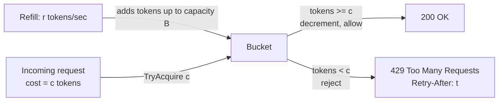
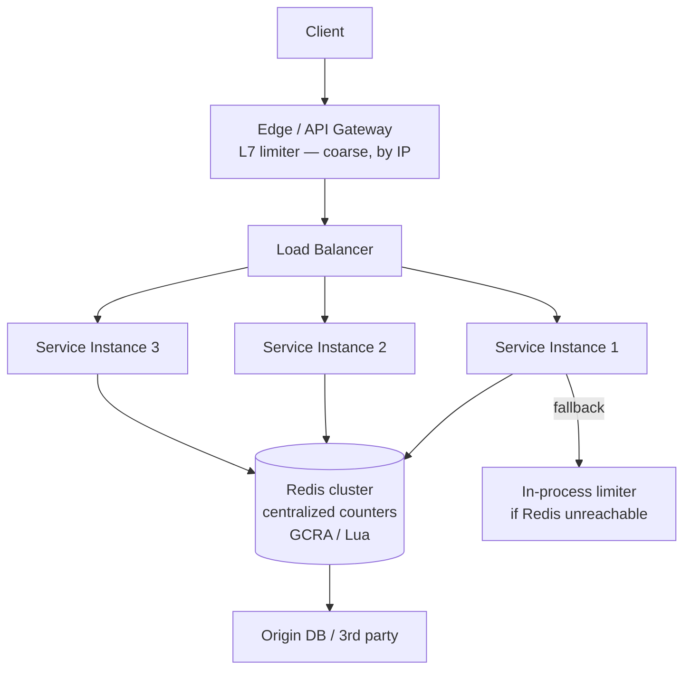
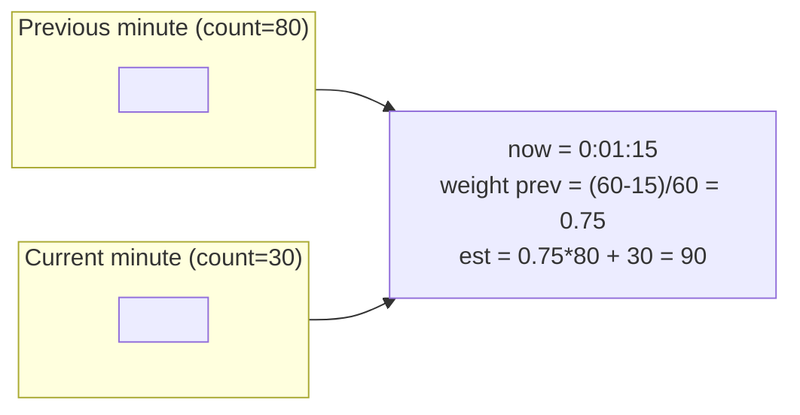
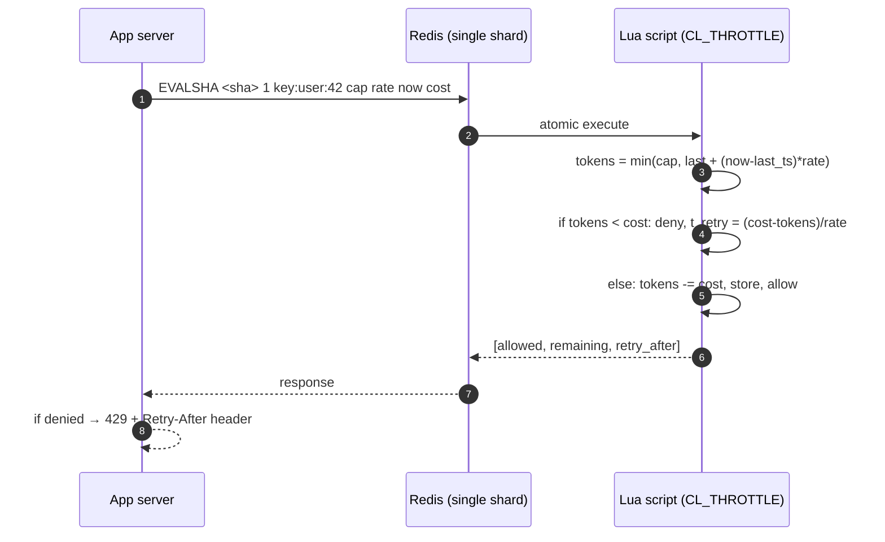

# Rate Limiter

## Why This Exists

**Problem.** Every public-facing API eventually faces traffic it cannot serve: a misbehaving client looping on retries, a noisy neighbor consuming a shared resource pool, a credential-stuffing attack, or an integration that just discovered your endpoint and decided to do 10k QPS. Without a limiter, the slowest dependency saturates, queues fill, GC pauses lengthen, p99 climbs into seconds, and **load shedding becomes a death spiral** because clients retry harder when they see failures.

**Key insight.** A rate limiter is not just throttling — it is a **fairness and admission control mechanism**. The hard parts are not the algorithms (token bucket fits in 20 lines) but: (1) where to keep state so it is correct under concurrency and partial failure, (2) what dimension to limit on (user, tenant, IP, route, method, cost), (3) what the client should do on rejection so the system converges instead of oscillating, and (4) how to fail open vs closed when the limiter itself breaks.

**Reach for this when:**
- You have a multi-tenant API and one tenant can degrade others ("noisy neighbor").
- You proxy a third-party API with a hard quota (Stripe, Twilio, OpenAI) and must shape egress.
- You have an expensive endpoint (search, AI inference, report generation) where unbounded concurrency = OOM.
- Login / signup / password-reset endpoints need brute-force protection.
- You need predictable cost (LLM tokens, S3 PUTs, SMS sends) per customer plan tier.

**Don't reach for this when:**
- You actually want **load shedding under overload** (drop oldest / lowest-priority requests when CPU > X). Use a concurrency limiter with adaptive AIMD (Netflix's `concurrency-limits`) or LIFO queues — a fixed RPS limit cannot adapt to changing capacity.
- You want **circuit breaking** to a failing dependency. Use a circuit breaker (Hystrix-style) — a rate limiter does not detect downstream health.
- You want **fair queueing** across thousands of tenants. Use weighted fair queueing or stochastic fair queueing — a per-tenant token bucket alone does not bound aggregate.
- The bottleneck is **CPU on a single box** and you control both client and server. A semaphore / bounded thread pool is simpler.

## Diagrams

### Token bucket — the canonical model



### Where the limiter lives



### Sliding window counter — bucket boundaries explained



### Distributed limiter — atomic check-and-decrement



## Algorithms — the five you must know cold

### 1. Token bucket (Stripe, AWS API Gateway, Envoy default)

Bucket of capacity `B` refills at rate `r` tokens/sec. Each request costs `c` tokens. Allows **bursts up to B** then sustains `r`. Most flexible, most common.

```python
import time, threading

class TokenBucket:
    def __init__(self, capacity: float, refill_rate: float):
        self.capacity = capacity        # max burst
        self.rate = refill_rate         # tokens per second sustained
        self.tokens = capacity
        self.last = time.monotonic()
        self.lock = threading.Lock()    # required: refill is read-modify-write

    def try_acquire(self, cost: float = 1.0) -> tuple[bool, float]:
        """Returns (allowed, retry_after_seconds)."""
        with self.lock:
            now = time.monotonic()
            # Lazy refill — don't run a background timer; just compute on access.
            # This avoids one-thread-per-bucket and clock drift between refills.
            elapsed = now - self.last
            self.tokens = min(self.capacity, self.tokens + elapsed * self.rate)
            self.last = now

            if self.tokens >= cost:
                self.tokens -= cost
                return True, 0.0
            # How long until enough tokens accumulate?
            deficit = cost - self.tokens
            return False, deficit / self.rate
```

**Bursting matters.** If `B == r` you have effectively a leaky bucket — no burst tolerance. Most APIs set `B = 2r` to `10r` so a client doing periodic batched calls is not punished.

### 2. Leaky bucket (as a queue)

Requests enter a FIFO queue of size `B`, drained at rate `r`. Smooths bursts into a constant rate. Used in **traffic shaping** (network QoS, SMS gateways). Latency cost: requests wait. Reject when queue full.

```python
from collections import deque
import asyncio, time

class LeakyBucket:
    def __init__(self, capacity: int, leak_rate_per_sec: float):
        self.capacity = capacity
        self.interval = 1.0 / leak_rate_per_sec
        self.queue: deque = deque()
        self.lock = asyncio.Lock()

    async def submit(self, work):
        async with self.lock:
            if len(self.queue) >= self.capacity:
                raise RateLimitExceeded()
            fut = asyncio.get_event_loop().create_future()
            self.queue.append((work, fut))
            if len(self.queue) == 1:
                asyncio.create_task(self._drain())
        return await fut

    async def _drain(self):
        while True:
            async with self.lock:
                if not self.queue:
                    return
                work, fut = self.queue.popleft()
            fut.set_result(await work())
            await asyncio.sleep(self.interval)
```

**Token bucket vs leaky bucket — common confusion.** Both regulate to rate `r`. The difference:
- **Token bucket** rejects (or returns 429) immediately when bucket empty. **Bursty allowed.**
- **Leaky bucket** queues and adds latency. **Output rate is constant.**

If you want clients to retry, use token bucket. If you must protect a downstream that breaks above rate `r` (e.g. a fax machine), use leaky bucket.

### 3. Fixed window counter

Increment a counter per `(key, window_id)` where `window_id = floor(now / window_size)`. Reject when counter > limit. **Simplest, but boundary-burst problem:** a client doing 100 req at 0:59.999 and 100 req at 1:00.001 sends 200 req in ~2ms while staying within "100/min."

```lua
-- Redis fixed window — DO NOT use in production for tight limits.
-- Subject to the boundary burst attack above.
local key = KEYS[1]
local limit = tonumber(ARGV[1])
local window = tonumber(ARGV[2])  -- seconds

local count = redis.call('INCR', key)
if count == 1 then
    redis.call('EXPIRE', key, window)
end
if count > limit then
    return {0, count}  -- denied
end
return {1, count}      -- allowed
```

Use only when you genuinely want calendar windows (e.g. "100 sends per UTC day per customer plan tier") and the boundary attack is acceptable.

### 4. Sliding log

Store every request timestamp in a sorted set. Count entries in `[now - window, now]`. **Exact** — no boundary issues, no approximation. **Expensive** — O(N) memory per key, where N = limit. At 10k req/min/user × 1M users this is gigabytes.

```lua
-- Sliding log via Redis ZSET
local key = KEYS[1]
local now = tonumber(ARGV[1])
local window = tonumber(ARGV[2])
local limit = tonumber(ARGV[3])

redis.call('ZREMRANGEBYSCORE', key, 0, now - window)
local count = redis.call('ZCARD', key)
if count >= limit then
    return {0, count}
end
redis.call('ZADD', key, now, now .. '-' .. math.random())  -- unique member
redis.call('EXPIRE', key, math.ceil(window / 1000))
return {1, count + 1}
```

Reach for this only when accuracy is critical (billing, security, compliance) and N is small.

### 5. Sliding window counter (CloudFlare's choice)

Two fixed windows; weight the previous one by how much of the current window has elapsed. **Approximation**, but with bounded error and O(1) memory.

```python
def sliding_window_count(prev_count, curr_count, now, window_size):
    # Fraction of the previous window still "in scope"
    elapsed_in_curr = now % window_size
    weight = (window_size - elapsed_in_curr) / window_size
    return prev_count * weight + curr_count
```

CloudFlare reports < 0.003% error vs sliding log on real traffic and uses this in production for its 400+ Tbps edge ([CloudFlare blog: "How we built rate limiting capable of scaling to millions of domains"](https://blog.cloudflare.com/counting-things-a-lot-of-different-things/)).

## The Redis production pattern: GCRA (redis-cell)

The **Generic Cell Rate Algorithm** (originally ATM networking, ITU-T I.371) is a token-bucket equivalent that requires only **a single timestamp** per key — not a counter, not a log. Brandur Leach's [redis-cell](https://github.com/brandur/redis-cell) module implements `CL.THROTTLE` as one Redis command, atomic by virtue of single-threaded Redis execution.

```text
CL.THROTTLE user:42:posts 15 30 60 1
                          │  │  │  │
                          │  │  │  └─ cost (default 1)
                          │  └──┴──── 30 actions per 60 seconds
                          └────────── max burst (capacity - 1)

Reply: 1) 0       # 0 = allowed, 1 = denied
       2) 16      # total bucket capacity
       3) 15      # remaining
       4) -1      # retry-after (seconds), -1 if allowed
       5) 2       # reset (seconds until full)
```

Why GCRA over a naive Lua token bucket:
- **One key, one float** — a "theoretical arrival time" (TAT). No separate counter and timestamp.
- **No clock skew issues across instances** — math is virtual time.
- **Atomic** — Redis Lua / module execution serializes commands on a key.

If you cannot run the C module, here is the Lua equivalent that ships with several frameworks (this is the algorithm behind Stripe's [public rate limit blog post](https://stripe.com/blog/rate-limiters)):

```lua
-- gcra.lua — atomic GCRA, single round trip
-- KEYS[1]: bucket key
-- ARGV[1]: rate_period (seconds per token, e.g. 0.1 for 10/sec)
-- ARGV[2]: burst (max tokens beyond rate)
-- ARGV[3]: cost
-- ARGV[4]: now (microseconds — pass from app, do NOT use redis TIME for sharding)

local key   = KEYS[1]
local emission_interval = tonumber(ARGV[1]) * 1e6  -- microseconds per token
local burst = tonumber(ARGV[2])
local cost  = tonumber(ARGV[3])
local now   = tonumber(ARGV[4])

local burst_offset = emission_interval * burst
local tat = tonumber(redis.call('GET', key)) or now

-- Theoretical arrival time of the *next* request after this one
local new_tat = math.max(tat, now) + emission_interval * cost
local allow_at = new_tat - burst_offset

if now < allow_at then
    -- Denied. Tell caller exactly when to retry.
    local retry_after_us = allow_at - now
    return {0, math.ceil(retry_after_us / 1e6)}
end

-- Allowed. Persist new TAT with a TTL = burst window + headroom.
local ttl_sec = math.ceil((new_tat - now) / 1e6) + 1
redis.call('SET', key, new_tat, 'EX', ttl_sec)
return {1, 0}
```

**Always pass `now` from the app**, not `redis.call('TIME')`. If you ever shard or replicate, time-dependent Lua is **not deterministic** and replication breaks. (Redis docs explicitly warn about this — see [Redis: scripting](https://redis.io/docs/latest/develop/programmability/eval-intro/#scripts-with-deterministic-writes-a-historical-note).)

## HTTP semantics — what to send the client

```http
HTTP/1.1 429 Too Many Requests
Content-Type: application/json
Retry-After: 12
RateLimit-Limit: 100
RateLimit-Remaining: 0
RateLimit-Reset: 12
X-RateLimit-Policy: 100;w=60;burst=200

{
  "error": {
    "type": "rate_limit_exceeded",
    "message": "Too many requests for resource users.list. Retry after 12s.",
    "retry_after": 12,
    "request_id": "req_01HZ..."
  }
}
```

- **`Retry-After`** is RFC 9110 §10.2.3. Either delta-seconds (preferred for APIs) or HTTP-date.
- **`RateLimit-*`** headers are the IETF draft ([draft-ietf-httpapi-ratelimit-headers](https://datatracker.ietf.org/doc/draft-ietf-httpapi-ratelimit-headers/)) — GitHub, Stripe, Twitter all ship variants. Stable enough to use.
- **Status code:** `429 Too Many Requests` (RFC 6585) for rate limits. Use `503` only when **the entire service** is overloaded, with `Retry-After`. Use `503` (not 429) for shedding under capacity overload — this is a meaningful distinction for clients.
- **Body must include retry guidance + request id**. Without a request id, support tickets are unsolvable.

## Client retry — the pair to the limiter

A limiter without correct client retry behavior **causes** the outage it was meant to prevent. The classic failure mode: client gets 429, retries immediately, gets another 429, retries faster (because "the response was quick"), thundering-herd. Stripe's blog calls this out explicitly.

Required client behavior:

```python
import random, time, requests

def call_with_retry(url, max_attempts=5):
    base, cap = 0.5, 30.0  # base 500ms, cap 30s
    for attempt in range(max_attempts):
        r = requests.post(url, timeout=10)
        if r.status_code != 429 and r.status_code < 500:
            return r
        # Honor server's hint if present, else exponential backoff w/ full jitter
        retry_after = r.headers.get('Retry-After')
        if retry_after:
            sleep = float(retry_after)
        else:
            # AWS Architecture Blog "Exponential Backoff And Jitter" — full jitter wins
            sleep = random.uniform(0, min(cap, base * 2 ** attempt))
        time.sleep(sleep)
    raise RetryExhausted(url)
```

**Full jitter** (`random.uniform(0, base * 2^n)`) beats "equal jitter" and "decorrelated jitter" in simulations for *contention reduction* — see Marc Brooker's [AWS post](https://aws.amazon.com/blogs/architecture/exponential-backoff-and-jitter/). Without jitter, every retrying client wakes up simultaneously and the next thundering herd hits at exactly your refilled bucket.

## Where to limit — layered defense

Real systems put limits at multiple layers, each catching what the layer below cannot afford:

| Layer | Granularity | Purpose | Tool |
|---|---|---|---|
| Edge / CDN | Per IP, per ASN, per country | DDoS, scraping bots, L4 floods | CloudFlare, AWS WAF, Fastly, ALB |
| API Gateway | Per API key, per route | Plan tier enforcement, coarse | Kong, Envoy, AWS API Gateway, NGINX `limit_req` |
| App service | Per user, per tenant, per resource id, per cost-unit | Fairness, fine-grained policy | In-app limiter + Redis |
| Database / downstream | Per connection, per query class | Protect the slowest layer | PgBouncer, connection pools, semaphores |

A login endpoint typically gets **three** limits stacked: per-IP at edge (e.g. 1k/min), per-username at app (5/min), per-account at app (20/hour). Each defends against a different attack: bot-net spray, targeted credential stuffing, slow-burn enumeration.

## Distributed coordination — the hard part

For a fleet of N app instances each handling part of a tenant's traffic, you have three architectures:

**(1) Centralized counter (Redis Lua / GCRA).** Every request hits Redis. Latency: 0.5–2ms p99 in-region. Throughput per shard: ~100k ops/sec. **Default choice for most APIs.** Failure mode: Redis unavailability → fail open with local fallback (allow but log) or fail closed (reject all) — depends on threat model.

**(2) Per-instance local limiter, no coordination.** Each instance enforces `limit / N`. Simple, fast (in-process). Bad when traffic is unbalanced (sticky sessions, hash-based routing, hotspot tenant). Hard to reconfigure on autoscale events.

**(3) Hybrid (token-leasing).** Instance pulls a chunk of tokens from Redis (e.g. 100 at a time), enforces locally until depleted, then pulls again. Reduces Redis load 100x. Cost: looser global accuracy at low rates. Used in Lyft's Envoy, AWS SDK adaptive retry mode.

```python
class LeasingLimiter:
    """Pulls tokens in batches from Redis to amortize round-trips."""
    def __init__(self, redis, key, batch=100):
        self.redis, self.key, self.batch = redis, key, batch
        self.local = 0
        self.lease_lock = threading.Lock()

    def acquire(self):
        if self.local > 0:
            self.local -= 1
            return True
        with self.lease_lock:
            if self.local > 0:                       # double-check after lock
                self.local -= 1
                return True
            granted = self._lease_from_redis(self.batch)
            if granted == 0:
                return False
            self.local = granted - 1
            return True
```

## Picking the dimension to limit on

A limit keyed wrong is worse than no limit. Common keys, in order of preference for an authenticated API:

1. **Authenticated principal** (user_id, api_key_id, tenant_id). Best — correlates to billing.
2. **Account / tenant** (parent of user). Catches "tenant runs 1000 users to bypass per-user limit."
3. **Route + principal** (e.g. `POST /search` separate from `GET /users`). Lets you tune expensive routes.
4. **IP** (last resort, for unauthenticated traffic). Defeated by NATs (corporate offices, mobile carriers) and proxies. **Never** as the only key for authenticated users — one office IP shares a quota.
5. **Cost units, not requests.** A search query might cost 10 units; a `GET /health` costs 0. Stripe rate-limits by both **request count** AND **read/write weight**.

The right answer is usually **multiple keys, ANDed**: `(user_id, route)` AND `(tenant_id, total)` AND `(ip)`. First one to reject wins.

## Trade-offs

| Benefit | Cost |
|---|---|
| Token bucket — bursts allowed for bursty workloads (batch jobs, page loads) | Tuning `B` is a judgment call — too high lets attackers burst, too low frustrates legit clients |
| Leaky bucket queue — perfectly smooth output rate | Adds latency; failures hide in queues; queue size is a memory cost |
| Fixed window — trivially simple, O(1) | Boundary burst attack — 2x your stated limit at window edges |
| Sliding log — exact, no approximation | O(N) memory per key — does not scale to high limits or many keys |
| Sliding window counter — O(1) memory, < 1% error | Approximate (matters for billing/auditing, not for protection) |
| GCRA / redis-cell — single key, atomic, no race | Harder to read for newcomers; debugging by-hand requires understanding TAT math |
| Centralized Redis — globally accurate | Single-shard hotspot when one tenant dominates one key; cross-region latency for global limits |
| Token-leasing — 100x fewer Redis ops | Loose accuracy at low traffic; instance crash loses leased tokens (over-allow window) |
| Edge / CDN limit — fast, cheap, stops L4 floods | Coarse — only IP-level, not user-level |
| In-app per-user limit — fair across tenants | Costs a Redis hop per request — adds 0.5–2ms p99 |

## Common Pitfalls

- **Race condition on read-then-write.** `GET counter; if counter < limit: INCR counter` is wrong — two concurrent requests both read 99, both write 100, both pass. **Always use atomic** `INCR` then check, or Lua/MULTI for compound operations. This bug is in production at half the small-team APIs you've ever used.

- **Fail-open silently when Redis is down.** Limiter exception → log → allow → attacker discovers Redis is the chokepoint and DDoS's Redis instead of the API. Decide explicitly: fail open with rate-limited *logging* and an alert, or fail closed and accept the unavailability.

- **Calling Redis `TIME` inside Lua.** Breaks with replication and Cluster — Redis treats time-dependent scripts as non-deterministic. Always pass `now` from the application, accept ~clock-skew error.

- **Unbounded TTL on counters.** Redis fills up with stale per-user keys. Always `EXPIRE` proportional to window. For `redis-cell` / GCRA the algorithm computes TTL automatically; for hand-rolled, set `EXPIRE` = window + slack.

- **Forgetting to limit the limiter itself.** If `429` response generation costs you 5ms, a 1M req/sec attack still consumes 5000 cores. Reject **early in the request lifecycle** — at L7 / connection level — before parsing body, allocating context, or reading auth tokens.

- **Limiting on `X-Forwarded-For` without trust validation.** If you key on the leftmost `X-Forwarded-For` IP and any client can set that header, attackers rotate it per request and bypass the limiter. Only trust headers from your edge tier; strip/overwrite them at ingress.

- **No `Retry-After` header.** Without it, well-behaved clients with exponential backoff still hammer you longer than necessary, and naive clients retry instantly forever.

- **Same limit for read and write paths.** A `GET /users/me` costs 0.1ms and a `POST /export-everything` costs 30s. Sharing a quota means write attacks consume read budget. Use cost-weighted limits or separate buckets.

- **No observability.** When a customer complains "I'm getting 429s," you need to know: which key tripped, what limit, current count, time-to-reset. Emit a metric `rate_limit_decision{key_type, route, decision}` and a structured log on every denial.

- **Limit applied before authentication.** Now an unauthenticated attacker fills your auth-key bucket and the legitimate user with that key gets 429s. Authenticate first when possible, then key on the authenticated principal — but rate limit unauthenticated traffic by IP **separately and tightly**.

- **Reset-on-deploy.** In-process limiters lose state on restart → during a rolling deploy a client that was throttled gets full burst capacity again on each new pod. This is the single biggest reason to centralize state in Redis.

## Decision Table

| Situation | Choose | Why |
|---|---|---|
| Public API, mixed workloads, single region | **Token bucket in Redis (GCRA / redis-cell)** | Bursts, exact-enough, atomic, well-understood |
| Need exact count for billing or compliance | **Sliding log** | Approximation is unacceptable |
| Want to smooth output to a fixed downstream rate (SMS, fax, legacy system) | **Leaky bucket queue** | Constant output, latency cost is acceptable here |
| Edge protection against DDoS / scrapers | **Fixed window or sliding window at CDN/WAF** | Cheap, fast, coarse-grained — accuracy matters less than throughput |
| Multi-region API with global quota | **Centralized Redis in one region + leasing** OR **regional sub-quotas summing to global** | Pure central is too slow cross-region; pure regional cannot enforce global |
| Per-tenant fairness across thousands of tenants | **Token bucket per tenant + global concurrency limiter** | Per-tenant alone does not bound aggregate; concurrency limiter caps total in-flight |
| Internal RPC between trusted services | **Concurrency limiter (semaphore) + circuit breaker** | RPS is the wrong metric inside trusted edges; concurrency is what kills you |
| LLM / GPU inference API | **Cost-weighted token bucket on tokens-per-minute, not requests-per-minute** | Request count is meaningless when one request varies 100x in cost |
| Login / auth path | **Layered: per-IP edge + per-username + per-account, all stricter than normal** | Each catches a different attack class |
| You don't trust Redis availability | **Local token bucket (instance-local) + central as source of truth** | Fail-open path with bounded over-allow |
| You're shedding load due to overload, not fairness | **Adaptive concurrency limiter (Netflix)**, not RPS limit | Capacity changes; static limits cannot follow it |

## References

- Stripe Engineering — *Scaling your API with rate limiters* — https://stripe.com/blog/rate-limiters
- GitHub Engineering — *Rate limits and pagination on the REST API* — https://docs.github.com/en/rest/using-the-rest-api/rate-limits-for-the-rest-api
- CloudFlare Blog — *How we built rate limiting capable of scaling to millions of domains* — https://blog.cloudflare.com/counting-things-a-lot-of-different-things/
- Brandur Leach — *Rate limiting, cells, and GCRA* — https://brandur.org/rate-limiting
- redis-cell module (CL.THROTTLE) — https://github.com/brandur/redis-cell
- Marc Brooker (AWS) — *Exponential Backoff And Jitter* — https://aws.amazon.com/blogs/architecture/exponential-backoff-and-jitter/
- AWS Builders' Library — *Using load shedding to avoid overload* — https://aws.amazon.com/builders-library/using-load-shedding-to-avoid-overload/
- AWS Builders' Library — *Avoiding fallback in distributed systems* — https://aws.amazon.com/builders-library/avoiding-fallback-in-distributed-systems/
- AWS Builders' Library — *Timeouts, retries, and backoff with jitter* — https://aws.amazon.com/builders-library/timeouts-retries-and-backoff-with-jitter/
- Google SRE Book — *Handling Overload* (ch. 21) — https://sre.google/sre-book/handling-overload/
- Google SRE Book — *Addressing Cascading Failures* (ch. 22) — https://sre.google/sre-book/addressing-cascading-failures/
- Google SRE Workbook — *Managing Load* (ch. 11) — https://sre.google/workbook/managing-load/
- Netflix Tech Blog — *Performance Under Load* (adaptive concurrency limits) — https://netflixtechblog.medium.com/performance-under-load-3e6fa9a60581
- IETF draft — *RateLimit header fields for HTTP* — https://datatracker.ietf.org/doc/draft-ietf-httpapi-ratelimit-headers/
- RFC 6585 — *Additional HTTP Status Codes* (429) — https://datatracker.ietf.org/doc/html/rfc6585
- RFC 9110 — *HTTP Semantics* (Retry-After §10.2.3) — https://datatracker.ietf.org/doc/html/rfc9110#section-10.2.3
- ITU-T I.371 — *Traffic control and congestion control in B-ISDN* (origin of GCRA) — https://www.itu.int/rec/T-REC-I.371
- Envoy Proxy — *Global rate limiting* — https://www.envoyproxy.io/docs/envoy/latest/intro/arch_overview/other_features/global_rate_limiting
- NGINX — *Rate Limiting with NGINX* — https://blog.nginx.org/blog/rate-limiting-nginx
- Alex Xu — *System Design Interview Volume 1*, ch. 4 "Design a Rate Limiter"
- Designing Data-Intensive Applications (Kleppmann) — ch. 8 "The Trouble with Distributed Systems" (clock skew, partial failure context)

## See Also

- `../../communication/api-gateway/` — gateway-tier rate limiting and quota enforcement
- `../../performance/caching/` — cache hits do not need to count against limits
- `../../reliability/circuit-breaker/` — complement to rate limiting; trips on downstream failure, not request volume
- `../../reliability/load-shedding/` — what to do when overloaded beyond what limits can prevent
- `../../communication/idempotency/` — required when clients retry on 429 and 5xx
- `../../security/multi-tenancy/` — fairness, noisy neighbor isolation, per-tenant quotas
