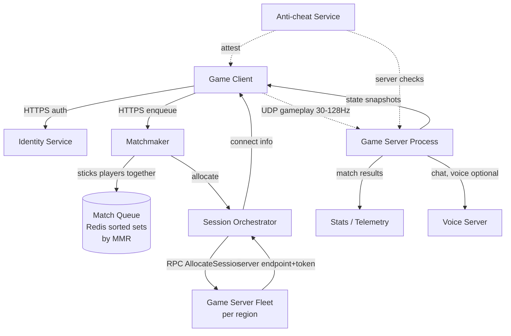
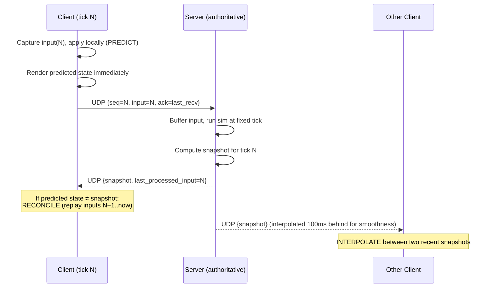
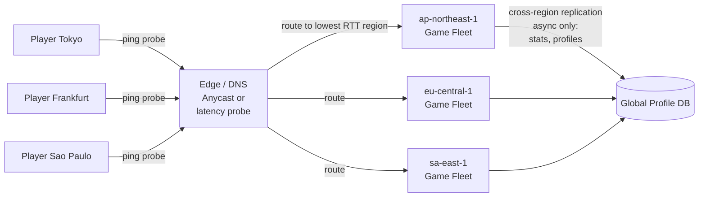
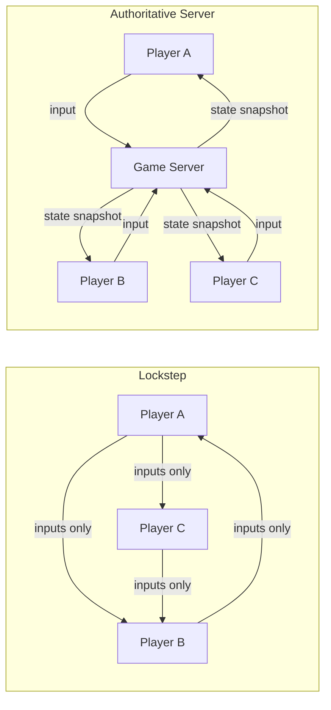

# Realtime Gaming Backend

## Why This Exists

**Problem.** A realtime game has a budget of roughly **one frame** (~16ms at 60fps, ~33ms at 30fps) to: capture input, send it across the internet, simulate physics on a server, and display the result. The real internet routinely delivers **40–150ms RTT**, with packet loss of 0.1–5% and jitter of 5–50ms. Naive request/response over TCP collapses into a slideshow. Get this wrong and the game **feels broken** even when nothing has crashed.

**Key insight.** Realtime games do not optimize for correctness — they optimize for **perceived responsiveness under adversarial network conditions**. The client *lies* (predicts), the server *corrects* (reconciles), and you accept that two players will briefly disagree about the world. The networking stack, matchmaking, anti-cheat, and session lifecycle all exist to manage that disagreement.

**Reach for this when:**
- Designing FPS / MOBA / BR / racing / fighting / .io games where input latency dominates.
- The interviewer says "30+ players in a session, 60Hz tick rate, hit-scan weapons."
- You need to justify UDP, regional fleets, prediction/reconciliation, or session servers.
- Anti-cheat, matchmaking fairness, or reconnection-mid-match comes up.

**Don't reach for this when:**
- Strategy games where 200ms is fine (Civ-style). HTTP long-poll is enough.
- A chat app (you want `../chat-system/`, not this).

---

## Diagrams

### The full stack: matchmaker → session → gameplay loop



### One frame of gameplay: client prediction + server reconciliation



### Latency-based regional routing



---

## Transport: UDP, almost always

TCP gives you in-order, reliable delivery. For a 60Hz shooter, that is **a feature you do not want**. If a packet drops, TCP head-of-line-blocks every subsequent packet until retransmit — you'd rather just skip the lost frame and use the next one. That is the central insight of Glenn Fiedler's **"Networking for Game Programmers"** series.

### Custom UDP protocol (the standard pattern)

```c
// Wire format — keep it tiny. 60Hz × ~32 bytes × 32 players is ~60KB/s/player.
struct PacketHeader {
    uint16_t protocol_id;      // magic: rejects stray UDP from other apps
    uint16_t sequence;         // this packet's seq number
    uint16_t ack;              // most recent seq we've received from peer
    uint32_t ack_bitfield;     // bitmask: did we receive ack-1, ack-2, ... ack-32?
    uint8_t  channel;          // 0=unreliable input, 1=reliable events, 2=voice
};
// Payload follows. No Nagle, no Keep-Alive, no TLS handshake per packet.
```

Why the **ack_bitfield**? Because UDP gives you nothing. You build *selective* reliability per-channel on top: input is fire-and-forget (next tick supersedes it anyway), but "player picked up the flag" must be redelivered until acked. You **never** rebuild full TCP — you cherry-pick reliability where you need it.

### When TCP/QUIC is fine

- **Login, matchmaking, leaderboards, store, friends list** — these are all HTTPS. The session handshake is TCP. The 60Hz gameplay channel is UDP.
- **QUIC** (HTTP/3 transport) has streams that don't head-of-line-block each other, so it's plausible for some genres. But it adds 1-RTT setup, encryption overhead, and middlebox hostility. As of 2024, AAA shooters still ship custom UDP. Use QUIC for casual/mobile where NAT traversal and TLS-by-default matter more than the last 5ms.

```python
# Pseudocode: a server tick loop. This is the heart of an authoritative server.
TICK_RATE_HZ = 64  # CS:GO uses 64, Valorant 128, Overwatch 63
TICK_DT = 1.0 / TICK_RATE_HZ

def server_loop():
    next_tick = monotonic()
    while running:
        # 1. Drain UDP socket non-blockingly. Buffer inputs by player_id.
        for pkt in recv_all_pending():
            if not validate_hmac(pkt): continue          # cheap anti-spoof
            if pkt.sequence <= last_seen[pkt.player]: continue  # drop dupes/old
            input_buffer[pkt.player].append(pkt.input)

        # 2. Step simulation at fixed dt. NEVER use wall-clock dt in physics —
        #    determinism breaks if tick durations vary.
        if monotonic() >= next_tick:
            inputs = collect_inputs_for_this_tick()      # missing ones = duplicate last
            world.step(TICK_DT, inputs)
            snapshot = world.serialize_delta()           # delta vs each client's last ack
            for player in players:
                send_unreliable(player.addr, snapshot.for_player(player))
            next_tick += TICK_DT

        # 3. Sleep just under the next tick to avoid a busy loop, then spin the rest.
        sleep_until(next_tick - 0.001)
```

---

## Authority model: client prediction + server reconciliation vs lockstep

Two fundamentally different architectures. Pick exactly one — they don't blend.

### Authoritative server + client prediction (the modern default)

The server is the source of truth. The client predicts forward to mask latency, then *reconciles* when the server's snapshot disagrees. This is what every modern shooter, MMO, MOBA, and BR uses.

```typescript
// Client-side prediction loop (TypeScript-ish pseudocode)
class Client {
    pendingInputs: Input[] = [];          // inputs not yet acked by server
    predictedState: PlayerState;
    serverState: PlayerState;             // last snapshot we received

    onTick(input: Input) {
        input.seq = this.nextSeq++;
        this.pendingInputs.push(input);
        // PREDICT: apply locally now so the player sees instant response.
        this.predictedState = simulate(this.predictedState, input);
        sendUDP(input);
        render(this.predictedState);
    }

    onServerSnapshot(snap: Snapshot) {
        this.serverState = snap.player;
        // Drop inputs the server has already processed.
        this.pendingInputs = this.pendingInputs.filter(i => i.seq > snap.lastProcessedInput);

        // RECONCILE: replay un-acked inputs on top of the authoritative state.
        let s = snap.player;
        for (const i of this.pendingInputs) s = simulate(s, i);

        if (distance(s, this.predictedState) > MISPREDICT_THRESHOLD) {
            // Misprediction — usually a wall, another player, or anti-cheat correction.
            // Smoothly blend toward `s` over ~100ms instead of snapping (avoids "rubber-banding feel").
            this.predictedState = lerp(this.predictedState, s, 0.15);
        } else {
            this.predictedState = s;
        }
    }
}
```

For *other* players (entities you don't control), you don't predict — you **interpolate** between two recent snapshots, deliberately rendering ~100ms in the past. This trades a small visual lag for buttery-smooth motion despite jittery network packets. Valve's Source Engine docs and the GDC "Overwatch Gameplay Architecture" talks both spell this out.

**Lag compensation / hit registration.** When the shooter clicks fire, their cursor was on the target *as they saw the world* — which is interpolated 100ms behind. The server **rewinds the world 100ms** to verify the hit. This is why you sometimes "die after going behind a wall" — from the shooter's local view, you weren't yet behind it.

### Lockstep (deterministic peer-to-peer)

All clients run *the exact same simulation*. They exchange only inputs, not state. Every client must produce bit-identical outputs from the same inputs.

```
Tick N: all clients send their input for tick N+2 (2-tick input delay).
Tick N+2: all clients have all inputs → all advance simulation → all produce identical state.
```

**Used by:** RTS games (StarCraft, Age of Empires, Supreme Commander), some fighting games (rollback netcode is lockstep + speculative execution), some indie deterministic sims.

**Why?** Bandwidth is O(players) instead of O(players²). 1000-unit RTS battles fit in ~2KB/s.

**Why not?** One desync and the game is **over** — no recovery. Floating-point determinism across CPUs/compilers is brutal. The whole simulation runs at the speed of the slowest player. Cheating is harder to prevent because there is no authoritative server. **Do not pick lockstep for a shooter.**



---

## Regional fleets and latency-based routing

Speed of light is non-negotiable. Tokyo ↔ Frankfurt is **~250ms RTT minimum** through fiber. A shooter is unplayable above ~80ms RTT, miserable above 50ms. So you **shard by region** and admit cross-region play is a degraded experience.

### Routing approaches (best to worst for games)

1. **Client-side ping probe (best for AAA).** On launch, the client UDP-pings every regional endpoint, measures actual RTT (not geo-IP guesses), and either auto-picks or shows the player a server browser sorted by ping. This is what every competitive shooter does. Geo-IP is a *hint*, not a decision.
2. **Anycast IP.** One IP, BGP routes to nearest PoP. Works well for stateless edge (DNS, login) but **terrible for sticky game sessions** — BGP can re-route mid-match. Use anycast for matchmaking ingress, not for the gameplay socket.
3. **GeoDNS (Route 53 latency / GeoLocation).** Resolves your matchmaking endpoint to the closest region. Fine for HTTPS, useless for actual game-server selection because you need to know specific *fleet* health, not just region.

### Regional fleet topology

```yaml
# Conceptual fleet layout — one game world per process, many processes per host.
regions:
  - name: us-east-1
    fleets:
      - capacity: 10000   # concurrent matches
        instance_type: c7i.4xlarge   # CPU-bound; physics + AI per process
        processes_per_host: 8        # one game server process per match-ish
        tick_rate_hz: 64
      - capacity: 2000    # ranked / competitive — 128Hz, premium
        instance_type: c7i.8xlarge
        tick_rate_hz: 128
  - name: eu-central-1
    fleets: [...]
  - name: ap-northeast-1
    fleets: [...]
```

**Cross-region replication is async-only.** Profile data, leaderboards, inventory — eventually consistent, replicated to a global store (DynamoDB Global Tables, Spanner, etc.). **Match state never crosses regions** — it lives and dies in one fleet. If a region is down, those matches are gone; the player reconnects to a healthy region.

---

## Session services: the hand-off from "matched" to "playing"

Three distinct services often confused into one:

| Service | Job | Statefulness |
|---|---|---|
| **Matchmaker** | Group N compatible players | Stateful queue (Redis sorted set by MMR) |
| **Session orchestrator** | Allocate a server, hand back endpoint + token | Tracks which servers are hot/cold/draining |
| **Game server** | Run the simulation | Owns one match's full state in-process |

```python
# Session orchestrator — the allocation API.
# This is what AWS GameLift, Agones (k8s), Hathora, PlayFab Multiplayer Servers all model.

class SessionOrchestrator:
    def allocate(self, match: Match) -> SessionAssignment:
        region = self.pick_region(match.players)        # mode of player ping prefs
        fleet  = self.fleets[region][match.mode]        # ranked vs casual vs custom
        # Pick a process from the WARM POOL — pre-launched, idle, ready to receive players.
        # Cold-starting a server process at match-time is unacceptable (Unreal/Unity load = 5–30s).
        process = fleet.warm_pool.acquire(timeout_ms=200)
        if process is None:
            # Surge: scale fleet, fail open to "queue still searching"
            self.autoscaler.scale_up(fleet, by=10)
            raise NoCapacity()

        token = mint_session_token(match.match_id, match.players, ttl=10*MINUTES)
        process.send_rpc("StartMatch", match_id=match.match_id, expected_players=match.players)
        return SessionAssignment(
            host=process.public_ip,
            port=process.udp_port,
            token=token,
        )
```

**Warm pool sizing** is a forecasting problem: you cold-start enough processes to cover expected match arrivals over the next N seconds. AWS GameLift's "FleetIQ" and Agones's `Fleet` resource both formalize this. Get it wrong and either you waste money (too warm) or players see "searching for server…" stalls (too cold).

**Session token** is signed by the orchestrator, validated by the game server. Without it, anyone with the IP:port of a game server could just connect and grief. The token says "this player ID is allowed in this match for the next 10 minutes."

---

## Matchmaking

The deep version of matchmaking is its own subspace (TrueSkill, OpenSkill, Glicko-2, ELO). For a system design interview the key beats are:

1. **Skill-based matchmaking (SBMM)** keeps matches close. Most modern games use a Bayesian rating like TrueSkill 2 or OpenSkill — they model both skill and uncertainty, so a new account converges fast.
2. **Match quality is multi-objective.** You're balancing: skill closeness, queue time, ping, party size compatibility, role compatibility (for MOBAs), language, region. Pure skill matching makes queue times explode at the tails.
3. **Wait time relaxes constraints.** As a player waits, you widen the MMR window, allow further regions, ignore role preference. This is usually a `max_skill_delta = base + slope * waited_seconds` curve.
4. **Backfill** for BR/large modes — players join in-progress matches if a slot opens. This is its own protocol on top.

```python
# Matchmaker tick — runs every ~1s per region per mode.

def matchmake_tick(queue: SortedSet, mode: Mode):
    # Queue is a Redis ZSET keyed by MMR; secondary sort by enqueue_time.
    candidates = queue.range_by_score(min=0, max=inf)

    for player in candidates:
        wait_s = now() - player.enqueued_at
        skill_window = mode.base_window + mode.slope * wait_s    # widen over time
        ping_window  = mode.base_ping + 5 * wait_s

        peers = queue.range_by_score(
            min=player.mmr - skill_window,
            max=player.mmr + skill_window,
        )
        peers = [p for p in peers if estimated_ping(player, p) < ping_window]

        if len(peers) >= mode.required_players:
            match = form_match(peers[:mode.required_players])
            for p in match.players: queue.remove(p)
            session_orch.allocate(match)            # async; matchmaker doesn't wait
```

**Anti-pattern:** running matchmaking in a global pool. Don't. **Shard by (region, mode, queue_type)** and only fall back to cross-shard when a queue starves. A global lock on a 10M-player queue is a meltdown.

---

## Anti-cheat — defense in depth, not a silver bullet

There is no single anti-cheat technique that works. You **layer**.

### Layers, weakest to strongest

1. **Server authority.** If the server simulates everything, the client cannot teleport, give itself items, or fire faster than its weapon. This eliminates 80% of script-kiddie cheats by construction. **Required minimum.**
2. **Server-side sanity / heuristics.** Player movement speed > MAX? Reject. Aim snap > human-physically-possible? Flag. Hit accuracy > 99% over 100 shots? Flag. These are statistical anomalies, not proofs. Run async; never block gameplay on them.
3. **Replay / spectator review.** Record full input + RNG seed → can replay any match deterministically. Used for human review of suspected cheaters and ban appeals.
4. **Client-side anti-cheat (kernel-level).** EasyAntiCheat, BattlEye, Vanguard. Monitors processes, hooks DLL injection, scans memory. **Hostile environment** — the client machine is the attacker's. Useful but never trusted.
5. **Hardware/account fingerprinting.** HWID bans, phone-verified accounts, ranked-only-after-N-hours. Raises cost-to-recreate of a banned account.
6. **Behavioral ML.** Train classifiers on demos labeled by manual review. Catch wallhacks (looking through walls = abnormal target acquisition pattern) and aimbots (cursor velocity profile). Outputs *signals*, not bans.

### What server-side validation looks like

```python
class AntiCheatChecks:
    def validate_input(self, player: Player, input: Input, dt: float) -> bool:
        # Movement speed sanity — accounts for sprint, slide, etc.
        max_speed = player.max_speed * 1.10        # 10% slack for floating-point drift
        if input.delta_pos.magnitude() / dt > max_speed:
            self.flag(player, "speedhack", input)
            return False

        # Fire rate — server enforces weapon cooldown.
        if input.fire and (now() - player.last_fire) < player.weapon.cooldown:
            return False                            # silently drop; don't tell cheater

        # View angle — must be a continuous human-like trajectory.
        # Big snap-aim signature: > 90° in < 16ms.
        if angle_delta(player.last_view, input.view) > 90 and dt < 0.016:
            self.flag(player, "snap_aim", input)
            # Don't drop — flag for ML review.

        return True
```

**Critical rule:** never tell the cheater *why* they were rejected. "Connection lost" is the right error message for an invalidated input. Detailed errors are a debugger for the cheat developer.

---

## Trade-offs

| Benefit | Cost |
|---|---|
| **UDP custom protocol** → lowest latency, no head-of-line blocking | You re-implement reliability/ordering/encryption per-channel; NAT traversal pain; firewalls hate UDP |
| **Authoritative server** → trustable state, easier anti-cheat | Server cost scales with players × tick rate; must mask latency via prediction |
| **Client prediction + reconciliation** → instant response feel | Mispredicts feel awful (rubber-banding); doubled simulation code on client and server; lag-comp causes "shot around corner" deaths |
| **Lockstep** → tiny bandwidth, perfect determinism, P2P possible | One desync = match dead; FP determinism is a nightmare; runs at slowest player; weak vs cheating |
| **Regional sharded fleets** → low ping per region | Cross-region play degrades; capacity must be provisioned per region; complex deploy/rollback per region |
| **Skill-based matchmaking** → close matches, retention | Long queues in skill tails; smurfing complicates ratings; multi-objective is hard to tune |
| **Warm pool of game servers** → instant session start | Idle compute cost; over-warm = waste, under-warm = stalls |
| **Kernel anti-cheat** → catches more cheats | Privacy/security concerns; OS compatibility; arms race; doesn't work on consoles you don't control |
| **Client interpolation 100ms behind** → smooth motion | "Peeker's advantage" — the player rounding the corner sees you before you see them |
| **128Hz tick rate** → snappier hit-reg | 2× CPU and bandwidth vs 64Hz; gains diminish below 50ms RTT |

---

## Common Pitfalls

- **Using TCP for gameplay because "it was easier".** You will hit the head-of-line wall the first time a packet drops, and the only fix is rewriting on UDP. Bite this bullet on day one.
- **Trusting the client.** *Any* state change driven solely by client-claim is a cheat vector. "Player says they picked up the rocket launcher" → server must verify proximity, ammo state, and timing.
- **No tick-rate discipline.** Variable-dt physics breaks determinism, breaks reconciliation math, and breaks reproducibility for bug reports. Fix the tick.
- **Forgetting NAT traversal.** Two players behind symmetric NATs cannot UDP each other directly. Plan for **STUN/TURN** or relay through your fleet from day one.
- **Region routing by GeoIP only.** A Tokyo IP routed to a Singapore game server because "Asia". The player's actual route may be 200ms to Singapore but 30ms to Tokyo. Always confirm with a real ping probe.
- **One global matchmaking queue.** Locks, hot keys, fairness bugs. Shard by (region, mode).
- **Cold-starting servers at match time.** Unreal/Unity processes take 5–30 seconds to load. Players see "Searching…" and rage-quit. **Always** keep a warm pool.
- **Snap-correcting mispredictions.** When the server says "you're 2m left of where you thought," teleporting the camera is jarring. Smooth-blend over ~100–200ms.
- **No replay/demo recording.** When a player reports cheating or a physics bug, you have nothing. Record full input + seed; replay deterministically. (Yes, this requires actually being deterministic.)
- **Anti-cheat = client-side only.** That's the *weakest* layer, not the only one. Server-side authority + behavioral signals catch more, more cheaply, and can't be bypassed by a kernel rootkit.
- **Cross-region matches "to fill faster".** A 200ms-RTT shooter is not a shooter. Show "queue is long, here's why" instead.
- **No reconnection flow.** A player's wifi drops for 8s mid-match. Without a reconnect handshake (resume session token, request snapshot), they lose the match through no fault of their own. Build this in.
- **Logging too much from the game server.** 10K matches × 64Hz × N events = catastrophic. Sample, aggregate per-match, ship summaries — don't pipe every tick to CloudWatch.

---

## Decision Table

| Situation | Pick this | Not this | Why |
|---|---|---|---|
| FPS, MOBA, BR, racing, fighting | Authoritative server + UDP + prediction/reconciliation | Lockstep | Cheat resistance, recovery from packet loss, no FP-determinism trap |
| 1v1 / 2v2 indie game on a budget | P2P with one client elected host | Dedicated servers | Cost. Accept worse anti-cheat. |
| RTS with 1000+ units (StarCraft-class) | Lockstep | Authoritative | Bandwidth scales with units in authoritative; lockstep stays at O(players) |
| Mobile / casual, latency-tolerant | QUIC or even WebSocket, 10–20Hz | Custom UDP | Battery, NAT, app store compliance, dev speed |
| Browser-based realtime (.io, Krunker-style) | WebRTC DataChannel (UDP-ish) or WebSocket fallback | Custom UDP | Browser can't open raw UDP sockets |
| Reconnection mid-match | Persistent player slot + session token + snapshot resume | Drop and re-queue | Match integrity, player rage |
| Cross-region match needed (queue starved) | Show ping in UI, let player opt in | Force it silently | Players hate surprise lag; transparency wins trust |
| Very low player count, niche game | Single global region + GeoDNS for nearest PoP | Three-region fleet | Don't over-engineer; consolidate until you can't |
| Console title (Xbox / PS / Switch) | Platform-mandated services for matchmaking, voice, achievements | Roll your own | Cert requirements; you don't get a choice |
| Hit-scan precision matters (CS, Valorant) | 64–128Hz tick + lag comp + replay-verified | 20Hz, no lag comp | Players will measure your tick rate and roast you |
| Persistent world / MMO | Sharded zones + interest management + DB-backed state | Single game-server-per-match model | World outlives any one process; need durable state |

---

## References

- Glenn Fiedler — **"Networking for Game Programmers"** — https://gafferongames.com/categories/game-networking/ (start with "What every programmer needs to know about game networking")
- Glenn Fiedler — **"Snapshot Compression"**, **"State Synchronization"**, **"Reliable Ordered Messages"** — https://gafferongames.com/post/snapshot_compression/
- Yahn W. Bernier (Valve) — **"Latency Compensating Methods in Client/Server In-game Protocol Design and Optimization"** — https://developer.valvesoftware.com/wiki/Latency_Compensating_Methods_in_Client/Server_In-game_Protocol_Design_and_Optimization
- Tim Ford (Blizzard) — **"Overwatch Gameplay Architecture and Netcode"** GDC 2017 — https://www.gdcvault.com/play/1024001/-Overwatch-Gameplay-Architecture-and
- Source Engine Multiplayer Networking — Valve Developer Wiki — https://developer.valvesoftware.com/wiki/Source_Multiplayer_Networking
- Gabriel Gambetta — **"Fast-Paced Multiplayer"** series (client-side prediction, server reconciliation, entity interpolation, lag compensation) — https://www.gabrielgambetta.com/client-server-game-architecture.html
- AWS GameLift — Architecture — https://docs.aws.amazon.com/gamelift/latest/developerguide/gamelift-architecture.html
- Agones (Google / open source) — Game server orchestration on Kubernetes — https://agones.dev/site/docs/
- Microsoft TrueSkill — original paper "TrueSkill: A Bayesian Skill Rating System" — https://www.microsoft.com/en-us/research/publication/trueskill-a-bayesian-skill-rating-system/
- OpenSkill — open-source replacement for TrueSkill — https://openskill.me/
- Riot Games Engineering Blog — **"Determinism in League of Legends"** & matchmaking posts — https://technology.riotgames.com/
- Alex Xu — *System Design Interview Vol. 2* — chapter on real-time gaming/leaderboard systems
- DDIA (Kleppmann, 2017) — ch. 5 (Replication), ch. 8 (Trouble with Distributed Systems) — for the regional fleet replication discussion
- Google SRE Book — ch. 22 (Addressing Cascading Failures) — https://sre.google/sre-book/addressing-cascading-failures/ — for matchmaker/orchestrator failure modes
- AWS Builders' Library — **"Avoiding overload in distributed systems by putting the smaller service in control"** — https://aws.amazon.com/builders-library/avoiding-overload-in-distributed-systems-by-putting-the-smaller-service-in-control/
- RFC 8445 — **ICE: Interactive Connectivity Establishment** (NAT traversal) — https://datatracker.ietf.org/doc/html/rfc8445
- RFC 9000 — **QUIC: A UDP-Based Multiplexed and Secure Transport** — https://datatracker.ietf.org/doc/html/rfc9000

---

## See Also

- `../chat-system/` — realtime messaging (uses similar fan-out but different consistency needs)
- `../../data-systems/consistency-models/` — why eventually-consistent profile stores are fine but match state isn't
- `../live-comments/` — fan-out for player-presence and game-event broadcasts.
- `../leaderboard/` — Redis sorted-set patterns for in-game ranking and end-of-match scoring.
- `../newsfeed/` — friends-online and recent-matches feeds use the same fan-out math.
- `../../data-systems/key-value/` — Redis is the workhorse for session/state caching.
- `../../communication/websockets/` — sticky-routing and reconnect for the gateway tier.
- `../../performance/tail-latency/` — p99 budgets are non-negotiable in real-time multiplayer.
- `../../reliability/load-shedding/` — what to do when a region's matchmaking queue saturates.
