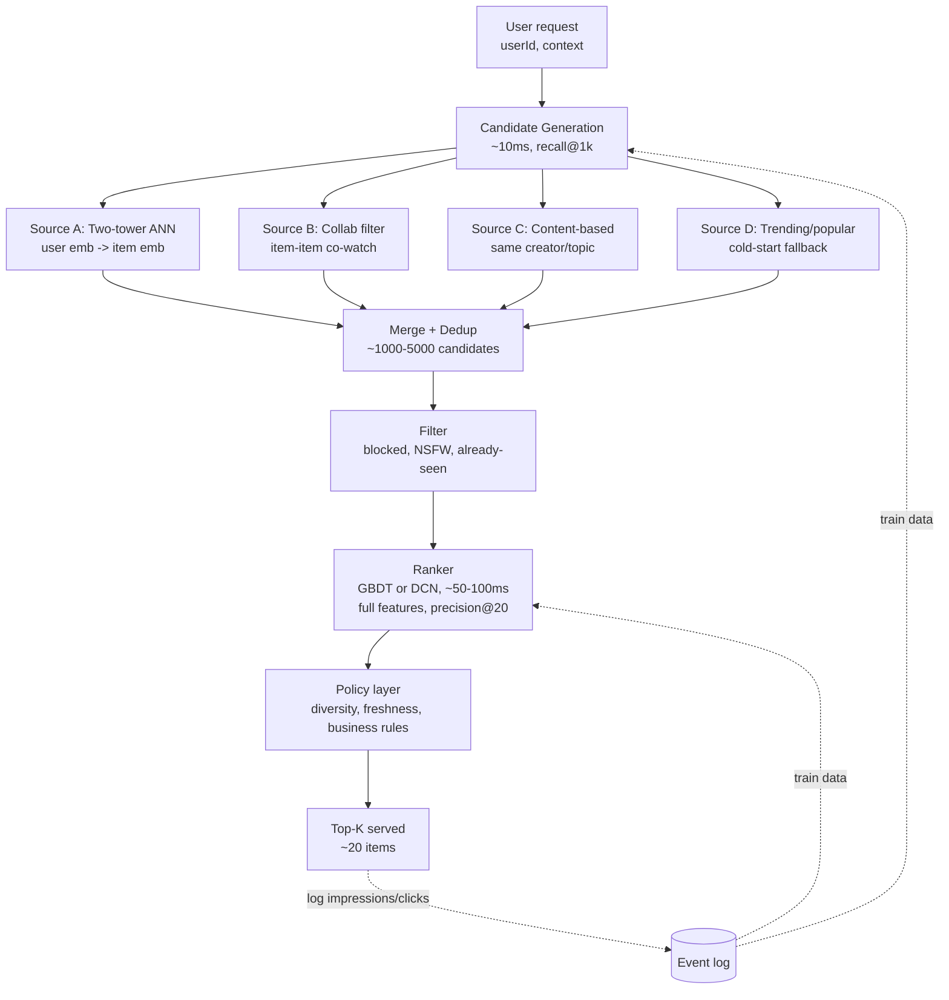
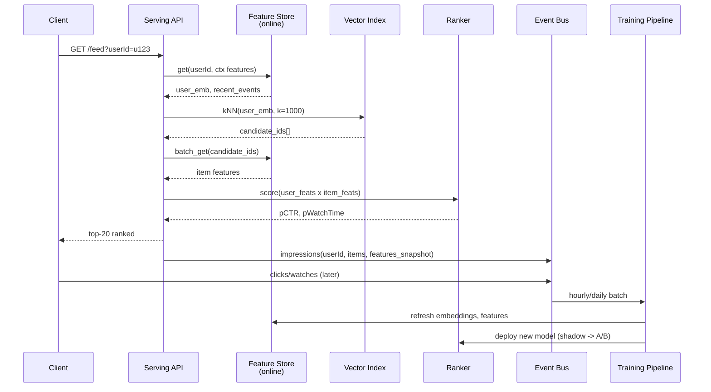

# Recommendation System (Interview Template)

## Why This Exists

**Problem.** A user opens YouTube/Netflix/Amazon. There are O(10^9) items in the corpus. You have ~200ms to return a personalized ranked list of ~20. You cannot score a billion items per request, you cannot retrain a model per request, and you cannot ignore the cold-start user who signed up 4 minutes ago. Naive solutions either blow the latency budget (score everything), produce a global popularity feed (no personalization), or overfit to last-click behavior (filter bubble + abandonment).

**Key insight.** Decompose into a **funnel**: cheap, recall-oriented **candidate generation** narrows 10^9 → 10^3, then expensive, precision-oriented **ranking** scores 10^3 → ~20. Each stage has a different model, different features, different latency budget, and a different metric. This is the architecture every consequential recsys at scale uses (YouTube, Netflix, Pinterest, Instagram, TikTok), and it falls out naturally from the math: you cannot afford a deep cross network on a billion items, and you cannot afford to skip personalized ranking if you want CTR/watch-time to move.

**Reach for this when:**
- The interviewer says "design a feed/homepage/discover/for-you page".
- Catalog is too large to score per request (>~10^4 items).
- You have explicit or implicit user-item interaction signals (clicks, watches, purchases, dwell).
- The product cares about *engagement over time*, not just immediate CTR.

**Don't reach for this when:**
- The catalog is tiny (<1000 items) — just rank everything with one model, no need for retrieval.
- The task is **search**, not recommendation — query intent dominates over user history; reach for `../../data-systems/search-engine/`.
- It's pure content moderation/classification — single-item scoring, no retrieval.
- The interviewer asked for **ads ranking** specifically — auctions, pacing, and budget constraints dominate; the architecture rhymes but the objective is bid×pCTR×quality, not engagement.

## Diagrams

### The two-stage funnel



### Training / serving feedback loop



## Interview Walkthrough (template structure)

A 45-min recsys design interview almost always follows this arc. Hit each beat.

### 1. Clarify scope (3-5 min)

Ask, do not assume:

| Question | Why it matters |
|---|---|
| What's the surface? Homepage feed, related-items, search-recommend? | Related-items has anchor item; homepage has no query. Different retrievers. |
| What signal optimizes? CTR, watch-time, purchase, retention? | CTR is easy to game with clickbait; watch-time/retention is what actually matters. |
| Catalog size and refresh rate? | 1B items + 1M new/day = needs hourly index rebuild. Fashion = daily decay. News = minutes. |
| User scale, QPS, regions? | 100M DAU @ 5 req/session = ~5k QPS peak/region. |
| Cold start mix? | If 30% sessions are logged-out users, content/popularity branches dominate, not collab. |
| Latency SLO? | ~200ms total feed; ~50ms ranking budget after retrieval and feature fetch. |
| Existing data? Implicit only or explicit ratings? | Netflix-style explicit ratings are rare in modern systems; assume implicit. |

### 2. High-level architecture (5 min)

Draw the two-stage funnel above. State the budget split:

- Candidate gen: 10^9 → 10^3 in ~20-30ms, recall-oriented.
- Ranking: 10^3 → 10^2 in ~50-80ms, precision-oriented.
- Re-ranking / policy: 10^2 → 10^1 in ~5ms, diversity / freshness / business rules.

Name the key dependencies: feature store (online + offline), vector index (Faiss/ScaNN/Vespa), training pipeline (offline daily/hourly), event log (Kafka), online experimentation (A/B).

### 3. Candidate generation — recall stage (10 min)

The single most common interview mistake: proposing one retriever and stopping. **Real systems blend 3-6 retrievers** because no single signal covers cold-start + power users + new items + serendipity. Each retriever feeds a few hundred candidates; merge and dedup.

#### Retriever 1: Two-tower neural retrieval (the default)

User tower → user embedding. Item tower → item embedding. Train so that `dot(u, i)` is high for positive (user, item) pairs and low for negatives. At serve time, compute user embedding online (fresh context) and ANN-search a precomputed item index.

```python
# Two-tower training (conceptual, PyTorch-flavored)
import torch
import torch.nn as nn
import torch.nn.functional as F

class UserTower(nn.Module):
    def __init__(self, n_users, n_countries, embed_dim=128):
        super().__init__()
        self.user_emb = nn.Embedding(n_users, 64)
        self.country_emb = nn.Embedding(n_countries, 16)
        # last-N watched items as a bag-of-embeddings
        self.history_proj = nn.Linear(64, 64)
        self.mlp = nn.Sequential(
            nn.Linear(64 + 16 + 64, 256), nn.ReLU(),
            nn.Linear(256, embed_dim),
        )

    def forward(self, user_id, country, history_item_embs):
        u = self.user_emb(user_id)
        c = self.country_emb(country)
        # mean-pool last-N item embeddings — captures recent taste
        h = self.history_proj(history_item_embs.mean(dim=1))
        return F.normalize(self.mlp(torch.cat([u, c, h], dim=-1)), dim=-1)

class ItemTower(nn.Module):
    def __init__(self, n_items, n_categories, embed_dim=128):
        super().__init__()
        self.item_emb = nn.Embedding(n_items, 64)
        self.cat_emb = nn.Embedding(n_categories, 32)
        self.mlp = nn.Sequential(
            nn.Linear(64 + 32, 256), nn.ReLU(),
            nn.Linear(256, embed_dim),
        )

    def forward(self, item_id, category):
        i = self.item_emb(item_id)
        c = self.cat_emb(category)
        return F.normalize(self.mlp(torch.cat([i, c], dim=-1)), dim=-1)

# In-batch sampled softmax — the trick that makes this scale.
# Each (user, positive_item) in the batch uses every other item in the batch
# as a negative. Avoids enumerating 10^9 negatives per step.
def in_batch_softmax_loss(user_embs, pos_item_embs, sampling_log_q):
    # logits: B x B
    logits = user_embs @ pos_item_embs.T
    # sampling correction: subtract log P(item) to debias popular items
    # (otherwise the model learns "always recommend popular" — see Yi et al. 2019)
    logits = logits - sampling_log_q.unsqueeze(0)
    labels = torch.arange(logits.size(0), device=logits.device)
    return F.cross_entropy(logits, labels)
```

Serve item embeddings via Faiss / ScaNN / Vespa. User embedding is computed online at request time (so it can incorporate "user just watched X 30 seconds ago"). Top-k ANN lookup is sub-10ms for k=1000 over 10^8 items with HNSW or IVF-PQ.

#### Retriever 2: Item-item collaborative filtering ("because you watched X")

Pure co-occurrence. For each item, precompute the top-N items most often watched in the same session (with shrinkage/IDF to suppress generically-popular items). At serve time, take user's last 10 items, gather their neighbors, score-aggregate. This is the Amazon "customers who bought also bought" trick (Linden et al. 2003) and it remains shockingly competitive — the **lower bound** every neural retriever should beat.

```python
# Build item-item similarity offline (Spark/SQL pseudo-code)
# co_count[i][j] = #sessions where both i and j appeared
# Use cosine with shrinkage to penalize rare items:
#   sim(i,j) = co_count[i][j] / (sqrt(count[i] * count[j]) + alpha)
# Keep only top-50 neighbors per item — sparse, cheap to serve.
```

#### Retriever 3: Content-based (creator, topic, embedding similarity)

For new items with no engagement history, two-tower won't have learned them yet. Fall back to: same creator's recent uploads, same topic/tag, same language. Often implemented as a metadata-keyed lookup table + recency boost.

#### Retriever 4: Popular / trending

Cold-start, logged-out, new-region users. Per-country trending list, refreshed every ~5 minutes. Always include this branch — it's your floor.

#### Retriever 5: Sequence/session-based (optional)

Transformer or GRU over session history (Kang & McAuley SASRec, 2018). Captures "user is in a binge" or "user just searched cooking". Heavier than two-tower but better short-term relevance.

### 4. Ranking — precision stage (10 min)

Now you have ~1000-5000 candidates. Score them with a heavy model using **all** features you couldn't afford in retrieval: hundreds of crossed features, item content embeddings, user × item interaction features ("this user has watched 40% of this creator's videos"), context (time of day, device, network), and slow-changing user features (long-term taste embeddings).

Two dominant architectures:

**Gradient-boosted decision trees (LightGBM/XGBoost).** Default for tabular. Handles mixed types, missing values, and monotonicity constraints natively. Trains in hours, no GPU needed. Excellent baseline. Instagram, LinkedIn, Yelp ran on GBDT for years.

**Deep cross networks (DCN-v2, DLRM, Wide & Deep).** Worth the ops cost when you have many high-cardinality categorical features (user_id, item_id, creator_id, hashtag_id × millions) — embeddings learn cross-feature interactions GBDT cannot. YouTube, Pinterest, Meta ranking is here.

Train as a **multi-task model**: pCTR, pWatchTime, pLike, pShare, pSkip — all from the same shared trunk (MMoE, Ma et al. 2018). Combine at serve time with a tunable weighted sum: `score = w1*pCTR + w2*log(pWatchTime) - w3*pSkip`. Weights are picked via online experimentation, not offline training — they encode product policy.

```python
# Ranking score combination — simple, tuned online
def rank_score(predictions: dict[str, float]) -> float:
    # weights are A/B-tuned; values illustrative.
    # Note: log on watch_time prevents long videos from dominating.
    # Note: skip is negative — penalizes likely-skipped items even if pCTR is high.
    return (
        0.5 * predictions["pCTR"]
        + 1.0 * (predictions["pWatchTime"] ** 0.5)
        + 0.3 * predictions["pLike"]
        + 0.5 * predictions["pShare"]
        - 1.0 * predictions["pSkip"]
    )
```

### 5. Re-ranking / policy layer (3 min)

After ML ranking, apply business rules and diversity. Common ones:

- **Diversity (MMR — Carbonell & Goldstein 1998):** penalize the next item by similarity to already-selected items, prevents "10 cooking videos in a row".
- **Freshness boost:** `score += w * decay(now - publish_time)` for new items the model hasn't yet learned.
- **Creator diversity:** at most 2 items per creator in top-20.
- **Hard filters:** already-seen, blocked, NSFW for context, region-restricted, currently-paused (for Netflix).
- **Exploration:** epsilon-greedy or Thompson sampling — show some items the model is *uncertain* about, to gather signal.

### 6. Cold start (5 min)

Three flavors. Treat them separately.

| Cold start type | Signal you have | What to do |
|---|---|---|
| **New user** (signed up today) | demographic, device, country, signup referrer | content + popular per-country; bootstrap with onboarding ("pick 3 interests") |
| **New item** (just uploaded) | creator, title text, thumbnail, audio, category | content-tower embedding from text/image/audio; small forced-exposure budget to gather data; creator-prior |
| **New context** (new country/language launch) | almost nothing | translate from neighboring market; heavy popular-only for weeks; lower personalization weight |

The *worst* mistake is to treat cold start as the model's problem. It's an architecture problem — you need a separate retrieval branch and a separate exploration budget. Don't expect collab filtering to solve it.

### 7. Metrics (5 min)

The interviewer is checking whether you know **offline metrics lie**.

#### Offline (training-time)

| Metric | What it measures | Watch out for |
|---|---|---|
| **Recall@K** (retrieval) | did the true clicked item appear in top-K candidates? | only as good as your negative-sampling distribution |
| **NDCG@K** (ranking) | rank-aware: how high is the true positive in the list? | log discount over-rewards top-1 |
| **MAP, MRR** | precision averaged across positions | useful for related-items / search-style |
| **AUC / log-loss** (pointwise) | calibrated probability quality | doesn't reflect list-level interactions |
| **Pairwise / listwise loss** (LambdaRank, RankNet) | order over a session | better proxy for production but harder to tune |

#### Online (the only metrics that matter for the launch decision)

- **CTR** — fast feedback, but easy to game with clickbait.
- **Long-term watch time / sessions per user / retention (DAU/MAU)** — what you actually care about; takes weeks to measure.
- **Diversity / coverage** — what % of catalog is shown to >0.1% of users? Low coverage = filter bubble.
- **Counterfactual harm** — "did we silence a creator/topic" — important for fairness.

Rule from Netflix and YouTube papers alike: **a model that wins offline NDCG can lose online watch-time.** Always A/B with sufficient power before declaring victory. Run guardrail metrics (skip rate, complaint rate, unsubscribes) alongside the primary.

### 8. Feature store and training-serving skew (3 min)

The biggest production bug class in recsys is *training-serving skew*: features computed differently in offline training vs online serving. Mitigations:

- **Single feature definition** (Feast, Tecton, internal "Feature Store") — same code path generates features for batch training and online serving.
- **Log features at serve time**, train on the logged features (not on re-derived ones). Eliminates skew by definition.
- **Point-in-time correctness**: when joining label (click @ T+1h) to features, use feature values *as of impression time T*, not "current". Otherwise you leak the future. This is the recsys version of look-ahead bias.

## Reference architecture sketch (numbers)

For a "design YouTube recs" or "design TikTok For You" prompt, anchor on numbers:

- 10^9 items in catalog, 10^6 added/day → hourly index rebuild for new items, daily full retrain.
- 10^8 DAU, 5 sessions/day, 20 items/session → ~10^10 impressions/day.
- ~5k QPS peak per region, ~50 regions.
- Latency budget: 200ms total client-perceived, 100ms server-side, split: 5ms feature fetch, 20ms candidate gen (4 retrievers in parallel), 60ms ranking, 5ms re-rank, 10ms slack.
- Storage: item embeddings 10^9 × 128 floats × 4B = ~512GB → needs sharded ANN (one shard per region, or quantized PQ to <100GB).
- Training: ranking model trained daily on last 30 days of impressions, ~10^11 rows, on a GPU cluster, ~few hours.

## Trade-offs

| Benefit | Cost |
|---|---|
| Two-stage funnel makes 10^9-item catalog tractable | Two models = two pipelines = double the train/serve infrastructure |
| Multiple retrievers cover cold-start + power users + new items | Merging/dedup logic is fiddly; retriever weights need tuning |
| Two-tower ANN gives fast personalized retrieval | User embedding staleness — need online tower or feature store with fresh signals |
| GBDT ranker is cheap and robust | Plateaus on high-cardinality categorical features; deep models eventually win |
| Multi-task ranking shares signal across heads | Conflicting gradients (CTR vs watch-time can fight); MMoE helps but adds complexity |
| In-batch sampled softmax scales training | Popularity bias — must apply sampling correction (log Q debias) or popular items dominate |
| Logging features at serve time eliminates train/serve skew | Storage cost of full feature snapshots; privacy and PII review |
| Diversity / freshness rules ship quickly | Hand-tuned heuristics drift — they need their own monitoring |

## Common Pitfalls

- **Single-retriever brain.** Building only a two-tower and stopping. Real systems blend 4-6 retrievers; the merge logic and per-source quotas are non-trivial. Cold items will never surface from a model that hasn't seen them.
- **Popularity collapse.** In-batch sampled softmax without log-Q correction → model learns "popular items have higher dot product" → all users see the same top items → you reinvented a global popularity feed.
- **Optimizing CTR alone.** CTR-only ranker promotes clickbait. Watch-time, completion rate, and long-term retention are the metrics that move when the product is healthy. Add a skip/dwell penalty.
- **Offline metric over-reliance.** NDCG@10 went up 3% but the A/B test loses watch-time. Almost every recsys team has this story. Run the experiment.
- **Train/serve skew.** Computing `user.recent_clicks_count` from the data warehouse offline (with future leakage) but from Redis online (with different windowing). Always log features at serve time and train on those logs.
- **Position bias not modeled.** The training label (click) is heavily biased by the position the item was shown in. Models trained on raw clicks just relearn the previous ranker. Fix with position features at training time, dropped at serving time (the YouTube DNN paper's "example age" trick is a related idea), or with inverse-propensity-weighted loss.
- **Index staleness.** Item index rebuilt nightly; new viral video uploaded at 9am → invisible until tomorrow. Have a "fresh" content branch that bypasses the ANN index.
- **Embedding drift.** User and item towers retrained, but ANN index built from old item embeddings. Dot products silently meaningless. Always rebuild index with the same checkpoint that produced the user tower.
- **No exploration.** Pure exploit → never learn what the model is wrong about → metrics plateau. Reserve a small slot (1-5%) for epsilon-greedy or contextual bandit exploration.
- **Filter bubble + complaint loop.** Optimizing engagement on logged signal pushes users into narrower interests over time. Add diversity-aware re-ranking and monitor catalog coverage as a guardrail.
- **Ignoring the cold-start branch.** Treating cold start as "the model will figure it out" — it won't. New users churn in the first session if the experience is generic.
- **Over-personalization for new users.** Conversely, a user with 3 events should *not* be served a deeply personalized feed — the signal is too noisy. Mix in popularity heavily until you have ~30+ interactions.

## Decision Table

| Situation | Use this | Not this | Why |
|---|---|---|---|
| Catalog < 10K, < 100 QPS | Score everything with one ranker, skip retrieval | Two-stage funnel | Funnel adds infra cost without benefit at this scale |
| Catalog 10^7-10^9, latency-sensitive | Two-stage: ANN retrieval + GBDT/DCN ranker | Single deep model over full catalog | Cannot meet 200ms with full scoring |
| Mostly new items (news, short-form video) | Heavy content-based + recency + small forced exposure | Pure collab/two-tower | Two-tower needs interaction history that doesn't exist yet |
| Mostly stable items (movies, books) | Two-tower + collab filter dominate | Pure content-based | Co-watch signals are very strong here; Netflix Prize era |
| High-cardinality features (user_id, creator_id, hashtag_id × millions) | DLRM / DCN-v2 with embeddings | GBDT | Trees can't learn high-card embeddings well |
| Tabular features, < 1M unique IDs | LightGBM/XGBoost ranker | Deep model | GBDT trains in hours, no GPU, often wins |
| Strict explainability requirement (jobs, lending, ads policy) | Linear/GBDT with SHAP, explicit features | Deep neural | Auditability + monotonicity constraints |
| Sequential / session intent dominates (TikTok, music queue) | SASRec / GRU4Rec / transformer over session | Static two-tower with last-N pooled | Order matters; pooling loses sequence |
| Two-sided marketplace (jobs, dating, DoorDash) | Bilateral model with constraints (capacity, fairness) | Single-sided ranker | Ignoring supply-side leads to creator/seller starvation |
| Privacy-sensitive (health, finance) | Federated / on-device ranking, coarse server features | Centralized full-history embedding | PII / regulation; minimize exfiltration |
| Strict ad slot or auction context | Bid × pCTR × quality with pacing | Engagement ranker | Different objective (revenue, not retention) |

## References

Primary papers and books — cite these in interviews.

- Covington, Adams, Sargin (Google) — **Deep Neural Networks for YouTube Recommendations** (RecSys 2016) — https://research.google/pubs/deep-neural-networks-for-youtube-recommendations/ — the canonical two-stage architecture paper, including the "example age" trick.
- Yi et al. (Google) — **Sampling-Bias-Corrected Neural Modeling for Large Corpus Item Recommendations** (RecSys 2019) — https://research.google/pubs/sampling-bias-corrected-neural-modeling-for-large-corpus-item-recommendations/ — the in-batch softmax with log-Q correction trick.
- Linden, Smith, York (Amazon) — **Amazon.com Recommendations: Item-to-Item Collaborative Filtering** (IEEE Internet Computing 2003) — https://www.cs.umd.edu/~samir/498/Amazon-Recommendations.pdf — still the strongest baseline you can build in a week.
- Cheng et al. (Google) — **Wide & Deep Learning for Recommender Systems** (DLRS 2016) — https://arxiv.org/abs/1606.07792 — memorization (wide) + generalization (deep) framing.
- Wang et al. (Google) — **DCN V2: Improved Deep & Cross Network** (WWW 2021) — https://arxiv.org/abs/2008.13535 — current SOTA cross-feature architecture.
- Naumov et al. (Meta) — **DLRM: Deep Learning Recommendation Model** (2019) — https://arxiv.org/abs/1906.00091 — the architecture behind Meta ranking.
- Ma et al. (Google) — **Modeling Task Relationships in Multi-task Learning with MMoE** (KDD 2018) — https://research.google/pubs/modeling-task-relationships-in-multi-task-learning-with-multi-gate-mixture-of-experts/ — multi-task ranking heads.
- Kang & McAuley — **Self-Attentive Sequential Recommendation (SASRec)** (ICDM 2018) — https://arxiv.org/abs/1808.09781 — transformer over session history.
- Carbonell & Goldstein — **The Use of MMR, Diversity-Based Reranking** (SIGIR 1998) — https://dl.acm.org/doi/10.1145/290941.291025 — the diversity re-ranking primitive.
- Gomez-Uribe & Hunt (Netflix) — **The Netflix Recommender System: Algorithms, Business Value, and Innovation** (TMIS 2015) — https://dl.acm.org/doi/10.1145/2843948 — what actually drove Netflix watch time.
- Netflix Tech Blog — **Learning a Personalized Homepage** — https://netflixtechblog.com/learning-a-personalized-homepage-aa8ec670359a — production framing of row-level personalization.
- Netflix Tech Blog — **Artwork Personalization** — https://netflixtechblog.com/artwork-personalization-c589f074ad76 — beyond item ranking, presentation also personalizes.
- Pinterest Engineering — **Pixie / PinSage** — https://medium.com/pinterest-engineering — graph-based retrieval at scale.
- Johnson, Douze, Jégou (Meta) — **Faiss: Billion-scale similarity search with GPUs** — https://github.com/facebookresearch/faiss — the reference vector index.
- Guo, Sun et al. (Google) — **ScaNN: Accelerating Large-Scale Inference with Anisotropic Vector Quantization** (ICML 2020) — https://arxiv.org/abs/1908.10396 — alternative ANN, often beats Faiss.
- Xu & Lam — **System Design Interview Vol. 2**, ch. on news feed and recommendations — book ref, no public URL.
- Kleppmann — **Designing Data-Intensive Applications**, ch. 11 (Stream Processing) and ch. 10 (Batch Processing) — for the offline/online training pipeline framing.
- Google SRE Workbook, ch. 4 — **SLO Engineering Case Studies** — https://sre.google/workbook/slo-engineering-case-studies/ — for setting recsys latency / quality SLOs.
- Joachims, Swaminathan, Schnabel — **Unbiased Learning-to-Rank with Biased Feedback** (WSDM 2017) — https://arxiv.org/abs/1608.04468 — position bias correction.

## See Also

- `../../data-systems/search-engine/` — query-driven retrieval; same ANN/feature-store building blocks, different objective (relevance vs engagement).
- `../newsfeed/` — closely related; a feed is a recsys with strong recency and social-graph signal.
- `../../data-systems/vector-db/` — ANN index choices for embedding retrieval.
- `../../data-systems/stream-processing/` — feature pipelines and online feature freshness.
- `../../data-systems/lakehouse/` — offline training set construction; bronze/silver/gold for ML.
- `../../performance/caching/` — caching candidate sets and ranked top-K per user.
- `../../reliability/feature-flags/` — dark-launching new ranking models behind shadow traffic.
- `../search-typeahead/` — same retrieval+ranking primitives at the query level.
