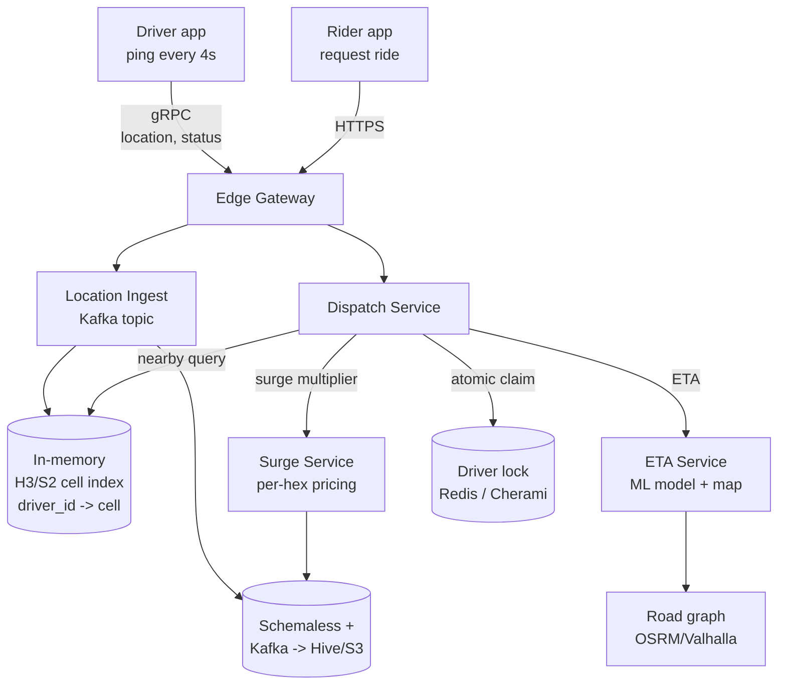
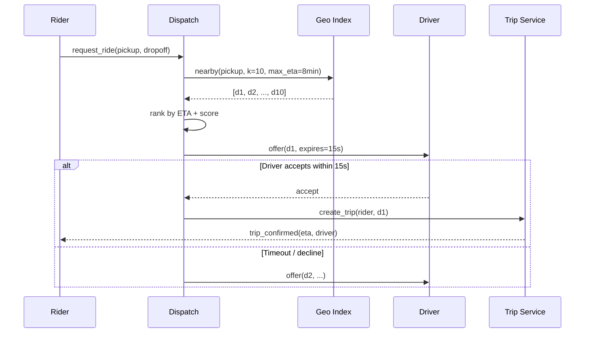
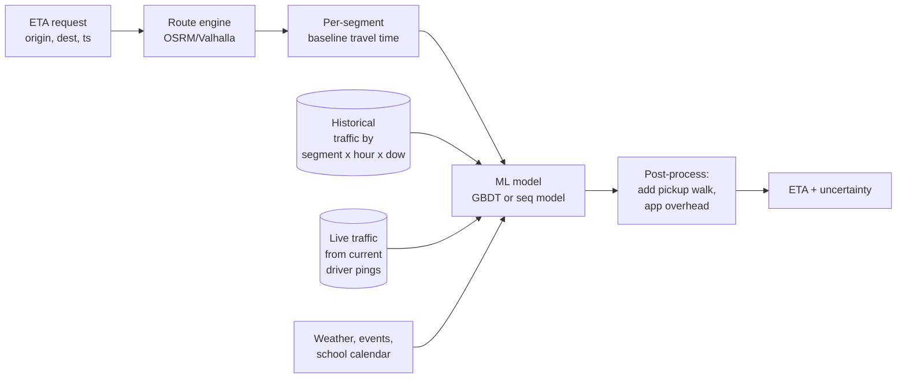

# Ride Sharing (Uber / Lyft)

## Why This Exists

**Problem.** A ride-sharing system must (a) ingest millions of driver location pings per second, (b) answer "find the 10 nearest available drivers to this rider in <50ms", (c) atomically match exactly one driver to one rider, (d) price dynamically based on real-time supply/demand, and (e) predict ETAs that survive traffic, weather, and pickup detours. Each subsystem has different consistency, latency, and durability requirements — there is no single database or framework that does all five well.

**Key insight.** The system is **read-heavy on geo-indexes** (every rider open triggers nearby-driver queries) but **write-heavy on driver pings** (every active driver writes location every 4s). Decouple the **fast path** (in-memory geo-index for matching) from the **durable path** (event log + warehouse for analytics, ML training, ETA models). The matching service does **not** need durable writes — losing a single ping is fine; losing a match assignment is not.

**Reach for this when:**
- Interview prompt is "design Uber/Lyft/DoorDash/delivery dispatch" or any **2D spatial matching** problem (food delivery, on-demand cleaning, roadside assistance).
- You need a template for **supply/demand matching at the edge of a city** with hot-spot handling.
- The problem requires **ETAs, surge, and dispatch** as a coupled system rather than independent services.

**Don't reach for this when:**
- You only need **static geo-search** (find restaurants near me) — a single-shard PostGIS or ElasticSearch geo_point is enough; this skill is overkill.

## Diagrams

### High-level dataflow



### Match lifecycle



## Capacity Sketch (start every interview here)

Numbers from Uber's public talks, scaled to a "design at 100M MAU" prompt:

| Metric | Value | Derivation |
|---|---|---|
| Daily active drivers | 5M | 100M MAU * ~5% driver supply ratio |
| Concurrent online drivers | 1M | peak hours, ~20% of DAU online |
| Driver pings/sec | **250K** | 1M drivers * 1 ping / 4s |
| Ride requests/sec (peak) | 10K | NYE surge; avg ~2K |
| Geo-index reads/sec | 100K | 10K req/s * ~10 candidate lookups |
| Storage: pings/day | ~22 TB raw | 250K/s * 86400s * ~1KB |
| Storage: pings after compaction | ~2 TB/day | columnar + downsampling |

These numbers tell you: **don't write every ping to a SQL row**. Pings go to Kafka, then Schemaless/HDFS in batches.

## Driver Location Ingest

The fast path is a **TCP-style gRPC stream** from each driver phone, not REST. REST adds ~100ms TLS handshake on every ping; with 1M drivers that's catastrophic battery and network cost.

```python
# Driver client (simplified). Real Uber uses a bidi stream
# multiplexed with dispatch offers — one connection, two-way.
async def driver_loop(stub, driver_id):
    async for loc in gps_stream():  # ~4s cadence, adaptive
        ping = LocationPing(
            driver_id=driver_id,
            lat=loc.lat, lng=loc.lng,
            heading=loc.heading, speed=loc.speed,
            ts_ms=now_ms(),
            status=current_status(),  # ONLINE / ON_TRIP / OFFLINE
        )
        # Best-effort. We do NOT wait for ack — losing pings is OK,
        # losing the next ping isn't, and head-of-line block kills UX.
        await stub.SendPing(ping, timeout=2.0)
```

Server side, the gateway shards by `driver_id` (consistent hash) onto a fleet of **stateful ingest nodes**. Each node:

1. Updates its in-memory geo-index (the driver's H3 cell).
2. Forwards the ping to a Kafka topic partitioned by `driver_id` for downstream (analytics, ETA training).
3. **Does not** synchronously hit any database.

```go
// Pseudocode for ingest node
func (s *IngestNode) HandlePing(ping LocationPing) {
    cell := h3.LatLngToCell(ping.Lat, ping.Lng, RES_9) // ~174m edge
    s.geoIdx.Move(ping.DriverID, cell, ping.Status)    // in-memory
    s.kafka.ProduceAsync("driver.pings", ping.DriverID, ping)
    // No DB write. No ack needed beyond TCP.
}
```

**Why partition by driver_id and not by geo-cell?** Drivers move across cells; if you partitioned by cell you'd reshuffle on every cell crossing. Partitioning by driver_id keeps a driver's connection sticky to one node and lets that node mutate its local geo-index in place.

## Geo-Index: H3 vs S2 vs Geohash

The geo-index is the **most-queried** data structure in the system. Choice matters.

| Index | Cell shape | Distortion | Hierarchy | Notes |
|---|---|---|---|---|
| **Geohash** | Lat/lng bbox | Severe near poles, bands at equator | Z-order prefix | Simple, but neighbors aren't adjacent in string space (the "edge case" problem). Avoid for nearest-neighbor. |
| **S2 (Google)** | Spherical quadrilateral | Low (~2x area variance) | 30 levels, parent/child | Used by Google Maps, Foursquare. Great for polygon coverage. |
| **H3 (Uber)** | Hexagon | Lowest (~1.6x area variance, plus 12 pentagons globally) | 16 resolutions | **Uniform 6-neighbor adjacency**. Built for ride-sharing — surge hexes, dispatch grids, demand heatmaps. |

**Why hexagons win for ride-sharing.** With squares, a cell has 4 edge-neighbors and 4 corner-neighbors — the corner ones are √2 farther. With hexagons, **all 6 neighbors are equidistant**, so "expand search radius" is a single ring operation: `kRing(cell, 1)` returns 6 cells, `kRing(cell, 2)` returns 18, all at known distances.

```python
import h3

PICKUP_RES = 9          # ~174m hex edge — typical city block
SURGE_RES = 8           # ~530m — surge zones
HEATMAP_RES = 7         # ~1.6km — citywide heatmaps

def nearby_drivers(pickup_lat, pickup_lng, k=10, max_rings=4):
    center = h3.latlng_to_cell(pickup_lat, pickup_lng, PICKUP_RES)
    candidates = []
    for ring in range(max_rings + 1):
        cells = h3.grid_ring(center, ring) if ring else {center}
        for c in cells:
            candidates.extend(GEO_IDX.drivers_in_cell(c))
        if len(candidates) >= 3 * k:
            break  # enough to rank; don't over-expand
    # Now rank by *road-network ETA*, NOT haversine distance.
    # A driver 200m away across a freeway is farther than one 400m
    # away on the same street.
    return sorted(candidates, key=lambda d: eta_estimate(d, pickup_lat, pickup_lng))[:k]
```

**Pentagons are real.** H3 has 12 pentagons (icosahedron vertices); most are over oceans (one in Antarctica, none in major cities), but **don't assume `grid_ring` always returns 6**. Uber's dispatch handles this by treating pentagon neighbors as a special case.

### Storing the index

This is **not** a database — it's an in-memory map per ingest node, plus a per-cell secondary index:

```python
# Per-node state. Reads are O(1); writes are O(1).
drivers_by_id: Dict[DriverID, (H3Cell, Status, ts)]
drivers_by_cell: Dict[H3Cell, Set[DriverID]]

def move(driver_id, new_cell, status):
    old_cell, _, _ = drivers_by_id.get(driver_id, (None, None, None))
    if old_cell and old_cell != new_cell:
        drivers_by_cell[old_cell].discard(driver_id)
    drivers_by_cell.setdefault(new_cell, set()).add(driver_id)
    drivers_by_id[driver_id] = (new_cell, status, now())
```

For citywide queries you need a **fan-out**: shard by city, replicate hot cities (NYC, SF) across multiple read replicas. Uber's "Ringpop" gossip-based sharding (now mostly retired in favor of dedicated dispatch services) was built for exactly this.

## Matching Algorithm

Naive: "assign nearest available driver". This fails because:

- Two riders requesting at the same instant might both get matched to the same driver if you aren't atomic.
- "Nearest" by Euclidean ignores rivers, highways, one-way streets.
- Greedy local matching is **globally suboptimal**. If rider A is matched to nearby driver D1, but D1 was the only driver who could serve rider B (who appears 500ms later), you've stranded B.

### Atomic claim

The simplest correct primitive is **per-driver lock with TTL**:

```python
def offer(rider, driver):
    # SETNX with TTL = offer expiry (e.g., 15s).
    # Atomic in Redis; equivalent to compare-and-swap.
    acquired = redis.set(
        f"driver:offer:{driver.id}",
        rider.id,
        nx=True, ex=15,
    )
    if not acquired:
        return None  # someone else has them
    return Offer(driver, expires_at=now()+15)
```

Uber's internal dispatcher uses **Cherami** (durable, queue-based, replicated task delivery) for the offer flow rather than Redis, because they need **at-most-once delivery** of an offer to a driver phone, not just an in-memory lock. Cherami is a competing-consumer queue with explicit ack/nack.

### Batched matching

Rather than greedy per-request, aggregate ride requests over a small window (~2s) and solve as a **bipartite assignment problem**:

```python
# Hungarian algorithm: O(n^3) but n is small per dispatch tile (50-200).
from scipy.optimize import linear_sum_assignment

def batch_match(requests, drivers, eta_fn):
    # Cost matrix: row=request, col=driver. Cost = ETA + penalties.
    cost = np.array([[eta_fn(d, r) for d in drivers] for r in requests])
    cost[cost > MAX_ETA_SEC] = 1e9  # forbid pairings exceeding SLA
    rows, cols = linear_sum_assignment(cost)
    return [(requests[r], drivers[c]) for r, c in zip(rows, cols)
            if cost[r][c] < 1e9]
```

Uber published research on this as "matching with delays" — a 2-5 second buffer dramatically improves global match quality (lower total ETA, fewer cancellations) at the cost of slightly higher rider wait. DiDi's 2018 KDD paper formalized it as a **combinatorial multi-armed bandit**.

## Surge Pricing

Surge is the system's **closed-loop control** for supply/demand. It runs per H3 cell (typically resolution 8, ~530m hexes) on a 60s window.

```python
# Per-hex surge. Real systems are smoother (EWMA, hysteresis)
# and constrained (cap at 5x, snap to 0.1 increments, never < 1.0).
def surge_multiplier(hex_id):
    demand = ride_requests_last_60s(hex_id)        # active + queued
    supply = available_drivers_in_neighborhood(hex_id, rings=2)
    if supply == 0:
        return MAX_SURGE  # 5.0
    raw = (demand / supply) ** ALPHA  # ALPHA ~ 0.7
    smoothed = EWMA[hex_id].update(raw, half_life=120)
    return clamp(smoothed, 1.0, MAX_SURGE)
```

**Why this is hard:**
- **Oscillation.** Without smoothing, surge spikes induce supply migration, which crashes the multiplier, which causes drivers to leave, which spikes it again. EWMA + hysteresis (don't drop below threshold for N seconds) is mandatory.
- **Boundary effects.** A rider at the edge of a hot hex gets 3.0x; a block away gets 1.0x. Real systems either smooth across neighbors or use spatial Gaussian weighting.
- **Display vs charge timing.** You quote surge at request time but charge at trip end — what if surge dropped during the ride? Uber locks the multiplier at request time; this is a product decision with legal implications (price gouging laws in some jurisdictions).
- **Manipulation.** Drivers used to coordinate mass logoffs to trigger surge. Detection: anomaly detection on logoff correlation per hex.

## ETA Models

Two regimes: **pre-trip ETA** (driver→rider, rider→dropoff) and **in-trip ETA** (live updates).



**Baseline first.** OSRM or Valhalla on OpenStreetMap gives you a route as a sequence of road segments with default speeds. That's the baseline. ML corrects it.

**Features for the correction model:**
- Time bucket (hour-of-day, day-of-week, holiday flag).
- Live speed estimates per road segment, computed from **other drivers' pings in the last 5 min** — this is why driver pings flowing through Kafka into a streaming aggregator (Flink, Samza) is critical even though no individual ping is critical.
- Weather (rain doubles ETA on freeways, halves it for pedestrians).
- Special events (a stadium concert breaks all historical patterns).
- The **last-mile penalty**: GPS shows the driver "arrived" but they're circling looking for the pickup. Uber found this adds 30-90s in dense urban areas.

**Production model.** Uber's DeepETA (2022) is a transformer over segment sequences with self-attention; before that it was XGBoost on segment-level features. For an interview, **GBDT on segment-aggregated features** is the right answer — production-tested, debuggable, low-latency.

**Calibration matters more than mean error.** Riders forgive a 7-min ETA that turns into 8 minutes; they don't forgive 4 → 12. Train with **quantile loss** and present P50/P90 to users (the Uber app shows a range during high uncertainty).

## Storage: Schemaless and the durable path

Pings, trips, and geo events are written to **Schemaless** (Uber's internal sharded MySQL with append-only triggers) — not because Schemaless is special, but because it gives you (a) horizontal sharding by entity, (b) trigger-driven CDC into Kafka, (c) cross-DC async replication. From a design-interview standpoint, the equivalents are:

| Need | Open-source equivalent |
|---|---|
| Sharded entity storage | Vitess, CockroachDB, or DIY MySQL + proxy |
| Append-only event triggers | Debezium CDC |
| Cross-DC replication | Active-passive MySQL with semi-sync |

Trips are an **OLTP** workload (small, ACID, ~1KB/trip, 10-100 writes/trip lifecycle). Pings are an **OLAP** workload (huge volume, batch/streaming reads). Don't put them in the same database.

```
DRIVER PINGS:    phone -> gRPC -> Kafka -> [Flink: live traffic]
                                       \-> [Hudi/Iceberg on S3] -> Hive/Presto for analytics
                                       \-> [Schemaless trip-history shard, only for active trip]

TRIPS:           dispatcher -> Schemaless (sharded by trip_id)
                            -> CDC -> Kafka -> warehouse
```

Cherami (Uber's durable queue, since superseded by Kafka in many places) was the bridge for **at-least-once** task handoff between services like dispatch → driver-app → trip-creation, where losing a message means a driver never gets the offer. For an interview, "Kafka with idempotent consumers + outbox pattern" is equivalent and simpler to explain.

## Hot-cell handling (NYE / stadium events)

When 50,000 people request rides from Times Square at 12:01 AM:

1. **The geo-index node owning that shard** sees a 100x query spike. Solution: replicate hot cells across read replicas, route reads round-robin.
2. **Surge service** sees demand >> supply, multiplier hits cap (5.0x). Cap exists for legal/PR reasons; without it, surge would go to 30x and trigger gouging coverage.
3. **Dispatch latency** balloons because batch matching has 10K requests vs 200 drivers per tile. Mitigate by **virtual queueing**: tell riders "drivers are 12 minutes away" and stagger matching, rather than failing fast.
4. **Driver pings spike** as drivers stream toward the area. Ingest fleet must autoscale on driver_id partitions; Kafka helps because it's already partitioned.

Uber's classic NYE post-mortems describe **hot shard detection** at the geo-index layer with automatic replica spawning when QPS on a shard exceeds threshold.

## Trade-offs

| Benefit | Cost |
|---|---|
| H3 hexagons give uniform neighbor distance | 12 global pentagons need special-case handling; Uber-specific tooling vs. S2's Google ecosystem |
| In-memory geo-index gives µs lookups | Process restart loses state; need warm-up from Kafka replay (~30-60s) and load-balancer drain |
| Partitioning ingest by driver_id keeps connections sticky | Hot drivers (e.g., ones spamming pings due to bug) can hot-shard one node |
| Batched matching (2-5s window) improves global match quality | Adds visible latency to "finding driver"; must be hidden with optimistic UI |
| Surge as closed-loop control balances supply/demand | Oscillation, manipulation, public-relations risk; needs caps + smoothing + audit logs |
| ML-based ETA reduces error 20-40% over baseline routing | Calibration drift, training pipeline complexity, fallback to baseline when model unavailable |
| Cherami-style durable queues for offers give at-least-once delivery | Operational complexity vs. simple Redis lock; latency floor of ~50ms for queue write+ack |
| Schemaless / sharded MySQL for trips | Cross-shard transactions are hard; analytics queries must hit warehouse, not OLTP |

## Common Pitfalls

- **Using haversine distance for ranking.** A driver across the river is "200m" but unreachable; rank by routing-graph ETA, not euclidean.
- **Geohash for nearest-neighbor.** Adjacent geohash cells can have wildly different prefixes (e.g., crossing the equator or prime meridian). Use H3 or S2.
- **Storing every ping in Postgres.** 250K writes/sec will melt any single-master DB. Pings go to Kafka + columnar storage; only the **latest** per driver lives in the in-memory index.
- **Forgetting the offer race.** Two dispatchers offering the same driver to two riders. Use atomic SETNX or a queue with at-most-once delivery.
- **Surge without smoothing.** Bang-bang control creates oscillations; drivers and riders both lose trust.
- **Confusing pre-trip ETA with in-trip ETA.** Different feature sets, different SLAs (pre-trip can be P95 < 200ms; in-trip needs to update every 10s).
- **Ignoring pentagons.** H3 grid_ring sometimes returns 5 neighbors. Crashes in production at the 12 pentagon vertices.
- **Treating drivers and riders as symmetric.** Drivers have **state** (online/offline, on-trip, current trip stage); riders are mostly stateless requests. Don't share schemas.
- **No backpressure on driver pings.** When a region's network gets saturated, phones retry, ingest gets DDoSed by your own drivers. Use exponential backoff and let the server send back "ping less often".
- **Cross-region writes for trip state.** A trip happens in one region; pin the trip's writes to its origin region and replicate async. Cross-region synchronous writes add 100ms+ to every state transition.
- **Believing the dispatcher is the bottleneck.** Usually it's the **geo-index fan-out** or the **map service** (route engine). Profile before scaling dispatch.

## Decision Table

| Question | Choice A | Choice B | When A wins | When B wins |
|---|---|---|---|---|
| Geo-index | **H3** | S2 / Geohash | Ride-sharing, demand heatmaps, hexagon math (uniform neighbors) | Polygon coverage, Google ecosystem (S2); legacy systems with prefix-search needs (geohash) |
| Match algorithm | **Greedy (per-request)** | Batch (Hungarian/MIP, 2-5s window) | Low load, low latency budget, simple ops | High density, congestion-prone cities, willing to trade 2s latency for 10-15% better matches |
| Driver location store | **In-memory + Kafka log** | OLTP DB row update | Ride-sharing scale (250K writes/s) | Tiny fleet (<1K drivers), simplicity wins |
| Offer delivery | **Cherami / durable queue** | Redis SETNX | Mission-critical, multi-DC, at-most-once delivery to driver phone | Single region, can tolerate <0.01% duplicate offers |
| Surge cadence | **60s window per hex** | Continuous / per-request | Stable, auditable, displayable | Research only; production needs smoothing |
| ETA model | **GBDT on segment features** | Deep model (DeepETA / transformers) | Strong baseline, debuggable, low latency | Hyperscale with mature ML platform; 5-10% accuracy gain at 5-10x infra cost |
| Trip storage | **Sharded SQL by trip_id** | Cassandra / DynamoDB | Strong per-trip consistency, financial reconciliation | Multi-region active-active with eventual consistency tolerance |
| Pings → analytics | **Kafka → S3 (Iceberg/Hudi)** | Direct DB → ETL | Modern stack, replay, schema evolution | Tiny scale only |

## References

**Uber Engineering — primary sources:**

- Uber Engineering — "H3: Uber's Hexagonal Hierarchical Spatial Index" — https://www.uber.com/blog/h3/
- H3 docs (Uber) — "Why hexagons?" — https://h3geo.org/docs/highlights/aboutHexagons
- H3 docs — Resolution table (cell edge lengths) — https://h3geo.org/docs/core-library/restable
- Uber Engineering — "Cherami: Uber Engineering's Durable and Scalable Task Queue in Go" — https://www.uber.com/blog/cherami-message-queue-system/
- Uber Engineering — "Designing Schemaless, Uber Engineering's Scalable Datastore Using MySQL" — https://www.uber.com/blog/schemaless-part-one-mysql-datastore/
- Uber Engineering — "DeepETA: How Uber Predicts Arrival Times Using Deep Learning" — https://www.uber.com/blog/deepeta-how-uber-predicts-arrival-times/
- Uber Engineering — "Engineering Intelligent Geospatial Predictions for Surge Pricing" — https://www.uber.com/blog/engineering-intelligent-geospatial-predictions/
- Uber Engineering — "Building Reliable Reprocessing and Dead Letter Queues with Apache Kafka" — https://www.uber.com/blog/reliable-reprocessing/
- Uber Engineering — "Project Mezzanine: The Great Migration" (Schemaless evolution) — https://www.uber.com/blog/mezzanine-migration/

**Geo-indexing fundamentals:**

- Google S2 Geometry Library — https://s2geometry.io/
- Sahr, White, Kimerling — "Geodesic Discrete Global Grid Systems" (foundational for H3) — Cartography and Geographic Information Science, 2003
- OpenStreetMap routing — OSRM project — https://github.com/Project-OSRM/osrm-backend
- Valhalla routing engine — https://github.com/valhalla/valhalla

**Matching and pricing theory:**

- Özkan, Ward — "Dynamic Matching for Real-Time Ride Sharing" (Stochastic Systems, 2020) — formal model of batched dispatch
- Banerjee, Riquelme, Johari — "Pricing in Ride-Share Platforms: A Queueing-Theoretic Approach" — https://papers.ssrn.com/sol3/papers.cfm?abstract_id=2568258
- Castillo, Knoepfle, Weyl — "Surge Pricing Solves the Wild Goose Chase" (EC '17) — Uber's own surge justification paper

**General system-design canon:**

- Kleppmann — *Designing Data-Intensive Applications* — ch. 11 ("Stream Processing") and ch. 12 ("The Future of Data Systems") for the Kafka-as-source-of-truth pattern; ch. 6 ("Partitioning") for sharding
- Beyer et al. — *Site Reliability Engineering* — ch. 22 ("Addressing Cascading Failures") — https://sre.google/sre-book/addressing-cascading-failures/
- Beyer et al. — *Site Reliability Engineering* — ch. 24 ("Distributed Periodic Scheduling with Cron") — https://sre.google/sre-book/distributed-periodic-scheduling/
- AWS Builders' Library — "Using load shedding to avoid overload" — https://aws.amazon.com/builders-library/using-load-shedding-to-avoid-overload/
- Xu, Lam — *System Design Interview Vol. 1* — ch. 14 ("Design a Proximity Service") and ch. 13 ("Design Uber")
- Pat Helland — "Life Beyond Distributed Transactions" — https://queue.acm.org/detail.cfm?id=3025012 — the canonical paper on entity-keyed sharding (why pings shard by driver_id)
- Adrian Colyer (Morning Paper) — review of "Hexagons are the bestagons" / H3 design — https://blog.acolyer.org/

## See Also

- [../geo-spatial-search/](../geo-spatial-search/) — the geospatial-index techniques (geohash, S2, H3) underlying the matching service.
- [../newsfeed/](../newsfeed/) — fan-out push vs pull for surge-pricing event broadcasting.
- [../notification-system/](../notification-system/) — driver-arrival pings, ETA updates, payment receipts.
- [../payment-system/](../payment-system/) — fare collection with idempotency and authorization holds.
- [../live-comments/](../live-comments/) — websocket pattern for the trip-progress stream.
- [../../data-systems/partitioning/](../../data-systems/partitioning/) — geo-aware sharding for the trips and locations tables.
- [../../communication/websockets/](../../communication/websockets/) — driver and rider live-location channels.
- [../../reliability/load-shedding/](../../reliability/load-shedding/) — surge-handling at the matching service.
- [../../performance/caching/](../../performance/caching/) — driver-availability cache by cell, written by every ping.
