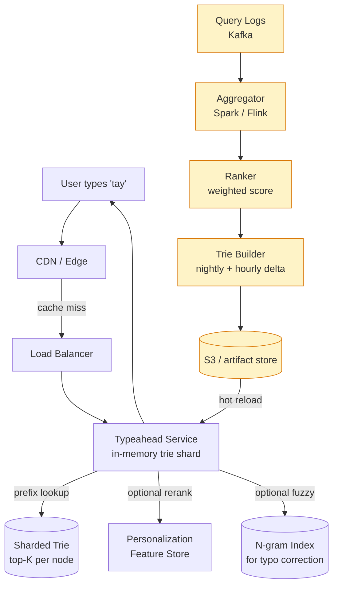
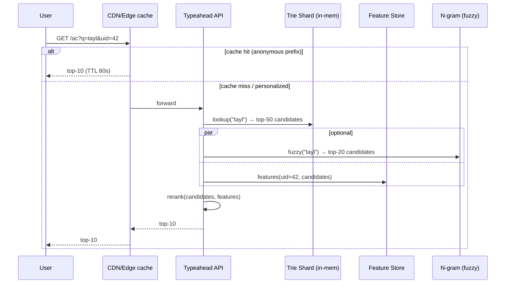
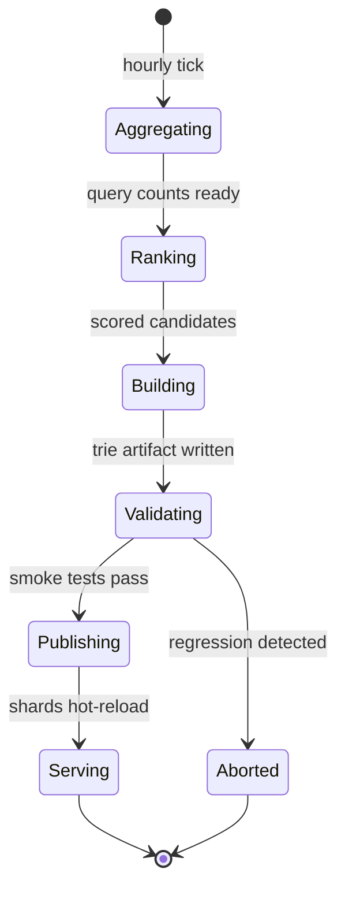
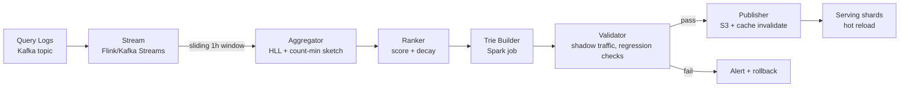

# Search Typeahead / Autocomplete

## Why This Exists

**Problem.** As a user types, you must return ~10 ranked suggestions in **<100ms p99** (ideally <50ms perceived) from a corpus of 10M–1B+ candidate queries, while continuously folding in fresh trends, personalization, and typo tolerance. Naïve `LIKE 'prefix%'` against a SQL table cannot meet the latency budget at scale, and a single in-memory trie cannot hold a billion entries on one box. Worse, the **distribution of prefixes is heavily skewed** — `"a"`, `"th"`, `"ne"` are hammered millions of times per second; `"xqj"` is hit once a week.

**Key insight.** Typeahead is a **read-mostly, latency-sensitive lookup problem layered on top of a heavy, infrequent index build**. You decouple the two: an offline (or near-real-time) pipeline aggregates query logs, ranks candidates, and emits a **prefix → top-K** structure (a serialized trie, an inverted index, or a flat hash). The serving tier just does a prefix lookup and returns the precomputed top-K. Anything more sophisticated (personalization, fuzzy matching, freshness blending) is a **rerank on top of a small candidate set**, never a scan over the full corpus.

**Reach for this when:**
- Interview prompts: "design Google/YouTube/Twitter/Amazon search suggestions"
- You need sub-100ms suggestions over millions+ of candidate strings
- Suggestions must reflect popularity, recency, and per-user signals
- The corpus changes daily but reads dominate writes by 1000:1+

**Don't reach for this when:**
- The candidate set is <10k items — just ship a JS array and filter client-side
- You need full-text search over document bodies — that's Elasticsearch / Lucene territory, not typeahead
- Suggestions must be transactionally consistent with a system-of-record (e.g. autocompleting from a live inventory table) — use direct DB indexes with a covering index on `(prefix, popularity)` and accept the latency

## Diagrams

### High-level architecture



### Request path (sequence)



### State of the offline rebuild



## Core Design

### 1. The trie with top-K at each node

The classic data structure. At every internal node corresponding to prefix `p`, store the **top-K most popular completions of `p`** (K is usually 5–10). Lookup is O(|p|) — walk down the trie following characters, then return the precomputed list at the terminal node. **No subtree traversal at query time.**

```python
# Simplified trie node — production version uses arrays, not dicts, for cache locality
from dataclasses import dataclass, field
from typing import Dict, List, Tuple
import heapq

@dataclass
class TrieNode:
    # children indexed by character; in production use a fixed-size array if alphabet is small
    children: Dict[str, "TrieNode"] = field(default_factory=dict)
    # top-K completions visible from this prefix: (score, query_string)
    # stored sorted descending so lookup is O(K), not O(K log K)
    top_k: List[Tuple[float, str]] = field(default_factory=list)

class Trie:
    def __init__(self, k: int = 10):
        self.root = TrieNode()
        self.k = k

    def insert(self, query: str, score: float) -> None:
        """Insert a (query, score) pair and propagate top-K up to every prefix node."""
        node = self.root
        path = [node]
        for ch in query:
            node = node.children.setdefault(ch, TrieNode())
            path.append(node)
        # walk back up, updating top-K at each ancestor
        for n in path:
            self._merge_top_k(n, score, query)

    def _merge_top_k(self, node: TrieNode, score: float, query: str) -> None:
        # if query already in top-K, update its score; otherwise insert + truncate
        for i, (s, q) in enumerate(node.top_k):
            if q == query:
                node.top_k[i] = (score, query)
                node.top_k.sort(key=lambda x: -x[0])
                return
        # heap-replace if full
        if len(node.top_k) < self.k:
            node.top_k.append((score, query))
            node.top_k.sort(key=lambda x: -x[0])
        elif score > node.top_k[-1][0]:
            node.top_k[-1] = (score, query)
            node.top_k.sort(key=lambda x: -x[0])

    def lookup(self, prefix: str) -> List[str]:
        """O(|prefix|) prefix match, returns top-K completions."""
        node = self.root
        for ch in prefix:
            if ch not in node.children:
                return []  # no completions — caller may fall back to fuzzy
            node = node.children[ch]
        return [q for _, q in node.top_k]
```

**Memory cost is the killer.** Each node carries K completions; with K=10, average query length 25 chars, that's roughly 250 bytes per node × ~30M nodes for a 1B-query corpus = **~7.5 GB per replica before any pointer overhead**. In Java/Python with object headers it balloons 3–5×. Two production fixes:

1. **Compact serialization.** Store the trie as a single byte buffer (LOUDS, DAFSA, or marisa-trie). Lookups become pointer arithmetic on a flat buffer — no GC pressure, mmap-friendly, ~10× smaller. Twitter's typeahead [used a "blender" architecture with serialized tries](https://blog.x.com/engineering/en_us/a/2014/twitter-search-is-now-3x-faster) loaded into Earlybird shards.
2. **Sharding by prefix.** Partition the trie by first 1–2 characters (`a*`, `b*`, …, `zz*`). Each shard fits comfortably in RAM; the router fan-outs nothing — it just hashes the prefix to one shard.

### 2. Ranking score

The score on each `(prefix, query)` pair is what drives suggestion quality. A solid baseline:

```python
def base_score(query: str, now: int) -> float:
    """
    Combine raw popularity with time decay so trending queries surface
    without yesterday's news dominating forever.
    """
    counts = query_counts_per_hour(query)  # from query log aggregator
    # exponential decay with half-life of ~7 days
    HALF_LIFE_HOURS = 24 * 7
    LAMBDA = math.log(2) / HALF_LIFE_HOURS
    score = 0.0
    for hours_ago, c in counts.items():
        score += c * math.exp(-LAMBDA * hours_ago)
    # length penalty — short queries are over-popular ("a", "the")
    # not always desired; tune empirically
    return score / (1 + 0.1 * math.log(1 + len(query)))
```

In real systems this is a learned ranker (GBDT/LambdaMART) over features: query CTR, dwell-time on landing results, query freshness, language, locale, device, time-of-day. The **trie still stores precomputed top-K** — you just rerank that small set at query time with online features.

### 3. N-gram index for fuzzy matching

A trie can't answer `"tayler swft"` → `"taylor swift"`. For typo tolerance, build a parallel **character n-gram inverted index**:

```python
# n-grams of "taylor" with n=3: {"tay", "ayl", "ylo", "lor"}
def ngrams(s: str, n: int = 3) -> set[str]:
    s = f"^{s}$"  # boundary markers help anchor short strings
    return {s[i:i+n] for i in range(len(s) - n + 1)}

# offline: build inverted index n-gram -> [query_ids ranked by popularity]
# online: for query "tayler", get its n-grams, retrieve postings, score by overlap
def fuzzy_candidates(query: str, postings: dict, top_n: int = 50) -> list[str]:
    grams = ngrams(query)
    counter: dict[str, float] = {}
    for g in grams:
        for qid, popularity in postings.get(g, [])[:1000]:  # cap per-gram
            counter[qid] = counter.get(qid, 0) + popularity
    # filter by edit-distance cutoff (Levenshtein <= 2 typically)
    return sorted(counter.items(), key=lambda x: -x[1])[:top_n]
```

Production refinements: SymSpell (precomputed deletions, faster than BK-tree), Levenshtein automaton intersected with the trie (Lucene's approach), or a learned typo model over query reformulations. Cite [Murilo Vasconcelos's writeup of SymSpell](https://wolfgarbe.medium.com/1000x-faster-spelling-correction-algorithm-2012-8701fcd87a5f) — typo correction in microseconds.

### 4. Personalization — rerank, never re-retrieve

Never personalize at the trie level (would explode storage to per-user tries — billions of structures). Instead:

```python
def personalized_rerank(
    candidates: list[str],         # ~50 from trie + ~20 from fuzzy
    user_features: dict,           # location, language, recent searches, click history
    base_scores: dict,
) -> list[str]:
    """Light reranker — must complete in <5ms for top-50 candidates."""
    scored = []
    for q in candidates:
        s = base_scores[q]
        # boost queries similar to recently clicked
        if q in user_features.get("recent_clicks", set()):
            s *= 2.0
        # locale match
        if locale_of(q) == user_features.get("locale"):
            s *= 1.3
        # demote queries the user already searched recently (avoid showing "weather" 5×/day)
        if q in user_features.get("last_5min_searches", set()):
            s *= 0.3
        scored.append((s, q))
    scored.sort(key=lambda x: -x[0])
    return [q for _, q in scored[:10]]
```

The feature store (Redis, RocksDB, or a dedicated system like Feast) returns the user's feature vector in <2ms via a single `MGET`. The reranker is a small model (linear, GBDT with depth ≤6) for predictability.

### 5. Periodic rebuild pipeline



Cadence: **hourly delta updates layered on a nightly full rebuild**. The full rebuild is idempotent and replayable; the hourly job emits "diff fragments" (new top-K for a small set of prefixes affected by recent searches). Serving applies diffs without restart.

```python
# Sketch: idempotent rebuild driver
def rebuild_typeahead(window_start: int, window_end: int) -> str:
    raw = read_query_logs(window_start, window_end)            # Spark
    aggregated = raw.groupBy("query").agg(
        F.sum("count").alias("count"),
        F.max("ts").alias("last_seen"),
    )
    scored = aggregated.withColumn("score", score_udf("count", "last_seen"))
    # build per-shard tries in parallel
    for shard in range(NUM_SHARDS):
        shard_rows = scored.filter(shard_predicate(shard))
        trie = build_trie(shard_rows.collect(), k=10)
        artifact = serialize_marisa(trie)
        s3_put(f"typeahead/{window_end}/shard-{shard}.trie", artifact)
    # publish manifest atomically — serving polls this
    s3_put(f"typeahead/{window_end}/MANIFEST", json.dumps({"shards": NUM_SHARDS, "ts": window_end}))
    return f"typeahead/{window_end}/MANIFEST"
```

**Validation gate is non-negotiable.** Before flipping the manifest, replay 1% of yesterday's prefix queries against the new artifact and assert: (a) p99 latency unchanged, (b) suggestion overlap with previous build > 80% on head queries (sudden 50% churn = bug), (c) no offensive/PII queries in top-K (run a denylist filter — this is how Google/Twitter typeaheads have leaked private info historically).

### 6. Serving tier choices

| Option | When |
|---|---|
| **In-memory service (Java/Go/Rust) with mmap'd marisa-trie** | Default for high QPS. Lowest latency (sub-ms trie lookup). Sharded by prefix. |
| **Redis with sorted sets per prefix** (`ZADD ac:tay <score> "taylor swift"`) | Quick to build, ops team already runs Redis. Works <50M prefixes. **Watch hot-key risk** on short prefixes. |
| **Redis Search (RediSearch)** | Built-in fuzzy + prefix. Vendor lock-in, good for moderate scale. |
| **Elasticsearch completion suggester (FST-backed)** | If you already run ES. Higher latency (~10–30ms p99) than custom service but zero new infra. |
| **CDN edge cache in front of any of the above** | Always. Anonymous-prefix queries are 80%+ of traffic and identical across users. TTL 30–300s. |

```python
# Redis serving sketch — simple but watch for hot keys on "a", "th", etc.
import redis
r = redis.Redis()

def insert_redis(prefix: str, query: str, score: float):
    r.zadd(f"ac:{prefix}", {query: score})
    # keep only top 10 per prefix to bound memory
    r.zremrangebyrank(f"ac:{prefix}", 0, -11)

def lookup_redis(prefix: str, k: int = 10) -> list[str]:
    return [q.decode() for q in r.zrevrange(f"ac:{prefix}", 0, k - 1)]
```

This is fine for a startup. At Twitter/Google scale, the hot-key on `ac:a` becomes a single-shard bottleneck — a custom in-memory service with prefix sharding is the only way out.

## Trade-offs

| Benefit | Cost |
|---|---|
| Trie + top-K gives O(|prefix|) lookups | Memory blows up at billion-query scale; needs compact serialization |
| Precomputed top-K means no scan at query time | Top-K is stale until next rebuild — typically minutes to hours |
| Sharding by prefix scales horizontally | Hot shards on `a*`, `s*` need extra replicas; uneven utilization |
| N-gram index handles typos well | 3–5× more storage than the trie alone; postings can be huge |
| CDN cache absorbs anonymous traffic | Can't cache personalized responses — origin still hit for logged-in users |
| Personalization-as-rerank avoids per-user index explosion | Reranker latency budget is tight (<5ms); model complexity is bounded |
| Periodic rebuild keeps things simple, batch-friendly | Trending queries take minutes-hours to surface; needs streaming layer for "what's hot right now" |
| Stream + batch (lambda architecture) gives both freshness and accuracy | Two pipelines to maintain; reconciliation bugs are subtle |

## Common Pitfalls

- **Showing private/offensive completions.** Both Google and Twitter have shipped typeaheads that auto-completed people's home addresses or hate speech. Always run a **denylist + PII detector + minimum-popularity threshold** (e.g. require 50+ distinct users to have searched the query before it can ever appear). Treat the validation step as security-critical.
- **Hot-key meltdown on `"a"` and `"th"`.** Short prefixes get 1000× the traffic of long ones. If your serving layer is Redis or a single-master KV, the shard owning these prefixes melts. Fixes: (1) CDN cache, (2) in-process LRU on serving nodes for top-100 prefixes, (3) replicate hot prefixes to every shard.
- **Forgetting Unicode.** "café" vs "cafe", Cyrillic look-alikes, full-width Japanese characters. Normalize to NFKC, fold case, strip diacritics — but **store both forms** so display is correct. CJK languages need segmentation (no spaces) or character-level n-grams.
- **Rebuild OOM on the largest shard.** A single Spark executor tries to hold all of `t*` in memory. Fix: shard finer (`ta*`, `tb*`), or build the trie incrementally with a streaming sort + DAFSA construction.
- **Trie hot-reload races.** Pointing the live service at a new artifact while requests are in flight crashes if you free the old buffer too early. Use **double-buffering with refcounts** (load new, atomic swap pointer, drain old after grace period).
- **Personalization leaking between users.** Caching personalized responses at CDN with no `Vary: Authorization` or with a shared cache key. You'll hand User A's recent searches to User B. Always include `uid` in cache key for personalized paths, or skip CDN entirely and rely on origin caching keyed by `(prefix, uid)`.
- **Edit-distance > 2 is a footgun.** Allowing 3+ typos explodes candidate set and degrades quality (`"car"` ≈ `"bar"`). Cap at 2, with edit-distance 1 for prefixes ≤ 4 chars.
- **Logging the user's in-progress query.** They typed `"my password is "` and paused. If you log every keystroke, you've created a credential leak. Sample, redact known sensitive prefixes (CC numbers, SSN patterns), and never log unsubmitted queries in plaintext.
- **Treating CTR as ground truth.** Position bias means top-1 always has highest CTR regardless of relevance. Use position-aware metrics (NDCG, MRR with reciprocal-rank weighting) and randomize positions occasionally to debias training data.
- **No guard against query log poisoning.** A botnet hammering `"buy my crypto scam"` can rocket it to top suggestions. Apply per-IP/per-user rate limits in the aggregator and require diversity (N distinct users, not N searches).

## Decision Table

| Scenario | Use this | Not this |
|---|---|---|
| <10k candidate items, latency-tolerant | Client-side JS filter | Server typeahead service |
| 1M items, single region, small team | **Redis sorted sets per prefix** | Custom trie service |
| 100M+ items, sub-50ms p99, many regions | **Sharded in-memory service with marisa-trie + CDN** | Redis (hot-key meltdown) |
| Need typo tolerance | **N-gram index + Levenshtein cutoff** OR Lucene FST suggester | Plain trie alone |
| Need personalization | **Trie retrieves top-50, reranker personalizes** | Per-user tries (storage explosion) |
| Real-time trending (<5 min freshness) | **Streaming layer (Flink) producing diff fragments** | Pure nightly rebuild |
| Already running Elasticsearch, modest scale | **ES completion suggester** | Build custom infra |
| Suggestions must reflect transactional state (live inventory) | **Direct DB index on `(prefix, popularity)`** with covering index | Stale precomputed trie |
| Strict privacy (e.g. health, finance) | **Per-user trie scoped to their data**, no global popularity | Global popularity-ranked typeahead |
| Multilingual, including CJK | **Locale-sharded indexes + per-language tokenization** | Single global trie with byte-level keys |

## References

- DDIA — Designing Data-Intensive Applications, ch. 3 (Storage and Retrieval, including B-trees, LSM, and full-text indexes) and ch. 11 (Stream Processing) — Martin Kleppmann, O'Reilly 2017.
- Google SRE Book — ch. 22 "Addressing Cascading Failures" (relevant for hot-prefix overload) — https://sre.google/sre-book/addressing-cascading-failures/
- Twitter Engineering — "Twitter Search is Now 3x Faster" (Earlybird and the typeahead/blender architecture) — https://blog.x.com/engineering/en_us/a/2014/twitter-search-is-now-3x-faster
- Twitter Engineering — "Reducing search indexing latency to one second" — https://blog.x.com/engineering/en_us/topics/infrastructure/2020/reducing-search-indexing-latency-to-one-second
- Wolfgang Garbe — "1000x Faster Spelling Correction" (SymSpell algorithm) — https://wolfgarbe.medium.com/1000x-faster-spelling-correction-algorithm-2012-8701fcd87a5f
- Lucene — Finite State Transducers (FST) for the completion suggester — https://lucene.apache.org/core/9_0_0/core/org/apache/lucene/util/fst/package-summary.html
- Susumu Yata — marisa-trie: a static, succinct, compact trie — https://github.com/s-yata/marisa-trie
- LinkedIn Engineering — "Did You Mean 'Galene'?" (search infrastructure including typeahead) — https://engineering.linkedin.com/search/did-you-mean-galene-linkedins-new-search-architecture
- Etsy Engineering — "Building a Better Autosuggest" — https://www.etsy.com/codeascraft/building-a-better-autosuggest
- AWS Builders' Library — "Caching challenges and strategies" (relevant for CDN/edge caching of typeahead) — https://aws.amazon.com/builders-library/caching-challenges-and-strategies/
- Alex Xu — System Design Interview Vol. 1, ch. 13 "Design a Search Autocomplete System" — Byte Code LLC, 2020.
- Manning, Raghavan, Schütze — Introduction to Information Retrieval, ch. 3 (Dictionaries and Tolerant Retrieval) — Cambridge, 2008. Free online: https://nlp.stanford.edu/IR-book/
- Daniel Tunkelang — "Query Understanding" series (autocomplete as the first step of query understanding) — https://queryunderstanding.com/

## See Also

- ../top-k-leaderboard/ — same top-K-per-key shape, different read pattern; useful for the ranker scoring layer
- ../news-feed/ — fan-out vs fan-in trade-off mirrors typeahead's offline-build vs online-rerank split
- ../rate-limiter/ — protect the typeahead service and the query-log ingest from abuse and poisoning
- ../web-crawler/ — adjacent to query log ingestion; both are heavy batch pipelines feeding online indexes
- ../../data-systems/inverted-index/ — the n-gram index here is a specialized inverted index
- ../../data-systems/lsm-tree/ — alternative storage for the offline candidate store at very large scale
- ../../caching/cdn-edge-caching/ — anonymous-prefix CDN caching is the single biggest latency win
- ../../caching/hot-key-mitigation/ — directly addresses the `"a"`/`"th"` hot-prefix problem
- ../../streaming/lambda-architecture/ — the batch + streaming rebuild pattern used here
- ../../ml-systems/learned-ranker/ — for the personalization rerank stage
- ../../privacy/pii-redaction/ — for the validation gate that prevents leaking private queries
