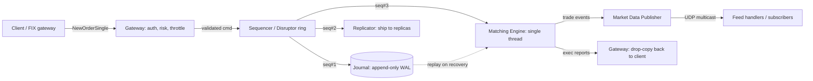
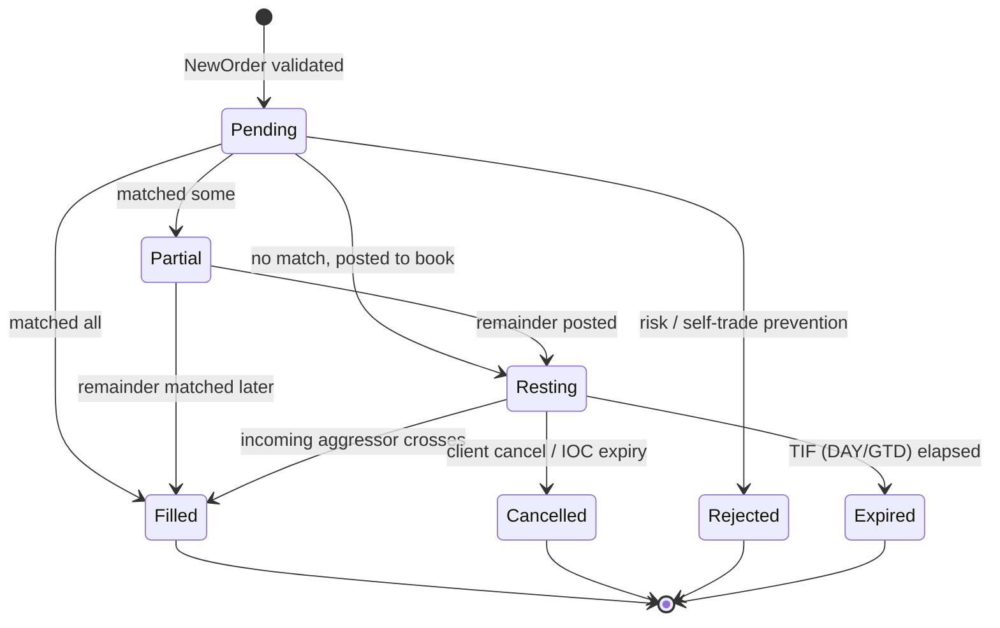
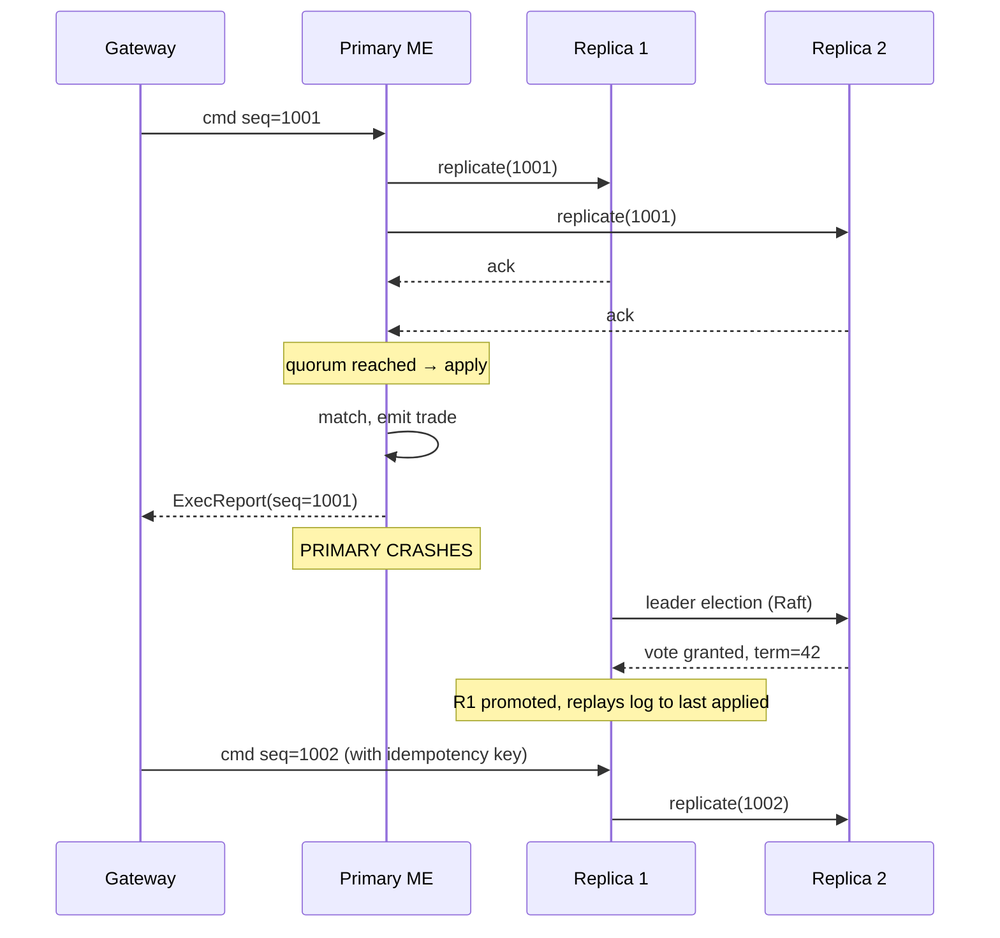

# Stock Exchange / Matching Engine

## Why This Exists

**Problem.** A matching engine takes a torrent of buy and sell orders and pairs them into trades — fairly, deterministically, and fast. Done badly: trades execute at the wrong price, two replicas disagree about who got filled, p99 latency balloons during the open auction, the market data feed gaps and every algo on the Street unwinds, or a software bug lets a fat-finger order vaporize $440M in 45 minutes (Knight Capital, 2012).

**Key insight.** The hardest problem isn't matching — it's **determinism under replication and failure**. If you treat the matching engine as a deterministic state machine driven by a totally-ordered input log, every other property (replication, recovery, audit, replay) falls out for free. This is the LMAX architecture in one sentence: **single-writer principle + sequenced input log + business logic on one core**. Throw threads at the problem and you'll spend the next decade chasing race conditions that only show up under load.

**Reach for this when:**
- Interview prompt: "Design a stock exchange / crypto matching engine / limit order book / dark pool"
- Building any system where ordering and fairness are correctness properties (not perf properties)
- You need microsecond-scale tail latency with deterministic replay for audit/regulatory reconstruction
- The throughput target is high (≥100k orders/sec) and you can't tolerate locks on the hot path

**Don't reach for this when:**
- You're building an OMS / execution router / smart order router — those are stateful clients of an exchange, not the exchange itself
- You need eventual consistency and high availability over strict ordering (use a distributed log + workers)
- The problem is read-heavy aggregation (use OLAP, not a matching engine)
- You're tempted to put the order book in Redis or Postgres — these add 10-1000× latency over an in-process data structure

## Diagrams

### End-to-end order flow



The sequencer assigns a monotonic sequence number to every command. Three consumers run in parallel from the ring buffer: journal (durability), replicator (HA), matching engine (business logic). The ME only proceeds for sequence N once journal+replicator have acknowledged N.

### Order book state machine



### Failover with state-machine replication



## Core Design

### 1. Order book data structure (price-time priority)

The dominant invariant: **best price wins; among equal prices, oldest order wins**. The standard implementation is two side books, each a sorted map of price levels, where each level is a FIFO queue of orders.

```python
from collections import OrderedDict
from dataclasses import dataclass, field
from sortedcontainers import SortedDict  # O(log n) ordered map
from typing import Optional
import itertools

# Production engines use fixed-point integer prices (ticks) — never float.
# A "price" of 100.25 with tick size 0.01 → 10025 ticks. Avoids FP drift,
# enables exact equality compares, and makes hashing deterministic.
TickPrice = int     # e.g. 10025 means $100.25 at 0.01 tick
Qty = int           # share/contract counts as integers

@dataclass
class Order:
    order_id: int
    client_id: int
    side: str           # 'B' or 'S'
    price: TickPrice    # 0 = MARKET
    qty: Qty            # remaining, mutates in place
    ts_seq: int         # exchange sequence number, defines time priority
    tif: str = 'DAY'    # DAY, IOC, FOK, GTC
    # Doubly-linked list pointers inside its price level (set by book)
    prev: Optional['Order'] = None
    next: Optional['Order'] = None

@dataclass
class PriceLevel:
    price: TickPrice
    head: Optional[Order] = None     # oldest (priority)
    tail: Optional[Order] = None     # newest
    total_qty: Qty = 0               # sum of resting qty (cached for fast top-of-book)

    def push(self, o: Order) -> None:
        o.prev, o.next = self.tail, None
        if self.tail:
            self.tail.next = o
        else:
            self.head = o
        self.tail = o
        self.total_qty += o.qty

    def remove(self, o: Order) -> None:
        # O(1) given the order handle — that's why orders carry their own pointers.
        # Looking an order up by id and then walking the queue would be O(n).
        if o.prev: o.prev.next = o.next
        else:      self.head    = o.next
        if o.next: o.next.prev = o.prev
        else:      self.tail   = o.prev
        self.total_qty -= o.qty

class OrderBook:
    def __init__(self, symbol: str):
        self.symbol = symbol
        # Bids: descending (best = highest). Asks: ascending (best = lowest).
        # SortedDict gives O(log n) insert/remove and O(1) peek of best.
        self.bids: SortedDict[TickPrice, PriceLevel] = SortedDict(lambda p: -p)
        self.asks: SortedDict[TickPrice, PriceLevel] = SortedDict()
        self.orders: dict[int, Order] = {}  # id → Order, for O(1) cancel/amend

    def best_bid(self) -> Optional[PriceLevel]:
        return self.bids.peekitem(0)[1] if self.bids else None

    def best_ask(self) -> Optional[PriceLevel]:
        return self.asks.peekitem(0)[1] if self.asks else None
```

Why these data structures:
- **`SortedDict` of price → level**: O(log n) insert at a new price, O(1) peek of best. Crucially, once a price level exists, all subsequent inserts at that price are O(1) (just append to its FIFO).
- **Doubly-linked FIFO inside each level**: O(1) cancel given the order handle. A naive `list` makes cancel O(n) — fatal under HFT cancel/replace storms (cancel-to-trade ratios of 100:1+ are routine).
- **`orders` hash by id**: O(1) lookup for cancels and modifies. The order itself owns the linked-list pointers, so once you find it, removal is constant time.

Production implementations (e.g. Chronicle Order Book, Aeron's Cluster examples) often replace `SortedDict` with a **fixed-size price-level array** when prices are bounded (e.g. equities ticks within ±20% of yesterday's close). This collapses the log factor to O(1) and is cache-friendly.

### 2. The matching algorithm

```python
@dataclass
class Trade:
    seq: int
    symbol: str
    aggressor_id: int
    resting_id: int
    price: TickPrice
    qty: Qty
    ts: int

class MatchingEngine:
    def __init__(self):
        self.books: dict[str, OrderBook] = {}
        self.seq = itertools.count(1)
        self.trades: list[Trade] = []

    def on_new_order(self, o: Order) -> list[Trade]:
        book = self.books.setdefault(o.symbol, OrderBook(o.symbol))
        trades = self._match(book, o)
        # Whatever is left rests on the book (unless IOC / FOK rules ate it)
        if o.qty > 0 and o.tif not in ('IOC', 'FOK'):
            self._rest(book, o)
        elif o.qty > 0 and o.tif == 'FOK':
            # FOK = fill or kill: undo any partial fills. Either it all crossed at
            # entry or none of it did. (FOK is checked BEFORE matching in real
            # engines via a dry-run pass; shown here as a conceptual rollback.)
            self._rollback(trades); trades.clear()
        return trades

    def _match(self, book: OrderBook, taker: Order) -> list[Trade]:
        trades = []
        opp = book.asks if taker.side == 'B' else book.bids
        crosses = (lambda p: taker.price == 0 or taker.price >= p) if taker.side == 'B' \
                  else (lambda p: taker.price == 0 or taker.price <= p)
        while taker.qty > 0 and opp:
            best_price, level = opp.peekitem(0)
            if not crosses(best_price):
                break  # no more crossable liquidity
            while taker.qty > 0 and level.head:
                maker = level.head
                fill_qty = min(taker.qty, maker.qty)
                # Trade prints at the MAKER's price — this is the price-improvement
                # rule that almost every textbook glosses over. The aggressor cannot
                # improve the resting order's price.
                trades.append(Trade(
                    seq=next(self.seq), symbol=book.symbol,
                    aggressor_id=taker.order_id, resting_id=maker.order_id,
                    price=best_price, qty=fill_qty, ts=now_ns(),
                ))
                taker.qty -= fill_qty
                maker.qty -= fill_qty
                level.total_qty -= fill_qty
                if maker.qty == 0:
                    level.remove(maker)
                    book.orders.pop(maker.order_id, None)
            if level.head is None:
                opp.popitem(0)  # level emptied; remove from price map
        return trades
```

Subtleties that bite people:
- **Self-trade prevention (STP)** belongs *here*, not at the gateway. A client may have multiple sessions; the gateway can't see the resting side. Implement by checking `taker.client_id == maker.client_id` and applying a configured policy (cancel-newest / cancel-oldest / decrement-and-cancel).
- **Pro-rata vs price-time**: futures markets (CME Eurodollars classic) split fills proportionally instead of FIFO. Same data structure, different `_match` inner loop.
- **Hidden / iceberg orders**: only the visible quantity sits at the head; on fill, the engine refreshes from the hidden reserve and re-queues at the *back* (a fresh `ts_seq`) — otherwise iceberg holders would have permanent priority.
- **Pegged orders** (peg to mid, peg to bid) recompute their price every time the reference moves — these are the dominant source of cancel/replace traffic in real markets.

### 3. Sequencer / LMAX Disruptor

The single most-cited paper in matching-engine design is the LMAX Disruptor (Thompson, Farley, et al., 2011). The key claims, all empirically true on commodity hardware:

1. **Locks are ~1000× more expensive than CAS in the contended case** (~1 µs per acquire/release vs ~30 ns for an atomic increment).
2. **Queues thrash caches** — a typical `LinkedBlockingQueue` writes to head, tail, and node pointers from different threads, guaranteeing cache-line ping-pong on every hand-off.
3. **A pre-allocated ring buffer with single writer + memory barriers** lets producer and consumers run lock-free, with the consumers reading already-warm cache lines.

Conceptually:

```java
// Sketched after the Disruptor pattern. In Java, the LMAX library handles this;
// in C++, look at moodycamel::ConcurrentQueue or a hand-rolled SPMC ring; in
// Rust, crossbeam's array_queue or rtrb. The DESIGN is the point, not the lib.

final class CommandRing {
    private final Command[] slots;          // pre-allocated, mutated in place
    private final int mask;                  // size is power of 2: idx & mask
    private final AtomicLong producerSeq = new AtomicLong(-1);
    private final AtomicLong[] consumerSeqs;  // one per consumer

    Command claim(long seq) { return slots[(int)(seq & mask)]; }

    void publish(long seq) {
        // Memory barrier: everything written to slots[seq] happens-before the
        // increment of producerSeq becoming visible. Consumers spin on producerSeq.
        producerSeq.lazySet(seq);
    }

    long waitFor(long seq, int consumerIdx) {
        // Busy-spin → yield → park progression. Tunable per latency budget.
        while (producerSeq.get() < seq) Thread.onSpinWait();
        return producerSeq.get();
    }
}
```

The matching engine consumes from the ring at sequence N only after the journaler and replicator have signalled they've persisted/shipped N. That dependency graph (the "barrier") is the heart of the Disruptor pattern.

**Why single-threaded matching is a feature, not a limitation.** A modern x86 core can process 6–10M simple events/sec when L1-resident. NASDAQ's INET handles ~100k orders/sec at peak with massive headroom; CME's Globex publishes peak-rate stats around 200k/sec. You don't *need* parallelism — you need to keep the hot path in L1 cache. Threading the matching engine forces locks on the book, which destroys both throughput and determinism.

### 4. Replication for fault tolerance

Two viable patterns. Pick one and commit.

**(a) Journal-based primary/replica.** Primary writes every command to a durable log before applying. Replicas tail the log and apply the same commands in the same order — they reach byte-identical state because matching is deterministic. On primary failure, a replica is promoted and resumes from the next un-applied sequence. This is what LMAX, Aeron Cluster, and most equities exchanges use.

**(b) Consensus-replicated log (Raft / Paxos).** Treat the input log as a Raft-replicated state machine. The commit step requires a quorum ack before the engine applies. Stronger consistency guarantees (no split-brain trades), but adds a network round-trip to every order — typically 100–500 µs in a single DC, which may or may not be acceptable.

```python
# Idempotent command application — required for either pattern.
class ReplicatedME:
    def __init__(self):
        self.last_applied_seq = 0
        self.engine = MatchingEngine()

    def apply(self, cmd):
        if cmd.seq <= self.last_applied_seq:
            return  # duplicate from replay; ignore. THIS IS THE FOUNDATION OF
                    # FAILOVER CORRECTNESS — without it, you double-fill on
                    # the first orders post-promotion.
        assert cmd.seq == self.last_applied_seq + 1, "gap in log"
        self.engine.dispatch(cmd)
        self.last_applied_seq = cmd.seq
```

The `seq == last_applied + 1` invariant is non-negotiable. A gap means you're about to apply a command whose predecessors haven't run — your book state is wrong. Block, alert, and refuse to take new orders until the gap is resolved (usually by re-fetching from the log).

**Idempotency keys at the gateway.** Clients must include a `cl_ord_id` on every NewOrder. The gateway dedupes against an LRU of recent ids before passing to the sequencer. Without this, a client retry after a TCP timeout creates a duplicate trade. (FIX 4.4 makes `ClOrdID` mandatory for exactly this reason.)

### 5. Market data feed

The matching engine emits an event for every state change: trades, book updates (add/modify/cancel), session events (open auction, halt, resume). These are serialized into a binary protocol — ITCH (NASDAQ) or MDP 3.0 (CME) are the canonical references — and shipped via UDP multicast.

Why UDP multicast and not TCP:
- One-to-many fan-out without per-subscriber state on the publisher.
- TCP retransmit semantics are *worse* than gap-fill for market data: if a packet is lost, a TCP sender will block all newer packets behind the retransmit (head-of-line blocking). Subscribers want the newest data immediately and a separate channel to recover the gap.
- Standard pattern: **A/B feed arbitration**. Publish the same data on two independent multicast groups via separate NICs/switches/paths. Subscribers take whichever packet arrives first, drop the duplicate. You tolerate the loss of an entire network path with zero gap.

```
A-feed:  [seq 100][seq 101][seq 102 LOST][seq 103][seq 104]
B-feed:  [seq 100][seq 101 LOST][seq 102][seq 103][seq 104]
Output:  [seq 100][seq 101 from A][seq 102 from B][seq 103][seq 104]
```

Plus a TCP "snapshot recovery" service for clients that gap and need to re-sync the book without replaying every event since open.

Latency for the feed is bounded by the matching engine's serialization step. **Don't allocate on the hot path.** Use pre-allocated message buffers, write fields by offset, and hand the ready buffer to a dedicated network thread. Production engines hit p50 wire-to-wire latencies of 5–30 µs.

### 6. Circuit breakers

These are the *last line of defense* against runaway markets and runaway algos. Implement at three levels:

| Level | Trigger | Action |
|---|---|---|
| **Order-level** (LULD: Limit Up / Limit Down) | Order would print outside ±5% / ±10% / ±20% band of 5-min reference | Reject or pause the symbol |
| **Symbol-level** (Stock-by-stock halts) | 5% move in 15 sec (T1) / 10% (T2) / 20% (T3) | 5-minute trading pause for the symbol |
| **Market-wide** (MWCB) | S&P 500 down 7% / 13% / 20% from prev close | 15-min halt / 15-min halt / close for the day |

Implementation lives in the matching engine itself (not the gateway), because:
1. The engine is the source of truth for last-trade price.
2. Halting must be deterministic across replicas — a halt is a state transition, not a side-effect.

```python
class CircuitBreaker:
    def __init__(self, ref_price: TickPrice, band_bps: int):
        self.ref = ref_price
        self.upper = ref_price + ref_price * band_bps // 10_000
        self.lower = ref_price - ref_price * band_bps // 10_000

    def check(self, intended_print_price: TickPrice) -> bool:
        return self.lower <= intended_print_price <= self.upper

    # In the matching loop, BEFORE recording the trade:
    # if not self.cb.check(best_price): self._pause_symbol(); return []
```

Reference prices typically refresh on a slow timer (every 30 sec or 5 min), not every trade. If you reset on every print, a runaway algorithm trivially walks the band — Flash Crash 2010 and the Knight Capital event both involved exactly this failure mode in adjacent components.

## Trade-offs

| Benefit | Cost |
|---|---|
| Single-threaded matching → deterministic, lock-free, replay-able | One core sets the throughput ceiling; you scale by sharding symbols across engines |
| In-memory order book → 1–10 µs match latency | RAM-only; durability lives in the journal, not the book — recovery requires log replay |
| LMAX Disruptor → no contention on the hot path | Pre-allocated ring buffer fixes max in-flight orders; bursty back-pressure must be handled at the gateway |
| Deterministic state machine → byte-identical replicas | All non-determinism (`time.now()`, random, hashmap iteration order) must be banished from the engine; even logging timestamps must come from the sequencer |
| UDP multicast feed → one-to-N at line rate | Lossy by design; subscribers must implement A/B arbitration + gap fill, which doubles their complexity |
| Symbol sharding scales horizontally | Cross-symbol orders (spreads, basket trades) become distributed transactions — usually pushed up to a separate spread-matching layer |
| Fixed-point integer prices → no FP drift, exact equality | Must define and version the tick schedule; corporate actions (splits, dividends) require a planned book reconstruction |
| Journal-based replication → simple, fast | Two-PC-style commit only on snapshot boundaries; raw failover may briefly accept duplicate ClOrdIDs unless gateway shares dedupe state |

## Common Pitfalls

- **Floating-point prices.** `0.1 + 0.2 != 0.3`. The first time a fill prints at $100.249999999 your reconciliation team will hate you. Use ticks (integer multiples of the minimum price increment) everywhere. Convert only at the API edge.
- **Allocating in the matching loop.** Every `new`/`malloc` is a potential GC pause / page fault. Pre-allocate orders, trades, message buffers. Use object pools. JVM engines (Aeron, Chronicle) push hard on zero-GC; C++ engines pin pages and avoid `std::shared_ptr` on the hot path.
- **`HashMap` iteration order.** Two replicas with the same input log will diverge if the engine ever iterates a hashmap whose order isn't insertion-deterministic. Use `LinkedHashMap` / explicit ordered structures; never rely on `dict` iteration in older Pythons.
- **Wall-clock time in the engine.** `System.nanoTime()` differs across replicas. Timestamps must come from the sequencer (one per command) and be the *only* source of "now" the engine sees.
- **Cancel-replace as cancel + new.** If a client modify is two messages, a fast aggressor can sneak between them and steal priority. Implement modify as a single atomic command that preserves priority *iff* price unchanged and qty did not increase.
- **Self-trade leakage.** Implementing STP only at the gateway misses cross-session cases. Always re-check at the engine.
- **Failover without idempotency.** A primary acks a trade, crashes before its replicas saw the command, replica gets promoted, client retries with same ClOrdID, replica creates a *second* trade. The primary's trade is "lost" but real (the original counterparty got the fill). Your reconciliation system finds it tomorrow morning. Idempotency keys on the gateway *and* monotonic seq enforcement on the engine prevent this.
- **Knight Capital, August 1, 2012.** A deployment left old code on one of eight servers; a re-purposed flag triggered the dormant code path; the flag was set to YES on a market-wide test and produced ~4M unintended orders in 45 minutes. Lessons: kill switches must be tested in production-like environments; dormant code paths are landmines; deploys must be all-or-nothing.
- **Flash Crash, May 6, 2010.** A large sell algo (sell 75k E-Mini contracts at 9% of volume, no price/time limits) interacted with HFT inventory cycling to drain liquidity; circuit breakers as they existed didn't catch it. Modern LULD bands are the direct response. Lesson: per-symbol bands matter; market-wide breakers are too coarse.
- **No back-pressure from the sequencer.** A slow journal disk fills the ring buffer and now your gateway is dropping orders silently. The sequencer must surface its high-water-mark to the gateway, which must reject or pause new entries before the ring saturates.
- **Treating the order book as the durable state.** It isn't. The journal is. The book is a *materialized projection* you can rebuild at any time by replaying the log. Designing this way keeps recovery, audit, and end-of-day reconciliation tractable.

## Decision Table

| Situation | Choice | Why |
|---|---|---|
| Building an exchange / lit market | Price-time priority, single-threaded ME, journal + replicas, UDP multicast feed | The proven pattern. NASDAQ INET, LSE Millennium, ICE iMpact, BATS PITCH all converge here |
| Building futures with deep books | Pro-rata or hybrid match | Encourages price-makers in low-vol contracts that would otherwise stagnate |
| Building a dark pool / midpoint matcher | Single-threaded ME, no public book, periodic indications-of-interest | Matching logic is simpler (no price levels — match at midpoint of NBBO); regulatory disclosure differs |
| Building a crypto CEX | Same architecture as equities, but per-pair sharding and 24/7 ops | Crypto pairs are independent → shard each on its own thread/box; HA matters more (no overnight maintenance window) |
| Building an OMS / SOR / EMS | Don't build a matching engine | You're a *client* of one or more exchanges; your concerns are routing, smart aggregation, FIX session management |
| Throughput requirement < 10k orders/sec | Postgres + advisory locks + a worker | A real ME is overkill; you'd spend more on operating it than it saves |
| Throughput 10k–100k orders/sec, ms-scale latency OK | Single-process Go/Java engine, RDBMS for durability | Skip the Disruptor; a `chan` or `BlockingQueue` is fine. Reserve the full LMAX stack for the µs-latency tier |
| Throughput > 100k orders/sec, µs tail latency required | Full LMAX stack: Disruptor sequencer, off-heap structures, pinned threads, kernel-bypass NIC (Solarflare, DPDK) | Anything less and you'll lose to GC pauses, syscall jitter, or NIC interrupts under load |
| Need cross-symbol atomic orders (basket, spread) | Layer a separate spread-matcher above per-symbol engines, with two-phase trade publication | Don't try to share state across engine shards — that path leads to global locks |
| Regulatory replay required (MiFID II / Reg NMS / SEC 17a-4) | Journal + deterministic engine + sealed sequence numbers, retain for 5–7 years | Determinism is the entire reason this is feasible; auditors literally re-run your binary against your log |

## References

Primary architecture sources:

- Thompson, Farley, et al. — *Disruptor: High Performance Alternative to Bounded Queues for Exchanging Data Between Concurrent Threads* (LMAX, 2011) — https://lmax-exchange.github.io/disruptor/disruptor.html
- Martin Fowler — *The LMAX Architecture* — https://martinfowler.com/articles/lmax.html
- Martin Thompson — *Mechanical Sympathy* blog (Disruptor internals, false sharing, memory ordering) — https://mechanical-sympathy.blogspot.com/
- Real Logic — *Aeron Cluster* (open-source production-grade Raft + Disruptor cluster) — https://github.com/real-logic/aeron/wiki/Cluster-Tutorial

Exchange and market-data protocols:

- NASDAQ — *TotalView-ITCH 5.0 Specification* — https://www.nasdaqtrader.com/content/technicalsupport/specifications/dataproducts/NQTVITCHSpecification.pdf
- CME Group — *MDP 3.0 Market Data Platform* — https://www.cmegroup.com/confluence/display/EPICSANDBOX/MDP+3.0+Market+Data
- FIX Trading Community — *FIX 4.4 / FIX 5.0 SP2 Specifications* — https://www.fixtrading.org/standards/

Regulatory and post-mortem:

- SEC / CFTC — *Findings Regarding the Market Events of May 6, 2010* (the Flash Crash report) — https://www.sec.gov/news/studies/2010/marketevents-report.pdf
- SEC — *In the Matter of Knight Capital Americas LLC* (release 70694, Oct 2013) — https://www.sec.gov/litigation/admin/2013/34-70694.pdf
- SEC — *Regulation NMS, Final Rule* — https://www.sec.gov/rules/final/34-51808.pdf
- NYSE — *LULD (Limit Up–Limit Down) Plan* — https://www.luldplan.com/

Books and broader systems context:

- Donald MacKenzie — *Trading at the Speed of Light: How Ultrafast Algorithms Are Transforming Financial Markets* (Princeton, 2021) — definitive account of HFT microstructure
- Larry Harris — *Trading and Exchanges: Market Microstructure for Practitioners* (OUP, 2003) — the canonical microstructure reference
- Kleppmann — *Designing Data-Intensive Applications* — ch. 5 (Replication), ch. 9 (Consistency / Total Order Broadcast), ch. 11 (Stream Processing)
- Beyer et al. — *Site Reliability Engineering* — ch. 22 (Addressing Cascading Failures), ch. 26 (Data Integrity) — https://sre.google/sre-book/table-of-contents/
- Xu / Lam — *System Design Interview Volume 2*, ch. on Stock Exchange — interview-shaped framing
- Adrian Colyer — *the morning paper* on the Disruptor — https://blog.acolyer.org/2014/12/03/disruptor/

## See Also

- `../../data-systems/consensus/` — Raft / Paxos / journal-tail replication generalized
- `../../architecture-patterns/event-sourcing/` — the matching-engine-as-state-machine view applied to general business domains
- `../../communication/idempotency/` — ClOrdID dedupe, exactly-once semantics under retry
- `../../reliability/circuit-breaker/` — circuit breakers in distributed systems (Hystrix-style) vs market circuit breakers
- `../payment-system/` — sibling interview template; shares idempotency, double-entry, and reconciliation themes
- `../distributed-counter/` — when you *don't* need total ordering and CRDTs suffice
- `../../performance/hot-path-optimization/` — ring buffers, hazard pointers, RCU, the foundations the Disruptor exploits
