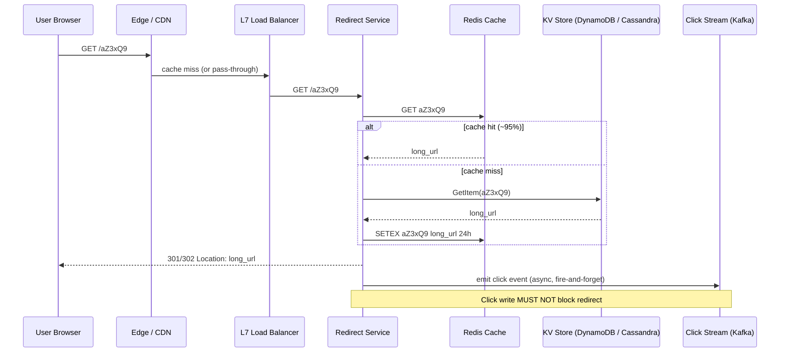
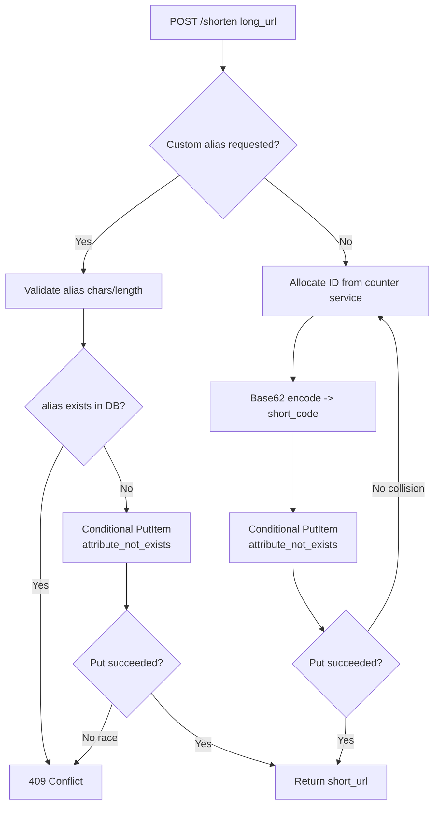
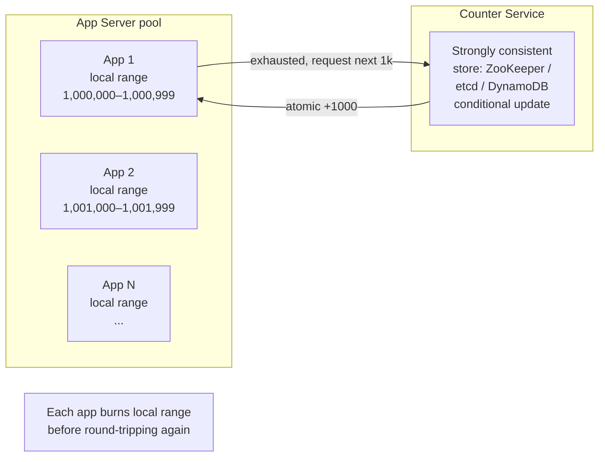
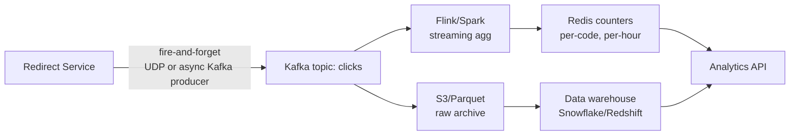

# URL Shortener (TinyURL / bit.ly)

A canonical interview problem because it forces you to reason about **ID generation under contention**, **read-heavy caching**, **collision handling**, and **capacity math** — all in 45 minutes. The trap: candidates dive into base62 encoding immediately and miss that the real design pressure is the ID allocation strategy and the cache hit ratio.

## Why This Exists

**Problem.** Given a long URL, return a short alias (e.g. `https://tiny.cc/aZ3xQ9`) that redirects to the original. Must scale to **~100B URLs**, **~10:1 read:write**, sub-100ms p99 redirects globally, and never serve the wrong destination.

**Key insight.** This is a **read-heavy KV lookup** with a **write-side ID allocation problem**. The 99% hot path is `GET short_code -> long_url`, served from cache. The hard part is generating short codes that are (a) globally unique, (b) short (6–8 chars), (c) cheap to allocate at write time, and (d) hard to enumerate (security). Every other "hard" piece — analytics, custom URLs, geo-replication — is decoupled from the redirect path.

**Reach for this when:**
- You need a **short, opaque, stable identifier** for an external resource (URL, file, share link, invite code).
- Read traffic dwarfs write traffic (10:1 or more) and the working set fits in cache.
- Latency budget for redirect is < 100ms p99 and writes can be slower (100–500ms).

**Don't reach for this when:**
- The mapping changes (URL shorteners are append-only; mutating destinations breaks links — use a redirect rules engine instead).
- You actually need **search/discovery** over URLs — a shortener is a KV index, not a search engine.
- The traffic is **write-heavy** (analytics ingestion, event logs) — different design pressures, see `../rate-limiter/` or `../newsfeed/`.

## Diagrams

### Redirect hot path (99% of traffic)



### Write path: create short URL



### ID allocation: range-based counter (the hidden hard part)



## Capacity math (do this first in the interview)

Always show the back-of-envelope. Numbers anchor every later decision.

```
Assumptions
-----------
- 100 B (1e11) URLs total over service lifetime
- 100:1 read:write ratio
- 100M new URLs/day -> ~1,200 writes/sec average, ~12k/sec peak (10x burst)
- 10B redirects/day -> ~120k reads/sec average, ~1.2M/sec peak
- avg long URL = 100 bytes; short code = 7 bytes; metadata = ~50 bytes -> ~160 B/row
- 100B * 160B = 16 TB raw; ~50 TB with replication factor 3 + indexes

Short code length
-----------------
- base62 (a-zA-Z0-9):
    62^6 = 5.7e10  (57 B)  -- not enough headroom for 100 B
    62^7 = 3.5e12  (3.5 T) -- ~35x headroom, comfortable
    62^8 = 2.2e14
- Pick 7. With 100B URLs in a 3.5T space, collision probability per random
  draw is ~3% -- acceptable with retry, painful at 1B/day. Use counter+encode
  instead of random hash to make collisions impossible by construction.

Cache sizing
------------
- 20% of URLs drive 80% of redirects (Pareto). Hot working set ~20B URLs.
- Realistically only the last 30 days of writes + viral old links are hot:
  ~3B URLs * 200 B = ~600 GB hot set.
- Sharded Redis cluster: 600 GB / 64 GB per node = ~10 nodes + replicas.
- Target cache hit ratio: 95%+. Below 90%, DB becomes the bottleneck.

Read latency budget
-------------------
- p99 100 ms end-to-end -> ~30 ms to redirect service after CDN/LB
- Cache hit: 1–3 ms. Cache miss: 5–20 ms (single KV GetItem).
- DO NOT do a JOIN on the redirect path. DO NOT log synchronously.
```

## Core design choices

### 1. ID generation: hash vs counter (the central trade-off)

There are exactly three viable strategies. Know all three; defend your pick.

**(a) Hash + truncate.** `code = base62(md5(long_url))[:7]`.
- Pro: stateless, easy to scale horizontally, deterministic (same URL → same code, dedup for free).
- Con: **collisions are guaranteed** at 100B scale (3.5T keyspace, 100B inserts → birthday-bound collision probability ≈ 1 − e^(−N²/2K) which is non-trivial). Must read-before-write or use conditional put with retry, both of which add latency to writes.
- Con: Truncation throws away entropy; salting helps but means same URL → different codes (loses dedup).

**(b) Random + check.** Generate random 7-char base62, conditional insert, retry on collision.
- Pro: dead simple, no shared counter, security-friendly (codes are unguessable).
- Con: collision probability rises as keyspace fills (after 1T URLs, ~30% of inserts collide). Retry storms under high write load.

**(c) Counter + base62 encode (recommended for 100B scale).** A monotonic 64-bit integer is allocated per write; base62-encode it.
- Pro: **zero collisions by construction**. O(1) allocation. Range-batching makes it cheap.
- Pro: writes are sequential; great DB locality if you want it.
- Con: codes are **enumerable** — `aZ3xQ9` reveals you're URL #N+1 if you know URL #N. Two fixes:
  1. **Multiply by a large odd coprime mod 62^7** (a permutation cipher). Reversible, fast, unguessable.
  2. **Feistel network / format-preserving encryption** (FPE) on the integer before encoding. Cryptographically obscure, still bijective.
- Con: Counter is a shared resource. Solve with **range allocation**: each app server reserves a block of 1,000 IDs from a centralized allocator (ZooKeeper, etcd, DynamoDB conditional update on a single counter row). App burns its range locally; round-trips only every 1,000 writes.

**Verdict for the interview:** counter + range allocation + FPE/multiplicative obfuscation. Mention hash if dedup of identical URLs is a stated requirement, then layer it as a write-time index (`SELECT short_code WHERE long_url_hash = ?`) on top of counter-allocated codes.

```python
# Counter-based ID generation with multiplicative obfuscation
# This is what you'd whiteboard in the interview.

import string

ALPHABET = string.digits + string.ascii_uppercase + string.ascii_lowercase  # base62
BASE = 62
LENGTH = 7
KEYSPACE = BASE ** LENGTH  # 3.5e12

# A coprime to KEYSPACE used as a multiplicative cipher.
# pick a large odd number coprime to 62^7. Verify gcd == 1 in tests.
CIPHER = 2_618_033_988_749_895  # any large coprime works
INV_CIPHER = pow(CIPHER, -1, KEYSPACE)  # modular inverse for decoding

def encode(n: int) -> str:
    """Encode a sequential ID -> opaque base62 short code.

    The multiply-mod step scrambles the integer so consecutive IDs
    don't produce consecutive (enumerable) codes.
    """
    if n < 0 or n >= KEYSPACE:
        raise ValueError("id out of keyspace")
    n = (n * CIPHER) % KEYSPACE
    chars = []
    for _ in range(LENGTH):
        chars.append(ALPHABET[n % BASE])
        n //= BASE
    return ''.join(reversed(chars))

def decode(code: str) -> int:
    """Reverse the encoding -- only used for debugging / analytics joins.
    Don't expose this; the redirect path uses code as opaque key."""
    n = 0
    for c in code:
        n = n * BASE + ALPHABET.index(c)
    return (n * INV_CIPHER) % KEYSPACE
```

```python
# Range-based ID allocator. Each app server reserves a chunk; refills lazily.
# In production this is a Redis INCRBY or DynamoDB UpdateItem with ADD.

import threading

class RangeAllocator:
    BATCH = 1000

    def __init__(self, counter_service):
        self._svc = counter_service   # has reserve(n) -> (start, end)
        self._lock = threading.Lock()
        self._next = 0
        self._end = 0

    def next_id(self) -> int:
        with self._lock:
            if self._next >= self._end:
                # Round-trip to centralized counter only every BATCH IDs.
                # If app crashes, we lose up to BATCH IDs -- harmless,
                # the keyspace is enormous and gaps don't matter.
                self._next, self._end = self._svc.reserve(self.BATCH)
            cur = self._next
            self._next += 1
            return cur
```

### 2. Storage: KV store, not a relational DB

Schema is trivial — pick the engine for the **read pattern** and **scale**:

```
Table: urls
  PK: short_code (string, 7 chars)
  long_url (string)
  user_id (string, nullable)
  created_at (timestamp)
  expires_at (timestamp, nullable)
  is_custom (bool)

GSI / secondary: long_url_hash -> short_code  (only if dedup required)
GSI / secondary: user_id -> short_code (for "my URLs" page)
```

**Picks:**
- **DynamoDB / Cassandra / Bigtable** — built for KV-by-PK at 1M+ qps. Hash partitioning on `short_code` distributes load uniformly because the obfuscated codes are pseudo-random.
- **Don't use Postgres/MySQL as primary** at 100B rows unless you've sharded carefully. Single-master writes will buckle at 12k/sec peak with replication lag.
- **Don't use a graph DB.** No graph here.

### 3. Cache: read-aside, with TTL and stampede protection

```python
# Pseudocode for the redirect handler. Watch for the stampede.

def redirect(short_code: str) -> str:
    long_url = redis.get(short_code)
    if long_url is not None:
        emit_click_async(short_code)
        return long_url

    # Cache miss. Use a single-flight lock to prevent thundering herd
    # when a viral link expires from cache simultaneously across N servers.
    lock_key = f"lock:{short_code}"
    if redis.set(lock_key, "1", nx=True, ex=5):
        try:
            row = db.get_item(short_code)
            if row is None:
                redis.setex(short_code, 60, "__NOTFOUND__")  # negative cache, short TTL
                raise NotFound()
            long_url = row["long_url"]
            redis.setex(short_code, 86400, long_url)  # 24h TTL
        finally:
            redis.delete(lock_key)
    else:
        # Another worker is filling the cache; brief retry.
        time.sleep(0.05)
        long_url = redis.get(short_code) or db.get_item(short_code)["long_url"]

    emit_click_async(short_code)
    return long_url
```

Notes you should call out:
- **Negative caching** (`__NOTFOUND__`) prevents repeated DB hits when scrapers hit random non-existent codes.
- **TTL not infinite** — even in a "URLs are immutable" world, you want bounded staleness for safe-link revocation (malware, phishing).
- **CDN in front** for redirects is legitimate but tricky: 301 is cacheable forever by browsers and proxies, which means you cannot revoke. Use **302** or **301 with short Cache-Control max-age** if you want kill-switch capability.

### 4. Custom URLs (vanity codes)

Two ways to interleave a user-chosen alias with the counter-allocated codes:

1. **Same table, different code path.** Validate alias regex (`[a-zA-Z0-9_-]{3,30}`), then `PutItem(short_code=alias, ConditionExpression="attribute_not_exists(short_code)")`. On `ConditionalCheckFailedException`, return 409.
2. **Reserve namespace.** Custom codes must be ≥ 8 chars or start with a non-base62 character so they can never collide with allocated codes. Avoids one class of race.

Either works; namespace separation is cleaner if you ever want to issue codes faster than the counter.

### 5. Analytics: clicks without slowing redirects

The redirect hot path **must not block on analytics writes**. Period.



- **Per-redirect counter increment in Redis is OK** (`INCR clicks:aZ3xQ9`) but be careful: a viral link doing 100k req/s pegs a single Redis key on one shard. Use **probabilistic counters** (count-min sketch, HyperLogLog for unique visitors) or **client-side batching** (each app server flushes every 1s).
- **For real analytics** (geo, referrer, UA, time-series), emit to Kafka and let a streaming job aggregate. Don't try to make Redis your warehouse.

## Trade-offs

| Choice | Benefit | Cost |
|---|---|---|
| Counter + base62 encoding | Zero collisions, O(1) allocation | Shared counter is a coordination point; need range allocation to scale |
| Hash (md5/sha) + truncate | Stateless, dedup-for-free | Collisions inevitable at scale; read-before-write adds latency |
| Random + conditional insert | Stateless, unguessable | Collision rate rises with fill; retry storms |
| 7-char base62 | 3.5T codes, ~35x headroom over 100B target | If service explodes 100x, must extend to 8 chars (URL ABI break) |
| Multiplicative cipher on counter | Codes look random, are unguessable | Reversible — anyone with the cipher knows the sequence number. Use FPE for security-critical |
| Read-aside cache, 24h TTL | Simple, 95%+ hit rate | Cache invalidation on URL revocation is async; brief window of stale serving |
| Negative caching of NOTFOUND | Stops scraper attacks DDoSing the DB | Brief inconsistency window when a code is created right after a 404 lookup |
| 302 redirect | Revocable, every request goes through your service | Your service is on the critical path of every click; downtime = no redirects |
| 301 redirect | Browser caches forever — fewer requests | Cannot revoke malicious links; client behavior varies |
| DynamoDB for storage | Auto-shards on hash key, predictable p99 | Cost; scan-unfriendly; vendor lock |
| Postgres for storage | SQL ergonomics, transactions, easy joins | Single-writer ceiling; sharding is operationally painful |
| CDN in front | Sub-10ms global redirects | Caching at edge means staleness; 301 + CDN is essentially permanent |
| Sync click write | Strong analytics accuracy | Adds latency, couples redirect availability to analytics availability |
| Async click via Kafka | Redirects are independent of analytics | At-least-once delivery; dedupe in stream processor |

## Common Pitfalls

- **Truncating a hash and assuming "cryptographic = collision-free."** MD5 collisions in 7 chars of base62 hit you well before 100B URLs. Always have a collision plan.
- **Random ID without conditional insert.** "I'll just retry on duplicate key" — fine until your DB driver swallows the constraint exception or you race two writers and both think they won. Use the database's atomic conditional put primitive (`attribute_not_exists`, `INSERT IF NOT EXISTS`, `INSERT ... ON CONFLICT DO NOTHING RETURNING`).
- **Sequential codes leaking business metrics.** If `tiny.cc/0000001` is your first URL and competitors check `tiny.cc/9999999`, they know your total volume. **Always obfuscate** (multiplicative cipher or FPE), even on a counter scheme.
- **Synchronous click logging on the redirect path.** A 5ms write to a metrics DB looks fine in dev. At p99 with the metrics DB doing GC, your redirect p99 explodes. **Decouple unconditionally.**
- **Single hot key in Redis for a viral link's counter.** `INCR clicks:viralcode` on a single shard becomes a 1M req/s pin on one CPU. Shard the counter (`INCR clicks:viralcode:{worker_id % 16}`) and aggregate on read.
- **301 + CDN means immortal links.** Serving 301 with a long max-age, behind Cloudflare, means a malicious link cannot be killed in any reasonable time. Default to 302 unless you have a strong cache-cost argument and a kill-switch story.
- **Scraper attacks on the keyspace.** Random base62 strings look like an enumeration target. Negative caching, rate limiting per source IP, and bot detection are required, not optional.
- **No expiration story.** "URLs live forever" sounds clean until your DB is 50 TB and 90% is dead links from 2014. Add `expires_at` from day one even if defaulted to NULL; it's almost free at write time and saves a migration later.
- **Counter service as SPOF.** Centralized counter without HA = whole write path down. Use a Raft-backed store (etcd, ZooKeeper) or DynamoDB conditional update. Range allocation reduces blast radius — apps keep writing from local ranges during a brief counter outage.
- **Cross-region writes assuming strong consistency.** Multi-region active-active with a single counter pegged to one region = high write latency in remote regions. Either accept regional counters with separate ID spaces (prefix the code with a region byte) or accept regional read replicas with eventual consistency for new writes.
- **Forgetting URL canonicalization.** `https://example.com/a` and `https://example.com/a/` and `https://EXAMPLE.com/a` shorten to three different codes. If dedup matters, canonicalize on input.
- **Allowing `javascript:` and `data:` URLs.** Open redirect → XSS → reflected stored attack. Validate scheme allowlist (`http`, `https`, maybe `mailto`).

## Decision Table

| Situation | Use this | Not this |
|---|---|---|
| 100B URLs, ~10:1 R:W, 7-char codes acceptable | Counter + range allocator + base62 + cipher | Hash truncation |
| <1B URLs, simplicity > everything | Random base62 + conditional insert | Centralized counter (over-engineered) |
| Need same long URL → same short code (dedup) | Hash + GSI on `long_url_hash` | Counter alone |
| Want to **decode** code → ID for analytics | Counter + reversible cipher | Hash (irreversible) |
| Multi-region active-active writes | Region-prefixed counter, regional ID spaces | Single global counter |
| Cryptographically unguessable codes (security tokens, share links) | FPE / Feistel network on counter, OR random + check | Multiplicative cipher (reversible if cipher leaks) |
| Heavy custom-alias usage | Reserved namespace (≥8 chars or special prefix) | Same namespace, hope for no race |
| Read p99 < 20 ms globally | CDN/edge cache + 302 with short TTL | DB-only |
| Need analytics on clicks | Async Kafka pipeline + stream aggregator | Synchronous DB writes |
| Built-in revocation / safe-link checks | 302 + frequent re-check + denylist hash | 301 with year-long max-age |
| Whiteboard interview, 45 min | Counter + range + base62 + cipher + Redis read-aside + Kafka clicks | Anything involving Spanner, Calvin, or cryptographic accumulators |

## References

- Alex Xu — *System Design Interview Volume 1*, Ch. 8 "Design a URL Shortener"
- Martin Kleppmann — *Designing Data-Intensive Applications*, ch. 6 (Partitioning) & ch. 5 (Replication) — directly applicable to KV partitioning and read replicas
- Google SRE Book — Ch. 22 "Addressing Cascading Failures" — https://sre.google/sre-book/addressing-cascading-failures/ — for cache stampede / thundering herd
- Google SRE Book — Ch. 24 "Distributed Periodic Scheduling with Cron" / Ch. 23 "Managing Critical State" — https://sre.google/sre-book/managing-critical-state/ — for understanding the counter-as-coordination problem
- AWS Builders' Library — *Caching challenges and strategies* — https://aws.amazon.com/builders-library/caching-challenges-and-strategies/
- AWS Builders' Library — *Avoiding insurmountable queue backlogs* — https://aws.amazon.com/builders-library/avoiding-insurmountable-queue-backlogs/ — relevant to async click ingestion
- Twitter Engineering — *Snowflake: Announcing Snowflake* — https://blog.twitter.com/engineering/en_us/a/2010/announcing-snowflake — distributed unique ID generation, the closest cousin to counter-based shorteners
- Instagram Engineering — *Sharding & IDs at Instagram* — https://instagram-engineering.com/sharding-ids-at-instagram-1cf5a71e5a5c — pragmatic ID generation at scale
- Mark Callaghan — *MySQL counter contention* — https://smalldatum.blogspot.com/ — useful empirical baseline for "why not just use AUTO_INCREMENT"
- NIST SP 800-38G — *Recommendation for Block Cipher Modes of Operation: Methods for Format-Preserving Encryption* — https://nvlpubs.nist.gov/nistpubs/SpecialPublications/NIST.SP.800-38G.pdf — for FPE-based code obfuscation
- RFC 3986 — *URI Generic Syntax* — https://www.rfc-editor.org/rfc/rfc3986 — for canonicalization rules
- bit.ly engineering blog (historical) — *NSQ: Realtime distributed message processing* — https://bitly.github.io/blog/post/nsq-realtime-distributed-message-processing-at-scale/ — how a real shortener decoupled click ingestion

## See Also

- `../rate-limiter/` — protect the redirect endpoint and write API from abuse
- `../newsfeed/` — another read-heavy KV problem with very different access patterns
- `../distributed-cache/` — Redis/Memcached patterns, single-flight, stampede control
- `../web-crawler/` — content-addressable cousin; useful contrast for "when not to use a shortener"
- `../../reliability/circuit-breaker/` — wrap the analytics emit so a Kafka outage cannot poison redirects
