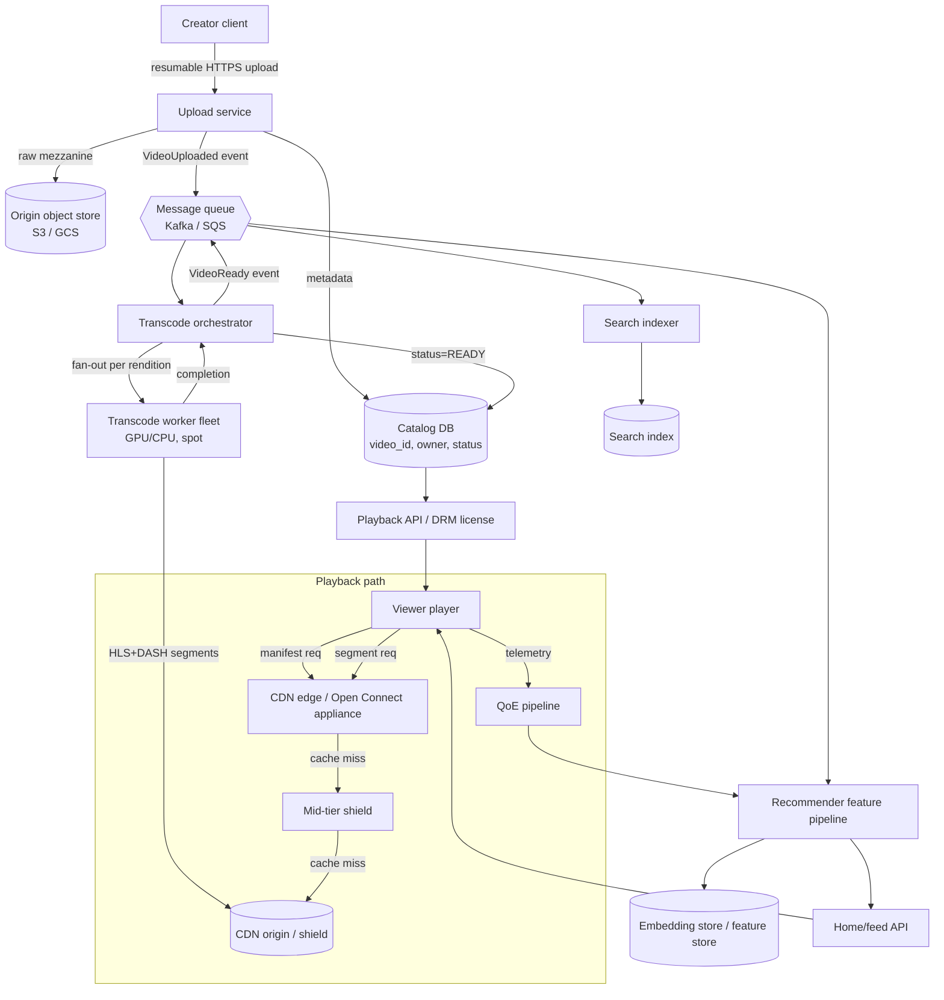
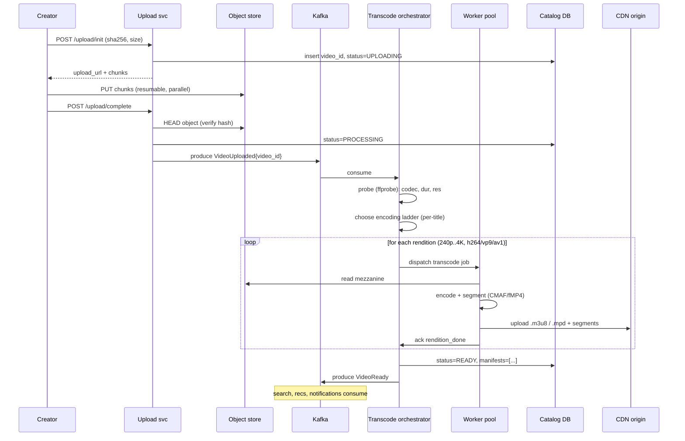
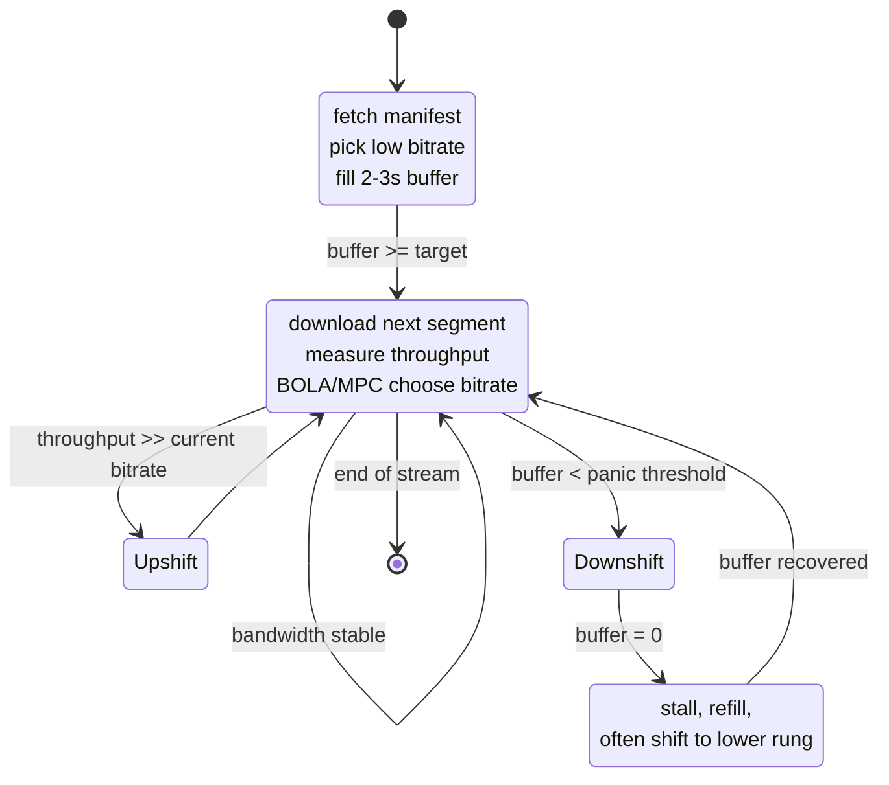
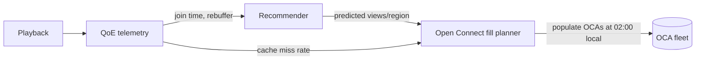

# Video Streaming (YouTube / Netflix)

## Why This Exists

**Problem.** Video is the highest-bandwidth, most latency-sensitive, most cache-sensitive workload on the internet. A single 4K HDR title can be 100 GB; a viral upload can fan out to 10M concurrent viewers within minutes; a 200ms stall is perceptible and a 2s stall causes abandonment. Storage is dominated by encoded variants (one master → 30+ renditions across codecs/bitrates/resolutions). Egress is dominated by long-tail catalog and live events. The hot path (playback) and the cold path (ingest/transcode) have opposite optimization profiles, and you must design both.

**Key insight.** Video systems are **two pipelines bolted together**: an asynchronous ingest/transcode/packaging pipeline that turns one upload into many renditions, and a synchronous playback pipeline that pulls those renditions through CDNs to clients via adaptive bitrate (ABR). The hard part is not "serve a file" — it's **getting the right chunk, of the right bitrate, of the right rendition, from the right cache, in under 2 seconds**, while a recommender chooses *which* video the user watches next. Netflix's Open Connect and YouTube's Google Global Cache both exist because public-internet CDNs alone cannot economically serve the catalog tail.

**Reach for this when:**
- Interview prompt: "Design YouTube / Netflix / TikTok / Twitch VOD / Disney+".
- You need a reference architecture for upload, transcode fan-out, ABR packaging, CDN strategy.
- Designing a corporate or education video platform at >100k MAU scale.
- Sizing storage / egress / transcode-fleet capacity for a video product.
- Diagnosing rebuffer-ratio or join-time regressions at the architecture level.

**Don't reach for this when:**
- You're picking a codec or tuning a single encoder ladder — that's a per-title bitrate-ladder optimization problem (Netflix per-title encoding), not a system design.
- You only need to embed a single MP4 on a marketing page — just use `<video>` + a CDN. No platform needed.
- You're building DRM key management — adjacent and important, but covered separately (Widevine/FairPlay/PlayReady multi-DRM).

## Diagrams

### End-to-end architecture



### Upload → transcode → publish sequence



### Playback ABR loop



## Capacity back-of-envelope (interview-grade)

Always do this on the whiteboard before drawing boxes. Numbers below are the canonical YouTube/Netflix-shaped order of magnitude — adapt to the prompt.

```
Assumptions
  DAU                              200M
  Avg watch time / DAU             40 min/day
  Avg playback bitrate (mix)       3 Mbps
  Uploads / day                    500 hours/min * 1440 = 720k hours uploaded
  Mezzanine size                   ~5 GB / hour at upload bitrate
  Renditions per video             ~30 (resolutions x codecs x DRM)
  Avg total encoded size / hour    ~20 GB after fan-out

Egress (playback)
  bytes/sec/viewer                 3 Mbps / 8 = 0.375 MB/s
  concurrent viewers (peak)        ~20% of DAU = 40M
  peak egress                      40M * 3 Mbps = 120 Tbps
  -> you cannot buy this from one CDN. Multi-CDN + owned ISP-embedded
     caches (Open Connect / GGC) are not optional at this scale.

Storage
  uploads/year                     720k * 365 ~ 263M hours/yr
  encoded storage/yr               263M * 20 GB = 5.26 EB/yr (gross)
  -> tiering (hot/warm/cold) and per-title encoding mandatory.

Transcode compute
  realtime factor target           ~5x (5 min source -> 1 min wall on a worker)
  720k hours/min  /  5x  / parallelism = sized to ~10s of thousands
  of GPU/CPU cores; bursty.
```

## Component-by-component design

### 1. Upload service

**Requirements.** Resumable, verifiable, multipart, abuse-resistant. Creators have flaky uplinks; mobile uploads die mid-flight; pirated re-uploads must be detected.

```python
# Resumable upload with content-addressed chunks. Pseudocode, idiomatic Python.
# Pattern: client computes sha256 of each chunk; server can dedupe and resume.

@router.post("/upload/init")
def init_upload(req: InitReq, user=Depends(auth)) -> InitResp:
    # 1) Quota / ToS / abuse checks BEFORE issuing presigned URLs.
    if not quota.allow(user.id, req.size_bytes):
        raise HTTPException(429, "quota exceeded")

    video_id = ulid.new()
    # 2) Persist intent atomically. status machine:
    #    UPLOADING -> PROCESSING -> READY | FAILED | TAKEDOWN
    catalog.insert(video_id, owner=user.id, status="UPLOADING",
                   sha256=req.sha256, size=req.size_bytes)

    # 3) Issue presigned multipart upload directly to object store.
    #    NEVER proxy bytes through your app servers — egress is precious
    #    and your fleet is not sized for hundreds of TB/day.
    parts = object_store.create_multipart(key=f"raw/{video_id}",
                                          parts=ceil(req.size_bytes / CHUNK))
    return InitResp(video_id=video_id, parts=parts)


@router.post("/upload/complete")
def complete_upload(req: CompleteReq):
    # 4) Verify hash matches client claim. Mismatch -> reject; do NOT
    #    transcode unverified data. Hash mismatch is the classic vector
    #    for "creator uploaded different file than they previewed".
    actual = object_store.head(f"raw/{req.video_id}").sha256
    if actual != req.claimed_sha256:
        catalog.set_status(req.video_id, "FAILED", reason="hash_mismatch")
        raise HTTPException(400, "hash mismatch")

    catalog.set_status(req.video_id, "PROCESSING")
    # 5) Emit event. Outbox pattern — write to outbox table in same tx
    #    as status change, then a relay ships to Kafka. Avoids the
    #    classic "DB committed but Kafka publish lost" bug.
    outbox.put(topic="video.uploaded", key=req.video_id,
               payload={"video_id": req.video_id, "owner": req.user_id})
```

**Things that look optional and aren't:**
- **Perceptual hashing** at upload time (PhotoDNA / pHash for frames + audio fingerprint) before publishing — copyright (Content ID) and CSAM detection are non-negotiable.
- **Antivirus / format probe** with ffprobe in a sandboxed worker; reject malformed containers before they reach the encoder fleet.
- **Mezzanine retention**. Keep the master forever (cold storage); you *will* need to re-encode when AV1 → AV2, when a new HDR format ships, when you fix a ladder bug.

### 2. Transcode pipeline

**The fan-out problem.** One source × N codecs × M resolutions × K DRM systems × P container formats = dozens of outputs. The orchestrator must:

1. Probe the source (codec, framerate, color, HDR metadata, loudness).
2. Pick an **encoding ladder** — Netflix's "per-title encoding" (2015) and later "per-shot" / "dynamic optimizer" prove that a fixed ladder wastes 20-50% bitrate. Animation tops out at low bitrate; live-action sports needs more rungs.
3. Split the source into **GOP-aligned chunks** so chunks are independently encodable on different workers — this is what makes a 2-hour movie encode in minutes instead of hours.
4. Reassemble, package into CMAF (single segment storage, multiplexed into HLS + DASH manifests), DRM-encrypt with multi-DRM (Widevine/FairPlay/PlayReady) keys.
5. Push to CDN origin / shield.

```python
# Sketch of the orchestrator's fan-out loop. The unit of parallelism
# is (rendition × chunk), not (rendition).

def transcode_video(video_id: str):
    src = object_store.read(f"raw/{video_id}")
    probe = ffprobe(src)

    ladder = choose_ladder(probe)   # per-title; consults complexity model
    chunks = split_at_gop_boundaries(src, target_chunk_seconds=8)

    # Fan out. Each (rendition, chunk) is one queue message.
    for rung in ladder:               # e.g. {res: 1080p, codec: h264, bitrate: 4500k}
        for c in chunks:
            queue.publish("transcode.chunk", {
                "video_id": video_id, "rung_id": rung.id,
                "chunk_id": c.id, "src_range": c.byte_range,
            })

    # Wait for all (rung, chunk) acks. Use a coordination primitive
    # (Redis sorted set / DynamoDB counter / Step Functions). Idempotency
    # key = (video_id, rung_id, chunk_id) — workers MUST be retry-safe.
    wait_all_chunks_ack(video_id, expected=len(ladder)*len(chunks))

    # Stitch chunks back per rung; package CMAF; emit manifests.
    for rung in ladder:
        stitched = concat_chunks(video_id, rung.id)
        cmaf = package_cmaf(stitched, segment_seconds=4)
        for drm in ["widevine", "fairplay", "playready"]:
            encrypted = drm_encrypt(cmaf, drm)
            cdn_origin.put(f"vod/{video_id}/{rung.id}/{drm}/", encrypted)

    write_manifests(video_id, ladder)   # master.m3u8 + manifest.mpd
    catalog.set_status(video_id, "READY")
    queue.publish("video.ready", {"video_id": video_id})
```

**Worker pool design.**
- **Spot / preemptible** instances for non-time-critical batches; fall back to on-demand for "live event encoding" or "premiere countdown".
- **GPU** for AV1 / HEVC / 4K — software AV1 is ~20× slower than h264 even with `libsvtav1`.
- **Idempotency key** = `(video_id, rung_id, chunk_id, encoder_version)`. If you bump encoder version, all chunks re-encode; if you don't, retries are free.
- **Per-tenant fairness**. A creator uploading 1,000 videos cannot starve another creator's single upload. Use weighted fair queueing or per-tenant token buckets on the orchestrator.

### 3. Adaptive bitrate (HLS / DASH) and CMAF

**HLS** (Apple, RFC 8216): `.m3u8` text manifests pointing at `.ts` (or `.fmp4`) segments.
**DASH** (ISO/IEC 23009-1): `.mpd` XML manifest pointing at fMP4 segments.
**CMAF** (ISO/IEC 23000-19): a single fMP4 segment format consumable by both HLS *and* DASH players. **You should produce CMAF and emit two manifests over the same bytes** — halves your storage and CDN cache footprint vs. dual-packaging.

```text
master.m3u8 (HLS)
  #EXT-X-STREAM-INF:BANDWIDTH=400000,RESOLUTION=426x240    240p/index.m3u8
  #EXT-X-STREAM-INF:BANDWIDTH=900000,RESOLUTION=640x360    360p/index.m3u8
  #EXT-X-STREAM-INF:BANDWIDTH=2500000,RESOLUTION=1280x720  720p/index.m3u8
  #EXT-X-STREAM-INF:BANDWIDTH=4500000,RESOLUTION=1920x1080 1080p/index.m3u8
  #EXT-X-STREAM-INF:BANDWIDTH=15000000,RESOLUTION=3840x2160 2160p/index.m3u8
```

**ABR algorithm** (the player, not the server, picks the rung):
- **Throughput-based** (early HLS): EWMA of recent segment download speed. Oscillates on bursty links.
- **Buffer-based** (BBA, Netflix 2014): pick rung from buffer occupancy alone — robust on bursty links.
- **Hybrid model-predictive** (MPC, BOLA): minimize `α·rebuffer_time + β·bitrate_changes − γ·avg_bitrate`. dash.js / shaka-player use BOLA-derivatives by default.

**Tuning levers that move QoE metrics:**

| Lever | Effect |
|---|---|
| Segment duration | Shorter (2s) → faster startup, lower latency, more requests, smaller cache objects. Longer (6-10s) → better encoding efficiency, fewer requests. **HLS-LL pushes parts to ~200ms** for live. |
| Buffer target | Bigger buffer → more rebuffer-resistant but slower bitrate adaptation and higher startup memory. |
| Lowest rung bitrate | The "panic rung" — must encode well even at 200kbps for emerging-market mobile. |
| Per-title vs per-shot | Per-title saves 20-30% bitrate on average; per-shot 30-50% on high-variance content (Netflix Dynamic Optimizer). |

### 4. CDN, multi-CDN routing, Open Connect

At platform scale, **a single commercial CDN cannot serve you alone** — physical capacity, regional outages, and pricing all force multi-CDN. Two patterns dominate:

**Pattern A — Multi-CDN with smart manifest URL rewriting.**

```python
# At manifest-fetch time, rewrite segment URLs to the best CDN for *this*
# viewer right now. Decision = f(client geo, ASN, recent QoE telemetry,
# CDN health, $/GB, contractual commits).

def rewrite_manifest(manifest: str, client: ClientCtx) -> str:
    cdn = pick_cdn(client)  # akamai | cloudfront | fastly | own
    # IMPORTANT: rewrite at manifest level, not segment level. If the
    # player switches CDN mid-segment, you risk segment-boundary stalls.
    # Mid-session switching is OK between segments via manifest refresh.
    return manifest.replace("https://origin.example/", cdn.base_url)


def pick_cdn(c: ClientCtx) -> CDN:
    # Build a per-CDN score combining:
    #  - last 5 min p95 throughput from clients in same (geo, ASN)
    #  - rebuffer-ratio over same window
    #  - CDN-reported "healthy?" via TTFB probes
    #  - 95th-percentile commit utilization (don't blow a contract)
    candidates = [c for c in CDNS if c.healthy]
    return max(candidates, key=lambda x: x.score_for(c.geo, c.asn))
```

**Pattern B — Owned ISP-embedded caches (Netflix Open Connect, Google Global Cache).**

Instead of paying a CDN, ship a 1U server full of NVMe to ISPs and let them rack it inside their network. Cache the catalog *at the ISP*. Two consequences:

1. **Egress cost** for the platform → near-zero on cached titles (the bytes never leave the ISP's network).
2. **ISP transit cost** → near-zero (no peering / transit charges for OC traffic).

This is a coordination win, not a tech win. The hard parts are:
- **Pre-positioning**: Open Connect Appliances (OCAs) **fill overnight** during off-peak hours via "fill windows", choosing content based on per-region popularity predictions from the recommender. By prime time the working set is already on disk.
- **Cache hierarchy**: OCA (in ISP) → cluster fill (regional Netflix datacenter) → AWS S3 origin. ~95%+ of bytes served from OCAs.
- **Steering**: Netflix steers each viewer to a specific OCA via a control plane — the player asks `nflxvideo.net` and gets back IP + token.

YouTube's **Google Global Cache** is the same idea: GGC nodes inside ISP networks pull from Google's edge, which pulls from regional caches, which pull from origin. Same pre-positioning benefit, scaled to YouTube's much larger long tail.

### 5. Storage tiering

- **Hot** (OCAs / CDN edge / shield): top ~1% of titles by predicted views over next 24h. NVMe.
- **Warm** (regional object store, e.g. S3 Standard): full encoded catalog. Pulled by CDN on miss.
- **Cold** (S3 Glacier / Deep Archive): mezzanines for re-encoding, very-long-tail catalog. Retrieval is OK to be slow (hours).

Cost ratio is roughly 1 : 0.1 : 0.01 per GB-month, so misclassifying tiering at EB scale is millions of $ / month.

### 6. Recommendations integration

Recommendations and the video pipeline are coupled in three places:

1. **Indexing on ready.** `VideoReady` event triggers feature extraction (transcript via ASR, frame embeddings, topic tags) → feature store / embedding store.
2. **Pre-positioning signal.** The recommender's per-region popularity forecast tells Open Connect *what to fill where*. A prediction error here means a popular title hits S3 instead of OCA → CDN egress costs spike, viewers see higher startup time.
3. **Playback feedback loop.** Every play sends QoE telemetry (join-time, rebuffer-ratio, bitrate distribution, 4xx/5xx, abandonment). Recommender treats QoE as **negative signal**: "if a user always rebuffers on title X, downrank X for similar bandwidth profiles." This is why low-bandwidth users see lighter pages with less video preview.



See `../recommendation-system/` for the recommender internals.

### 7. Live vs VOD

This skill focuses on **VOD** (video-on-demand). Live streaming (Twitch, sports) shares CDN and ABR concepts but adds:
- **Sub-segment latency** (HLS-LL parts ~200ms, LL-DASH chunks).
- **Real-time encoding** — no "encode for 2 hours then publish".
- **DVR window** — viewers can rewind to start; storage decisions per-event.
- **Origin scale** — a single origin endpoint must absorb millions of concurrent pulls (use shield + tiered cache).

For interactive video (Zoom, FaceTime, cloud gaming) the answer is **WebRTC + SFU**, not HLS/DASH. Different skill entirely.

## Trade-offs

| Benefit | Cost |
|---|---|
| **CMAF single-encode** (HLS+DASH share segments) | Older Apple devices need fMP4 fallback; some DRM stacks lag in CMAF support. |
| **Per-title / per-shot encoding** saves 20-50% bitrate | Encoding compute 3-10× higher; complex feedback loops between encoder and complexity analysis. |
| **Multi-CDN** improves resilience and lets you negotiate | Operational complexity: per-CDN auth, log unification, manifest rewriting, billing reconciliation. |
| **Open Connect / GGC** slashes egress cost and improves QoE | Massive logistics: hardware, ISP partnerships, fill scheduling, content preposition prediction. Not viable below very large scale. |
| **Long segment durations (10s)** improve compression efficiency | Higher startup latency; slower ABR reaction; bad for live. |
| **DASH/HLS pull-based ABR** scales infinitely (just file fetches) | 5-30s end-to-end latency; not suitable for interactive use cases. |
| **Aggressive caching at edge** lowers origin load | Cache invalidation is non-trivial — DRM key rotation, takedowns, edits all require purges across thousands of edges. |
| **Outbox pattern at upload completion** prevents lost events | Adds a relay process and an outbox table; latency from "upload done" to "event published" grows by relay-poll interval. |
| **Spot transcode workers** save 60-80% compute cost | Preemption mid-encode wastes work; need chunk-level checkpointing. |

## Common Pitfalls

- **Proxying upload bytes through application servers.** Your app fleet is sized for control-plane RPS, not for 100 GB uploads. Always presign direct-to-object-store. Bonus: removes a giant DDoS vector.
- **Single-rung "transcode complete" semantics.** Marking a video READY when the *highest* rung finishes means low-bandwidth viewers can't play yet. Mark per-rung availability and let the manifest reflect what's actually playable; consider "playable as soon as 360p is ready".
- **Ignoring GOP alignment across renditions.** If `1080p` and `480p` switch at different keyframes, the player can't seamlessly switch rungs — it must restart the segment, causing visible stalls. **Force aligned IDR frames across all renditions** at packaging time.
- **Cache key explosion.** Putting per-user signed URLs into the cache key turns every viewer into a unique cache miss. Use **token authentication via a separate header or via short-TTL cookies** on the player, not by varying the URL. Or use signed URLs whose query is normalized out of the cache key.
- **Manifest as cache poison.** A manifest cached for 24h locks in a CDN choice that might now be unhealthy. Either short-TTL manifests (10-60s) or include a "manifest version" in the URL bumped on CDN reroute.
- **Rebuffer death-spiral on bandwidth dip.** Naive ABR sees bandwidth drop, downshifts, downloads faster, sees throughput "improve", upshifts → rebuffers. Use buffer-based or MPC algorithms with hysteresis. (BOLA paper, Spiteri et al., 2016.)
- **Re-encoding the entire catalog when a codec changes.** AV1 rollout is a multi-year project. Plan for incremental encoding: ladder evolves over years, not weekends. Keep mezzanines.
- **Treating Open Connect as "just a CDN".** It's a *cooperation* with ISPs that requires hardware logistics, MOUs, fill scheduling, predictive pre-positioning. You cannot build it in a quarter; assume CDN until you're at the scale where contracts cost more than hardware.
- **Forgetting subtitle / audio fan-out.** Many languages × many tracks × many forced-narrative variants. Subtitles are tiny but their manifest entries dwarf video entries in big international catalogs. Multi-lingual is *the* surprise complexity in real-world video systems.
- **DRM key rotation invalidating caches.** Rotating Widevine keys mid-flight requires segment-level recipe changes; coordinate with manifest TTL and license server.
- **Thundering herd at premiere.** A new global drop at 09:00 PT is a synchronized worldwide cache miss. Mitigation: **pre-warm OCAs/CDN edges**, use a **shield/mid-tier** so origin sees ≤ N requests per object, hold a short request-coalescing window at the edge.
- **Hot creator hotspot.** A creator going viral hashes consistently to the same partition for catalog metadata. Salt the cache key or add per-video read replicas in front of the catalog DB.
- **Mismatched container/codec/DRM matrix.** Safari requires HLS+FairPlay+fMP4; Chrome happily plays DASH+Widevine; some smart-TVs only do MPEG-TS HLS. Maintain a compatibility matrix as a **first-class artifact**, not tribal knowledge.

## Decision Table

| Question | Answer | Rationale |
|---|---|---|
| HLS vs DASH? | **Both**, packaged once via CMAF | HLS for Apple ecosystem, DASH for everyone else. CMAF gives you one set of bytes. |
| Build CDN or buy? | **Buy** until top-100-by-egress; **buy + own caches (OCA-style)** above that | Owning CDN is multi-year capex. Don't unless you're Netflix/Google/Meta scale. |
| Single CDN or multi-CDN? | **Multi-CDN** at any nontrivial scale | Single-CDN outages have killed entire streaming services for hours. Multi-CDN is also negotiating leverage. |
| Per-title encoding worth it? | **Yes above ~10k catalog hours**; below that, fixed ladder is fine | Engineering investment pays back only when catalog is large enough that bitrate savings dominate. |
| Spot/preemptible for transcode? | **Yes for batch backlog**, **no for live or premiere countdown** | Preemption is fine when SLA is "publish within 1h"; not fine when SLA is "live in 3 minutes". |
| Mark video READY when first rung is encoded, or all? | **First playable rung (e.g. 480p)** | Time-to-first-watchable beats time-to-fully-encoded for almost all UX metrics. |
| Segment length? | **2s for live, 4-6s for VOD, 10s only for archival/podcast** | Shorter = lower latency, more cache objects, more requests. Pick per use case. |
| Where does ABR live? | **Player-side** | The player has ground-truth on its buffer, screen size, decoder capability. The server can't see those. |
| Live latency target? | **6-10s** with HLS, **2-5s** with HLS-LL/LL-DASH, **<1s** only with WebRTC/SFU | Don't promise sub-second on HLS. |
| Cold storage policy for mezzanines? | **Keep forever** | You will re-encode when codecs evolve. Re-shooting is impossible; storage is cheap. |
| Recommender-driven cache prefill? | **Yes at scale**, **no below ~1M MAU** | Below that scale the recommender doesn't have enough signal; CDN's own LRU works fine. |

## References

- **Netflix Open Connect overview** — Netflix Tech Blog — https://netflixtechblog.com/open-connect-everywhere-a-glance-at-the-internets-new-shape-3a35e0d1b1c6
- **Open Connect Appliance details** — Netflix — https://openconnect.netflix.com/en/
- **Netflix per-title encoding (2015)** — Aaron, Manohara, Ronca — https://netflixtechblog.com/per-title-encode-optimization-7e99442b62a2
- **Netflix Dynamic Optimizer / per-shot encoding (2018)** — https://netflixtechblog.com/optimized-shot-based-encodes-now-streaming-4b9464204830
- **HLS — RFC 8216** — Pantos / May (Apple) — https://datatracker.ietf.org/doc/html/rfc8216
- **HLS Low-Latency** — Apple — https://developer.apple.com/documentation/http-live-streaming/enabling-low-latency-http-live-streaming-hls
- **MPEG-DASH ISO/IEC 23009-1** — overview at https://dashif.org/
- **CMAF ISO/IEC 23000-19** — DASH-IF overview — https://dashif.org/guidelines/
- **BOLA: buffer-based ABR** — Spiteri, Urgaonkar, Sitaraman, INFOCOM 2016 — https://arxiv.org/abs/1601.06748
- **A Buffer-Based Approach to Rate Adaptation (BBA)** — Huang, Johari, McKeown, Trunnell, Watson, SIGCOMM 2014 — https://web.stanford.edu/~tjhuang/papers/sigcomm14.pdf
- **MPC-based ABR** — Yin, Jindal, Sekar, Sinopoli, SIGCOMM 2015 — https://users.ece.cmu.edu/~xyin1/papers/sigcomm15-mpc.pdf
- **Google Global Cache** — Google Peering — https://peering.google.com/
- **YouTube architecture overview** — Cuong Do (early engineer talk, archival) — discussed in *System Design Interview vol. 2* (Alex Xu / Sahn Lam), ch. "Design YouTube".
- **AWS Builders' Library** — relevant essays on caching and load shedding — https://aws.amazon.com/builders-library/
- **DDIA ch. 11 — Stream Processing** — Kleppmann (transcode pipeline as event-driven processing).
- **DDIA ch. 5 — Replication; ch. 6 — Partitioning** — for catalog/metadata stores at scale.
- **SRE Book ch. 22 — Addressing Cascading Failures** — https://sre.google/sre-book/addressing-cascading-failures/ — applies directly to thundering-herd-at-premiere.
- **Fast Data Architectures for Streaming Applications** — Wampler, O'Reilly — for the upload→Kafka→workers backbone.
- **Twitch live video architecture (talks, 2017-2020)** — for live-vs-VOD contrast.
- **System Design Interview vol. 2** — Xu/Lam — chapters "Design YouTube" and "Design a Recommendation System".

## See Also

- `../recommendation-system/` — feature pipeline, embedding stores, ranking models that decide *what* plays next.
- `../../performance/cdn/` — generic CDN architecture, cache hierarchies, request coalescing.
- `../distributed-file-storage/` — S3-style storage primitives, multipart uploads, presigning.
- `../../communication/message-queues/` — Kafka / SQS as the upload→transcode backbone.
- `../../data-systems/search-engine/` — indexing video metadata, transcripts, captions on `VideoReady`.
- `../../reliability/rate-limiting/` — abuse control on upload, playback token issuance.
- `../notification-system/` — fan-out of "creator's video is live" to subscribers on `VideoReady`.
- `../../data-systems/outbox/` — for the upload-status → Kafka publication.
- `../../performance/caching/` — for catalog metadata in front of the playback API.
- `../../reliability/load-shedding/` — for premiere thundering-herd mitigation at the edge.
