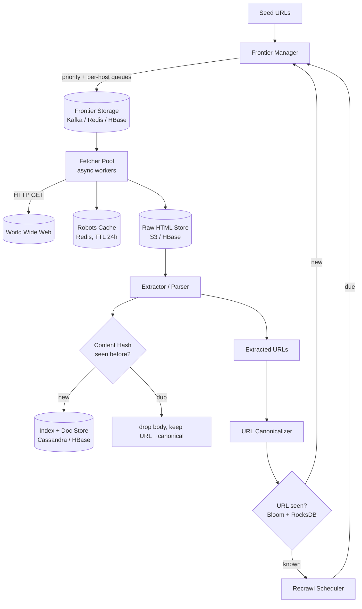
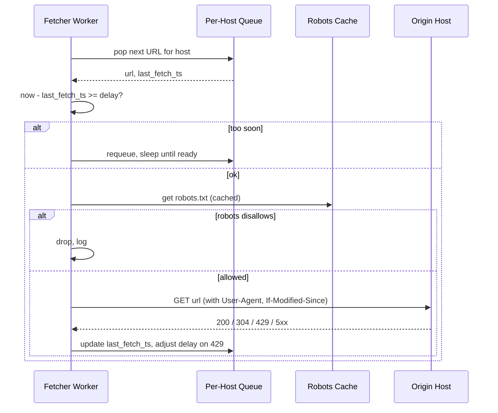

# Web Crawler

## Why This Exists

**Problem.** A naive crawler — `for url in queue: fetch(url); queue.extend(extract_links(url))` — breaks in every interesting way at scale. It re-downloads URLs that differ only in tracking parameters. It hammers `news.ycombinator.com` from 200 workers in parallel and gets blocked. It ignores `robots.txt` and gets the company a cease-and-desist. The frontier grows to 100B URLs and OOMs the box. A worker crashes mid-fetch and that page is lost forever. And once the crawl "completes," nobody knows when to refetch.

**Key insight.** A web crawler is not a fetch loop with a queue. It is a **distributed, prioritized, polite, deduplicated, fault-tolerant pipeline** with three loosely-coupled stages: URL frontier → fetcher pool → extractor/storage. Each stage has its own failure model. The frontier enforces *priority* (importance) and *politeness* (per-host rate). The fetcher tolerates timeouts, redirects, and 5xx. The extractor dedups by canonical URL **and** content hash. Get those three right and the rest is plumbing.

**Reach for this when:**
- Interviewer says "design a web crawler / search indexer / web archiver"
- You need to fetch a large, evolving set of URLs (price monitoring, SEO tools, dataset construction, security scanning)
- You're building a focused crawler for a vertical (jobs, products, papers) — same primitives, narrower seed
- You need to **recrawl** content with freshness guarantees

**Don't reach for this when:**
- You're scraping one site under one domain → use Scrapy / Playwright with a single politeness budget
- You only need an API integration → there's almost certainly an API; ask first
- You need real-time content (news within seconds) → you want a push pipeline (RSS, sitemaps with `<lastmod>`, partner feeds), not a crawler
- You're crawling a SPA-heavy site → the spec changes substantially (need a headless browser pool, JS execution budget, see the SPA crawling section)

## Diagrams

High-level architecture (Mercator-style, distributed):



Per-host politeness flow (the part most candidates get wrong):



## Core Design

### 1. URL Frontier — priority + politeness, decoupled

The Mercator paper (Heydon & Najork, 1999) introduced the canonical two-stage frontier that almost every modern crawler still uses. Conceptually:

- **Front queues (F queues)**: F priority levels (e.g., F=5). A *prioritizer* assigns each new URL a priority based on PageRank estimate, freshness need, depth, or business rule, and pushes to the matching front queue.
- **Back queues (B queues)**: B FIFO queues, each dedicated to **exactly one host at a time**. A *biased front queue selector* drains front queues (higher priority more often) and routes URLs into back queues such that each back queue holds URLs for only one host.
- **Back queue heap**: a min-heap keyed by `next_fetch_time` for each back queue. A worker pops the queue whose host is due next, fetches, and updates `next_fetch_time = now + delay_for_host`.

This separates **what to fetch next** (priority) from **what we're allowed to fetch next** (politeness). Conflate them and you either starve high-priority URLs because their host is rate-limited, or you violate politeness to drain priority.

```python
# Sketch — single-machine version. In production, F queues live in Kafka and
# back queues live in Redis sorted sets sharded by host hash.

import heapq, time, hashlib
from collections import defaultdict, deque

class Frontier:
    def __init__(self, num_front=5, default_delay=1.0):
        self.front = [deque() for _ in range(num_front)]   # priority 0 = highest
        self.back = defaultdict(deque)                      # host -> deque[url]
        self.host_heap = []                                 # (next_fetch_ts, host)
        self.host_delay = {}                                # host -> seconds
        self.default_delay = default_delay

    def add(self, url, priority):
        self.front[priority].append(url)

    def _drain_front_to_back(self):
        # Biased selection: weight = 2^(num_front - priority - 1) so p=0 wins more
        for p in range(len(self.front)):
            if self.front[p]:
                url = self.front[p].popleft()
                host = host_of(url)
                if not self.back[host]:
                    # New host -> schedule it
                    heapq.heappush(self.host_heap, (time.time(), host))
                self.back[host].append(url)
                return True
        return False

    def next_url(self):
        while True:
            if not self.host_heap:
                if not self._drain_front_to_back():
                    return None
                continue
            ready_ts, host = self.host_heap[0]
            wait = ready_ts - time.time()
            if wait > 0:
                # Worker should sleep or steal another host's work
                time.sleep(min(wait, 0.1))
                continue
            heapq.heappop(self.host_heap)
            if not self.back[host]:
                self._drain_front_to_back()
                continue
            url = self.back[host].popleft()
            delay = self.host_delay.get(host, self.default_delay)
            if self.back[host]:
                heapq.heappush(self.host_heap, (time.time() + delay, host))
            return url

    def report_status(self, url, status_code, retry_after=None):
        host = host_of(url)
        if status_code == 429 or (500 <= status_code < 600):
            # Exponential backoff: minimum of retry_after header and capped doubling
            current = self.host_delay.get(host, self.default_delay)
            new_delay = max(retry_after or 0, min(current * 2, 60.0))
            self.host_delay[host] = new_delay
        elif status_code == 200:
            # Gradually relax, but never below configured floor
            self.host_delay[host] = max(self.default_delay,
                                        self.host_delay.get(host, self.default_delay) * 0.9)
```

**Distributed version.** Front queues are Kafka topics partitioned by `hash(host) % N` so all URLs for a host land on the same partition (consumer). Back queues are Redis sorted sets keyed by host with score `next_fetch_ts`. Worker assignment to hosts is done by **consistent hashing** so adding/removing a worker reshuffles roughly `1/N` of the host space.

### 2. URL Canonicalization — dedup before you ever enqueue

Two URLs that fetch the same byte sequence should map to one canonical key. This is the cheapest dedup — done at ingest, before the URL even enters the frontier.

Rules to apply, in order:
1. Lowercase scheme and host: `HTTP://Example.COM/` → `http://example.com/`
2. Remove default port: `:80` for http, `:443` for https
3. Decode unreserved percent-encoded chars: `%7E` → `~`
4. Remove fragment: `#section-2`
5. Sort query params alphabetically: `?b=2&a=1` → `?a=1&b=2`
6. Strip known tracking params: `utm_*`, `fbclid`, `gclid`, `mc_eid`, `_ga`, `igshid`
7. Resolve `.` and `..` segments: `/a/./b/../c` → `/a/c`
8. Trailing slash policy: pick one — usually keep slash on path-only URLs, strip on file-like URLs (`.html`)
9. IDN host normalization: punycode for non-ASCII

```python
from urllib.parse import urlsplit, urlunsplit, parse_qsl, urlencode, unquote
import re

TRACKING = re.compile(r'^(utm_|fb_|fbclid|gclid|yclid|mc_(eid|cid)|_ga|igshid|ref_)')

def canonicalize(url: str) -> str:
    p = urlsplit(url.strip())
    scheme = p.scheme.lower()
    host = p.hostname.lower() if p.hostname else ''
    port = p.port
    if (scheme == 'http' and port == 80) or (scheme == 'https' and port == 443):
        port = None
    netloc = host + (f':{port}' if port else '')

    # Path: resolve dot segments, percent-decode unreserved
    path = re.sub(r'/+', '/', p.path or '/')
    # (Real impl: full RFC 3986 dot-segment removal)

    qs = [(k, v) for k, v in parse_qsl(p.query, keep_blank_values=True)
          if not TRACKING.match(k)]
    qs.sort()
    query = urlencode(qs)

    return urlunsplit((scheme, netloc, path, query, ''))  # drop fragment
```

Even after canonicalization, **content-level dedup** catches the rest: mirrors, syndicated articles, session-id-in-path, soft-404s. Compute SHA-1 (or SimHash for near-duplicates) over the *normalized* HTML body (strip whitespace, comments, ad scripts) and check a Bloom filter + persistent KV store. SimHash with Hamming distance ≤ 3 catches templated near-duplicates (Manku et al., 2007).

### 3. URL-seen test — Bloom filter + persistent store

You will see ~50% of URLs you already know about. The check has to be cheap and *almost-never-wrong-in-the-false-positive direction*.

- **Bloom filter, in-memory, 10 bits/URL, 7 hash funcs** → false positive rate ~0.8%. For 10B URLs that's ~12.5 GB RAM per worker — fits, but you usually shard.
- On a Bloom hit, fall through to a **persistent KV store** (RocksDB, Cassandra) to confirm.
- On a Bloom miss, the URL is definitely new — insert into both.

False positives just mean a (rare) re-fetch. False negatives are not allowed; Bloom doesn't have them. **Counting Bloom** or **Cuckoo filter** allows deletions if you ever expire URLs.

### 4. robots.txt — the rule that gets you banned if you skip

```
1. Cache robots.txt per host with TTL 24h (RFC 9309 recommends ≤ 24h).
2. Fetch /robots.txt BEFORE the first content request to a new host.
3. On 4xx for robots.txt → assume FULL ALLOW (RFC 9309 §2.3.1.3).
4. On 5xx for robots.txt → assume FULL DISALLOW until next attempt
   (this is the conservative reading; some crawlers retry-with-old-cache).
5. Honor Crawl-delay if present; cap at sane max (e.g., 30s) or you'll
   never make progress on adversarial sites.
6. Match longest-path rule, then most-specific User-Agent (RFC 9309 §2.2.2).
```

Use a real parser (Python `urllib.robotparser`, Google's open-source `robotstxt` parser, `reppy`). Don't roll your own — the spec has corner cases (wildcards, end-anchors, BOM handling, encoding) that you will get wrong.

### 5. Fetcher — fault-tolerant, async, well-behaved

```python
# Async fetcher per worker. Real implementations use aiohttp/httpx with
# connection pools sized per-host.

import asyncio, httpx
from email.utils import parsedate_to_datetime

class Fetcher:
    def __init__(self, frontier, robots_cache, raw_store, ua):
        self.frontier = frontier
        self.robots = robots_cache
        self.raw = raw_store
        self.ua = ua
        # Critical: per-host connection limit. Without this, one slow host
        # holds every connection in the pool and the crawler stalls.
        self.client = httpx.AsyncClient(
            timeout=httpx.Timeout(connect=5, read=20, write=10, pool=5),
            limits=httpx.Limits(max_connections=1000, max_keepalive_connections=200),
            follow_redirects=False,  # we handle redirects manually for politeness
            headers={"User-Agent": ua},
        )

    async def fetch_one(self, url):
        host = host_of(url)
        if not await self.robots.allowed(host, self.ua, url):
            return None

        # Conditional GET: send If-Modified-Since if we've seen this URL
        prev = await self.raw.head(url)
        headers = {}
        if prev and prev.last_modified:
            headers["If-Modified-Since"] = prev.last_modified
        if prev and prev.etag:
            headers["If-None-Match"] = prev.etag

        try:
            r = await self.client.get(url, headers=headers)
        except (httpx.TimeoutException, httpx.NetworkError) as e:
            self.frontier.report_status(url, 0)  # treat as transient
            return None

        self.frontier.report_status(url, r.status_code,
                                    retry_after=parse_retry_after(r))

        if r.status_code == 304:
            return prev  # unchanged; just bump last_seen
        if r.status_code in (301, 302, 303, 307, 308):
            target = canonicalize(r.headers["Location"])
            self.frontier.add(target, priority=prev.priority if prev else 2)
            return None
        if r.status_code != 200:
            return None

        # Bound the body size — defensive against multi-GB responses
        body = r.content
        if len(body) > 10 * 1024 * 1024:  # 10 MB cap
            return None

        await self.raw.put(url, body, headers=r.headers)
        return body
```

**Key fetcher gotchas:**
- **DNS** — resolve once, cache TTL-bounded, share across workers. Without this, every fetch costs a DNS round trip.
- **Connection pooling per host** — don't open 200 sockets to the same host even if politeness allows.
- **Async I/O** — a single thread with `asyncio` handles 1k+ concurrent in-flight fetches; thread-per-fetch is wasteful at scale.
- **Redirect loops** — cap at 5 hops, track URLs in the chain.
- **Content-Type filter** — `Accept: text/html,application/xhtml+xml`, drop binaries unless you want them.
- **Response size cap** — a malicious server will stream you GB of `/dev/zero`.
- **Charset detection** — trust `Content-Type: charset=...` first, then `<meta charset>`, then chardet.

### 6. Storage — HBase / Cassandra / S3 split

Three storage tiers, each chosen for a different access pattern:

| Tier | Workload | Choice | Why |
|------|----------|--------|-----|
| Frontier (queue state) | tiny rows, FIFO+heap, hot | Redis / Kafka | sub-ms latency; durability via replication |
| Raw HTML / responses | huge blobs, write-heavy, append-only | S3 / GCS / HDFS | cheap, infinite, immutable |
| URL metadata + content hash + recrawl schedule | wide rows keyed by URL or reversed-host, range scans | **HBase** or **Cassandra** | row-keyed wide-column fits the access pattern |

**HBase row-key design** (Mercator/Bigtable-style):
```
row_key = reversed_host + path
e.g., com.amazon.www/products/dp/B0XYZ
```
Reversing the host means all URLs for `*.amazon.com` are co-located → range scans like "all amazon.com pages" are cheap. Avoid forward host (`www.amazon.com/...`) because rows are then scattered across the cluster.

Column families:
- `meta:` — last_fetched, last_modified, etag, status, priority, fetch_count
- `content:` — content_hash, simhash, language, body_pointer (S3 URL)
- `links:out:` — outbound URLs (compact, e.g., URL fingerprints)

**Cassandra alternative:** same idea, partition key = reversed_host, clustering key = path. Choose Cassandra when you want multi-region active-active writes; HBase when you want strong consistency on a single cluster.

### 7. Update frequency / recrawl scheduling

Once the URL is known, the question is *when to refetch*. You don't refetch a static archive page on the same cadence as a homepage.

**Adaptive scheduling** (Cho & Garcia-Molina, 2003):
- Estimate per-URL change rate λ from observed change history.
- The optimal recrawl interval ∝ 1/√λ for fixed total bandwidth, maximizing freshness.
- In practice: bucket URLs into tiers (5 min, 1h, 1d, 1w, 1mo) based on observed change frequency + page importance (PageRank).

Simple rule that works:
```
recrawl_interval = clamp(
    base_interval * 2^(consecutive_unchanged) * (1 / pagerank_bucket),
    MIN_INTERVAL,    # e.g., 5 minutes for top news
    MAX_INTERVAL,    # e.g., 90 days for archived content
)
```
Push the recrawl event into the frontier with a `not_before` timestamp; the front queue selector skips URLs whose time hasn't come.

**Sitemaps + `<lastmod>` are gold** — a single GET of `/sitemap.xml` tells you which URLs changed since last crawl. Use them. Use the `Last-Modified` and `ETag` headers with `If-Modified-Since` / `If-None-Match` to get 304s; a 304 costs almost nothing on the origin and counts as "still alive."

### 8. Distributed coordination

- **Worker assignment**: consistent hash hosts → workers. A host always lands on the same worker so the per-host queue and `last_fetched` state are local.
- **Worker death**: heartbeat to a coordinator (ZooKeeper / etcd / Redis lock with TTL). On heartbeat loss, reassign the dead worker's host shard.
- **Frontier durability**: if you store back queues in Redis without persistence, a Redis crash loses pending URLs. Either (a) AOF + replica, (b) Kafka as the durable log with Redis as the index, or (c) HBase as the durable store with Redis as the cache.
- **Backpressure**: extractor slower than fetcher? The raw store fills up. Either drop, or block the fetcher via a bounded queue. Always bound queues.

## Trade-offs

| Benefit | Cost |
|---------|------|
| Per-host back queues guarantee politeness | Hot hosts (e.g., wikipedia.org with 6M URLs) get one worker; need adaptive sharding within host |
| Bloom filter for URL-seen is RAM-cheap | False positives → tiny rate of unnecessary KV-store lookups (acceptable) |
| Content hashing dedupes mirrors/syndication | Templated pages need SimHash, not exact hash — adds CPU |
| Async I/O lets one process handle 1k+ in-flight fetches | One slow host can starve the event loop if you don't enforce per-host conn limits |
| Adaptive recrawl saves bandwidth on static pages | Misclassifying a frequently-changing page as static → stale index |
| Reversed-host row keys give locality for range scans | Single hot host (Wikipedia) creates a hot region in HBase — pre-split or salt the key |
| `If-Modified-Since` + 304s slash bandwidth ~5x | Some servers ignore conditional requests; need fallback hash compare |
| Robots.txt cached 24h is the standard | Sites that suddenly tighten robots.txt have a 24h window where you're "wrong" — accept it |
| Distributed Kafka frontier survives worker crashes | Kafka itself is now in the critical path; need ZK/KRaft + replication budget |

## Common Pitfalls

- **Treating the frontier as a single FIFO queue.** Without per-host segregation, the priority queue alone will pop 200 URLs from the same host in a row and ban you.
- **Canonicalizing too aggressively.** Stripping `?id=...` because it "looks like a tracker" deletes pagination on real sites. Maintain an explicit known-tracking-param list.
- **Skipping URL canonicalization "for now".** Your seen-set bloats 5–20x. The frontier never converges.
- **Trusting `Content-Length`.** Many servers lie or omit it. Always cap on bytes-streamed.
- **No timeout on robots.txt fetches.** A hanging robots.txt request blocks every URL for that host indefinitely.
- **Following every redirect.** A redirect to a new host bypasses politeness for that host. Always re-enqueue the redirect target through the frontier, don't fetch inline.
- **No max depth.** Calendar widgets generate infinite `?date=2099-01-01` URLs. Cap depth from seed (e.g., 16) and detect "spider traps" by URL-pattern entropy on a host.
- **No JS execution but the site is a SPA.** You'll crawl an empty `<div id="root">` forever. Detect via heuristic (low text/HTML ratio + framework signature) and route those hosts to a Playwright pool with a much smaller budget.
- **One global `User-Agent` with no contact email.** When a site admin wants to ask you to stop, they have no way; they ban you instead. Convention: `Mozilla/5.0 (compatible; YourBot/1.0; +https://yourco.com/bot)`.
- **Ignoring `429 Retry-After`.** This is the polite request to back off. Honoring it reduces ban rate dramatically.
- **Storing raw HTML in the same Cassandra cluster as metadata.** 1 MB rows blow up compaction. Put bodies in S3, pointers in Cassandra.
- **Recrawling everything at the same cadence.** Wastes 90%+ of bandwidth on pages that never change.
- **No content-hash dedup.** A single news story syndicated across 200 sites becomes 200 index entries. Search quality tanks.
- **Building your own robots.txt parser.** You will get wildcards, end-anchors, or longest-match wrong. Use a battle-tested one.

## Decision Table

| Scenario | Use this | Don't use |
|----------|----------|-----------|
| General-purpose web crawl, billions of URLs | Mercator-style: distributed frontier + async fetchers + HBase/Cassandra + S3 raw | A single Scrapy instance ("scale later") |
| Single domain, < 1M pages | Scrapy with built-in dedup + AutoThrottle | Custom distributed system |
| Need JS-rendered content | Headless Chromium pool (Playwright) gated by per-host budget | Plain HTTP fetcher (will get empty pages) |
| Real-time content updates | Push: RSS/Atom feeds, sitemap pings, partner webhook | Polling crawler (always stale) |
| URL-seen test, 10B+ URLs | Bloom filter (RAM) + RocksDB/Cassandra (truth) | In-memory `set()` (OOM at 100M) |
| Near-duplicate detection | SimHash + Hamming-distance index | Exact SHA-1 only (misses templated dups) |
| Frontier durability | Kafka log + Redis index, OR HBase queue table | In-memory queue (data loss on restart) |
| Politeness with low ops cost | Per-host back queue + crawl-delay from robots.txt | Global QPS cap (over-throttles fast hosts, under-throttles slow ones) |
| Recrawl scheduling | Adaptive (per-URL change rate × importance) | Fixed interval for all URLs |
| Storage row-key when querying by host | Reversed host (`com.amazon.www/...`) | Forward host (scattered, no locality) |
| Multi-region, write-heavy metadata | Cassandra | HBase (single-region strong consistency) |

## References

- Heydon, A. & Najork, M. — *Mercator: A Scalable, Extensible Web Crawler* (1999) — the foundational paper this design is based on. — https://www.cindoc.csic.es/cybermetrics/pdf/68.pdf
- Najork, M. & Heydon, A. — *High-Performance Web Crawling* (Compaq SRC, 2001) — engineering details. — https://www.hpl.hp.com/techreports/Compaq-DEC/SRC-RR-173.pdf
- IETF RFC 9309 — *Robots Exclusion Protocol* (2022) — the formal robots.txt spec, finally standardized. — https://datatracker.ietf.org/doc/html/rfc9309
- IETF RFC 3986 — *URI Generic Syntax* — basis for canonicalization rules. — https://datatracker.ietf.org/doc/html/rfc3986
- Manku, G., Jain, A., Sarma, A.D. — *Detecting Near-Duplicates for Web Crawling* (Google, WWW 2007) — SimHash. — https://www2007.org/papers/paper215.pdf
- Cho, J. & Garcia-Molina, H. — *Effective Page Refresh Policies for Web Crawlers* (Stanford, 2003) — adaptive recrawl. — https://dl.acm.org/doi/10.1145/958942.958945
- Brin, S. & Page, L. — *The Anatomy of a Large-Scale Hypertextual Web Search Engine* (1998) — original Google crawler description. — http://infolab.stanford.edu/~backrub/google.html
- Olston, C. & Najork, M. — *Web Crawling* (Foundations and Trends in IR, 2010) — comprehensive survey. — https://www.nowpublishers.com/article/Details/INR-017
- Google Robotstxt parser (open source) — reference implementation. — https://github.com/google/robotstxt
- Apache Nutch — production-grade open-source crawler used by archive.org and others. — https://nutch.apache.org/
- Common Crawl — public-data crawler operating at exactly this scale; their blog has war stories. — https://commoncrawl.org/blog
- Designing Data-Intensive Applications (Kleppmann, 2017) — ch. 3 (storage engines, LSM/Bloom), ch. 6 (partitioning by hash of key), ch. 11 (stream processing) all map directly onto crawler subsystems.
- System Design Interview vol. 1 (Alex Xu) — ch. 9 *Design a Web Crawler* — interview-format walkthrough of this same architecture.
- Google SRE Workbook — *Managing Load* — backpressure and load-shedding patterns directly applicable to the fetcher. — https://sre.google/workbook/managing-load/

## See Also

- [../url-shortener/](../url-shortener/) — same canonicalization + hash-key + distributed-storage primitives, simpler scope
- [../../data-systems/search-engine/](../../data-systems/search-engine/) — what consumes the crawler's output (inverted index, ranking)
- [../rate-limiter/](../rate-limiter/) — token bucket / sliding window underlying per-host politeness
- [../../communication/message-queues/](../../communication/message-queues/) — Kafka-as-frontier patterns (partitioning, ordering)
- [../newsfeed/](../newsfeed/) — push vs pull trade-off on the consumer side
- [../../data-systems/wide-column/](../../data-systems/wide-column/) — wide-column model for URL metadata
- [../../data-systems/wide-column/](../../data-systems/wide-column/) — row-key design and reversed-host locality
- [../../performance/caching/](../../performance/caching/) — sizing, false-positive math, counting variants
- [../../data-systems/bloom-filter/](../../data-systems/bloom-filter/) — canonical treatment of the URL-seen Bloom + RocksDB pattern used here; sizing math, variants, FP-rate decay
- [../../data-systems/partitioning/](../../data-systems/partitioning/) — host → worker assignment under churn
- [../../communication/backpressure/](../../communication/backpressure/) — bounded queues between fetcher and extractor
