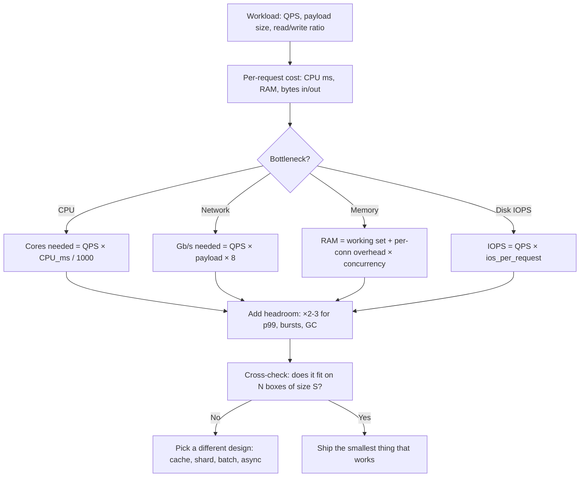
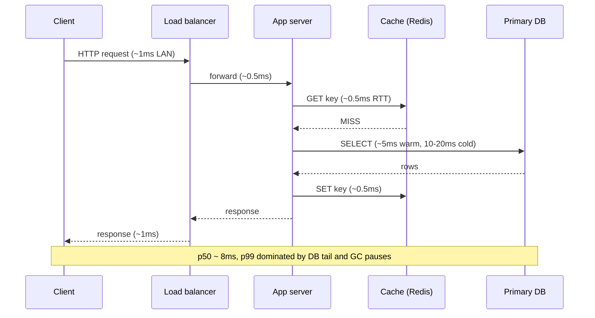

# Back-of-Envelope Estimation

## Why This Exists

**Problem.** Most outages and most over-engineered designs come from numbers nobody did. Engineers debate Redis vs. Memcached for hours without checking that the dataset fits in a single node's RAM. Teams provision 200 EC2 instances for a workload that one box could serve. Designs propose "stream every event to Kafka" without realizing the event rate is 12 QPS. The cost of being wrong is high; the cost of doing the math is 90 seconds.

**Key insight.** You do not need precision. You need the right **order of magnitude**. A BOTE estimate that is within 2–3× of reality is enough to:

- reject impossible designs (this needs 400 Gb/s through a single host),
- accept obviously-fine designs (10 KB × 100 QPS = 1 MB/s, stop talking and ship it),
- locate the bottleneck before you pick the technology.

Jeff Dean popularized this practice at Google: every engineer should be able to estimate the latency and throughput of a proposed system in their head, *before* writing code. ([Numbers Every Programmer Should Know — Dean, 2009](https://norvig.com/21-days.html#answers))

**Reach for this when:**

- Designing a new service or feature and you need to know if it's a 1-box, 10-box, or 1000-box problem.
- An interview asks "estimate QPS / storage / bandwidth for X."
- A vendor quotes a number that smells wrong (e.g., "10 ms p99 across regions" — physically impossible).
- An incident report claims a CPU bottleneck but the math says it's network.
- Choosing between architectural options (cache vs. shard, sync vs. async, batch vs. stream) — the math usually picks one.

**Don't reach for this when:**

- You already have production telemetry. Real p99s beat estimated p99s every time.
- The hot path is dominated by a single external dependency you can't model (a third-party API, a human in the loop). Measure, don't estimate.
- Sub-10% accuracy matters (financial settlement, capacity-planning a multi-year datacenter). BOTE is for 2–3× decisions, not capacity contracts.

---

## Diagrams

### The BOTE workflow



### Where the time actually goes (one request)



---

## The numbers you must memorize

### Powers of two

Every storage and addressing calculation uses these. Memorize the column on the right.

| Power | Approx | Exact            | Mnemonic                          |
|-------|--------|------------------|-----------------------------------|
| 2¹⁰   | 1 K    | 1,024            | Kilo                              |
| 2²⁰   | 1 M    | 1,048,576        | Mega — IDs in a small system      |
| 2³²   | 4 G    | 4,294,967,296    | Max unsigned 32-bit, IPv4 space   |
| 2⁴⁰   | 1 T    | ~10¹²            | Tera — modern HDD, big DB         |
| 2⁵⁰   | 1 P    | ~10¹⁵            | Peta — large data warehouse       |
| 2⁶³   | ~9 E   | 9.2×10¹⁸         | Max signed 64-bit (snowflake IDs) |

**Useful equivalences:**

- 1 byte = 8 bits. Network is in **bits**, storage is in **bytes**. A 1 Gb/s NIC = ~125 MB/s, *not* 1 GB/s.
- 1 day ≈ 86,400 s ≈ **10⁵ s**. (Round to 10⁵ for BOTE; 86,400 is the right number for billing.)
- 1 year ≈ 3.15 × 10⁷ s ≈ **π × 10⁷ s**. ("Pi seconds is a nanocentury" — Tom Duff.)
- 1 M QPS sustained = **86 B requests/day** = **31 T requests/year**.
- ASCII char = 1 byte. UTF-8 emoji = up to 4 bytes. UUID v4 string = 36 bytes; binary = 16 bytes.

### Jeff Dean's latency numbers (2020 update)

These are the most quoted numbers in distributed systems. The orders of magnitude are stable; absolute numbers shift with hardware.

| Operation                                  | Latency (rounded)   | In human time (×10⁹)        |
|--------------------------------------------|---------------------|-----------------------------|
| L1 cache reference                         | 0.5 ns              | 0.5 s                       |
| Branch mispredict                          | 5 ns                | 5 s                         |
| L2 cache reference                         | 7 ns                | 7 s                         |
| Mutex lock/unlock                          | 25 ns               | 25 s                        |
| Main memory reference                      | 100 ns              | 100 s (~2 min)              |
| Compress 1 KB with Zippy/Snappy            | 3 µs                | 50 min                      |
| Send 1 KB over 1 Gbps network              | 10 µs               | 3 hr                        |
| Read 4 KB random from SSD                  | 150 µs              | ~2 days                     |
| Read 1 MB sequential from memory           | 250 µs              | ~3 days                     |
| Round trip in same datacenter              | 500 µs              | ~6 days                     |
| Read 1 MB sequential from SSD              | 1 ms                | ~12 days                    |
| HDD seek                                   | 10 ms               | ~4 months                   |
| Read 1 MB sequential from HDD              | 30 ms               | ~12 months                  |
| Round trip CA → Netherlands → CA           | 150 ms              | ~5 years                    |

**What you must internalize:**

- **Memory ≈ 100 ns. Disk ≈ 100 µs (SSD) to 10 ms (HDD).** SSD is ~1000× slower than RAM; HDD is ~100,000× slower.
- **Same-DC RTT ≈ 0.5 ms. Cross-region RTT ≈ 50–150 ms.** The speed of light fixes the floor.
- **Network is in microseconds for small payloads, milliseconds for big ones.** 1 MB over 10 Gb/s = ~1 ms minimum; over 1 Gb/s = ~10 ms.
- **Sequential disk reads beat random by 100×–1000×.** This is why LSM trees and append-only logs win.

The full annotated list: [Latency Numbers Every Programmer Should Know — github.com/colin-scott](https://colin-scott.github.io/personal_website/research/interactive_latency.html) (interactive, lets you slide the year).

### Throughput rules of thumb

| Resource                       | Modern ballpark             | Notes                                                 |
|--------------------------------|-----------------------------|-------------------------------------------------------|
| Single core, simple work       | 1–10 M ops/s                | hash, integer math, in-memory lookup                  |
| Single core, JSON parse        | 100 K–500 K docs/s          | per ~1 KB doc                                          |
| Single core, HTTPS handshake   | ~1 K/s                      | TLS is expensive; reuse connections                    |
| Modern x86 server, 16 vCPU     | 50 K–200 K QPS              | for typical CRUD; *much* less for heavy work          |
| 1 Gb/s NIC                     | ~125 MB/s                   | sustainable, minus headers                             |
| 10 Gb/s NIC                    | ~1.2 GB/s                   | common on modern instances                             |
| 25 Gb/s / 100 Gb/s NIC         | 3 / 12 GB/s                 | high-end EC2 (c6gn, c7gn, etc.)                        |
| NVMe SSD random 4 KB           | 100 K–1 M IOPS              | per device; cloud volumes are typically capped lower   |
| EBS gp3                        | up to 16 K IOPS, 1 GB/s     | per volume, AWS docs                                   |
| Single Postgres / MySQL box    | 10 K–50 K simple QPS        | depends heavily on schema, indexes, write ratio        |
| Redis on a single box          | 100 K+ ops/s per core       | pipelined; ~1 M ops/s with multiple cores              |
| Kafka per broker               | 100 K–1 M msgs/s            | small messages, batched producers                      |

---

## Per-request math

The discipline: **for every request, what does it cost in CPU, RAM, bytes-in, bytes-out, and disk I/O?** Multiply by QPS. That is the design.

```python
# Sketch this for every endpoint before writing code.
@dataclass
class RequestCost:
    name: str
    qps: float            # steady-state requests/sec
    cpu_ms: float         # mean service-time on one core
    bytes_in: int         # request size on the wire
    bytes_out: int        # response size on the wire
    disk_ios: float = 0   # average IOs per request (cache miss × pages read)
    db_calls: float = 0   # synchronous DB round-trips per request

    def cores_needed(self, util_target: float = 0.6) -> float:
        # Linear model: ignores queueing, but good for util < 70%.
        # For util > 70%, add queueing: see Little's Law section below.
        return (self.qps * self.cpu_ms / 1000.0) / util_target

    def gbps_in(self) -> float:
        return self.qps * self.bytes_in * 8 / 1e9

    def gbps_out(self) -> float:
        return self.qps * self.bytes_out * 8 / 1e9

    def iops(self) -> float:
        return self.qps * self.disk_ios
```

### Worked example: a "view profile" endpoint

```text
Workload assumptions:
  - 1 M DAU, each views 20 profiles/day → 20 M views/day
  - Daily traffic is not flat; peak ≈ 3× average  (DAU rule-of-thumb)
  - Profile is ~2 KB JSON. 95% cache hit rate.
  - Cache hit costs 0.5 ms CPU. Cache miss costs 5 ms CPU + 1 DB call.

Step 1 — average QPS:
  20 M / 86,400 s ≈ 230 QPS.   (Use 10^5 sec/day if you want to be lazy: 200.)

Step 2 — peak QPS:
  230 × 3 ≈ 700 QPS.    Always design for peak, not average.

Step 3 — CPU:
  Mean cpu_ms = 0.95 × 0.5 + 0.05 × 5.0 = 0.725 ms.
  Cores at 60% util = (700 × 0.725 / 1000) / 0.6 ≈ 0.85 cores.
  → One small box. Add 1 more for HA. Done.

Step 4 — bandwidth out:
  700 × 2 KB = 1.4 MB/s ≈ 11 Mb/s. Trivial.

Step 5 — DB load:
  Misses = 700 × 0.05 = 35 QPS to the DB. Trivial.

Conclusion: this is a 2-box problem, not a 200-box problem.
The cache is doing all the work — verify the hit-rate assumption is real.
```

### Worked example: a write-heavy timeline (fan-out on write)

```text
Workload:
  - 200 M users; 10% post per day → 20 M posts/day → ~230 posts/sec average, ~700 peak.
  - Average user has 200 followers.  Celebrity tail goes to 10^7+.
  - Fan-out on write: each post writes to followers' inboxes.

Step 1 — write amplification:
  Posts/sec × avg followers = 700 × 200 = 140,000 inbox-writes/sec.

Step 2 — celebrity check (this is where designs die):
  A celebrity with 10^7 followers posting once produces 10^7 writes
  in a single event. At 100K inbox writes/sec/shard, that's 100 sec
  of pinned write traffic from one tweet.
  → Hybrid model: fan-out on write for tail users, fan-out on read for celebrities.

Step 3 — storage:
  Inbox row ~ 100 bytes (post-id, author-id, ts, flags).
  140K writes/sec × 100 B = 14 MB/s = 1.2 TB/day = 440 TB/year.
  → Definitely shard. TTL old entries (90 days?) to bound storage.

Step 4 — read path:
  Active users open timeline 5×/day → 200M × 0.5 active × 5 ≈ 500M reads/day
    ≈ 6K QPS average, 18K peak. Each read = 1 inbox-shard query.
  → Read path is *easier* than write path here. That's the whole game with fan-out.
```

This is the canonical "Twitter timelines" problem; see DDIA ch. 1 (the original walkthrough) for Kleppmann's version.

---

## QPS × payload = bandwidth

This is the second-most-broken calculation in design reviews (after "do we need a cache?").

```text
Bandwidth_bps = QPS × bytes_per_message × 8

  Examples:
   1,000 QPS × 1 KB    = 8 Mb/s     (one phone)
   1,000 QPS × 1 MB    = 8 Gb/s     (saturates a 10 Gb NIC headroom)
  10,000 QPS × 100 KB  = 8 Gb/s     (same)
   1 M QPS × 100 B     = 800 Mb/s   (small payloads scale)
   1 M QPS × 10 KB     = 80 Gb/s    (need 8+ × 10 Gb hosts or sharding)
```

**Don't forget the response.** A 1 KB request that returns a 1 MB response is a 1 MB workload, not a 1 KB workload. Egress dominates ingress for most read APIs and *especially* for video/image services.

**Don't forget protocol overhead.** TLS + HTTP/2 framing + headers add ~500 B–2 KB per request. For 100-byte payloads, headers dominate.

**Don't forget cross-AZ / cross-region.** AWS charges $0.01–$0.02/GB cross-AZ, $0.02/GB cross-region, $0.05–$0.09/GB internet egress. **Bandwidth bills are often the largest line item; do this math.**

```python
# Typical mistake: forgetting that fan-out multiplies egress.
def cross_az_egress_per_month(qps, response_bytes, replicas_in_other_azs):
    # Each request response is mirrored to N replica AZs (for caches, queues, etc.)
    seconds_per_month = 2.6e6
    bytes_per_month = qps * response_bytes * replicas_in_other_azs * seconds_per_month
    gb = bytes_per_month / 1e9
    return gb, gb * 0.01  # ($/GB cross-AZ, AWS public pricing)

>>> cross_az_egress_per_month(qps=10_000, response_bytes=10_000, replicas_in_other_azs=2)
(520_000, 5_200)   # 520 TB/mo, $5.2K/mo just on cross-AZ
```

---

## Capacity from p99 + concurrency: Little's Law

Little's Law is the one formula every backend engineer should know:

```
L = λ × W
```

- **L** = number of requests in the system (concurrency)
- **λ** = arrival rate (QPS)
- **W** = average time in the system (latency)

Rearranged for the questions you actually ask:

```
concurrency = QPS × latency_seconds
QPS_capacity = concurrency / latency_seconds
```

### Worked example: how many threads / connections do I need?

```text
Service does 5,000 QPS at 40 ms mean latency.
  Concurrency = 5,000 × 0.04 = 200 in-flight requests.
  
A thread-per-request server needs ~200 threads to keep up.
A connection pool to the DB needs ~200 slots if every request uses one.

If you only have 50 DB connections and the per-DB-call time is 30 ms,
  max QPS through the pool = 50 / 0.030 = 1,667 QPS.
  Above that, requests queue and p99 explodes.
```

### Worked example: sizing for p99, not average

The big trap: **average latency does not predict p99.** Tail latency at high utilization grows non-linearly. Rough rule from queueing theory (M/M/1):

```
average_wait = service_time × ρ / (1 - ρ)        where ρ = utilization
```

| Utilization (ρ) | Wait multiplier   | What this means                              |
|-----------------|-------------------|----------------------------------------------|
| 50%             | 1×                | Comfortable                                  |
| 70%             | 2.3×              | Normal target for steady-state               |
| 80%             | 4×                | Already feeling tail latency                 |
| 90%             | 9×                | Bad; one slow query takes the box down       |
| 95%             | 19×               | Avoid                                        |
| 99%             | 99×               | Pager territory                              |

**Rule:** keep steady-state CPU/connection-pool utilization at **60–70%**. The headroom is what absorbs bursts and GC pauses. See SRE Workbook ch. 11 ("Managing Load") and Gil Tene's [How NOT to Measure Latency](https://www.azul.com/wp-content/uploads/2018/04/How-NOT-to-measure-latency-LLSummit-2014.pdf) for why "average latency" is a lie.

### Tail amplification with fan-out

If a request fans out to N services and you wait for all of them, the slowest of N dominates. For independent services with p99 = 100 ms:

```text
P(any one > 100ms) for N=10 sub-calls ≈ 1 - 0.99^10 ≈ 9.6%
P(any one > 100ms) for N=100 sub-calls ≈ 63%
```

Your "p99=100ms" backend, called 100 times in parallel, has a *p50* of >100 ms at the gateway. This is why microservice architectures get slow even when every service "looks fast." Citation: [Dean & Barroso, "The Tail at Scale," CACM 2013](https://research.google/pubs/the-tail-at-scale/) — required reading.

---

## Memory: working set vs. dataset

Two different numbers, often confused.

- **Dataset size** = total bytes on disk. Determines storage cost.
- **Working set** = bytes accessed within some short window (often 1–5 min). Determines RAM needed for the cache to be effective.

```text
Twitter-style: 200M users, 2KB profile each = 400 GB dataset.
  Active in any 5-min window: ~1% = 2M users = 4 GB.
  → 4 GB cache fits on one box. Don't shard the cache for this; shard the DB.

Logs/analytics: 100 TB of logs.
  Working set = "last hour of dashboards" = ~10 GB.
  → 10 GB hot tier (S3 + cache or local SSD), 100 TB cold tier (S3).
```

**Per-connection overhead is real.** A persistent connection costs:

- TCP buffers: ~80–200 KB default (kernel-tunable).
- TLS state: ~50 KB.
- Application context (session, auth, prepared statements): often more.

For 100 K concurrent connections × 200 KB = **20 GB just in kernel buffers.** This is why connection-poolers (PgBouncer, ProxySQL) exist and why "WebSocket all the things" hits walls.

---

## A real estimation template

Use this as your scratch pad. Filling it in takes 5 minutes and saves weeks.

```text
SYSTEM: <name>
ASSUMPTIONS (state them, then everyone can debate them):
  - DAU: ___
  - Reads per user per day: ___
  - Writes per user per day: ___
  - Average payload size: ___ KB
  - Read:write ratio: ___
  - Peak/average ratio: ___ (default 3 for B2C, 2 for B2B, 10 for retail/event-driven)

DERIVED:
  - Avg read QPS  = DAU × reads/day / 86,400
  - Peak read QPS = avg × peak_ratio
  - Avg write QPS = DAU × writes/day / 86,400
  - Storage/yr    = writes/sec × payload × 86,400 × 365

PER REQUEST (one row per endpoint):
  endpoint  |  qps  |  cpu_ms  |  bytes_in  |  bytes_out  |  db_calls  |  disk_ios

CAPACITY (use the table above):
  Cores total       = Σ qps × cpu_ms / 1000 / 0.6
  Bandwidth total   = Σ qps × (in + out) × 8
  DB QPS            = Σ qps × db_calls × (1 - cache_hit_rate)
  Cache RAM         = working_set × replication_factor

BOTTLENECK (which dimension hits its limit first?):
  ____ at ____ requests/sec.

DESIGN CHOICE (the math should pick this):
  [ ] single box     (≤10K QPS, ≤1 GB working set)
  [ ] horizontal scale stateless tier
  [ ] cache-fronted DB
  [ ] sharded DB
  [ ] async / queue / batch (writes amplified or bursty)
  [ ] CDN (read-heavy, large static payloads)
  [ ] stream processing (cannot store the firehose)
```

---

## Trade-offs

| Benefit                                            | Cost                                                                  |
|----------------------------------------------------|-----------------------------------------------------------------------|
| Catches order-of-magnitude design errors in 90s    | Tempts you to skip measurement when the system is in production       |
| Common vocabulary for design reviews               | False precision: numbers in a doc *feel* truer than they are          |
| Anchors interview answers in physics, not vibes    | "1 + 1 = 3" with rounding errors compounds over multiple steps        |
| Makes "we don't need X" defensible                 | Doesn't capture queueing, GC, lock contention, network microbursts    |
| Fast feedback on architectural alternatives        | Linear models break above 70% utilization (where you'll actually run) |
| Forces the question "what's the bottleneck?"       | Encourages premature scaling when one box would do                    |

---

## Common Pitfalls

- **Confusing bits and bytes.** "1 Gbps NIC" = 125 MB/s, not 1 GB/s. Eight-fold mistakes are common in design docs. Always write units.
- **Designing for average, not peak.** Average = peak / 3 for most consumer workloads, peak / 10+ for retail spikes (Black Friday) or news events.
- **Ignoring the response side of bandwidth.** A 100-byte search query returning 100 KB of results is a 100 KB workload.
- **Forgetting cross-AZ / cross-region egress costs.** It is often the dominant line item on the AWS bill, not compute.
- **Assuming uniform key distribution.** Real workloads are Zipfian: 1% of users / keys / products produce 50%+ of traffic. Per-shard QPS ≠ total QPS / shards.
- **Sizing CPU to 100% utilization.** Latency explodes between 70% and 100%. The capacity number is "QPS at 60–70% util," not "max QPS the box ever did."
- **Treating averages as p99.** A service with 10 ms average latency routinely has 100 ms p99. Capacity for SLOs needs the p99 number.
- **Forgetting fan-out tail amplification.** Calling 100 services in parallel, each at 99 ms p99, gives a gateway p50 worse than 99 ms (Dean & Barroso, "The Tail at Scale").
- **Counting connections as free.** Each TCP connection costs RAM, file descriptors, and (with TLS) CPU. 100K concurrent connections is a real engineering problem.
- **Assuming caches are always hot.** Cold cache after a deploy / failover means real DB load = full QPS, not (1 - hit_rate) × QPS. Capacity-plan for the cold case.
- **Ignoring write amplification.** B-trees write a 4 KB page for a 100-byte row. LSM trees write the same data multiple times during compaction. Disk QPS ≠ logical QPS.
- **Not sanity-checking against physics.** Sub-50 ms cross-region RTT is impossible. Sub-1 ms cross-AZ is impossible. If your SLO requires it, the design is wrong, not the math.
- **Padding everything with 10×.** Two layers of "×10 for safety" turns a 10-box problem into a 1000-box problem. Pad once, deliberately.

---

## Decision Table

| Situation                                                    | Use BOTE?                            | Notes                                                               |
|--------------------------------------------------------------|--------------------------------------|---------------------------------------------------------------------|
| New service, no production data                              | **Yes — primary tool**               | Pick design from the math.                                          |
| Existing service, telemetry available                        | Use for capacity *projection* only   | For current behaviour, read the dashboards. BOTE the next 3–10×.    |
| Interview / whiteboard                                       | **Yes — required**                   | Interviewers grade the math, not the diagram.                       |
| Sub-10% accurate forecast (DC purchase, financial settlement)| No                                   | Use load tests + statistical capacity models.                       |
| Single-machine, hot-path optimisation                        | Profile, don't estimate              | BOTE numbers (memory ~100ns, etc.) tell you what's *possible*; the profiler tells you what *is*. |
| Vendor / proposal sanity check                               | **Yes**                              | "Does this number violate physics?" is a 60-second answer.          |
| Sizing a queue / buffer                                      | **Yes** (Little's Law)               | L = λ × W. Almost always under-sized in initial designs.            |
| Choosing cache vs. shard                                     | **Yes**                              | Working-set size vs. RAM-per-box decides it most of the time.       |
| Choosing sync vs. async                                      | **Yes**                              | Write amplification + tail latency math points the way.             |
| Modelling adversarial / DDoS load                            | Carefully                            | BOTE for floor; assume worst-case skew + concurrent burst.          |

---

## References

- Jeff Dean — *Numbers Every Programmer Should Know* (slide, 2009; the canonical list) — https://norvig.com/21-days.html#answers
- Colin Scott — *Latency Numbers Every Programmer Should Know* (interactive, year-sliced) — https://colin-scott.github.io/personal_website/research/interactive_latency.html
- Jeff Dean & Luiz André Barroso — *The Tail at Scale*, CACM 2013 — https://research.google/pubs/the-tail-at-scale/
- Google SRE Book — ch. 22 *Addressing Cascading Failures*; *Workbook* ch. 11 *Managing Load* — https://sre.google/sre-book/table-of-contents/ — https://sre.google/workbook/table-of-contents/
- Martin Kleppmann — *Designing Data-Intensive Applications* (DDIA), ch. 1 (Twitter timelines worked example), ch. 11 (stream throughput) — O'Reilly, 2017.
- Gil Tene — *How NOT to Measure Latency* (HdrHistogram, coordinated omission) — https://www.azul.com/wp-content/uploads/2018/04/How-NOT-to-measure-latency-LLSummit-2014.pdf
- Brendan Gregg — *Systems Performance, 2nd ed.* — chapters on USE method and capacity planning. https://www.brendangregg.com/systems-performance-2nd-edition-book.html
- Alex Xu — *System Design Interview, vol. 1 & 2* — for templated estimation walkthroughs.
- AWS Builders' Library — *Caching challenges and strategies*; *Avoiding overload in distributed systems by putting the smaller service in control* — https://aws.amazon.com/builders-library/
- Pat Helland — *Life Beyond Distributed Transactions: An Apostate's Opinion* — https://queue.acm.org/detail.cfm?id=3025012 (informs write-amplification thinking)
- Adrian Colyer — *the morning paper* archive; in particular his summaries of Dean/Barroso and queueing-theory papers — https://blog.acolyer.org/

---

## See Also

- `../tail-latency/` — turning BOTE numbers into per-hop SLO budgets across a request path.
- `../../reliability/load-shedding/` — what to do when measured load exceeds the BOTE-derived capacity.
- `../caching/` — when the math says "cache" and how to pick the layer.
- `../../data-systems/partitioning/` — when the BOTE working set or write rate exceeds a single node.
- `../../reliability/circuit-breaker/` — what happens when capacity is wrong.
