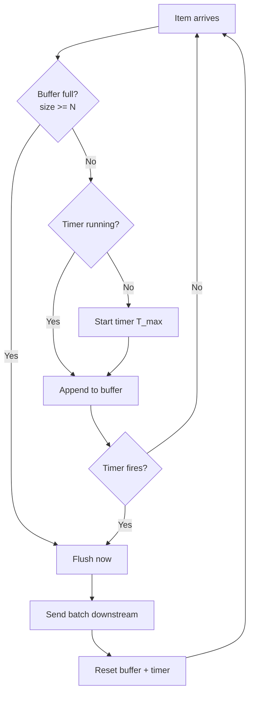
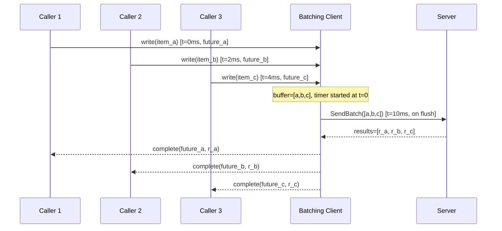
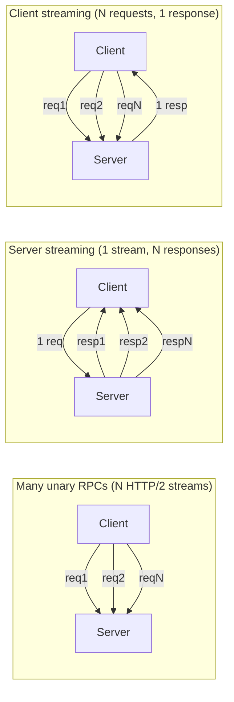

# Batching

## Why This Exists

**Problem.** Every request carries fixed overhead — a TCP/TLS handshake (or at least a frame), a syscall, a query plan, an authentication check, an index seek, a log line, a metric increment. When that overhead dominates the actual useful work, throughput collapses and tail latency explodes. A service that handles 10k single-row INSERTs per second on a database can handle 200k–500k rows per second when those same rows arrive 1000 at a time. The bottleneck wasn't the rows; it was the round-trips.

**Key insight.** Batching trades **average latency for throughput and tail latency**. A request that would have shipped in 2 ms now waits up to N ms for batch-mates, but the *server* spends so much less time per item that it stops queueing — so p50 may rise slightly while p99 actually falls. Past a workload-specific knee, refusing to batch is what causes the latency you're trying to avoid.

**Reach for this when:**
- You see fan-out from one logical operation into many small RPCs/queries (the "chatty" anti-pattern).
- The per-request fixed cost (auth, parsing, planning, fsync, network round-trip) is comparable to or larger than the per-item variable cost.
- Downstream is rate-limited by *requests/sec* (DynamoDB partition WCU, Stripe API, third-party SaaS), not by *bytes/sec*.
- You're paying per-invocation (Lambda, API Gateway, queue charges).
- Producers are bursty and consumers want smooth load.

**Don't reach for this when:**
- Latency budget is sub-millisecond and items arrive one at a time (real-time bidding, HFT, interactive UI keystroke handlers).
- Items must be acked one-by-one for transactional reasons and you can't checkpoint mid-batch.
- The batch is so big a single poison item halts the whole group with no isolation (see "poison pill" pitfall).
- Memory pressure: holding the batch in RAM is more expensive than the round-trips would be (rare, but happens with very large payloads).
- You only have one item per second — batching adds latency for zero throughput gain.

## Diagrams

### Two-flush trigger: size OR time, whichever fires first



### Client-side batching across N callers (Nagle-style coalescing)



### gRPC: many-unary vs server-streaming vs client-streaming



## Core Patterns

### 1. Size-or-time flush (the canonical batcher)

Most production batchers are this loop. Don't reinvent it; copy it.

```python
import asyncio
import time
from dataclasses import dataclass, field
from typing import Callable, Awaitable, TypeVar, Generic

T = TypeVar("T")
R = TypeVar("R")

@dataclass
class _Pending(Generic[T, R]):
    item: T
    future: asyncio.Future

class Batcher(Generic[T, R]):
    """
    Coalesces concurrent callers into batched downstream calls.
    Flushes when buffer >= max_size OR oldest item age >= max_latency.

    Why both triggers? Size alone starves under low load (items wait forever).
    Time alone wastes throughput at peak (we wait T even with a full buffer).
    """
    def __init__(
        self,
        flush_fn: Callable[[list[T]], Awaitable[list[R]]],
        max_size: int = 100,
        max_latency_ms: int = 10,
    ):
        self._flush_fn = flush_fn
        self._max_size = max_size
        self._max_latency = max_latency_ms / 1000.0
        self._buffer: list[_Pending[T, R]] = []
        self._lock = asyncio.Lock()
        self._flush_task: asyncio.Task | None = None
        self._first_arrival: float | None = None

    async def submit(self, item: T) -> R:
        loop = asyncio.get_event_loop()
        fut: asyncio.Future = loop.create_future()
        async with self._lock:
            self._buffer.append(_Pending(item, fut))
            if self._first_arrival is None:
                self._first_arrival = time.monotonic()
                # Schedule a fallback flush for the time-based trigger.
                self._flush_task = asyncio.create_task(self._flush_after_delay())
            if len(self._buffer) >= self._max_size:
                # Size trigger fired — flush eagerly without waiting for timer.
                await self._flush_locked()
        return await fut

    async def _flush_after_delay(self):
        try:
            await asyncio.sleep(self._max_latency)
            async with self._lock:
                if self._buffer:
                    await self._flush_locked()
        except asyncio.CancelledError:
            pass

    async def _flush_locked(self):
        # Caller must hold self._lock.
        batch = self._buffer
        self._buffer = []
        self._first_arrival = None
        if self._flush_task:
            self._flush_task.cancel()
            self._flush_task = None
        if not batch:
            return
        items = [p.item for p in batch]
        try:
            results = await self._flush_fn(items)
            if len(results) != len(items):
                raise RuntimeError("flush_fn returned wrong number of results")
            for p, r in zip(batch, results):
                if not p.future.done():
                    p.future.set_result(r)
        except Exception as e:
            # Per-item failure is the caller's job to model. Default: fail the
            # whole batch. See "partial failure" pitfall below for alternatives.
            for p in batch:
                if not p.future.done():
                    p.future.set_exception(e)
```

**Tuning the two knobs.**

| Knob | Effect | Heuristic |
|---|---|---|
| `max_size` | Caps memory + downstream payload size | Start with whatever makes the downstream payload ~1 MB or hits the documented limit (DynamoDB BatchWriteItem = 25, Kafka producer batch = 16 KB default, SQS SendMessageBatch = 10) |
| `max_latency_ms` | Caps added latency under low load | Start at 5–10 ms for in-DC RPC, 50–100 ms for cross-region, 1 s for cron-style flushers |

There is **no universal default**. Measure: graph p50/p99 latency vs throughput as you sweep both knobs. The right setting is on the knee.

### 2. Server-side micro-batching (consumer-side)

Sometimes you can't change the producer (third-party webhook firehose, hot Kafka topic). Batch on the consumer side instead.

```go
// Consumer pulls one-at-a-time from a queue but writes to DB in batches.
// Trade: at-least-once delivery + idempotent writes are now mandatory,
// because a crash mid-batch will redeliver everything that wasn't checkpointed.

func (c *Consumer) Run(ctx context.Context) error {
    buf := make([]Event, 0, c.batchSize)
    deadline := time.NewTimer(c.maxLatency)
    defer deadline.Stop()

    flush := func() error {
        if len(buf) == 0 {
            return nil
        }
        if err := c.db.BulkInsert(ctx, buf); err != nil {
            return err  // Caller will retry; messages NOT acked yet.
        }
        // Only ack AFTER successful write — at-least-once semantics.
        if err := c.queue.AckBatch(ctx, buf); err != nil {
            // Already wrote to DB. If we crash here, we'll redeliver.
            // Idempotency on (event_id) MUST handle the dup.
            return err
        }
        buf = buf[:0]
        deadline.Reset(c.maxLatency)
        return nil
    }

    for {
        select {
        case <-ctx.Done():
            return flush()  // best-effort drain
        case <-deadline.C:
            if err := flush(); err != nil {
                return err
            }
        case msg := <-c.queue.Receive(ctx):
            buf = append(buf, msg)
            if len(buf) >= c.batchSize {
                if err := flush(); err != nil {
                    return err
                }
            }
        }
    }
}
```

### 3. SQL bulk insert (the single biggest win in most CRUD apps)

The N+1 INSERT is the most common batching crime. Postgres / MySQL both have first-class multi-row syntax; use it.

```sql
-- BAD: N round-trips, N plan executions, N WAL flushes (without COMMIT batching).
INSERT INTO events (id, user_id, payload) VALUES ('e1', 7, '{"k":1}');
INSERT INTO events (id, user_id, payload) VALUES ('e2', 7, '{"k":2}');
-- ... 1000 more ...

-- GOOD: 1 round-trip, 1 plan, 1 WAL flush group commit.
INSERT INTO events (id, user_id, payload) VALUES
    ('e1', 7, '{"k":1}'),
    ('e2', 7, '{"k":2}'),
    -- ... up to ~1000 rows; past that, plan-cache and parameter-count limits hurt ...
    ('e1000', 7, '{"k":1000}')
ON CONFLICT (id) DO NOTHING;  -- idempotency for retries
```

**For Postgres specifically, `COPY` beats `INSERT ... VALUES` past ~10k rows** — it bypasses the executor and streams directly into the heap. With `psycopg`'s `copy_from`, a million-row load drops from minutes to seconds.

```python
# Postgres COPY — 5–10× faster than multi-row INSERT past 10k rows.
import io
import psycopg

def bulk_load(conn: psycopg.Connection, rows: list[tuple]):
    buf = io.StringIO()
    for r in rows:
        buf.write("\t".join(str(c) for c in r) + "\n")
    buf.seek(0)
    with conn.cursor() as cur:
        with cur.copy("COPY events (id, user_id, payload) FROM STDIN") as copy:
            copy.write(buf.read())
```

**Postgres parameter limit:** the wire protocol caps you at 65,535 bound parameters per statement. With 5 columns that's ~13k rows max per `INSERT`. Hit this and your driver throws a confusing error — chunk the batch.

### 4. gRPC: the "many unary vs streaming" decision

This is where teams get it wrong most often. The naive read says "streams are faster." The actual answer is **it depends on what you're amortizing.**

| Pattern | When to use | Cost amortized | Cost NOT amortized |
|---|---|---|---|
| **Many unary RPCs** | Independent ops, varying recipients, simple semantics, HTTP/2 multiplexing handles concurrency | TLS, TCP, HTTP/2 connection (multiplexed) | Per-request headers, per-request auth, per-request server handler dispatch |
| **Client streaming** | N items → 1 result (bulk write, file upload, log shipping) | All of the above, plus per-RPC ceremony | — |
| **Server streaming** | 1 query → N results (subscriptions, paginated results, change feeds, long-running progress) | Per-response RPC ceremony; lets server flow-control N results without N round-trips | Server still does N units of work |
| **Bidi streaming** | Long-lived sessions with stateful exchange (chat, RPC pipelines, RSocket-style) | Connection setup; allows pipelining + backpressure | — |

**The trap:** people pick server streaming because they read "streaming = fast." If your server has to *do N independent things*, server streaming doesn't save the per-item server work — it only saves the *response* round-trip cost. With HTTP/2 multiplexing and connection reuse, N unary RPCs over one connection are often within 10–20% of streaming and far simpler to debug, retry, and load balance.

```protobuf
// Choose based on the SHAPE of the data flow, not "streaming feels faster."

service EventService {
  // (1) Many unary — fine for independent writes, excellent load-balancer behavior
  // because each call can hit any backend.
  rpc PutEvent(PutEventRequest) returns (PutEventResponse);

  // (2) Client streaming — bulk ingest, ONE backend handles the whole stream.
  // Sticky to a single server; loses naive per-call load balancing.
  rpc PutEvents(stream PutEventRequest) returns (PutEventsSummary);

  // (3) Server streaming — pagination/subscriptions. Saves N response RTTs.
  // Useful when results trickle out (search, change feeds, server-sent events).
  rpc Subscribe(SubscribeRequest) returns (stream Event);

  // (4) Bidi — long-lived sessions; rarely the right answer if (1)–(3) work.
  rpc Session(stream ClientMsg) returns (stream ServerMsg);
}
```

**Server-side streaming is documented as the right choice when "the server can return multiple messages in response to a client's request" and lets you avoid building application-level pagination on top of repeated unary calls.** See the [gRPC core concepts → Server streaming RPCs](https://grpc.io/docs/what-is-grpc/core-concepts/#server-streaming-rpc) for the wire-level guarantee that messages are ordered within a stream.

For the unary-vs-streaming **performance** question specifically, the published benchmark intuition: HTTP/2 multiplexes N unary calls over one connection, so the network savings from streaming are smaller than people expect; the *real* savings are in (a) avoiding repeated request headers and (b) letting the server build state once for an interactive session. If neither applies, prefer unary.

### 5. Idempotency — the *one* requirement batching forces on you

Batching pushes you to **at-least-once** delivery in almost every realistic pipeline (the consumer pattern above shows why — you ack after the write, so a crash between write and ack redelivers the batch). That makes idempotency on the receiver side mandatory, not optional.

```sql
-- Server-generated request_id ON THE PRODUCER, propagated through the batch.
-- Consumer relies on ON CONFLICT to make replays no-ops.
CREATE TABLE charges (
    request_id UUID PRIMARY KEY,        -- client-generated idempotency key
    user_id    BIGINT NOT NULL,
    amount_cents INT NOT NULL,
    created_at TIMESTAMPTZ DEFAULT NOW()
);

INSERT INTO charges (request_id, user_id, amount_cents) VALUES
    ('11111111-...', 7, 1999),
    ('22222222-...', 7, 1999),
    ('33333333-...', 9, 4500)
ON CONFLICT (request_id) DO NOTHING;  -- replay-safe
```

**War story.** A payments team batched Stripe charge requests by 50 to cut Stripe API cost. They forgot that the batcher's *internal* retry (on transient 5xx from Stripe) didn't preserve the per-item idempotency key — it just resubmitted the batch with new keys. **Every retry storm produced duplicate charges.** Fix: idempotency keys are generated *upstream* of the batcher, attached to the item, and reused on every retry. The batcher must never mint them.

**Rule.** Treat the batch as a transport optimization. Idempotency keys live on items, not on batches. Retries replay items with the same keys.

### 6. Partial-failure handling

A batch is not an atomic unit unless the downstream guarantees it. DynamoDB `BatchWriteItem` returns `UnprocessedItems` for individual failures. SQS `SendMessageBatch` returns per-message `Failed` entries. Your code must handle these or you'll silently drop work.

```python
# Wrong: assume all-or-nothing.
async def flush(items):
    resp = await dynamo.batch_write_item(items)  # returns UnprocessedItems
    return [True] * len(items)  # LIE — we may have dropped half the batch

# Right: unwrap per-item status, retry unprocessed.
async def flush(items):
    remaining = items
    backoff = 0.05
    results = {item.key: None for item in items}
    while remaining:
        resp = await dynamo.batch_write_item(remaining)
        for item in remaining:
            if item.key not in resp["UnprocessedItems"]:
                results[item.key] = "ok"
        remaining = [i for i in remaining if i.key in resp["UnprocessedItems"]]
        if remaining:
            await asyncio.sleep(backoff + random.random() * backoff)  # jitter
            backoff = min(backoff * 2, 1.0)
    return [results[item.key] for item in items]
```

## Trade-offs

| Benefit | Cost |
|---|---|
| Throughput goes up linearly until the per-batch fixed cost is amortized — often 5–50× | Average latency for the *first* item in a batch goes up by up to `max_latency_ms` |
| p99 latency often *drops* because the server stops queueing | p50 can rise; users may notice if `max_latency_ms` is mis-tuned |
| Downstream fixed costs (auth, planning, fsync, log lines) collapse | Memory grows with `max_size`; an OOM at the batcher is now a possibility |
| Backpressure becomes natural (buffer fills → producers block) | Buffer becomes a stateful failure point; crash loses unflushed items unless persisted |
| Cost per operation drops (Lambda invocations, API calls, queue ops) | Operability cost rises: more knobs to tune, more failure modes (poison pill, partial failure, head-of-line blocking) |
| Easier to enforce rate limits without dropping items | Latency variance increases — items at the front of a batch wait, items at the back get nearly free |
| Enables compression / dedup across items | A single bad item can fail or block the whole batch (poison pill) unless you isolate it |

## Common Pitfalls

- **Tuning `max_size` without `max_latency` (or vice versa).** Size-only batchers stall under low load: a batch of 99 items waits forever for the 100th. Time-only batchers waste throughput at peak: every batch ships at exactly N=1 because the timer keeps firing first. **Always have both.**
- **Generating idempotency keys inside the batcher.** Retry logic re-batches with fresh keys → duplicates. Generate keys upstream and pass them through.
- **Treating a batch as atomic when the downstream isn't.** DynamoDB, SQS, Kafka, and most "batch" APIs return per-item failures. Code that reads `200 OK` and assumes everything was written is silently dropping data.
- **Poison pill blocking the whole batch.** One malformed item makes `BulkInsert` throw, the whole batch fails, retry sends the same poison item, infinite loop. Mitigate with bisect-on-failure (split the batch in half, retry each half — `O(log N)` to isolate), or move failed items to a DLQ on the second retry.
- **Unbounded buffer.** Producer is faster than the flush. Buffer grows until OOM. Always cap with backpressure (`submit()` blocks or returns 429) or a bounded queue.
- **Crash loses unflushed batch.** In-memory batchers are at-most-once for whatever was in the buffer at crash time. If the data must not be lost, persist before batching (write to local WAL or upstream queue first) — see DDIA ch. 11 (Stream Processing).
- **Head-of-line blocking on slow batch members.** A batch is only as fast as its slowest item. If items in a batch hit different shards and one shard is slow, the entire batch is slow. Sometimes routing-then-batching (group by shard, batch within shard) beats batch-then-routing.
- **Choosing server streaming for the wrong reason.** Streaming saves *response* round-trips, not server work. If the server still does N independent ops, streaming buys you ~one RTT plus header savings. Don't pick it because "streaming = faster."
- **Forgetting Postgres parameter limit.** Multi-row `INSERT` with bound params blows up at 65,535 params per statement. Chunk the batch or use `COPY`.
- **Batch size > MTU / framing limits.** Kafka has `message.max.bytes`. Lambda payload max is 6 MB sync, 256 KB async. gRPC default max message size is 4 MB. Hit these and you'll see opaque errors at peak load only.
- **Ignoring batch dwell time in your SLO.** If your SLO is p99 < 100 ms and your batcher's `max_latency_ms` is 50, you've spent half the budget on the batcher alone. Account for it in the budget breakdown.
- **Mixing tenants in one batch.** A single tenant's bad data fails the batch and impacts unrelated tenants. Either shard batches by tenant or accept that one tenant can degrade others.

## Decision Table

| Situation | Use | Don't use |
|---|---|---|
| 10k INSERT/sec into Postgres from one app | Multi-row INSERT (1k rows/stmt) or `COPY` | One INSERT per row (will saturate connection pool) |
| Bulk webhook fan-out to a slow third-party API | Client-side batcher with `max_size=batch_endpoint_limit`, `max_latency=200ms`, idempotency keys per item | Goroutine/thread per webhook (will rate-limit you) |
| Server returns N results for one logical query | gRPC server streaming | N unary calls + client-side reassembly (extra round trips, no flow control) |
| Client uploads N independent records | gRPC client streaming OR unary `BatchPut(items[])` (simpler) | One unary RPC per record (header overhead, harder to load balance? actually load balances better — but per-call cost dominates) |
| Independent ops to potentially different backends, want load balancing | Many unary RPCs over multiplexed HTTP/2 | Streaming (sticky to one backend) |
| Real-time interactive UI (sub-100 ms button click) | No batching, or `max_latency_ms ≤ 5` | Aggressive batching (will feel laggy) |
| At-least-once consumer writing to DB | Consumer-side micro-batch + idempotent upsert + ack-after-write | Per-message DB write + per-message ack (low throughput, same correctness) |
| Cross-region replication | Large batches (1 MB+), accept seconds of latency | Per-event replication (round-trip dominates) |
| Hot path with strict tail latency | Small batches, low `max_latency_ms`, prefer eager-flush-on-size | Large batches with long timer (raises p50, may not lower p99 enough to justify) |
| Many small Lambda invocations | SQS event source with `BatchSize=10` and `MaximumBatchingWindow` | One Lambda per message (cost explodes, throttle limits hit) |
| Streaming analytics / Kafka | Producer's built-in `linger.ms` + `batch.size` | Custom batcher on top (you'll reinvent it worse) |

## References

- gRPC Authors — *gRPC Core Concepts: Server streaming RPC* — https://grpc.io/docs/what-is-grpc/core-concepts/#server-streaming-rpc
- gRPC Authors — *Performance Best Practices* — https://grpc.io/docs/guides/performance/
- Martin Kleppmann — *Designing Data-Intensive Applications*, ch. 11 (Stream Processing) and ch. 7 (Transactions, group commit and write batching) — O'Reilly 2017
- Google SRE Book — *Handling Overload* — https://sre.google/sre-book/handling-overload/ (batching as a backpressure mechanism)
- Google SRE Book — *Addressing Cascading Failures* — https://sre.google/sre-book/addressing-cascading-failures/ (chatty retries amplify failures; batching helps)
- Marc Brooker (AWS) — *Caches, Modes, and Batching* — https://brooker.co.za/blog/2021/08/27/caches.html
- AWS Builders' Library — *Using load shedding to avoid overload* — https://aws.amazon.com/builders-library/using-load-shedding-to-avoid-overload/
- AWS Builders' Library — *Avoiding insurmountable queue backlogs* — https://aws.amazon.com/builders-library/avoiding-insurmountable-queue-backlogs/
- Postgres docs — *COPY* — https://www.postgresql.org/docs/current/sql-copy.html
- Postgres docs — *Populating a Database* (bulk loading guidance) — https://www.postgresql.org/docs/current/populate.html
- AWS DynamoDB — *BatchWriteItem (UnprocessedItems handling)* — https://docs.aws.amazon.com/amazondynamodb/latest/APIReference/API_BatchWriteItem.html
- Apache Kafka docs — *Producer config: `batch.size`, `linger.ms`* — https://kafka.apache.org/documentation/#producerconfigs
- Pat Helland — *Life Beyond Distributed Transactions: An Apostate's Opinion* — https://queue.acm.org/detail.cfm?id=3025012 (idempotent activities and batching)
- Adrian Colyer — *The Morning Paper on group commit and amortization* — https://blog.acolyer.org/

## See Also

- ../caching/ — pairs with batching to amortize fixed costs at a different layer
- ../backpressure/ — what to do when the batch buffer fills faster than it drains
- ../connection-pooling/ — the other end of "fixed cost per request" optimization
- ../load-shedding/ — when batching alone can't keep up
- ../../reliability/idempotency/ — the correctness prerequisite batching pushes on you
- ../../reliability/retries/ — exponential backoff + jitter for the partial-failure flush loop
- ../../reliability/at-least-once/ — the delivery semantics most batched pipelines actually have
- ../../data/bulk-loading/ — `COPY`, `LOAD DATA INFILE`, and S3-side ingestion patterns
- ../../distributed-systems/streaming/ — Kafka, Kinesis, and the streaming-batch hybrid
- ../../api-design/grpc/ — when to choose unary, client streaming, server streaming, bidi
- ../async-pipelines/ — when batching is one stage in a larger async pipeline
- ../profiling/ — how to find the per-request fixed cost that justifies batching in the first place
