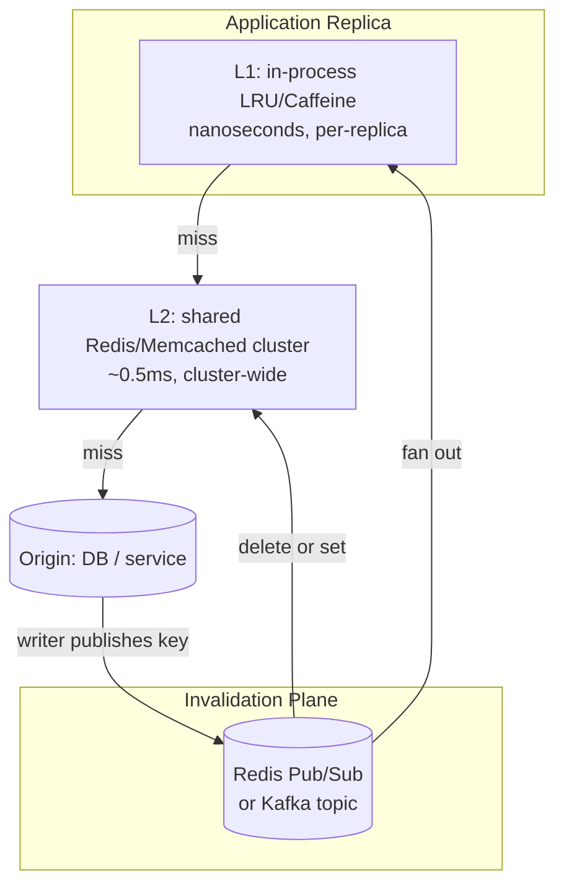
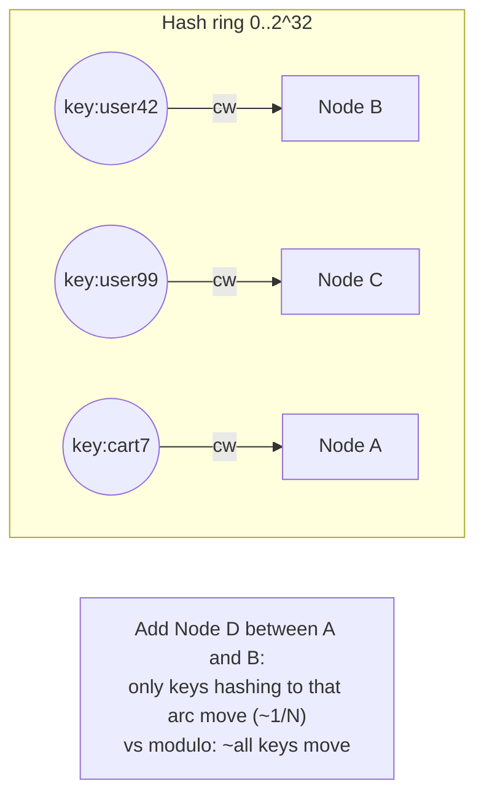
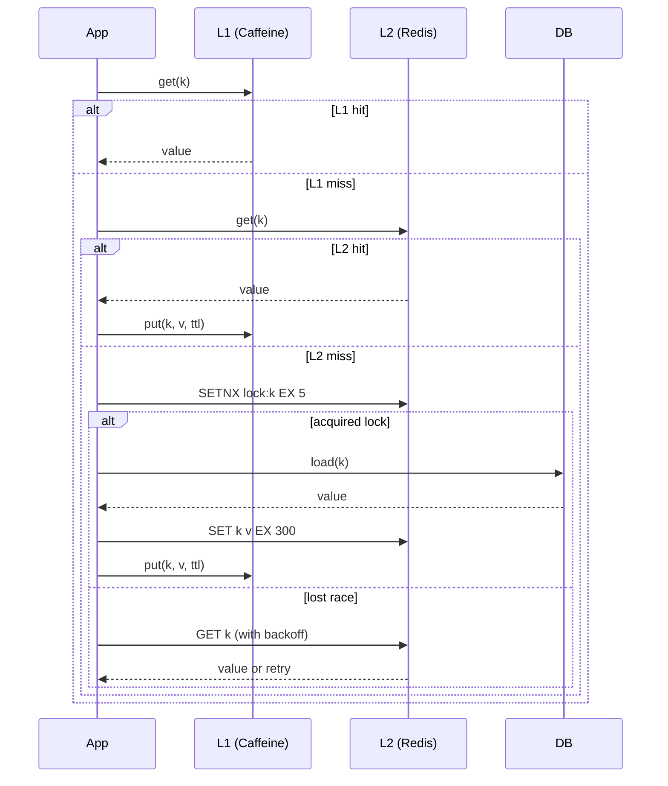

# Cache Topologies

## Why This Exists

**Problem.** A cache is not "a thing you put in front of the database." It is a topology decision with at least four axes — *where it lives* (in-process vs network), *how many copies* (single vs sharded vs replicated), *who picks the shard* (client-side vs proxy), and *who invalidates* (write-through, TTL, pub/sub). Pick wrong and you get stale data, hot shards, stampedes, or the cache becomes the bottleneck you were trying to avoid.

**Key insight.** Latency, consistency, and capacity are a triangle. **Local cache** wins latency (nanoseconds) but each replica has its own copy and they drift. **Remote cache** wins consistency and capacity but adds a network hop and a SPOF. **L1+L2** lets you have both — at the cost of a second invalidation channel. The question is never "should I cache" but "what topology matches my read pattern, write pattern, and tolerance for staleness."

**Reach for this when:**
- You have hot keys read 10K+ QPS and the DB is melting.
- Compute is expensive (ML feature lookup, permission resolution, rendered HTML).
- You see thundering herd — a key expires, every replica refetches.
- You need to share state across replicas (session, rate-limit counter, idempotency key).
- p99 latency is dominated by a single slow downstream that's mostly idempotent.

**Don't reach for this when:**
- Data changes faster than you can invalidate (sub-second freshness on writes you can't intercept). Use a materialized read replica or change-data-capture instead.
- You haven't measured. A cache hides correctness bugs and capacity bugs simultaneously. Profile first.
- Hit rate will be < ~70%. The miss path now pays cache lookup *plus* the original cost.
- The data is already cheap (single-row PK lookup on an indexed Postgres table is ~0.3ms — caching it in Redis at 0.5ms is *slower*).
- You need transactional reads. Caches lie about isolation.

## Diagrams

### Topology landscape



### Consistent hashing — why it matters when nodes come and go



### L1+L2 read path with stampede protection



## The Four Axes — Pick Each Independently

### Axis 1: Where does it live?

| Layer | Latency | Capacity | Coherency |
|---|---|---|---|
| **L0 — CPU/HTTP cache** | ns | tiny | implicit |
| **L1 — In-process (Caffeine, Guava, LRU)** | 50–500 ns | GBs of RAM, *per replica* | drift across replicas |
| **L2 — Sidecar (Redis on localhost / unix socket)** | ~50–100 µs | GBs, per host | per-host |
| **L3 — Network cache cluster (Redis/Memcached/Elasticache)** | 0.3–2 ms | TBs, cluster-wide | shared |
| **L4 — CDN / edge** | 10–50 ms (cold), <5 ms (warm) | huge | TTL-based |
| **Origin — DB / service** | 1–100 ms | source of truth | strict |

**Rule of thumb.** If your read pattern is power-law (a few keys take 80% of traffic), L1 alone gets you 80% hit rate for free. If your working set is large or coherency matters, you need L2 or L3.

### Axis 2: Sharded vs replicated

- **Sharded (Redis Cluster, Memcached with consistent hashing):** capacity scales linearly with nodes, but each key lives on exactly one shard. Lose the shard → lose those keys (or fail over to its replica). Use when working set > one node's RAM.
- **Replicated (Redis primary + read replicas, or per-replica L1):** every node has every key. Reads scale. Writes don't (and cause invalidation storms). Use when working set < one node's RAM and you need read-locality / fault tolerance.
- **Sharded + replicated:** what real Redis Cluster / DynamoDB DAX does. Each shard has a primary and N replicas. Most production setups land here above ~100 GB.

### Axis 3: Who picks the shard?

- **Client-side hashing** (memcached classic, Twemproxy clients): clients embed the ring and connect directly. Lowest latency, no proxy SPOF — but *every* client must agree on the ring or you get split-brain caching (different clients writing the same key to different nodes).
- **Proxy-based** (Twemproxy/nutcracker, Envoy with redis_proxy, Pelikan): clients talk to a proxy that owns routing. Easier ops, slightly higher latency, proxy is a hop you must HA.
- **Cluster-aware client** (Redis Cluster lettuce/jedis/go-redis): server tells client the slot map via `CLUSTER SLOTS`; client redirects on `MOVED`/`ASK`. Best of both — but client library bugs are real (handle `MOVED` storms, refresh slot map on topology change).

### Axis 4: Who invalidates?

- **TTL only.** Simple. Eventually consistent within TTL window. Acceptable for most read-mostly data.
- **Write-through.** Writer updates cache *and* DB atomically (sort of — see pitfalls). Strong-ish consistency, but writer pays the cost.
- **Write-around + invalidate.** Writer updates DB, then *deletes* the cache key. Next read reloads. Standard for L2 with mixed read/write. Cache-aside pattern.
- **Pub/sub fan-out.** Writer publishes "key X changed" on Redis pub/sub or Kafka. Every L1 in every replica subscribes and evicts locally. Required when you have L1 *and* you care about cross-replica coherency within seconds.
- **CDC-driven.** Postgres logical decoding / DynamoDB Streams / MySQL binlog → invalidation events. Source of truth for invalidation is the DB itself. Most reliable; highest infra complexity.

## Code: L1 with Caffeine (Java)

```java
// Caffeine: the de-facto JVM in-process cache. W-TinyLFU eviction beats LRU on most workloads.
// Use when: per-replica hot keys, sub-microsecond reads, you accept staleness up to refreshAfter.
import com.github.benmanes.caffeine.cache.AsyncLoadingCache;
import com.github.benmanes.caffeine.cache.Caffeine;
import java.time.Duration;
import java.util.concurrent.CompletableFuture;

public class UserProfileCache {
  private final AsyncLoadingCache<UserId, Profile> cache;

  public UserProfileCache(ProfileService origin) {
    this.cache = Caffeine.newBuilder()
        .maximumSize(100_000)                          // bound RAM — never "unbounded"
        .expireAfterWrite(Duration.ofMinutes(10))      // hard TTL — cap staleness
        .refreshAfterWrite(Duration.ofMinutes(2))      // background refresh — avoid stampede on expiry
        .recordStats()                                 // export hit-rate as a metric, not optional
        .buildAsync((key, executor) ->
            CompletableFuture.supplyAsync(() -> origin.load(key), executor));
  }

  public CompletableFuture<Profile> get(UserId id) {
    return cache.get(id);  // single-flight: concurrent gets for same key collapse to one origin call
  }

  // CRITICAL: Caffeine is per-JVM. If you have 20 replicas, you have 20 independent caches.
  // For coherency, subscribe to an invalidation topic and call cache.synchronous().invalidate(key).
}
```

## Code: L1+L2 with cache-aside + stampede protection (Go + Redis)

```go
// Pattern: cache-aside with single-flight (in-process) + Redis SETNX lock (cross-process).
// Single-flight handles the within-replica thundering herd; Redis lock handles cross-replica.
package cache

import (
    "context"
    "encoding/json"
    "errors"
    "math/rand/v2"
    "time"

    "github.com/redis/go-redis/v9"
    "golang.org/x/sync/singleflight"
)

type Layered[T any] struct {
    l1     *lru.Cache[string, entry[T]]   // bounded LRU, ~10k entries
    l2     *redis.Client                  // shared Redis (cluster client in prod)
    sf     singleflight.Group             // per-replica de-dup
    load   func(ctx context.Context, k string) (T, error)
    ttl    time.Duration
    jitter time.Duration                  // anti-stampede: randomize TTL +/- jitter
}

type entry[T any] struct {
    val       T
    expiresAt time.Time
}

func (c *Layered[T]) Get(ctx context.Context, key string) (T, error) {
    var zero T

    // L1
    if e, ok := c.l1.Get(key); ok && time.Now().Before(e.expiresAt) {
        return e.val, nil
    }

    // Single-flight: many goroutines asking for same key → one downstream call
    v, err, _ := c.sf.Do(key, func() (any, error) {
        // L2
        raw, err := c.l2.Get(ctx, key).Bytes()
        if err == nil {
            var v T
            if jerr := json.Unmarshal(raw, &v); jerr == nil {
                c.putL1(key, v)
                return v, nil
            }
        } else if !errors.Is(err, redis.Nil) {
            // Redis is down. Decide: fail open (call origin) or fail closed (return error).
            // For most read paths, fail open is correct. Add a circuit breaker so we don't
            // thunder the origin when Redis stays down.
        }

        // L2 miss. Try to acquire lock so only one replica hits origin.
        lockKey := "lock:" + key
        ok, _ := c.l2.SetNX(ctx, lockKey, "1", 5*time.Second).Result()
        if !ok {
            // Another replica is loading. Brief backoff, then re-read L2.
            time.Sleep(50 * time.Millisecond)
            if raw, err := c.l2.Get(ctx, key).Bytes(); err == nil {
                var v T
                _ = json.Unmarshal(raw, &v)
                c.putL1(key, v)
                return v, nil
            }
            // Still nothing — fall through and load anyway. Better duplicate work than stall.
        }
        defer c.l2.Del(ctx, lockKey)

        // Origin
        v, err := c.load(ctx, key)
        if err != nil {
            // Negative caching: cache "not found" briefly to stop a hot miss
            // from hammering the origin (DDoS-via-404 is real).
            return zero, err
        }

        // Write-back to L2 with jittered TTL
        ttl := c.ttl + time.Duration(rand.Int64N(int64(c.jitter)))
        if b, jerr := json.Marshal(v); jerr == nil {
            c.l2.Set(ctx, key, b, ttl)
        }
        c.putL1(key, v)
        return v, nil
    })
    if err != nil {
        return zero, err
    }
    return v.(T), nil
}

func (c *Layered[T]) putL1(k string, v T) {
    c.l1.Add(k, entry[T]{val: v, expiresAt: time.Now().Add(c.ttl / 2)}) // L1 TTL < L2 TTL
}
```

## Code: Cross-replica L1 invalidation via Redis pub/sub (TypeScript)

```typescript
// Problem: you have an L1 in every Node.js replica. A write happens. How do the
// other 19 replicas know to drop their stale copy?
// Solution: publish on a Redis channel; every replica subscribes and evicts.

import { LRUCache } from "lru-cache";
import Redis from "ioredis";

const l1 = new LRUCache<string, unknown>({ max: 10_000, ttl: 60_000 });

const pub = new Redis(process.env.REDIS_URL!);
const sub = new Redis(process.env.REDIS_URL!); // separate connection — pub/sub blocks

const REPLICA_ID = process.env.HOSTNAME ?? crypto.randomUUID();
const CHANNEL = "invalidate:user-profile";

sub.subscribe(CHANNEL);
sub.on("message", (_chan, payload) => {
  const { key, origin } = JSON.parse(payload) as { key: string; origin: string };
  // Don't evict from the replica that just wrote — it has the fresh value.
  // (Optional optimization; safe to skip and just always evict.)
  if (origin === REPLICA_ID) return;
  l1.delete(key);
});

export async function writeUserProfile(key: string, value: unknown) {
  await primaryDb.write(key, value);
  // 1. Update or delete L2 (Redis) — your choice. Delete is safer.
  await pub.del(`profile:${key}`);
  // 2. Tell every replica to drop L1.
  await pub.publish(CHANNEL, JSON.stringify({ key, origin: REPLICA_ID }));
  // 3. Update local L1 with the new value (we just wrote it).
  l1.set(key, value);
}

// CAVEAT: Redis pub/sub is fire-and-forget. If a subscriber is disconnected
// at the moment of publish, it misses the message. For stronger guarantees,
// use Redis Streams (XADD/XREAD with consumer groups) or Kafka. The TTL on
// L1 is your safety net — staleness is bounded even if invalidation is lost.
```

## Code: Consistent hashing client (Python, conceptual)

```python
# Real clients use libketama / jump consistent hash / rendezvous hashing.
# This is the shape of the algorithm — production code should use a library.

import bisect
import hashlib

class ConsistentHashRing:
    def __init__(self, nodes: list[str], vnodes: int = 160):
        # vnodes (virtual nodes) per physical node spread keys evenly.
        # 160 is the libketama default and works well.
        self.ring: list[tuple[int, str]] = []
        for node in nodes:
            for i in range(vnodes):
                h = self._hash(f"{node}#{i}")
                self.ring.append((h, node))
        self.ring.sort()

    @staticmethod
    def _hash(key: str) -> int:
        return int(hashlib.sha1(key.encode()).hexdigest()[:8], 16)

    def node_for(self, key: str) -> str:
        h = self._hash(key)
        idx = bisect.bisect(self.ring, (h, ""))
        if idx == len(self.ring):
            idx = 0
        return self.ring[idx][1]

    # Add/remove a node moves only ~1/N of keys (vs modulo, which moves ~all).
    # That property is the entire reason consistent hashing exists.

# In production prefer:
#  - Jump consistent hash (Lamping & Veach 2014) — no ring memory, O(1) lookup.
#  - Rendezvous hashing (HRW) — better load balance under churn, simpler.
```

## Trade-offs

| Choice | Benefit | Cost |
|---|---|---|
| **L1 only (in-process)** | Nanosecond reads, no network, survives Redis outage | Per-replica drift; cold start on every deploy; can't share writes |
| **L2 only (remote)** | Single source of truth, survives replica restart, capacity scales | Network hop on every read; SPOF unless clustered; serialization cost |
| **L1 + L2** | Best of both: hot keys served from L1, cold from L2 | Two invalidation paths; two TTLs to reason about; more code |
| **Sharded (consistent hash)** | Capacity scales horizontally; ~1/N keys move on resize | One shard down = those keys cold-miss; client must handle redirects |
| **Replicated** | Reads scale, fault tolerant, simple client | Capacity = single node's RAM; write fan-out cost |
| **Client-side hashing** | Lowest latency, no proxy hop | Every client must agree on ring; client upgrades are coordination problems |
| **Proxy-based** | Operationally simpler, central place for failover logic | Extra hop (~0.1-0.5ms); proxy must be HA |
| **TTL invalidation** | Trivial to implement; bounded staleness | Until-TTL staleness window; storms when many keys expire together |
| **Pub/sub invalidation** | Sub-second cross-replica coherency | Lossy if subscriber disconnects; doubles infra complexity |
| **Write-through** | Cache always consistent with last write | Writer pays cache+DB latency; partial-failure scenarios are nasty |
| **Write-around + delete** | Writer pays only DB; cache reloads on demand | Brief negative-cache miss after every write |
| **Negative caching** | Stops "hot missing key" from melting origin | Risk of caching transient errors as "definitely not found" |

## Common Pitfalls

- **Cache stampede / dogpile.** A hot key expires; 1000 concurrent requests all miss; all 1000 hit the origin; origin dies. Fix: single-flight (in-process) + distributed lock (cross-replica) + TTL jitter (don't expire at the same instant). See the Go example above.
- **Thundering herd on deploy.** New replicas start with empty L1. First few seconds, hit rate is 0%, every read goes to L2 or DB. Mitigations: rolling deploys (don't replace > N% at once), warm cache from a snapshot, route only a fraction of traffic to new replicas (canary).
- **Modulo hashing instead of consistent hashing.** `node = hash(key) % N`. Add a node, N changes, *every* key moves to a new node, hit rate goes to 0%, origin gets crushed. Always use consistent hashing for sharded caches.
- **Hot shard.** Even with consistent hashing, one celebrity user's key takes 40% of traffic. The shard owning them melts while others idle. Mitigations: replicate hot keys with a suffix (`user:42:r1`, `user:42:r2` — client picks at random) or pull hot keys into L1 aggressively.
- **Inconsistent serialization.** Writer A serializes a `User` as JSON with field `userId`. Writer B uses `user_id`. Reader gets garbage on reads from writes by the other. Pin a serialization contract; version it; reject unknown versions on read.
- **Cache-as-source-of-truth.** "It's been in Redis so long the DB row got deleted." Caches are a derived view. Have a job that re-derives from origin and reconciles, or accept eventual repair via TTL.
- **Unbounded L1.** No `maximumSize` on Caffeine, no `max` on lru-cache. RAM grows until OOM. Always bound. Always.
- **Caching mutable references.** Java cache returns the same `List` object to every caller; one caller mutates it; everyone sees the mutation. Cache immutable values, or defensive-copy on get.
- **TTL = network timeout.** TTL is 5 seconds; downstream call has a 10-second timeout. After TTL expires, every read takes 10 seconds. Make TTL >> origin latency, with refresh-ahead before expiry.
- **Forgetting to invalidate on the *write* path.** Read path is well-cached; the write path bypasses cache and updates the DB. Reads return stale data forever (until TTL). Either: (a) all writes go through the cache layer, or (b) all writes publish invalidations. There is no third option.
- **Pub/sub message loss.** Redis pub/sub is at-most-once. A subscriber that briefly disconnects misses messages. Treat pub/sub as a hint, not a guarantee — TTL is the safety net. For real correctness, use Redis Streams or Kafka.
- **Negative caching forever.** Cached "not found" with TTL=1 hour. Resource is created 5 minutes later. New resource is invisible for 55 minutes. Use short negative TTLs (seconds), not the same TTL as positive entries.
- **Connection pool exhaustion.** L2 misses spike → all worker threads block on Redis.Get → pool exhausts → cascading failure. Set tight Redis client timeouts (10–50ms typical), use bounded connection pools, and break the circuit on sustained timeouts.
- **Ignoring the cost of the cache itself.** A Redis lookup is ~0.5ms. If your DB query is 0.3ms, the cache is *slowing you down*. Measure both paths.

## Decision Table

| Situation | Topology | Why |
|---|---|---|
| Single-process service, hot key set fits in RAM | **L1 only (Caffeine/LRU)** | Nanoseconds, no infra |
| Multi-replica stateless service, per-user data, occasional staleness OK | **L1 + L2 (Redis), TTL** | L1 absorbs hot reads, L2 keeps replicas roughly aligned |
| Multi-replica, *cannot tolerate* cross-replica drift > 1s | **L1 + L2 + pub/sub invalidate** | TTL alone is too slow; pub/sub closes the gap |
| Working set > one node's RAM (100 GB+) | **Sharded (Redis Cluster / Memcached + ketama)** | Capacity scales horizontally |
| Read-mostly, working set < 50 GB, want fault tolerance | **Replicated Redis (primary + read replicas)** | Reads scale, simple, FO is well-trodden |
| Latency budget < 100 µs for cache lookup | **L1 (in-process) — never network** | Network round-trip alone is 100+ µs |
| Need cross-region cache | **L4 CDN + per-region L2** | Don't try to globally replicate Redis at low latency |
| Strong consistency required | **Don't cache — read from primary** | Or use cache with read-your-writes session affinity. Caches lie about isolation |
| Hot key concentration is extreme (one key = 40% of traffic) | **Hot-key replication: write to N keys, read random one** | Spreads load across shards |
| Heterogeneous data sizes (some 100 B, some 10 MB) | **Two caches: small-value Memcached + large-value Redis or S3** | Memcached's slab allocator wastes space on large values |
| Read-through write-through transactional | **Don't roll your own — use a managed cache like DAX** | The corner cases will eat you |

## References

- Kleppmann — *Designing Data-Intensive Applications*, ch. 1 (reliability/scalability), ch. 5 (replication), ch. 6 (partitioning) — https://dataintensive.net/
- Karger et al. — *Consistent Hashing and Random Trees* (STOC 1997) — https://www.akamai.com/site/en/documents/research-paper/consistent-hashing-and-random-trees-distributed-caching-protocols-for-relieving-hot-spots-on-the-world-wide-web-technical-publication.pdf
- Lamping & Veach — *A Fast, Minimal Memory, Consistent Hash Algorithm* (Jump consistent hash, 2014) — https://arxiv.org/abs/1406.2294
- Thaler & Ravishankar — *Using Name-Based Mappings to Increase Hit Rates* (Rendezvous / HRW hashing, 1998) — https://www.eecs.umich.edu/techreports/cse/96/CSE-TR-316-96.pdf
- Nishtala et al. (Facebook) — *Scaling Memcache at Facebook* (NSDI 2013) — https://www.usenix.org/system/files/conference/nsdi13/nsdi13-final170_update.pdf
- Antirez — *Redis Cluster Specification* — https://redis.io/docs/latest/operate/oss_and_stack/reference/cluster-spec/
- Caffeine — *Design overview & W-TinyLFU* — https://github.com/ben-manes/caffeine/wiki/Design
- AWS Builders' Library — *Caching Challenges and Strategies* (Pelletier) — https://aws.amazon.com/builders-library/caching-challenges-and-strategies/
- AWS Builders' Library — *Avoiding Fallback in Distributed Systems* (Yan, on stampede / fallback hazards) — https://aws.amazon.com/builders-library/avoiding-fallback-in-distributed-systems/
- Google SRE Workbook — ch. 11 *Managing Load* (cached-load failure modes) — https://sre.google/workbook/managing-load/
- Pat Helland — *Data on the Outside vs Data on the Inside* (CIDR 2005) — http://cidrdb.org/cidr2005/papers/P12.pdf
- Pat Helland — *Immutability Changes Everything* — https://queue.acm.org/detail.cfm?id=2884038
- Memcached — *ketama consistent hashing* — https://github.com/RJ/ketama
- Twitter — *Twemproxy (nutcracker)* — https://github.com/twitter/twemproxy
- Adrian Colyer — *The morning paper on Scaling Memcache at Facebook* — https://blog.acolyer.org/2015/06/22/scaling-memcache-at-facebook/

## See Also

- ../caching-strategies/ — cache-aside vs write-through vs write-behind, TTL/refresh policies, negative caching
- ../cdn-edge-caching/ — L4 edge: TTL hierarchies, cache-key normalization, surrogate keys, soft-purge
- ../load-balancing/ — consistent hashing applied at the LB layer (sticky sessions, hash-based routing)
- ../rate-limiting/ — token bucket / leaky bucket implemented on top of Redis (shared state pattern)
- ../../reliability/circuit-breakers/ — failing open vs failing closed when the cache is down
- ../../reliability/backpressure-and-load-shedding/ — what to do when cache miss storm overwhelms the origin
- ../../reliability/thundering-herd/ — single-flight, jittered TTL, request coalescing in depth
- ../../data/replication-patterns/ — primary/replica vs multi-leader vs CRDT (the "replicated cache" question generalizes)
- ../../data/consistency-models/ — read-your-writes, monotonic reads, and how caches break them
- ../../observability/golden-signals/ — hit rate, miss rate, eviction rate, p99 lookup latency are first-class metrics
- ../database-indexing/ — sometimes the right answer is "add an index" not "add a cache"
