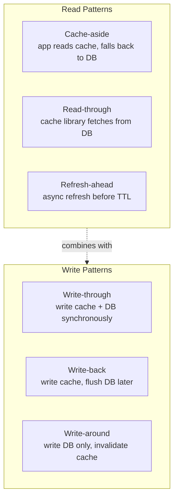
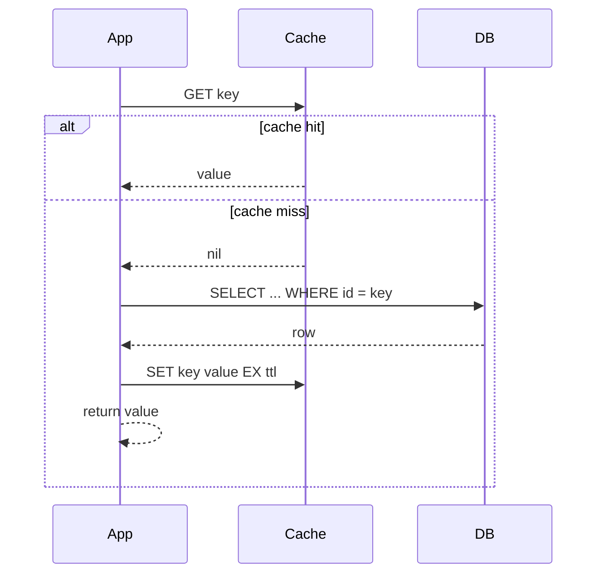
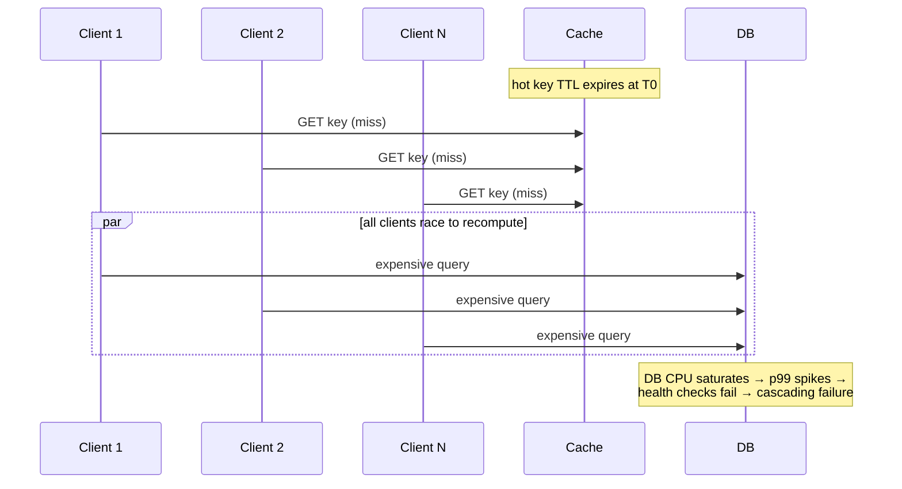
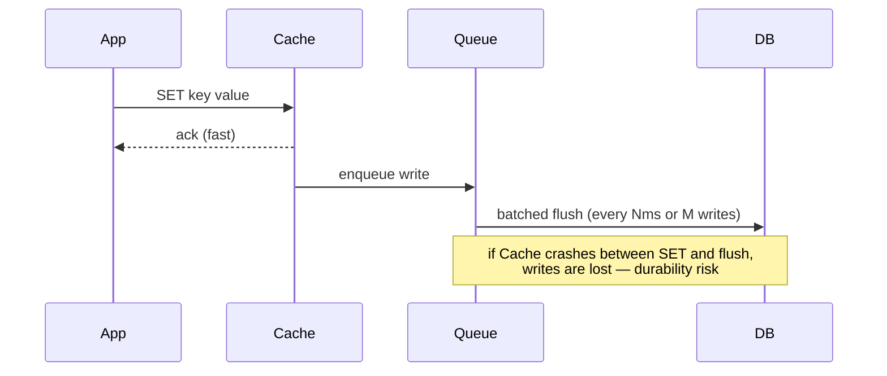
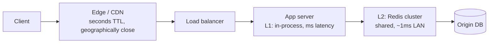

# Caching Strategies

## Why This Exists

**Problem.** A cache is the simplest performance optimization and one of the most subtle distributed-systems hazards. Get it wrong and you trade a slow database for stale reads, duplicated charges, cascading outages when the cache restarts cold, and hours debugging "this user sees yesterday's data and that user sees today's." Most outages attributed to "the cache" are actually outages caused by **how the system behaves when the cache is unavailable, inconsistent, or stampeded** — not by the cache itself.

**Key insight.** Caching is a *consistency vs. availability vs. latency* trade-off, not a free speedup. Every cache pattern picks a different position on that triangle: write-through buys consistency by paying every write twice, write-back buys throughput by accepting durability risk, cache-aside buys flexibility by exposing the application to stampedes and stale reads. **Pick the pattern whose failure mode you can survive on the worst day**, then engineer defenses (single-flight, jittered TTL, negative caching, fallback) for the failures it does have. AWS's Builders' Library puts it bluntly: *"At Amazon … we've found that caches frequently shift problems and complexities from one area to another."*

**Reach for this when:**
- Origin (DB, downstream service) is the bottleneck and read traffic dwarfs writes (typical: 100:1 or higher).
- Computed values are expensive but stable (rendered HTML, ML feature vectors, aggregated counters).
- You need to absorb traffic spikes without scaling the origin (CDN edge cache, regional read replica cache).
- You're seeing repeated identical requests (same key, same value) within a short window.
- You need to *reduce blast radius* of a downstream outage by serving stale-but-acceptable data.

**Don't reach for this when:**
- Reads are unique (no key reuse) — you'll just add latency and complexity.
- Strong consistency is required and you can't tolerate even bounded staleness (financial ledger entry reads, auth token revocation checks).
- The origin is already faster than the cache for that workload (in-memory SQLite vs. Redis network round-trip).
- Your cache invalidation strategy is "we'll figure it out later" — you won't.

> "There are only two hard things in Computer Science: cache invalidation and naming things." — Phil Karlton. The joke is funny because invalidation defeats the smartest engineers in the room.

---

## Diagrams

### Pattern overview



### Cache-aside (the most common pattern)



### Cache stampede — the failure mode you must defend against



---

## The Five Read/Write Patterns

### 1. Cache-aside (lazy loading)

The application owns the cache. On read, check cache → on miss, hit DB → backfill cache. On write, update DB and invalidate (or update) the cache key.

```python
import redis, json, time
from typing import Optional

r = redis.Redis()
TTL = 300  # 5 minutes

def get_user(user_id: str) -> Optional[dict]:
    key = f"user:{user_id}"
    cached = r.get(key)
    if cached is not None:
        # NOTE: even an empty string is a hit — distinguish from None.
        # This matters for negative caching (see below).
        return json.loads(cached) if cached != b"__NULL__" else None

    row = db.fetch_one("SELECT * FROM users WHERE id = %s", user_id)
    if row is None:
        # Negative cache: prevent repeated DB hits for missing keys.
        # Short TTL because the row may be created soon.
        r.set(key, "__NULL__", ex=30)
        return None

    r.set(key, json.dumps(row), ex=TTL)
    return row

def update_user(user_id: str, patch: dict) -> None:
    db.execute("UPDATE users SET ... WHERE id = %s", user_id)
    # Invalidate, don't update. Updating in-place opens a race:
    # T0: writer A fetches DB row v1
    # T1: writer B fetches DB row v1, mutates to v2, writes DB
    # T2: writer A mutates v1 to v1', writes cache
    # cache now has v1', DB has v2. Skew until TTL.
    r.delete(f"user:{user_id}")
```

**Pros:** simple, robust to cache outages (just hit DB), only caches what's actually read. **Cons:** cold-cache penalty, application code is responsible for consistency, vulnerable to stampedes (see below).

### 2. Read-through

The cache is a black-box library that knows how to load from the origin on miss. The application sees only `cache.get(key)`. Common in CDN configs, ORM query caches (Hibernate L2), and JCache providers.

```java
// Caffeine (Java) read-through with async loader
LoadingCache<String, User> cache = Caffeine.newBuilder()
    .maximumSize(10_000)
    .expireAfterWrite(Duration.ofMinutes(5))
    .refreshAfterWrite(Duration.ofMinutes(2))   // refresh-ahead trigger
    .build(userId -> userRepository.findById(userId));   // loader

User u = cache.get("u-123");   // returns cached or loads + caches
```

**Pros:** centralized loader, easier to reason about consistency in one place. **Cons:** cache and origin become coupled — a buggy loader (e.g. one that throws on transient DB errors) can take down every reader.

### 3. Write-through

Every write hits cache and origin **synchronously** before returning success. Cache is always consistent with origin.

```python
def write_through_set(key: str, value: dict) -> None:
    db.execute("UPDATE ... ", value)        # 1. write origin
    r.set(key, json.dumps(value), ex=TTL)   # 2. write cache
    # If step 2 fails, cache is stale. Most implementations
    # accept this and rely on TTL — or use a transactional outbox.
```

**Pros:** read-after-write consistency for cached keys, simpler invalidation. **Cons:** every write pays cache-write latency, doesn't help the *first* read of a key (still a miss until written), wastes cache space on rarely-read keys.

### 4. Write-back (write-behind)

Application writes to cache, cache asynchronously flushes to origin. Common in CPU caches, OS page cache, and Redis-as-write-buffer designs for high-throughput counters.



**Pros:** very fast writes, batches reduce DB load by 10-100x. **Cons:** **data loss on cache failure**, complex recovery, hard to reason about read-after-write, unsuitable when origin is the source of truth (e.g. financial transactions). Use only for: counters/metrics where loss is acceptable, or when the cache itself is durable (Redis AOF + replication).

### 5. Refresh-ahead

Before a key's TTL expires, asynchronously refresh it from origin so readers never observe a miss for hot keys. Combine with cache-aside for cold keys.

```go
// Pseudocode: refresh when (now - lastFetch) > TTL * 0.8
func get(key string) (Value, error) {
    entry, ok := cache.Load(key)
    if !ok {
        return loadAndStore(key)   // cold miss
    }
    if time.Since(entry.lastFetch) > entry.ttl*8/10 {
        // fire-and-forget refresh; current request returns stale value
        go func() {
            v, err := origin.Load(key)
            if err == nil {
                cache.Store(key, Entry{Value: v, lastFetch: time.Now()})
            }
            // on error: keep stale entry, retry next request
        }()
    }
    return entry.Value, nil
}
```

**Pros:** hides origin latency for hot keys, smooths load (no synchronized expirations). **Cons:** wasted work refreshing keys nobody reads, slightly stale reads in the refresh window, requires per-key access prediction.

---

## Cache Stampede Defense (the section that prevents 3am pages)

A **stampede** (a.k.a. dogpile, thundering herd) occurs when a hot key expires and N concurrent readers all miss simultaneously, all hit the origin, all recompute the same value, and the origin collapses. This is the single most common cache-induced outage.

### Defense 1: Single-flight (request coalescing)

Only one in-flight regeneration per key; other readers wait for that result.

```go
// Go's golang.org/x/sync/singleflight — production-tested at Google
import "golang.org/x/sync/singleflight"

var group singleflight.Group

func GetUser(id string) (*User, error) {
    v, err, _ := group.Do("user:"+id, func() (interface{}, error) {
        if cached, ok := cache.Get(id); ok {
            return cached, nil
        }
        u, err := db.LoadUser(id)
        if err != nil {
            return nil, err
        }
        cache.Set(id, u, 5*time.Minute)
        return u, nil
    })
    if err != nil {
        return nil, err
    }
    return v.(*User), nil
}
```

In Python, use `asyncio.Lock` per key (with a key-sharded lock map to avoid contention). In Java, `ConcurrentHashMap.computeIfAbsent` provides the primitive but Caffeine's `LoadingCache` does this for you.

### Defense 2: Jittered TTL

Never set the same TTL on related keys — synchronized expirations cause synchronized stampedes. Add randomness:

```python
import random
ttl = 300 + random.randint(-30, 30)   # 5min ± 10%
r.set(key, value, ex=ttl)
```

### Defense 3: Probabilistic early expiration (XFetch)

Each read computes a probability of regenerating *before* the formal expiration; probability rises as TTL approaches. From the seminal Vattani et al. paper *"Optimal Probabilistic Cache Stampede Prevention"* (VLDB 2015):

```python
import math, random, time

def xfetch_get(key, ttl, beta=1.0):
    # cache stores (value, delta, expiry) where delta = compute time
    cached = cache.get(key)
    now = time.time()
    if cached is not None:
        value, delta, expiry = cached
        # negative random sample, scaled by recompute cost
        if now - delta * beta * math.log(random.random()) >= expiry:
            value = recompute(key)
            cache.set(key, (value, recompute_duration, now + ttl))
        return value
    # cold miss
    value = recompute(key)
    cache.set(key, (value, recompute_duration, now + ttl))
    return value
```

The clever bit: `-log(random())` is exponentially distributed; multiplied by `delta` (cost), it makes expensive-to-compute keys refresh earlier and cheap ones almost never refresh early. Statistically, exactly one client refreshes per key per TTL window.

### Defense 4: Stale-while-revalidate (SWR)

Serve the stale value to current readers, refresh asynchronously. RFC 5861 formalized this for HTTP; Cloudflare, Fastly, and Next.js implement it. Strong default for read-heavy web traffic when "a few seconds stale" is fine.

### Defense 5: Pre-warming

For predictable hot keys (homepage, top-K product list), populate the cache *before* it's needed — at deploy time, on a schedule, or via a warm-up replay against logs. AWS Builders' Library calls this out as essential for any cache whose miss penalty is too high to absorb under live traffic.

---

## Negative Caching

**Cache the absence of data**, not just data. Without it, repeated requests for nonexistent keys (typo'd URLs, scraper noise, deleted records) hammer the DB on every request.

```python
SENTINEL_NULL = "__NULL__"
NEG_TTL = 30   # short — the row may exist soon

def get_with_neg_cache(key):
    cached = r.get(key)
    if cached == SENTINEL_NULL.encode():
        return None
    if cached is not None:
        return json.loads(cached)
    row = db.fetch(key)
    if row is None:
        r.set(key, SENTINEL_NULL, ex=NEG_TTL)
        return None
    r.set(key, json.dumps(row), ex=300)
    return row
```

**Pitfalls:**
- Negative TTL must be **shorter** than positive TTL — otherwise a newly-created record is invisible until the negative cache expires.
- Don't negative-cache 5xx errors as "not found" — that turns a transient downstream blip into a fixed-duration false 404.
- For very large miss spaces (e.g. random user-supplied keys), use a **Bloom filter** in front of the cache so "definitely not in DB" is answered without a cache lookup.

---

## TTL vs. Explicit Invalidation

| Approach | When to use | Failure mode |
|---|---|---|
| **TTL only** | Eventually-consistent reads acceptable; writers can't easily notify cache (different service, batch jobs). | Stale up to TTL window. Tune TTL to consistency budget. |
| **Explicit invalidation on write** | Strong-ish consistency needed; writers know affected keys. | Missed invalidation (bug, network drop, key derivation mismatch) → stale forever. **Always backstop with TTL.** |
| **Versioned keys (`user:123:v7`)** | Bulk invalidation of related keys (deploy, schema change, full refresh). | Old keys linger until LRU evicts them — wastes memory if not bounded. |
| **Pub/sub invalidation** (Redis `__keyspace@__`, Memcached fanout) | Multi-tier caches (CDN + Redis + L1) where each tier needs to drop a key. | Pub/sub at-most-once delivery — must combine with TTL. |
| **Write-through** | Cache and DB always consistent for cached keys. | Doesn't fix consistency for *uncached* keys; doubles write latency. |

**Rule of thumb:** TTL is a *backstop*, not a strategy. Every cache key should have a TTL even if you also invalidate explicitly — because invalidations get lost, and a finite staleness window is better than indefinite skew.

---

## Cache Hierarchies (L1 / L2 / Edge)

Most production systems use multiple cache tiers:



**Rules:**
- L1 TTL ≤ L2 TTL ≤ origin freshness window. Otherwise an L1 miss promotes a stale L2 value.
- Invalidations must propagate **down** the hierarchy (drop L1 *and* L2 on write), or you'll see "I see new data on this server, old data on that server" until L1s expire.
- Don't replicate L2 state into L1 by reference — copy. Otherwise an L1 read sees a torn L2 update.

---

## Trade-offs

| Benefit | Cost |
|---|---|
| Lower read latency (RAM beats disk by 100-1000x) | Stale data window equal to TTL or invalidation lag |
| Reduced origin load → smaller / cheaper DB | Cold-start penalty after deploy or cache restart |
| Smooths traffic spikes; absorbs DDoS-like patterns | Stampedes when hot keys expire (must defend) |
| Can serve during origin outages (stale-while-error) | Cache becomes a critical dependency itself |
| Per-key TTL and pattern choice gives fine-grained control | Operational complexity: hit ratio, eviction, memory monitoring |
| Write-back batches DB writes 10-100x | Data loss on cache failure for un-flushed writes |
| Negative caching defends against scrape/typo floods | Bug: created records invisible for negative-TTL window |
| CDN edge cache reduces RTT to single-digit ms globally | Invalidation across edge POPs is eventually consistent (seconds-minutes) |

---

## Common Pitfalls

- **Cold-cache cascading failure.** Cache server restarts; every read becomes a DB hit; DB saturates; latency rises; health checks fail; instances are killed; remaining instances see more load; total outage. Defenses: pre-warm before serving traffic, scale DB headroom for cache-down scenarios, use circuit breakers to fail fast rather than queue up DB calls. AWS's *"Caching challenges and strategies"* essay is essentially a 5000-word warning about this.
- **Synchronized TTLs.** Deploying with `SET EX 3600` everywhere means every key set during the deploy expires at the same second one hour later. Add jitter.
- **Cache-as-source-of-truth.** Someone removes the DB write because "the cache has it" — until the cache evicts, restarts, or is flushed.
- **Read-modify-write race in cache-aside writes.** Two writers, both read v1, both compute v2 differently, both `SET`. Last write wins, other update is lost. Use **invalidate-on-write** (delete) instead of update-on-write, or use `WATCH`/CAS.
- **Inconsistent key derivation.** Reader computes `user:{id}`, invalidator computes `users:{id}`. Cache never invalidates. Centralize key construction in one function/module.
- **Missing negative cache.** A scraper requesting `/user/aaaaaa`, `/user/bbbbbb`... drives 100% miss rate against your DB.
- **Caching error responses.** Origin returned 500 for 30 seconds; you cached "unavailable" for 5 minutes. Outage is now 5 minutes. Cache only successful, semantically meaningful responses.
- **Unbounded cache growth.** No `maxmemory` policy, no LRU; cache grows until OOM-kill. In Redis, set `maxmemory` and `maxmemory-policy allkeys-lru` (or `volatile-lru` if mixing TTL and persistent keys).
- **Big keys / hot keys.** A single 5MB cache value blocks the cache thread on serialization; a single hot key (e.g. global counter) saturates one shard. Shard hot keys (`counter:{shard_id}`), use client-side caching for big rarely-changing values.
- **TTL too long for write rate.** If users update profiles every few minutes but TTL is 1 hour, users see their own writes ignored. Solutions: invalidate on write, or serve writer's own writes from a write-through path (sticky session to "I just wrote" cache).
- **Forgetting that the cache adds a network hop.** Local in-memory L1 + remote L2 is often faster than going straight to a fast DB on the same network — measure first.

---

## Decision Table

| Situation | Pattern | Why |
|---|---|---|
| Read-heavy workload, eventual consistency OK | **Cache-aside + TTL + jitter + single-flight** | Default. Simple, robust to cache outage, minimal coupling. |
| Read-after-write consistency required for cached entity | **Write-through + cache-aside reads** | Cache is always fresh for keys that exist; uncached reads still hit DB. |
| Very high write throughput, tolerable durability loss (counters, metrics) | **Write-back with periodic flush** | Batches reduce DB writes 10-100x. Pair with durable cache (Redis AOF) and accept residual loss. |
| Predictable hot keys, miss latency unacceptable | **Refresh-ahead** (Caffeine, EhCache, Hazelcast) | Refreshes before TTL — readers never observe a miss. |
| Read-mostly with occasional global invalidations (deploys, schema) | **Versioned keys** (`v7:user:{id}`) | Increment version; old keys age out via LRU. No invalidate-by-pattern required. |
| Many requests for nonexistent keys | **Negative caching + Bloom filter** | Sentinel value blocks DB hits; Bloom filter blocks cache lookups for huge miss spaces. |
| Multiple tiers (CDN + Redis + in-process) | **Hierarchical cache, L1 TTL ≤ L2 TTL** | Edge absorbs spikes, L2 absorbs miss bursts, L1 cuts per-request RTT. |
| Strong consistency, can't tolerate any staleness | **No cache, or read-your-writes via leader read** | Caches ≠ free. Use replicas + leader read instead. |
| Origin can briefly be down without breaking UX | **Stale-while-revalidate / stale-while-error** | Cache extends availability beyond origin uptime. |
| One service writes, many services read | **Write-through with pub/sub invalidation + TTL** | Writer notifies; TTL backstops missed messages. |

---

## Operational Checklist

Before going to production with a cache, answer:

1. **What's the hit ratio target?** Below ~80% the cache is mostly latency tax. Measure.
2. **What happens on full cache restart?** Can the origin handle 100% miss for N minutes? If not, you have a latent outage.
3. **What's the TTL?** Is it less than the consistency budget agreed with the product?
4. **How are stampedes prevented?** Single-flight, jitter, XFetch, or SWR — pick at least one.
5. **What's the eviction policy?** LRU, LFU, TTL-only? Does your access pattern match? (LRU on a workload with periodic full-table scans evicts hot keys.)
6. **How is the cache monitored?** Hit rate, eviction rate, memory utilization, p99 GET/SET latency, big-key alarms.
7. **What's the negative caching strategy?** None means scrapers can DoS your DB.
8. **How is invalidation tested?** Has anyone actually verified the write path drops the key?

---

## References

- AWS Builders' Library — Matt Brinkley & Jas Chhabra — *Caching challenges and strategies* — https://aws.amazon.com/builders-library/caching-challenges-and-strategies/
- AWS Builders' Library — *Avoiding overload in distributed systems by putting the smaller service in control* (load shedding context for cache-down scenarios) — https://aws.amazon.com/builders-library/avoiding-overload-in-distributed-systems-by-putting-the-smaller-service-in-control/
- Andrea Vattani, Flavio Chierichetti, Keegan Lowenstein — *Optimal Probabilistic Cache Stampede Prevention* — VLDB 2015 — https://cseweb.ucsd.edu/~avattani/papers/cache_stampede.pdf
- IETF RFC 5861 — *HTTP Cache-Control Extensions for Stale Content* (stale-while-revalidate, stale-if-error) — https://www.rfc-editor.org/rfc/rfc5861
- IETF RFC 9111 — *HTTP Caching* (the modern caching spec, supersedes RFC 7234) — https://www.rfc-editor.org/rfc/rfc9111
- Martin Kleppmann — *Designing Data-Intensive Applications* — O'Reilly 2017 — ch. 1 (reliability of caches as critical components), ch. 5 (replication and read-your-writes), ch. 11 (stream processing for cache invalidation via CDC).
- Google SRE Book — *Site Reliability Engineering* — ch. 22 *Addressing Cascading Failures* (cold-cache scenarios) — https://sre.google/sre-book/addressing-cascading-failures/
- Google SRE Workbook — *Managing Load* — https://sre.google/workbook/managing-load/
- Facebook Engineering — Rajesh Nishtala et al. — *Scaling Memcache at Facebook* — NSDI 2013 — https://www.usenix.org/system/files/conference/nsdi13/nsdi13-final170_update.pdf  *(canonical paper on lease-based stampede prevention, gutter pools, cold-cluster warm-up)*
- Redis Labs — *Redis client-side caching* (RESP3 broadcast invalidation) — https://redis.io/docs/manual/client-side-caching/
- Caffeine (Java) — Ben Manes — high-performance, near-optimal caching library — https://github.com/ben-manes/caffeine/wiki
- Varnish — *Grace mode and stale-while-revalidate* — https://varnish-cache.org/docs/trunk/users-guide/vcl-grace.html
- Pat Helland — *Immutability Changes Everything* — CIDR 2015 — https://www.cidrdb.org/cidr2015/Papers/CIDR15_Paper16.pdf  *(why immutable values trivialize cache invalidation)*
- Phil Karlton (attributed) — *"There are only two hard things in Computer Science: cache invalidation and naming things."* — Martin Fowler's discussion: https://martinfowler.com/bliki/TwoHardThings.html
- Adrian Colyer / The Morning Paper — Memcache and stampede prevention summaries — https://blog.acolyer.org/

---

## See Also

- `../../reliability/rate-limiting/` — token-bucket counters often live in the same Redis instance; share patterns
- `../../reliability/circuit-breaker/` — fail fast when origin is down rather than queueing requests during cold-cache scenarios
- `../../reliability/load-shedding/` — what to do when cache miss rate exceeds origin capacity
- `../use-red-methods/` — hit rate, eviction rate, latency are first-class signals
- `../../architecture-patterns/cqrs/` — read-model caches as a CQRS implementation detail
