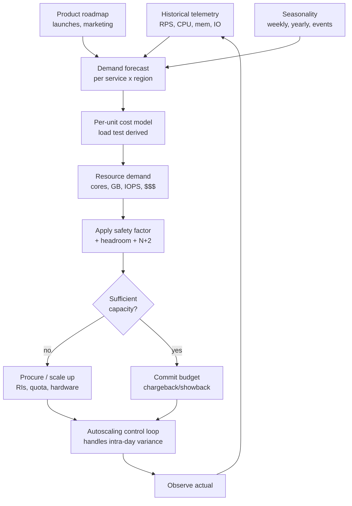
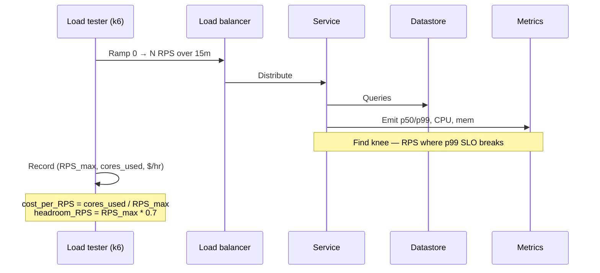
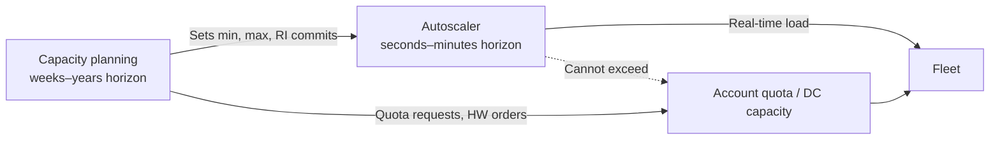
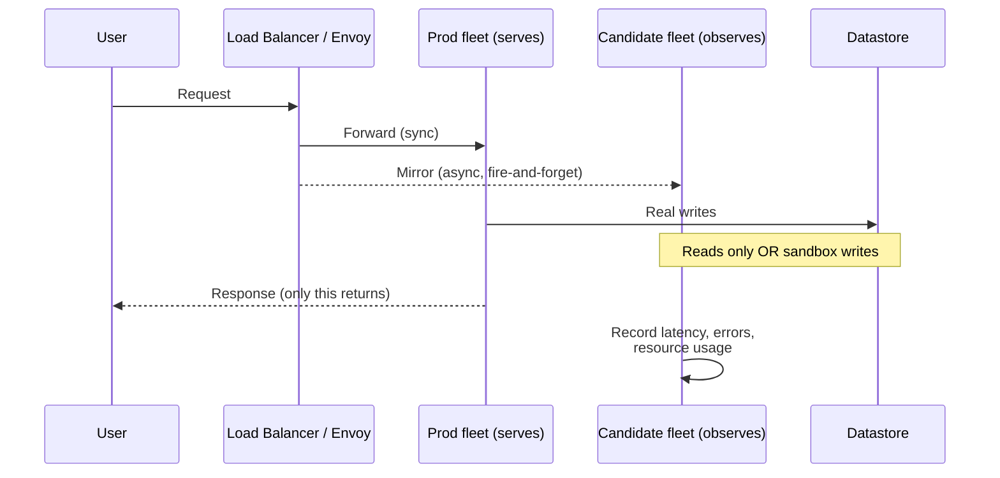

# Capacity Modeling

## Why This Exists

**Problem.** Systems fail in two predictable ways: (1) sudden saturation under peak load that autoscaling can't react to in time, and (2) chronic over-provisioning that bleeds money and hides real efficiency problems. Both stem from not having a defensible model of *how much capacity you need, when, and why*.

**Key insight.** Capacity is **demand × resource cost per unit of demand**, both projected forward in time with a safety factor. Autoscaling is a *control loop* on top of capacity planning — it doesn't replace the planning. If your steady-state model is wrong, autoscaling will either thrash or run out of headroom (instance launch latency, account quotas, kernel page-cache warmup, JIT warmup, connection pool drain — all are slower than a flash crowd).

**Reach for this when:**
- You're sizing a new service, region, or hardware refresh.
- You're planning for a known event (Prime Day, Super Bowl ad, marketing launch, end-of-quarter batch).
- Your autoscaler keeps hitting min/max bounds, or you're paying for "headroom" you can't justify.
- Finance asks "why do we spend $X on EC2?" and you can't decompose it per product/customer/feature.
- You need to forecast 6-24 months out for hardware lead times, datacenter contracts, or reserved instance / savings plan commitments.

**Don't reach for this when:**
- You have <100 RPS and a single small instance with autoscaling 1-3 covers everything. Modeling is overkill.
- The system has no load history and no comparable baseline (then run a load test first; modeling without data is fiction).
- The bottleneck is a third-party API with its own quota — that's a *contract* problem, not a capacity model problem.

This skill leans heavily on **Google SRE Workbook ch. 11 — Managing Load** and **SRE Book ch. 18 — Software Engineering in SRE** (the "Auxon" intent-based capacity planning case study). Read those if you have not.

## Diagrams

The capacity planning loop:



Load testing → cost-per-unit derivation:



## Build the Model

Capacity modeling has three parts: **demand**, **cost-per-unit**, and **safety**. Get all three or you're guessing.

### 1. Demand forecasting

Decompose demand into **trend + seasonality + events + noise**. The classic decomposition (Cleveland 1990, used in Prophet, statsmodels STL) is:

```
demand(t) = trend(t) + seasonal(t) + holiday(t) + ε
```

Use whichever growth curve actually fits your data — don't reflexively pick exponential:

| Growth shape | When it fits | Math |
|---|---|---|
| **Linear** | Saturating mature product, B2B with steady customer adds | `y = a + b·t` |
| **Exponential** | Early-stage viral growth, unbounded resource consumption | `y = a·e^(k·t)` |
| **Logistic / S-curve** | Realistic adoption with a market ceiling | `y = L / (1 + e^(-k(t-t₀)))` |
| **Power law** | Network effects, content systems (Pareto/Zipf-like) | `y = a·t^k` |
| **Sigmoid families (Gompertz, Bass)** | Diffusion of innovation, app installs | various |

**Don't extrapolate exponential growth past the inflection.** Every "we'll grow exponentially forever" forecast eventually meets a ceiling (TAM, infrastructure, attention). Plot residuals; if they fan out, your model is wrong.

```python
# capacity_forecast.py — minimal, defensible demand forecast
# Uses Prophet because it handles seasonality + holidays + outliers reasonably.
# Could use statsmodels SARIMAX or Pyspark + Pandas UDF at scale.

from prophet import Prophet
import pandas as pd

# Historical telemetry: daily peak RPS per service
df = pd.read_parquet("s3://telemetry/svc=checkout/peak_rps_daily.parquet")
df = df.rename(columns={"date": "ds", "peak_rps": "y"})

# Mark known events as holidays so Prophet doesn't smear them into trend
events = pd.DataFrame([
    {"holiday": "prime_day",  "ds": "2025-07-08", "lower_window": -1, "upper_window": 2},
    {"holiday": "black_friday","ds": "2025-11-28", "lower_window": -2, "upper_window": 4},
    {"holiday": "cyber_monday","ds": "2025-12-01", "lower_window": 0,  "upper_window": 1},
])

m = Prophet(
    growth="logistic",          # we expect a ceiling; set 'cap' below
    yearly_seasonality=True,
    weekly_seasonality=True,
    holidays=events,
    interval_width=0.95,        # 95% prediction interval — what we plan against
)
df["cap"]   = 5_000_000          # upper TAM-derived ceiling on RPS
df["floor"] = 0
m.fit(df)

future = m.make_future_dataframe(periods=365)
future["cap"]   = 5_000_000
future["floor"] = 0
forecast = m.predict(future)

# Plan against the UPPER bound (yhat_upper), not the median (yhat).
# The whole point of an interval is to capture demand uncertainty.
peak_forecast = forecast[["ds", "yhat", "yhat_upper"]]
peak_forecast.to_parquet("s3://capacity/svc=checkout/forecast_2026.parquet")
```

**Aggregate at the right grain.** A daily forecast hides the 4-minute spike from a TV ad. A per-second forecast is noise. Standard practice: forecast **peak-of-day RPS per service per region**, then derive sub-daily shape from a separate seasonality profile.

### 2. Cost-per-unit (load testing)

You need a function `resources = f(demand)`. Derive it empirically — never trust capacity numbers from a slide. The methodology:

1. **Pick a single saturation metric** that maps to your SLO (latency p99, error rate, queue depth).
2. **Load test in steps** (5%, 25%, 50%, 75%, 100%, 125% of expected peak) holding each step long enough for cache/JIT/GC to stabilize (5-15 min per step).
3. **Find the knee** — the RPS where p99 latency starts climbing nonlinearly. That's your **maximum sustainable load (MSL)** per host/pod.
4. **Plan to operate at 50-70% of MSL** so autoscaling has headroom to react. SRE Workbook ch. 11 calls this "graceful degradation buffer" — see also Brendan Gregg's USE method, which underlies most of this.

#### Load test tools — pick one, then commit

| Tool | Sweet spot | Skip when |
|---|---|---|
| **k6** (Grafana) | HTTP/gRPC/WebSocket, JS scripting, modern, Prometheus output | You need millions of VUs from one box (Locust scales further) |
| **Gatling** | JVM ecosystems, Scala/Java DSL, beautiful HTML reports, very efficient | Team is Python-only; license cost for Enterprise |
| **Locust** | Python, easy to express complex user behavior, distributable | Tight latency floors — Python overhead matters at >50k RPS |
| **Vegeta** | CLI-driven constant-rate testing, perfect for step ramps in scripts | Stateful flows / login + browse + checkout |
| **wrk2** | Constant throughput, *correct* latency reporting (Tene's HdrHistogram) | Anything beyond raw HTTP |

**Coordinated omission warning.** Most load testers (including ab, JMeter pre-5.0) measure latency *only when they manage to send a request*. If the server stalls, the tester also stalls and *misses* recording the bad latencies. wrk2, k6 (with `--rps`), Gatling, and Vegeta avoid this. Read Gil Tene — "How NOT to Measure Latency" — before you trust a single load-test number.

```javascript
// k6/checkout-saturation.js
// Step ramp to find the knee. Run: k6 run -e ENV=staging k6/checkout-saturation.js
import http from 'k6/http';
import { check, sleep } from 'k6';
import { Trend, Counter } from 'k6/metrics';

const p99 = new Trend('checkout_p99', true);
const errors = new Counter('checkout_errors');

export const options = {
  scenarios: {
    step_ramp: {
      executor: 'ramping-arrival-rate', // open model — does not coordinate-omit
      startRate: 100,
      timeUnit: '1s',
      preAllocatedVUs: 500,
      maxVUs: 5000,
      stages: [
        { duration: '5m',  target: 500  },   // 5%
        { duration: '5m',  target: 2500 },   // 25%
        { duration: '10m', target: 5000 },   // 50%
        { duration: '10m', target: 7500 },   // 75%
        { duration: '15m', target: 10000 },  // 100% — projected peak
        { duration: '5m',  target: 12500 },  // 125% — find the cliff
      ],
    },
  },
  thresholds: {
    // Hard fail when SLO breaks. If this fires, the previous step is the knee.
    'checkout_p99': ['p(99)<800'],
    'checkout_errors': ['count<100'],
  },
};

export default function () {
  const res = http.post(`${__ENV.BASE_URL}/v1/checkout`, JSON.stringify({
    cart_id: `cart-${__VU}-${__ITER}`,
    payment_token: 'tok_test_visa',
  }), { headers: { 'Content-Type': 'application/json' } });

  p99.add(res.timings.duration);
  if (!check(res, { 'status 200': r => r.status === 200 })) {
    errors.add(1);
  }
}
```

Once you have MSL per pod, the cost-per-unit is mechanical:

```python
# cost_per_rps.py
MSL_RPS_PER_POD = 850           # measured: knee at 1100, derate to 850 (70%)
POD_VCPU = 2
POD_MEM_GB = 4
COST_PER_VCPU_HOUR = 0.0416     # m6i on-demand-ish, $/vCPU-hr
COST_PER_GB_HOUR   = 0.00456

def pods_needed(peak_rps: float, safety_factor: float = 1.5) -> int:
    # safety_factor covers: forecast error + AZ failure + deploy headroom
    import math
    return math.ceil((peak_rps * safety_factor) / MSL_RPS_PER_POD)

def monthly_cost(pods: int) -> float:
    return pods * (POD_VCPU * COST_PER_VCPU_HOUR + POD_MEM_GB * COST_PER_GB_HOUR) * 24 * 30
```

### 3. Safety factor — what's actually in the buffer

The "safety factor" is not one number. It's a stack of independent risks that combine multiplicatively:

```
safety_factor = forecast_error × redundancy × deploy_headroom × dependency_lag
```

| Component | Typical value | Reasoning |
|---|---|---|
| **Forecast error** | 1.10 – 1.30 | Width of your 95% prediction interval ÷ median |
| **Redundancy (N+1 / N+2)** | 1.33 (N+2 over 3 AZs) – 1.50 (N+1 over 2 AZs) | Survive 1-2 AZ failures at full load |
| **Deploy headroom** | 1.10 – 1.20 | Rolling deploys take 10-20% of fleet out at a time |
| **Dependency lag** | 1.05 – 1.15 | Downstream takes longer to scale than upstream signals demand |
| **Combined typical** | **1.7 – 2.5×** | "Plan for ~2× peak forecast" rule of thumb is this stack |

If your finance team balks at 2× headroom, decompose the stack and let them argue with the AZ-failure assumption — not a hand-wavy "safety factor."

## Capacity Modeling vs Autoscaling

These are **complements, not alternatives**. Conflating them is one of the most common mistakes.



Autoscaling fails in predictable ways that **only capacity planning catches**:

1. **Quota cliffs.** AWS account vCPU quotas, ELB target limits, ENI limits per VPC. Autoscaler tries to scale, API returns `LimitExceeded`, fleet stays small, SLO breaks. Fix: forecast quota needs and request increases 4-6 weeks ahead.
2. **Cold-start latency vs flash crowd.** EC2 launch + AMI boot + app warmup = 60-300s. Lambda cold start = 100-2000ms. K8s pod schedule + image pull = 30-120s. If your traffic doubles in 30s, only **pre-provisioned headroom** saves you.
3. **Reactive metrics lag reality.** CloudWatch metrics are 1-2 min delayed; reaction adds another 1-2 min. By the time you scale, the spike is over (or has crashed you).
4. **Bin-packing thrash.** Karpenter/CA can flap between node sizes if you don't pin instance types — this can briefly *reduce* capacity during scale-up.
5. **Stateful services don't autoscale fast.** Kafka, Cassandra, Postgres — rebalancing is hours, not minutes. Plan for 12-month peak.

**Rule of thumb:** Autoscale across **2-3×** range. Capacity-plan the **min and max bounds**.

## Shadow Traffic

Production load is never reproducible from synthetic tests alone — real traffic has tail behavior (rare query shapes, mobile retry storms, regional skew) that load generators miss. **Shadow traffic** (a.k.a. dark traffic, traffic mirroring) duplicates real production requests to a candidate fleet without returning the response to users.



Use cases:

- **Validating capacity model** — does the new instance type *actually* hit the MSL we extrapolated?
- **Pre-deploy validation** — new code path under real traffic shapes before cutover.
- **Migration risk reduction** — DB engine swap, region migration.

Watch out for:

- **Side effects.** Mirrored writes to the same DB = duplicate charges, double-counted metrics, broken idempotency. Either point shadow at a sandbox, or guarantee read-only paths, or use an idempotency-key scheme that the shadow fleet bypasses.
- **2× downstream load.** Shadowing doubles outbound calls — make sure dependencies have headroom or rate-limit the shadow lane.
- **Data leaks.** Shadow systems often have weaker access controls; PII can land somewhere it shouldn't.

Tools: Envoy `request_mirror_policies`, Istio `VirtualService.mirror`, NGINX `mirror` directive, AWS VPC Traffic Mirroring (L4), Diffy (Twitter, comparison-style), GoReplay.

## Chargeback vs Showback

Once you can model capacity, finance and product owners want to **attribute cost back to the things that drive it**. Two flavors:

- **Showback** — every team/product/feature *sees* its cost; no money changes hands. Drives awareness; usually first step.
- **Chargeback** — internal cross-charge, with budget enforcement. Drives behavior; requires reliable attribution and political will.

The hard part is **attribution** when one fleet serves many customers/features. Strategies in increasing fidelity:

| Method | Fidelity | Cost to implement |
|---|---|---|
| Per-account / per-namespace tags | Coarse | Trivial (just tag everything) |
| Per-service tags within shared cluster | Medium | Cluster cost allocation (Kubecost, OpenCost) |
| Per-request attribution (request → cost) | High | Tracing → cost-per-trace pipeline |
| Activity-Based Costing (ABC) | Highest | Cost model per operation, multiplied by call counts |

```sql
-- Example showback query: cost per product per month
-- Joins AWS CUR (Cost & Usage Report) with K8s namespace → product mapping
WITH usage AS (
  SELECT
    line_item_usage_account_id AS account,
    resource_tags_user_product  AS product,
    resource_tags_user_env      AS env,
    DATE_TRUNC('month', line_item_usage_start_date) AS month,
    SUM(line_item_unblended_cost) AS cost_usd
  FROM aws_cur.cur_v2
  WHERE line_item_usage_start_date >= CURRENT_DATE - INTERVAL '90' DAY
    AND product_product_name IN ('Amazon Elastic Compute Cloud', 'Amazon RDS', 'Amazon DynamoDB')
  GROUP BY 1, 2, 3, 4
),
-- Allocate untagged "shared" cost proportionally to tagged cost per product
shared AS (
  SELECT month, env, SUM(cost_usd) AS shared_cost
  FROM usage WHERE product IS NULL OR product = ''
  GROUP BY 1, 2
),
tagged AS (
  SELECT month, env, product, cost_usd
  FROM usage WHERE product IS NOT NULL AND product <> ''
),
total_tagged AS (
  SELECT month, env, SUM(cost_usd) AS t FROM tagged GROUP BY 1, 2
)
SELECT
  t.month,
  t.env,
  t.product,
  t.cost_usd
    + COALESCE(s.shared_cost * (t.cost_usd / NULLIF(tt.t, 0)), 0) AS allocated_cost_usd
FROM tagged t
LEFT JOIN shared s    USING (month, env)
LEFT JOIN total_tagged tt USING (month, env)
ORDER BY t.month DESC, allocated_cost_usd DESC;
```

**Untagged cost is the enemy.** Aim for >95% tagged. Untagged spend silently subsidizes whoever skips the tagging policy. Enforce via SCP / OPA / admission controllers.

## Worked Example: Sizing for a Launch

Scenario: New checkout feature, expected to drive 10× current peak RPS over 8 weeks following a Super Bowl ad.

```python
# launch_capacity_plan.py
from dataclasses import dataclass

@dataclass
class CapacityPlan:
    current_peak_rps: float
    growth_factor: float          # from product/marketing
    growth_curve: str             # "step" (ad), "logistic" (organic), "linear"
    weeks_to_peak: int
    msl_rps_per_pod: float
    forecast_error_p95: float = 1.20
    redundancy: float = 1.33      # N+1 across 3 AZs
    deploy_headroom: float = 1.15
    dep_lag: float  = 1.10

    @property
    def safety_factor(self) -> float:
        return (self.forecast_error_p95
                * self.redundancy
                * self.deploy_headroom
                * self.dep_lag)

    @property
    def projected_peak_rps(self) -> float:
        return self.current_peak_rps * self.growth_factor

    @property
    def pods_at_peak(self) -> int:
        import math
        return math.ceil(
            (self.projected_peak_rps * self.safety_factor) / self.msl_rps_per_pod
        )

    def quota_check(self, current_quota_pods: int) -> str:
        if self.pods_at_peak > current_quota_pods:
            need = self.pods_at_peak - current_quota_pods
            return (f"BLOCKED: need {need} more pods of headroom. "
                    f"File quota request 6 weeks before launch.")
        return "OK"

plan = CapacityPlan(
    current_peak_rps=12_000,
    growth_factor=10,        # marketing forecast — assume p95 of their estimate
    growth_curve="step",
    weeks_to_peak=1,         # ad airs Sunday, peak Monday
    msl_rps_per_pod=850,
)

print(f"Projected peak RPS: {plan.projected_peak_rps:,.0f}")
print(f"Safety factor:      {plan.safety_factor:.2f}×")
print(f"Pods needed:        {plan.pods_at_peak}")
print(f"Quota check:        {plan.quota_check(current_quota_pods=120)}")

# Output:
# Projected peak RPS: 120,000
# Safety factor:      2.02×
# Pods needed:        286
# Quota check:        BLOCKED: need 166 more pods of headroom...
```

The plan output is now defensible: every number ties to a measurable input. When marketing says "we'll do 20×, not 10×" you change one number and re-run, instead of arguing about gut feels.

## Trade-offs

| Benefit | Cost |
|---|---|
| Predictable performance during known peaks | Real engineering time to build the model and keep it current |
| Defensible budget conversations with finance | Requires reliable telemetry + tagging — itself a project |
| Catches autoscaler blind spots (quotas, cold starts) | Forecasts are wrong; over-confidence in models causes outages |
| Enables RI / Savings Plan commits → 30-50% discount | Wrong commit = locked-in waste for 1-3 years |
| Chargeback drives cost-aware engineering culture | Political cost; teams will fight attribution methodology |
| Shadow traffic validates real-world behavior | 2× downstream load + side-effect risk |
| Load testing finds the actual knee | Test environment ≠ prod; coordinated omission lies |

## Common Pitfalls

- **Forecasting on averages instead of peaks.** Capacity is sized for the worst minute of the worst day, not the daily average. Always forecast peak-of-day, then derive shape.
- **Using exponential extrapolation past the inflection.** Every viral curve eventually saturates. Use logistic/Gompertz when there's a plausible ceiling.
- **Forgetting AZ failure in safety factor.** "We have 3 AZs" doesn't help if each AZ is sized at 33% of peak — you need each AZ to absorb 50% (N+1) or 100% (N+2 of total) under failover.
- **Trusting load tests with coordinated omission.** ab, JMeter <5, naive Locust scripts hide tail latency. Use ramping-arrival-rate / open models / wrk2 / HdrHistogram.
- **Load testing for 30 seconds.** GC, JIT, page cache, connection pool warmup, DB query plan caching — none of these stabilize that fast. Run each step ≥5 minutes.
- **Single-tier load test.** Loading the API tier without loading the DB tier proportionally just measures the API. Real bottleneck is usually deeper.
- **Assuming linear scaling.** Most systems hit Amdahl/USL nonlinearity well before 100% CPU. Lock contention, GC pause amplification, queue collapse — all kick in around 70-80%.
- **Ignoring tail amplification.** A 2× P99 increase upstream becomes 8× at the DB if you fan out 4×. The Tail at Scale (Dean & Barroso, CACM 2013) paper exists for a reason.
- **Conflating capacity model and autoscaling target.** The autoscaler's CPU target (e.g., 60%) and your MSL derate (70% of knee) are *different numbers* serving different purposes. Don't tune one to fix the other.
- **Over-relying on RIs / Savings Plans.** A 3-year commit at 90% utilization = brilliant. At 50% = you've prepaid for waste. Re-baseline commitments quarterly.
- **No re-baselining cadence.** A capacity model written 18 months ago, never updated, is worse than no model — people trust it.
- **"We'll just autoscale."** Said by every team that has had a quota-related outage. Autoscaling without capacity planning is a confidence trick.

## Decision Table

| Situation | Use this | Not this |
|---|---|---|
| Known event with sharp peak (Black Friday, ad) | Pre-provisioned capacity to forecast peak | Reactive autoscaling |
| Steady diurnal traffic, ±20% range | Autoscaling between min/max from capacity plan | Static fleet sized to peak (wasteful) |
| Stateful service (DB, Kafka, Cassandra) | 12-month forward capacity plan + planned scale-up windows | Autoscaling (rebalancing too slow) |
| Truly bursty/unpredictable workload (queue workers) | Aggressive autoscaling on queue depth | Capacity-planned static fleet |
| Cost attribution to >5 product teams | Chargeback with enforced tagging | Showback (people ignore it without enforcement) |
| Cost attribution, 1-3 teams | Showback to start; iterate to chargeback | Premature chargeback (political cost > benefit) |
| Validating new architecture under real traffic | Shadow traffic (read-only or sandboxed writes) | Synthetic load test only |
| New region launch with no traffic history | Comparable region's profile + load test + 2× safety | Forecast from production region as-is |
| Cost-per-RPS for budget submission | Empirically-derived MSL × safety factor | Vendor sizing calculator |
| Demand uncertainty >50% | Plan for upper bound; commit ½ as RI, ½ on-demand | Commit full forecast as RI |
| 1-year commitment decision | Plan against P50 of forecast | Plan against P95 (locks in waste) |
| Quota / hardware lead time | Plan against P95 of forecast (you can't get more later) | Plan against P50 |

## References

- Beyer, Jones, Petoff, Murphy — *Site Reliability Engineering* — https://sre.google/sre-book/table-of-contents/ (esp. ch. 18 "Software Engineering in SRE" — Auxon intent-based capacity planning)
- Beyer et al. — *The Site Reliability Workbook* — https://sre.google/workbook/table-of-contents/ (esp. ch. 11 "Managing Load")
- Beyer et al. — *Building Secure and Reliable Systems* — https://sre.google/books/building-secure-reliable-systems/
- Dean & Barroso — *The Tail at Scale* — https://research.google/pubs/the-tail-at-scale/
- Gil Tene — *How NOT to Measure Latency* — https://www.youtube.com/watch?v=lJ8ydIuPFeU (the coordinated-omission talk; required viewing before running any load test)
- Brendan Gregg — *USE Method* — https://www.brendangregg.com/usemethod.html
- Cleveland, Cleveland, McRae, Terpenning — *STL: A Seasonal-Trend Decomposition Procedure Based on Loess* (1990) — Journal of Official Statistics
- Taylor & Letham — *Forecasting at scale (Prophet)* — https://peerj.com/preprints/3190/
- Kleppmann — *Designing Data-Intensive Applications* — ch. 1 "Reliable, Scalable, and Maintainable Applications" (defines the load/scaling vocabulary used here)
- AWS Builders' Library — *Load shedding* — https://aws.amazon.com/builders-library/using-load-shedding-to-avoid-overload/
- AWS Builders' Library — *Workload isolation using shuffle sharding* — https://aws.amazon.com/builders-library/workload-isolation-using-shuffle-sharding/
- AWS Builders' Library — *Avoiding fallback in distributed systems* — https://aws.amazon.com/builders-library/avoiding-fallback-in-distributed-systems/
- AWS — *Well-Architected Cost Optimization Pillar* — https://docs.aws.amazon.com/wellarchitected/latest/cost-optimization-pillar/welcome.html
- FinOps Foundation — *FinOps Framework* — https://www.finops.org/framework/
- k6 docs — *Test types: stress, soak, spike, breakpoint* — https://grafana.com/docs/k6/latest/testing-guides/test-types/
- Gatling — *Open vs Closed Workload Models* — https://docs.gatling.io/concepts/injection/
- Locust — *Distributed load generation* — https://docs.locust.io/en/stable/running-distributed.html
- Envoy — *Request mirror policy* — https://www.envoyproxy.io/docs/envoy/latest/api-v3/config/route/v3/route_components.proto#envoy-v3-api-field-config-route-v3-routeaction-request-mirror-policies
- Istio — *Traffic mirroring* — https://istio.io/latest/docs/tasks/traffic-management/mirroring/
- Twitter — *Diffy: Testing services without writing tests* — https://blog.twitter.com/engineering/en_us/a/2015/diffy-testing-services-without-writing-tests
- Neil Gunther — *Universal Scalability Law* — https://www.perfdynamics.com/Manifesto/USLscalability.html (why systems don't scale linearly)

## See Also

- ../load-testing-methodology/ — deeper on k6/Gatling/Locust scripting, open vs closed models, statistical rigor
- ../autoscaling-patterns/ — HPA, VPA, KEDA, Karpenter, predictive vs reactive scaling
- ../load-shedding/ — graceful degradation when capacity is exceeded
- ../circuit-breakers/ — protecting downstream when upstream forecast is wrong
- ../performance-budgets/ — making capacity goals enforceable in CI
- ../latency-percentiles/ — measuring the right tail correctly (P99/P99.9, HdrHistogram)
- ../../reliability/slo-engineering/ — defining the SLOs that capacity must protect
- ../../reliability/incident-response/ — what to do when capacity planning was wrong
- ../../cost/finops-attribution/ — chargeback/showback tooling deep-dive
- ../../cost/reserved-capacity-strategy/ — RIs, Savings Plans, committed-use discounts
- ../../observability/usage-metrics/ — telemetry pipeline that feeds the forecast
- ../../data/timeseries-forecasting/ — Prophet, ARIMA, LSTM forecasting deeper dive
- ../queueing-theory/ — Little's Law, M/M/c, why utilization >70% is dangerous
