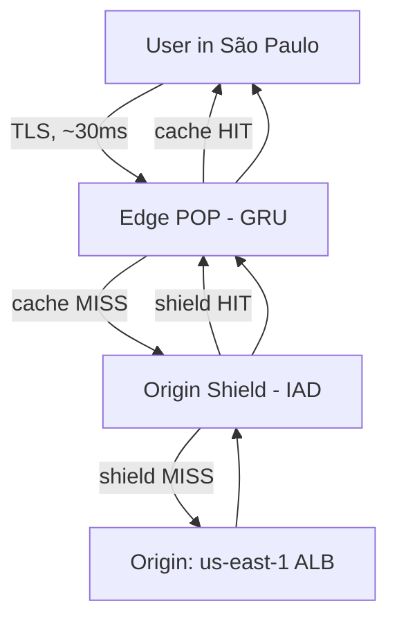
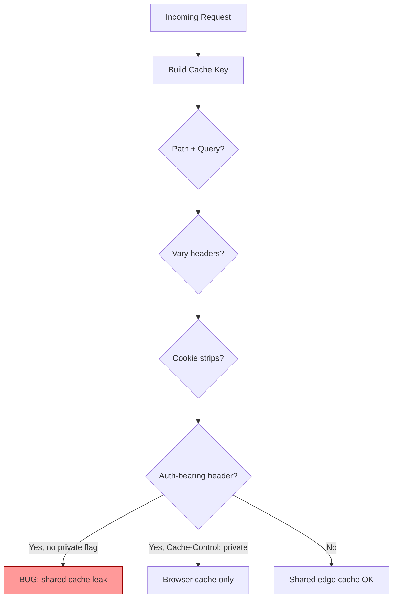
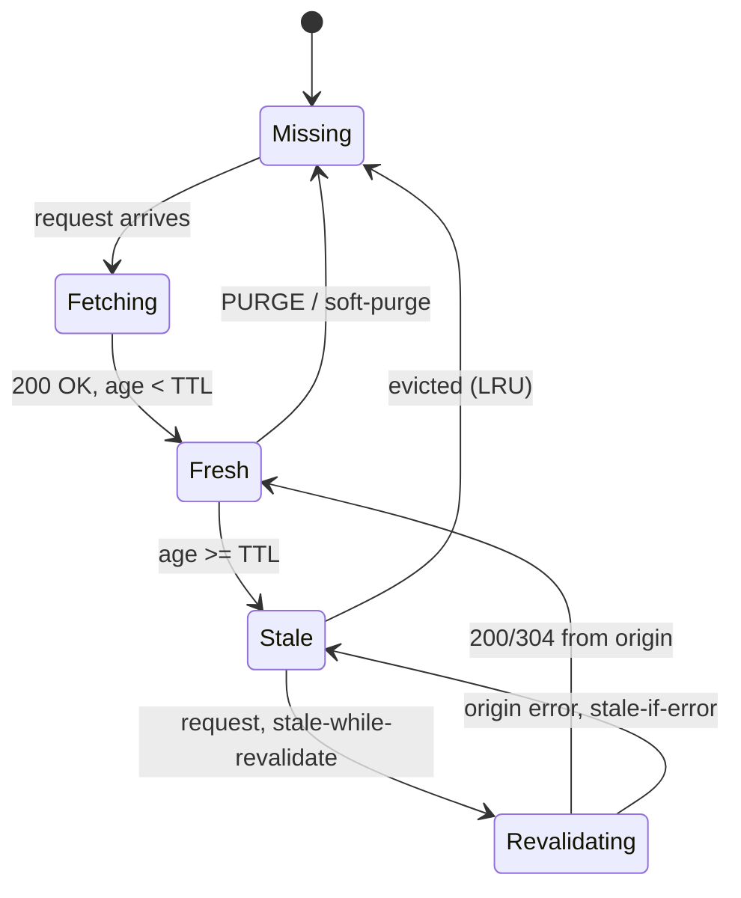
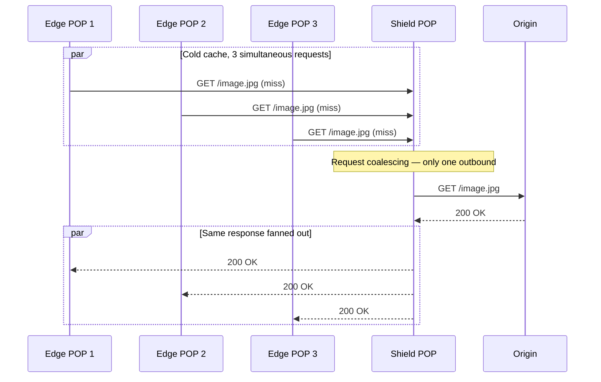

# CDN (Content Delivery Network)

## Why This Exists

**Problem.** A user in São Paulo requests a 2 MB JS bundle from your origin in `us-east-1`. RTT is ~180 ms, TLS handshake adds another round-trip, and the TCP slow-start window means the bundle takes 8–12 round-trips to arrive. p99 page load is over 4 seconds. Meanwhile, your origin handles every request — when a Reddit post drives 50k RPS, your fleet melts. And when you finally cache aggressively, one engineer adds an `Authorization` header without thinking about cache keys, and User A starts seeing User B's account balance.

**Key insight.** A CDN is three things stacked:
1. **A geographically distributed reverse-proxy fleet** (POPs) terminating TLS close to the user.
2. **A shared HTTP cache** that obeys `Cache-Control`, `Vary`, and conditional revalidation.
3. **A programmable edge** (Workers, Compute@Edge, Lambda@Edge, EdgeWorkers) where you can rewrite, route, authenticate, and personalize without a round-trip to origin.

The hard problems are *not* "how do I put files on a CDN" — they're **what is the cache key**, **who is allowed to share a cached response**, **how do I invalidate without thundering herd**, and **what happens when the edge is wrong**.

**Reach for this when:**
- Static or semi-static assets (JS, CSS, images, video segments) served globally.
- API responses that are *cacheable per user* (signed URL with short TTL, or `Cache-Control: private, max-age=N`).
- Origin shield is needed to absorb thundering herd after a deploy or cache flush.
- You need TLS termination, DDoS mitigation, bot management, WAF at the edge.
- Personalization that fits in headers/cookies (A/B test bucket, locale) — solve at the edge with Workers, not at origin.
- ESI / edge-side composition for slow-changing page chrome with fast-changing fragments.

**Don't reach for this when:**
- Truly per-request dynamic content with no temporal locality (e.g. real-time stock quotes, chat messages) — the edge becomes a pure proxy with no cache benefit, and you pay edge egress + a network hop.
- Strongly consistent reads (banking ledger, inventory at checkout) — even 5 s of staleness causes "duplicate charges" or oversold SKUs.
- Internal-only traffic where the latency budget is measured in microseconds and TLS termination at edge adds more than it saves.
- Compliance regimes that require all data to traverse one jurisdiction (some financial / healthcare workloads) — verify your CDN's data-residency story first.

---

## Diagrams

### Request flow with origin shield



The shield exists because **without it**, every edge POP that misses fetches from origin. With 200 POPs and a fresh cache, one viral asset = 200 origin fetches. With shield, all misses funnel through one POP — origin sees ~1 fetch.

### Cache key decision



### Cache state machine (per object, per POP)



---

## Cache keys: the most-broken thing

The cache key determines **who shares this cached response**. Every CDN builds a key from some subset of:
- Method + scheme + host + path
- Query string (all? whitelist? sorted?)
- Selected headers (`Vary`, custom)
- Selected cookies
- Device class / TLS version (sometimes)

**Default behaviors differ wildly across vendors.** This is where bugs live.

### Vary headers — the "we share unless you say otherwise" rule

```http
HTTP/1.1 200 OK
Content-Type: application/json
Cache-Control: public, max-age=300
Vary: Accept-Encoding, Accept-Language
```

This response will be cached *separately* per `(Accept-Encoding, Accept-Language)` tuple. Without `Vary: Accept-Encoding`, a gzipped response can be served to a client that didn't send `Accept-Encoding: gzip` — broken page.

**Anti-pattern: `Vary: User-Agent`.** There are millions of distinct UA strings. Cache hit ratio collapses to near zero. If you need device-class branching, normalize at the edge first (mobile/tablet/desktop) and `Vary` on a normalized header, or use vendor device-detection.

**Anti-pattern: `Vary: Cookie`.** Same problem — every session has a unique cookie. You'll cache one entry per user. If only a subset of cookies matters, strip the rest at the edge before computing the key.

### Cloudflare cache keys (custom rules)

```yaml
# Cloudflare Cache Rules - normalize and strip before keying
cache_rules:
  - name: api-public
    expression: 'http.request.uri.path matches "^/api/v1/public/"'
    cache_key:
      include_query_string:
        - product_id
        - locale
      sort_query_string: true
      ignore_other_query_params: true
      headers:
        include: ["X-Locale-Bucket"]   # already normalized by a Worker
      cookies:
        include: ["ab_bucket"]          # not session_id, not auth_token
```

The contract: the response body is identical for all (path, product_id, locale, X-Locale-Bucket, ab_bucket) tuples. If anything else affects the response — **you have a bug waiting to happen**.

### Fastly VCL — explicit and auditable

```vcl
sub vcl_hash {
  # Fastly: build the cache key explicitly. Anything not added here is ignored.
  set req.hash += req.url;
  set req.hash += req.http.host;

  # Normalize Accept-Encoding to {gzip, br, identity} before hashing.
  if (req.http.Fastly-Orig-Accept-Encoding ~ "br") {
    set req.hash += "br";
  } else if (req.http.Fastly-Orig-Accept-Encoding ~ "gzip") {
    set req.hash += "gzip";
  } else {
    set req.hash += "identity";
  }

  # A/B bucket cookie, not the session.
  if (req.http.Cookie:ab_bucket) {
    set req.hash += req.http.Cookie:ab_bucket;
  }

  return(hash);
}
```

VCL forces you to be explicit. CloudFront and Cloudflare default to "use everything in Vary" which is safer-by-default but easier to hide bugs in.

---

## Private vs shared cache

The HTTP spec separates **shared caches** (CDN, corporate proxy) from **private caches** (browser).

```http
# Shared OK — anyone can cache, 5 minutes.
Cache-Control: public, max-age=300

# Browser only — CDN must not store.
Cache-Control: private, max-age=60

# Don't cache anywhere.
Cache-Control: no-store

# Cache but always revalidate before use.
Cache-Control: no-cache
# or equivalently:
Cache-Control: max-age=0, must-revalidate
```

**The bug that bites everyone**: an authenticated endpoint returns user-specific data without `Cache-Control: private`. Browser is fine. CDN happily serves User A's response to User B because the cache key didn't include the auth context.

```python
# Flask — defensive defaults for an authenticated endpoint
from flask import Flask, jsonify, request, make_response

app = Flask(__name__)

@app.route("/api/account/balance")
def balance():
    user = authenticate(request)
    body = {"user_id": user.id, "balance_cents": user.balance_cents}
    resp = make_response(jsonify(body))
    # Belt and suspenders:
    # 1. private — CDN/proxies must not store.
    # 2. no-store on shared layer — even if some intermediate ignores `private`.
    # 3. Vary: Authorization — if anything *does* cache, key on the credential.
    resp.headers["Cache-Control"] = "private, no-store, max-age=0"
    resp.headers["Vary"] = "Authorization, Cookie"
    return resp
```

**Edge bypass for authenticated requests** — most CDNs let you say "if `Authorization` header is present, do not cache, do not even check the cache":

```yaml
# CloudFront cache policy (origin request policy)
behaviors:
  - path_pattern: /api/account/*
    cache_policy: CachingDisabled
    origin_request_policy: AllViewerExceptHostHeader
    # Forwards Authorization to origin, never tries to cache.
```

---

## Cache hierarchy: edge → shield → origin

A naïve CDN is one tier of POPs. Production CDNs are multi-tier:

```
[browser cache] → [edge POP, ~200 globally] → [origin shield, 1 per region] → [origin]
```

### Why origin shield matters

Without shield, after a `PURGE` or a deploy that invalidates content:
- 200 POPs cold-cache simultaneously.
- Each POP fetches from origin.
- Origin sees a 200x burst.
- Origin chokes, returns 5xx, cache fills with errors, user sees errors.

This is the **CDN thundering herd**. Origin shield collapses the fan-in: misses from any POP go through *one* designated POP, which dedupes them.



CloudFront calls this **Origin Shield**. Cloudflare has **Tiered Cache** (and its more aggressive **Argo Smart Routing** add-on). Fastly has **Shielding**. Akamai has **Tiered Distribution**.

**Single-flight at the POP level too.** Within a single POP, multiple in-flight requests for the same key should collapse to one origin fetch. Cloudflare and Fastly do this by default; verify before assuming.

### `stale-while-revalidate` and `stale-if-error`

These are your friends — they let the CDN serve a slightly old response *immediately* while refreshing in the background, instead of blocking the user on origin.

```http
Cache-Control: public, max-age=60, stale-while-revalidate=300, stale-if-error=86400
```

- For 60 s, response is fresh.
- For the next 300 s, serve stale + kick off a background refresh.
- If origin is down, serve stale for up to 24 h.

This single header turns a "origin sneezes, all users see 5xx" outage into a "users see 5-minute-old data while we recover."

---

## Dynamic content at the edge

The 2018-2024 evolution: edges stopped being dumb caches and became **programmable runtimes**.

| Vendor | Runtime | Model |
|---|---|---|
| Cloudflare | Workers | V8 isolates, JS/TS/WASM, ~50 ms CPU/req |
| Fastly | Compute@Edge | WASM, Rust/JS/Go/AssemblyScript |
| CloudFront | Lambda@Edge / CloudFront Functions | Lambda (any) / lightweight JS |
| Akamai | EdgeWorkers | JS, V8 isolates |

**What lives at the edge:**
- A/B test bucketing (read cookie, set header that's part of cache key).
- Geolocation routing.
- Auth token validation (JWT verify) → reject early without origin hop.
- HTML rewriting / personalization injection.
- Image transformation.
- WAF / bot rules.

**What does NOT live at the edge:**
- Anything needing strong consistency (use origin or a regional service).
- Long-running compute (Workers cap at ~30s wall time, CPU budgets are tight).
- Direct database access except via narrow gateways (D1, Durable Objects, KV — eventually consistent).

### Cloudflare Worker — A/B bucket assignment with cacheable variant

```typescript
// A/B bucket assigned at edge. Cache key includes the bucket so each variant
// is cached independently. Origin sees X-Variant header and serves accordingly.
export default {
  async fetch(req: Request, env: Env, ctx: ExecutionContext): Promise<Response> {
    const url = new URL(req.url);

    // 1. Read or assign bucket.
    let bucket = parseCookie(req.headers.get("Cookie"))?.["ab_bucket"];
    let setBucketCookie = false;
    if (!bucket) {
      bucket = Math.random() < 0.5 ? "A" : "B";
      setBucketCookie = true;
    }

    // 2. Forward to origin with bucket header. Cache key (configured in
    //    dashboard) includes X-Variant, so A and B cache separately.
    const originReq = new Request(req, {
      headers: { ...Object.fromEntries(req.headers), "X-Variant": bucket },
    });

    const cache = caches.default;
    const cacheKey = new Request(url.toString() + `?_v=${bucket}`, originReq);

    let resp = await cache.match(cacheKey);
    if (!resp) {
      resp = await fetch(originReq);
      // Edge-side TTL only; origin's Cache-Control wins for browsers.
      const cacheable = new Response(resp.body, resp);
      cacheable.headers.set("Cache-Control", "public, max-age=300, s-maxage=300");
      ctx.waitUntil(cache.put(cacheKey, cacheable.clone()));
      resp = cacheable;
    }

    // 3. Stamp the cookie on first visit so the assignment sticks.
    if (setBucketCookie) {
      resp = new Response(resp.body, resp);
      resp.headers.append("Set-Cookie", `ab_bucket=${bucket}; Path=/; Max-Age=2592000; SameSite=Lax`);
    }
    return resp;
  },
};
```

### Fastly Compute@Edge — JWT verification at edge

```rust
use fastly::http::{Method, StatusCode};
use fastly::{Error, Request, Response};
use jsonwebtoken::{decode, DecodingKey, Validation};

const JWKS_PUBKEY_PEM: &[u8] = include_bytes!("./jwt_pub.pem");

#[fastly::main]
fn main(req: Request) -> Result<Response, Error> {
    // Reject unauthenticated traffic at edge — origin never sees it.
    let token = req
        .get_header_str("Authorization")
        .and_then(|h| h.strip_prefix("Bearer "))
        .ok_or_else(|| ())
        .map_err(|_| Error::msg("missing bearer"));

    let token = match token {
        Ok(t) => t,
        Err(_) => return Ok(Response::from_status(StatusCode::UNAUTHORIZED)),
    };

    let key = DecodingKey::from_rsa_pem(JWKS_PUBKEY_PEM)?;
    let mut v = Validation::new(jsonwebtoken::Algorithm::RS256);
    v.set_audience(&["api.example.com"]);

    if decode::<serde_json::Value>(token, &key, &v).is_err() {
        return Ok(Response::from_status(StatusCode::UNAUTHORIZED));
    }

    // Token good — pass through to origin. Origin trusts the edge's verdict
    // because the edge sets a signed sentinel header (and origin firewall
    // only accepts traffic from Fastly IPs).
    let mut req = req;
    req.set_header("X-Edge-Verified", "1");
    Ok(req.send("origin")?)
}
```

---

## Signed URLs & signed cookies

Goal: serve **private content** through a shared CDN cache without leaking it to the wrong user, and without an origin round-trip per request.

### How it works

1. Application server generates a URL like `https://cdn.example.com/private/video.mp4?Expires=1717000000&Signature=...&KeyId=...`.
2. The signature is HMAC (or RSA) over (path + expiry + optional IP/policy), keyed by a secret known to both your app and the CDN.
3. CDN verifies the signature at edge. Invalid or expired → 403, never reaches origin.
4. The URL itself is the auth token. **TTL of the signature should be much shorter than the cache TTL of the asset.** If a URL leaks, the leak window equals the signature TTL.

### CloudFront signed URL (canned policy)

```python
# Generate a CloudFront signed URL valid for 5 minutes.
import datetime
import rsa
import base64
from urllib.parse import quote_plus

def cf_sign(url: str, key_pair_id: str, private_key_pem: bytes, expire_seconds: int = 300) -> str:
    expires = int((datetime.datetime.utcnow() + datetime.timedelta(seconds=expire_seconds)).timestamp())
    policy = f'{{"Statement":[{{"Resource":"{url}","Condition":{{"DateLessThan":{{"AWS:EpochTime":{expires}}}}}}}]}}'
    private_key = rsa.PrivateKey.load_pkcs1(private_key_pem)
    sig = rsa.sign(policy.encode("utf-8"), private_key, "SHA-1")  # CloudFront uses SHA-1 for canned policies
    sig_b64 = base64.b64encode(sig).decode().translate(str.maketrans("+=/", "-_~"))
    return f"{url}?Expires={expires}&Signature={sig_b64}&Key-Pair-Id={key_pair_id}"
```

### Failure modes
- **Signature TTL too long.** A 24-hour signed URL effectively means the asset is public to anyone who scrapes a referrer log.
- **Cache key includes the signature.** Now every signed URL is a unique cache entry — cache hit ratio = 0. Configure the CDN to **strip signature query params from the cache key** but verify them in a separate phase.
- **Forgetting to bind to user / IP.** If your threat model includes "User A shares a link with User B," include the IP or a per-user nonce in the policy. Note that mobile clients have unstable IPs.

---

## ESI (Edge Side Includes)

ESI is a markup language (Akamai/W3C, ~2001) that lets the edge assemble a page from cached fragments with different TTLs.

```html
<!-- index.html — cached at edge for 1 hour -->
<html>
  <body>
    <header>
      <esi:include src="/fragments/nav" />
    </header>
    <main>
      <esi:include src="/fragments/article/12345" />
    </main>
    <aside>
      <!-- Per-user, never cached at shared layer -->
      <esi:include src="/fragments/cart-summary" />
    </aside>
  </body>
</html>
```

Each fragment has independent TTL: nav (24h), article (1h), cart-summary (no-cache, fetched per request). The edge fetches them in parallel (or serves from cache) and stitches the response.

**State of ESI in 2025:**
- **Akamai** — full support, still widely used.
- **Fastly** — supports a subset via VCL `esi`.
- **CloudFront** — does NOT support ESI; you implement equivalent in Lambda@Edge.
- **Cloudflare** — does NOT support ESI; implement in Workers via `HTMLRewriter`.
- **Varnish** — full support (the pattern's spiritual home).

For greenfield, prefer **Workers + HTMLRewriter** or server-side rendering with fragment caching — ESI's XML-ish syntax and per-fragment cookie/header semantics get hairy fast.

### Cloudflare Workers replacement using HTMLRewriter

```typescript
class FragmentInjector {
  constructor(private fragmentUrl: string, private ctx: ExecutionContext) {}
  async element(el: Element) {
    const r = await fetch(this.fragmentUrl, { cf: { cacheTtl: 60 } });
    const html = await r.text();
    el.replace(html, { html: true });
  }
}

export default {
  async fetch(req: Request, env: Env, ctx: ExecutionContext): Promise<Response> {
    const origin = await fetch(req);
    return new HTMLRewriter()
      .on("nav-placeholder", new FragmentInjector("https://origin.example.com/frag/nav", ctx))
      .on("cart-placeholder", new FragmentInjector("https://origin.example.com/frag/cart", ctx))
      .transform(origin);
  },
};
```

---

## Vendor cheat sheet

| Concern | Cloudflare | Fastly | CloudFront | Akamai |
|---|---|---|---|---|
| Cache config model | Page Rules / Cache Rules (declarative) | VCL (imperative) + config UI | Cache/Origin Request Policies | Property Manager (declarative tree) |
| Programmable edge | Workers (V8 isolates) | Compute@Edge (WASM) | Lambda@Edge + CF Functions | EdgeWorkers (V8) |
| Cold-start | ~0 ms (isolates) | ~5 ms (WASM) | Lambda@Edge: 100s of ms; CF Functions: ~0 ms | ~0 ms |
| Origin shield | Tiered Cache, Argo | Shielding (configurable POP) | Origin Shield (per region) | Tiered Distribution |
| ESI | No (use Workers) | Partial (VCL `esi`) | No (use Lambda@Edge) | **Yes**, full |
| Instant purge | ~5 s globally | <150 ms globally | ~60 s globally | ~5 s |
| Soft purge / SWR | Yes | Yes (best in class) | `stale-while-revalidate` honored | Yes |
| Pricing model | Bandwidth + Workers req | Bandwidth + Compute@Edge req | Bandwidth + req + LE invocations | Negotiated, opaque |
| Sweet spot | DDoS, web, ZeroTrust | Real-time control, fintech/news | Native AWS integration | Enterprise / video / largest scale |

**Selection heuristic:**
- **AWS-native shop, S3 origins, ALBs**: CloudFront. Native IAM, OAC for S3, no extra vendor.
- **You purge often and care about latency-to-purge**: Fastly. Sub-200 ms global purge is unmatched.
- **DDoS, bot management, ZeroTrust as part of the deal**: Cloudflare.
- **Live linear video, multi-CDN orchestration, Fortune-100 enterprise**: Akamai.

---

## Trade-offs

| Benefit | Cost |
|---|---|
| p99 drops from 4 s to 200 ms for global users | Debugging is harder — "is it cached? where? in which POP?" |
| Origin RPS drops 10–1000× for cacheable workloads | Cache invalidation is now your hardest distributed-systems problem |
| Free TLS termination, DDoS absorption, WAF | Edge becomes a single point of failure (vendor outages take you down) |
| Programmable edge (Workers etc.) lets you personalize without origin hop | Edge has tight CPU/memory budgets; logic that worked locally may exceed them |
| Signed URLs serve private content through shared cache | Signature TTL is a leak window; rotation and revocation are non-trivial |
| Origin shield collapses thundering herd | Adds one extra hop to every miss — measure shield→origin latency |
| `stale-while-revalidate` masks origin outages | Users may see stale data during outages; some bugs are now invisible |
| Multi-CDN failover is achievable | Cache warming, header normalization, and observability multiply by N |

---

## Common Pitfalls

- **`Vary: User-Agent` or `Vary: Cookie`** — collapses hit ratio. Normalize at the edge, vary on the normalized value.
- **Auth header without `Cache-Control: private`** — User A's response served to User B from a shared cache. Verify with two curl calls from different sessions.
- **Cache key includes the signed URL signature** — every signed URL is unique, so hit ratio = 0%. Configure CDN to strip the signature params from the key but still validate them.
- **TTL = 0 to "force fresh"** — you've accidentally turned the CDN into a pure proxy with origin hop overhead. Use `no-cache` (revalidate) instead, or short max-age + SWR.
- **Surrogate-Control vs Cache-Control confusion** — Fastly/Akamai honor `Surrogate-Control` for edge TTL while letting `Cache-Control` set browser TTL independently. Forgetting one means the wrong layer caches wrong.
- **Purging by URL when content is varied** — `PURGE /foo.json` may only purge the (Accept-Encoding: gzip) variant. Use surrogate keys / cache tags (Fastly, CloudFront via custom logic) and purge by tag.
- **No origin shield on a busy site** — first deploy with cold caches takes origin down. Always enable shield (or its equivalent) before going to scale.
- **Worker memory leak via cache.put on large bodies** — `cache.put(key, response)` consumes the body stream. If you later want to return it, clone first: `cache.put(key, response.clone())` then return the original.
- **Forgetting `Vary: Accept-Encoding`** — gzip response served to a non-gzip client → garbled page. Most CDNs add this implicitly; verify yours does.
- **Cookies in cache key** — even one tracking cookie (like `_ga`) destroys hit ratio. Strip non-essential cookies at the edge before keying.
- **Mixing private and shared cache rules on the same path** — one rule says `private`, another says `public`. Last-rule-wins varies by vendor; test the actual response headers.
- **Long signature TTL on signed URLs** — referrer logs, browser history, and shared screenshots all leak the URL. Keep TTL short (5–15 min for sensitive media); refresh client-side.
- **Edge personalization that ignores the cache key** — Worker reads a cookie and returns different HTML, but cache key doesn't include the cookie → next user gets the wrong personalization. Edge logic and cache key MUST agree.
- **`PURGE` racing in-flight requests** — purge fires, in-flight origin response with old timestamp wins on `Last-Modified`, cache repopulates with stale content. Use `Soft-Purge` + atomic key update.

---

## Decision Table

| Situation | Use | Don't use |
|---|---|---|
| Static assets (JS/CSS/img/video) | CDN with long TTL + immutable content hashing in URLs | Origin direct (you'll burn money and time) |
| Public API responses (rate-limited, same answer for everyone) | CDN with `s-maxage`, surrogate keys, tag-based purge | Cache per user (defeats the point) |
| Authenticated personalized API | Origin direct OR CDN with `Cache-Control: private` only | Shared CDN cache without `private` (leak risk) |
| User-generated media (private) | Signed URLs / signed cookies, short TTL, CDN | Public CDN URLs, ACL-only protection |
| HTML page with mostly-public chrome + per-user widget | ESI (Akamai/Fastly) or Workers HTMLRewriter | Whole-page cache (will be wrong for someone) |
| Real-time price ticker, chat, presence | Direct connection to origin / WebSocket / SSE | CDN cache (no temporal locality) |
| Geolocation routing / WAF | Edge Worker / Lambda@Edge / EdgeWorker | Origin (adds hop, doesn't scale to DDoS) |
| Behind-the-firewall internal tools | Private origin + corporate proxy | Public CDN (overkill, attack surface) |
| Multi-region origin with failover | CDN origin failover + health checks + GeoDNS | Single-origin (CDN is your one-and-only) |
| Frequent invalidation (news, sports scores) | Fastly (sub-200ms purge) or surrogate keys | Slow-purge CDN (Akamai legacy paths, naïve TTL) |
| Cost-sensitive, high egress | Cloudflare (free egress on many tiers) or contract-negotiated Akamai | CloudFront at list price for petabyte egress |
| AWS-native architecture | CloudFront + S3 OAC + Lambda@Edge | Third-party CDN proxying through NAT (egress cost) |

---

## Operational checklist

Before you ship a CDN config to production:

- [ ] Cache key audited per route. For each route, list exactly: path, query params, headers, cookies in the key.
- [ ] `Vary` headers do not include `User-Agent` or session cookies.
- [ ] All authenticated endpoints either have `Cache-Control: private, no-store` or are explicitly excluded from the CDN.
- [ ] Origin shield enabled.
- [ ] Surrogate keys / cache tags wired so you can purge a logical group atomically.
- [ ] `stale-while-revalidate` and `stale-if-error` set on cacheable responses.
- [ ] Signed URL TTLs are short and bound to the right principal.
- [ ] Edge logs (or RUM) flow into your observability stack — you can answer "what % of /foo hit cache, by POP, last hour?"
- [ ] Multi-CDN or DNS failover plan tested at least once (CDN provider outages do happen — Cloudflare 2022, Fastly 2021).
- [ ] Test from actual far-from-origin geographies (synthetic monitoring from 3+ continents).

---

## References

- IETF — RFC 9111 (HTTP Caching, replaces RFC 7234) — https://www.rfc-editor.org/rfc/rfc9111
- IETF — RFC 5861 (HTTP Cache-Control: stale-while-revalidate, stale-if-error) — https://www.rfc-editor.org/rfc/rfc5861
- W3C / Akamai — ESI Language Specification 1.0 — https://www.w3.org/TR/esi-lang/
- AWS — CloudFront Developer Guide — https://docs.aws.amazon.com/AmazonCloudFront/latest/DeveloperGuide/Introduction.html
- AWS — Origin Shield in CloudFront — https://docs.aws.amazon.com/AmazonCloudFront/latest/DeveloperGuide/origin-shield.html
- AWS Builders' Library — Caching challenges and strategies — https://aws.amazon.com/builders-library/caching-challenges-and-strategies/
- Cloudflare — Cache Rules and Cache Keys — https://developers.cloudflare.com/cache/how-to/cache-rules/
- Cloudflare — Tiered Cache — https://developers.cloudflare.com/cache/how-to/tiered-cache/
- Cloudflare — Workers Runtime APIs — https://developers.cloudflare.com/workers/runtime-apis/
- Fastly — VCL Reference — https://www.fastly.com/documentation/reference/vcl/
- Fastly — Compute@Edge documentation — https://www.fastly.com/documentation/guides/compute/
- Fastly — Shielding — https://www.fastly.com/documentation/guides/concepts/shielding/
- Akamai — EdgeWorkers — https://techdocs.akamai.com/edgeworkers/docs
- Mozilla MDN — HTTP caching — https://developer.mozilla.org/en-US/docs/Web/HTTP/Caching
- Mozilla MDN — Vary header — https://developer.mozilla.org/en-US/docs/Web/HTTP/Headers/Vary
- Pat Helland — "Immutability Changes Everything" (CIDR 2015) — https://www.cidrdb.org/cidr2015/Papers/CIDR15_Paper16.pdf
- Google SRE Workbook — "Managing Load" ch. 11 — https://sre.google/workbook/managing-load/
- DDIA — Kleppmann — ch. 5 (Replication) and ch. 11 (Stream Processing) for cache-invalidation framing
- Varnish — Cache documentation, ESI guide — https://varnish-cache.org/docs/

---

## See Also

- [../caching/](../caching/) — application-layer caches, Redis/Memcached, write-through vs write-around, cache stampede
- [../tail-latency/](../tail-latency/) — p99 budgets, where to spend ms
