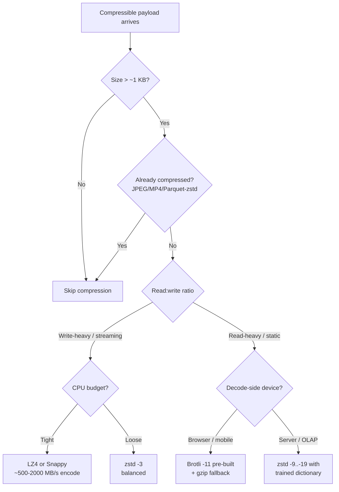
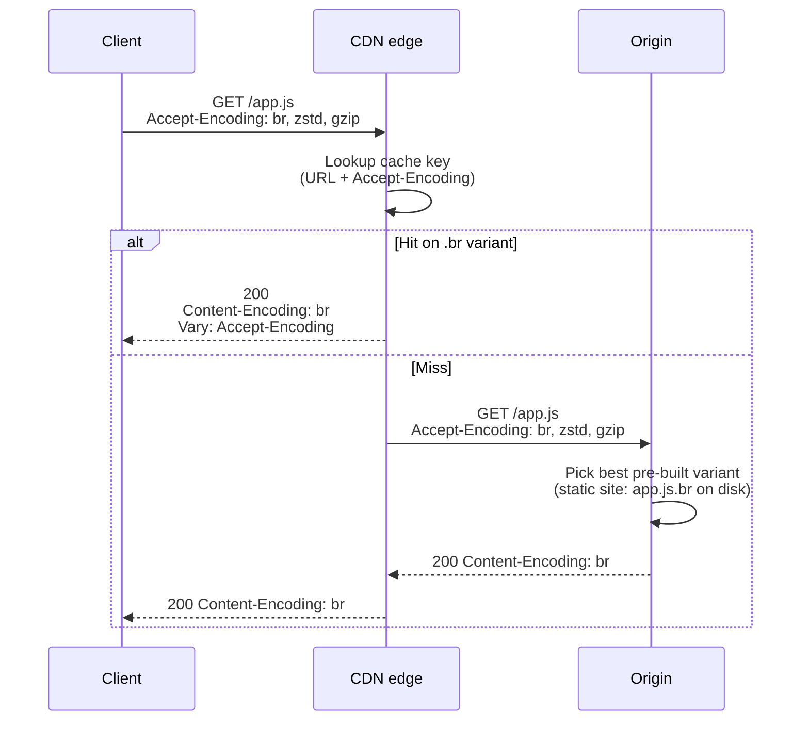
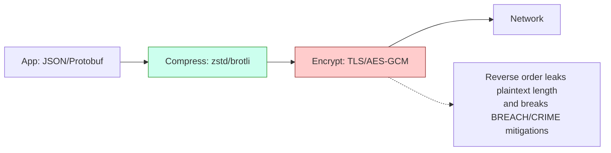

# Compression

## Why This Exists

**Problem.** Bandwidth is expensive, latency is dominated by bytes-on-wire on tail networks, and storage scales linearly with raw size. Naive choices — defaulting to gzip everywhere, leaving compression off, or cranking levels to max — cost real money and tail latency. The wrong codec for the wrong shape of data either burns CPU for no ratio gain or saves bytes you didn't need at the cost of p99.

**Key insight.** Compression is a **three-way trade between ratio, encode CPU, and decode CPU** — and decode is usually asymmetric (much cheaper than encode). The right codec depends on (a) read/write ratio, (b) whether the producer or consumer is CPU-bound, (c) whether the payload is already compressed, and (d) whether you can amortize a dictionary. There is no universally best codec; there are five or six codecs that each dominate a different region of that space.

**Reach for this when:**
- Designing an HTTP/RPC layer and choosing `Accept-Encoding` defaults.
- Building a data lake / OLAP store and picking page or column compression.
- Streaming logs/metrics over the network where throughput matters more than ratio.
- Serving static assets via CDN and weighing pre-compressed (`.br`, `.zst`) artifacts.
- Egress bills, mobile time-to-interactive, or storage cost dashboards lit up.

**Don't reach for this when:**
- Payload is already compressed (JPEG, PNG, MP4, Opus, Parquet+zstd, gzip-on-disk). Re-compressing wastes CPU and may slightly *grow* output.
- Payload is tiny (<~150 bytes for HTTP). Header + dictionary overhead dominates; many CDNs skip compression below ~1 KB.
- You're CPU-bound and bandwidth-rich (intra-AZ, 100 Gbps fabric). LZ4/Snappy or no compression often wins.
- The data is encrypted upstream of compression. Encrypted bytes look random — compress *before* encrypting, never after.

## Diagrams

### Codec landscape (ratio vs throughput)



### HTTP content-encoding negotiation



### Where compression sits in the stack (and where it must NOT)



## The Codecs (What Actually Matters)

### gzip (DEFLATE, RFC 1952, 1996)
- **Strengths:** Universal — every browser, every HTTP client, every Unix tool. Stable wire format. Reasonable ratio.
- **Weaknesses:** Slow encode at high levels, mediocre ratio vs modern codecs, single-threaded reference impl.
- **Levels:** 1 (fast) – 9 (max). Level 6 is the default; level 9 rarely justifies the CPU cost over level 6 (~1-3% better ratio, 3-5x slower).
- **Throughput (single core, x86):** ~50-150 MB/s encode, ~300-500 MB/s decode.
- **Use when:** You need universal compatibility and nothing else. Default fallback for HTTP, log archiving when consumers are arbitrary.

### Brotli (RFC 7932, Google 2015)
- **Strengths:** Best ratio for text/HTML/JS/CSS at high levels (level 11). Ships a 120 KB **static dictionary of common web tokens** (`<html>`, `function`, etc.) — gives small payloads a head start no other codec has.
- **Weaknesses:** Encode at level 11 is *very* slow (~1-5 MB/s). Decode is fast (~300-500 MB/s) but slower than gzip decode in some implementations.
- **Levels:** 0 (fast) – 11 (max). For static assets, **always use 11**. For dynamic, level 4-5 beats gzip-6 on both ratio and speed.
- **Use when:** Static web assets served via CDN. Pre-compress at build time (`app.js.br`) and serve the file as-is — never compress brotli-11 on the request path.

### zstd (Zstandard, RFC 8478, Facebook 2016)
- **Strengths:** The Pareto-dominant general-purpose codec circa 2024. Competitive with gzip-6 in ratio at >5x the encode speed. At level 19+ approaches Brotli ratios. **Trainable dictionaries** — train on a sample of your data and small messages compress 2-5x better.
- **Weaknesses:** Newer; not universally supported in browsers until ~2024 (`Content-Encoding: zstd` is now in Chrome 123+, Firefox 126+, but not Safari at time of writing).
- **Levels:** 1–22. Level 3 is the default sweet spot. Negative levels (`--fast=N`) beat LZ4 throughput. Level 19+ is "ultra" — use for write-once archive data.
- **Use when:** Internal RPC, server-to-server, log storage, OLAP page compression, anywhere you control both ends.

### LZ4 (Yann Collet, 2011)
- **Strengths:** Insanely fast encode (~500 MB/s – 2 GB/s) and decode (~3-5 GB/s). Often the only codec that *speeds up* a pipeline because the I/O savings exceed the CPU cost.
- **Weaknesses:** Modest ratio (typically 1.5-2.5x on text, vs 3-4x for gzip).
- **Use when:** In-memory caches (RocksDB, ClickHouse `LZ4`), ephemeral RPC, MySQL InnoDB page compression, anywhere CPU is the bottleneck and you need the compression to be "free."

### Snappy (Google, 2011)
- **Strengths:** Similar profile to LZ4. Battle-tested in BigTable, Cassandra, Hadoop, Kafka.
- **Weaknesses:** LZ4 generally wins on both speed and ratio in modern benchmarks. Snappy persists mainly for legacy compatibility.
- **Use when:** Your stack is already on Snappy (Cassandra, older Kafka topics, Hadoop). Don't *choose* Snappy over LZ4 in greenfield work.

### Honorable mentions
- **xz / LZMA2** — Best ratio of common codecs, but encode is glacial (~1-3 MB/s). Only for one-time archival (Linux distro tarballs). Don't use for HTTP, ever.
- **bzip2** — Obsolete. Slower and worse ratio than zstd in every dimension.
- **deflate (raw)** — Same algorithm as gzip without the gzip header. Sometimes used inside ZIP, PNG, HTTP `Content-Encoding: deflate` (don't — Microsoft/Mozilla disagree on whether it includes zlib wrapper; use `gzip` instead).

## Concrete Numbers (Approximate, Order-of-Magnitude)

These are reproduced from the canonical zstd README benchmark on Silesia corpus, 1 core, Core i7-9700K. **Benchmark on your data before deciding** — JSON, Protobuf, and HTML compress very differently.

| Codec       | Level | Ratio | Encode MB/s | Decode MB/s |
|-------------|-------|------:|------------:|------------:|
| zstd        | 1     |  2.89 |        510  |       1580  |
| zstd        | 3     |  3.17 |        310  |       1500  |
| zstd        | 9     |  3.55 |         51  |       1490  |
| zstd        | 19    |  3.99 |          6  |       1300  |
| brotli      | 1     |  2.70 |        260  |        450  |
| brotli      | 6     |  3.45 |         63  |        430  |
| brotli      | 11    |  4.01 |        0.7  |        430  |
| gzip (zlib) | 1     |  2.74 |         95  |        390  |
| gzip (zlib) | 6     |  3.10 |         32  |        390  |
| gzip (zlib) | 9     |  3.13 |         12  |        390  |
| lz4         | 1     |  2.10 |        720  |       4090  |
| lz4         | 9 (HC)|  2.72 |         33  |       4120  |
| snappy      | —     |  2.07 |        560  |       1790  |

**Read this table this way:** zstd-3 strictly dominates gzip-6 (better ratio AND ~10x faster encode AND ~4x faster decode). Brotli-11 has the best ratio but is unusable on the request path. LZ4 trades ~20-30% ratio for ~3-5x decode speed.

## HTTP Layer

### Request/Response Negotiation

```http
GET /api/v1/feed HTTP/2
Accept-Encoding: zstd, br, gzip
```

Server responds with whichever it picked:

```http
HTTP/2 200
Content-Encoding: zstd
Vary: Accept-Encoding
Content-Type: application/json
```

**Critical:** `Vary: Accept-Encoding` is mandatory if any cache (CDN, proxy, browser) sits in front. Without it, a client requesting gzip will be served a zstd response from cache and fail.

### Pre-compress vs On-the-fly

```nginx
# Nginx — serve pre-built brotli/zstd if present, else gzip on the fly.
# Build step writes app.js, app.js.br, app.js.zst alongside each other.

location ~ \.(js|css|html|svg|json)$ {
    brotli_static  on;          # serves app.js.br if Accept-Encoding: br
    zstd_static    on;          # nginx 1.25+ with ngx_http_zstd_module
    gzip           on;
    gzip_types     application/javascript text/css text/html application/json image/svg+xml;
    gzip_comp_level 5;          # NOT 9 — level 9 burns CPU for ~1% gain
    gzip_min_length 1024;       # don't compress sub-KB responses
    gzip_vary      on;
}
```

**Rule:** Static = pre-compress at the highest level affordable at build time. Dynamic = compress on the fly at a moderate level (gzip-5, zstd-3, brotli-4).

### When the body is already compressed

```nginx
# Don't gzip already-compressed types — wasted CPU, possible 0.1% size *increase*.
gzip_disable "msie6";
# Default exclusions (most modules already do this):
# image/jpeg, image/png, image/gif, image/webp, image/avif,
# video/*, audio/*, application/zip, application/gzip,
# application/x-7z-compressed, font/woff2 (already brotli-compressed inside)
```

WOFF2 fonts deserve special mention: the format already wraps glyphs in a Brotli stream. Enabling brotli on WOFF2 over HTTP makes things *bigger* due to the second-pass overhead.

### TLS, BREACH, and CRIME

The 2012 **CRIME** attack and 2013 **BREACH** attack exploit response compression to leak secrets via observable length changes. Mitigations:

1. Don't compress responses that mix attacker-controlled input with secrets (e.g., a search results page that echoes the query *and* contains a CSRF token).
2. Use length-masking / random padding on sensitive endpoints.
3. Rotate CSRF tokens per request.
4. **Compress before encrypting** — never the reverse. Encrypting first produces high-entropy bytes that won't compress and may leak structure.

## RPC / Streaming

### gRPC

```python
# Python gRPC: gzip is built in; zstd and others via interceptors / channel options.
import grpc

# Server-side default
server = grpc.server(
    futures.ThreadPoolExecutor(max_workers=10),
    compression=grpc.Compression.Gzip,   # or .Deflate, .NoCompression
)

# Per-call override — useful when sending a large request once but
# streaming many small replies that don't compress well.
stub.BigUpload(
    req,
    compression=grpc.Compression.Gzip,
)
```

For internal RPC inside a single VPC, **measure first**. Intra-AZ throughput is often 10-25 Gbps; the marginal byte savings rarely beat the CPU spent. Many shops disable gRPC compression for internal hops and only enable it on the edge.

### Kafka

Kafka producers compress at the **producer** and decompress at the **consumer** (broker stores compressed batches as-is — zero broker CPU). The choice:

| Codec   | Producer CPU | Wire bytes | Storage bytes | Best for                          |
|---------|--------------|------------|---------------|-----------------------------------|
| none    | 0            | high       | high          | Tiny messages, CPU-pegged producer|
| lz4     | low          | medium     | medium        | Default for high-throughput logs  |
| snappy  | low          | medium     | medium        | Legacy / Cassandra-adjacent stacks|
| gzip    | medium       | low        | low           | Ratio-sensitive, throughput OK    |
| zstd    | low-medium   | lowest     | lowest        | Modern default (Kafka 2.1+)       |

```properties
# producer.properties — Kafka 2.1+
compression.type=zstd
# zstd level via Kafka 3.6+ via compression.zstd.level=3 (default)
linger.ms=10            # batch up to 10ms — bigger batches compress 2-5x better
batch.size=131072       # 128 KB — pair with linger.ms; tiny batches kill ratio
```

The single biggest mistake in Kafka compression tuning: **leaving `linger.ms=0`**. Compressing 100-byte messages individually gets ~1.0x ratio; compressing a 100 KB batch gets 4-10x. Pay 10ms of latency, save 80% of disk and network.

## OLAP / Columnar Storage

Column stores compress dramatically better than row stores because adjacent values in a column have low entropy. The codec choice differs from row-oriented systems.

### Parquet

Parquet supports `UNCOMPRESSED`, `SNAPPY`, `GZIP`, `LZO`, `BROTLI`, `LZ4`, `LZ4_RAW`, `ZSTD`. Modern recommendation:

- **`ZSTD` (level 3-5) is the default for new tables.** Better ratio than Snappy, faster decode than gzip.
- **`SNAPPY` for legacy compatibility** with older Hive/Spark/Impala that may not have zstd codecs registered.
- **`LZ4` for ephemeral / cache-tier Parquet** where decode speed dominates.

```sql
-- Spark
CREATE TABLE events (...) USING PARQUET
TBLPROPERTIES ('parquet.compression' = 'ZSTD',
               'parquet.compression.codec' = 'ZSTD',
               'parquet.compression.level' = '3');
```

### ClickHouse / Druid / Pinot

ClickHouse compresses each **column part** independently and supports per-column codecs:

```sql
CREATE TABLE events (
    -- Timestamps: monotonic, narrow range — Delta+ZSTD is huge
    ts          DateTime64(3) CODEC(Delta(8), ZSTD(3)),
    -- Categorical IDs: low cardinality, repeated — LowCardinality+ZSTD
    user_id     UInt64        CODEC(ZSTD(3)),
    country     LowCardinality(String) CODEC(ZSTD(3)),
    -- Free-form text: LZ4 for hot data, ZSTD for cold partitions
    request_uri String        CODEC(LZ4),
    -- Floats: Gorilla / FPC for time-series style data
    cpu_pct     Float32       CODEC(Gorilla, ZSTD(1))
) ENGINE = MergeTree()
ORDER BY (user_id, ts);
```

The **Delta + ZSTD** combo on monotonic columns (timestamps, sequence IDs) is one of the most underused tricks in OLAP — compression ratios of 10-50x are common. **Gorilla** (Facebook 2015 paper) is the right choice for floating-point time series.

### Block size matters

Compression operates on **blocks** (Parquet pages, ClickHouse granules, Iceberg files). Tiny blocks defeat the codec — its dictionary never warms up. Typical sweet spots:

- Parquet page size: 1 MB
- Parquet row group: 128 MB – 512 MB
- ClickHouse `min_compress_block_size`: 65 KB (default)

If your row groups are <16 MB you're paying I/O overhead per group and getting poor ratios. Bigger row groups = better compression and fewer S3 GETs, at the cost of granularity for predicate pushdown.

## Dictionary Compression (zstd's secret weapon)

Tiny messages (HTTP responses, log lines, RPC envelopes, JSON events <1 KB) compress poorly because the codec spends its first KB *learning* the data. zstd lets you **train a dictionary offline** on a corpus and ship it to both encoder and decoder.

```bash
# Train on 10,000 sample messages
zstd --train samples/*.json -o events.dict --maxdict=64K

# Compress with dictionary
zstd -3 -D events.dict event.json -o event.json.zst

# Decompress requires the same dictionary
zstd -d -D events.dict event.json.zst
```

Typical wins: a 200-byte JSON event drops from ~150 bytes (gzip) to ~30-60 bytes (zstd + dict). For high-fan-out systems (mobile clients, IoT) the bandwidth savings dwarf the dictionary distribution cost.

**Operational catch:** dictionaries are versioned data. Build dictionary lifecycle into your deploy pipeline — old clients with old dictionaries must keep working. The convention is to embed a dictionary ID in the framing.

## Trade-offs

| Benefit                                         | Cost                                                          |
|-------------------------------------------------|---------------------------------------------------------------|
| Lower bandwidth bills, faster page load         | CPU on both sides; potential p99 spike during compression     |
| Smaller storage / lower S3 GB-month             | Slower writes; rebuild cost on level changes                  |
| Brotli-11 best web ratio                        | Encode unusably slow — must pre-build, can't compress per-request |
| zstd dictionaries shrink small messages 2-5x    | Dictionary distribution and versioning operational burden      |
| LZ4 "free" speed-up for I/O-bound pipelines     | Ratio 30-50% worse than zstd — wastes bandwidth if you're not I/O-bound |
| Column-level codecs in OLAP                     | More schema knobs, more ways to misconfigure                  |
| HTTP `Content-Encoding` is transparent to apps  | Caches without `Vary: Accept-Encoding` will serve wrong variant |
| Compression hides plaintext from passive observers | Compression *before* encryption can leak via length (BREACH/CRIME) |

## Common Pitfalls

- **Double compression.** Putting gzip in front of an API that returns Parquet-zstd bytes, or compressing pre-compressed images. Output may grow. Audit `Content-Type` exclusions in your reverse proxy.
- **Compressing tiny payloads.** A 200-byte response gzipped with full headers can be *larger* than the original. Most CDNs default to a 1 KB minimum; respect it.
- **Brotli-11 on the request path.** Encode is ~1 MB/s. A 5 MB JS bundle will block a CPU for 5 seconds. Brotli-11 belongs in your build step, not your runtime.
- **gzip level 9 cargo culting.** Level 9 over level 6 is typically <2% ratio gain for 3-5x CPU. Almost always wrong.
- **Forgetting `Vary: Accept-Encoding`.** Cache pollution: a Safari client gets a zstd response cached against Chrome's request. Site silently breaks for half your users.
- **`linger.ms=0` in Kafka producers.** Per-message compression instead of per-batch — ratio collapses to 1.0-1.5x.
- **Compressing already-encrypted bytes.** TLS-encrypted bodies are high-entropy random; compressing them downstream achieves nothing and adds latency.
- **Encrypting then compressing** (the BREACH/CRIME footgun). Always compress *before* encrypting.
- **Ignoring decompression bombs.** A 1 KB malicious zstd file can decompress to 100 GB. Always set a decompression size cap on untrusted input. (Java `GZIPInputStream`, Python `gzip.open`, Go `compress/gzip` — all happily expand bombs unless you wrap in a `LimitReader`.)
- **Per-column codec sprawl in OLAP.** 50 columns each with hand-tuned codecs is unmaintainable. Set a sane default (ZSTD-3) and only override the top 5-10 hot columns where it matters.
- **Re-compressing on every read.** Some systems (older Druid configs, naive caches) decompress and recompress with each pull. Audit the data path; compress once, decompress once.
- **No dictionary versioning.** Rolling out a new zstd dictionary breaks every client still on the old one. Embed dict-IDs and accept N-1 indefinitely.

## Decision Table

| Scenario                                            | Pick                              | Why                                                      |
|-----------------------------------------------------|-----------------------------------|----------------------------------------------------------|
| Static web assets (JS/CSS/HTML/SVG) via CDN         | Brotli-11 pre-built + gzip-6 fallback | Best ratio for text; pre-build amortizes encode cost |
| Dynamic HTTP API responses (JSON)                   | zstd-3 if all clients support, else gzip-5 | Sweet spot of ratio/CPU; gzip is universal floor |
| Images / video / fonts (.woff2 already brotli)      | None                              | Already compressed; further compression wastes CPU      |
| Internal RPC (gRPC, Thrift) inside one VPC          | None or LZ4                       | 25 Gbps fabric — bytes are cheap, CPU is precious        |
| Internal RPC across regions / over VPN              | zstd-3                            | Egress is metered, latency matters                       |
| Kafka topic, high throughput logs                   | zstd or lz4 with `linger.ms>=10`  | Batch-level wins; zstd if disk cost dominates            |
| Hot OLTP table page compression (Postgres, MySQL)   | LZ4                               | Decode latency is in the read path; ratio is secondary   |
| OLAP columnar store (Parquet, ClickHouse)           | zstd-3 default, LZ4 for hot, Delta+zstd for monotonic columns | Read-mostly; deep ratio wins disk + scan cost |
| Cold archival (S3 Glacier, distro tarballs)         | xz/LZMA2 or zstd-19+              | Encode-once, optimize ratio                              |
| Tiny messages over high-fanout network (IoT, mobile)| zstd-3 with trained dictionary    | Dictionary recovers ratio that small payloads lose       |
| Browser → server upload (multipart form)            | None                              | Browsers don't compress request bodies by default        |
| Encrypted-at-rest blob storage                      | Compress, *then* encrypt          | Encrypted bytes look random; can't compress after        |

## References

- **Yann Collet et al. — Zstandard Compression and the application/zstd Media Type — RFC 8478** — https://www.rfc-editor.org/rfc/rfc8478
- **J. Alakuijala, Z. Szabadka — Brotli Compressed Data Format — RFC 7932** — https://www.rfc-editor.org/rfc/rfc7932
- **P. Deutsch — GZIP file format specification version 4.3 — RFC 1952** — https://www.rfc-editor.org/rfc/rfc1952
- **P. Deutsch — DEFLATE Compressed Data Format Specification — RFC 1951** — https://www.rfc-editor.org/rfc/rfc1951
- **zstd benchmark results (canonical numbers above)** — https://github.com/facebook/zstd#benchmarks
- **Squash Compression Benchmark (cross-codec, multiple corpora)** — https://quixdb.github.io/squash-benchmark/
- **Google Brotli benchmark study (Alakuijala et al., 2018) — "Comparison of Brotli, Deflate, Zopfli, LZMA, LZHAM and Bzip2"** — https://github.com/google/brotli/blob/master/c/tools/brotli_decoder_test.cc (paper PDF: https://arxiv.org/abs/1502.06840)
- **CRIME attack (Rizzo, Duong, 2012)** — https://en.wikipedia.org/wiki/CRIME (canonical writeup)
- **BREACH attack (Prado, Harris, Gluck, 2013)** — http://www.breachattack.com/
- **Pelkonen et al. — Gorilla: A Fast, Scalable, In-Memory Time Series Database (VLDB 2015)** — http://www.vldb.org/pvldb/vol8/p1816-teller.pdf
- **Apache Parquet — Compression Codecs documentation** — https://parquet.apache.org/docs/file-format/data-pages/compression/
- **ClickHouse — Column Compression Codecs** — https://clickhouse.com/docs/en/sql-reference/statements/create/table#column-compression-codecs
- **Kafka KIP-110: Add Codec for ZStandard Compression** — https://cwiki.apache.org/confluence/display/KAFKA/KIP-110%3A+Add+Codec+for+ZStandard+Compression
- **MDN — `Content-Encoding` HTTP header** — https://developer.mozilla.org/en-US/docs/Web/HTTP/Headers/Content-Encoding
- **MDN — `Accept-Encoding` HTTP header** — https://developer.mozilla.org/en-US/docs/Web/HTTP/Headers/Accept-Encoding
- **DDIA ch. 3 (Storage and Retrieval) — column compression discussion** — Kleppmann, *Designing Data-Intensive Applications*, O'Reilly 2017
- **Google SRE Workbook ch. 5 (Alerting on SLOs)** — https://sre.google/workbook/alerting-on-slos/ (relevant for measuring p99 impact of compression changes)
- **AWS Builders' Library — "Caching challenges and strategies"** — https://aws.amazon.com/builders-library/caching-challenges-and-strategies/ (compression interplay with cache keys)
- **Cloudflare — "Results of experimenting with Brotli for dynamic web content"** — https://blog.cloudflare.com/results-experimenting-brotli/
- **Dropbox engineering — "Saving capacity with HDD compression in our Magic Pocket"** — https://dropbox.tech/infrastructure/-broccoli--syncing-faster-by-syncing-less

## See Also

- `../caching/` — compression interacts with cache keys via `Vary: Accept-Encoding`
- `../../reliability/observability/` — Gorilla and FPC float compression for time-series
