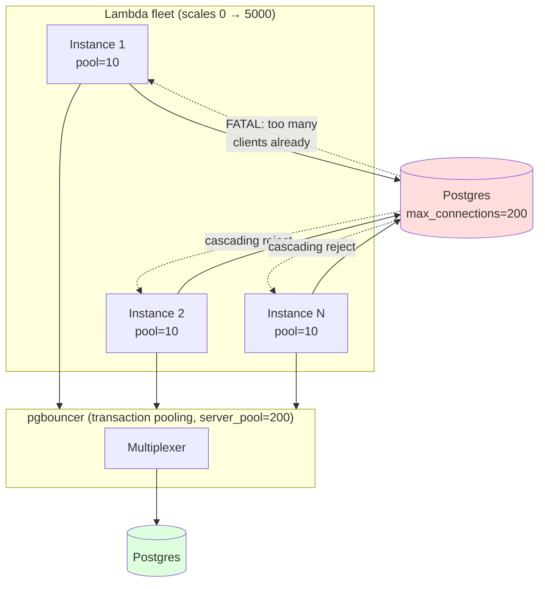
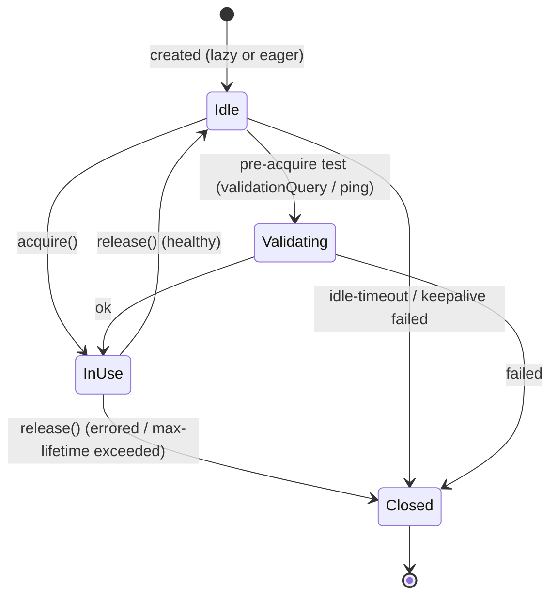
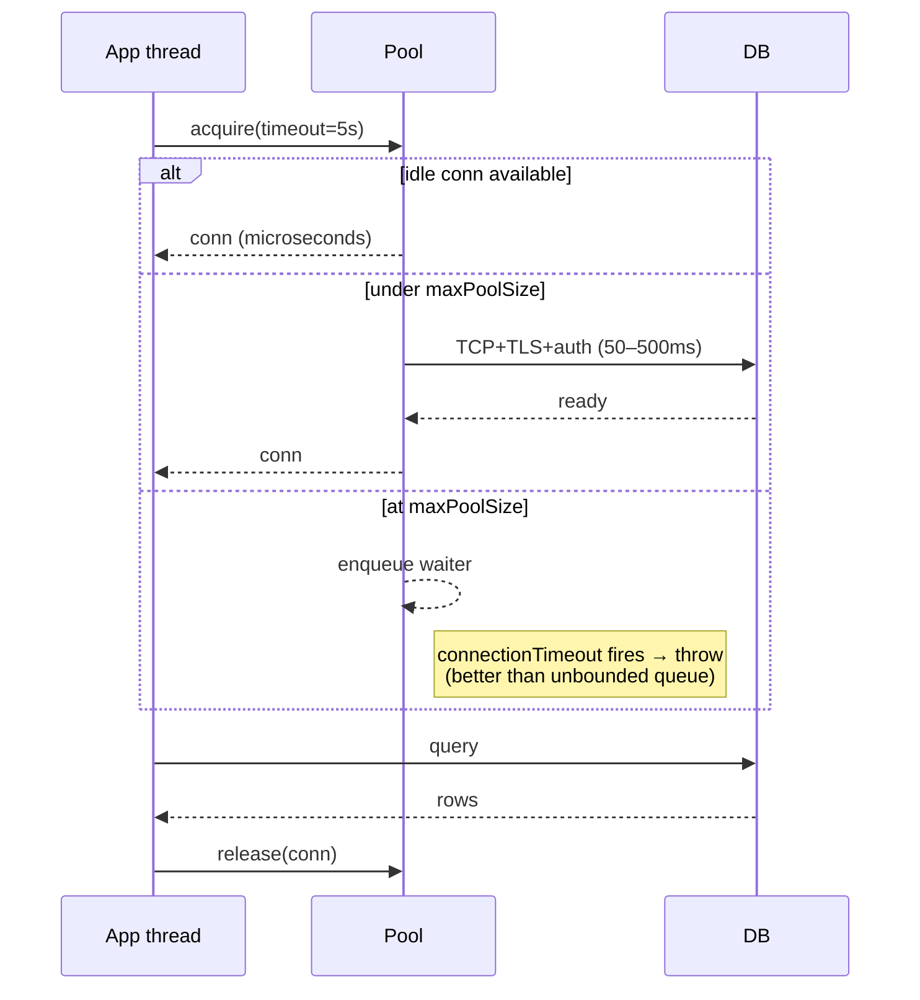
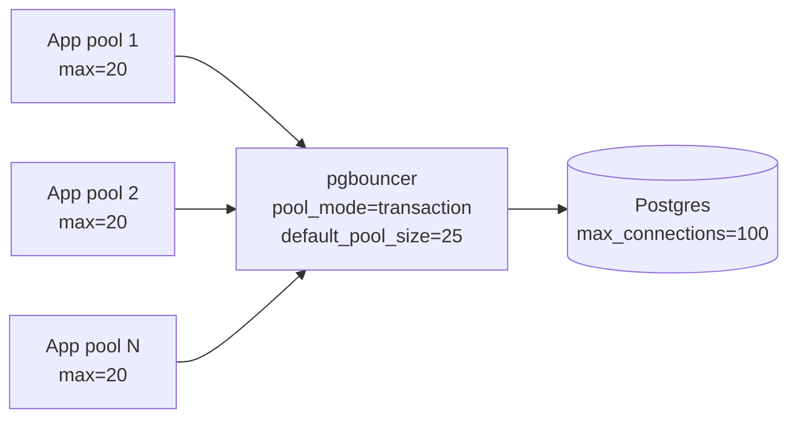

# Connection Pooling

## Why This Exists

**Problem.** Establishing a connection is expensive. A fresh TCP+TLS handshake to a database is 2–5 RTTs plus crypto. A Postgres backend is a forked OS process with ~10 MB of RSS. A new gRPC channel performs DNS resolution, HTTP/2 SETTINGS exchange, and TLS. If every request opens a new connection, you pay this cost on the hot path, you saturate the server's connection budget, and a transient blip turns into a self-inflicted outage when every client reconnects simultaneously.

**Key insight.** A connection pool decouples *request concurrency* from *connection concurrency*. Requests queue for a small, bounded set of long-lived connections. The pool absorbs bursts, smooths handshake cost across many requests, and — critically — gives you a **hard ceiling** on how much load you push at the backend. The ceiling is the feature.

**Reach for this when:**
- Database driver opens a connection per query and `pg_stat_activity` is climbing.
- HTTP client (Python `requests`, Go `http.Client` default, Node `http` without an Agent) is doing TLS for every call.
- gRPC code does `grpc.Dial(...)` inside the handler instead of once at startup.
- Lambda/Cloud Run instances scale to thousands and Postgres hits `max_connections`.
- p99 latency degrades non-linearly with load while CPU on the server is fine — you're queueing on connection setup.
- You see "duplicate charges", "ghost writes", or "stuck transactions" after a deploy that changed connection lifecycle.

**Don't reach for this when:**
- The work is intrinsically long-lived (WebSocket, SSE, long-poll). You want connection-per-client semantics, not pooling.
- You only make one call per process lifetime (a CLI script). The pool overhead exceeds savings.
- The backend is *stateless* and explicitly demands fresh connections per request (rare, but some legacy load balancers behave this way).
- The "pool" is across **forked processes**. Pools must not be inherited across `fork()` — see Pitfalls.

---

## Diagrams

### The connection apocalypse: serverless × stateful DB



The fix is a *shared* pooler (pgbouncer / RDS Proxy / Supabase pooler) that multiplexes thousands of client-side "connections" onto a small fixed set of backend sessions.

### Pool lifecycle



### Acquire path under contention



---

## Sizing the Pool: The Counterintuitive Math

The single biggest mistake is **oversizing**. HikariCP's authors put it bluntly: *"a small pool, with waiting threads in front of it, will outperform a large pool every time."* Why? Because the database is rarely CPU-bound on query parsing — it's bound on disk seeks, lock contention, and context switches between backend processes. Each extra connection adds work per CPU core (PostgreSQL spawns a process per connection; MySQL a thread; both still pay scheduling cost).

**HikariCP's formula** (from the wiki, attributed to the Oracle Real-World Performance team):

```
connections = ((core_count * 2) + effective_spindle_count)
```

For a modern 8-core RDS instance with NVMe (treat spindle ≈ 1):
```
connections ≈ 8 * 2 + 1 = 17
```

That is *per backend instance*, not per app instance. If you have 10 app servers hitting one Postgres, **the total** should be in the 20–50 range, not 10 × 50 = 500.

Other sizing heuristics:

| Inputs | Formula | Notes |
|--------|---------|-------|
| Little's Law | `pool ≥ throughput × avg_hold_time` | If you do 1000 RPS at 5 ms in-DB, you need at least 5 concurrent connections. Add headroom. |
| Brad Fitzpatrick rule | `pool = max(2, p99_concurrent_in_flight)` | Measure, don't guess. |
| Per-app cap | `total_pool_across_apps ≤ 0.7 × server_max_connections` | Leave headroom for admin sessions, replication, monitoring. |

**Rule of thumb sequence:**
1. Start small (10).
2. Measure `pool.wait_time_p99`, `pool.active`, `db.cpu`, `db.disk_wait`.
3. Increase only if waiters are queuing **and** the DB has headroom.
4. Stop the moment DB CPU > 70% or replication lag rises — adding connections past this point makes things slower.

---

## Database Pooling: HikariCP (Java)

HikariCP is the de-facto Java pool — fast, tiny, opinionated. Use these settings as a starting point.

```java
HikariConfig cfg = new HikariConfig();
cfg.setJdbcUrl("jdbc:postgresql://db.internal:5432/orders");
cfg.setUsername("app");
cfg.setPassword(System.getenv("DB_PASSWORD"));

// Sizing — small, fixed, equal min/max for predictable behavior.
// Per HikariCP wiki: avoid letting the pool churn between min and max.
cfg.setMaximumPoolSize(20);
cfg.setMinimumIdle(20);

// Acquire-side timeouts — fail fast, don't queue forever.
cfg.setConnectionTimeout(3_000);    // wait up to 3s for a connection
cfg.setValidationTimeout(2_000);    // health-check timeout

// Lifecycle — recycle connections to dodge stale-NAT and load-balancer quirks.
cfg.setMaxLifetime(30 * 60 * 1000);     // 30 min, must be < DB's idle_in_transaction_session_timeout
cfg.setIdleTimeout(10 * 60 * 1000);     // close idle conns after 10 min
cfg.setKeepaliveTime(5 * 60 * 1000);    // ping idle conns every 5 min (1.4.0+)

// Leak detection — log a stack trace if a connection is held > 10s.
// Worth its weight in gold during incidents. Always on in non-prod, on with caution in prod.
cfg.setLeakDetectionThreshold(10_000);

// Postgres-specific: server-side prepared statement caching.
cfg.addDataSourceProperty("prepareThreshold", "3");
cfg.addDataSourceProperty("preparedStatementCacheQueries", "256");
cfg.addDataSourceProperty("socketTimeout", "30");      // 30s — not 0 (default = forever)
cfg.addDataSourceProperty("loginTimeout", "5");
cfg.addDataSourceProperty("tcpKeepAlive", "true");

HikariDataSource ds = new HikariDataSource(cfg);
```

**Things people get wrong:**
- Setting `maximumPoolSize=200` "to be safe". This is the apocalypse trigger.
- Setting `minimumIdle < maximumPoolSize`. Causes connection churn under bursty load — handshake on the request path is exactly what we wanted to avoid.
- Forgetting `socketTimeout`. The JDBC default is "wait forever" — if the network blackholes, the thread hangs until the pool is exhausted and the app dies.
- Not setting `maxLifetime` shorter than the load balancer's idle TCP timeout (AWS NLB = 350s, ALB = 60s for HTTP, but L4 timeouts vary). Stale conns return `Connection reset` to the next user.

---

## Database Pooling: Postgres + pgbouncer

When N application instances each have their own pool, the *aggregate* cap must still respect Postgres `max_connections`. Past ~200–500 backends, Postgres pays significant scheduler cost. **pgbouncer** sits between app and Postgres and multiplexes thousands of "client connections" onto a small fixed set of "server connections".

```ini
; pgbouncer.ini
[databases]
orders = host=db.internal port=5432 dbname=orders auth_user=pgb_auth

[pgbouncer]
listen_addr = 0.0.0.0
listen_port = 6432
auth_type   = scram-sha-256
auth_file   = /etc/pgbouncer/userlist.txt

; --- Pooling mode: this is the big decision ---
; session     — client owns server-conn for the whole session. Safe but limits multiplexing.
; transaction — server-conn returned at COMMIT/ROLLBACK. Default. Big multiplexing gains.
; statement   — returned after every statement. Forbids multi-statement txns. Rare.
pool_mode = transaction

; --- Capacities ---
max_client_conn          = 5000   ; how many clients pgbouncer accepts
default_pool_size        = 25     ; server-side conns per (db, user) pool
reserve_pool_size        = 5      ; emergency overflow
reserve_pool_timeout     = 3      ; seconds before tapping the reserve

; --- Lifecycle ---
server_idle_timeout      = 600
server_lifetime          = 3600
query_wait_timeout       = 120    ; how long a client may wait for a server conn

; --- Safety ---
ignore_startup_parameters = extra_float_digits,search_path
```

### Transaction pooling — what breaks

When you choose `pool_mode = transaction`, server connections move between clients **between transactions**. That means **anything that lives on the session** is unsafe:

| Feature | Safe in transaction pooling? |
|---|---|
| `SET LOCAL` (txn-scoped) | yes |
| `SET` (session-scoped) | **no** — leaks to the next client |
| `LISTEN/NOTIFY` | **no** |
| Server-side prepared statements (Postgres `PREPARE`) | **no** — not pinned to a session |
| Cursors `WITH HOLD` | **no** |
| Advisory locks held across txns | **no** |
| Temporary tables | **no** |
| `pg_advisory_lock` (session-level) | **no** — use `pg_advisory_xact_lock` |
| Client-side prepared statements (driver does `EXECUTE` each time) | yes |

Most JDBC and asyncpg setups assume server-side prepared statements. To use transaction pooling you typically must **disable** them: `prepareThreshold=0` for pgJDBC, `statement_cache_size=0` for asyncpg. Or use pgbouncer 1.21+ which added experimental support for prepared statements in transaction mode.

### Architecture



Note the inversion: clients see *thousands* of cheap connections to pgbouncer; Postgres sees a *small fixed* number of expensive backend processes.

---

## The Serverless Connection Apocalypse

Stateful DBs were designed for the era of "fixed fleet of long-lived app servers". Lambda, Cloud Run, Cloudflare Workers, etc. break this assumption: each cold-started instance opens its *own* pool, instances live ~15 minutes, and the fleet can scale 0 → 10,000 in seconds. Without intervention you hit `FATAL: too many clients already` and every cold start now sees connection-refused.

**Mitigations, ordered roughly by preference:**

1. **Use a managed pooler.** AWS RDS Proxy, Supabase / Neon poolers, GCP Cloud SQL with PgBouncer sidecar, Aurora's built-in proxy. Lambda → pooler → DB. The pooler holds the small fixed Postgres pool; Lambda gets cheap reused connections via a long-lived pooler endpoint.

2. **Reduce per-instance pool to 1.** In Lambda, concurrency *within an instance* is 1 (one event at a time per execution context). A pool of 1 is correct.

3. **Reuse the pool across invocations.** Initialize the client *outside* the handler so it survives across warm invocations.

```python
# Lambda handler — module scope is reused across warm invocations
import os, asyncpg, asyncio

_pool = None

async def get_pool():
    global _pool
    if _pool is None:
        _pool = await asyncpg.create_pool(
            dsn=os.environ["DATABASE_URL"],
            min_size=1,
            max_size=1,            # single concurrent invocation per Lambda instance
            max_inactive_connection_lifetime=60,
            command_timeout=10,
            statement_cache_size=0,  # required for pgbouncer transaction pooling
        )
    return _pool

def handler(event, context):
    return asyncio.run(_handler(event, context))

async def _handler(event, context):
    pool = await get_pool()
    async with pool.acquire() as conn:
        row = await conn.fetchrow("SELECT id FROM orders WHERE pk = $1", event["pk"])
        return {"id": row["id"]}
```

4. **Use HTTP-based DB APIs for true serverless.** Neon HTTP, PlanetScale's `@planetscale/database`, Supabase REST, Aurora Data API. They sidestep persistent connections entirely; the cost is per-request HTTP overhead and feature loss (no LISTEN/NOTIFY, no transactions across requests).

5. **Cap concurrency at the function.** Lambda reserved concurrency. Cloud Run `max-instances`. The function-level cap is the *real* connection cap when no pooler is involved.

---

## HTTP Keep-Alive and Connection Reuse

A "fresh HTTP request" should not mean "fresh TCP+TLS handshake". HTTP/1.1 introduced `Connection: keep-alive` (default since 1.1). HTTP/2 multiplexes many requests on one connection. Most language defaults are *wrong* for high-throughput service-to-service traffic.

### Go — the surprising defaults

```go
// DON'T: http.DefaultTransport caps MaxIdleConnsPerHost at 2.
// At 1000 RPS to one host, you'll constantly tear down and re-handshake.
client := &http.Client{}

// DO: tune the transport for service-to-service traffic.
tr := &http.Transport{
    MaxIdleConns:        1000,
    MaxIdleConnsPerHost: 100,         // <-- the one most people miss
    MaxConnsPerHost:     200,         // hard ceiling, prevents apocalypse
    IdleConnTimeout:     90 * time.Second,
    TLSHandshakeTimeout: 5 * time.Second,
    ExpectContinueTimeout: 1 * time.Second,
    DialContext: (&net.Dialer{
        Timeout:   3 * time.Second,
        KeepAlive: 30 * time.Second,  // TCP keepalive, not HTTP
    }).DialContext,
    ForceAttemptHTTP2: true,
}
client := &http.Client{Transport: tr, Timeout: 10 * time.Second}
```

**Two keepalives, do not confuse them:**
- *TCP keepalive* (`net.Dialer.KeepAlive`): probes the TCP connection at the kernel level. Detects half-open connections after long idle.
- *HTTP keepalive* (`Connection: keep-alive`): tells the peer "don't close the socket after this response, I'll send another". HTTP/1.1 default.

### Python `requests` — share a Session

```python
# DON'T: each requests.get() opens a new TCP+TLS conn.
for url in urls:
    r = requests.get(url)

# DO: a Session has a per-host connection pool (HTTPAdapter).
import requests
from requests.adapters import HTTPAdapter
from urllib3.util.retry import Retry

session = requests.Session()
adapter = HTTPAdapter(
    pool_connections=20,   # number of urllib3 ConnectionPool objects (host-buckets)
    pool_maxsize=50,       # connections per host
    max_retries=Retry(total=3, backoff_factor=0.2,
                      status_forcelist=[502, 503, 504],
                      allowed_methods={"GET", "HEAD"}),
)
session.mount("https://", adapter)
session.mount("http://", adapter)
```

### Node.js — set an Agent

```js
// undici (the default in fetch()) — a Pool per origin
import { Pool, setGlobalDispatcher } from 'undici';
setGlobalDispatcher(new Pool('https://api.example.com', {
  connections: 50,
  pipelining: 1,
  keepAliveTimeout: 30_000,
  keepAliveMaxTimeout: 60_000,
}));
```

---

## gRPC: Channels Are Pools — Use One

A gRPC `Channel` (or `ClientConn` in Go) **is already a connection pool**. It maintains an HTTP/2 connection to each address resolved from the target name and multiplexes RPCs over them. **Open it once, at startup, and share it.**

```go
// DON'T: opens a new connection (and DNS, TLS, HTTP/2 handshake) per RPC.
func handler(ctx context.Context) {
    conn, _ := grpc.Dial("inventory:50051", grpc.WithTransportCredentials(creds))
    defer conn.Close()
    client := pb.NewInventoryClient(conn)
    client.Get(ctx, req) // first call pays handshake cost
}

// DO: one ClientConn per (target, options), at process startup.
var inventoryConn *grpc.ClientConn

func init() {
    var err error
    inventoryConn, err = grpc.Dial(
        "dns:///inventory:50051",
        grpc.WithTransportCredentials(creds),
        grpc.WithDefaultServiceConfig(`{
          "loadBalancingConfig": [{"round_robin":{}}],
          "methodConfig": [{
            "name": [{"service":"inventory.Inventory"}],
            "retryPolicy": {
              "maxAttempts": 3,
              "initialBackoff": "0.1s",
              "maxBackoff": "1s",
              "backoffMultiplier": 2,
              "retryableStatusCodes": ["UNAVAILABLE"]
            }
          }]
        }`),
        grpc.WithKeepaliveParams(keepalive.ClientParameters{
            Time:                30 * time.Second,
            Timeout:             10 * time.Second,
            PermitWithoutStream: true,
        }),
    )
    if err != nil { log.Fatal(err) }
}
```

**Subtleties:**
- HTTP/2 has a `MAX_CONCURRENT_STREAMS` (often 100). At very high RPS to a *single* backend pod, one channel may bottleneck. The `round_robin` LB policy with multiple resolved addresses fans out across pods.
- For *very* high throughput (>1000 streaming RPCs concurrent to one address), open a small pool of channels — but the typical service-to-service case is one channel per target.
- gRPC keepalive PINGs detect half-open connections; without them a NAT idle-out leaves the channel believing it's healthy until the next RPC times out.

---

## Connection Storms and the Thundering Herd

A "connection storm" is when many clients reconnect simultaneously after a brief disruption — e.g., a DB failover, a deploy, a network blip. The reconnect surge can exceed the steady-state load and prevent recovery, turning a 5-second hiccup into a 30-minute outage.

**Defenses (apply all of them):**

1. **Jittered exponential backoff on reconnect.** Never reconnect at fixed intervals.
   ```python
   # Decorrelated jitter (AWS Architecture Blog, Marc Brooker)
   def backoff(attempt, base=0.05, cap=10.0, prev=None):
       prev = prev if prev is not None else base
       return min(cap, random.uniform(base, prev * 3))
   ```
2. **Bounded acquire timeouts.** A connection acquire that waits forever amplifies the storm — every request piles into the queue. Hikari's `connectionTimeout=3000` causes new requests to fail-fast, freeing the app to shed load.
3. **Pool warming bounded by `slowStartIntervalSeconds`.** Don't open all connections in parallel on startup. RDS Proxy and Envoy support this natively.
4. **Token-bucket rate limit on connection establishment.** At pool startup, open at most N new connections per second.
5. **Circuit breaker on the pool itself.** If acquire failures exceed a threshold, fail-fast for a cooldown rather than queuing.
6. **`SO_REUSEADDR` + sane TIME_WAIT tuning** for high client-side reconnect rates (Linux ephemeral port exhaustion is a real thing — `cat /proc/sys/net/ipv4/ip_local_port_range`).

---

## Trade-offs

| Benefit | Cost |
|--------|------|
| Amortize TCP+TLS handshake across many requests | Long-lived state means stale connections (NAT timeouts, server restarts) — must validate or recycle |
| Hard cap on concurrent backend load | Requests now queue when pool is exhausted → tail-latency moves from "DB" to "pool wait" |
| Predictable resource usage on backend | Misconfiguration (pool too small) becomes a hidden bottleneck invisible to backend metrics |
| Reuse expensive crypto state (TLS sessions, HTTP/2 streams) | Session-bound features (server prepared statements, `SET`, `LISTEN`) leak between users in transaction-pooled mode |
| One pgbouncer can serve thousands of clients | Adds a network hop; pgbouncer is single-threaded — needs HAProxy or `so_reuseport` for >1 core |
| gRPC channel reuse → ~zero per-RPC overhead | One channel can pin to one backend without explicit LB config; misconfigured DNS resolution → no fan-out |
| Pool metrics expose saturation early | Yet another subsystem to monitor (active/idle/waiters/wait-time-p99) |
| Connection-acquire timeout sheds load gracefully | Apps must handle `PoolExhausted` as a first-class error, not a crash |

---

## Common Pitfalls

- **Pool inherited across `fork()`.** A pool initialized in the parent is *shared* by every child after `fork()`. Two children using the same socket → wire-protocol corruption. Frameworks: gunicorn `--preload`, uWSGI lazy-apps, Celery `worker_init`. Fix: re-initialize pools in a post-fork hook (`@post_fork` / `worker_process_init`).
- **`maxLifetime` longer than the LB idle timeout.** AWS NLB closes idle TCP at 350s; if your pool keeps the conn for 30 min, the next user gets `Connection reset by peer` mid-query. Set `maxLifetime < LB idle timeout − safety margin`.
- **No `socketTimeout` / `query_timeout`.** A blackholed network leaves connections wedged. The pool fills up. The app dies. **Always** set a per-statement timeout.
- **Server-side prepared statements + transaction pooling.** Quietly returns the wrong result, or errors with `prepared statement "S_1" does not exist`. Disable client-side prepared-statement caching when fronting pgbouncer in transaction mode.
- **`maxPoolSize` set to "max_connections / num_app_servers" with no headroom.** Replication, monitoring, `psql` debugging, migration tools — they all need connections too. Reserve 20–30% of `max_connections`.
- **Pool size scaled with thread count.** A 200-thread Tomcat with `maximumPoolSize=200`. The threads contend for DB locks; the DB collapses. Pool sizing is independent of app concurrency — that's the whole point.
- **HTTP client recreated per request.** `requests.get(...)` in a hot loop. `http.Client{}` per handler invocation. New `axios` instance per request. Always create at module scope.
- **gRPC `Dial` per RPC.** Spawns DNS+TLS+HTTP/2 handshake every call. Open the `ClientConn` at startup; share via DI.
- **No connection validation.** A connection can be silently dead (server killed it, NAT dropped it). Pre-acquire validation (`SELECT 1`, HTTP HEAD, gRPC keepalive) or a TCP keepalive catches this. Hikari does this automatically since 3.x via JDBC4 `isValid()`.
- **Leak from forgotten `release()`.** A handler returns early on error without closing the borrowed connection. Pool drains. Use try-with-resources / context managers. Set `leakDetectionThreshold` in non-prod.
- **PgBouncer in `session` mode "to be safe".** This eliminates 90% of pgbouncer's value. Use `transaction` mode and audit your code for session-scoped state.
- **Pool sized to handle peak — not p99 in-flight.** Peak RPS is irrelevant. Concurrent in-flight = RPS × hold-time. A pool of 20 at 50ms hold can do 400 RPS.
- **Ignoring HikariCP `awaitingConnection` metric.** This is the leading indicator of misconfiguration. If it's > 0 sustained, either the pool is too small or queries are too slow.

---

## Decision Table

| Situation | Use this | Why |
|----------|----------|-----|
| Java service → Postgres | HikariCP, pool=10–25 per app | Industry standard; tiny, fast, opinionated defaults are sane |
| Many app servers → one Postgres | HikariCP **+** pgbouncer (transaction mode) | App-side pool gives fast acquire; pgbouncer gives aggregate cap |
| Lambda → Postgres | RDS Proxy or pgbouncer; per-instance pool size = 1 | Function fleet can be 1000+; direct connections will exceed `max_connections` |
| Cloudflare Workers → Postgres | Hyperdrive / Neon HTTP / PlanetScale | Workers can't hold persistent TCP; need an HTTP-fronted DB |
| Service-to-service HTTPS at >100 RPS | Tuned `http.Transport` / `requests.Session` / `undici.Pool` | Default per-host idle limits are tiny (often 2) |
| Service-to-service gRPC | One `ClientConn` per (target, options) at startup | Channels are already pools; multiplex over HTTP/2 streams |
| Streaming gRPC at >1k concurrent streams to one backend | Pool of 2–4 channels with distinct keys to defeat sub-channel sharing | HTTP/2 `MAX_CONCURRENT_STREAMS` ceiling |
| Read-mostly workload, OLTP | Separate read pool to replicas | Isolate read-heavy from write-heavy contention |
| Long-running connections (WebSocket, SSE, LISTEN/NOTIFY) | Dedicated client, **not** the pool | Pool semantics break; the conn is for one client's lifetime |
| Connection storm after failover | Jittered backoff + bounded acquire timeout + pool circuit breaker | Without these, recovery never happens |
| Multi-tenant SaaS, per-tenant DB role | pgbouncer with `auth_user` and tenant-bound pool keys | Shared pool would leak tenant identity across requests |
| You can't size the pool empirically | Start at `cores * 2 + 1` per backend instance, measure, adjust | HikariCP wiki rule; don't guess upward |

---

## Operational Metrics to Track

Without these you're flying blind:

- `pool.active` / `pool.idle` / `pool.total` — saturation visibility.
- `pool.pending_acquires` (HikariCP: `awaitingConnection`) — **the leading indicator**. Sustained > 0 means undersized.
- `pool.acquire_wait_p99` — moves from "DB latency" to "pool wait" under saturation.
- `pool.acquire_timeout_count` — should be near zero in steady state.
- `pool.connection_creation_count` rate — high rate = pool churning, raise `minimumIdle` or `maxLifetime`.
- `pool.leak_detection_triggered` — non-zero = a code path forgot to release.
- Backend side: `pg_stat_activity` count per app, `state` distribution, `idle_in_transaction` count (the silent killer).

---

## References

- HikariCP — *About Pool Sizing* — https://github.com/brettwooldridge/HikariCP/wiki/About-Pool-Sizing
- HikariCP — *MySQL / Postgres Configuration* — https://github.com/brettwooldridge/HikariCP/wiki/MySQL-Configuration / https://github.com/brettwooldridge/HikariCP/wiki/Postgres-Configuration
- pgbouncer — Official docs — https://www.pgbouncer.org/config.html
- pgbouncer — Features and pooling modes — https://www.pgbouncer.org/features.html
- PostgreSQL Wiki — *Number of Database Connections* — https://wiki.postgresql.org/wiki/Number_Of_Database_Connections
- AWS — *RDS Proxy: managing connections* — https://docs.aws.amazon.com/AmazonRDS/latest/UserGuide/rds-proxy.html
- AWS Builders' Library — Marc Brooker, *Timeouts, retries, and backoff with jitter* — https://aws.amazon.com/builders-library/timeouts-retries-and-backoff-with-jitter/
- AWS Architecture Blog — *Exponential Backoff And Jitter* (Marc Brooker, 2015) — https://aws.amazon.com/blogs/architecture/exponential-backoff-and-jitter/
- Google SRE Workbook — *Addressing Cascading Failures* — https://sre.google/workbook/addressing-cascading-failures/
- Google SRE Book — *Handling Overload* (ch. 21) — https://sre.google/sre-book/handling-overload/
- Kleppmann — *Designing Data-Intensive Applications* — ch. 8 (The Trouble with Distributed Systems) and ch. 7 (Transactions) for connection-state semantics
- gRPC docs — *Performance best practices* — https://grpc.io/docs/guides/performance/
- gRPC Go — *Client Keepalive* — https://github.com/grpc/grpc-go/blob/master/Documentation/keepalive.md
- gRPC blog — *gRPC on HTTP/2: Engineering a Robust, High-Performance Protocol* — https://grpc.io/blog/grpc-on-http2/
- HTTP/1.1 — RFC 9112 §9.3 (Persistence) — https://www.rfc-editor.org/rfc/rfc9112#name-persistence
- HTTP/2 — RFC 9113 §5.1.2 (Stream Concurrency) — https://www.rfc-editor.org/rfc/rfc9113#name-stream-concurrency
- urllib3 docs — *Pool Manager and Connection Pooling* — https://urllib3.readthedocs.io/en/stable/advanced-usage.html
- undici — *Pool* and *Agent* — https://undici.nodejs.org/#/docs/api/Pool
- Brad Fitzpatrick — *Go's net/http and the case of the missing keep-alives* (Go issue #13801 and related)
- Marc Brooker — *What is the right number of connections?* — https://brooker.co.za/blog/
- Supabase — *Connection management* (pgbouncer + Supavisor) — https://supabase.com/docs/guides/database/connecting-to-postgres
- Neon — *Serverless driver and connection pooling* — https://neon.tech/docs/connect/connection-pooling

---

## See Also

- `../caching/` — when reusing the *result* is cheaper than reusing the connection
- `../../reliability/load-shedding/` — what to do when the pool is exhausted and requests must be dropped
- `../../communication/backpressure/` — coupling pool saturation to upstream queue admission control
- `../../reliability/timeouts/` — `connectionTimeout`, `socketTimeout`, jittered retry, idempotency
- `../../reliability/circuit-breaker/` — wrap pool acquires with a breaker to prevent storms
- `../../reliability/rate-limiting/` — enforce a budget on connection establishment, not just requests
- `../tail-latency/` — accounting for `acquire_wait` in the per-hop budget
- `../use-red-methods/` — the "saturation" signal in RED maps to pool wait time
