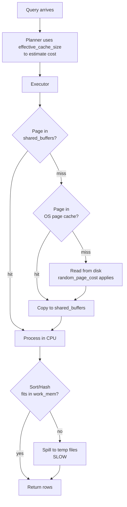
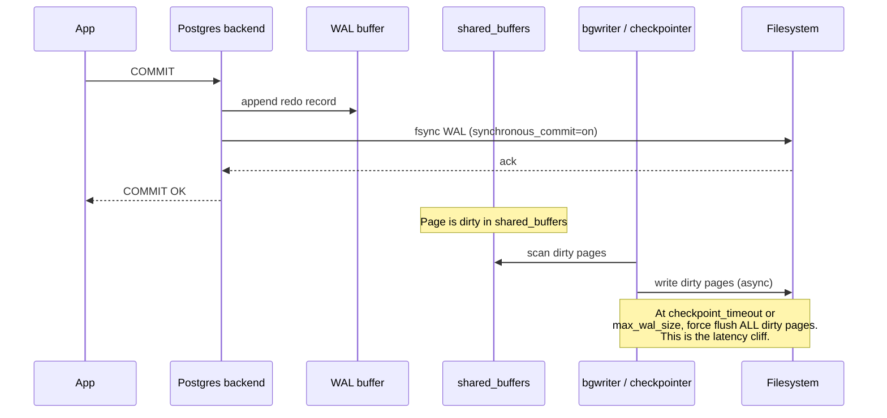

# Database Tuning

## Why This Exists

**Problem.** Default Postgres and MySQL configurations are conservative — they're tuned to *start* on a Raspberry Pi, not to *run* on a 64-core box with 256 GB of RAM and an NVMe array. Out-of-the-box, Postgres uses `shared_buffers = 128MB` and MySQL InnoDB uses `innodb_buffer_pool_size = 128MB`. On a real workload, those defaults produce: cache misses on every join, autovacuum that can't catch up, checkpoint I/O storms, and write amplification that turns a 1 KB UPDATE into a 64 KB disk write.

**Key insight.** Database tuning is **memory budgeting plus durability budgeting**. Every important knob falls into one of those two buckets:

- **Memory budget**: How much RAM do you give the cache (`shared_buffers`, `innodb_buffer_pool_size`), per-query working memory (`work_mem`), and the kernel's hint for OS page cache (`effective_cache_size`)?
- **Durability budget**: How often do you fsync (`flush_log_at_trx_commit`, `synchronous_commit`), how big are your WAL/redo segments (`max_wal_size`, `innodb_log_file_size`), and how aggressively does the background writer flush (`checkpoint_timeout`, `bgwriter_lru_maxpages`)?

Once you internalize that, every tuning decision becomes "do I want more throughput, lower tail latency, or stronger durability — and what am I willing to trade?"

**Reach for this when:**
- p99 latency is spiking but CPU and disk look fine — you're probably hitting buffer pool misses or `work_mem` spills to disk.
- Checkpoints cause periodic latency cliffs every 5 minutes (default `checkpoint_timeout` in Postgres).
- `pg_stat_user_tables.n_dead_tup` keeps climbing — autovacuum is starving.
- InnoDB redo log is full and writers are stalling on `Innodb_log_waits`.
- You see `temp file` log lines in Postgres or `Sort_merge_passes` climbing in MySQL — `work_mem` / `sort_buffer_size` is too small.
- You moved from spinning disks to NVMe and didn't change `random_page_cost` / `innodb_io_capacity`.

**Don't reach for this when:**
- The query plan is wrong. Bad plans dwarf any tuning win. Run `EXPLAIN (ANALYZE, BUFFERS)` first.
- The schema is wrong. No amount of `shared_buffers` saves you from a missing index or an N+1 from the ORM.
- You haven't measured. **Tuning without observability is cargo-cult engineering.** Get `pg_stat_statements`, `auto_explain`, MySQL Performance Schema, or `sys.statements_with_runtimes_in_95th_percentile` working *first*.
- You're at < 10 GB of data. Defaults are fine. Stop.

## Diagrams

### Postgres memory hierarchy



### Write path & checkpoint pressure



## Postgres: the eight knobs that matter

You can ignore 90% of `postgresql.conf`. These eight settings cover almost every real-world tuning case.

### 1. `shared_buffers` — Postgres's own page cache

Rule of thumb: **25% of system RAM** on a dedicated DB host, capped around 40%. Beyond that, you're starving the OS page cache, and Postgres relies on it as a second-tier cache.

```ini
# 64 GB host, dedicated to Postgres
shared_buffers = 16GB         # 25% of RAM
```

**Why not just give it everything?** Postgres uses a clock-sweep replacement algorithm that's less sophisticated than the kernel's. Above ~40% of RAM, double-buffering (page in `shared_buffers` AND in OS cache) wastes memory and TLB.

### 2. `effective_cache_size` — planner hint, not an allocation

This is **not** memory Postgres allocates. It's the planner's estimate of "how much disk page cache is likely available for me across `shared_buffers` + OS cache." It influences index scan vs sequential scan decisions.

```ini
effective_cache_size = 48GB   # 75% of RAM — sum of shared_buffers + likely OS cache
```

Set this too low and the planner thinks index scans will miss cache and chooses seq scans. Set it absurdly high and the planner over-prefers nested-loop index plans that may thrash if memory pressure spikes.

### 3. `work_mem` — per-operation working memory

This is **per-sort-or-hash-node, per-query, per-connection**. A query with three hash joins running on 200 connections can allocate `work_mem * 3 * 200`. This is how people OOM their database.

```ini
work_mem = 16MB               # safe default for OLTP
```

For an analytics workload with few concurrent queries, bump it to 64MB–256MB. For a high-concurrency OLTP system, keep it small and use `SET LOCAL work_mem = '256MB'` inside specific reporting transactions.

**Symptom of `work_mem` too small:** `log_temp_files = 0` (log all temp files) and you see lines like `temporary file: path "base/pgsql_tmp/...", size 134217728`. That's a query spilling to disk.

### 4. `maintenance_work_mem` — for VACUUM, CREATE INDEX, ALTER TABLE

```ini
maintenance_work_mem = 2GB    # 5–10% of RAM, capped around 2 GB
autovacuum_work_mem = 1GB     # if you want autovacuum to use a different value
```

A larger `maintenance_work_mem` lets `VACUUM` track more dead tuples per pass and finish faster. `CREATE INDEX` on big tables benefits dramatically.

### 5. Autovacuum — the silent killer of write-heavy Postgres

Postgres uses MVCC: every UPDATE or DELETE leaves a dead row version that must be vacuumed. If autovacuum can't keep up, you get **table bloat** (queries scan dead tuples), **index bloat**, and eventually **transaction ID wraparound** which forces an emergency vacuum that locks everything.

Defaults are tuned for a small workstation. On a busy server, raise the workers and lower the cost-delay throttle:

```ini
# Autovacuum aggression
autovacuum_max_workers = 6                    # default 3, scale with cores
autovacuum_naptime = 10s                      # default 1min — wake more often
autovacuum_vacuum_scale_factor = 0.05         # default 0.2 — vacuum at 5% bloat, not 20%
autovacuum_vacuum_insert_scale_factor = 0.05  # PG13+ — vacuum after inserts too
autovacuum_analyze_scale_factor = 0.02        # keep stats fresh

# Throttle — defaults are SHIVA-era safe; modern SSDs eat this for breakfast
autovacuum_vacuum_cost_limit = 2000           # default 200
autovacuum_vacuum_cost_delay = 2ms            # default 2ms in PG12+, 20ms before
```

Per-table overrides for hot tables:

```sql
ALTER TABLE orders SET (
  autovacuum_vacuum_scale_factor = 0.01,      -- vacuum at 1% dead tuples
  autovacuum_analyze_scale_factor = 0.01,
  autovacuum_vacuum_cost_limit = 5000
);
```

**Monitor it.** Build a dashboard on `pg_stat_user_tables` showing `n_dead_tup`, `n_live_tup`, and `last_autovacuum`. If `n_dead_tup` climbs unboundedly, autovacuum is losing.

### 6. Checkpoints — the every-5-minutes latency cliff

By default, Postgres triggers a checkpoint every `checkpoint_timeout` (5 minutes) or when WAL hits `max_wal_size`. A checkpoint flushes **all dirty buffers** to disk. With default `checkpoint_completion_target = 0.9`, the flush is spread over 90% of the timeout window — but on a write-heavy system you still see I/O spikes that translate to p99 latency cliffs.

```ini
# Spread checkpoints over more time, less violent flushes
checkpoint_timeout = 15min               # default 5min — fewer, bigger checkpoints
max_wal_size = 16GB                      # default 1GB — let WAL grow before forced checkpoint
checkpoint_completion_target = 0.9       # default 0.9 since PG14
checkpoint_warning = 30s                 # warn if checkpoints are happening too often

# Background writer — flush dirty pages between checkpoints
bgwriter_lru_maxpages = 1000             # default 100
bgwriter_lru_multiplier = 4.0            # default 2.0
bgwriter_delay = 100ms                   # default 200ms
```

**Trade-off:** Larger `max_wal_size` means longer recovery time after a crash (WAL must be replayed). For most OLTP workloads, 8–32 GB is fine — recovery still completes in minutes.

### 7. WAL: compression and writing

```ini
wal_compression = on              # PG14+: lz4 also available; compresses full-page writes
wal_buffers = 64MB                # auto-sized at 1/32 of shared_buffers, capped 16MB by default
synchronous_commit = on           # default — fsync on commit. See below for the dial.
```

`wal_compression` alone can cut WAL volume by 50–70% on workloads with full-page writes (which dominates after each checkpoint when `full_page_writes = on`, which is the default and you should never turn off).

### 8. `synchronous_commit` — the durability dial

This is the single biggest commit-latency knob:

| Setting | Behavior | Latency | Durability |
|---|---|---|---|
| `on` | Wait for WAL fsync to local disk | High | Strong (default) |
| `remote_write` | Wait for replica to write WAL (no fsync) | Medium | Strong + replica liveness |
| `remote_apply` | Wait for replica to apply | Higher | Strongest (read-your-writes from replica) |
| `local` | Local fsync only, no replica wait | High | Strong locally |
| `off` | Don't wait for fsync | **Lowest** | **Last ~200ms can be lost on crash** |

Per-transaction overrides are the killer feature:

```sql
-- High-throughput batch inserts that don't need durability:
BEGIN;
SET LOCAL synchronous_commit = off;
INSERT INTO events_audit ...;
COMMIT;

-- The default stays "on" for the financial transactions.
```

### Cost model for SSDs

If you're on NVMe and you didn't change these, your planner is making 2010-era assumptions:

```ini
random_page_cost = 1.1            # default 4.0, calibrated for spinning rust
seq_page_cost = 1.0
effective_io_concurrency = 200    # default 1, NVMe handles huge queue depth
```

## MySQL InnoDB: the four knobs that matter

InnoDB is more opinionated than Postgres — its key knobs are concentrated.

### 1. `innodb_buffer_pool_size` — the only cache that matters

InnoDB does **not** rely on the OS page cache (in fact, you should set `innodb_flush_method = O_DIRECT` to skip it). The buffer pool is everything: data pages, index pages, undo logs, change buffer, adaptive hash index — all of it lives here.

Rule: **70–80% of system RAM** on a dedicated MySQL host. (Yes, much higher than Postgres's 25% — because no OS page cache double-buffering.)

```ini
innodb_buffer_pool_size = 48G              # 75% of 64 GB host
innodb_buffer_pool_instances = 8           # split into chunks to reduce contention
innodb_buffer_pool_chunk_size = 1G
innodb_flush_method = O_DIRECT             # bypass OS cache; avoids double-buffering
```

**Monitor:** `SHOW GLOBAL STATUS LIKE 'Innodb_buffer_pool_reads%'`. The ratio of `Innodb_buffer_pool_reads` (disk reads) to `Innodb_buffer_pool_read_requests` (logical reads) should be < 0.1%. Higher means your working set doesn't fit and you're paying random I/O.

### 2. `innodb_log_file_size` and `innodb_redo_log_capacity`

The redo log is InnoDB's write-ahead log. Too small and you get checkpoint thrashing (InnoDB can't reuse log space until pages are flushed). Too large and crash recovery is slow.

In MySQL 5.7 / 8.0 (pre-8.0.30):

```ini
innodb_log_file_size = 4G              # default 48M — way too small
innodb_log_files_in_group = 2          # total log = 8G
```

In MySQL 8.0.30+, the redo log is dynamically managed:

```ini
innodb_redo_log_capacity = 8G          # replaces above two settings
```

Symptom of redo log too small: `SHOW ENGINE INNODB STATUS\G` shows "log waits" or `Innodb_log_waits` increases. Writers are stalling because dirty pages aren't being flushed fast enough to free log space.

### 3. `innodb_flush_log_at_trx_commit` — durability dial

Mirror of Postgres's `synchronous_commit`:

| Value | Behavior | Latency | Durability |
|---|---|---|---|
| `1` | fsync log on every commit | High | ACID-strict (default) |
| `2` | Write log to OS on commit, fsync once per second | Medium | Survives MySQL crash, **loses ~1s on OS crash/power loss** |
| `0` | Write+fsync once per second | **Lowest** | **Loses ~1s on any crash** |

Per Percona's longstanding guidance: `1` for financial workloads, `2` is acceptable for most web workloads where OS crashes are rare and a 1-second loss is recoverable from upstream sources, `0` only for ephemeral analytic workloads.

```ini
innodb_flush_log_at_trx_commit = 1     # ACID-strict
sync_binlog = 1                        # also fsync binlog — required for crash-safe replication
```

**Both** must be `1` for MySQL to survive a power loss without losing committed transactions. With group commit (`binlog_group_commit_sync_delay`), the per-commit cost is amortized.

### 4. I/O capacity and dirty page management

```ini
innodb_io_capacity = 2000              # default 200 — NVMe can do 50,000+ IOPS
innodb_io_capacity_max = 4000          # burst ceiling
innodb_flush_neighbors = 0             # 0 for SSDs (default 0 in 8.0+); 1 only for spinning disks
innodb_lru_scan_depth = 1024
innodb_max_dirty_pages_pct = 75        # default 90 — flush sooner to avoid checkpoint bursts
innodb_max_dirty_pages_pct_lwm = 10    # start preemptive flushing here
```

`innodb_io_capacity` is a *target* the page cleaner uses to pace background flushes. Set it too low (the default) on an NVMe and InnoDB will *intentionally throttle itself* far below what the disk can do, causing checkpoint bursts.

## Per-workload defaults

There is no universal config. Pick the profile closest to yours and adjust.

### OLTP (web app, < 1 ms p50, high concurrency)

Postgres on 32 GB host:
```ini
shared_buffers = 8GB
effective_cache_size = 24GB
work_mem = 8MB                    # small — many connections
maintenance_work_mem = 1GB
checkpoint_timeout = 15min
max_wal_size = 8GB
random_page_cost = 1.1
synchronous_commit = on
autovacuum_vacuum_scale_factor = 0.05
```

MySQL on 32 GB host:
```ini
innodb_buffer_pool_size = 24G
innodb_log_file_size = 2G
innodb_flush_log_at_trx_commit = 1
sync_binlog = 1
innodb_io_capacity = 2000
innodb_flush_method = O_DIRECT
```

### OLAP / analytics (few concurrent, long queries, GB scans)

Postgres:
```ini
shared_buffers = 16GB             # still ~25%
effective_cache_size = 48GB
work_mem = 256MB                  # huge — only a few queries at a time
maintenance_work_mem = 4GB
max_parallel_workers_per_gather = 8
max_parallel_workers = 16
random_page_cost = 1.1
jit = on                          # for million-row scans
```

### Mixed / general purpose

Use OLTP defaults but allow per-session `SET LOCAL work_mem = '256MB'` for reporting queries. Keep autovacuum aggressive. Use a separate read replica for analytics so heavy queries don't fight OLTP for buffer pool.

### Write-heavy ingest (event collection, telemetry)

Postgres:
```ini
synchronous_commit = off            # if you can tolerate losing last 200ms on crash
wal_compression = on
checkpoint_timeout = 30min
max_wal_size = 32GB
autovacuum_vacuum_scale_factor = 0.02     # very aggressive
autovacuum_vacuum_cost_limit = 10000
```

MySQL:
```ini
innodb_flush_log_at_trx_commit = 2  # accept 1s data loss on power failure
innodb_log_file_size = 8G
innodb_buffer_pool_size = larger    # writes still go through buffer pool
innodb_doublewrite = ON             # keep ON; modern atomic writes solve this differently
```

## Measuring the impact

Don't change knobs blindly. The minimum measurement loop:

```sql
-- Postgres: enable pg_stat_statements
CREATE EXTENSION IF NOT EXISTS pg_stat_statements;

-- Top-10 by total time
SELECT
  substring(query, 1, 80)              AS query,
  calls,
  round(total_exec_time::numeric, 0)   AS total_ms,
  round(mean_exec_time::numeric, 2)    AS mean_ms,
  round(stddev_exec_time::numeric, 2)  AS stddev_ms,
  round((100 * total_exec_time / sum(total_exec_time) OVER ())::numeric, 1) AS pct
FROM pg_stat_statements
ORDER BY total_exec_time DESC
LIMIT 10;

-- Cache hit ratio (should be > 99% for OLTP)
SELECT
  sum(blks_hit) * 100.0 / NULLIF(sum(blks_hit + blks_read), 0) AS cache_hit_pct
FROM pg_stat_database;

-- Bloat
SELECT relname, n_live_tup, n_dead_tup,
       round(100.0 * n_dead_tup / NULLIF(n_live_tup + n_dead_tup, 0), 2) AS dead_pct,
       last_autovacuum
FROM pg_stat_user_tables
ORDER BY n_dead_tup DESC LIMIT 10;
```

```sql
-- MySQL: Performance Schema essentials
SELECT digest_text, count_star, avg_timer_wait/1e9 AS avg_ms,
       sum_timer_wait/1e9 AS total_ms
FROM performance_schema.events_statements_summary_by_digest
ORDER BY sum_timer_wait DESC LIMIT 10;

-- Buffer pool hit ratio
SHOW GLOBAL STATUS LIKE 'Innodb_buffer_pool_read%';
-- Innodb_buffer_pool_reads / Innodb_buffer_pool_read_requests should be < 0.001

-- Log waits — if non-zero and growing, bump innodb_log_file_size
SHOW GLOBAL STATUS LIKE 'Innodb_log_waits';
```

## Trade-offs

| Benefit | Cost |
|---|---|
| Larger `shared_buffers` / `innodb_buffer_pool_size` → higher cache hit ratio | More RAM unavailable for query work, OS cache, or other tenants |
| Aggressive autovacuum (low scale_factor) → less bloat | More background I/O, contention with foreground queries |
| Larger `max_wal_size` / `innodb_log_file_size` → fewer checkpoints, smoother latency | Longer crash recovery time |
| `synchronous_commit = off` / `flush_log_at_trx_commit = 2` → much higher write TPS | You can lose committed transactions on crash (200ms–1s) |
| Higher `work_mem` → fewer disk-spilled sorts | Multiplied by concurrency × nodes — easy OOM |
| `wal_compression = on` → less WAL volume, faster replication | Marginal CPU cost on the primary |
| Higher `effective_io_concurrency` / `innodb_io_capacity` → background tasks finish faster | If you over-set it, background can starve foreground I/O |
| Per-table autovacuum overrides → hot tables tuned tightly | Operational complexity; requires monitoring |

## Common Pitfalls

- **Tuning `shared_buffers` to 80% of RAM on Postgres.** Misapplied MySQL advice. Postgres needs the OS page cache. Cap around 40%.
- **Tuning `innodb_buffer_pool_size` to 25% of RAM on MySQL.** Misapplied Postgres advice. InnoDB uses `O_DIRECT` and *expects* to own the cache. Use 70–80%.
- **`work_mem = 1GB` because "queries are slow."** Then 200 connections × 3 hash joins × 1 GB = OOM at lunchtime. Use `SET LOCAL` per session instead.
- **Disabling `full_page_writes` / `innodb_doublewrite`** to "make writes faster." These exist to prevent torn pages on crash. You will lose data. Don't.
- **Setting `fsync = off` in Postgres.** This is "I want corruption" mode. There's no real workload where this is appropriate. Use `synchronous_commit = off` instead — same throughput win, no corruption risk.
- **Forgetting `random_page_cost = 1.1` on SSD.** Planner thinks index scans are 4× more expensive than seq scans, picks seq scans on tables that should use indexes. Free win.
- **Cranking `autovacuum_max_workers` without raising `autovacuum_vacuum_cost_limit`.** Each worker still throttles itself; total work doesn't go up. The cost limit is *shared* across workers in modern Postgres, so raise both.
- **Missing the connection pooler.** Postgres handles ~hundreds of connections, not thousands. Without PgBouncer, every connection costs ~10 MB and a process. App connection pool sizing × `work_mem` is what OOMs you.
- **Tuning the primary, ignoring the replica.** Replicas need similar memory settings or replay falls behind. Particularly: `max_wal_size` on primary impacts replica's WAL receive buffer.
- **Believing `innodb_thread_concurrency` helps.** Set to `0` (unlimited) in modern MySQL. The old throttle hurt more than it helped post-5.5.
- **Not raising `maintenance_work_mem` before `CREATE INDEX CONCURRENTLY`.** A 4 GB `maintenance_work_mem` can cut index build time 5× on a multi-TB table.
- **Believing the `mysqltuner.pl` output literally.** It's a heuristic dump, not advice. Read what it says, then apply your judgment.

## Decision Table

| Symptom / Goal | Postgres knob | MySQL InnoDB knob | Caveat |
|---|---|---|---|
| Cache hit ratio < 99% | `shared_buffers` ↑ (cap at 40%) | `innodb_buffer_pool_size` ↑ (target 70–80%) | First check working set size with `pg_buffercache` / `INFORMATION_SCHEMA.INNODB_BUFFER_PAGE` |
| Periodic 5-min latency cliffs | `checkpoint_timeout` ↑, `max_wal_size` ↑ | `innodb_log_file_size` ↑, `innodb_max_dirty_pages_pct` ↓ | Slower crash recovery |
| Sorts spilling to disk | `work_mem` ↑ for that session | `sort_buffer_size` ↑ for that session | Per-connection × per-node multiplier |
| Bloat / dead tuples climbing | `autovacuum_*` more aggressive | Mostly N/A (in-place updates, but undo log can bloat) | Watch background I/O |
| WAL filling disk | `max_wal_size` adjustment, `wal_compression = on`, archive faster | `innodb_log_file_size`, faster binlog archiving | Replicas must keep up |
| Need lower commit latency | `synchronous_commit = off` (or `local`/`remote_write`) | `innodb_flush_log_at_trx_commit = 2` | You can lose committed data on crash |
| Replica lag growing | More cores on replica, `hot_standby_feedback`, `max_wal_size` | `slave_parallel_workers`, `slave_preserve_commit_order` | Replication is single-threaded by default |
| Many short connections | PgBouncer in transaction mode | `thread_pool_size` (Percona/MariaDB) or app-level pool | Different transaction semantics under pooling |
| Bulk load | `synchronous_commit = off`, `maintenance_work_mem` ↑, `COPY` not `INSERT`, drop indexes | `innodb_flush_log_at_trx_commit = 2`, `unique_checks = 0`, `foreign_key_checks = 0` during load | Restore settings before re-opening to traffic |
| Read-heavy + cold cache after restart | `pg_prewarm` extension | `innodb_buffer_pool_dump_at_shutdown = ON`, `innodb_buffer_pool_load_at_startup = ON` | Adds shutdown/startup time |

## References

- PostgreSQL Project — *Server Configuration: Resource Consumption* — https://www.postgresql.org/docs/current/runtime-config-resource.html
- PostgreSQL Project — *Server Configuration: Write Ahead Log* — https://www.postgresql.org/docs/current/runtime-config-wal.html
- PostgreSQL Project — *Routine Vacuuming* — https://www.postgresql.org/docs/current/routine-vacuuming.html
- PostgreSQL Wiki — *Tuning Your PostgreSQL Server* — https://wiki.postgresql.org/wiki/Tuning_Your_PostgreSQL_Server
- PostgreSQL Wiki — *Performance Optimization* — https://wiki.postgresql.org/wiki/Performance_Optimization
- MySQL Reference Manual — *InnoDB Buffer Pool Configuration* — https://dev.mysql.com/doc/refman/8.0/en/innodb-buffer-pool.html
- MySQL Reference Manual — *innodb_flush_log_at_trx_commit* — https://dev.mysql.com/doc/refman/8.0/en/innodb-parameters.html#sysvar_innodb_flush_log_at_trx_commit
- MySQL Reference Manual — *Optimizing InnoDB Configuration Variables* — https://dev.mysql.com/doc/refman/8.0/en/optimizing-innodb-configuration-variables.html
- Percona Blog — *Tuning InnoDB Primary Keys* — https://www.percona.com/blog/tuning-innodb-primary-keys/
- Percona Blog — *Calculating InnoDB Buffer Pool Size for Your MySQL Server* — https://www.percona.com/blog/calculating-innodb-buffer-pool-size-for-your-mysql-server/
- Percona Blog — *MySQL 101: Parameters to Tune for MySQL Performance* — https://www.percona.com/blog/mysql-101-parameters-to-tune-for-mysql-performance/
- Percona Blog — *PostgreSQL Performance Tuning Settings* — https://www.percona.com/blog/postgresql-performance-tuning-settings/
- Percona Blog — *Tuning Autovacuum in PostgreSQL and Autovacuum Internals* — https://www.percona.com/blog/tuning-autovacuum-in-postgresql-and-autovacuum-internals/
- 2ndQuadrant / EDB — *Tuning checkpoints* — https://www.enterprisedb.com/blog/tuning-postgresql-checkpoints
- Robert Haas — *Inside Postgres: Checkpoints, Background Writer, and the WAL* — https://rhaas.blogspot.com/
- Kleppmann, M. — *Designing Data-Intensive Applications* — ch. 3 ("Storage and Retrieval"), ch. 7 ("Transactions"). O'Reilly, 2017.
- Beyer et al. — *Site Reliability Engineering* — ch. 4 ("Service Level Objectives"), ch. 22 ("Addressing Cascading Failures") — https://sre.google/sre-book/table-of-contents/
- AWS Builders' Library — *Caching challenges and strategies* — https://aws.amazon.com/builders-library/caching-challenges-and-strategies/
- AWS Builders' Library — *Reliability, constant work, and a good cup of coffee* — https://aws.amazon.com/builders-library/reliability-and-constant-work/
- Andy Pavlo, CMU — *Database Systems (15-445)* lecture: Buffer Pool Management — https://15445.courses.cs.cmu.edu/

## See Also

- `../../reliability/observability/` — `pg_stat_statements`, Performance Schema dashboards
- `../../reliability/capacity-planning/` — sizing the host before sizing the buffer pool
- `../../data-systems/storage-engines/` — pick the right engine before tuning the wrong one.
- `../../data-systems/indexing/` — most slow-query problems are indexing problems.
- `../../data-systems/relational/` — Postgres/MySQL feature deltas (MVCC, vacuum, replication).
- `../indexes-query-optimization/` — the explain-plan-driven workflow.
- `../connection-pooling/` — pgbouncer/HikariCP sizing before scaling out.
- `../profiling/` — flamegraphs and pg_stat_activity correlation.
