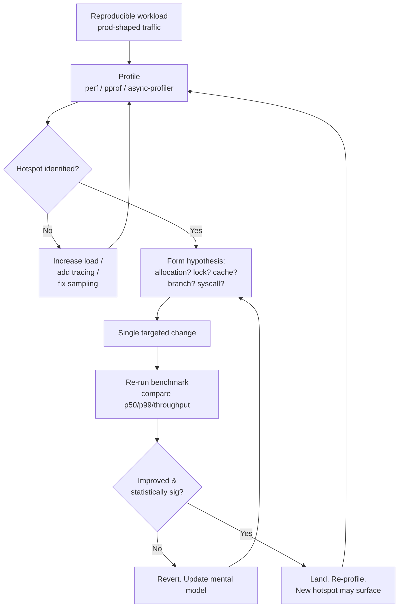
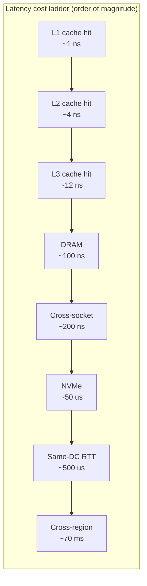
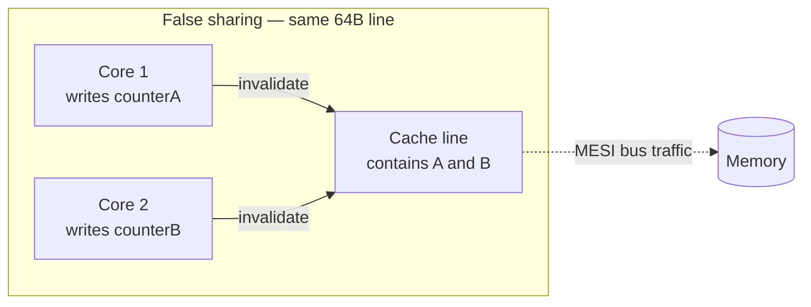

# Hot Path Optimization

## Why This Exists

**Problem.** Most production systems spend 99% of their wall-clock time in 1-3% of their code. When a service starts missing its p99 SLO, the instinct is to "make the code faster" — and engineers fan out across the codebase tightening loops, replacing libraries, switching languages. They burn weeks. The latency does not move. The reason is almost always the same: they optimized cold code. The hot path — the handful of functions on the critical line of every request — was never touched.

**Key insight.** Performance is not a property of code. It is a property of the **path through the code that traffic actually takes**, on the **hardware it actually runs on**, with the **data shapes it actually sees**. You cannot reason about it from source. You must measure it. Then you cut allocations, contention, cache misses, and branch mispredicts on the path that matters — and only that path. Cliff Click's rule: *"The first thing every optimizer does is measure. The second thing every bad optimizer does is stop measuring."*

**Reach for this when:**
- p99 (or p99.9) latency has regressed and p50 is fine — tail latency is almost always a hot-path problem.
- CPU is at 100% but adding cores does not help (lock contention or false sharing).
- A flame graph shows a single function or syscall (`futex_wait`, `__memmove_avx`, `runtime.mallocgc`, `gc_mark_root`) eating > 20% of samples.
- Allocation rate on a stateless RPC service exceeds ~50 MB/s/core — you are paying for GC you don't need.
- A tight numeric loop runs at < 10% of memory bandwidth or refuses to auto-vectorize.
- You have a real, reproducible benchmark or production profile to drive changes against.

**Don't reach for this when:**
- The service is I/O-bound and the CPU profile is flat — your problem is concurrency, batching, or the database, not the hot path. See `../tail-latency/` and `../caching/`.
- The slow code runs once at startup, in a cron job, or in an admin endpoint. Make it correct, not fast.
- You haven't verified the alleged hotspot is actually hot at production traffic shapes. Microbenchmarks lie about cache and branch behavior.
- A simpler architectural change (cache, batch, async, denormalize) will cut latency by 10x. Optimize the algorithm before the constant factor.

## Diagrams

The optimization loop is a measurement-driven loop, not a "try things" loop. The shape of the work matters:



The cost stack — where a request's nanoseconds actually go — is the mental model that drives every decision below:



A cache miss is **100x** an L1 hit. A lock that crosses sockets can cost more than a syscall. SIMD that processes 8 floats per cycle is meaningless if you stall on memory every 4th iteration. **The hierarchy is the budget.**

## The Method: Profile, Hypothesize, Cut, Verify

### Step 1 — Build a reproducible workload

You cannot optimize what you cannot reproduce. Before you touch a profiler:

1. Capture a representative request mix (prod sampled traffic, replayed via `wrk`, `vegeta`, `k6`, or a shadow rig).
2. Pin the workload — same dataset, same warmup, same JIT/GC state, same CPU governor (`performance`, not `ondemand`), same isolated cores (`taskset` / `cset`).
3. Establish a stable **baseline number with confidence intervals**. Run the bench at least 5 times. If p99 swings > 15% run-to-run, your harness is broken — fix that first.

```bash
# Linux: pin to isolated cores, disable turbo for stability
sudo cpupower frequency-set -g performance
taskset -c 4-7 ./bench --duration=120s --warmup=30s --concurrency=64

# JVM: warm up the JIT before measuring
-XX:+UnlockDiagnosticVMOptions -XX:+PrintCompilation -XX:CompileThreshold=10000
```

### Step 2 — Profile, don't guess

| Symptom                              | Right tool                                      |
|--------------------------------------|-------------------------------------------------|
| "Where is the CPU time?"             | `perf record -F 999 -g`, `pprof`, async-profiler |
| "Why is this thread blocked?"        | off-CPU profile (`perf sched`, async-profiler `-e wall`) |
| "Why is GC eating us?"               | `-Xlog:gc*`, `pprof heap`, JFR allocation events |
| "Are we cache-missing?"              | `perf stat -e cache-misses,cycles,instructions` |
| "Is auto-vectorization happening?"   | `-fopt-info-vec` (gcc), `-Rpass=loop-vectorize` (clang), `objdump -d` |
| "Is a lock contended?"               | `perf lock`, `mutrace`, JFR `jdk.JavaMonitorEnter` |
| "Is there false sharing?"            | `perf c2c record` (Linux, magic) |

Render results as a **flame graph** (Brendan Gregg). The frame at the top of the widest stack is your hotspot. If no single frame is wide, your problem is *spread* — likely allocation or syscalls — and you fix it differently (Step 3b).

### Step 3a — Cut allocations on the hot path

Allocations are the silent killer in managed runtimes (Java, Go, .NET, Node). Each allocation:
- Pollutes L1/L2 cache with header words and zeroed pages.
- Increases GC pressure → eventually a stop-the-world pause that wrecks p99.
- Hides behind innocent-looking code (`String.format`, `stream().collect()`, `fmt.Sprintf`, `[]byte("x")`).

**Rules of thumb on a hot path:**

1. **No allocation per request** is the goal for latency-sensitive servers. Pre-allocate buffers, reuse them.
2. **Object pools** for large or expensive objects only. For small short-lived objects, modern generational GCs are usually faster than a pool — measure.
3. **Avoid hidden allocations**: autoboxing (`Integer.valueOf` in a hot Java path), interface conversion in Go (`fmt.Println(x)` boxes `x` into `interface{}`), string concatenation, varargs (`String.format` allocates an `Object[]`).
4. **Slice/buffer reuse** with reset semantics:

```go
// Go: sync.Pool for transient buffers on a hot path
var bufPool = sync.Pool{
    New: func() any {
        b := make([]byte, 0, 4096)
        return &b
    },
}

func encodeResponse(w io.Writer, msg *Message) error {
    bp := bufPool.Get().(*[]byte)
    buf := (*bp)[:0]                  // reset length, keep capacity
    defer func() {
        *bp = buf
        bufPool.Put(bp)
    }()

    buf = appendInt(buf, msg.ID)      // grow in-place if possible
    buf = append(buf, msg.Body...)
    _, err := w.Write(buf)
    return err
}

// Why: zero allocations per request after warmup. The pool returns
// *[]byte (not []byte) because put-ing a []byte forces a heap escape
// of the slice header — sync.Pool documents this gotcha.
```

```java
// Java: ThreadLocal scratch buffer to avoid per-call allocation
private static final ThreadLocal<StringBuilder> SCRATCH =
    ThreadLocal.withInitial(() -> new StringBuilder(256));

public String formatKey(long userId, long itemId) {
    StringBuilder sb = SCRATCH.get();
    sb.setLength(0);                  // reset, retain capacity
    sb.append(userId).append(':').append(itemId);
    return sb.toString();             // one allocation: the result string
}
// Compare: "u:" + userId + ":" + itemId   — 3+ allocations every call.
```

5. **Pre-size collections.** `new HashMap<>(expectedSize)` skips rehashing. `make([]T, 0, n)` skips growth copies. Profile-guided sizing — instrument once, capture the p95 size, hardcode that.

### Step 3b — Cut lock contention

A lock is a serial section. Amdahl's Law says **a 1% serial section caps speedup at 100x** regardless of cores. On a 64-core box, a single hot mutex held for a microsecond per request will throttle you to ~1 M req/s system-wide, and the rest of the cores spin on `futex_wait`.

**Diagnostic:** `perf top` showing `_raw_spin_lock`, `futex_wait`, or `Object.wait`. JFR shows monitor contention events. `pprof` shows the off-CPU profile dominated by `runtime.semacquire`.

**Strategies, in order of cost:**

1. **Don't share state.** Per-thread / per-CPU state, sharded by request key, is always the fastest "lock". `LongAdder` over `AtomicLong` for hot counters. Striped locks (`ConcurrentHashMap` segments) over a single `synchronized` map.
2. **Read-mostly? Use RCU / copy-on-write / `AtomicReference<ImmutableMap>`.** Readers don't block. Writers replace the whole snapshot.
3. **Lock-free data structures** (`ConcurrentLinkedQueue`, `Disruptor`, channels). Cliff Click's NonBlockingHashMap is the reference for high-contention maps. **Lock-free is not faster than locked code on the *uncontended* path** — it pays off only when contention is real.
4. **Shorten the critical section.** Compute outside the lock, copy in, release. Never call user code, do I/O, or allocate inside a hot lock.
5. **Coarse before fine.** Counterintuitive: many small locks can be slower than one big one because of cache-line bouncing across cores. Always measure.

```java
// BAD: hot global counter, every request fights for one cache line
private static long count = 0;
public synchronized void onRequest() { count++; }

// GOOD: striped, near-zero contention, one cache line per CPU thread
private static final LongAdder count = new LongAdder();
public void onRequest() { count.increment(); }

// LongAdder maintains an array of cells, sized roughly to ncpus,
// each padded to a cache line. Threads CAS into different cells.
// Read sums all cells — slower, but reads are rare, writes are hot.
```

### Step 3c — Eliminate false sharing

Two threads writing to two *different* variables that happen to **share a 64-byte cache line** will ping-pong that line between cores. Each write invalidates the other core's copy — the MESI protocol burns memory bandwidth, and both cores stall. This looks identical to lock contention in a profile but there is no lock.



**Detection:** `perf c2c record / report` highlights HITM (modified-line hits) — the unambiguous false-sharing signature. Or: pad a suspect struct, re-bench, and watch throughput jump.

```java
// Java 8+: @Contended ensures the field has its own cache line.
// JVM flag required: -XX:-RestrictContended (or it is ignored)
import jdk.internal.vm.annotation.Contended;

class Counters {
    @Contended volatile long readerCount;
    @Contended volatile long writerCount;
}
```

```go
// Go: pad explicitly. CacheLinePad is 64 bytes on x86_64 and arm64.
type Counters struct {
    readerCount uint64
    _           [56]byte // pad: 8 (uint64) + 56 = 64
    writerCount uint64
    _           [56]byte
}
```

```c
// C/C++: alignas to cache line
struct alignas(64) PaddedCounter {
    std::atomic<uint64_t> value;
};
```

War story (Disruptor / LMAX): the original Disruptor blog showed that padding the `RingBuffer`'s producer/consumer cursors gave a **5x throughput improvement** at high core counts. The code had no bugs and no locks; it was burning all its time on cache coherence traffic.

### Step 3d — Branch prediction and data layout

Modern CPUs speculate down branches. A mispredicted branch costs ~15-20 cycles (a full pipeline flush). On a hot inner loop, unpredictable branches dominate.

**Tactics:**

1. **Sort to make branches predictable.** The famous Stack Overflow example: summing only the values >= 128 in an array runs **6x faster** if the array is sorted, because the branch becomes predictable. Same code, same data, ordering-only difference.
2. **Branchless code** for hot tight loops. Replace `if (x > 0) sum += x` with `sum += x & -(x > 0)` or use `cmov`-style intrinsics. Measure — the compiler often beats hand-written branchless code.
3. **Struct-of-Arrays (SoA) over Array-of-Structs (AoS)** when the hot loop touches one field. SoA gives sequential access → vectorization-friendly + cache-friendly.

```cpp
// AoS: cache-unfriendly when summing only prices
struct Order { uint64_t id; double price; uint32_t qty; char pad[44]; };
std::vector<Order> orders;          // 64B per element, 8B used in hot loop

double sum = 0;
for (auto& o : orders) sum += o.price; // 1 useful byte per 8 fetched

// SoA: cache-perfect, auto-vectorizes
struct Orders { std::vector<uint64_t> id; std::vector<double> price;
                std::vector<uint32_t> qty; };
double sum = 0;
for (double p : prices) sum += p;     // contiguous, SIMD-friendly
```

### Step 3e — SIMD and auto-vectorization

Modern x86 processes 4-8 doubles or 8-16 floats per cycle with AVX2/AVX-512. ARM NEON / SVE is similar. **Most hot numeric loops leave 4-16x performance on the floor** because they aren't vectorized.

**Auto-vectorization preconditions** (compiler will give up if any fails):
- Contiguous memory (no pointer chasing).
- No data dependencies between iterations (`a[i] = a[i-1] + 1` blocks vectorization; `a[i] = b[i] + c[i]` does not).
- Trip count known or compiler-inferable; ideally a multiple of vector width (or use `#pragma omp simd` to force a remainder loop).
- No early exits, no exceptions, no calls to non-inlinable functions.
- Aliasing-free pointers (`__restrict__` in C, distinct slices in Rust/Go, `@aliasing(false)` in Java Vector API).

```cpp
// clang/gcc with -O3 -march=native -fopt-info-vec will tell you
// whether each loop vectorized — and why not, if it didn't.
void axpy(float a, const float* __restrict__ x,
          float* __restrict__ y, size_t n) {
    for (size_t i = 0; i < n; ++i) y[i] += a * x[i];   // vectorizes
}
```

```java
// Java Vector API (incubator → stable) — explicit SIMD
import jdk.incubator.vector.*;

static final VectorSpecies<Float> SPECIES = FloatVector.SPECIES_PREFERRED;

void axpy(float a, float[] x, float[] y) {
    int i = 0, upper = SPECIES.loopBound(x.length);
    var va = FloatVector.broadcast(SPECIES, a);
    for (; i < upper; i += SPECIES.length()) {
        var vx = FloatVector.fromArray(SPECIES, x, i);
        var vy = FloatVector.fromArray(SPECIES, y, i);
        vx.fma(va, vy).intoArray(y, i);
    }
    for (; i < x.length; i++) y[i] += a * x[i];   // tail
}
```

When auto-vectorization refuses, your options are: rewrite to remove the blocker, use intrinsics (`_mm256_*`), or use a portable SIMD library (Highway, std::experimental::simd, Java Vector API, std::simd in Rust).

### Step 4 — Verify, with statistics

A single before/after run is meaningless. JIT warmup, GC timing, page-cache state, and CPU thermal state all introduce 5-15% noise. **Bench protocol:**

1. Warm up to steady-state (JIT compiled, caches hot).
2. Run N ≥ 5 trials, alternating control and treatment to absorb drift.
3. Report median, p99, **and** the confidence interval. JMH (`@Fork(5)`) and Go's `benchstat` do this for you.
4. Significance: if the 95% CIs overlap, the change isn't proven. Don't ship a "5% improvement" that's within noise.

```bash
# Go: benchstat compares two benchmark runs with statistical rigor
go test -run=^$ -bench=BenchmarkParse -count=10 -cpu=4 > old.txt
# ... apply change ...
go test -run=^$ -bench=BenchmarkParse -count=10 -cpu=4 > new.txt
benchstat old.txt new.txt
# Output flags p-value and CI; only land changes with p < 0.05.
```

## Mechanical Sympathy: The Mental Model

Martin Thompson and the LMAX team coined "mechanical sympathy" — the idea, borrowed from Jackie Stewart, that to drive a car well you must understand how it works mechanically. **To write fast software you must understand how the CPU, cache, and memory system work.**

The shortlist every hot-path optimizer keeps in their head:

- **The L1 / DRAM ratio is ~100x.** A cache miss is the biggest single cost most hot loops pay.
- **A cache line is 64 bytes** on x86_64 and most ARM. Data layout decisions live or die on this number.
- **Branch mispredict ≈ 15-20 cycles**, ≈ a small L1 miss.
- **A syscall is 100s of cycles minimum**, plus cache pollution from the kernel.
- **A context switch is ~1-3 µs** plus indirect cost (cache cold restart).
- **Memory bandwidth on a modern server is ~30-100 GB/s/socket.** If your loop reads 64 GB/s of cold data, you cannot go faster without changing the data.

Cliff Click's lectures (especially "A Crash Course in Modern Hardware") are the canonical introduction. Watch them before optimizing JVM code.

## Trade-offs

| Benefit                                              | Cost                                                                 |
|------------------------------------------------------|----------------------------------------------------------------------|
| 5-50x speedup on the actual hot path                 | Code becomes harder to read; reviewers need the same mental model    |
| Lower p99 / fewer GC pauses                          | More code (pools, padding, manual reset semantics)                   |
| Lower CPU bill, fewer instances                      | Optimization is workload-specific — drift in traffic invalidates it  |
| SIMD can give 4-16x in numeric kernels               | Tied to instruction set; cross-arch portability work                 |
| Cache-aware layout (SoA, padding) reduces misses     | API change — touches many call sites                                 |
| Lock-free structures eliminate contention            | Subtle memory-ordering bugs, harder to test, ABA hazards             |
| Pre-allocated pools eliminate GC pressure            | Object lifetime now your problem; resets must be exact (use-after-reset bugs) |
| Profile-guided changes are surgical                  | Profiles are point-in-time; need ongoing observability               |

## Common Pitfalls

- **Optimizing without a profile.** "I think this is the hotspot" is wrong > 80% of the time. Demand a flame graph before approving any "performance fix."
- **Microbenchmarking the wrong thing.** A loop that's hot in JMH may be inlined and dead-code-eliminated by the JIT in production. Always cross-check with a production-shaped workload.
- **Premature SIMD.** SIMD on a memory-bandwidth-bound loop gives zero speedup — you're already maxed on memory. `perf stat -e mem_load_retired.l3_miss` first.
- **Object pools that leak or double-free.** A pool is a manual memory allocator; bugs return objects to the pool while still in use, producing the worst class of heisenbug. Profile before adopting; add `Cleaner`/`finalize`-style assertions in dev builds.
- **Padding too much, hurting density.** `@Contended` on every field bloats the heap. Use it only on fields proven hot via `perf c2c`.
- **Ignoring NUMA.** On a 2-socket server, threads on socket 0 reaching memory allocated on socket 1 pay a ~2x latency tax. Pin allocators (`numactl --localalloc`, `MADV_HUGEPAGE`) once you have multi-socket boxes.
- **Vectorizing then breaking it.** Adding a single non-inlinable call inside a hot loop disables auto-vectorization silently. Always re-check `-fopt-info-vec` after any change.
- **Removing locks instead of shrinking them.** Lock-free code is dangerous and often only marginally faster than well-shrunk locked code. Make the section *short* before making it *lockless*.
- **Treating p50 wins as p99 wins.** Hot-path changes that reduce mean latency can *increase* tail latency by changing the distribution shape (e.g., introducing rare large GCs from a long-lived pool). Always measure both.
- **Forgetting the false-sharing ghost.** Two unrelated atomics in the same struct = mysterious 5x slowdown on multi-core. `perf c2c` is your friend.
- **"It's faster on my laptop."** Laptop CPU has different cache sizes, no NUMA, different turbo behavior, no neighbors. Bench on the production-class hardware.
- **Cliff Click's law of the second optimizer.** Once a hot path has been optimized once, the next bottleneck is *somewhere else* — possibly the place you ignored as cold. Re-profile after every change. Hot paths are moving targets.

## Decision Table

| Symptom / context                                              | Reach for                                       | Don't reach for                                   |
|----------------------------------------------------------------|-------------------------------------------------|---------------------------------------------------|
| p99 spike, p50 stable, GC log shows long pauses                | Allocation reduction, pooling, off-heap         | Algorithmic rewrite (allocations are the issue)   |
| CPU 100%, throughput flat as you add cores                     | Lock contention diagnosis, sharding, lock-free  | More cores, "scale out" — won't help              |
| `perf top` shows `_raw_spin_lock` or `futex_wait`              | Shrink critical section, then `LongAdder`/RCU   | Replacing the language                            |
| `perf c2c` shows HITM hot lines, no actual lock                | Pad with `@Contended` / `alignas(64)`            | Lock-free rewrite                                 |
| Numeric loop, `-fopt-info-vec` says "not vectorized: …"        | Fix the blocker (aliasing, deps), then SIMD     | Hand-rolled intrinsics first                      |
| Mostly memory-bound (low IPC, high LLC misses)                 | Improve data layout (SoA), prefetch, smaller types | SIMD (you'll stay memory-bound)                |
| Allocation rate > 100 MB/s/core on stateless RPC               | ThreadLocal/sync.Pool buffers, pre-sized colls. | Tuning GC params alone                            |
| Mostly I/O-bound (CPU < 30% under load)                        | Batching, async, caching, db query plan         | Hot-path micro-optimization (wrong layer)         |
| Hot path runs once per minute (admin)                          | Leave it alone                                   | Anything in this skill                            |
| Cold path, only used at startup                                | Don't optimize. Make it readable.                | All of this                                       |
| You can't reproduce the perf issue locally                     | Build a representative benchmark first           | Optimizing in prod via guess-and-deploy            |

## References

- Cliff Click — "A Crash Course in Modern Hardware" (JVM Language Summit 2009) — https://www.youtube.com/watch?v=OFgxAFdxYAQ
- Cliff Click — "The Art of Java Benchmarking" — https://www.azul.com/resources/art-of-java-benchmarking/
- Martin Thompson — Mechanical Sympathy blog — https://mechanical-sympathy.blogspot.com/
- LMAX Disruptor technical paper — https://lmax-exchange.github.io/disruptor/files/Disruptor-1.0.pdf
- Brendan Gregg — *Systems Performance, 2nd ed.* (2020) — http://www.brendangregg.com/systems-performance-2nd-edition-book.html
- Brendan Gregg — Flame Graphs — https://www.brendangregg.com/flamegraphs.html
- Ulrich Drepper — "What Every Programmer Should Know About Memory" (2007) — https://akkadia.org/drepper/cpumemory.pdf
- Agner Fog — Optimization manuals (microarch / instruction tables) — https://www.agner.org/optimize/
- Intel — "Intel 64 and IA-32 Architectures Optimization Reference Manual" — https://www.intel.com/content/www/us/en/developer/articles/technical/intel-sdm.html
- Aleksey Shipilëv — JMH (Java Microbenchmark Harness) — https://github.com/openjdk/jmh
- Aleksey Shipilëv — "Nanotrusting the Nanotime" — https://shipilev.net/blog/2014/nanotrusting-nanotime/
- Dmitry Vyukov — `1024cores` lock-free articles — https://www.1024cores.net/
- Linux `perf` wiki (incl. `perf c2c` for false sharing) — https://perf.wiki.kernel.org/index.php/Main_Page
- Maurice Herlihy & Nir Shavit — *The Art of Multiprocessor Programming, 2nd ed.* (Morgan Kaufmann, 2020)
- John Hennessy & David Patterson — *Computer Architecture: A Quantitative Approach, 6th ed.* (chs. 2-3 on caches and ILP)
- Google SRE Workbook — ch. "Eliminating Toil" and "Non-Abstract Large System Design" — https://sre.google/workbook/table-of-contents/
- AWS Builders' Library — "Avoiding overload in distributed systems by putting the smaller service in control" — https://aws.amazon.com/builders-library/avoiding-overload-in-distributed-systems-by-putting-the-smaller-service-in-control/
- AWS Builders' Library — "Using load shedding to avoid overload" — https://aws.amazon.com/builders-library/using-load-shedding-to-avoid-overload/
- Gil Tene — "How NOT to Measure Latency" (talk + HdrHistogram rationale) — https://www.youtube.com/watch?v=lJ8ydIuPFeU
- Stack Overflow — "Why is processing a sorted array faster than processing an unsorted array?" — https://stackoverflow.com/q/11227809
- DDIA — Kleppmann, *Designing Data-Intensive Applications* (O'Reilly, 2017) — ch. 11 "Stream Processing" §"Performance" and ch. 1 §"Describing Performance"
- Adrian Colyer — *the morning paper* — `False Sharing` walkthroughs — https://blog.acolyer.org/

## See Also

- `../tail-latency/` — setting and defending p50/p99/p99.9 budgets across a request
- `../caching/` — when the right answer is "don't compute it again"
- `../../reliability/load-shedding/` — when the right answer is "don't accept the request"
- `../../reliability/observability/` — RED/USE methods, histogram-based SLOs, HdrHistogram
- `../../data-systems/data-skew/` — distributed-processing specialization of "one hot path swamps the cluster"
