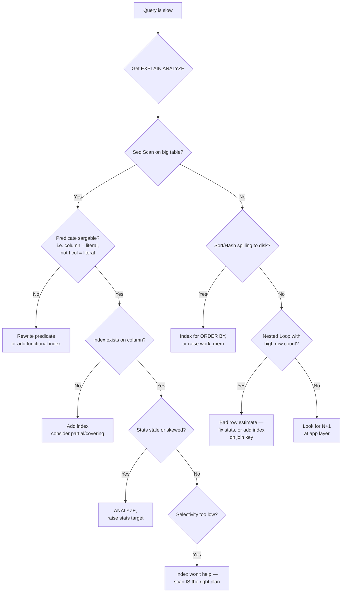
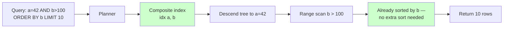

# Indexes & Query Optimization

## Why This Exists

**Problem.** A query that ran in 2ms last week now takes 4s. Customer support is paging because the orders page times out. CPU on the primary is at 95%. You open `pg_stat_statements`, see a `Seq Scan` over 80M rows where you "definitely added an index", and realize the planner is ignoring it because the predicate is wrapped in `LOWER(email)`. This is the entire job.

**Key insight.** Indexes are not magic. They are *sorted, redundant copies of a column subset* that the planner *may choose* to use if (a) the query shape lets it, (b) statistics say it's cheaper than a scan, and (c) the index actually covers the predicate. Most "the index isn't being used" bugs are query-shape bugs or statistics bugs, not missing-index bugs. Conversely, most "we need an index" reflexes are wrong — you probably need to **rewrite the query** or **drop a redundant index**.

**Reach for this when:**
- A specific query is slow and you have (or can get) `EXPLAIN ANALYZE` output.
- Latency p99 regressed but p50 didn't — a hint that the planner is flipping plans under data skew.
- The DB is CPU-bound and `pg_stat_statements` / Performance Schema points at one or two queries.
- You're about to ship a feature whose access pattern doesn't match any existing index.
- Bulk deletes, `UPDATE`s on indexed columns, or long-running transactions left bloat.

**Don't reach for this when:**
- The bottleneck is the application (N+1 from ORM lazy loading) — fix the app first; indexing won't save you.
- The DB is I/O-bound on writes — more indexes make this *worse*, not better.
- You haven't measured. Adding indexes "to be safe" is how you end up with a 600GB index on a 200GB table and 40% of writes spent maintaining indexes nobody reads.
- The right answer is **caching, denormalization, or a read replica** (different skill — see `../caching/`).

## Diagrams

### Decision flow: a query is slow, what now?



### How a B-tree index serves `WHERE a = ? AND b > ? ORDER BY b`



The same query against `idx(b, a)` would have to scan all `b > 100` and filter by `a` — usually orders of magnitude more rows. **Composite index column order matters.**

## Reading EXPLAIN — the parts that matter

### Postgres: `EXPLAIN (ANALYZE, BUFFERS, VERBOSE, SETTINGS)`

Always use `ANALYZE` (runs the query) and `BUFFERS` (shows cache hits vs disk reads). Without `BUFFERS` you can't tell a slow plan from a cold cache.

```sql
EXPLAIN (ANALYZE, BUFFERS, VERBOSE, FORMAT TEXT)
SELECT o.id, o.total
FROM orders o
WHERE o.customer_id = 12345
  AND o.created_at >= NOW() - INTERVAL '30 days'
ORDER BY o.created_at DESC
LIMIT 20;
```

What to look at, in order:

1. **Top-level estimated vs actual rows.** If `rows=1` estimated and `rows=2,400,000` actual, the planner is flying blind. Stats are stale or the predicate is opaque (e.g. `WHERE jsonb_col->>'status' = 'open'` without a functional index). Run `ANALYZE` on the table; consider `ALTER TABLE ... ALTER COLUMN ... SET STATISTICS 1000;` for skewed columns.
2. **Node types.**
   - `Seq Scan` — full table scan. Fine for small tables (<10k rows) or when selectivity > ~5%.
   - `Index Scan` — descended the index, then heap-fetched. One random I/O per row.
   - `Index Only Scan` — answered entirely from the index *if* the visibility map says the page is all-visible. Look at `Heap Fetches:` — if it's not zero, your VM is stale; `VACUUM` the table.
   - `Bitmap Heap Scan` — many index hits; build a bitmap of pages then scan them sequentially. Good for medium selectivity.
   - `Nested Loop` — for each outer row, probe the inner. Catastrophic when outer row count is wrong.
3. **Buffers: shared hit=X read=Y.** `read` means disk (or OS cache). If `read` dominates, you're cold-cache or the working set doesn't fit in `shared_buffers`.
4. **Sort Method.** `quicksort Memory: 25kB` is fine. `external merge Disk: 410MB` means you spilled — either index for the sort or raise `work_mem` for that session.
5. **`Rows Removed by Filter:`** — work done after the index narrowed. High numbers mean the index is selecting too broadly; consider a more selective composite or partial index.

Use **PgMustard** (https://www.pgmustard.com/) or `https://explain.dalibo.com/` to visualize plans. PgMustard scores nodes and surfaces the worst offender — *much* faster than reading raw text.

### MySQL/MariaDB: `EXPLAIN ANALYZE` (8.0.18+) and `EXPLAIN FORMAT=TREE`

```sql
EXPLAIN ANALYZE
SELECT o.id, o.total
FROM orders o
WHERE o.customer_id = 12345
  AND o.created_at >= NOW() - INTERVAL 30 DAY
ORDER BY o.created_at DESC
LIMIT 20;
```

Key columns from the legacy tabular `EXPLAIN`:

- `type` — best to worst: `system` > `const` > `eq_ref` > `ref` > `range` > `index` > `ALL`. `ALL` is a full scan. `index` is a full *index* scan (not as bad as `ALL`, but rarely what you want).
- `key` — index actually used. `NULL` means none.
- `rows` — estimated rows examined. The error multiplier here is the same trap as Postgres.
- `Extra` — read this carefully:
  - `Using index` → index-only access (good).
  - `Using where; Using index` → covering, with post-filter.
  - `Using filesort` → sort not served by index. Add an index that matches `ORDER BY`, or accept it for small result sets.
  - `Using temporary` → materialized intermediate; common with `GROUP BY` not aligned to an index.
  - `Using join buffer (Block Nested Loop)` → no usable index on the join key.

Use `optimizer_trace` for deep dives:

```sql
SET optimizer_trace = 'enabled=on';
SELECT ...;
SELECT * FROM information_schema.OPTIMIZER_TRACE;
```

## Index types — when each one earns its keep

### B-tree (default)

Equality and range on scalar columns. **Composite index column order:** put equality columns first, then the range/sort column. `idx(customer_id, created_at)` serves `WHERE customer_id = ? AND created_at > ?` and `ORDER BY created_at DESC`. The reverse `idx(created_at, customer_id)` does not.

```sql
-- Postgres
CREATE INDEX CONCURRENTLY idx_orders_customer_created
  ON orders (customer_id, created_at DESC);

-- DESC matters when ORDER BY is DESC and you also want NULLS LAST
-- to match — Postgres can scan a B-tree backwards, but only if the
-- index direction matches.
```

### Covering / INCLUDE indexes

Add non-key columns to the index leaf so the query never touches the heap. Postgres 11+: `INCLUDE`. MySQL: just append columns to the index (InnoDB clusters by PK so the PK is implicitly included).

```sql
-- Postgres: covering for a hot read path
CREATE INDEX CONCURRENTLY idx_orders_customer_covering
  ON orders (customer_id, created_at DESC)
  INCLUDE (total, status);

-- Now: SELECT total, status FROM orders
--      WHERE customer_id = ? ORDER BY created_at DESC LIMIT 20
-- can be served as Index Only Scan.
```

**Cost:** every `INCLUDE`d column inflates the index, so writes get slower and the index won't fit in cache as easily. Only do this for high-traffic read paths where you've measured the heap fetches.

### Partial indexes (Postgres) / filtered indexes (SQL Server)

Index only the rows that matter. Massive win when you query a small, well-defined subset of a huge table.

```sql
-- Most queries only care about active orders. Don't index the
-- 95% that are 'completed' or 'cancelled'.
CREATE INDEX CONCURRENTLY idx_orders_active
  ON orders (customer_id, created_at DESC)
  WHERE status IN ('pending', 'processing');

-- Soft-delete pattern: index ignores tombstones
CREATE INDEX CONCURRENTLY idx_users_email_active
  ON users (lower(email))
  WHERE deleted_at IS NULL;
```

The query must include the predicate verbatim (or a provable subset) for the planner to use the index. `WHERE status = 'pending'` matches `IN ('pending', 'processing')`.

MySQL has no native partial index — the workaround is a generated column you can index, or splitting hot/cold rows into separate tables.

### Functional / expression indexes

Indexes on the *result* of an expression. Required when you query `WHERE LOWER(email) = ?` or `WHERE date_trunc('day', created_at) = ?`.

```sql
CREATE INDEX CONCURRENTLY idx_users_email_lower
  ON users (lower(email));

-- Now this is sargable:
SELECT * FROM users WHERE lower(email) = 'foo@bar.com';
```

The expression in the query must match the index expression *exactly*. `WHERE LOWER(email) = LOWER('Foo@Bar.com')` matches; `WHERE email ILIKE 'foo@bar.com'` does not.

### GIN / GiST / BRIN (Postgres specialties)

- **GIN:** inverted index. Use for `jsonb`, full-text (`tsvector`), array containment (`@>`), trigram (`pg_trgm`) for `LIKE '%foo%'`.
- **GiST:** spatial (PostGIS), range types, exclusion constraints.
- **BRIN:** block-range. Tiny index for huge, naturally-ordered tables (time-series append-only). Trades precision for size — 1000x smaller than B-tree, but only useful when physical order correlates with the indexed column.

```sql
-- Trigram index makes LIKE '%foo%' sargable
CREATE EXTENSION IF NOT EXISTS pg_trgm;
CREATE INDEX CONCURRENTLY idx_products_name_trgm
  ON products USING GIN (name gin_trgm_ops);

-- BRIN for a 2TB time-series table
CREATE INDEX idx_events_time_brin
  ON events USING BRIN (created_at) WITH (pages_per_range = 64);
```

### Hash indexes

Postgres: B-tree is almost always better — hash supports only `=` and only became crash-safe in PG 10. Skip unless you have a benchmarked reason. MySQL InnoDB has *adaptive* hash indexes maintained automatically by the buffer pool; you don't create them.

## SQL antipatterns that defeat indexes

### 1. Non-sargable predicates (function on the column)

```sql
-- BAD: index on created_at can't be used
WHERE DATE(created_at) = '2026-06-05'

-- GOOD: range predicate, sargable
WHERE created_at >= '2026-06-05' AND created_at < '2026-06-06'

-- BAD: implicit cast
WHERE customer_id = '12345'  -- if customer_id is bigint

-- BAD: leading wildcard
WHERE name LIKE '%smith'  -- B-tree useless; need trigram GIN
```

### 2. `OR` over different columns

```sql
-- BAD: planner often can't combine indexes; degenerates to seq scan
WHERE email = ? OR phone = ?

-- GOOD: UNION ALL — each branch uses its own index
SELECT * FROM users WHERE email = ?
UNION ALL
SELECT * FROM users WHERE phone = ? AND email IS DISTINCT FROM ?;
```

Postgres can sometimes do a `BitmapOr` if both columns are indexed and selectivity is right, but `UNION ALL` is more reliable.

### 3. `NOT IN` with NULLs

```sql
-- BAD: if the subquery returns any NULL, NOT IN returns no rows
WHERE id NOT IN (SELECT customer_id FROM blocked)

-- GOOD: NOT EXISTS handles NULL correctly and uses an anti-join
WHERE NOT EXISTS (
  SELECT 1 FROM blocked b WHERE b.customer_id = users.id
)
```

### 4. `OFFSET` for deep pagination

```sql
-- BAD: page 1000 means scanning 20,000 rows then discarding 19,980
SELECT * FROM orders ORDER BY created_at DESC LIMIT 20 OFFSET 19980;

-- GOOD: keyset / seek pagination — uses the index directly
SELECT * FROM orders
WHERE (created_at, id) < (:last_created_at, :last_id)
ORDER BY created_at DESC, id DESC
LIMIT 20;
```

See https://use-the-index-luke.com/no-offset for the canonical writeup.

### 5. `SELECT *` defeating index-only scans

If you only need 3 columns, listing them lets a covering index serve the query. `SELECT *` forces a heap fetch every time.

### 6. N+1 from ORMs

```python
# BAD: 1 query for orders, then N queries for each customer
for order in Order.objects.filter(status='pending'):
    print(order.customer.name)  # lazy load — one query each

# GOOD: 2 queries total, regardless of N
for order in Order.objects.filter(status='pending').select_related('customer'):
    print(order.customer.name)
```

The DB-side fix is impossible — you must fix the app. Detect with `django-silk`, `rails-mini-profiler`, Hibernate stats, or APM (Datadog DBM, New Relic). N+1 is the #1 cause of "the database is slow" in app shops.

### 7. Unindexed sorts

```sql
-- If there's no index covering (status, created_at DESC), this filesorts
SELECT * FROM orders WHERE status = 'pending'
ORDER BY created_at DESC LIMIT 20;
```

For `LIMIT` queries, the cost of the sort dominates if it has to materialize all matching rows. An index that serves both the filter and the order makes this a tiny, bounded scan.

### 8. Over-indexed write-heavy tables

Every `INSERT` updates every index. Every `UPDATE` of an indexed column writes the old and new index entry (and in Postgres, may trigger a HOT-broken update that bloats the heap). Audit unused indexes:

```sql
-- Postgres: indexes never read since stats reset
SELECT schemaname, relname, indexrelname, idx_scan
FROM pg_stat_user_indexes
WHERE idx_scan = 0
  AND indexrelname NOT LIKE '%_pkey'
ORDER BY pg_relation_size(indexrelid) DESC;

-- Drop with CONCURRENTLY to avoid taking an exclusive lock
DROP INDEX CONCURRENTLY idx_unused;
```

## Index maintenance: bloat, stats, and rebuilds

### Bloat

Postgres MVCC keeps old row versions until `VACUUM`. Heavy `UPDATE`s or `DELETE`s on indexed columns leave dead tuples in indexes that aren't reclaimed by autovacuum's normal pass. Symptoms:

- Index size grows much faster than table size.
- Index Only Scan still does heap fetches because the visibility map is stale.

Diagnose with the `pgstattuple` extension:

```sql
CREATE EXTENSION IF NOT EXISTS pgstattuple;
SELECT * FROM pgstatindex('idx_orders_customer_created');
-- Look at: avg_leaf_density. Healthy: 70-90%. Bloated: <50%.
```

Fix:

```sql
-- Postgres 12+: rebuilds without taking AccessExclusiveLock
REINDEX INDEX CONCURRENTLY idx_orders_customer_created;

-- For tables: pg_repack (extension) — online table+index rebuild
-- VACUUM FULL works but takes an AccessExclusiveLock — outage-grade.
```

MySQL InnoDB has its own equivalent — `OPTIMIZE TABLE` (online since 5.6) rebuilds the clustered index and secondary indexes.

### Statistics drift

The planner uses histograms and `n_distinct` estimates. After a bulk load, these are wrong until the next `ANALYZE`. Symptoms: a query that "used to be fast" suddenly picks a Nested Loop with 50M outer rows.

```sql
-- After bulk insert/update
ANALYZE orders;

-- For columns with skewed distributions, raise the resolution
ALTER TABLE orders ALTER COLUMN customer_id SET STATISTICS 1000;
ANALYZE orders;
```

Postgres autovacuum runs `ANALYZE` automatically, but the threshold (`autovacuum_analyze_scale_factor = 0.1`) means a 100M-row table needs 10M changes before it triggers. For high-churn tables, lower it per-table.

### Multi-column / extended statistics (Postgres 10+)

When two columns are correlated (e.g. `country` and `postal_code`), the planner's independence assumption produces awful row estimates. Fix:

```sql
CREATE STATISTICS stats_country_postal (dependencies, ndistinct)
  ON country, postal_code FROM addresses;
ANALYZE addresses;
```

This is the single most underused Postgres feature for fixing bad join estimates.

## A worked example: the slow dashboard

A reporting endpoint runs:

```sql
SELECT date_trunc('day', o.created_at) AS day,
       COUNT(*) AS orders,
       SUM(o.total) AS revenue
FROM orders o
JOIN customers c ON c.id = o.customer_id
WHERE c.region = 'EU'
  AND o.created_at >= NOW() - INTERVAL '90 days'
  AND o.status = 'completed'
GROUP BY 1
ORDER BY 1;
```

`EXPLAIN ANALYZE` shows: 8.2s, `Seq Scan on orders (cost=… rows=18M)`, `Hash Join`, `Sort … external merge Disk: 1.4GB`.

Diagnosis:
1. `orders.created_at` has a B-tree index, but the planner picked Seq Scan because `status = 'completed'` is 90% of rows — the index isn't selective enough on its own.
2. The `Sort` spilled because we're sorting 4M rows by `date_trunc(...)`, which isn't indexable.
3. The `Hash Join` builds from `customers WHERE region = 'EU'` — if that's 200k rows, fine; if it's 50M, we'd want an index-driven nested loop.

Fix:

```sql
-- 1. Partial index — only the rows the query actually wants
CREATE INDEX CONCURRENTLY idx_orders_completed_recent
  ON orders (created_at, customer_id)
  INCLUDE (total)
  WHERE status = 'completed';

-- 2. Make sure customers.region is indexed for the join filter
CREATE INDEX CONCURRENTLY idx_customers_region ON customers (region);

-- 3. Pre-aggregate if this query runs every minute on a dashboard.
--    See ../caching-strategies/ — a materialized view rebuilt hourly
--    turns this into a 5ms lookup.
CREATE MATERIALIZED VIEW mv_daily_eu_revenue AS
SELECT date_trunc('day', o.created_at) AS day,
       COUNT(*) AS orders, SUM(o.total) AS revenue
FROM orders o JOIN customers c ON c.id = o.customer_id
WHERE c.region = 'EU' AND o.status = 'completed'
GROUP BY 1;
CREATE UNIQUE INDEX ON mv_daily_eu_revenue (day);
-- REFRESH MATERIALIZED VIEW CONCURRENTLY mv_daily_eu_revenue;
```

Result: 8.2s → 35ms with the partial index alone; 5ms with the matview.

## Trade-offs

| Benefit | Cost |
|---|---|
| Faster reads on indexed predicates | Slower writes — every `INSERT`/`UPDATE` updates every index |
| Index-only scans avoid heap I/O | Wider indexes (INCLUDE, covering) consume more cache and disk |
| Partial indexes shrink hot working set | Predicate must match exactly; easy to "miss" the index from a slightly different query |
| Functional indexes make `LOWER`/`jsonb` sargable | Tied to a specific expression; refactoring the query can silently bypass it |
| GIN/trigram makes `LIKE '%x%'` fast | GIN writes are 10x slower than B-tree; pending list tuning matters |
| BRIN is tiny on huge tables | Only works when physical order correlates with the column |
| `REINDEX CONCURRENTLY` reclaims bloat online | Holds a `ShareUpdateExclusiveLock` — blocks DDL, doubles disk during rebuild |
| Extended statistics fix correlated estimates | Manual; planner doesn't auto-detect which columns are correlated |
| Keyset pagination is O(log N) at any depth | Requires a stable, indexed sort key tuple; harder to "jump to page N" |

## Common Pitfalls

- **"I added the index and it didn't help."** Run `EXPLAIN` — the planner often ignores a brand-new index until `ANALYZE` runs. Or your query has a function on the column. Or your `customer_id` is `bigint` and you're passing a string.
- **`CREATE INDEX` instead of `CREATE INDEX CONCURRENTLY` in production.** Takes an `AccessExclusiveLock` for the duration of the build. On a 200GB table, that's a multi-hour outage. Always `CONCURRENTLY` for online systems; have a retry path because it can fail mid-build and leave an `INVALID` index that you must drop.
- **Composite index column order backwards.** `idx(created_at, customer_id)` cannot serve `WHERE customer_id = ?` efficiently. Equality columns first, then range/sort.
- **Redundant indexes.** `idx(a, b, c)` makes `idx(a)` and `idx(a, b)` redundant for *reads*, but each still costs writes. Audit with `pg_stat_user_indexes`.
- **Indexing low-cardinality booleans.** `idx(is_active)` where 99% of rows are `true` is useless — the planner correctly chooses a Seq Scan. Use a partial index `WHERE is_active = false` if `false` is the rare case you query.
- **Forgetting `NULLS FIRST/LAST` in `ORDER BY`.** Postgres B-tree default is `NULLS LAST` for `ASC`. If your query says `ORDER BY x DESC NULLS LAST`, the default index `idx(x)` won't serve it — you need `idx(x DESC NULLS LAST)`.
- **Bloat from long-running transactions.** A reporting query that runs for 6 hours holds back autovacuum's xmin horizon for the entire DB. One slow query can bloat *every* table. Monitor `pg_stat_activity` for `state = 'idle in transaction'`.
- **Ignoring `Heap Fetches > 0` in Index Only Scans.** Means the visibility map is stale. `VACUUM` the table; consider raising `autovacuum_vacuum_scale_factor` for read-heavy tables that need fresh VM.
- **Tuning queries on a copy of prod with cold cache.** Numbers will lie. Run the query twice and read the second `BUFFERS` line. Or warm with `pg_prewarm`.
- **Adding indexes to fix N+1.** It might mask the symptom for a while, but you're now doing 1000 index lookups per request instead of 1 + 1 batched query. Fix the app.
- **Letting the ORM generate `WHERE id IN (?, ?, …)` with thousands of items.** Postgres parses and plans this O(n²) on the IN list. Batch in chunks of 500-1000, or use `= ANY($1::bigint[])`.

## Decision Table

| Situation | Use this | Not this |
|---|---|---|
| Equality + range on two columns | Composite B-tree `(eq_col, range_col)` | Two single-column indexes |
| Hot read path, narrow column set | Covering index with `INCLUDE` | `SELECT *` heap fetch |
| Query targets <5% of rows by a fixed predicate | Partial index | Full index over all rows |
| `WHERE LOWER(email) = ?` or `jsonb_col->>'k'` | Functional / expression index | "Just lowercase in the app" (still need the index) |
| `LIKE '%foo%'` on text | `pg_trgm` GIN index | B-tree (useless for leading wildcard) |
| Time-series, append-only, billions of rows | BRIN on the time column | B-tree (100x larger, marginal speedup) |
| Full-text search | `tsvector` + GIN, or a real search engine | `LIKE '%word%'` with trigram (works, but limits ranking) |
| Deep pagination | Keyset / seek | `OFFSET N` |
| Reports with joins + aggregations, run repeatedly | Materialized view, refreshed on schedule | Re-running the query each request |
| Index is bloated after bulk delete | `REINDEX CONCURRENTLY` (PG 12+) | `VACUUM FULL` (locks the table) |
| Bad row estimates on correlated columns | `CREATE STATISTICS … (dependencies)` | Hoping a hint fixes it (PG has no hints) |
| Write-heavy table, many indexes | Audit `pg_stat_user_indexes`, drop unused | "Add another index just in case" |
| MySQL `Using filesort` on `ORDER BY` | Index matching the sort columns | Raise `sort_buffer_size` (only postpones the problem) |
| OR over two indexed columns | `UNION ALL` of two single-column queries | One query and hoping for `BitmapOr` |
| Huge `IN (?, ?, …)` list | `= ANY($1::bigint[])` with a single param | Generated SQL with N placeholders |

## References

- Markus Winand — *Use The Index, Luke!* — https://use-the-index-luke.com/ (chapters: Anatomy of an Index, The Where Clause, Performance and Scalability, Sorting and Grouping, Modifying Data — the canonical free book on indexing)
- Markus Winand — *SQL Performance Explained* (book, ISBN 978-3-9503078-2-5) — paid, terse, vendor-agnostic
- PgMustard — *EXPLAIN visualization and tips* — https://www.pgmustard.com/
- PgMustard — *EXPLAIN glossary* — https://www.pgmustard.com/docs/explain
- Dalibo — *explain.dalibo.com plan visualizer* — https://explain.dalibo.com/
- Postgres docs — *Using EXPLAIN* — https://www.postgresql.org/docs/current/using-explain.html
- Postgres docs — *Index Types* — https://www.postgresql.org/docs/current/indexes-types.html
- Postgres docs — *Multicolumn Indexes* — https://www.postgresql.org/docs/current/indexes-multicolumn.html
- Postgres docs — *Partial Indexes* — https://www.postgresql.org/docs/current/indexes-partial.html
- Postgres docs — *Index-Only Scans* — https://www.postgresql.org/docs/current/indexes-index-only-scans.html
- Postgres docs — *Extended Statistics* — https://www.postgresql.org/docs/current/planner-stats.html#PLANNER-STATS-EXTENDED
- Postgres wiki — *SlowQueryQuestions* — https://wiki.postgresql.org/wiki/SlowQueryQuestions
- MySQL docs — *EXPLAIN Output Format* — https://dev.mysql.com/doc/refman/8.0/en/explain-output.html
- MySQL docs — *Optimizing SELECT Statements* — https://dev.mysql.com/doc/refman/8.0/en/select-optimization.html
- MySQL docs — *Optimizer Trace* — https://dev.mysql.com/doc/dev/mysql-server/latest/PAGE_OPT_TRACE.html
- Percona — *MySQL Query Tuning Trilogy* — https://www.percona.com/blog/category/mysql/
- Bruce Momjian — *Postgres Indexing presentation* — https://momjian.us/main/presentations/internals.html
- Kleppmann — *Designing Data-Intensive Applications* ch. 3 (Storage and Retrieval) — B-trees, LSM-trees, secondary indexes
- Kleppmann — *DDIA* ch. 7 (Transactions) — for MVCC implications on index visibility
- Pat Helland — *Immutability Changes Everything* — https://queue.acm.org/detail.cfm?id=2884038 (why append-only patterns interact differently with indexing)
- Google — *Site Reliability Engineering* ch. 5 (Eliminating Toil) — https://sre.google/sre-book/eliminating-toil/ (when to stop tuning and start automating)
- AWS Builders' Library — *Amazon Aurora storage internals* — https://aws.amazon.com/builders-library/ (for cloud-DB-specific I/O cost models)
- Hironobu SUZUKI — *The Internals of PostgreSQL* — https://www.interdb.jp/pg/ (free book, deep coverage of index internals and the planner)

## See Also

- `../caching/` — when the answer is "stop hitting the DB", not "tune the query"
- `../../data-systems/partitioning/` — when one box can't hold the data no matter how good the indexes are
- `../../data-systems/materialized-views/` — pre-aggregating expensive joins
- `../connection-pooling/` — pgbouncer, ProxySQL; relevant when the bottleneck is connection churn, not query plans
- `../../reliability/capacity-planning/` — sizing `shared_buffers`, `work_mem`, `effective_cache_size`
- `../../architecture-patterns/cqrs/` — splitting read and write models so each can be indexed for its workload
