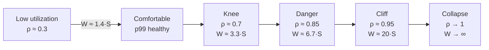
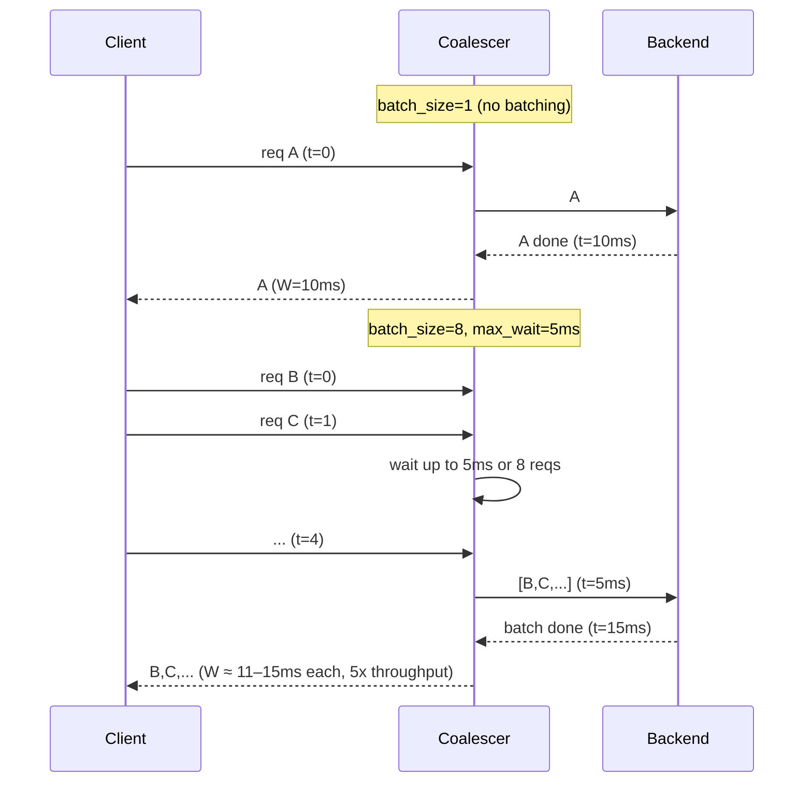
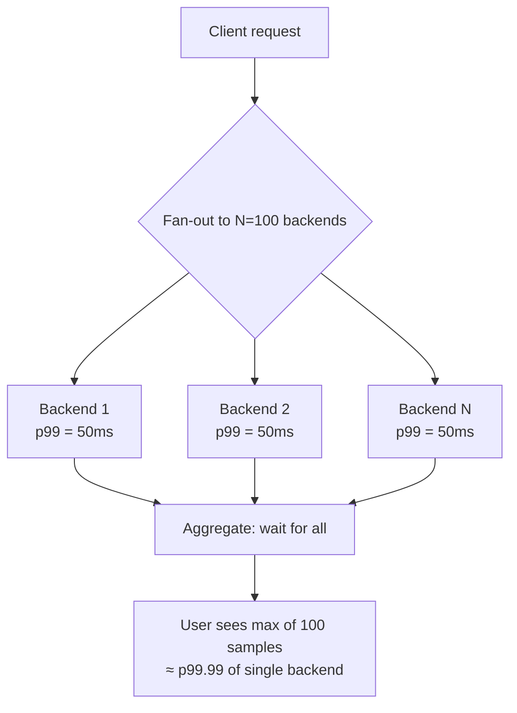

# Latency vs Throughput

## Why This Exists

**Problem.** Engineers conflate "fast" and "scalable". A system can be both low-latency and low-throughput (a single thread doing one fast thing), high-latency and high-throughput (a batch ETL), or — under load — neither. The two metrics are linked by **Little's Law** and **queueing theory**, and ignoring that link produces predictable outages: capacity plans that work at 50% utilization and fall apart at 80%, batching tuned for throughput that destroys p99, autoscalers that lag the actual demand curve.

**Key insight.** Latency and throughput are not independent dials. For any stable system:

> **L = λ × W**  (Little's Law)
>
> L = average number of items in the system
> λ = arrival rate (throughput)
> W = average time an item spends in the system (latency)

Push throughput up while latency holds → concurrency rises. Push throughput up against a latency ceiling → the queue grows without bound and the system collapses. The interesting engineering question is almost never "how do I make this faster?" but "**what is the latency budget at the throughput I actually need, at the percentile that matters?**"

**Reach for this when:**
- Capacity planning: deciding instance count, thread-pool size, batch size, connection-pool size.
- Diagnosing tail latency: p50 fine, p99 awful, no obvious slow path.
- Trading latency for throughput consciously (batching, coalescing, pipelining).
- Setting SLOs that won't melt under predictable load.
- Sizing buffers, queues, or back-pressure thresholds.

**Don't reach for this when:**
- The system is not yet stable under steady-state load (fix correctness/crashes first; queueing math assumes stability).
- The bottleneck is a single hot lock or a quadratic algorithm — fix the algorithm; queueing theory just tells you the algorithm is broken.
- You're optimizing single-user perceived latency on a desktop app with no concurrency — UI work, not throughput work.

## Diagrams

### The utilization–latency curve (why "70% utilization" feels fine and 90% melts)



For an M/M/1 queue, mean wait W = S / (1 − ρ) where S is service time and ρ is utilization (λ × S). Latency does not degrade linearly — it explodes near ρ = 1.

### Batching trade-off: throughput up, p50 up, p99 sometimes down



### Tail-latency amplification under fan-out



With N=100 fan-out, the user-perceived latency is the **max** of 100 backend latencies. If each backend is 50 ms at p99, the user p50 is roughly the backend p99.99. This is "The Tail at Scale" (Dean & Barroso, 2013).

## Definitions, Precisely

| Term | Definition |
|---|---|
| **Latency (W)** | Time from request submission to response received, measured per request. Distribution-valued: report p50, p90, p99, p99.9, max. Mean alone is meaningless when the distribution is heavy-tailed. |
| **Throughput (λ)** | Successful requests completed per unit time. Measured at the system boundary you care about (RPS at the LB, qps at the DB, msgs/sec on the bus). |
| **Service time (S)** | Time the server actively spends on a request, excluding queueing. S = 1/μ where μ is service rate per server. |
| **Wait time** | Time queued before service starts. W = wait + S. |
| **Utilization (ρ)** | ρ = λ / (c × μ) for c servers. Fraction of capacity in use. ρ ≥ 1 means an unstable, unbounded queue. |
| **Concurrency (L)** | Number of in-flight requests at any moment. By Little's Law, L = λ × W. |
| **Goodput** | Throughput excluding errors, retries, and timeouts. The number that actually matters to the user. Under overload, throughput can stay high while goodput collapses. |
| **User-perceived latency** | Time from user action to user-visible result. May span many backend requests, fan-out, retries, client-side rendering. ≠ request latency at any single hop. |

## Little's Law, Applied

L = λ × W is dimensionally trivial but operationally enormous. It holds for **any stable system in steady state** — no assumptions about distributions, scheduling, or topology.

### Sanity-check capacity plans

Suppose your service does 5,000 RPS (λ) with mean latency 80 ms (W = 0.08 s). Average concurrency:

```
L = 5000 × 0.08 = 400 in-flight requests
```

If your thread pool is 200 and your async runtime has no extra queueing, **you cannot achieve this throughput at this latency** — Little's Law says you need 400 concurrent slots. Either the thread pool grows, or λ × W must shrink.

### Sizing connection pools

Database connection pool sizing for a service hitting Postgres at 2,000 qps with mean DB latency 5 ms:

```
L = 2000 × 0.005 = 10 connections (mean)
```

But this is the **mean**. Provision for the p99 of concurrency, not the mean. If query latency p99 is 50 ms, momentary concurrency can spike. Rule of thumb: pool size = ceil(λ_peak × W_p99) + safety headroom.

### Diagnosing capacity walls

A queue worker process throughput hits a ceiling at 200 msgs/sec, CPU is 30%, no I/O wait. Mean processing latency: 50 ms. Workers configured: 10.

```
Max throughput = workers / W = 10 / 0.05 = 200 msgs/sec  (matches)
```

The ceiling is **concurrency-limited**, not CPU-limited. Add workers or reduce W.

```python
# little_law.py — Little's Law calculator and sanity checker
from dataclasses import dataclass
from typing import Optional

@dataclass
class CapacityCheck:
    """Sanity-check capacity plans using Little's Law (L = λW)."""
    target_rps: float            # λ — target throughput
    mean_latency_s: float        # W — measured/expected mean latency
    p99_latency_s: float         # for headroom sizing
    available_concurrency: int   # threads, connections, async slots
    safety_factor: float = 1.5   # headroom for bursts and p99 spikes

    @property
    def required_mean_concurrency(self) -> float:
        return self.target_rps * self.mean_latency_s

    @property
    def required_p99_concurrency(self) -> float:
        # Concurrency to cover bursts where every request hits p99 latency.
        return self.target_rps * self.p99_latency_s

    @property
    def is_feasible(self) -> bool:
        return (self.available_concurrency
                >= self.required_p99_concurrency * self.safety_factor)

    def recommendation(self) -> str:
        needed = self.required_p99_concurrency * self.safety_factor
        if self.is_feasible:
            return f"OK: have {self.available_concurrency}, need ~{needed:.0f}"
        gap = needed - self.available_concurrency
        return (
            f"UNDER-PROVISIONED: have {self.available_concurrency}, "
            f"need ~{needed:.0f} (gap: {gap:.0f}). "
            f"Either raise concurrency, lower W, or lower λ."
        )

# Example: a service expecting 5k RPS with 80ms mean / 250ms p99
check = CapacityCheck(
    target_rps=5000,
    mean_latency_s=0.080,
    p99_latency_s=0.250,
    available_concurrency=500,
)
print(check.recommendation())
# UNDER-PROVISIONED: have 500, need ~1875 (gap: 1375).
```

## Queueing Theory, Just Enough

The simplest useful model is **M/M/1**: Poisson arrivals (rate λ), exponential service times (mean S = 1/μ), single server, FIFO queue. For a stable M/M/1 queue (ρ = λ/μ < 1):

```
Mean wait in queue:    Wq = ρS / (1 − ρ)
Mean total latency:    W  = S / (1 − ρ)
Mean queue length:     Lq = ρ² / (1 − ρ)
```

Three takeaways that change how you operate systems:

1. **Latency goes nonlinear long before saturation.** ρ = 0.5 → W = 2S. ρ = 0.9 → W = 10S. ρ = 0.95 → W = 20S. That's why "we ran fine at 70% CPU and melted at 85%" is the most common SRE story.
2. **More servers help superlinearly near saturation.** M/M/c (c servers) with the same total capacity has dramatically lower wait than M/M/1 with one big server. Two 1×CPU servers beat one 2×CPU server for tail latency, even at identical ρ.
3. **Variability is the enemy.** M/M/1 assumes exponential (high-variance) service. M/D/1 (deterministic service) has half the wait. Long-tailed (e.g. occasional 10× requests) services have far worse waits than M/M/1 predicts. **Pollaczek-Khinchine** generalizes: Wq scales with E[S²], not just E[S]. **Cap the tail of S** (timeouts, request hedging, isolation of large requests) and Wq drops.

```python
# mm1.py — M/M/1 queue calculator. Useful for back-of-envelope sizing.
def mm1(arrival_rate: float, service_rate: float) -> dict:
    """
    arrival_rate (λ): requests per second.
    service_rate  (μ): requests per second a single server can complete.
    Returns mean waits assuming Poisson arrivals + exponential service.
    """
    if arrival_rate >= service_rate:
        return {"stable": False, "note": "ρ ≥ 1: queue grows unbounded"}
    rho = arrival_rate / service_rate
    s = 1 / service_rate                 # mean service time
    w_q = rho * s / (1 - rho)            # mean wait in queue
    w   = s / (1 - rho)                  # mean total latency
    l   = arrival_rate * w               # Little's Law: in-system count
    return {"stable": True, "rho": rho, "S": s, "Wq": w_q, "W": w, "L": l}

for rho_target in [0.3, 0.5, 0.7, 0.85, 0.95, 0.99]:
    mu = 100  # 100 rps capacity per server
    lam = rho_target * mu
    r = mm1(lam, mu)
    print(f"ρ={rho_target:.2f}  W={r['W']*1000:6.1f}ms  L={r['L']:5.1f}")
# ρ=0.30  W=  14.3ms  L=  4.3
# ρ=0.50  W=  20.0ms  L= 10.0
# ρ=0.70  W=  33.3ms  L= 23.3
# ρ=0.85  W=  66.7ms  L= 56.7
# ρ=0.95  W= 200.0ms  L=190.0
# ρ=0.99  W=1000.0ms  L=990.0
```

## Average vs Percentiles — Why Means Lie

Latency distributions are not normal. They are right-skewed, often bimodal (cache hit vs miss), often heavy-tailed (GC pauses, lock contention, retries). Reporting **mean** latency hides the experience of your worst-served users.

| Statistic | What it tells you | What it hides |
|---|---|---|
| Mean | Total time spent serving / count | Tail. A 1-in-1000 request taking 10s adds 10ms to the mean — invisible against any noise. |
| p50 | Typical experience | Anything past the median, i.e. half your data. |
| p99 | The 1-in-100 bad request | Tail of tail. With 100 backend fan-out, **every** user request samples p99 at least once. |
| p99.9, p99.99 | Engineered tail | Statistical noise unless you have huge sample sizes. |
| max | Worst case in window | Almost always a clock-skew artifact or a deploy. Useful, but noisy. |

### Two laws of percentiles you must internalize

1. **Percentiles do not average.** You cannot take p99 latencies from 10 hosts and average them. You must aggregate the underlying histograms (HDR Histogram, t-digest, DDSketch). Averaging percentiles is a meaningless number that leaders will nonetheless put in a slide deck.
2. **Tail amplifies under fan-out.** If a user request fans out to N backend calls and waits for all, user-perceived latency ≈ p_(1−1/N) of the backend. N=100 → user p50 ≈ backend p99. This is the central insight of *The Tail at Scale*.

```python
# percentiles.py — why averaging percentiles is wrong; use histograms.
import numpy as np

# Two hosts with different load profiles
host_a = np.concatenate([np.random.exponential(10, 9900),
                          np.random.exponential(500, 100)])  # bad tail
host_b = np.random.exponential(20, 10000)                    # uniform

# WRONG: average the per-host p99s
wrong = (np.percentile(host_a, 99) + np.percentile(host_b, 99)) / 2

# RIGHT: aggregate raw observations, then compute p99
combined = np.concatenate([host_a, host_b])
right = np.percentile(combined, 99)

print(f"avg-of-p99 (wrong): {wrong:.1f}ms")
print(f"p99 of combined  : {right:.1f}ms")
# avg-of-p99 (wrong): ~1750ms (meaningless)
# p99 of combined  : ~2300ms (truth)
```

In production: emit **histograms** (Prometheus `histogram`, OpenTelemetry exponential histograms, HDR for high-precision needs). Compute percentiles at query time on the merged histogram, never on pre-computed per-instance percentiles.

## Batching: The Latency-Throughput Knob

Batching trades per-request latency for system throughput. The mechanism is **amortizing fixed per-request overhead** (syscalls, network frames, lock acquisitions, page lookups) over more useful work.

### When batching helps

- Per-request fixed cost is a meaningful fraction of total cost (e.g. network round-trip dominates a tiny payload).
- Downstream system has cheaper bulk operations (DB INSERT in batches of 1000, S3 multipart, GPU forward pass on a batch).
- Per-request work is small relative to context-switch / dispatch cost.

### When batching backfires

- Service time per item *grows* with batch size (e.g. a batch lock held for the whole batch's duration multiplies hold time).
- Batching adds a **mandatory wait** — even one item in the batch must wait for either the batch to fill or the timeout. This raises p50 by up to `max_batch_wait` and can shift p99 unpredictably.
- A single failure poisons the whole batch (all-or-nothing semantics). Now your error rate is amplified.

### The two parameters that matter

```
max_batch_size  — upper bound on items per batch
max_wait_time   — upper bound on time the first item waits before flush
```

Tune `max_wait_time` to your **latency budget**, not to throughput. If your SLO is p99 < 200 ms and downstream takes 50 ms, you have ~150 ms of budget. A `max_wait_time` of 20 ms is reasonable; 100 ms is reckless.

```go
// coalescer.go — bounded-batch coalescer with size + time triggers.
// Idiomatic in Go for DB writes, downstream RPC, embedding/inference calls.
package coalesce

import (
    "context"
    "sync"
    "time"
)

type Request[T any, R any] struct {
    Item T
    Done chan Result[R]
}

type Result[R any] struct {
    Value R
    Err   error
}

type Coalescer[T any, R any] struct {
    maxBatch int
    maxWait  time.Duration
    handler  func(ctx context.Context, items []T) ([]R, error)

    mu    sync.Mutex
    batch []Request[T, R]
    timer *time.Timer
}

func New[T any, R any](
    maxBatch int,
    maxWait time.Duration,
    handler func(ctx context.Context, items []T) ([]R, error),
) *Coalescer[T, R] {
    return &Coalescer[T, R]{
        maxBatch: maxBatch,
        maxWait:  maxWait,
        handler:  handler,
    }
}

func (c *Coalescer[T, R]) Submit(ctx context.Context, item T) (R, error) {
    done := make(chan Result[R], 1)
    c.mu.Lock()
    c.batch = append(c.batch, Request[T, R]{Item: item, Done: done})
    if len(c.batch) >= c.maxBatch {
        c.flushLocked(ctx)
    } else if c.timer == nil {
        // Start the deadline on the FIRST item — bounds wait time.
        c.timer = time.AfterFunc(c.maxWait, func() {
            c.mu.Lock()
            c.flushLocked(context.Background())
            c.mu.Unlock()
        })
    }
    c.mu.Unlock()

    select {
    case res := <-done:
        return res.Value, res.Err
    case <-ctx.Done():
        var zero R
        return zero, ctx.Err()
    }
}

func (c *Coalescer[T, R]) flushLocked(ctx context.Context) {
    if len(c.batch) == 0 {
        return
    }
    if c.timer != nil {
        c.timer.Stop()
        c.timer = nil
    }
    pending := c.batch
    c.batch = nil
    go func() {
        items := make([]T, len(pending))
        for i, r := range pending {
            items[i] = r.Item
        }
        results, err := c.handler(ctx, items)
        for i, r := range pending {
            if err != nil {
                r.Done <- Result[R]{Err: err}
                continue
            }
            r.Done <- Result[R]{Value: results[i]}
        }
    }()
}
```

### Sizing the batch: the Universal Scalability Law lens

Throughput as a function of batch size is not monotonic. Beyond a point, larger batches add coordination cost (lock hold time, memory pressure, GPU memory, retry blast radius) and throughput decreases. Empirically tune by sweeping batch size and plotting goodput. The optimum sits at the **knee of throughput vs latency** — pick the batch size that maximizes throughput subject to your p99 budget.

## User-Perceived vs Request Latency

A user's "the page felt slow" maps to many backend events:

```
User perceived latency =
    DNS + TCP + TLS                     (first-byte network)
  + LB queue + auth + rate limit        (edge tax)
  + max(N parallel backend calls)       (fan-out tail)
  + retries on partial failure          (retry storms)
  + client-side render / hydration      (frontend cost)
  + last-mile network jitter            (mobile, satellite)
```

Each backend hop's p99 contributes to the user's experience nonlinearly. **Optimizing your service's p50 while ignoring p99 makes the user experience worse.** The user is the max-of-many sample.

### Tactics to bound user-perceived latency

- **Hedged requests.** Send the request to two replicas after a short delay; take the first response. *The Tail at Scale* shows this dramatically reduces p99 with small λ overhead. Beware: amplifies load if delay is too small.
- **Tied requests.** Send to two replicas immediately; first to begin processing cancels the other. Lower overhead than hedged but requires cancellation support.
- **Latency-aware load balancing.** P2C (power-of-two-choices) with peak-EWMA latency outperforms round-robin under heterogeneous backend latency. Used in Finagle, Linkerd.
- **Request shedding.** When ρ > 0.85, reject excess requests immediately rather than queueing them. A fast 503 beats a 30-second 200. See AWS's "load shedding" pattern.
- **Bound the queue, bound the wait.** Bounded queues + immediate failure (or fast retry on a different host) puts the latency cap in your hands instead of the OS scheduler's.

```python
# hedged.py — hedged request pattern (Dean & Barroso, "The Tail at Scale")
import asyncio
from typing import Awaitable, Callable, TypeVar

T = TypeVar("T")

async def hedged_request(
    fn: Callable[[], Awaitable[T]],
    hedge_after_s: float = 0.010,  # ~ p95 of fast path
    max_attempts: int = 2,
) -> T:
    """
    Issue a second request after `hedge_after_s` if the first hasn't returned.
    Take the first successful response; cancel the loser.
    """
    pending: set[asyncio.Task[T]] = set()

    async def schedule():
        # Start primary immediately
        pending.add(asyncio.create_task(fn()))
        for _ in range(max_attempts - 1):
            await asyncio.sleep(hedge_after_s)
            if not pending:
                return
            # If primary is still running, hedge.
            pending.add(asyncio.create_task(fn()))

    scheduler = asyncio.create_task(schedule())
    try:
        while pending:
            done, _ = await asyncio.wait(pending, return_when=asyncio.FIRST_COMPLETED)
            for t in done:
                pending.discard(t)
                if t.exception() is None:
                    # Cancel losers; return winner.
                    for loser in pending:
                        loser.cancel()
                    return t.result()
        raise RuntimeError("all attempts failed")
    finally:
        scheduler.cancel()
        for t in pending:
            t.cancel()
```

## The "Throughput Plateaus While CPU Is Idle" Pattern

A surprisingly common and surprisingly diagnosable failure mode. The chain of reasoning:

1. **Measure utilization correctly.** CPU utilization at 30% does not mean 30% of *system capacity* used. It means 30% of CPU. You may be I/O bound, lock bound, GC bound, network bound, or — most insidiously — **concurrency-limit bound** by a thread pool, connection pool, or async runtime semaphore.
2. **Apply Little's Law.** If max throughput = concurrency / W, and throughput plateaus, then either concurrency is capped or W is too high. Find which.
3. **Look for fixed-size pools.** Most frameworks ship default thread pool sizes, connection pool sizes, and `MaxParallelism` knobs that will silently bound throughput long before CPU saturates. Examples: HikariCP `maximumPoolSize=10`, Tomcat `maxThreads=200`, AWS SDK `maxConnections=50`, Go `GOMAXPROCS` interactions with cgo.
4. **Check the fan-in.** A single shared mutex, a single Redis instance, a single DynamoDB partition key, a single leader node — all are concurrency-1 components. Amdahl's Law: if 5% of work is serial, max speedup is 20×, no matter how many cores you add.

## Trade-offs

| Benefit | Cost |
|---|---|
| Higher throughput via batching | Higher per-item p50; tail behavior coupled to batch boundary |
| Lower latency via more replicas / lower utilization | Higher cost (idle capacity); harder to keep caches warm |
| Bounded queue (predictable wait) | Drops requests under overload (must surface backpressure) |
| Hedged / tied requests | 1.05–2× backend load; complicates idempotency |
| Async / non-blocking I/O | Concurrency in flight (memory), harder debugging, harder timeouts |
| Coarser-grained batching upstream | Larger blast radius on failure (one poison pill kills the batch) |
| Optimizing for p50 | p99 / p99.9 may worsen — and that's what users feel under fan-out |
| Larger thread pools | More context-switch overhead, more memory, lock contention rises |
| Aggressive timeouts | Lower tail, but more retries → retry storms → throughput collapse |
| High utilization for cost efficiency | Tiny variance increase pushes ρ → 1, latency explodes |

## Common Pitfalls

- **Averaging percentiles across instances.** Meaningless. Always aggregate histograms.
- **Reporting mean latency on a heavy-tailed distribution.** A handful of 10-second requests are invisible in the mean and dominate the user experience.
- **Sizing thread pools for mean concurrency, not p99.** Service runs fine for 23 hours then the daily report job arrives and the pool starves.
- **Forgetting Little's Law in capacity plans.** "We need to handle 10k RPS at 100ms" implies 1000 concurrent in-flight requests. That doesn't fit in your default 200-thread Tomcat.
- **Pushing utilization to 90%+ "for efficiency".** ρ = 0.9 means W = 10×S on M/M/1. The next 2% load increase is a 2× latency increase. Run with headroom or accept brittle tails.
- **Unbounded queues.** They turn latency problems into memory problems and OOMs. Always bound the queue and shed when full.
- **Retries without backoff/jitter.** A retry storm is a positive-feedback loop that pegs ρ ≥ 1 even after the original cause clears. See SRE chapter 22, "Addressing Cascading Failures".
- **Ignoring service-time variance.** A single slow request type mixed into a queue with fast requests destroys p99 for the fast ones (head-of-line blocking). Isolate request classes (separate queues, separate connection pools, separate fleets).
- **Assuming horizontal scaling fixes latency.** It fixes throughput. Latency under load improves only if the bottleneck is queueing (which scales out) — not if it's a serialized step (which doesn't, per Amdahl).
- **Tuning batch size in dev with no concurrency.** Batch sizes that look great at λ=10 are catastrophic at λ=10000 because flush wait time is dominated by batch fill time.
- **Treating "latency budget" as additive.** It's not. Fan-out makes it max-of-N. Retries make it sum-over-attempts. Plan accordingly.
- **Confusing throughput with goodput under overload.** Your service "handles" 50k RPS — but 40k of those are timeouts the client retries. Goodput is 10k. The graphs lie.

## Decision Table

| Situation | Reach for | Avoid |
|---|---|---|
| Latency-critical request path (interactive, user-facing p99 SLO) | Lower utilization, more replicas, hedged requests, bounded queues, isolate request classes | Aggressive batching, deep queues, single-replica designs |
| Throughput-critical batch path (ETL, bulk ingest, training) | Large batches, high utilization, deep buffers, parallelism via partitioning | Per-record RPC, low utilization, hedged requests |
| Request mix has heavy tail (some 10× the median) | Separate fast/slow queues or fleets; cap timeouts; cancel slow tails | Single shared queue (head-of-line blocking) |
| Need to raise throughput on existing fleet | First check Little's Law (raise concurrency or lower W); profile for fixed-size pools | Adding replicas blindly when bottleneck is serial |
| p99 spikes correlated with load increase | Reduce ρ (scale out, shed load); look for queueing nonlinearity | Optimizing p50 path; raising thread count further past CPU saturation |
| p99 spikes uncorrelated with load | GC, lock contention, noisy neighbor, dependency tail; profile, don't scale | Capacity changes (won't help) |
| Fan-out request user-perceived latency too high | Reduce N, hedge, or back-end p99 — *not* back-end p50 | Accepting "p50 is great" as success |
| Auto-scaler oscillates / lags traffic burst | Predictive scaling, headroom, request shedding to bridge the gap | Scaling on CPU alone (lagging indicator); reactive scaling for spiky loads |
| New system, no production data | Conservative ρ ≤ 0.5, generous timeouts, bounded queues, observability first | Optimizing for cost; tight pools; tight timeouts |
| Strict p99 with cost pressure | Two smaller replicas > one large (M/M/c beats M/M/1 at same ρ); request hedging | Pushing one big box to 90% utilization |

## References

- Kleppmann, Martin — **Designing Data-Intensive Applications**, ch. 1 ("Reliable, Scalable, and Maintainable Applications") and ch. 8 ("The Trouble with Distributed Systems") — covers latency percentiles, Little's Law intuition, and fan-out tail amplification. https://dataintensive.net/
- Beyer, Murphy, et al. — **Site Reliability Engineering**, ch. 21 "Handling Overload" and ch. 22 "Addressing Cascading Failures" — https://sre.google/sre-book/handling-overload/ , https://sre.google/sre-book/addressing-cascading-failures/
- Beyer et al. — **The Site Reliability Workbook**, ch. 5 "Alerting on SLOs" and ch. 11 "Managing Load" — https://sre.google/workbook/managing-load/
- Dean, Jeffrey & Barroso, Luiz André — **The Tail at Scale**, Communications of the ACM, Feb 2013 — the canonical paper on fan-out p99 amplification, hedged/tied requests. https://research.google/pubs/the-tail-at-scale/
- Little, John D. C. — **A Proof for the Queuing Formula: L = λW**, Operations Research, 1961 — original derivation; the modern reference is Little & Graves, "Little's Law" in *Building Intuition* (2008).
- Gunther, Neil — **Guerrilla Capacity Planning** (Springer, 2007) and the **Universal Scalability Law** — https://www.perfdynamics.com/Manifesto/USLscalability.html
- Vogels, Werner / Hamilton, James — **AWS Builders' Library** — see "Timeouts, retries, and backoff with jitter" and "Using load shedding to avoid overload" — https://aws.amazon.com/builders-library/
- Helland, Pat — **Idempotence Is Not a Medical Condition** (CACM, 2012) — relevant to retry storms under tail latency. https://queue.acm.org/detail.cfm?id=2187821
- Kingman, J. F. C. — **The Single Server Queue in Heavy Traffic**, 1961 — Kingman's formula for G/G/1 wait time, the basis for modern queueing approximations.
- Schroeder, Wierman, Harchol-Balter — **Open Versus Closed: A Cautionary Tale**, NSDI 2006 — why benchmark methodology dramatically changes which system "wins" on latency. https://www.usenix.org/legacy/event/nsdi06/tech/schroeder.html
- HdrHistogram (Gil Tene) — **How NOT to Measure Latency** — talk + library; foundational for percentile measurement. https://www.youtube.com/watch?v=lJ8ydIuPFeU , https://github.com/HdrHistogram/HdrHistogram
- Brendan Gregg — **Systems Performance**, 2nd ed. — ch. 2 "Methodologies" (USE method, utilization saturation) and ch. 6 "CPUs". https://www.brendangregg.com/systems-performance-2nd-edition-book.html
- Harchol-Balter, Mor — **Performance Modeling and Design of Computer Systems** (Cambridge, 2013) — graduate-level queueing theory written for systems engineers.
- Fowler, Martin — **PatternsOfDistributedSystems / Backpressure / RequestPipeline** — https://martinfowler.com/articles/patterns-of-distributed-systems/

## See Also

- `../caching/` — caching shifts work off the hot path, lowering W and ρ on the origin.
- `../../reliability/load-shedding/` — what to do when ρ → 1 and you cannot scale fast enough.
- `../../communication/backpressure/` — protocol-level mechanisms to keep arrivals bounded by capacity.
- `../../reliability/circuit-breaker/` — bounding fan-out latency by giving up fast on a sick dependency.
- `../../reliability/rate-limiting/` — capping λ at the edge so the inner system stays in its safe ρ range.
- `../../reliability/bulkheads/` — isolating request classes so a slow tail in one class doesn't poison another's queue.
- `../../reliability/timeouts/` — bounding W per attempt without creating retry storms.
- `../../reliability/capacity-planning/` — turning Little's Law and queueing intuition into headroom budgets.
- `../../reliability/circuit-breaker/` — what happens when latency-induced retries push ρ ≥ 1 across a system.
