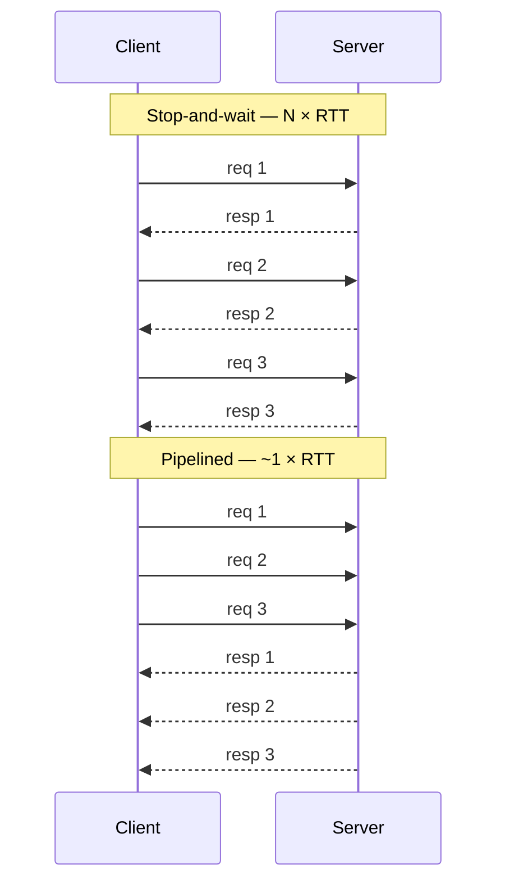
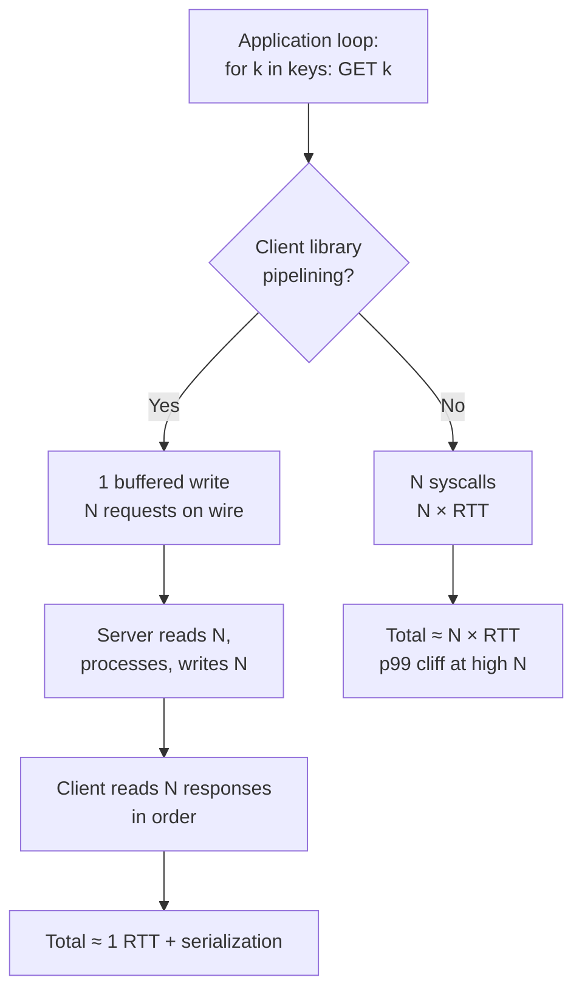
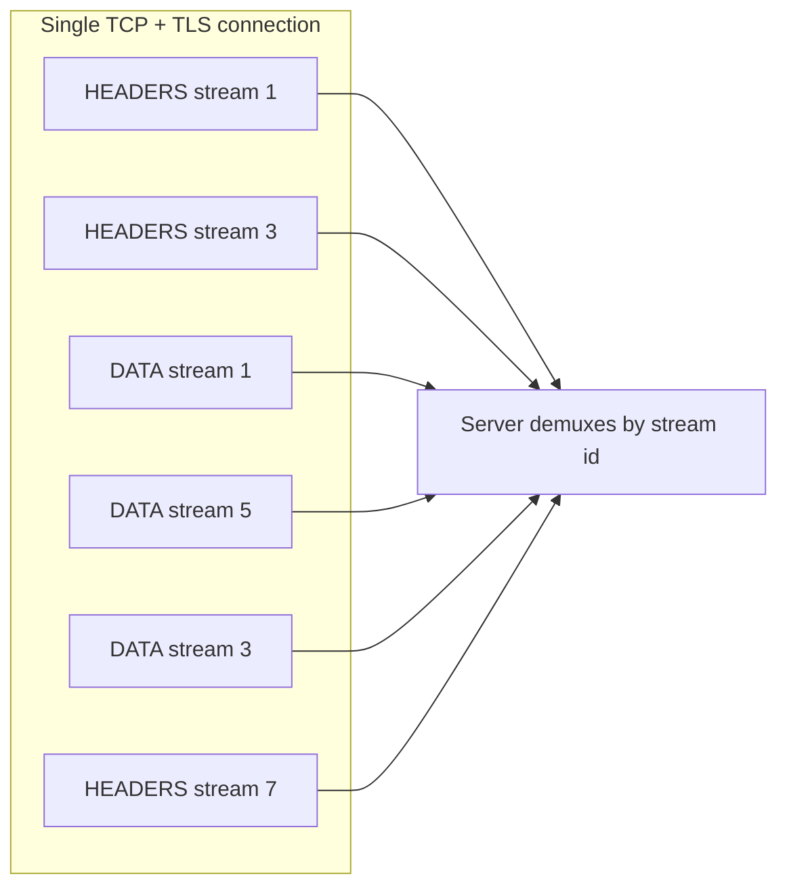

# Pipelining

## Why This Exists

**Problem.** A client sends request, waits for response, sends next request. With 1ms network RTT and 200 commands, the wall-clock floor is **200ms** even if the server processes each command in 10µs. The bottleneck isn't CPU — it's the round-trip you re-pay on every command. This is the textbook **bandwidth-delay product** problem: a fast pipe held mostly empty by a stop-and-wait protocol.

**Key insight.** TCP is full-duplex and ordered. You don't need the response to send the next request. **Decouple sending from receiving** — push N requests onto the wire, then read N responses in order. The wire stays full, the server pipeline stays primed, and total time approaches `max(N × server_cost, 1 × RTT + N × serialization)` instead of `N × (RTT + server_cost)`.

This is the same insight CPU designers exploited in 1961 (IBM Stretch) and that HTTP/2, QUIC, gRPC streaming, Kafka producer batching, and Redis `MULTI/EXEC` all encode at higher levels.

**Reach for this when:**
- A loop over a remote API/DB shows wall-clock time ≈ `N × RTT` and the server p50 is tiny.
- You see "Redis is slow" reports but `redis-cli --latency` returns sub-ms.
- A mobile/edge client makes 20+ small calls per page load.
- The transport is connection-oriented and ordered (TCP, Unix socket, HTTP/2 stream).
- You want lower latency *and* higher throughput from the **same** connection without spinning up more sockets.

**Don't reach for this when:**
- Requests have **inter-dependencies** ("read X, then write X+1") — pipelining preserves order but not causality across responses you haven't read yet.
- You need **transactionality** across commands — use Redis `MULTI/EXEC` (which is pipelined *and* atomic) or a real transaction.
- The protocol is **stateless request/response** without ordering guarantees (UDP, HTTP/1.0 without keep-alive).
- The server **doesn't actually pipeline** — some HTTP/1.1 proxies serialize anyway, defeating the point.
- One request can fail in a way that **invalidates the rest** and you can't tolerate partial application — prefer a real batch primitive.
- Per-request cost is dominated by **server work**, not RTT — pipelining buys you nothing.

## Diagrams

### Stop-and-wait vs pipelined



### Where pipelining sits in the stack



### HTTP/2 multiplexing — concurrent streams over one TCP connection



## Core Patterns

### 1. Redis pipelining — the canonical case

The pure throughput win. Redis is so fast that **RTT dominates** and pipelining yields 5–20× on real workloads.

```python
# redis-py — naive vs pipelined
import redis
import time

r = redis.Redis(host="cache.internal", port=6379)

# BAD — N round-trips. With 1ms RTT, this is ~10s for 10k ops.
def naive(keys):
    return [r.get(k) for k in keys]

# GOOD — one round-trip's worth of latency, batched on the wire.
def pipelined(keys, chunk=1000):
    out = []
    # Chunk to bound memory + avoid blowing TCP socket send buffers.
    # transaction=False because we don't need MULTI/EXEC atomicity here —
    # we just want to skip the RTT. transaction=True wraps in MULTI/EXEC,
    # which serializes server-side AND blocks other clients during exec.
    for i in range(0, len(keys), chunk):
        pipe = r.pipeline(transaction=False)
        for k in keys[i:i+chunk]:
            pipe.get(k)
        out.extend(pipe.execute())
    return out
```

**Why chunking matters.** A 10M-key pipeline buffers 10M responses in client memory before `execute()` returns. The server also has to buffer its output if the client hasn't drained the socket. Chunk size of 100–10000 is typical; benchmark your workload.

**Pipelining is NOT a transaction.** A pipelined `INCR` followed by `GET` is two independent commands; another client can `SET` between them on the server. If you need atomicity, use `MULTI/EXEC` (still pipelined, but server runs them as one unit) or a Lua script via `EVAL`.

```python
# Atomic check-and-increment via Lua — one round trip, server-side atomicity.
LUA = """
local v = redis.call('GET', KEYS[1])
if not v then v = '0' end
local n = tonumber(v) + tonumber(ARGV[1])
redis.call('SET', KEYS[1], n)
return n
"""
incr = r.register_script(LUA)
new_val = incr(keys=["counter"], args=[5])
```

### 2. HTTP/1.1 pipelining — mostly dead, know why

HTTP/1.1 *spec'd* pipelining (RFC 7230 §6.3.2) but it's **head-of-line blocked**: response 2 can't start until response 1 finishes, so a slow first request stalls everything behind it. Combined with broken proxies that mis-handled it, browsers (Chrome 2011, Firefox 2014) disabled it by default. **Don't use HTTP/1.1 pipelining in 2025.** Use HTTP/2 or HTTP/3 instead.

### 3. HTTP/2 frame multiplexing — pipelining done right

HTTP/2 (RFC 9113) splits requests into **frames** tagged with a **stream id**. Many concurrent streams share one TCP connection. Frames from different streams interleave on the wire — a slow stream doesn't block fast ones. This is pipelining + multiplexing + flow control + header compression (HPACK), all on one socket.

```go
// Go — one HTTP/2 client, hundreds of concurrent requests over one connection.
package main

import (
    "context"
    "io"
    "net/http"
    "sync"
    "golang.org/x/net/http2"
)

func fetchAll(urls []string) [][]byte {
    // ForceAttemptHTTP2 is default in Go 1.6+, but be explicit for prod.
    tr := &http.Transport{
        ForceAttemptHTTP2: true,
        // MaxConnsPerHost = 1 forces reuse of the single H2 conn.
        // H2's MAX_CONCURRENT_STREAMS (server-advertised, often 100-256)
        // is the real cap on in-flight requests per conn.
        MaxConnsPerHost: 1,
    }
    if err := http2.ConfigureTransport(tr); err != nil {
        panic(err)
    }
    client := &http.Client{Transport: tr}

    out := make([][]byte, len(urls))
    var wg sync.WaitGroup
    sem := make(chan struct{}, 200) // respect server's stream limit

    for i, u := range urls {
        wg.Add(1)
        sem <- struct{}{}
        go func(i int, u string) {
            defer wg.Done()
            defer func() { <-sem }()
            req, _ := http.NewRequestWithContext(context.Background(), "GET", u, nil)
            resp, err := client.Do(req)
            if err != nil {
                return
            }
            defer resp.Body.Close()
            out[i], _ = io.ReadAll(resp.Body)
        }(i, u)
    }
    wg.Wait()
    return out
}
```

**HTTP/2's hidden HOL: TCP itself.** H2 multiplexes at the application layer, but if a TCP packet is dropped, **all streams on that connection stall** waiting for retransmit. This is why **HTTP/3 / QUIC** moves multiplexing into a UDP-based transport with per-stream loss recovery — it solves the last layer of HOL blocking that H2 couldn't.

### 4. gRPC streaming — pipelining as a first-class protocol feature

gRPC over HTTP/2 has four call types. Two of them are pipelining made explicit:

| Type | Client sends | Server sends | Use |
|---|---|---|---|
| Unary | 1 | 1 | Plain RPC |
| Server streaming | 1 | N | Server pushes a sequence (e.g. tail logs) |
| Client streaming | N | 1 | Client uploads a sequence (e.g. metric points) |
| Bidirectional | N | M | Full duplex (chat, live trading) |

```python
# Python gRPC — client streaming. One RPC, many messages, one connection.
import grpc
from generated import metrics_pb2, metrics_pb2_grpc

def stream_metrics(stub, points):
    # Yielding messages — gRPC lib pipelines them onto the H2 stream
    # without awaiting individual ACKs. Backpressure is handled by H2
    # WINDOW_UPDATE frames, NOT by app-level await.
    def gen():
        for p in points:
            yield metrics_pb2.Point(name=p.name, value=p.value, ts=p.ts)
    summary = stub.RecordPoints(gen())   # single response after all points sent
    return summary

with grpc.insecure_channel("metrics.svc:9090") as ch:
    stub = metrics_pb2_grpc.MetricsStub(ch)
    stream_metrics(stub, points_list)
```

**Why this beats N unary calls:** one stream id, one set of compressed headers (HPACK), no per-call setup. Throughput improvements of 10–50× on small payloads are routine.

### 5. Database driver pipelining — PostgreSQL extended-query

Postgres supports pipelining since libpq 14 (`PQpipelineStatus`). Most ORMs don't expose it; raw drivers do.

```python
# asyncpg — pipelining INSERTs without awaiting each.
import asyncio, asyncpg

async def bulk_insert(rows):
    conn = await asyncpg.connect(dsn="postgres://...")
    # executemany pipelines under the hood — sends all parse/bind/execute
    # frames, then reads all results. ~10x faster than a loop of execute().
    await conn.executemany(
        "INSERT INTO events(uid, payload) VALUES($1, $2)",
        rows,
    )
    await conn.close()
```

For *hand-rolled* pipelining, libpq's pipeline mode lets you queue independent statements and read results out of order. Use it when you need different SQL per row; otherwise `executemany` / `COPY` are simpler.

### 6. AWS SDK request batching vs HTTP-level pipelining

The AWS SDK V3 (JS) and V2 (Go) both speak HTTP/2 to many services. A `Promise.all` over 100 `GetItem` calls *will* multiplex over a single H2 connection — that's pipelining. But for DynamoDB, **`BatchGetItem` is strictly better** because it also reduces server-side overhead (one auth check, one log line, one charge unit per batch) and cuts request count toward the per-second limit. **Pipelining helps the wire; batching helps the wire AND the server.** Use both: pipeline `BatchGetItem` calls.

## Trade-offs

| Benefit | Cost |
|---|---|
| Eliminates per-request RTT — 5–20× latency win on chatty workloads | Order-coupled: one slow request can delay later responses (HOL inside a stream) |
| Higher throughput per connection — fewer sockets, less TLS handshake cost | Memory pressure: client buffers N requests + N responses; server buffers responses if client doesn't drain |
| Works on existing protocols (Redis, Postgres, HTTP/2) without server changes | No transactional semantics by default — must layer `MULTI/EXEC`, scripts, or true batch ops |
| Lower CPU per request (amortized syscall, framing, header compression) | Error handling is harder: response N may fail; do you abort, retry, or skip? |
| Smooths tail latency at moderate N | TCP HOL still applies (H2); migrate to H3/QUIC if loss-tolerance matters |
| Friendlier to NAT/firewalls than opening many connections | Debugging is harder — one wireshark trace shows interleaved frames |
| Backpressure available via H2 flow control | Easy to overload server: 10k pipelined commands hit the server as a burst |

## Common Pitfalls

- **"I pipelined and it's slower."** Almost always: you wrapped each command in `MULTI/EXEC` (transaction=True), which serializes server-side and adds two extra commands. Use `transaction=False` for pure pipelining.
- **Unbounded pipelines.** Pushing 1M Redis commands without chunking either OOMs the client (response buffer) or trips Redis's output buffer limits and gets you disconnected. Chunk to 1k–10k.
- **Mixing reads and writes assuming atomicity.** A pipelined `GET k; INCR k` is **not** atomic. Another client can write between them. Use Lua or `WATCH/MULTI/EXEC`.
- **HTTP/1.1 pipelining "working" in dev, breaking in prod.** Some load balancers and forward proxies (older nginx, some CDN edges) silently serialize H1 pipelined requests. Use H2.
- **Head-of-line blocking surprise.** In HTTP/2, a single huge response on stream 1 throttles streams 3, 5, 7 via flow-control windows if you don't read fast enough. Drain streams concurrently; don't `await` them serially.
- **TCP HOL on lossy networks.** Mobile clients on flaky links see worse p99 with H2 than H1 because one lost packet stalls all multiplexed streams. H3/QUIC fixes this.
- **gRPC streaming with no flow control.** Yielding 1M messages into a client stream without consuming `MAX_CONCURRENT_STREAMS` and `WINDOW_UPDATE` correctly will silently buffer in kernel queues until OOM.
- **Pipelining across a connection pool.** Pool implementations (HikariCP, redis-py BlockingConnectionPool) hand out a connection per call. To pipeline you need a sticky connection — use `pool.pipeline()` API, not the pool primitive.
- **Server-side pipelining off.** Some Redis proxies (Twemproxy, older Envoy) didn't pipeline upstream. Test end-to-end with `redis-benchmark -P 50` against the real path.
- **Counting "requests in flight" wrong.** With pipelining, your client metric "active requests = 1" lies — there are 1000 commands queued. Instrument **bytes in flight** or **commands queued**, not connections.
- **Idempotency assumption on retry.** If the connection drops mid-pipeline, you don't know which commands the server applied. Make pipelined writes idempotent (uuid keys, conditional writes) or accept replay risk.
- **"Just open more connections".** Tempting alternative, but each TCP+TLS connection costs 2–3 RTTs to establish, allocates kernel memory, and load-balancers throttle per-connection. Pipelining is almost always cheaper than connection-spamming.

## Decision Table

| Scenario | Use | Not |
|---|---|---|
| 100 Redis `GET`s, no inter-dependence | Pipelining (`transaction=False`) | One-by-one (`r.get` in a loop) |
| Atomic check-and-set across multiple keys | `MULTI/EXEC` or Lua `EVAL` | Plain pipeline |
| Many small writes, must succeed-or-fail-together | Real batch op (`BatchWriteItem`) or transaction | Pipeline |
| Browser → API for a page with 30 endpoint calls | HTTP/2 + concurrent fetches | HTTP/1.1 pipelining |
| Mobile client, lossy links, many small requests | HTTP/3 / QUIC | HTTP/2 (TCP HOL) |
| Streaming metrics from 1M devices to ingest | gRPC client-streaming | N unary calls |
| Live order book, full-duplex updates | gRPC bidirectional | Long-poll or SSE |
| Bulk insert 1M rows into Postgres | `COPY FROM` (bulk) > `executemany` (pipelined) > loop | Per-row `INSERT` |
| Server processes each item heavily (>10ms) | Async fan-out with concurrency cap | Pipelining (no win — server-bound) |
| Different services per call (heterogeneous) | Concurrent HTTP/2 streams | Single pipeline |
| Need ordering guarantees and partial failure isolation | Outbox + queue (Kafka, SQS) | Pipelining |
| Cross-region, RTT > 100ms, large N | Pipelining is huge — biggest wins are here | Stop-and-wait |
| Simple cron job, low N, RTT < 1ms | Don't bother — code clarity wins | Premature pipelining |

## When Pipelining vs Batching vs Async Fan-out

These are often confused. They're different tools:

- **Pipelining** — *transport-layer* trick. Send many small requests on one connection without awaiting. Server still processes each as a distinct request. Wins: RTT, framing overhead.
- **Batching** — *application-layer* primitive. Server exposes `BatchGet`, `BatchWrite`, `mget`, `mset`. One logical call, atomic-ish, server amortizes auth/log/index work. Wins: RTT *and* server CPU.
- **Async fan-out** — *concurrency pattern*. N independent connections or N streams in parallel. Wins: parallelism across servers/shards. Costs: connection count, less ordering.

**Combine them.** Real systems do all three: async fan-out across shards, batching within a shard, pipelining the batch RPCs over HTTP/2.

## References

- IETF — RFC 9113: HTTP/2 — https://datatracker.ietf.org/doc/html/rfc9113
- IETF — RFC 9114: HTTP/3 — https://datatracker.ietf.org/doc/html/rfc9114
- IETF — RFC 9000: QUIC Transport — https://datatracker.ietf.org/doc/html/rfc9000
- IETF — RFC 7230 §6.3.2: HTTP/1.1 Pipelining — https://datatracker.ietf.org/doc/html/rfc7230#section-6.3.2
- Redis — Pipelining docs — https://redis.io/docs/latest/develop/use/pipelining/
- Redis — Transactions (MULTI/EXEC) — https://redis.io/docs/latest/develop/interact/transactions/
- gRPC — Core concepts: streaming RPCs — https://grpc.io/docs/what-is-grpc/core-concepts/
- PostgreSQL — libpq pipeline mode — https://www.postgresql.org/docs/current/libpq-pipeline-mode.html
- Google — HTTP/2 Frequently Asked Questions — https://http2.github.io/faq/
- Cloudflare — HTTP/2 vs HTTP/3 — https://blog.cloudflare.com/http3-the-past-present-and-future/
- Mozilla — Why HTTP/1.1 pipelining was abandoned — https://bugzilla.mozilla.org/show_bug.cgi?id=264354
- AWS Builders' Library — Timeouts, retries, and backoff with jitter — https://aws.amazon.com/builders-library/timeouts-retries-and-backoff-with-jitter/
- AWS Builders' Library — Avoiding insurmountable queue backlogs — https://aws.amazon.com/builders-library/avoiding-insurmountable-queue-backlogs/
- Google SRE Book — ch. 22, Addressing Cascading Failures — https://sre.google/sre-book/addressing-cascading-failures/
- DDIA — Kleppmann — ch. 4 (Encoding & Evolution), ch. 8 (Trouble with Distributed Systems) — bandwidth-delay product, RPC pitfalls
- Hennessy & Patterson — Computer Architecture: A Quantitative Approach — Appendix C, Pipelining Basics (origin of the concept)
- Brendan Gregg — Systems Performance, 2nd ed. — ch. 10, Network — TCP throughput and BDP
- Marc Brooker — It's Always TCP's Fault — https://brooker.co.za/blog/2024/05/09/nagle.html
- High Scalability — HTTP/2 multiplexing explained — http://highscalability.com/blog/2016/8/22/strategy-redis-pipeline-mode-for-cheap-cheap-cheap-perfect.html

## See Also

- ../batching/ — server-side batch primitives, when batching beats pipelining
- ../caching/ — pipelined cache fills and stampede control
- ../connection-pooling/ — pool semantics and why naive pools defeat pipelining
- ../backpressure/ — flow control, queue limits, and HTTP/2 WINDOW_UPDATE
- ../tail-latency/ — hedged requests, p99 reduction, and pipelined fan-out
- ../load-shedding/ — protecting servers from pipelined bursts
- ../../networking/http2/ — frame format, stream lifecycle, settings
- ../../networking/quic-http3/ — per-stream loss recovery, 0-RTT
- ../../networking/grpc/ — service definitions, streaming patterns, deadlines
- ../../databases/redis/ — data structures, persistence, cluster mode
- ../../databases/postgres/ — extended query protocol, COPY, bulk paths
- ../../reliability/idempotency/ — making retried pipelined writes safe
- ../../reliability/timeouts-retries/ — interaction with pipelined failures
- ../async-patterns/fan-out-fan-in/ — when to parallelize vs pipeline
