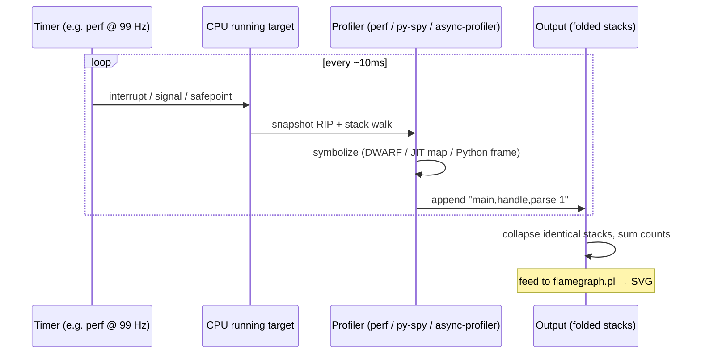
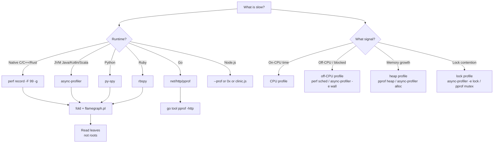

# Profiling

## Why This Exists

**Problem.** You can see *that* a system is slow — dashboards say p99 is up, CPU is at 80%, throughput is half what it was last week. None of that tells you *which line of code* to change. Logs and metrics are aggregate; they collapse the call graph into scalars. To fix a hot path you need attribution at the function or instruction level, ideally with the call stack, ideally without changing the binary, ideally in production.

**Key insight.** Almost all useful production profilers work by **statistical sampling of stack traces** (typically 99 Hz or 999 Hz, intentionally co-prime with common timer frequencies to avoid lockstep aliasing). They don't time every function call — they take periodic photographs of "what is on CPU right now?" or "who holds this lock right now?" and aggregate. Instrumentation profilers (call counts, every entry/exit) give exact counts but distort hot paths so badly that the measurement *is* the bottleneck. **Sampling profilers are the default; instrumentation profilers are a microbenchmark tool.** Brendan Gregg's flame graph is a visualization that turns sampled stacks into something you can actually read — width is time on CPU, the y-axis is stack depth, and you read it top-down to find leaves that consume real wall time.

**Reach for this when:**
- p50 looks fine, p99 spiked, and dashboards can't tell you why.
- A service "got slow" between deploys and you need to compare *before* and *after* (differential / delta profile).
- One worker pegs a single core; you suspect a hot Python/Ruby loop or a runaway regex.
- The JVM shows 30% CPU but terrible throughput — likely lock contention or safepoint pauses, not CPU.
- A Go service is allocating heavily and GC scan time is eating latency budget.
- You don't know if you are CPU-bound, memory-bandwidth-bound, lock-bound, or syscall-bound.
- A microservice spends most of its time in `epoll_wait` and you need *off-CPU* analysis, not just on-CPU.

**Don't reach for this when:**
- You have no baseline. Profile a known-good run first; otherwise everything looks "hot."
- The slowness is across services. Distributed tracing (OpenTelemetry, X-Ray, Jaeger) attributes *latency between nodes*; profilers attribute *CPU within one node*. Use both, but start with the trace.
- You suspect a network or disk problem. `tcpdump`, `iostat`, `bpftrace`, and queue-depth metrics will get there faster.
- You can reproduce the bug deterministically in a unit test. Just step through it.

## Diagrams

### How sampling profilers actually work



### Choosing a profiler by runtime and signal



## Core content

### 1. Sampling vs instrumentation — pick the right tool

| Approach | What it measures | Overhead | Distortion | When to use |
|---|---|---|---|---|
| **Sampling** (perf, py-spy, async-profiler, pprof CPU) | Statistical estimate of where time is spent | 1–5% typical | Low; long-tail functions may be missed | Production. Default. |
| **Instrumentation** (cProfile, JFR with high detail, gprof, Java agents that intercept every method) | Exact call counts and per-call duration | 10–100%+ | High; tiny functions get inflated | Microbenchmarks, correctness debugging, never production. |
| **Tracing** (eBPF uprobes, dtrace, USDT, JFR events) | Specific events you ask for | Variable; per-event cost | Low if event rate is bounded | Targeted ("how often does this code path run?"). |
| **Hardware counters** (perf with `cycles`, `instructions`, `cache-misses`) | What the CPU was actually doing | ~0%, hardware-supported | None | Cache-bound or branch-predictor-bound code. |

**Default rule:** if you don't already know which line is slow, start with a **sampled CPU flame graph at 99 Hz for 30–60 seconds**. That single artifact answers most questions.

### 2. Native (C/C++/Rust): `perf` + flame graphs

Brendan Gregg's canonical recipe. Run on the host, not in a container without privileges (you need `CAP_SYS_ADMIN` or `kernel.perf_event_paranoid <= 1`):

```bash
# Record 30 seconds of stack samples at 99 Hz, all CPUs, with call graphs.
# -F 99 = 99 Hz (co-prime with 100 Hz timer; avoids lockstep aliasing)
# -g    = capture stack traces
# --call-graph dwarf = use DWARF unwinding (slower but works without -fno-omit-frame-pointer)
sudo perf record -F 99 -a -g --call-graph dwarf -- sleep 30

# Convert to folded stacks and render
perf script > out.perf
git clone https://github.com/brendangregg/FlameGraph
./FlameGraph/stackcollapse-perf.pl out.perf > out.folded
./FlameGraph/flamegraph.pl out.folded > flame.svg
```

**Reading a flame graph (this is the part most people get wrong):**

- **Width = total time on CPU.** Wider bars are more samples, period. Order along the x-axis is alphabetical, not chronological. **Do not infer a timeline.**
- **Height = stack depth.** Tall towers are deep call stacks; that's not inherently bad.
- **Look at the leaves (top of each tower).** A wide *root* like `main` is meaningless — of course `main` ran the whole time. A wide *leaf* like `memcpy` or `__lll_lock_wait` is your answer.
- **Plateaus matter.** A wide flat top means that one function is genuinely doing the work. A jagged top means the cost is spread across callees and you should look one frame down.

If your flame graph is full of `[unknown]` frames: you're missing frame pointers (compile with `-fno-omit-frame-pointer`) or DWARF info (`-g` at compile time, don't strip). For JIT'd languages you need a perf map file (see JVM section).

### 3. JVM: async-profiler

`async-profiler` (Andrei Pangin) is the standard production JVM profiler. It uses `AsyncGetCallTrace` instead of `JVMTI`, which means it does *not* require safepoints — so it sees code that traditional profilers miss (the code that's running between safepoints, which is often the hot code).

```bash
# Attach to a running JVM, profile CPU for 30s, output flame graph
./profiler.sh -d 30 -f cpu.html <pid>

# Profile lock contention (who is waiting on what monitor)
./profiler.sh -d 30 -e lock -f lock.html <pid>

# Profile allocation (TLAB-sampled; near-zero overhead)
./profiler.sh -d 30 -e alloc -f alloc.html <pid>

# Wall-clock profile — includes off-CPU time (sleeping threads, blocked I/O).
# Critical for "service is slow but CPU is low" — that's I/O wait or lock wait.
./profiler.sh -d 30 -e wall -f wall.html <pid>
```

**JVM gotchas:**
- Run with `-XX:+UnlockDiagnosticVMOptions -XX:+DebugNonSafepoints` to get accurate line numbers in JIT'd code. Without this, samples land on the next safepoint, not the actual hot instruction.
- A *safepoint bias* without `DebugNonSafepoints` will show your loops as costing nothing and the safepoint poll as costing everything. This is the most common JVM profiling mistake.
- For Kotlin coroutines and reactive code, `-e wall` is usually what you want; `-e cpu` shows nothing because the work is fragmented across continuations.

### 4. Python: py-spy

`py-spy` (Ben Frederickson) reads another process's memory to walk the Python frame stack — no code change, no `import`, no GIL impact. This is the only way to profile a production Python service safely.

```bash
# 30 second flame graph from a running process
py-spy record -o flame.svg --pid <pid> --duration 30

# See what each thread is doing right now (like top, for Python)
py-spy top --pid <pid>

# Native + Python frames combined (catches time spent in C extensions like numpy, lxml)
py-spy record -o flame.svg --pid <pid> --duration 30 --native

# Profile subprocesses too (gunicorn workers, multiprocessing)
py-spy record -o flame.svg --pid <pid> --subprocesses --duration 30
```

**`--native` is the killer feature.** A pure Python flame graph on a numpy-heavy workload will show all the time in `numpy.ndarray.__matmul__` and you'll learn nothing. With `--native`, you see the BLAS call inside that, and now you know whether to switch BLAS implementations or restructure your matrices.

### 5. Ruby: rbspy

`rbspy` (Julia Evans) is the same idea as py-spy, for MRI Ruby. Same tradeoffs, same usage:

```bash
rbspy record --pid <pid> --duration 30 --format flamegraph --file flame.svg
```

Use it for Rails workers, Sidekiq jobs, anything where you can't restart the process to add a profiler gem.

### 6. Go: built-in `net/http/pprof`

Go's runtime is profiling-aware. Add one import and you get CPU, heap, goroutine, mutex, and block profiles over HTTP:

```go
import (
    "net/http"
    _ "net/http/pprof" // registers /debug/pprof/* handlers
)

func main() {
    go func() {
        // Bind to localhost only; never expose pprof to the public internet.
        // It leaks goroutine names, command-line args, and is a DoS vector.
        _ = http.ListenAndServe("127.0.0.1:6060", nil)
    }()
    // ... rest of your service
}
```

```bash
# 30s CPU profile, open interactive web UI
go tool pprof -http=:8080 http://localhost:6060/debug/pprof/profile?seconds=30

# Heap (in-use memory right now)
go tool pprof -http=:8080 http://localhost:6060/debug/pprof/heap

# Heap (cumulative allocations — find allocation hotspots even if freed)
go tool pprof -http=:8080 -alloc_objects http://localhost:6060/debug/pprof/heap

# Goroutine stacks (for "why are there 50,000 goroutines?")
curl http://localhost:6060/debug/pprof/goroutine?debug=2

# Mutex contention (must enable: runtime.SetMutexProfileFraction(5))
go tool pprof -http=:8080 http://localhost:6060/debug/pprof/mutex

# Block profile (must enable: runtime.SetBlockProfileRate(10000))
go tool pprof -http=:8080 http://localhost:6060/debug/pprof/block
```

The `-http` mode gives you flame graphs, top tables, source views, and graph views. Use it. The TUI is fine for quick triage but the web UI is where you actually solve problems.

### 7. Differential / delta profiles — the deploy regression killer

You deployed and p99 went from 80ms to 140ms. You have two flame graphs. Subtracting them shows you exactly which function got slower:

```bash
# Capture before and after on equivalent load
go tool pprof -proto -output=before.pb.gz "http://before-host:6060/debug/pprof/profile?seconds=60"
go tool pprof -proto -output=after.pb.gz  "http://after-host:6060/debug/pprof/profile?seconds=60"

# Differential view (red = got slower, green = got faster)
go tool pprof -http=:8080 -base=before.pb.gz after.pb.gz
```

For native / `perf`-based workflows, Brendan Gregg's `difffolded.pl` does the same:

```bash
./FlameGraph/difffolded.pl before.folded after.folded | \
    ./FlameGraph/flamegraph.pl --negate > diff.svg
```

A differential flame graph is **the single most valuable artifact** for triaging a regression. It collapses "what changed?" into one image. Capture profiles continuously in production (continuous profiling, e.g. Pyroscope, Polar Signals, Datadog Profiler, Google Cloud Profiler) so you always have a "before" to compare against.

### 8. Memory profiling — three different questions

Memory profilers answer at least three distinct questions; pick the right one:

1. **"What is allocated *right now*?"** — heap snapshot. `pprof heap`, JVM heap dump, `tracemalloc` snapshot. Best for memory leaks.
2. **"Where did all these allocations come from over the last minute?"** — allocation profile. `pprof -alloc_objects`, `async-profiler -e alloc`, `memray` flow mode. Best for GC pressure.
3. **"What is the *peak* memory and what was on the heap when we hit it?"** — high-water mark. `memray` (Bloomberg, Python), `heaptrack` (Milian Wolff, native). Best for OOM kills.

If you are getting OOM-killed, the first thing you want is question 3. `pmap`, `ps`, and Prometheus RSS metrics tell you *that* you're using memory; only an allocation/heap profile tells you *who is using it*.

### 9. Lock and off-CPU profiling — the "low CPU but slow" case

A service at 20% CPU with bad p99 is almost always one of:
- **Lock contention** — threads serialized on a mutex.
- **GC pause** — JVM/Go/Node.js stop-the-world.
- **Off-CPU wait** — blocked on I/O, network, child process, syscall.

On-CPU profiling sees *none* of this. You need:

- **JVM:** `async-profiler -e lock` (contended monitors), `-e wall` (everything including waits), JFR `jdk.JavaMonitorWait` events.
- **Go:** `runtime.SetMutexProfileFraction(5)` + `pprof mutex`, `runtime.SetBlockProfileRate(10000)` + `pprof block`. Block profile catches channel waits, select waits, sync.Cond waits.
- **Native:** `perf record -e sched:sched_switch -g` + Gregg's off-CPU flame graph methodology, or eBPF tools like `offcputime-bpfcc`.
- **Python:** `py-spy --idle` to include threads waiting on the GIL or I/O.

Off-CPU flame graphs are read the same way as on-CPU: width = time, leaves = waiters. A wide `futex_wait` leaf means lock contention; a wide `epoll_wait` leaf is just an idle event loop and is fine.

### 10. eBPF — the modern lower bound

For Linux 4.9+ (basically anything modern), eBPF (`bpftrace`, `bcc`, `parca`, `pyroscope eBPF`) lets you profile across all processes on a host with near-zero overhead and no agent injection. The big wins:

- **System-wide CPU flame graphs without recompiling anything:** `profile-bpfcc -F 99 30`.
- **Per-syscall latency histograms:** `funclatency-bpfcc -u 'libc:read'`.
- **Off-CPU flame graphs without `perf sched`:** `offcputime-bpfcc 30`.
- **Continuous, low-overhead profiling for fleet-wide use** (Parca, Polar Signals, Pyroscope eBPF mode).

eBPF is the future of production profiling — the cost model finally makes "always-on" feasible. The downside is a steeper learning curve and some kernel-version sensitivity.

## Trade-offs

| Benefit | Cost |
|---|---|
| Sampling at 99 Hz catches the hot paths | Functions called <1% of the time may not appear at all |
| `perf record` is system-wide and language-agnostic | Requires kernel privileges; needs frame pointers or DWARF for unwinding |
| `async-profiler` avoids safepoint bias | JVM-only; needs `+DebugNonSafepoints` for accurate line numbers |
| `py-spy` / `rbspy` need no code change and no restart | Cannot profile inside `eval`, dynamically generated code may show as `<unknown>` |
| pprof is built into Go and trivially exposed | Mutex and block profiles require explicit `SetMutexProfileFraction`/`SetBlockProfileRate` calls |
| Flame graphs compress hours of samples into one image | They have no time axis — you cannot see "this got slow at 14:32" |
| Differential profiles pinpoint regressions | Need comparable load on both sides; otherwise the diff is noise |
| Continuous profiling (Pyroscope, Parca) gives you "before" automatically | Storage and indexing cost; ~1–2% steady CPU overhead per host |
| eBPF is system-wide and ~free | Requires recent kernel; debugging eBPF programs themselves is painful |
| Instrumentation profiling gives exact counts | Distorts the program so badly that the profile no longer reflects production behavior |

## Common Pitfalls

- **Profiling without a baseline.** "This function is 8% of CPU" is meaningless until you compare it to a known-good run. Capture profiles in steady state *before* you have a problem.
- **Reading flame graphs left-to-right as a timeline.** They aren't a timeline. The x-axis is alphabetical sort to keep stacks adjacent. If you need a timeline, use a Chrome trace / `perfetto` / `pprof -trace`.
- **Looking at the root, not the leaves.** Of course `main` is 100% wide. The answer is at the top of the towers.
- **Trusting CPU% as a proxy for "busy."** A service can be 100% CPU and idle (spinlock), or 5% CPU and saturated (lock-bound, I/O-bound, GC-bound). You need on-CPU *and* off-CPU profiling.
- **Using `cProfile` in production Python.** It's instrumentation; overhead is 30%+ on hot paths and the resulting profile shows the overhead, not the workload. Use `py-spy`.
- **Forgetting `--native` with py-spy on numpy/pandas/lxml workloads.** All you'll see is `_run` and you'll miss the entire BLAS call.
- **JVM safepoint bias.** Without `-XX:+DebugNonSafepoints`, every sample lands on the next safepoint poll, not the actual hot instruction. Your tight loop will look free; the loop header will look expensive.
- **Profiling a debug build.** Optimizations dramatically reshape the call graph; a profile of `-O0` code is irrelevant to `-O2` production.
- **Symbol stripping.** Stripped binaries produce flame graphs full of `0x7f...` hex addresses. Keep separate debug-info files (`objcopy --only-keep-debug`) and ship them to your symbolizer.
- **Frame pointer omission.** With `-fomit-frame-pointer` (the default at `-O2` on many distros), `perf` cannot walk the stack without DWARF, which is slower and less reliable. Build production binaries with `-fno-omit-frame-pointer` for x86_64.
- **Profiling under a non-representative load.** A profile under 1 RPS load tells you nothing about the 1000 RPS hot paths. Replay production traffic or use a realistic load generator.
- **Exposing `/debug/pprof` to the internet.** It leaks goroutine names, env vars, and is a CPU-burn DoS vector. Always bind to localhost or auth-gate it.
- **Confusing allocation rate with retained heap.** A service that allocates 10 GB/s and frees it all is fine for a leak hunt but terrible for GC. Look at *both* questions.
- **Treating a single 30-second profile as truth.** Workloads shift. Capture multiple profiles across the day, or use continuous profiling.

## Decision Table

| Symptom | Reach for | Skip |
|---|---|---|
| p99 spike, single service, CPU correlates | On-CPU flame graph (perf / async-profiler / py-spy / pprof) | Logs, instrumentation profilers |
| p99 spike, CPU is flat | Off-CPU / wall-clock profile, lock profile | On-CPU profile (it'll be empty) |
| Slow after deploy | Differential profile (before vs after) | Reading two flame graphs side-by-side by eye |
| Memory grows unbounded | Heap profile / `pprof heap` / `memray` flow mode | Allocation profile alone (won't show retention) |
| GC pauses dominate latency | Allocation profile (`-alloc_objects`, async-profiler `-e alloc`) | Heap snapshot |
| One Python worker pegs one core | `py-spy top` then `py-spy record --native` | cProfile, line_profiler in production |
| JVM at 30% CPU but bad throughput | `async-profiler -e lock` and `-e wall` | CPU profile only |
| Many goroutines, unclear why | `/debug/pprof/goroutine?debug=2` | CPU profile |
| Cross-service latency | Distributed trace (OpenTelemetry / Jaeger / X-Ray) | Single-host profiler |
| You suspect cache misses or branch mispredicts | `perf stat -e cache-misses,branch-misses` then `perf record -e cache-misses` | Time-based profile |
| Need profile of all processes on a host | eBPF (`profile-bpfcc`, Parca, Pyroscope eBPF) | Per-process attach |
| Need "always-on" production profiling | Continuous profiler (Pyroscope, Polar Signals, Datadog Profiler, GCP Profiler) | Ad-hoc captures |
| Microbenchmarking a hot function | Instrumentation (Google Benchmark, JMH, criterion.rs, pyperf) | Sampling (resolution too coarse) |
| Profiling Node.js | `--prof` + `--prof-process`, `0x`, `clinic.js`, or Chrome DevTools attach | py-spy / async-profiler (wrong runtime) |

## References

- Gregg, B. — *The Flame Graph* (Communications of the ACM, June 2016) — https://queue.acm.org/detail.cfm?id=2927301
- Gregg, B. — *Flame Graphs* (canonical homepage) — https://www.brendangregg.com/flamegraphs.html
- Gregg, B. — *Off-CPU Flame Graphs* — https://www.brendangregg.com/offcpuanalysis.html
- Gregg, B. — *Systems Performance: Enterprise and the Cloud, 2nd ed* (Addison-Wesley, 2020) — book reference, esp. ch. 6 (CPUs) and ch. 13 (perf).
- Gregg, B. — *BPF Performance Tools* (Addison-Wesley, 2019) — eBPF profiling reference.
- Linux kernel docs — `perf` tutorial — https://perf.wiki.kernel.org/index.php/Tutorial
- Pangin, A. — `async-profiler` — https://github.com/async-profiler/async-profiler
- Frederickson, B. — `py-spy` — https://github.com/benfred/py-spy
- Evans, J. — `rbspy` — https://github.com/rbspy/rbspy
- Go team — `net/http/pprof` docs — https://pkg.go.dev/net/http/pprof
- Go team — *Profiling Go Programs* (Go blog) — https://go.dev/blog/pprof
- Google — `pprof` (the tool, language-agnostic protocol) — https://github.com/google/pprof
- Bloomberg — `memray` — https://github.com/bloomberg/memray
- Wolff, M. — `heaptrack` — https://github.com/KDE/heaptrack
- IOVisor — `bcc` (BPF Compiler Collection) — https://github.com/iovisor/bcc
- Iovisor — `bpftrace` — https://github.com/iovisor/bpftrace
- Parca — continuous profiling with eBPF — https://www.parca.dev/docs/
- Pyroscope — continuous profiling — https://grafana.com/docs/pyroscope/latest/
- AWS Builders' Library — *Instrumenting distributed systems for operational visibility* — https://aws.amazon.com/builders-library/instrumenting-distributed-systems-for-operational-visibility/
- Google SRE Book — ch. 6 *Monitoring Distributed Systems* — https://sre.google/sre-book/monitoring-distributed-systems/
- Google SRE Workbook — ch. 4 *Monitoring* — https://sre.google/workbook/monitoring/
- Oracle — *JDK Flight Recorder* — https://docs.oracle.com/en/java/javase/21/jfapi/flight-recorder.html
- Intel — *VTune Profiler User Guide* — https://www.intel.com/content/www/us/en/docs/vtune-profiler/user-guide/current/overview.html

## See Also

- `../caching/` — once you've identified hot paths, this is often the fix
- `../tail-latency/` — knowing your p99 target tells you when to stop optimizing
- `../tracing/` — cross-service latency attribution; pair with profilers
- `../../reliability/observability/` — RED/USE method dashboards that point you at *which* host to profile
