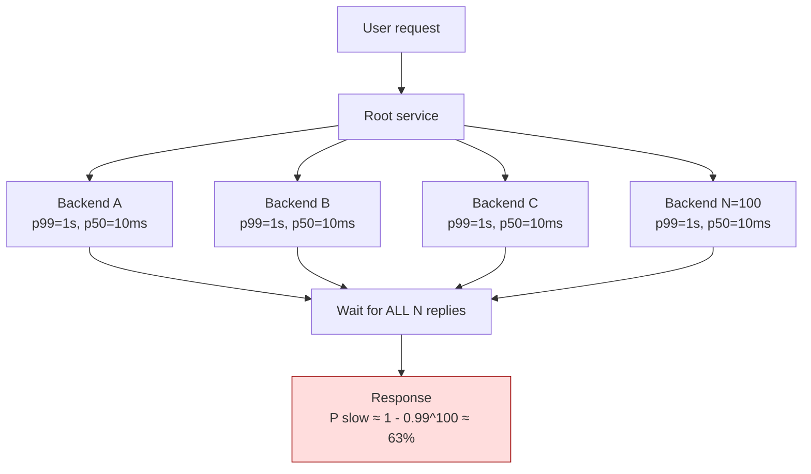
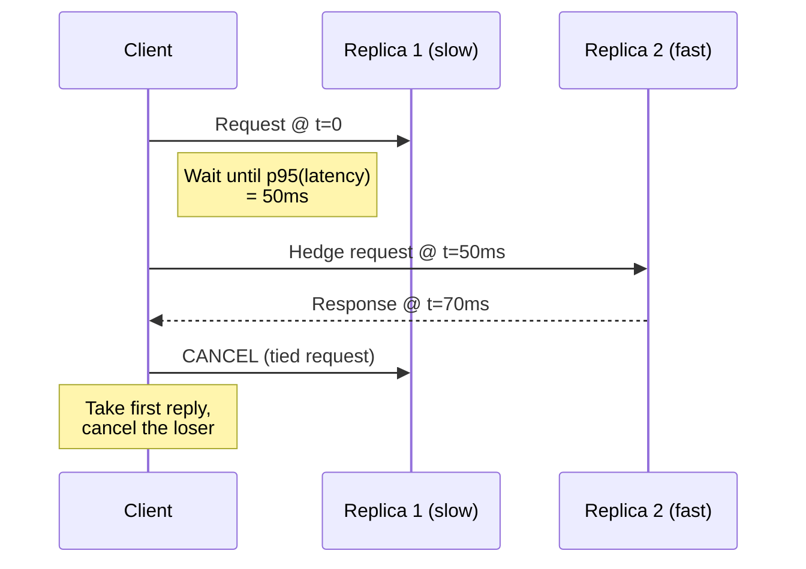
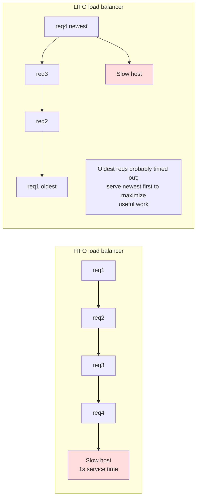

# Tail Latency

> "The service of a request is often subject to many sources of variability... At scale, the rare slow response becomes common."
> — Dean & Barroso, *The Tail at Scale*, CACM 2013

## Why This Exists

**Problem.** Latency distributions in real systems are **not Gaussian**. They have heavy right tails caused by GC pauses, lock contention, cold caches, retries, packet loss, NUMA effects, kernel scheduling, hot-key skew, and shared-resource contention (CPU steal, disk seeks, network queues). The mean and p50 hide all of this. **p99, p99.9, and p99.99 are where users live**, especially when a single user request fans out to many backends.

**Key insight.** If a single backend has 1% probability of being slow (>1 s), then a user request that fans out to 100 backends in parallel will be slow with probability **1 − 0.99¹⁰⁰ ≈ 63%**. Tail latency does not average out as you scale fan-out — it **amplifies**. This is the central observation of Dean & Barroso 2013, and it's why the same backend that serves 99% of requests in 10 ms can produce a service that serves 50% of pages in 1 s.

**Reach for this when:**
- Your **p50 is healthy but p99 is 10–100× worse** and getting worse as you add replicas or shards.
- A request **fans out** to many backends (search, ad ranking, ML feature stores, microservice meshes).
- You see **periodic latency spikes** correlated with GC, compaction, scheduled jobs, or cron.
- Adding **retries** made things worse (retry storm) or made p99 worse (head-of-line blocking on retries).
- A **load balancer** sends traffic to a slow host and amplifies the problem rather than routing around it.
- **Queue depth** grows under steady offered load — a sign of bursty service times.

**Don't reach for this when:**
- p50 is also bad — that's a **throughput / capacity** problem, not a tail problem. Fix the median first.
- You haven't measured the distribution. **No histogram, no diagnosis.** Stop and instrument first (HDR histograms, `t-digest`, or Prometheus histogram buckets covering up to p99.99).
- Single-user, low-fan-out systems where p99 ≈ p50. Hedging there just doubles cost for nothing.
- The slow path is **always slow** (a missing index, a hot lock). That's a code/design bug, not statistical tail.

## Diagrams

### Fan-out amplifies the tail



### Hedged request: send a second request after the p95 of the first



### LIFO vs FIFO under a slow host



## Core Patterns

### 1. Measure the distribution, not the average

```python
# WRONG: averages lie
avg_latency = sum(latencies) / len(latencies)  # tells you nothing

# RIGHT: log-linear histogram, bucketed up to p99.99
# Use HdrHistogram (Java/Go/Python/Rust) or t-digest. Record AT THE SOURCE.
from hdrhistogram import HdrHistogram

# track 1us..60s with 3 sig figs (~2KB per histogram)
h = HdrHistogram(1, 60_000_000, 3)

def record(latency_us: int) -> None:
    h.record_value(latency_us)

def report() -> dict:
    return {
        "p50":   h.get_value_at_percentile(50.0),
        "p90":   h.get_value_at_percentile(90.0),
        "p99":   h.get_value_at_percentile(99.0),
        "p99.9": h.get_value_at_percentile(99.9),
        "p99.99": h.get_value_at_percentile(99.99),
        "max":   h.get_max_value(),
    }
```

**Critical: avoid coordinated omission.** If you measure latency only when you successfully send a request, you systematically miss the periods where the system was hung. Record **intended send time vs actual completion time**, not "time the request actually started executing minus time it finished". Tools like `wrk2` and HdrHistogram's `recordValueWithExpectedInterval` correct for this; naive `time.now() - start` does not.

### 2. Hedged requests (Dean & Barroso §3.1)

Send a backup request after a delay equal to the **p95 of normal latency**. Take the first reply, cancel the loser. Cost: ~5% extra load. Benefit: p99 collapses toward p95.

```go
// Hedged read across N replicas. Cancel losers via context.
func HedgedGet(ctx context.Context, key string, replicas []Replica, hedgeAfter time.Duration) ([]byte, error) {
    ctx, cancel := context.WithCancel(ctx)
    defer cancel() // cancels ALL outstanding when we return

    type result struct {
        data []byte
        err  error
    }
    out := make(chan result, len(replicas))

    // primary
    go func() {
        data, err := replicas[0].Get(ctx, key)
        select {
        case out <- result{data, err}:
        case <-ctx.Done():
        }
    }()

    // hedge timer
    timer := time.NewTimer(hedgeAfter)
    defer timer.Stop()

    select {
    case r := <-out:
        return r.data, r.err
    case <-timer.C:
        // primary still pending; fire hedge to next replica
        go func() {
            data, err := replicas[1].Get(ctx, key)
            select {
            case out <- result{data, err}:
            case <-ctx.Done():
            }
        }()
    case <-ctx.Done():
        return nil, ctx.Err()
    }

    // first to finish wins; ctx cancellation reaps the loser
    r := <-out
    return r.data, r.err
}
```

**Tuning rule (Dean & Barroso):** set the hedge delay to the **95th percentile of expected latency**. Hedge fan-out should add roughly **(100 − p) %** extra load — i.e. ~5% if hedging at p95.

### 3. Tied requests (true cancellation)

A hedged request is wasted work if both replicas execute fully. **Tied requests** make replicas aware of each other and the loser drops the work the moment it learns it lost. Implementation: each replica enqueues the request and broadcasts "I started" to its peers; on receiving that message, the others abort their copy.

```python
# Pseudocode for tied request on the SERVER side
class TiedHandler:
    def handle(self, req):
        # req carries a unique tied-id and the addresses of peer replicas
        peers = req.peer_replicas
        with self.queue.lock:
            self.queue.enqueue(req)
            # tell peers "I have it queued" — informational
            for p in peers:
                p.send_async(EnqueuedNotice(req.tied_id))

        # wait for our turn at the front
        while not self.queue.is_front(req):
            if self.has_received_started(req.tied_id, from_peer=True):
                # a peer already started executing — drop this copy
                self.queue.remove(req)
                return  # no response; client takes the winner
            self.queue.wait()

        # we are at the front and no peer has started; broadcast STARTED
        for p in peers:
            p.send_async(StartedNotice(req.tied_id))
        return self.execute(req)
```

Google's tied requests reduced read latency at p99 by **30–40%** in BigTable while adding only **~1% extra disk reads** because the second request is canceled before it touches disk.

### 4. Canary requests (Dean & Barroso §3.4)

For very large fan-outs (thousands of leaves), don't trust any single backend not to be a poison-pill (a malformed request that crashes a leaf and is then retried, taking down all replicas). Send the request to **one or two leaves first**; only fan out to the full tree if those return cleanly.

```python
def canary_then_fanout(request, leaves, timeout_canary=50e-3, timeout_full=200e-3):
    # 1. Canary: one leaf
    canary = leaves[0].query(request, timeout=timeout_canary)
    if isinstance(canary, Crash) or canary.timed_out():
        # poison pill detected — refuse rather than crash 1000 leaves
        raise PoisonPillError(request)
    # 2. Full fan-out (canary result kept and merged)
    results = parallel_fanout(leaves[1:], request, timeout=timeout_full)
    return merge([canary] + results)
```

This is what protects production search clusters from a single bad query taking the whole index offline. **Latency cost: one extra serial leaf hop**; reliability gain: massive.

### 5. Load balancer LIFO under overload

Under steady-state, FIFO and LIFO behave the same. **Under overload**, FIFO serves the **oldest** requests first — which are the most likely to have **already timed out on the client side**. You spend CPU on dead work. LIFO serves the **newest** requests first; older queued requests get dropped or shed. Net effect: under overload, **LIFO retains more useful throughput**.

Envoy, Finagle, and Linkerd all support LIFO queuing (Envoy: `LRU` ejection + `least_request` LB; Finagle: `LIFO` deadline-aware queue). See SRE Workbook ch. 22 *Addressing Cascading Failures*.

```yaml
# Envoy: LEAST_REQUEST + slow_start + outlier detection
clusters:
- name: backend
  lb_policy: LEAST_REQUEST
  least_request_lb_config:
    choice_count: 2          # power-of-two-choices
    slow_start_config:
      slow_start_window: 60s # ramp up new hosts gradually
  outlier_detection:
    consecutive_5xx: 5
    interval: 10s
    base_ejection_time: 30s
    max_ejection_percent: 50
  circuit_breakers:
    thresholds:
    - max_pending_requests: 100  # bound the queue!
      max_requests: 1000
      max_retries: 3            # NOT unlimited
```

### 6. Power of two choices (P2C)

Random load balancing has p99 imbalance roughly **O(log n / log log n)** of the mean. **Pick two backends at random, send to the less loaded** — p99 imbalance drops to **O(log log n)**. This is nearly free and is the default in Envoy `LEAST_REQUEST`, NGINX `least_conn`, HAProxy `leastconn` (with sample), and Finagle.

```python
def p2c_pick(backends):
    a, b = random.sample(backends, 2)
    return a if a.in_flight < b.in_flight else b
```

### 7. Deadline propagation, not per-hop timeouts

Per-hop timeouts compound badly: hop A times out at 1 s, retries; hop B times out at 1 s, retries; user request takes 4 s before failing. **Propagate a deadline** (absolute wall-clock time, not duration) and have every hop check it before doing work.

```go
// gRPC propagates deadlines automatically via context.
// In HTTP, propagate via a header.
func handle(w http.ResponseWriter, r *http.Request) {
    deadline, _ := time.Parse(time.RFC3339Nano, r.Header.Get("X-Deadline"))
    if time.Now().After(deadline) {
        // already too late — don't even start
        http.Error(w, "deadline exceeded", http.StatusGatewayTimeout)
        return
    }
    ctx, cancel := context.WithDeadline(r.Context(), deadline)
    defer cancel()
    // pass ctx to every downstream call
}
```

### 8. Bound queues. Always.

Unbounded queues turn latency problems into outages. A backend that is 10% over capacity will see queue depth grow without bound; latency follows queue depth linearly (Little's Law: `L = λW`). At some point the queue eats all memory and the process dies. **Bound every queue with a small fixed size** and shed load when full.

```python
# bounded work queue with deadline-aware shedding
class BoundedQueue:
    def __init__(self, max_size: int):
        self.q = collections.deque()
        self.max = max_size
        self.cv = threading.Condition()

    def enqueue(self, req, deadline) -> bool:
        with self.cv:
            # shed if too deep OR request will be DOA
            est_wait = len(self.q) * AVG_SERVICE_TIME
            if len(self.q) >= self.max or time.monotonic() + est_wait > deadline:
                return False  # caller should fail fast / try another replica
            self.q.append((req, deadline))
            self.cv.notify()
            return True
```

### 9. Request prioritization and shedding

Not all requests are equal. Health-check requests, control plane, and user-facing requests should preempt batch / re-indexing / background work. Two-level queue with strict priority + deadline-aware drops gives you graceful degradation under overload (see SRE ch. 22).

### 10. Reduce the tail at its source

Hedging is a **mitigation**. The real fix is reducing variance:

- **GC tuning** — for JVM, switch to **ZGC** or **Shenandoah** for sub-ms pauses; for Go, accept the GC pacer but avoid huge heaps. Pre-allocate. Use object pools for hot allocators.
- **Tail-latency-aware compaction** — RocksDB / LSM databases stall writes during major compaction. Use **rate-limited compaction** and **subcompactions**.
- **Cache warming** — cold caches after deploy cause 10–100× p99. Bake warming into the deploy: serve mirrored traffic before flipping.
- **NUMA pinning** — pin threads to cores; pin queues to NUMA-local memory.
- **Avoid shared resources** — head-of-line blocking on a shared connection, shared lock, shared disk queue is the most common cause of correlated tail spikes.
- **Smaller work units** — break long-running requests into chunks. A 10 ms median request is recoverable; a 10 s median request is fatal under load.

## Trade-offs

| Benefit | Cost |
|---|---|
| Hedged requests collapse p99 toward p95 | ~5% extra load; requires idempotent backends or true cancellation |
| Tied requests give hedging benefits with ~1% extra cost | Requires inter-replica gossip; complex to implement correctly |
| Canary requests prevent fan-out crashes from poison pills | One serial hop adds ~p50 to every request |
| LIFO queuing preserves useful work under overload | Counterintuitive; older requests can starve under sustained overload |
| P2C load balancing is nearly free and fixes random imbalance | Requires accurate in-flight counters; broken by sticky sessions |
| Deadline propagation prevents retry storms | Every service must understand the deadline format and check it |
| Bounded queues prevent OOM | Requires a load-shedding response (503) clients can handle |
| Reducing source variance (GC, compaction) is the real fix | Hard, language/runtime-specific, can take quarters |
| Smaller work units shrink the tail | More RPCs, more orchestration complexity |

## Common Pitfalls

- **Measuring p99 of "successful" requests only.** You miss the timeouts and the coordinated-omission gap. Always measure **including** the requests that timed out (treat them as their timeout value or `+∞`).
- **Histogram bucket boundaries too coarse.** Prometheus default buckets stop at 10 s; if your p99 is 8.5 s the bucket is `+Inf` and you can't compute it. Use `histogram_quantile` only with **log-linear buckets** that cover at least 10× your expected p99.
- **Averaging percentiles across replicas.** `avg(p99 across hosts)` is **not** p99 of the fleet. Aggregate **histograms**, not percentiles. (See HdrHistogram `add()` or t-digest merge.)
- **Hedging non-idempotent requests** — duplicate writes, duplicate charges, duplicate emails. Hedging is for **reads** unless your write path is idempotent (with idempotency keys).
- **Retry storms.** A naive `retries: 3` policy multiplies load when the cluster is already degraded, accelerating collapse. Use **retry budgets** (e.g. retries ≤ 10% of successful RPCs) — see Finagle / Envoy retry budget; AWS Builders' Library *Timeouts, retries, and backoff with jitter*.
- **Synchronous fan-out with no per-leaf timeout.** One slow leaf holds the whole request. Set per-leaf timeouts derived from the deadline, not constants.
- **Ignoring tail amplification under fan-out.** Adding a 100th leaf when p99(leaf) = 100 ms means user p50 ≈ 100 ms (not 10 ms). The right answer is often **fewer, smarter leaves** rather than parallelism.
- **Using mean response time in autoscaling signals.** Autoscalers tied to mean latency don't react until the system is on fire. Scale on **p95/p99** or queue depth.
- **Long GC / long compaction during peak.** Schedule background work during off-peak; rate-limit; spread across replicas so no two GC together.
- **Cold cache after deploy.** Use blue-green with traffic mirroring or **gradual rollout with shadow traffic** to warm caches before flipping.
- **Static thread pools sized for p50.** A pool sized for the median saturates under p99 spikes. Either size for p99 (cheap waste) or use **adaptive concurrency** (Netflix `concurrency-limits`, see Little's Law in DDIA ch. 1).

## Decision Table

| Symptom | Diagnosis | First action |
|---|---|---|
| p50 fine, p99 spiky, fan-out request | Tail amplification | Hedged or tied requests |
| p99 spike correlates with GC log | GC pause | Switch to ZGC / Shenandoah; reduce heap; pool allocations |
| p99 spike correlates with compaction | LSM stall | Rate-limit compaction, add subcompactions, or move to tiered storage |
| One slow host poisons the whole cluster | LB sends to slow host | Outlier detection + ejection + P2C |
| Queue grows under steady load | Service rate < arrival rate (spec violation or burst) | Bound queue, shed load, autoscale on p99 |
| All replicas slow at the same time | Correlated event (cron, deploy, GC sync) | Stagger schedules; jittered timers |
| Latency increases with retries | Retry storm | Retry budget + exponential backoff with jitter |
| Tail grew after adding replicas | Fan-out amplification | Hedge, or reduce fan-out width |
| Latency jumps at deploy | Cold cache | Warm cache with mirrored traffic before flip |
| `avg latency` looks fine, users complain | You're measuring the wrong thing | Switch dashboards to p99/p99.9 histograms |
| 99% of requests fast, 1% time out at exact 30 s | Per-hop timeout, no deadline | Propagate absolute deadline |
| Slow path is poison-pill that crashes leaves | Untrusted input fan-out | Canary request before full fan-out |
| Hedging doubles backend load | Hedge delay too low / no cancellation | Set delay = p95 of normal; implement tied requests |

## References

- **Dean & Barroso — *The Tail at Scale* — CACM Feb 2013** — https://research.google/pubs/the-tail-at-scale/ — the canonical paper. Covers hedged requests, tied requests, micro-partitions, canary requests, and good rules of thumb. Read it twice.
- **Brendan Gregg — *Systems Performance* (2nd ed., 2020)** — chapters on USE method, latency distributions, tracing.
- **Gil Tene — *How NOT to Measure Latency*** — https://www.youtube.com/watch?v=lJ8ydIuPFeU — coordinated omission, why averages and p99 of broken measurements lie.
- **HdrHistogram** — http://hdrhistogram.org/ — the right way to record latency distributions.
- **Google SRE Book — ch. 22 *Addressing Cascading Failures*** — https://sre.google/sre-book/addressing-cascading-failures/ — load shedding, queue management, retry amplification.
- **Google SRE Workbook — ch. 11 *Managing Load*** — https://sre.google/workbook/managing-load/ — graceful degradation, request prioritization.
- **AWS Builders' Library — *Timeouts, retries, and backoff with jitter*** — https://aws.amazon.com/builders-library/timeouts-retries-and-backoff-with-jitter/ — Marc Brooker.
- **AWS Builders' Library — *Using load shedding to avoid overload*** — https://aws.amazon.com/builders-library/using-load-shedding-to-avoid-overload/ — David Yanacek.
- **AWS Builders' Library — *Avoiding fallback in distributed systems*** — https://aws.amazon.com/builders-library/avoiding-fallback-in-distributed-systems/ — Jacob Gabrielson.
- **Netflix — *Performance Under Load* (concurrency-limits)** — https://netflixtechblog.medium.com/performance-under-load-3e6fa9a60581 — adaptive concurrency limits in production.
- **Mitzenmacher — *The Power of Two Choices in Randomized Load Balancing* — IEEE 2001** — https://www.eecs.harvard.edu/~michaelm/postscripts/handbook2001.pdf
- **Kleppmann — *Designing Data-Intensive Applications* — ch. 1 *Reliable, Scalable, and Maintainable* (latency vs response time, percentiles); ch. 8 *The Trouble with Distributed Systems* (timeouts, unbounded delays).**
- **Adrian Colyer — *The Tail at Scale* (Morning Paper)** — https://blog.acolyer.org/2015/01/15/the-tail-at-scale/
- **Envoy — Outlier detection** — https://www.envoyproxy.io/docs/envoy/latest/intro/arch_overview/upstream/outlier
- **Twitter Finagle — Retries with budgets** — https://twitter.github.io/finagle/guide/Clients.html#retries
- **RocksDB — Tuning guide (compaction & write stalls)** — https://github.com/facebook/rocksdb/wiki/RocksDB-Tuning-Guide

## See Also

- `../caching/` — cold cache mitigations, warming strategies
- `../../communication/backpressure/` — bounded queues, load shedding, adaptive concurrency
- `../../reliability/circuit-breaker/` — failing fast vs hedging
- `../../reliability/timeouts/` — deadline propagation
