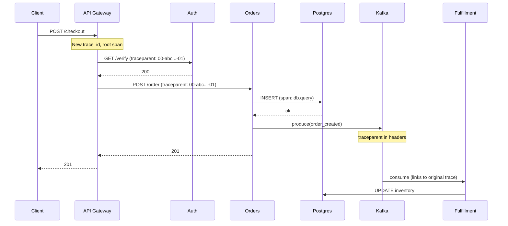
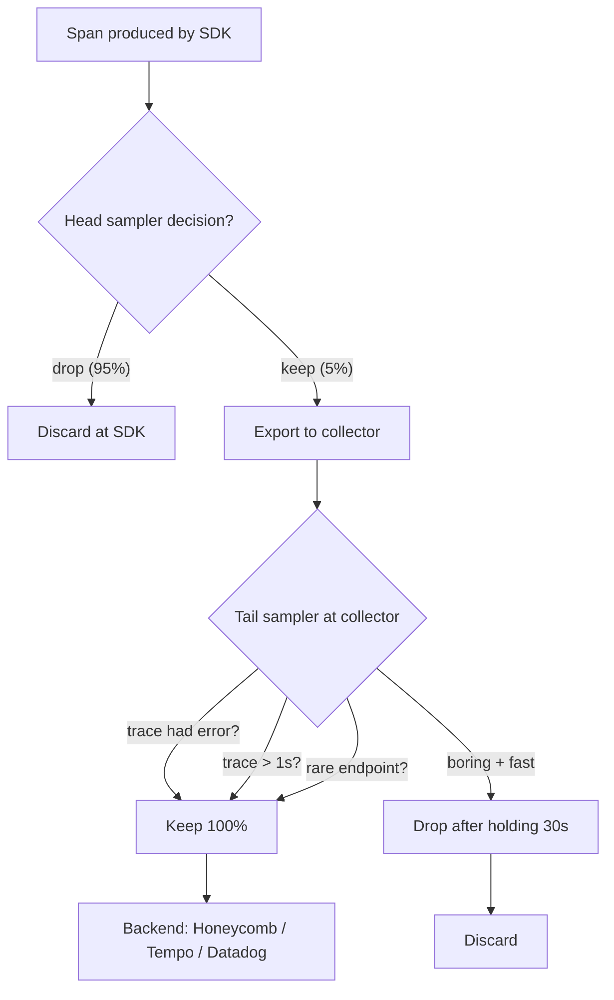
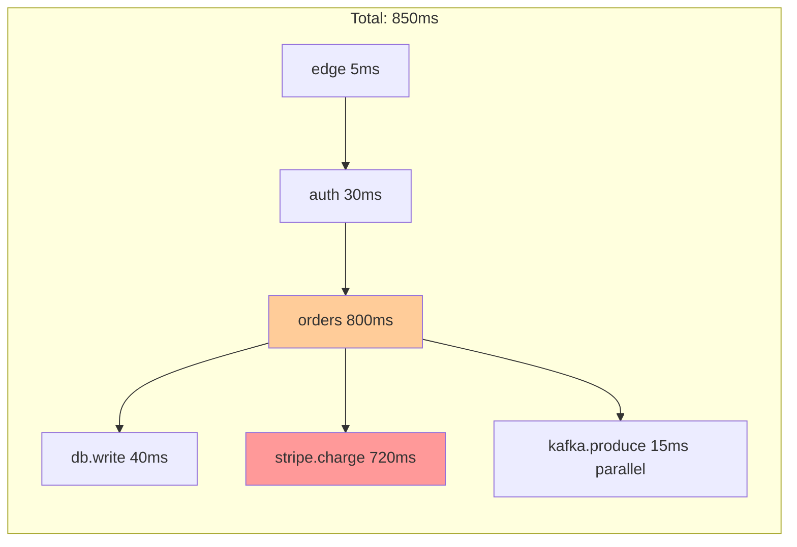

# Distributed Tracing

## Why This Exists

**Problem.** A user request hits the edge, fans out across 12 microservices, two databases, a queue, and a third-party API. p99 latency jumps from 200ms to 2.4s. Logs show nothing alarming on any single service. Metrics show elevated latency *everywhere* because every service is waiting on something downstream. You cannot answer "where did the 2 seconds go?" with logs and metrics alone — you need a per-request causal graph.

**Key insight.** A trace is a **DAG of spans tied together by a propagated trace context**. The hard part isn't visualizing it — it's (a) propagating the context across every protocol boundary (HTTP, gRPC, Kafka, SQS, Lambda, cron), (b) sampling enough to catch outliers without drowning your backend in 1TB/day of span data, and (c) correlating the trace with logs and metrics so you can pivot from "this trace is slow" to "this log line on host X-7 explains why."

**Reach for this when:**
- p99 / p99.9 latency anomalies you cannot localize from dashboards
- Cascading failures across more than 2 services
- Fan-out / fan-in amplification ("one user request → 400 DB queries")
- Mystery 500s, especially intermittent ones tied to a specific user or tenant
- Capacity planning ("which downstream is on the critical path of checkout?")
- Cold-start, retry storm, and timeout tuning
- Microservices migrations — tracing is the only sane way to map real call topology

**Don't reach for this when:**
- A monolith with one DB and one cache. Use a profiler (py-spy, async-profiler, pprof) and structured logs.
- High-cardinality counting (errors per user-agent per region per build). That's a metrics or wide-events problem (Honeycomb-style), not a span-graph problem — though OTel events on a span can bridge the gap.
- You haven't instrumented basic RED metrics yet (Rate, Errors, Duration). Tracing without metrics is a debugger without a watch window.
- Pure batch jobs where wall-clock per "request" is meaningless. Use job-level metrics and structured logs.

## Diagrams

### The trace context lifecycle



### Sampling decision flow



## OpenTelemetry: the only sane default

OpenTelemetry (OTel) is the CNCF-graduated merger of OpenTracing and OpenCensus. **Instrument once, ship to anyone.** It defines:

1. **API** — `Tracer`, `Span`, `Context`, `Baggage`. What your application code calls.
2. **SDK** — concrete implementation: span processors, exporters, samplers.
3. **Wire protocol (OTLP)** — gRPC/HTTP protobuf format the SDK speaks to a collector.
4. **Collector** — vendor-neutral pipeline: receivers → processors → exporters. Run it as a sidecar or daemonset.
5. **Semantic conventions** — standardized attribute names (`http.request.method`, `db.system`, `messaging.destination.name`). Stick to these or your dashboards break across services.

The architectural rule: **application code talks to the OTel API only**. SDK config and exporters live in bootstrap code. This keeps you vendor-portable.

### Python — server + client + DB, manual + auto

```python
# bootstrap.py — run once at process start
from opentelemetry import trace
from opentelemetry.sdk.trace import TracerProvider
from opentelemetry.sdk.trace.export import BatchSpanProcessor
from opentelemetry.sdk.resources import Resource, SERVICE_NAME, SERVICE_VERSION
from opentelemetry.exporter.otlp.proto.grpc.trace_exporter import OTLPSpanExporter
from opentelemetry.sdk.trace.sampling import ParentBased, TraceIdRatioBased
from opentelemetry.instrumentation.fastapi import FastAPIInstrumentor
from opentelemetry.instrumentation.psycopg2 import Psycopg2Instrumentor
from opentelemetry.instrumentation.requests import RequestsInstrumentor

resource = Resource.create({
    SERVICE_NAME: "orders-api",
    SERVICE_VERSION: "2026.06.01-a3f9",
    "deployment.environment": "prod",
    "service.instance.id": socket.gethostname(),
})

# ParentBased: respect upstream sampling decision; only roll dice at the root.
# Otherwise an unsampled trace at the edge mysteriously becomes "sampled" mid-graph.
sampler = ParentBased(root=TraceIdRatioBased(0.05))  # 5% head sampling

provider = TracerProvider(resource=resource, sampler=sampler)
provider.add_span_processor(
    BatchSpanProcessor(
        OTLPSpanExporter(endpoint="otel-collector:4317", insecure=True),
        max_queue_size=8192,
        max_export_batch_size=512,
        schedule_delay_millis=2000,
    )
)
trace.set_tracer_provider(provider)

# Auto-instrumentation handles 80%: HTTP server, outbound HTTP, DB driver.
FastAPIInstrumentor().instrument()
Psycopg2Instrumentor().instrument()
RequestsInstrumentor().instrument()
```

```python
# orders.py — manual spans where business logic matters
from opentelemetry import trace, baggage
from opentelemetry.trace import Status, StatusCode

tracer = trace.get_tracer(__name__)

def place_order(user_id: str, cart: Cart) -> Order:
    with tracer.start_as_current_span("orders.place_order") as span:
        # Semantic-convention-compliant attributes. Use these names exactly.
        span.set_attribute("enduser.id", user_id)
        span.set_attribute("order.item_count", len(cart.items))
        span.set_attribute("order.total_cents", cart.total_cents)

        # Baggage propagates across service boundaries — use sparingly.
        # Common use: tenant_id, feature_flag_cohort, debug_session_id.
        ctx = baggage.set_baggage("tenant.id", cart.tenant_id)

        try:
            with tracer.start_as_current_span("orders.charge") as charge_span:
                txn = stripe.charge(cart.total_cents)
                charge_span.set_attribute("payment.txn_id", txn.id)

            order = persist(user_id, cart, txn.id)
            span.set_attribute("order.id", order.id)
            # Events = timestamped logs attached to the span. Cheaper than child spans.
            span.add_event("order.persisted", {"order.id": order.id})
            return order
        except StripeDeclined as e:
            # Set status + record_exception. Don't just re-raise silently.
            span.set_status(Status(StatusCode.ERROR, "payment declined"))
            span.record_exception(e)
            raise
```

### Go — explicit context propagation

```go
// Go has no implicit context. Pass ctx everywhere or your spans become orphans.
func (s *Server) PlaceOrder(ctx context.Context, req *pb.OrderRequest) (*pb.OrderResponse, error) {
    ctx, span := s.tracer.Start(ctx, "orders.place_order",
        trace.WithAttributes(
            attribute.String("enduser.id", req.UserId),
            attribute.Int("order.item_count", len(req.Items)),
        ),
    )
    defer span.End()

    // The ctx returned from Start carries the new span. Pass IT, not the input ctx.
    txn, err := s.payments.Charge(ctx, req.TotalCents)
    if err != nil {
        span.SetStatus(codes.Error, "payment failed")
        span.RecordError(err)
        return nil, err
    }
    span.SetAttributes(attribute.String("payment.txn_id", txn.ID))

    order, err := s.repo.Insert(ctx, req, txn.ID)
    if err != nil {
        span.SetStatus(codes.Error, "db insert failed")
        span.RecordError(err)
        return nil, err
    }
    return &pb.OrderResponse{OrderId: order.ID}, nil
}
```

### Cross-protocol propagation: the part everyone gets wrong

The **W3C Trace Context** spec defines two HTTP headers:

```
traceparent: 00-4bf92f3577b34da6a3ce929d0e0e4736-00f067aa0ba902b7-01
              ^   ^                                ^                ^
              |   trace-id (16 bytes hex)          parent-span-id   flags
              version
tracestate: vendor1=opaque,vendor2=opaque
```

For non-HTTP carriers you must inject/extract manually:

```python
# Kafka producer side
from opentelemetry.propagate import inject, extract

def produce(topic: str, payload: bytes):
    headers = {}
    inject(headers)  # writes traceparent + baggage into dict
    kafka_producer.send(topic, value=payload, headers=list(headers.items()))

# Kafka consumer side
def on_message(msg):
    ctx = extract(dict(msg.headers))
    with tracer.start_as_current_span("kafka.consume", context=ctx,
                                      kind=trace.SpanKind.CONSUMER) as span:
        span.set_attribute("messaging.system", "kafka")
        span.set_attribute("messaging.destination.name", msg.topic)
        process(msg.value)
```

For async/queued work, **link** the consumer span to the producer span instead of making it a child — the producer's span has already ended. Use `Span.add_link(span_context)` per the OTel async messaging conventions.

### SpanKind matters

| Kind | When | Effect |
|---|---|---|
| `SERVER` | Inbound RPC handler | Anchors a service in the trace; pairs with CLIENT |
| `CLIENT` | Outbound RPC | Pairs with the downstream SERVER span |
| `PRODUCER` | Publish to queue/topic | Async — does not block |
| `CONSUMER` | Receive from queue/topic | Often `LINKED` to producer rather than CHILD |
| `INTERNAL` | In-process work | Default; doesn't cross a network boundary |

Vendors use `SpanKind` to color UI, compute service maps, and decide RED metrics. **Set it correctly** — auto-instrumentation usually does, manual code often does not.

## Sampling: head vs tail

You cannot store every span. A request fanning out 50x at 1k RPS produces 50k spans/s — at 1 KB/span that's 4.3 TB/day per service. Sampling is **the** operational lever.

### Head sampling

Decision made at the **root** of the trace, before any work happens. Carried in `traceparent` flags. Cheap. Deterministic. Stupid.

```python
sampler = ParentBased(root=TraceIdRatioBased(0.05))  # 5% of new traces
```

**Variants:**
- **Probability sampling** (1%, 5%) — the default; cheap, biased toward common paths.
- **Rate-limiting sampling** — N traces/sec per service. Caps cost.
- **Per-route sampling** — 100% of `/checkout`, 0.1% of `/health`. Use a custom sampler.

**Fatal flaw:** you decide before knowing the trace is interesting. The 1 trace in 10,000 with the 30-second outlier is the one you wanted, and you tossed it.

### Tail sampling

Decision made at the **collector** after the entire trace has assembled. Spans are buffered (typically 30s) until all child spans arrive, then a policy decides keep/drop.

```yaml
# otel-collector-config.yaml
processors:
  tail_sampling:
    decision_wait: 30s
    num_traces: 100000
    expected_new_traces_per_sec: 1000
    policies:
      - name: errors-policy
        type: status_code
        status_code: { status_codes: [ERROR] }
      - name: slow-policy
        type: latency
        latency: { threshold_ms: 1000 }
      - name: rare-route-policy
        type: string_attribute
        string_attribute:
          key: http.route
          values: [/checkout, /admin/.*]
          enabled_regex_matching: true
      - name: probabilistic-baseline
        type: probabilistic
        probabilistic: { sampling_percentage: 1 }

exporters:
  otlp/honeycomb:
    endpoint: api.honeycomb.io:443
    headers: { x-honeycomb-team: ${HONEYCOMB_API_KEY} }

service:
  pipelines:
    traces:
      receivers: [otlp]
      processors: [tail_sampling, batch]
      exporters: [otlp/honeycomb]
```

**Costs:**
- Memory: must buffer all spans for `decision_wait` duration. 1k traces/s × 50 spans × 1KB × 30s ≈ 1.5 GB.
- All spans of a trace **must hit the same collector instance**. Use `loadbalancingexporter` with `routing_key: traceID` in front of the tail-sampling tier.
- Late-arriving spans (consumer lag, retries) miss the window and become orphans.

### Decision: head or tail?

| Situation | Use |
|---|---|
| Cost-bound, traffic > 10k RPS, mostly debugging happy path | **Head**, 1-5%, 100% on errors via separate exporter |
| Need every error trace + every slow trace | **Tail** with error + latency policies |
| Multi-tenant SaaS, must guarantee per-tenant visibility | **Tail** with per-tenant rate limit |
| Serverless / FaaS where you can't run a stateful collector | **Head** + dynamic-sampling-per-key (Honeycomb Refinery as managed collector) |

The pragmatic answer at scale: **head-sample at 100% in dev, tail-sample in prod with error+latency+probabilistic policies**, run two collector tiers (gateway → tail-sampler).

## Critical path analysis

A trace tells you **where time went**. The critical path is the longest dependency chain — the spans you'd have to speed up to make the request faster. Speeding up anything off the critical path saves zero wall time.



In this trace, `stripe.charge` is on the critical path (720ms of an 850ms request). Optimizing the DB write from 40ms → 5ms saves nothing. The `kafka.produce` ran in parallel — it's free.

**Rules:**
1. The critical path goes through **sequential** children only. Parallel children contribute the max of their durations.
2. Self-time = span duration − sum(critical-path child durations). High self-time = the work is in this service.
3. Honeycomb, Datadog APM, and Jaeger UI all visualize this; Tempo + Grafana require manual flame-graph reading.

**War story:** team chases a 200ms p99 by optimizing a Redis call from 8ms → 2ms. p99 doesn't budge. Trace view shows the Redis call ran in parallel with a 180ms downstream HTTP call — they were optimizing off the critical path. Fix: cancel the HTTP call when the request is read-only, or move it to a background worker.

## Trace + log + metric correlation

A trace tells you "this checkout took 4 seconds." A log tells you "ConnectionPoolTimeout at 14:32:07.221." Without correlation, you do timestamp archaeology. With correlation, the trace UI links to the exact log lines.

**Mechanism:** inject `trace_id` and `span_id` into every log line. Most logging libraries support this via OTel log instrumentation:

```python
import logging
from opentelemetry.instrumentation.logging import LoggingInstrumentor

LoggingInstrumentor().instrument(set_logging_format=True)
# Now every log record gets %(otelTraceID)s %(otelSpanID)s injected.

log = logging.getLogger(__name__)
log.info("payment declined", extra={"reason": "insufficient_funds"})
# Output: 2026-06-05 14:32:07 [trace_id=abc123 span_id=def456] payment declined reason=insufficient_funds
```

In Loki / CloudWatch / Splunk, query `{trace_id="abc123"}` to retrieve every log emitted during that trace across every service.

**The other direction — exemplars.** A Prometheus histogram bucket can carry exemplars: `(trace_id, value)` pairs sampled from real requests in that bucket. Click the p99 bucket in Grafana → jump to a real slow trace.

```yaml
# Prometheus scrape config — must enable exemplars
scrape_configs:
  - job_name: orders
    static_configs: [{ targets: ['orders:9090'] }]
    # exemplars are on by default in modern Prometheus; ensure remote-write doesn't strip them.
```

## Vendor landscape

| Vendor | Storage model | Strengths | Watch out for |
|---|---|---|---|
| **Honeycomb** | Columnar, full event store, no pre-aggregation | Best UX for high-cardinality + tail debugging; BubbleUp finds outlier attributes; Refinery for tail sampling | Cost scales with event volume; not Prometheus-compatible for metrics |
| **Datadog APM** | Tag-indexed; samples kept by ingestion control | Tight metrics+APM+logs integration; service map; live tail | Cardinality limits & cost cliffs; vendor lock; APM cost/host |
| **Jaeger** | OSS; pluggable backend (Cassandra, ES, Badger) | Free; CNCF-graduated; works air-gapped; good for self-hosting | Operationally heavy; dated UI; no first-class tail sampling |
| **Tempo** (Grafana) | Object storage (S3/GCS), trace-id-only index, integrates with Loki/Mimir | Cheap at petabyte scale; excellent if already on Grafana stack | Cannot query "find slow traces matching X" — needs metric or log to find trace_id first |
| **AWS X-Ray** | Managed, integrates with Lambda/ECS/SDKs | Zero-ops on AWS; Service Lens | Limited query model; sampling rules clunky; no SQL-like search |
| **Lightstep / ServiceNow Cloud Observability** | Time-series + traces, "change intelligence" | Anomaly correlation across deploys | Smaller community vs Honeycomb/Datadog |

**Rule of thumb:**
- < 50 services, on AWS, ops-light → Datadog or AWS X-Ray.
- Care about *understanding* outliers, willing to invest in instrumentation → Honeycomb.
- Already on Grafana, cost-sensitive at scale → Tempo + Loki + Mimir.
- Air-gapped or "must own the data" → Jaeger + Cassandra/Elasticsearch.

## Baggage: powerful, dangerous

Baggage is key-value data propagated across the entire trace, available to *every* service downstream. Useful for:
- `tenant.id` for multi-tenant routing
- `debug.session_id` to enable verbose logging for one user
- `feature_flag.cohort` to correlate experiments across services

**Costs:**
1. **Wire overhead.** Baggage rides on every outbound request header. 50 keys × 100 bytes = 5KB per call. Don't stuff PII or large payloads.
2. **PII / security.** Baggage crosses trust boundaries. A debug flag set by an internal service might leak to a third-party API call. **Strip baggage at egress.**
3. **It is not authentication.** A malicious caller can set `baggage: tenant.id=admin`. Treat it as a hint, not a credential.

```python
# Strip baggage before leaving your trust boundary
from opentelemetry.baggage.propagation import W3CBaggagePropagator
from opentelemetry import context

def call_third_party(url):
    # Clear baggage from context before propagation
    ctx = context.set_value("baggage", {}, context.get_current())
    with context.attach(ctx):
        requests.get(url)  # traceparent still propagates; baggage doesn't
```

## Trade-offs

| Benefit | Cost |
|---|---|
| Per-request causal graph across services | Instrumentation effort: every protocol boundary needs propagation; queues/cron/Lambda all bite |
| Find p99/p99.9 outliers vs averages from metrics | Sampling forces a choice — head (cheap, blind) or tail (full visibility, stateful collector tier) |
| Pivot from trace → log → metric in one click | Requires `trace_id` injection in every log line and exemplars in every histogram |
| Vendor-portable instrumentation via OTel SDK | OTel SDK churn; semantic conventions still stabilizing in some domains (gen-ai, db) |
| Critical-path analysis kills off-path optimization waste | Mis-set SpanKind or wrong parent/child wiring produces wrong critical paths — and you trust them |
| Baggage propagates context across services | Baggage on the wire on every call; PII leakage risk; mistaken use as auth |
| Auto-instrumentation gives 80% coverage for free | Auto-instrumentation can double-instrument (e.g., both HTTP middleware + framework) and explode span count |
| Honeycomb-style high-cardinality enables ad-hoc debugging | Cost scales with event volume, not host count — surprise bills |

## Common Pitfalls

- **Forgetting context propagation in async code.** A `Promise`/`Future`/`asyncio.Task` started without copying the current context starts a new (orphan) trace. Most SDKs provide `context.copy_current()` helpers — use them.
- **Using `time.time()` instead of span duration.** Manual spans started but never ended (missed `defer span.End()` / `with` block) silently produce wrong durations or memory leaks in the SDK's active-span map.
- **Putting PII or unbounded data in attributes.** `span.set_attribute("user.email", ...)` violates GDPR/CCPA in most jurisdictions; `span.set_attribute("query", full_sql_with_user_input)` blows attribute size limits and exposes injection. Use `db.statement` with parameter placeholders, hash IDs.
- **Sampling at 100% in prod "to be safe."** Storage costs explode, exporter queues fill, span batches drop, and you end up with *worse* coverage than 5% would have given you. Always sample.
- **Mixing head and tail sampling without ParentBased.** A 5% head-sampled root with non-parent-based children means children re-roll the dice — you get fragments of traces.
- **Tail sampler in front of misconfigured load balancer.** Spans for the same trace land on different collector replicas, decision_wait expires, all "incomplete" traces dropped. Use `loadbalancingexporter` with trace-id consistent hashing.
- **No SpanKind on async work.** `PRODUCER`/`CONSUMER` missing → vendor service maps show no edge between services that talk via Kafka.
- **Span explosion from N+1 queries.** Looping a SQL query 1000 times produces 1000 spans inside one parent. Either batch the query (fix the N+1) or set `record_exception=False` and emit one span with `db.batch_size=1000`.
- **Trusting timestamps across services with skewed clocks.** A child span "ending after" its parent ends is a clock-skew artifact, not a bug. Use durations (monotonic) for critical-path math, not wall-clock subtraction.
- **Auto-instrumentation that wraps the same call twice.** E.g., FastAPI + Starlette + ASGI all instrumented → 3 spans for one request. Pick one layer.
- **No sampling on health-check endpoints.** `/healthz` at 1 RPS per pod × 500 pods = 500 RPS of garbage spans. Drop them at the collector with a `filter` processor before tail sampling.
- **Believing the service map.** Service maps are derived from observed spans. A rarely-called service won't appear; a misconfigured client missing `SpanKind=CLIENT` won't form an edge. Treat the map as a hypothesis.

## Decision Table

| Situation | Choose this | Not that | Why |
|---|---|---|---|
| Single monolith, 1 DB | Profiler + structured logs | Distributed tracing | Tracing overhead without payoff; one-process call stack is simpler |
| 5+ services, debugging tail latency | OTel + tail sampling | OTel + 1% head sampling | Head sampling drops the slow traces you wanted |
| Cost-bound, > 100k RPS | Head sample 1% + 100% on errors | Tail sample everything | Tail sampler memory and "all spans to one replica" requirement gets expensive fast |
| Multi-tenant SaaS, per-tenant SLOs | Tail sample with per-tenant rate limit | Global probabilistic sample | Probabilistic sampling lets a small tenant disappear from your data |
| AWS-only, Lambda-heavy, ops-light | AWS X-Ray or Datadog | Self-hosted Jaeger | X-Ray's Lambda integration is automatic; Jaeger requires you to ferry spans out |
| Need ad-hoc "group by user_agent + region" on traces | Honeycomb | Datadog APM | Honeycomb's columnar store is built for high-cardinality slicing; Datadog tag indexes hit cardinality cliffs |
| Already on Grafana + Loki, petabytes of traces | Tempo | Honeycomb | Tempo on S3 is 10–100x cheaper at scale; you query via metrics/logs to find trace_ids |
| Air-gapped, "data cannot leave premises" | Jaeger + Cassandra/ES | Any SaaS | Self-host or it doesn't ship |
| Need to find traces by content like "where customer=X" | Honeycomb / Datadog | Tempo | Tempo cannot full-text search spans; needs an external index |
| Async work via queue (Kafka, SQS) | `SpanKind=CONSUMER` + `Span.Link` to producer | Make consumer a child of producer | Producer span has already ended; child of a closed span is undefined; links are the spec'd answer |
| Debugging one specific user complaint | Baggage `debug.session_id`, force-sample those traces | Crank global sampling to 100% | Targeted vs. shotgun; baggage + sampler combo costs nothing |
| Tracing a CLI tool or batch job | Maybe just structured logs | Distributed tracing | One process, no service hops — flame graph or pprof is more useful |

## References

- OpenTelemetry — Documentation — https://opentelemetry.io/docs/
- OpenTelemetry — Specification — https://opentelemetry.io/docs/specs/otel/
- OpenTelemetry — Semantic Conventions — https://opentelemetry.io/docs/specs/semconv/
- OpenTelemetry — Sampling — https://opentelemetry.io/docs/concepts/sampling/
- OpenTelemetry Collector — Tail Sampling Processor — https://github.com/open-telemetry/opentelemetry-collector-contrib/tree/main/processor/tailsamplingprocessor
- W3C — Trace Context Specification — https://www.w3.org/TR/trace-context/
- W3C — Baggage Specification — https://www.w3.org/TR/baggage/
- Google — Dapper, a Large-Scale Distributed Systems Tracing Infrastructure (Sigelman et al., 2010) — https://research.google/pubs/dapper-a-large-scale-distributed-systems-tracing-infrastructure/
- Google SRE Book — Chapter 6: Monitoring Distributed Systems — https://sre.google/sre-book/monitoring-distributed-systems/
- Google SRE Workbook — Chapter 4: Monitoring — https://sre.google/workbook/monitoring/
- AWS Builders' Library — Instrumenting distributed systems for operational visibility — https://aws.amazon.com/builders-library/instrumenting-distributed-systems-for-operational-visibility/
- Honeycomb — Refinery (sampling proxy) — https://docs.honeycomb.io/manage-data-volume/refinery/
- Honeycomb — Observability Engineering (Majors, Fong-Jones, Miranda; O'Reilly 2022) — book
- Charity Majors — "Observability — A 3-year Retrospective" — https://thenewstack.io/observability-a-3-year-retrospective/
- Grafana Tempo — Documentation — https://grafana.com/docs/tempo/latest/
- Jaeger — Architecture — https://www.jaegertracing.io/docs/latest/architecture/
- Datadog — APM Distributed Tracing — https://docs.datadoghq.com/tracing/
- Cindy Sridharan — Distributed Systems Observability (O'Reilly 2018) — https://www.oreilly.com/library/view/distributed-systems-observability/9781492033431/
- Ben Sigelman — "Three Pillars with Zero Answers" — https://lightstep.com/blog/three-pillars-with-zero-answers-towards-a-new-scorecard-for-observability/
- Liz Fong-Jones — "What is Observability?" — https://www.honeycomb.io/blog/observability-101-terminology-and-concepts
- DDIA (Kleppmann, O'Reilly 2017) — Chapter 1 ("Reliable, Scalable, and Maintainable Applications") on observability fundamentals; Chapter 8 ("The Trouble with Distributed Systems") on the failure modes tracing helps diagnose

## See Also

- `../profiling/` — when the bottleneck is in-process CPU/memory, not cross-service
- `../caching/` — cache hits don't show up as slow spans; cache misses do
- `../../reliability/slo-sli-sla/` — SLO violations are the trigger; tracing is the diagnostic
- `../../reliability/observability/` — RED metrics are the *what*; tracing is the *where*
- `../../reliability/circuit-breaker/` — tracing is the only way to see the cascade
- `../../security/encryption-at-rest/` — what NOT to put in span attributes and baggage
