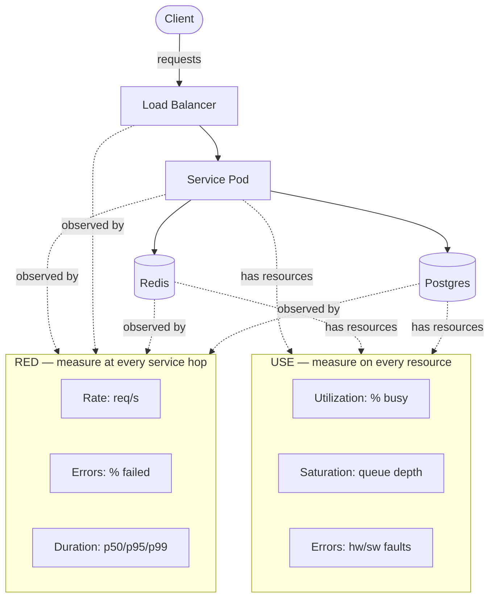
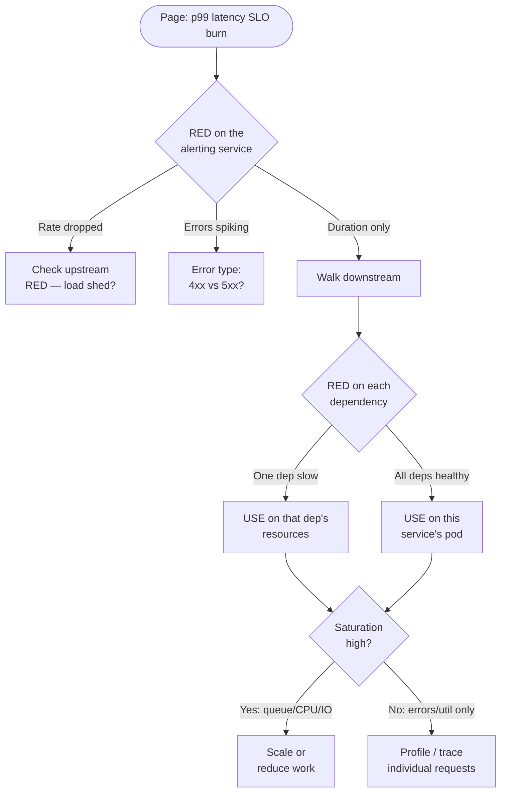
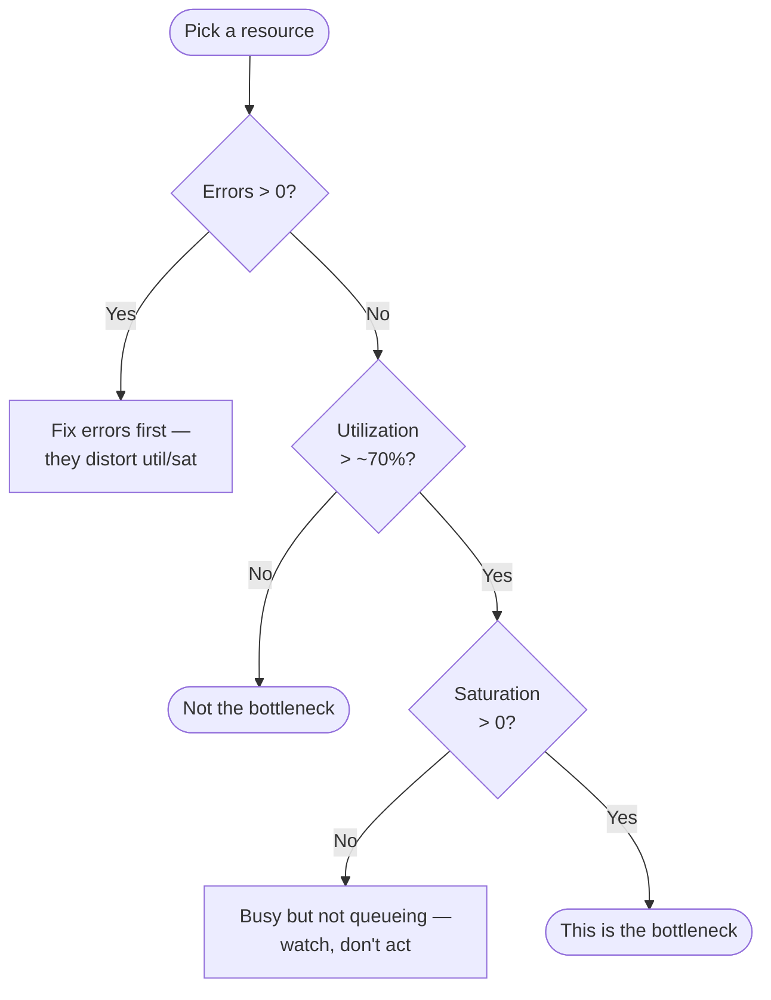

# USE / RED Methods

## Why This Exists

**Problem.** Most observability dashboards are graveyards of vanity metrics. When the pager fires at 3am, the on-call scrolls past forty graphs and still doesn't know whether the database is saturated, the upstream is failing, or a single bad host is dragging p99. Adding more metrics makes this worse, not better. Without a *methodology* for what to measure and what to look at first, you end up with high cardinality and low information.

**Key insight.** Performance investigation is a search problem with two complementary maps:

- **USE** (Utilization, Saturation, Errors) — for every **resource** (CPU, memory, disk, NIC, file descriptors, thread pools, connection pools), measure all three. Brendan Gregg's framing for finding *bottlenecks*: "for every resource, check utilization, saturation, and errors."
- **RED** (Rate, Errors, Duration) — for every **request-driven service**, measure all three. Tom Wilkie's framing for understanding *user-facing behavior*: how many requests per second, what fraction fail, and how long do they take.

Together they answer two different questions: *USE asks "is this resource the bottleneck?"* and *RED asks "are users currently being harmed?"*. Google SRE's **Four Golden Signals** (latency, traffic, errors, saturation) is essentially RED + saturation — a synthesis that maps cleanly onto both.

**Reach for this when:**
- Designing the first metrics/dashboards for a new service.
- Triaging an active incident with no clear suspect ("the site is slow").
- Auditing an existing dashboard and finding it useless during a real page.
- Setting SLIs/SLOs and need a principled way to pick the *right three or four* metrics out of hundreds.
- Capacity planning: which resource will saturate first under 2x load?
- Designing alerts that page on user impact, not on noise.

**Don't reach for this when:**
- You're debugging *correctness* bugs (wrong output, data corruption) — that's logs, traces, and tests, not USE/RED.
- You're profiling code-level hotspots inside a single process — flame graphs, perf, eBPF. USE/RED tells you *which* component to profile, not *what line* is slow.
- The system is purely batch / not request-driven and has no notion of "request rate" — RED still applies if you redefine "request" as "job", but you may need queue-depth metrics that are USE-flavored.
- You need business metrics (conversion rate, GMV) — those live above the SRE layer; don't confuse SLI dashboards with product analytics.

---

## Diagrams

### How USE and RED compose for a service + its resources



### Investigation flow during a "service is slow" page



### USE decision tree for a single resource



---

## The Three Methods, Precisely

### USE — for resources (Brendan Gregg, 2012)

For every resource, ask three questions, in this order:

| Term | Definition | Example metric |
|---|---|---|
| **Utilization** | Average time the resource was busy servicing work, as a % of wall-clock time. | CPU `%busy`, disk `%util`, NIC `bytes/s` ÷ link capacity |
| **Saturation** | The degree to which the resource has *extra work it can't service* — usually queue length or run-queue length. | `loadavg`, `vmstat r` column, disk `aqu-sz`, TCP `Recv-Q`, thread-pool active=max |
| **Errors** | Count of error events from the resource itself. | ECC errors, disk SMART, NIC drops, malloc failures |

**Why errors first?** Errors often *cause* artificial utilization (retries inflate CPU; bad blocks inflate disk service time) and saturate queues (bad NIC drops force TCP retransmits). Fixing errors makes the rest of the data interpretable.

**The full USE checklist for a typical Linux host:**

```
Resource         Utilization                Saturation              Errors
CPU              mpstat -P ALL %usr+%sys    vmstat r, runqlat       perf, ras-mc-ctl
Memory           free, vmstat si/so         vmstat si/so > 0        dmesg | grep oom
Disk I/O         iostat -xz %util           iostat aqu-sz, await    smartctl, dmesg
Network          sar -n DEV %ifutil         ifconfig overruns/drops ip -s link, ethtool
File descriptors lsof | wc / max             EMFILE in logs          accept errno
TCP sockets      ss -s                       Listen Q overflow       netstat -s segments retx
Thread pool      active/max                  queue depth             rejection counter
DB connections   in-use / pool-size          waiters > 0             checkout timeout
```

If you cannot answer all three for a resource, you have an observability gap — not a performance answer.

### RED — for request-driven services (Tom Wilkie, Weaveworks, 2015)

For every service, measure:

| Term | Definition | Prom metric shape |
|---|---|---|
| **Rate** | Requests per second the service is handling. | `sum(rate(http_requests_total[1m]))` |
| **Errors** | Requests per second that are failing. | `sum(rate(http_requests_total{code=~"5.."}[1m]))` |
| **Duration** | Distribution of how long requests take. | `histogram_quantile(0.99, rate(http_request_duration_seconds_bucket[5m]))` |

**Why these three?** They are *symptom-level* and user-visible. A user does not care that your CPU is at 90%; they care that their request was slow, failed, or never started. RED is what your **SLOs** should be built on. The Four Golden Signals adds **saturation** to flag *imminent* harm before users notice.

### Four Golden Signals (Google SRE, ch. 6)

Latency, Traffic, Errors, Saturation. Read this as **RED + saturation**: latency = duration, traffic = rate, errors = errors, plus saturation borrowed from USE because impending overload is the leading indicator that RED is about to degrade.

| Signal | What | Where it comes from |
|---|---|---|
| Latency | Time to serve a successful request (separate fail latency!) | RED |
| Traffic | Demand on the system (req/s, MB/s, sessions) | RED |
| Errors | Rate of explicit and implicit failures | RED |
| Saturation | "How full" the service is — queue depth, util ceiling | USE |

**Critical nuance from the SRE book**: track **success latency separately from failure latency**. A flood of fast 500s will *improve* your average latency while users are being harmed.

---

## Implementing It (real, runnable patterns)

### 1. Instrumenting RED on a Go HTTP service (Prometheus)

```go
package httpmw

import (
    "net/http"
    "strconv"
    "time"

    "github.com/prometheus/client_golang/prometheus"
    "github.com/prometheus/client_golang/prometheus/promauto"
)

// One histogram per service. Buckets chosen for human-scale APIs (5ms-10s).
// DO NOT use default buckets — they cluster around 1s and miss p99 detail
// for sub-100ms services.
var (
    reqDuration = promauto.NewHistogramVec(prometheus.HistogramOpts{
        Name:    "http_request_duration_seconds",
        Help:    "RED: request duration (Duration). Successes & errors separated by `code` label.",
        Buckets: prometheus.ExponentialBuckets(0.005, 2, 14), // 5ms .. ~80s
    }, []string{"method", "route", "code"})

    inflight = promauto.NewGauge(prometheus.GaugeOpts{
        Name: "http_inflight_requests",
        Help: "Saturation proxy: concurrent in-flight requests.",
    })
)

// Middleware emits Rate (count of observations), Errors (via code label),
// and Duration. `route` MUST be the matched template (`/users/:id`),
// not the raw path, or cardinality explodes.
func Instrument(route string, next http.Handler) http.Handler {
    return http.HandlerFunc(func(w http.ResponseWriter, r *http.Request) {
        inflight.Inc()
        defer inflight.Dec()

        start := time.Now()
        rw := &statusRecorder{ResponseWriter: w, status: 200}
        next.ServeHTTP(rw, r)

        reqDuration.WithLabelValues(
            r.Method,
            route,
            strconv.Itoa(rw.status),
        ).Observe(time.Since(start).Seconds())
    })
}

type statusRecorder struct {
    http.ResponseWriter
    status int
}

func (r *statusRecorder) WriteHeader(code int) {
    r.status = code
    r.ResponseWriter.WriteHeader(code)
}
```

**Why this shape:**
- One histogram, three RED-derivable queries — no separate counters to drift out of sync.
- `code` label lets you split success-latency from error-latency (golden-signals rule).
- `inflight` gauge is your service-level **saturation** signal (Little's Law: `inflight = rate * latency`, so when latency rises, inflight rises, and you can alert on it *before* the SLO burns).

### 2. The canonical PromQL for RED + saturation

```promql
# Rate (req/s, by route)
sum by (route) (
  rate(http_request_duration_seconds_count[1m])
)

# Errors as a ratio (the SLI for an availability SLO)
sum by (route) (rate(http_request_duration_seconds_count{code=~"5.."}[5m]))
/
sum by (route) (rate(http_request_duration_seconds_count[5m]))

# Duration: p99 success latency (NOT including 5xx — they distort)
histogram_quantile(0.99,
  sum by (le, route) (
    rate(http_request_duration_seconds_bucket{code=~"2.."}[5m])
  )
)

# Saturation proxy from Little's Law
http_inflight_requests
# or, derived:
sum(rate(http_request_duration_seconds_sum[1m]))
  / sum(rate(http_request_duration_seconds_count[1m]))
  * sum(rate(http_request_duration_seconds_count[1m]))
```

**Avoid `histogram_quantile` over `rate(...[1m])`** — too few samples, jumpy quantiles. Use 5m for alerting, 1m only for fast-twitch dashboards.

### 3. USE for a thread/connection pool (Java HikariCP example)

```java
// HikariCP is a connection pool — a finite resource, so USE applies.
HikariDataSource ds = ...;

// Utilization: fraction of pool currently checked out
Gauge.builder("db_pool_utilization",
        () -> (double) ds.getHikariPoolMXBean().getActiveConnections()
                      / ds.getHikariConfig().getMaximumPoolSize())
     .register(registry);

// Saturation: callers blocked waiting for a connection (queue depth)
Gauge.builder("db_pool_saturation",
        () -> ds.getHikariPoolMXBean().getThreadsAwaitingConnection())
     .register(registry);

// Errors: connection acquisition timeouts (HikariCP throws SQLTransientConnectionException)
Counter timeouts = Counter.builder("db_pool_acquire_timeouts_total")
                          .register(registry);
// (increment in your DAO catch-block when SQLTransientConnectionException is thrown)
```

When `db_pool_saturation > 0` *and* `db_pool_utilization == 1.0`, the pool is the bottleneck — **before** RED on the service has even started spiking, because requests are queued behind connection acquisition. This is exactly why USE is a leading indicator.

### 4. USE for OS resources via `node_exporter` + Prometheus

```promql
# CPU utilization (per-core, busy = 1 - idle)
1 - avg by (instance) (
  rate(node_cpu_seconds_total{mode="idle"}[1m])
)

# CPU saturation: run-queue length (loadavg / cores > 1 = saturated)
node_load1 / count by (instance) (
  node_cpu_seconds_total{mode="idle"}
)

# Memory saturation: paging activity (any swap-in is a red flag)
rate(node_vmstat_pswpin[1m])

# Disk: utilization (%busy) and saturation (avg queue size)
rate(node_disk_io_time_seconds_total[1m])         # %util
rate(node_disk_io_time_weighted_seconds_total[1m]) # ~ avg queue * util

# NIC errors
rate(node_network_receive_errs_total[1m])
+ rate(node_network_transmit_errs_total[1m])
```

### 5. Multi-window, multi-burn-rate alert on the RED-derived SLO

This is the **only** way to alert on RED that doesn't either page constantly or miss real outages. From SRE Workbook ch. 5.

```yaml
# Goal: 99.9% availability over 30 days (43m budget)
# Page if we'll burn 2% of budget in 1h (fast burn) AND
# 5% in 6h (slow burn confirmation), to suppress false positives.

groups:
- name: red-slo-availability
  rules:
  - alert: HighErrorRateFastBurn
    expr: |
      (
        sum(rate(http_request_duration_seconds_count{code=~"5.."}[1h]))
        / sum(rate(http_request_duration_seconds_count[1h]))
      ) > (14.4 * 0.001)            # 14.4x burn = 2% in 1h
      and
      (
        sum(rate(http_request_duration_seconds_count{code=~"5.."}[5m]))
        / sum(rate(http_request_duration_seconds_count[5m]))
      ) > (14.4 * 0.001)            # short window confirms, not still burning
    for: 2m
    labels: { severity: page }

  - alert: HighErrorRateSlowBurn
    expr: |
      (
        sum(rate(http_request_duration_seconds_count{code=~"5.."}[6h]))
        / sum(rate(http_request_duration_seconds_count[6h]))
      ) > (6 * 0.001)
      and
      (
        sum(rate(http_request_duration_seconds_count{code=~"5.."}[30m]))
        / sum(rate(http_request_duration_seconds_count[30m]))
      ) > (6 * 0.001)
    for: 15m
    labels: { severity: page }
```

### 6. The "RED dashboard" recipe (Grafana, one row per service)

```
Row: <service-name>
  Panel 1 (Rate):     stacked area, sum(rate(req_count[1m])) by (route)
  Panel 2 (Errors %): single stat, error_ratio with red threshold at SLO
  Panel 3 (Duration): heatmap of histogram_quantile(le, [p50, p95, p99])
  Panel 4 (Inflight): line graph of http_inflight_requests (saturation)
```

Repeat verbatim for every service. **Uniformity is the feature.** When every service has the same four panels in the same positions, the on-call's eye finds the broken one in seconds. Custom dashboards per service is an anti-pattern: it implies each service is a special snowflake at the SRE layer, which is false.

---

## Trade-offs

| Benefit | Cost |
|---|---|
| RED gives you a **user-visible symptom** signal — alerts map directly to SLOs. | RED is *lagging*: by the time duration spikes, users are already harmed. Pair with saturation. |
| USE is a **leading indicator** — saturation rises before latency does. | USE is *resource-centric*: a saturated CPU may not matter if it's an async worker the user never waits on. |
| Both methods are **finite and prescriptive** — three metrics per thing, not 200. | The discipline is hard to keep: teams add custom metrics and dashboards drift back to noise within a quarter. |
| Uniform dashboards across services → on-call cognitive load drops. | You lose service-specific nuance; some teams resent the constraint. |
| Methodology survives tech changes (k8s, lambda, edge) — same three questions. | Mapping USE to managed services (DynamoDB, Lambda) requires translation — vendor metrics rarely line up cleanly. |
| Forces you to discover **observability gaps** (no saturation metric for the thread pool? fix that). | Discovering a gap mid-incident is too late — you must do the USE/RED audit *before* you need it. |
| Works at any layer (process, host, cluster, service mesh). | Cardinality explosion is real: route × code × instance × method × tenant can OOM Prometheus. Cap labels. |
| Compatible with tracing — RED metrics tell you *that* something is slow, traces tell you *where*. | Without traces, RED only narrows to the service, not the dependency. Always pair with a tracing backend. |

---

## Common Pitfalls

- **Averages instead of histograms.** "Average latency is 80ms" hides a 5% tail at 5s. Always emit *bucketed histograms*, alert on quantiles, and look at p99/p99.9 — never the mean. Tail latency is a different distribution from average latency in real systems (Dean & Barroso, "The Tail at Scale").
- **Mixing success and error latency.** A service returning fast 500s shows up as "p99 improved" while users are being harmed. Always split by `code` and alert on success latency.
- **Path-as-label cardinality blowups.** `route="/users/123"` and `route="/users/124"` create separate time series — millions of them. Use the *matched template* (`/users/:id`). One CR with raw paths has ended Prometheus instances.
- **Forgetting saturation entirely.** Teams instrument R + E + D and skip saturation. Then the first sign of trouble is the SLO already burning. The whole *point* of saturation is the lead time.
- **Utilization without saturation = false comfort.** A CPU at 100% util may be fine (no queue, work is keeping up). A CPU at 60% with a run-queue of 8 is a problem. Util alone lies; pair with saturation.
- **USE on the wrong abstraction.** Measuring host-level CPU when your bottleneck is a per-container cgroup ceiling. Measure at the layer that *enforces the limit*, not the layer above it.
- **No errors metric on the resource.** Disk SMART errors, NIC drops, ECC events, OOM kills — these are routinely unmonitored. The "Errors" in USE is not the same as the "Errors" in RED; they're disjoint and you need both.
- **Alerting on raw thresholds instead of burn rate.** "Page when errors > 1%" pages all night during a small spike that doesn't burn budget. Use multi-window multi-burn-rate (SRE Workbook ch. 5).
- **The 200 dashboards problem.** Every team makes their own dashboard, none of them follow RED, on-call has to learn 50 layouts. Mandate a single template.
- **Vanity metrics on the SLO dashboard.** GMV, conversion rate, login count — these belong on a *product* dashboard. SLO dashboards are RED + saturation, full stop. Mixing them dilutes both.
- **No baseline.** "p99 is 800ms" — is that bad? You don't know without yesterday's, last week's, and last month's overlay. Always show comparison series.
- **Sampling in the wrong place.** Tail-sampling traces lose the slow ones; head-sampling loses errors. RED metrics should be *unsampled counters* — sample your traces, not your metrics.
- **Treating Lambda/DynamoDB/managed services as opaque.** They emit RED-equivalent metrics (`Invocations`, `Errors`, `Duration`) and saturation-equivalent (`Throttles`, `ConcurrentExecutions`). You still owe the four panels.

---

## Decision Table

| If you're trying to… | Use | Why |
|---|---|---|
| Define SLIs/SLOs for a user-facing service | **RED** | User-visible symptoms; aligns with SLO error-budget math |
| Triage "the host is on fire" | **USE** | Resource-by-resource bottleneck search |
| Set up a green-field service from scratch | **Both, in this order**: RED first (you must alert on user pain on day one), USE second (you'll need it during the first incident) | Shipping without RED means flying blind on SLOs; without USE you can't root-cause |
| Capacity-plan for a 2x traffic event | **USE** with projected load | RED tells you current pain, USE tells you which resource saturates first |
| Investigate a single slow request | **Tracing** (then USE on the slow span's host) | RED/USE are aggregate; one request needs a trace |
| Debug a wrong-answer bug | **Logs + tests** (not USE/RED) | RED/USE are performance methods; correctness is a different domain |
| Detect a noisy neighbor on shared infra | **USE** at the cgroup/VM/tenant scope | Saturation per tenant reveals the noisy one |
| Page on-call | **Burn-rate alerts on RED-derived SLOs** | RED maps to user pain; burn-rate suppresses noise |
| Compare two service versions in canary | **RED side-by-side** | Same dimensions, controlled comparison |
| Audit an existing dashboard | **The four-panel RED template** | If a dashboard isn't RED-shaped, replace it |
| Monitor an async batch worker | **USE on the queue + RED on the job** (Rate=jobs/s, Errors=failures, Duration=job latency) | RED generalizes if you redefine "request" as "unit of work" |
| Monitor a stream processor | **RED on records/sec + USE on consumer lag** | Lag IS saturation for streams |

---

## References

Primary sources only.

- Brendan Gregg — *The USE Method* (origin essay, 2012) — https://www.brendangregg.com/usemethod.html
- Brendan Gregg — *USE Method: Linux Performance Checklist* — https://www.brendangregg.com/USEmethod/use-linux.html
- Brendan Gregg — *Systems Performance: Enterprise and the Cloud, 2nd ed.* (Pearson, 2020) — chapters 2 (Methodology) and 6 (CPUs).
- Tom Wilkie — *The RED Method: How to Instrument Your Services* (Weaveworks blog, 2017) — https://www.weave.works/blog/the-red-method-key-metrics-for-microservices-architecture/
- Tom Wilkie — *Monitoring Microservices: Three Approaches* (KubeCon talk recording / slides) — https://thenewstack.io/monitoring-microservices-red-method/
- Google SRE Book — *Monitoring Distributed Systems* (ch. 6, "The Four Golden Signals") — https://sre.google/sre-book/monitoring-distributed-systems/
- Google SRE Workbook — *Alerting on SLOs* (ch. 5, multi-window multi-burn-rate) — https://sre.google/workbook/alerting-on-slos/
- Google SRE Workbook — *Implementing SLOs* (ch. 2) — https://sre.google/workbook/implementing-slos/
- Google SRE Book — *Service Level Objectives* (ch. 4) — https://sre.google/sre-book/service-level-objectives/
- Jeffrey Dean & Luiz André Barroso — *The Tail at Scale* (CACM, 2013) — https://research.google/pubs/the-tail-at-scale/
- AWS Builders' Library — *Instrumenting distributed systems for operational visibility* (David Yanacek) — https://aws.amazon.com/builders-library/instrumenting-distributed-systems-for-operational-visibility/
- AWS Builders' Library — *Using load shedding to avoid overload* — https://aws.amazon.com/builders-library/using-load-shedding-to-avoid-overload/
- Prometheus docs — *Histograms and summaries* (why histograms beat averages) — https://prometheus.io/docs/practices/histograms/
- Prometheus docs — *Instrumentation* (RED-shaped naming conventions) — https://prometheus.io/docs/practices/instrumentation/
- Cindy Sridharan — *Distributed Systems Observability* (O'Reilly, 2018) — chapters on the three pillars and how RED metrics interact with traces.
- Charity Majors — *Observability: A 3-Year Retrospective* (acmqueue, 2020) — https://queue.acm.org/detail.cfm?id=3413956
- Liz Fong-Jones — *How SLOs Make Engineers Better at Their Jobs* — https://www.honeycomb.io/blog/how-slos-make-engineers-better-jobs
- Kleppmann, *Designing Data-Intensive Applications* — ch. 1 (Reliability/Scalability/Maintainability) for the conceptual frame; ch. 11 for stream-processing latency; section on "Describing Performance" for tail-latency rationale.

---

## See Also

- `../../reliability/slo-sli-sla/` — turning RED metrics into SLIs, SLOs, and burn-rate budgets.
- `../../reliability/load-shedding/` — what to do when saturation hits ceiling.
- `../../reliability/capacity-planning/` — projecting USE forward to find the next bottleneck.
- `../../reliability/circuit-breaker/` — preventing cascading failures that show up as errors in RED.
- `../../communication/backpressure/` — saturation propagation across services.
- `../../reliability/observability/` — the logs leg of the three pillars; pair with RED.
- `../tracing/` — how to find *which span* is slow once RED tells you *which service*.
