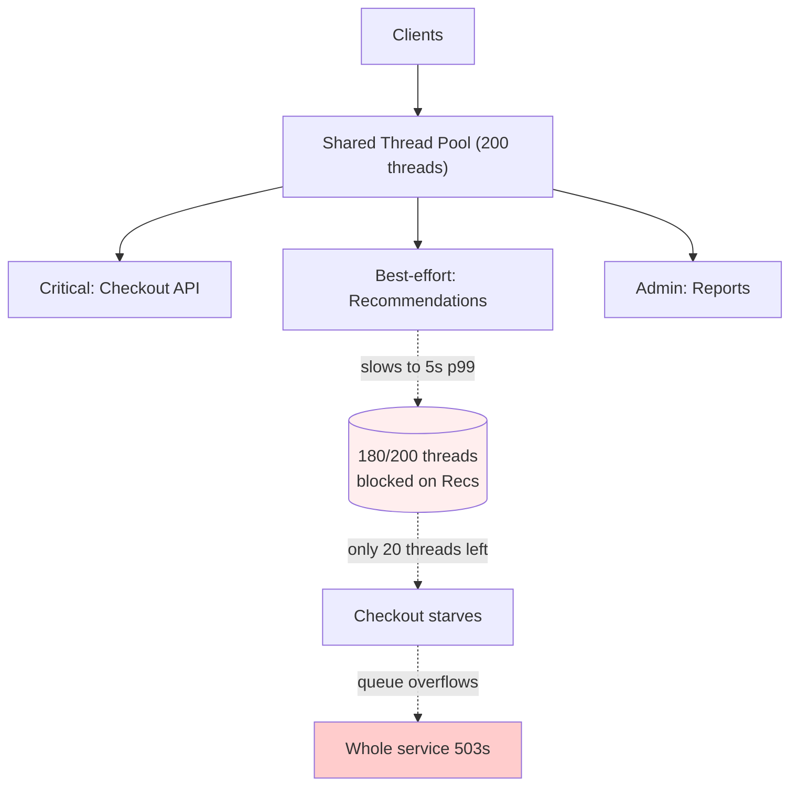
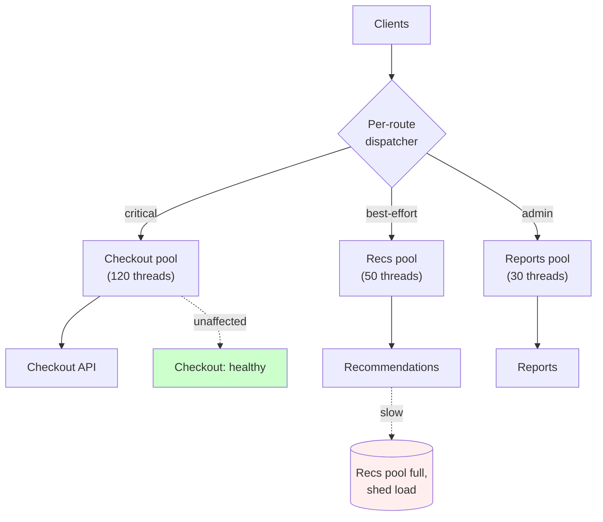
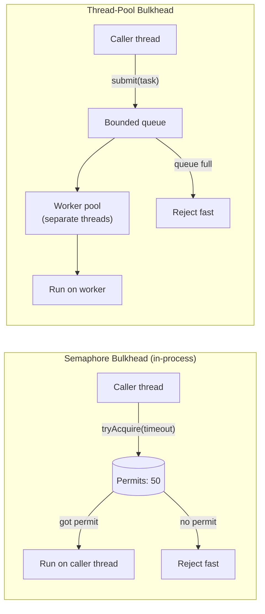

# Bulkheads

## Why This Exists

**Problem.** A service has one shared pool of something finite — threads, DB connections, HTTP client slots, queue capacity, memory. When *any* dependency on the other side of that pool slows down, **every** caller waiting for a slot blocks. A 200ms latency increase on a non-critical recommendation API turns into a full-service outage on the checkout path because both share the same Tomcat thread pool. This is the textbook *cascading failure* mode Michael Nygard documented in *Release It!* — the metaphor is from ship hulls: one breach should flood one compartment, not the whole vessel.

**Key insight.** **Resource isolation is a stability pattern, not a performance pattern.** You are deliberately giving up some peak utilization (idle slots in pool A while pool B saturates) in exchange for a *fault containment boundary*. The math is asymmetric: 5–15% spare capacity per partition typically costs little, but prevents the 100% outage that happens when one bad actor consumes the global pool.

**Reach for this when:**
- One dependency's latency can pin every worker thread (synchronous RPC, blocking JDBC, blocking HTTP client).
- You serve **multiple tenants / customers / priorities** out of one process and need to prevent noisy-neighbor takedowns.
- A background job, batch process, or admin endpoint shares infrastructure with the user-facing hot path.
- Your incident reviews keep saying "the slowdown on X cascaded to Y" — that's an unbulkheaded resource boundary.
- You have a clear separation between **critical** (login, checkout, write path) and **best-effort** (recs, analytics, search suggest) traffic.

**Don't reach for this when:**
- The system has only one workload and one dependency. Bulkheads add operational surface area (pool sizing, monitoring per pool, tuning) — don't pay that cost without isolation benefit.
- You're trying to fix slow dependencies. Bulkheads *contain* slowness, they don't *prevent* it. Pair with timeouts, circuit breakers, and load shedding.
- The resource you'd partition is already cheap and elastic (e.g., goroutines in Go, virtual threads in Java 21+). The classic thread-pool bulkhead is much less critical there — though connection-pool, queue, and host-level bulkheads still matter.
- Partitions would be so small they're useless (3 threads split into 3 pools of 1 just turns into a serial bottleneck).

## Diagrams

**Without bulkheads — one slow dep takes down everything:**



**With bulkheads — failure is contained:**



**Semaphore vs thread-pool bulkhead — the two flavors:**



## Core patterns

The pattern is the same regardless of language: **divide the finite resource into named partitions, enforce per-partition limits, fail fast when a partition is full, monitor each partition independently.** What changes is what you're partitioning (threads, connections, queues, hosts, processes) and where the partition boundary lives.

### 1. Thread-pool bulkhead (Java) — the classical Nygard pattern

Use a **separate `ExecutorService` per dependency**. The calling thread submits, blocks with a timeout, and the worker pool absorbs the latency. Crucially, **bound the queue** — an unbounded queue is just a slow OOM.

```java
import java.util.concurrent.*;
import java.util.concurrent.atomic.LongAdder;

/**
 * Bulkhead for a single downstream dependency. Caller submits, gets back a
 * Future with a timeout. If the worker pool + queue are full, RejectedExecutionException
 * is thrown immediately — that's the whole point: fail fast, don't queue forever.
 */
public class Bulkhead<T> {
    private final ThreadPoolExecutor executor;
    private final String name;
    private final long callTimeoutMs;
    private final LongAdder rejections = new LongAdder();
    private final LongAdder timeouts = new LongAdder();

    public Bulkhead(String name, int coreSize, int maxSize, int queueCapacity, long callTimeoutMs) {
        this.name = name;
        this.callTimeoutMs = callTimeoutMs;
        // Bounded queue — when it fills, AbortPolicy throws RejectedExecutionException.
        // DO NOT use LinkedBlockingQueue with default unbounded capacity here. That's
        // a classic mistake: unbounded queue means heap pressure + arbitrarily old work.
        this.executor = new ThreadPoolExecutor(
            coreSize, maxSize,
            60L, TimeUnit.SECONDS,
            new ArrayBlockingQueue<>(queueCapacity),
            r -> {
                Thread t = new Thread(r, "bulkhead-" + name + "-" + System.nanoTime());
                t.setDaemon(true);
                return t;
            },
            new ThreadPoolExecutor.AbortPolicy()
        );
    }

    public T call(Callable<T> work) throws BulkheadFullException, BulkheadTimeoutException, Exception {
        Future<T> future;
        try {
            future = executor.submit(work);
        } catch (RejectedExecutionException e) {
            rejections.increment();
            // This is GOOD — we shed load instead of queuing forever. Caller should
            // fall back (cached value, default response, fail closed) — see ../graceful-degradation/.
            throw new BulkheadFullException(name + " bulkhead full");
        }

        try {
            return future.get(callTimeoutMs, TimeUnit.MILLISECONDS);
        } catch (TimeoutException e) {
            future.cancel(true); // attempt interrupt; whether the work honors it depends on the call
            timeouts.increment();
            throw new BulkheadTimeoutException(name + " timed out after " + callTimeoutMs + "ms");
        } catch (ExecutionException e) {
            throw (Exception) e.getCause();
        }
    }

    // Expose these to your metrics system. You want per-bulkhead time series for:
    //   - active threads (saturation)
    //   - queue depth (latency canary; rising queue = slow downstream)
    //   - rejections / timeouts (the SLO breach signals)
    public int activeCount()   { return executor.getActiveCount(); }
    public int queueSize()     { return executor.getQueue().size(); }
    public long rejectionCount() { return rejections.sum(); }
    public long timeoutCount()   { return timeouts.sum(); }
}
```

**Sizing the pool.** Little's Law (L = λW): if you receive 100 RPS to this dependency and it takes 200ms p99, you need at least `100 * 0.2 = 20` concurrent slots to keep up at p99. Add 50–100% headroom for variance. **Cap the queue small** (often 0–10): a long queue just lets requests sit until they're useless, while hiding the saturation signal from upstream load balancers.

### 2. Semaphore bulkhead — when a thread switch is too expensive

When you're already on a request thread (e.g., Netty event loop, or just don't want the context-switch cost), use a **semaphore** to bound concurrency on the caller's own thread:

```java
import java.util.concurrent.Semaphore;
import java.util.concurrent.TimeUnit;

public class SemaphoreBulkhead {
    private final Semaphore permits;
    private final long acquireTimeoutMs;
    private final String name;

    public SemaphoreBulkhead(String name, int maxConcurrent, long acquireTimeoutMs) {
        this.permits = new Semaphore(maxConcurrent, /*fair=*/false);
        this.acquireTimeoutMs = acquireTimeoutMs;
        this.name = name;
    }

    public <T> T call(Callable<T> work) throws Exception {
        if (!permits.tryAcquire(acquireTimeoutMs, TimeUnit.MILLISECONDS)) {
            throw new BulkheadFullException(name + " saturated");
        }
        try {
            return work.call();
        } finally {
            permits.release();
        }
    }
}
```

**When to prefer semaphore over thread-pool:**
- Work is **non-blocking** (e.g., async HTTP client, reactive pipeline). A thread-pool bulkhead in front of an async call is wasteful — you'd be reserving a thread you don't need.
- Latency budget is tiny (sub-millisecond): a thread handoff is too expensive.
- Memory is more constrained than CPU (semaphores are tiny; thread pools cost stack memory).

**When you NEED a thread-pool bulkhead:**
- The work is **blocking** (synchronous JDBC, blocking gRPC, file I/O). Without a separate pool, slow work pins your request threads. This is exactly Nygard's original case.
- You want **walls of execution** — a guarantee that misbehaving code (e.g., a CPU-spinning lib) cannot starve the request thread.
- You want the work to outlive the originating request (fire-and-forget with backpressure).

This is also the distinction Hystrix made explicit, and a key reason the Hystrix design has aged better than people remember. See Netflix Hystrix — *How it Works* — https://github.com/Netflix/Hystrix/wiki/How-it-Works

### 3. Connection-pool bulkhead — partition the DB pool

The most underrated bulkhead. You have one DB and a connection pool of, say, 50 connections. A slow analytics query can hold connections until they all block, freezing the OLTP path. Solutions:

```yaml
# HikariCP config sketch — TWO pools to ONE database, partitioned by workload class
datasources:
  - name: oltp
    jdbc-url: jdbc:postgresql://db.prod/app
    maximum-pool-size: 40
    connection-timeout: 250    # ms — fail fast under saturation
    validation-timeout: 250
    idle-timeout: 60000
    leak-detection-threshold: 2000
    # OLTP queries: <50ms; if a query is taking longer it's a bug.
    # statement_timeout enforced server-side (see below).

  - name: analytics
    jdbc-url: jdbc:postgresql://db.prod/app
    maximum-pool-size: 10
    connection-timeout: 5000
    idle-timeout: 600000
    # Long-running reports tolerate queueing; OLTP must not.
```

**Server-side reinforcement** (Postgres example) — **belt-and-suspenders is mandatory** because a misconfigured client can still hog a connection:

```sql
-- Per-role timeouts, enforced regardless of pool config.
ALTER ROLE app_oltp SET statement_timeout = '500ms';
ALTER ROLE app_oltp SET idle_in_transaction_session_timeout = '5s';

ALTER ROLE app_analytics SET statement_timeout = '60s';
ALTER ROLE app_analytics SET idle_in_transaction_session_timeout = '120s';
```

**Even better:** route analytics to a **read replica**, OLTP to primary. Now the pools are physically separate at the database level, not just at the app level.

### 4. Per-tenant queues — multi-tenant noisy-neighbor isolation

In a multi-tenant SaaS, tenant A's bulk import or runaway loop must not starve tenants B–Z. Pattern: **per-tenant bounded queues with weighted fair scheduling.**

```python
# Per-tenant bulkhead with bounded queues and fair-share dispatch.
# Implements weighted fair queuing across tenants — important so a "free tier"
# tenant can't burst and starve "enterprise" tenants and vice versa.

import asyncio
import time
from dataclasses import dataclass, field
from collections import deque
from typing import Awaitable, Callable, Dict

@dataclass
class TenantPartition:
    tenant_id: str
    weight: int = 1                 # higher weight = more dispatch slots per round
    max_queue: int = 100
    max_concurrent: int = 10
    queue: deque = field(default_factory=deque)
    in_flight: int = 0
    rejections: int = 0
    last_dispatch_ts: float = 0.0

class TenantBulkhead:
    """
    Partitions work by tenant. Each tenant gets:
      - A bounded queue (rejects when full -> caller can return 429).
      - A concurrency cap (no tenant can monopolize workers).
      - A weight for fair dispatch across tenants.

    Global bound: total in-flight cannot exceed `global_concurrency`.
    """
    def __init__(self, global_concurrency: int):
        self.partitions: Dict[str, TenantPartition] = {}
        self.global_sem = asyncio.Semaphore(global_concurrency)
        self._cv = asyncio.Condition()

    def register(self, tenant_id: str, weight: int, max_queue: int, max_concurrent: int):
        self.partitions[tenant_id] = TenantPartition(
            tenant_id=tenant_id, weight=weight,
            max_queue=max_queue, max_concurrent=max_concurrent,
        )

    async def submit(self, tenant_id: str, work: Callable[[], Awaitable]):
        p = self.partitions[tenant_id]
        # Bounded queue check — fail fast on overflow. Don't grow the queue
        # unboundedly; that just delays the failure and burns memory.
        if len(p.queue) >= p.max_queue:
            p.rejections += 1
            raise BulkheadFull(tenant_id, "queue full")

        fut = asyncio.get_event_loop().create_future()
        p.queue.append((work, fut))
        async with self._cv:
            self._cv.notify()
        return await fut

    async def run_dispatcher(self):
        """Single dispatcher loop with weighted round-robin across tenants."""
        while True:
            async with self._cv:
                while not self._has_dispatchable():
                    await self._cv.wait()

            for p in self._fair_order():
                if p.in_flight >= p.max_concurrent or not p.queue:
                    continue
                await self.global_sem.acquire()  # honor global ceiling
                work, fut = p.queue.popleft()
                p.in_flight += 1
                p.last_dispatch_ts = time.time()
                asyncio.create_task(self._run(p, work, fut))

    def _has_dispatchable(self) -> bool:
        return any(p.queue and p.in_flight < p.max_concurrent
                   for p in self.partitions.values())

    def _fair_order(self):
        # Weighted: higher-weight tenants get visited more often.
        # For simplicity, sort by (last_dispatch_ts / weight) ascending —
        # ones least-recently dispatched (per unit weight) go first.
        return sorted(
            self.partitions.values(),
            key=lambda p: p.last_dispatch_ts / max(p.weight, 1),
        )

    async def _run(self, p: TenantPartition, work, fut):
        try:
            result = await work()
            fut.set_result(result)
        except Exception as e:
            fut.set_exception(e)
        finally:
            p.in_flight -= 1
            self.global_sem.release()
            async with self._cv:
                self._cv.notify()


class BulkheadFull(Exception):
    def __init__(self, tenant_id, reason):
        super().__init__(f"tenant={tenant_id} reason={reason}")
        self.tenant_id = tenant_id
```

**Why bounded queues are non-negotiable.** Unbounded queues mean a tenant can submit 1M items, the queue swells, OOMs the process, and *now no tenant gets served*. The bound converts an availability problem into a per-tenant rate-limit problem — a far better failure mode. This is the same lesson AWS learned with SQS visibility timeouts and the rationale for shuffle sharding (see References).

### 5. Cell-based / shuffle-sharded bulkheads — the host-level extension

Bulkheads inside a process protect you from in-process cascades. **Bulkheads across processes** — i.e., dedicating fleets of hosts ("cells") to subsets of customers — protect you from full-fleet cascades. This is the AWS approach: each Route 53 cell, each S3 partition, each DynamoDB shard is a bulkhead. **Shuffle sharding** assigns each customer a *random pair of shards*, drastically reducing the probability that any two customers share *both* shards. With 8 shards and 2 per customer, two random customers collide on both shards with probability 1/28 ≈ 3.6%.

```text
Naive sharding:                 Shuffle sharding (8 shards, 2 per tenant):
  Tenant A -> shard 1             Tenant A -> shards {1, 5}
  Tenant B -> shard 1             Tenant B -> shards {2, 7}
  Tenant C -> shard 2             Tenant C -> shards {1, 7}
  ...                             ...

  A bad tenant on shard 1         A bad tenant on shards {1,5} only impacts
  hurts everyone on shard 1.      tenants overlapping at BOTH 1 and 5.
                                  Almost no one does.
```

See AWS Builders' Library — *Workload isolation using shuffle-sharding*: https://aws.amazon.com/builders-library/workload-isolation-using-shuffle-sharding/

### 6. Resilience4j wiring (Java) — the canonical library

Most teams should use a library, not roll their own. Resilience4j provides both flavors of bulkhead with proper metrics:

```java
// Thread-pool bulkhead — for blocking work
ThreadPoolBulkheadConfig tpConfig = ThreadPoolBulkheadConfig.custom()
    .maxThreadPoolSize(20)
    .coreThreadPoolSize(10)
    .queueCapacity(5)        // small! see sizing notes
    .keepAliveDuration(Duration.ofMinutes(1))
    .build();

ThreadPoolBulkhead tpBulkhead = ThreadPoolBulkhead.of("payments-svc", tpConfig);

// Semaphore bulkhead — for non-blocking work
BulkheadConfig semConfig = BulkheadConfig.custom()
    .maxConcurrentCalls(50)
    .maxWaitDuration(Duration.ofMillis(100))  // fail-fast on saturation
    .build();

Bulkhead semBulkhead = Bulkhead.of("recommendations-svc", semConfig);

// Compose with TimeLimiter and CircuitBreaker — bulkheads alone are NOT enough
CompletableFuture<Result> future = tpBulkhead.executeSupplier(() ->
    timeLimiter.executeFutureSupplier(() ->
        circuitBreaker.executeSupplier(() -> downstream.call())
    )
);
```

The composition order matters: **CircuitBreaker innermost** (fastest fail when broken), **TimeLimiter** around it, **Bulkhead outermost** (so a broken-circuit fast-fail doesn't even consume a bulkhead slot).

## Trade-offs

| Benefit | Cost |
|---|---|
| Failure containment: one bad dependency cannot drain shared resources | Lower peak utilization — pool A's idle slots cannot help pool B during a spike |
| Predictable latency per workload class | More pools = more sizing decisions, more metrics, more tuning surface |
| Per-tenant fairness in multi-tenant systems | Per-tenant accounting requires a tenant ID on every request (often missing in legacy code) |
| Forces explicit capacity contracts between services and dependencies | Static partitions waste capacity vs. work-stealing / dynamic schedulers |
| Fast failure (reject when full) instead of slow degradation | Upstream callers MUST have fallbacks; if they don't, fail-fast just shifts the cascade |
| Works at every layer (thread, connection, queue, host, region) | Bulkheads at one layer don't protect another — connection pool bulkheads don't help if the OS file descriptor limit is shared |
| Composable with circuit breakers, timeouts, retries | Adds latency: queue traversal, lock acquisition, semaphore overhead (usually µs, but measurable in tight loops) |
| Improves SLO observability — saturation per pool is a clean signal | Misconfigured (too small) bulkhead becomes the bottleneck instead of the dependency |

## Common Pitfalls

- **Unbounded queues defeat the entire pattern.** `new LinkedBlockingQueue<>()` with no capacity. Now your "bulkhead" just buffers infinite slow work and OOMs. **Every queue must have a bound.**
- **Pool too big.** A pool of 200 threads "to be safe" doesn't isolate anything — by the time it saturates, your downstream is already in a brownout for everyone. Size to **steady-state demand × small headroom**, not "max possible".
- **Pool too small.** Equally bad: a pool of 5 for a real-traffic dependency rejects healthy load and looks like an outage. Tune from real metrics, not from guesses.
- **Forgetting timeouts.** A bulkhead with no per-call timeout still lets a single hung call pin a slot forever. The slot count just shifts the OOM into a slow strangulation. **Bulkhead + timeout + circuit breaker is the minimum viable trio.**
- **Sharing the underlying resource.** Two bulkheads pulling from the same DB connection pool, same DNS cache, same TCP socket — the bulkhead is theatre. Validate the resource is *actually* partitioned.
- **Ignoring rejection metrics.** Rejection count is the canary for capacity issues. Teams that don't alert on `bulkhead_rejections_total > 0` only learn about saturation when customers complain.
- **No fallback on rejection.** If your code's response to `BulkheadFullException` is to bubble up a 500, you've made user experience *worse* under load, not better. Bulkheads need pairing with **graceful degradation** (cached default, partial response, "try again later") — see ../graceful-degradation/.
- **Per-call thread creation under "bulkhead" branding.** Spinning a fresh thread per request "for isolation" gives you neither isolation (no cap) nor performance. That's not a bulkhead, that's a leak.
- **Bulkheads on the wrong axis.** Partitioning by *endpoint* when the actual blast-radius axis is *tenant* (or vice versa). A noisy-neighbor problem is solved with a tenant bulkhead, not an endpoint bulkhead. Diagnose the failure mode first.
- **Static sizing in elastic environments.** A bulkhead pool sized for one host doesn't auto-scale with autoscaling. Re-derive sizes per-instance, or express them as fractions of host capacity.
- **Forgetting the OS limits.** Your JVM has 10 thread-pool bulkheads at 50 threads each. Total: 500 threads. Plus the request thread pool. Plus GC. Plus framework overhead. Hit the OS thread limit and you're done. Account for the *sum*.
- **War story (Nygard, *Release It!* ch. 5 "Stability Patterns").** A travel-booking site shared one EJB pool across all flight-search providers. One provider's TLS handshake started taking 90 seconds. The pool drained, all flight searches failed, then all bookings (which depended on a final price refresh) failed — full site outage from one upstream hiccup. Per-provider bulkheads would have isolated to "that one airline's prices look stale".

## Decision Table

| Situation | Use this | Don't use |
|---|---|---|
| Blocking calls (sync HTTP, JDBC, file I/O) to a flaky dep | **Thread-pool bulkhead** + timeout + circuit breaker | Semaphore bulkhead — caller thread still pinned by blocking call |
| Async/non-blocking calls (Netty, reactor, CompletableFuture chains) | **Semaphore bulkhead** | Thread-pool bulkhead — wastes a thread switch |
| One DB, mixed OLTP + analytics workloads | **Two connection pools** + server-side `statement_timeout` per role | One big pool with "we'll be careful" |
| Multi-tenant SaaS, free + paid tiers | **Per-tenant bounded queues** with weighted fairness | Single FIFO queue — free-tier batch will starve paid users |
| Multi-tenant at scale (>1k tenants) | **Shuffle-sharded cells** + per-tenant bulkheads inside each cell | Naive partitioning by tenant ID — bad cell == many tenants down |
| Tiny in-process latency budget (<1ms) | **Semaphore bulkhead** (or none — measure first) | Thread-pool bulkhead — handoff cost dominates |
| Workload runs on Go / Java 21 virtual threads | Connection-pool, queue, and host bulkheads still apply; thread bulkheads usually don't | Don't reinvent thread-pool bulkheads when the runtime gives you cheap concurrency |
| You don't know your dependency's p99 latency | **Measure first** before sizing any bulkhead | Guessing at sizes — you'll either reject healthy traffic or fail to contain anything |
| Single-workload service with one dependency | **Just use timeout + circuit breaker** | A bulkhead with one partition isn't a bulkhead, it's overhead |
| Critical path shares pool with admin/cron/batch | **Separate pool for the critical path** (and for the batch — they're different workloads) | Hoping batch doesn't run during peak |

## References

- Michael Nygard — *Release It!* (Pragmatic Bookshelf, 2nd ed. 2018) — ch. 5 "Stability Patterns" introduces the Bulkhead pattern by name; ch. 4 "Stability Antipatterns" covers the cascading-failure modes bulkheads prevent. Canonical text. https://pragprog.com/titles/mnee2/release-it-second-edition/
- AWS Builders' Library — *Workload isolation using shuffle-sharding* — https://aws.amazon.com/builders-library/workload-isolation-using-shuffle-sharding/
- AWS Builders' Library — *Avoiding fallback in distributed systems* (relevant for what to do when a bulkhead rejects) — https://aws.amazon.com/builders-library/avoiding-fallback-in-distributed-systems/
- AWS Builders' Library — *Using load shedding to avoid overload* — https://aws.amazon.com/builders-library/using-load-shedding-to-avoid-overload/
- Google SRE Book — ch. 22 "Addressing Cascading Failures" — https://sre.google/sre-book/addressing-cascading-failures/
- Google SRE Book — ch. 21 "Handling Overload" — https://sre.google/sre-book/handling-overload/
- Google SRE Workbook — ch. 8 "On-Call" + ch. 11 "Managing Load" — https://sre.google/workbook/managing-load/
- Netflix Tech Blog — *Hystrix: How it Works* (thread-pool vs semaphore bulkheads, the canonical implementation) — https://github.com/Netflix/Hystrix/wiki/How-it-Works
- Resilience4j docs — *Bulkhead* module — https://resilience4j.readme.io/docs/bulkhead
- Marc Brooker (AWS) — *Caches, Modes, and Meta-stability* (why isolation matters for stability under load) — https://brooker.co.za/blog/2021/08/27/caches.html
- Pat Helland — *Heisenberg Was on the Write Track* (CIDR 2015 — on isolation boundaries in distributed systems) — http://cidrdb.org/cidr2015/Papers/CIDR15_Paper2.pdf
- Adrian Cockcroft — *Failure Modes and Continuous Resilience* (Netflix-era talks on bulkheading) — https://adrianco.medium.com/failure-modes-and-continuous-resilience-6553078caad5
- Designing Data-Intensive Applications (Kleppmann, O'Reilly 2017) — ch. 8 "The Trouble with Distributed Systems" (latency variability and unbounded queueing); ch. 11 "Stream Processing" (backpressure and bounded buffers).
- Building Secure and Reliable Systems (Google, 2020) — ch. 8 "Design for Resilience" — https://sre.google/books/building-secure-reliable-systems/
- HikariCP — *About Pool Sizing* (the connection-pool sizing essay every Java dev should read) — https://github.com/brettwooldridge/HikariCP/wiki/About-Pool-Sizing

## See Also

- ../circuit-breakers/ — bulkheads contain saturation; circuit breakers stop hammering an already-broken downstream. Always paired.
- ../timeouts-and-deadlines/ — a bulkhead without per-call timeouts still bleeds out slowly.
- ../retries-and-backoff/ — naive retries multiply load and defeat bulkhead sizing; jittered backoff is essential.
- ../load-shedding/ — what to do when the bulkhead rejects; closely related to admission control.
- ../graceful-degradation/ — fallback strategies for callers when their bulkhead returns "full".
- ../rate-limiting/ — upstream-side admission control; bulkheads are downstream-side concurrency control.
- ../backpressure/ — async-stream analogue; same problem, different idiom.
- ../cell-based-architecture/ — the host- and region-level extension of bulkheading.
- ../shuffle-sharding/ — probabilistic isolation for multi-tenant systems.
- ../../scalability/connection-pooling/ — the resource being partitioned in connection-pool bulkheads.
- ../../scalability/multi-tenancy/ — noisy-neighbor patterns, the canonical use case for per-tenant bulkheads.
- ../../observability/saturation-metrics/ — how to know when a bulkhead is the bottleneck vs. doing its job.
