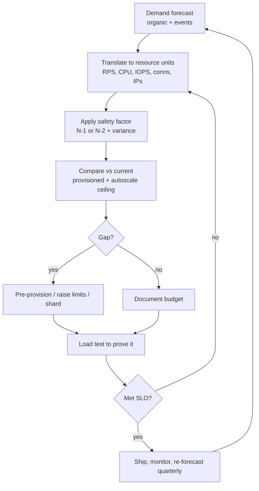
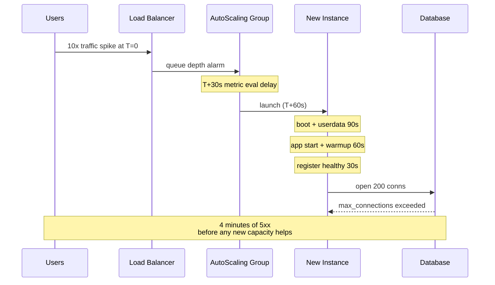
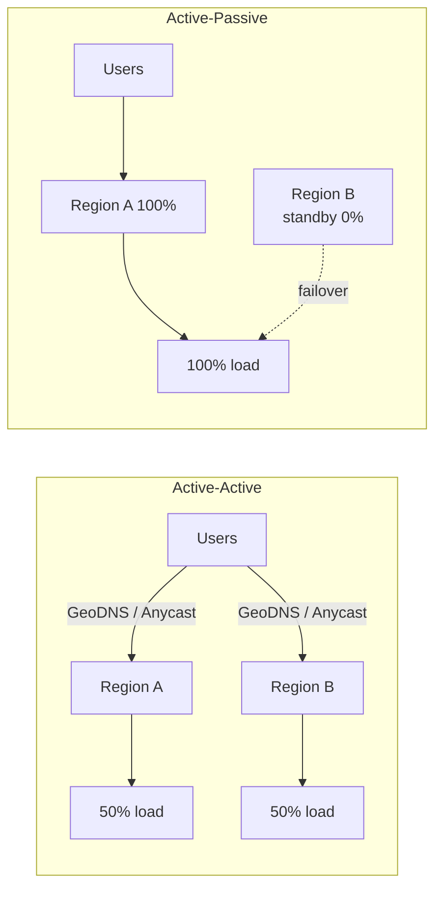
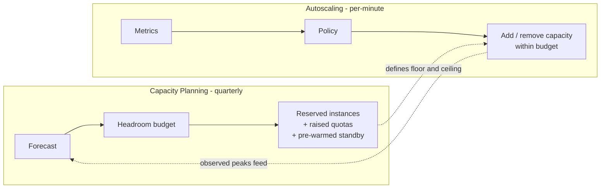

# Capacity Planning

## Why This Exists

**Problem.** Autoscaling is necessary but insufficient. Real outages happen at the seams autoscaling can't see: a Black Friday spike that outruns scale-out latency, a regional dependency at quota, a database connection ceiling, a load balancer pre-warm requirement, an IP exhaustion in a /22 subnet, a third-party rate limit. The team that "just turned on autoscaling" gets paged anyway because **capacity is a multi-dimensional constraint**, not a single CPU number.

**Key insight.** Capacity planning is forecasting + headroom + verified load behavior. You forecast demand (organic + events), translate it to resource units (CPU, RPS, IOPS, connections, IP addresses, license seats), apply a safety factor for variance and failure modes (lose an AZ, lose a region), and then **prove it with a load test** before launch. Autoscaling is a runtime feedback loop; capacity planning is the budget the loop operates inside. The SRE Workbook ch. 11 ("Managing Load") is explicit: even with autoscaling you need static headroom for the **N-1** or **N-2** failure case because scaling cannot be faster than instance boot + warmup + DNS TTL + connection pool fill.

**Reach for this when:**
- Planning a launch, marketing event, or migration where load will step-change.
- Sizing a new service or region — you have no historical curve yet.
- Investigating "we autoscale, why did we still 503?" post-mortems.
- Annual or quarterly capacity review (what's the 12-month forecast vs reserved capacity?).
- A dependency (RDS, ElastiCache, third-party API) has a hard quota you must reason about.
- Loss-of-AZ or loss-of-region drills — what fleet size does the survivor need?

**Don't reach for this when:**
- The system has plenty of headroom and load is flat — over-planning is waste.
- You're optimizing a single hot path (that's perf engineering, not capacity).
- You haven't instrumented utilization yet — go fix observability first; you can't plan what you can't measure.
- The bottleneck is correctness or a bug, not load (don't size around a memory leak).

---

## Diagrams

### The capacity planning loop



### Why autoscaling alone fails



The "scale-out is free" mental model is wrong. The integral of latency × failed-requests during the cold-start window is the actual cost — and it's what static headroom buys you.

---

## Forecasting load

### Pick the right growth curve

Most teams reach for "linear extrapolation" and miss the regime change. Common curves:

| Curve | When it fits | Watch out for |
|---|---|---|
| **Linear** `y = a + b·t` | Mature B2B, slow organic growth | Underestimates virality, marketing pushes |
| **Exponential** `y = a·e^(k·t)` | Early product, viral loops | Breaks at saturation; over-orders capacity |
| **Logistic / S-curve** `y = L / (1 + e^(-k(t-t0)))` | Adoption-limited (TAM bounded) | Hard to fit early when you're below the inflection |
| **Seasonal (additive or multiplicative)** | Retail, gaming, B2B with quarter-end | Treat holidays as separate events; don't smooth them away |
| **Event-driven (impulse + decay)** | Marketing launch, news mention | Plan peak, not average. Decay can be 10x of baseline for hours |

**Use multiple models and disagree on purpose.** If linear says 1.4× and exponential says 3.0×, plan for the higher one if the cost of being wrong (dropped requests during launch) exceeds the cost of being over-provisioned.

```python
# Simple Holt-Winters seasonal forecast for daily RPS
# (use statsmodels in production; this is the readable version)
import numpy as np
from statsmodels.tsa.holtwinters import ExponentialSmoothing

# daily peak RPS for last 90 days
history = np.array([...])  # shape (90,)

model = ExponentialSmoothing(
    history,
    trend="add",
    seasonal="mul",       # weekly multiplicative seasonality
    seasonal_periods=7,
    initialization_method="estimated",
).fit()

forecast = model.forecast(steps=90)  # next 90 days
# forecast is the *expected* peak; we'll add safety on top.

# Always plot residuals. If residuals trend, your model is missing a regime.
residuals = history - model.fittedvalues
print(f"residual std = {residuals.std():.1f} RPS, "
      f"95th = {np.percentile(np.abs(residuals), 95):.1f}")
```

### Translate demand to resource units

A request is not a resource. You need a **load model** that maps RPS to the limited resource:

```
peak_rps          = forecast_rps × event_multiplier
cpu_seconds_per_s = peak_rps × p50_cpu_ms / 1000
db_qps            = peak_rps × queries_per_request
db_connections    = active_workers × pool_size_per_worker
egress_gbps       = peak_rps × avg_response_bytes × 8 / 1e9
ip_addresses      = pods_per_node × nodes (k8s) + LB ENIs + NAT ENIs
```

**Every system has a "first to break" resource.** Find yours by load testing to failure and watching dashboards. It is rarely CPU. Common surprises: ephemeral port exhaustion, database connection ceiling, AWS API call rate limits, ELB pre-warm, EIP/EBS volume quotas, DNS resolver QPS, secrets-manager throttling.

---

## Safety factors and headroom math

Beyer et al. in **SRE Workbook ch. 11** give the canonical model:

```
required_capacity = peak_demand / (target_utilization × (1 - failure_budget))
```

Worked example for a US-EAST regional service running across 3 AZs:

```
peak_demand            = 60,000 RPS  (forecast + 30% growth)
target_utilization     = 0.6         (run hot enough to be efficient,
                                      cool enough to absorb spikes)
failure_budget (N-1)   = 1/3         (lose one AZ)

required_capacity = 60,000 / (0.6 × (1 - 1/3))
                  = 60,000 / 0.4
                  = 150,000 RPS provisioned

per_az = 150,000 / 3 = 50,000 RPS in each AZ
```

If a host serves 1,000 RPS at 60% CPU, that's **150 hosts**, **50 per AZ**. Note that's **2.5× peak demand** — and that ratio is normal for high-availability services. People who haven't done the math reach for 1.2× and learn the hard way.

**Pick target_utilization deliberately:**

- 0.5–0.6 for latency-sensitive request/response (need headroom for GC, queue draining, retries).
- 0.7–0.8 for batch / async workers where queueing is acceptable.
- 0.4 if you have bursty arrival processes (Poisson with high coefficient of variation) — queueing theory's M/M/c says utilization above 0.8 makes wait times explode.

```python
# M/M/c approximation: how wait time blows up near saturation.
# For c servers each at utilization rho = lambda / (c*mu),
# expected wait scales like 1 / (1 - rho).
import numpy as np

rhos = np.linspace(0.4, 0.95, 12)
relative_wait = 1 / (1 - rhos)
for rho, w in zip(rhos, relative_wait):
    print(f"util={rho:.2f}  relative_p99_wait={w:.1f}x")
# 0.40 -> 1.7x, 0.60 -> 2.5x, 0.80 -> 5.0x, 0.90 -> 10.0x, 0.95 -> 20.0x
```

That table is why "70% utilization is fine" only holds for low-variance arrivals.

---

## Load testing

You cannot capacity-plan from spreadsheets alone. **Load test the actual binary against the actual dependencies (or realistic stand-ins) at the actual peak you forecast — plus 1.5×.**

### Tool selection

| Tool | Best at | Less good at | Notes |
|---|---|---|---|
| **k6** (Grafana) | HTTP/gRPC, scriptable in JS, single binary | Long, stateful sessions | Excellent CI integration, exports to Prometheus |
| **Gatling** | High-concurrency JVM, pretty reports, sustained load | Cold-JVM ramp can mask early errors | Scala/Java/Kotlin DSL; great for protocol-rich apps |
| **Locust** | Python, complex user journeys, distributed mode | Throughput-per-worker is lowest of the three | Web UI is friendly; good for non-engineers to read |
| **Artillery** | Quick smoke tests | Sustained extreme load | Fine as a probe, not as a primary harness |
| **wrk2** | Pure HTTP throughput with corrected latency | Not scriptable | Use for raw protocol benchmarking, not user journeys |
| **Vegeta** | Constant arrival rate (open-loop) | Limited scenario logic | Best when you want a **constant RPS** rather than concurrent users |

**Open-loop vs closed-loop matters.** A closed-loop test (fixed virtual users) accidentally rate-limits itself when the system slows down — exactly when you want to push harder. Use **constant arrival rate** scenarios (k6's `constant-arrival-rate`, Gatling's `constantUsersPerSec`, Vegeta's `-rate`) to simulate real traffic that doesn't slow down just because your service does.

### k6 example — open-loop, ramped, with thresholds

```javascript
// load-test.js — k6 run --out experimental-prometheus-rw load-test.js
import http from 'k6/http';
import { check } from 'k6';
import { Trend } from 'k6/metrics';

const checkoutLatency = new Trend('checkout_latency_ms', true);

export const options = {
  scenarios: {
    // Ramp from 100 -> 5000 RPS over 10m, hold at 5000 for 30m, drain.
    ramp: {
      executor: 'ramping-arrival-rate',
      startRate: 100,
      timeUnit: '1s',
      preAllocatedVUs: 200,
      maxVUs: 4000,
      stages: [
        { target: 1000, duration: '5m' },
        { target: 5000, duration: '5m' },
        { target: 5000, duration: '30m' },
        { target: 0,    duration: '2m'  },
      ],
    },
  },
  // Fail the build if SLO is violated.
  thresholds: {
    http_req_failed:   ['rate<0.001'],            // <0.1% errors
    http_req_duration: ['p(99)<800', 'p(95)<300'],
    checkout_latency_ms: ['p(99)<1500'],
  },
};

export default function () {
  // Realistic mix — don't hammer one endpoint.
  const r = Math.random();
  if (r < 0.7) {
    http.get(`${__ENV.BASE_URL}/products/${Math.floor(Math.random()*10000)}`);
  } else if (r < 0.95) {
    http.get(`${__ENV.BASE_URL}/search?q=widget`);
  } else {
    const start = Date.now();
    const res = http.post(
      `${__ENV.BASE_URL}/checkout`,
      JSON.stringify({ sku: 'A1', qty: 1 }),
      { headers: { 'Content-Type': 'application/json' } },
    );
    checkoutLatency.add(Date.now() - start);
    check(res, { 'checkout 2xx': (r) => r.status >= 200 && r.status < 300 });
  }
}
```

Three things this gets right that toy load tests miss:

1. **Open-loop arrival rate** — backpressure on your service doesn't slow the test down.
2. **Mixed endpoint traffic** — endpoint mix dominates load. A test of only `/health` proves nothing.
3. **SLO-as-threshold** — the test fails CI if p99 regresses. This is your contract.

### Gatling sketch

```scala
import io.gatling.core.Predef._
import io.gatling.http.Predef._
import scala.concurrent.duration._

class CheckoutSimulation extends Simulation {
  val httpProtocol = http
    .baseUrl(System.getenv("BASE_URL"))
    .acceptHeader("application/json")

  val browse = scenario("browse")
    .exec(http("get_product").get("/products/42"))

  val checkout = scenario("checkout")
    .exec(http("post_checkout").post("/checkout")
      .body(StringBody("""{"sku":"A1","qty":1}""")).asJson)

  setUp(
    browse.inject(constantUsersPerSec(3500).during(30.minutes)),
    checkout.inject(constantUsersPerSec(500).during(30.minutes)),
  ).protocols(httpProtocol)
   .assertions(
     global.responseTime.percentile(99).lt(800),
     global.failedRequests.percent.lt(0.1),
   )
}
```

### Locust sketch — for stateful user journeys

```python
from locust import HttpUser, task, between, constant_throughput

class Shopper(HttpUser):
    # Constant-throughput approximates open-loop per VU.
    wait_time = constant_throughput(2)  # 2 req/s per virtual user

    def on_start(self):
        self.client.post("/login", json={"u": "test", "p": "test"})

    @task(7)
    def browse(self):
        self.client.get("/products/42", name="/products/[id]")

    @task(1)
    def checkout(self):
        with self.client.post(
            "/checkout", json={"sku": "A1", "qty": 1},
            catch_response=True, name="/checkout"
        ) as r:
            if r.elapsed.total_seconds() > 1.5:
                r.failure(f"too slow: {r.elapsed}")
```

### What to actually measure during the test

Don't only watch the load tester. Watch:

- **Service** — p50/p95/p99/p99.9 latency, error rate, GC pause time, thread pool saturation.
- **Dependencies** — DB CPU, replica lag, cache hit ratio, connection pool utilization, queue depth.
- **Infra** — instance CPU steal, ENI bandwidth, NAT gateway packet count, ALB surge queue, target group unhealthy count.
- **Quotas** — AWS API throttles, Lambda concurrent executions, DynamoDB throttles, KMS GenerateDataKey TPS.

**The load test is a search procedure for the next bottleneck, not a pass/fail flag.**

---

## Regional capacity

Single-region planning is a special case. Multi-region planning is where most teams get it wrong.

### Active-active vs active-passive



Both designs have the **same survivor problem**: when one region dies, the other absorbs all the load.

| Design | Day-2 fleet | After region loss | Hidden gotcha |
|---|---|---|---|
| Active-active 2 regions | each at 50% | each at **100%** (×2) | Need 2× headroom in each region |
| Active-active 3 regions | each at 33% | each at **50%** (×1.5) | Cheaper margin; but 3× the regional infra cost |
| Active-passive | primary 100%, standby 0% | standby goes 0→100% | Standby fleet must be **warm and pre-scaled**; cold = outage |
| Cell-based (cells ≤ blast radius) | each cell 50–70% | shed traffic from failed cell | Capacity = ceil(forecast / cell_size / target_util) |

The **N-1 math** is the same recipe applied per topology:

```
# Active-active across 2 regions, each must absorb full peak.
required_per_region = peak_demand / target_utilization
# At 60% utilization, that's peak / 0.6 = 1.67× peak in EACH region.
# Two-region active-active is 3.3× peak total. Three-region is 2.5× total.
```

This is why **3 regions can be cheaper than 2** for the same SLO — counterintuitive but routine.

### Cell-based architecture (Amazon Builders' Library)

Pre-allocate capacity to fixed-size cells. When demand grows, add cells; when a cell fails, route around it. Cells contain blast radius and make capacity arithmetic mechanical: `cells_needed = ceil(peak_rps / cell_capacity / target_util)`. See AWS Builders' Library "Workload isolation using shuffle sharding" and "Static stability".

---

## Capacity planning vs autoscaling-only

Both, not either. Here's where they live:



**Autoscaling alone fails in five well-documented ways:**

1. **Scale-out lag** — instance boot + warmup + LB registration is 60–300s. Spike traffic is 0s. The integral of pain in between is real.
2. **Quota walls** — autoscaler can't raise EC2 vCPU quotas, ENI quotas, IP space, or DB max_connections. You hit a wall, not a slope.
3. **Dependency saturation** — your fleet doubled but the database didn't. Now every new node makes things worse (thundering herd into the DB).
4. **Metric blindness** — CPU-based scaling is wrong for I/O-bound services. RPS-per-instance or queue-depth scaling exists but few teams configure it.
5. **Cost runaway** — without an upper bound, a retry storm or an attack scales you to bankruptcy. Capacity planning sets the **ceiling**.

The SRE Workbook ch. 11 puts it bluntly: autoscaling is a control loop and like any control loop it must operate inside a designed envelope.

---

## Trade-offs

| Benefit | Cost |
|---|---|
| Static headroom prevents cold-start outages | Pay for capacity you usually don't use (10–60% over peak) |
| Forecasting catches step-changes autoscaling misses | Forecasts are wrong; calibration is ongoing work |
| N-1 / N-2 sizing survives AZ/region failure | 1.5–3× the "naive" cost; requires multi-AZ or multi-region infra |
| Load testing surfaces the real bottleneck | Load test envs are expensive and drift from prod; non-prod data and dependency stubs lie |
| Cell-based + capacity per cell makes math mechanical | Cell sharding adds routing complexity and operational steps |
| Reserved/savings-plans capacity is 30–60% cheaper | Locks you in 1–3 years; bad for a service whose shape isn't stable |
| Autoscaling absorbs short-term variance | Useless for spikes faster than scale-out latency |

---

## Common Pitfalls

- **"Autoscaling will save us."** It buys you minutes in a seconds-scale spike. See SRE Workbook ch. 11.
- **CPU as the only metric.** Most services break on connections, file descriptors, ports, or downstream quotas first. Add saturation signals for each.
- **Forgetting the AZ-failure case.** Sizing for peak ÷ 3 AZs and then losing one means survivors run at 150% of their share. Always size to N-1.
- **Closed-loop load tests.** Concurrent-VU tests rate-limit themselves when the service slows down. Use **arrival-rate** mode (k6 ramping-arrival-rate, Gatling constantUsersPerSec, Vegeta -rate).
- **Testing one endpoint.** Endpoint mix dominates capacity. A `/health` test proves only that `/health` is fast.
- **Testing against stubs that don't model latency.** Stubs that return in 1ms hide the database becoming the bottleneck.
- **"We pre-warmed the ALB."** AWS removed pre-warming as a customer-facing thing for ALB; for sudden 10× steps you still want to ramp via DNS or contact support for NLB/ALB pre-warm, or use a pre-warmed cell. Verify with your TAM.
- **Quota surprises.** RDS connections, NAT gateway port allocation, EIPs, KMS GenerateDataKey TPS, Route53 query rate, SES sending limits. Audit annually; raise before launch.
- **IP exhaustion.** Kubernetes with one IP per pod will eat a /22 fast. Plan subnet sizing as a capacity item.
- **"We'll add capacity if it spikes."** Capacity additions in a region can take days when many tenants want them at once (every retailer on Black Friday). Reserve early.
- **Forecasting only the average.** Plan for peak. Peak/avg ratios of 5–20× are normal in retail, gaming, and news.
- **Ignoring retries.** A retry-everywhere mesh turns a 1% error into 8× load. See AWS Builders' Library on retries and exponential backoff with jitter.
- **One-shot load test.** Capacity drifts: code changes, dep changes, traffic changes. Make load tests a continuous CI artifact tied to your SLO.
- **Trusting a single forecast model.** Always run two and disagree on purpose; size for the worse outcome when the cost of being wrong is asymmetric.

---

## Decision Table

| Situation | Use |
|---|---|
| Steady traffic, occasional 2× spikes within scale-out time | Autoscaling alone, 30% headroom |
| Predictable launch / event with known peak | Capacity plan + pre-provision + load test to 1.5× peak |
| Unpredictable virality possible | Capacity plan + autoscale + circuit breakers + load shedding |
| Multi-region active-active | N-1 plan: each region sized to absorb the full load |
| Multi-region active-passive | Pre-warmed standby at 100% of primary; rehearse failover |
| Service with hard external quota (third-party API) | Plan against the quota; queue + shed; raise quota proactively |
| Bursty arrival (Poisson, high CV) | Lower target utilization (0.4–0.5); bigger headroom |
| Async / batch | Higher utilization (0.7–0.85) is fine; queue depth replaces latency as SLO |
| New service, no history | Synthetic load model from peers + bottom-up resource math + load test wide range |
| Cost-constrained | Cell-based with ability to shed non-essential traffic + reserved capacity for the floor |
| Regulated workload (financial, health) | N-2 sizing; multi-region; documented capacity reviews quarterly |

---

## References

- Beyer, Jones, Petoff, Murphy (eds.) — **Site Reliability Engineering**, ch. 22 "Addressing Cascading Failures" — https://sre.google/sre-book/addressing-cascading-failures/
- Beyer et al. — **The Site Reliability Workbook**, ch. 11 "Managing Load" — https://sre.google/workbook/managing-load/
- Beyer et al. — **The Site Reliability Workbook**, ch. 18 "SRE Engagement Model" (capacity reviews) — https://sre.google/workbook/engagement-model/
- Adkins et al. — **Building Secure and Reliable Systems**, ch. 8 "Design for Resilience" — https://sre.google/books/building-secure-reliable-systems/
- AWS Builders' Library — **Static stability using Availability Zones** — https://aws.amazon.com/builders-library/static-stability-using-availability-zones/
- AWS Builders' Library — **Workload isolation using shuffle sharding** — https://aws.amazon.com/builders-library/workload-isolation-using-shuffle-sharding/
- AWS Builders' Library — **Avoiding overload in distributed systems by putting the smaller service in control** — https://aws.amazon.com/builders-library/avoiding-overload-in-distributed-systems-by-putting-the-smaller-service-in-control/
- AWS Builders' Library — **Timeouts, retries, and backoff with jitter** — https://aws.amazon.com/builders-library/timeouts-retries-and-backoff-with-jitter/
- Brendan Gregg — **Systems Performance** (USE method for saturation) — https://www.brendangregg.com/usemethod.html
- Neil Gunther — **Guerrilla Capacity Planning** (book; concise on universal scalability law).
- Little's Law — concurrency = arrival rate × latency — https://en.wikipedia.org/wiki/Little%27s_law
- Grafana k6 — **Test types and scenarios** — https://grafana.com/docs/k6/latest/using-k6/scenarios/
- Gatling — **Injection profiles** — https://docs.gatling.io/reference/script/core/injection/
- Locust — **Writing a locustfile** — https://docs.locust.io/en/stable/writing-a-locustfile.html
- Tyler Treat — **You can't legislate against failure** (blog on capacity and overload) — https://bravenewgeek.com/
- Marc Brooker (AWS) — **Surprising scalability of multitenancy** — https://brooker.co.za/blog/2023/03/23/serverless.html
- Kleppmann — **Designing Data-Intensive Applications**, ch. 1 "Reliable, Scalable, and Maintainable Applications" (load parameters, percentiles).
- Xu — **System Design Interview vol. 1**, ch. on back-of-envelope estimation.

---

## See Also

- `../slo-sli-sla/` — defining the SLOs that capacity planning must protect.
- `../load-shedding/` — what to do when capacity is exceeded anyway.
- `../circuit-breaker/` — preventing cascading failures during overload.
- `../chaos-engineering/` — verifying N-1 / N-2 assumptions by actually killing things.
- `../incident-response/` — capacity-related on-call playbooks.
