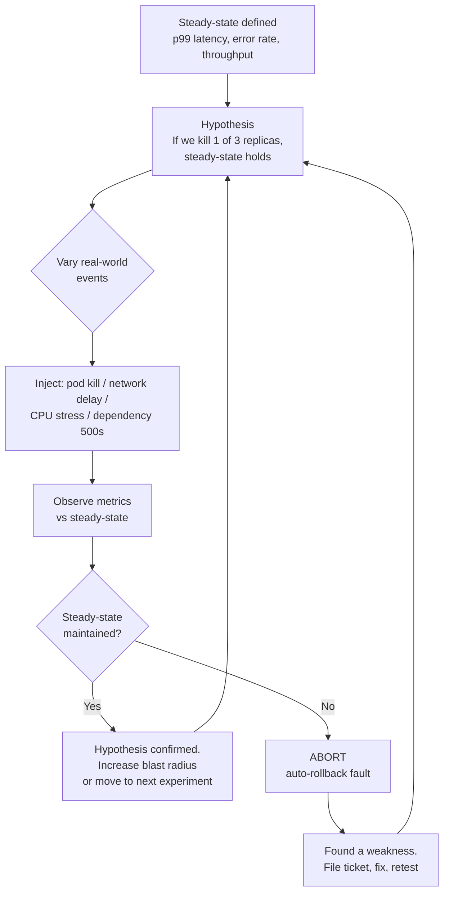
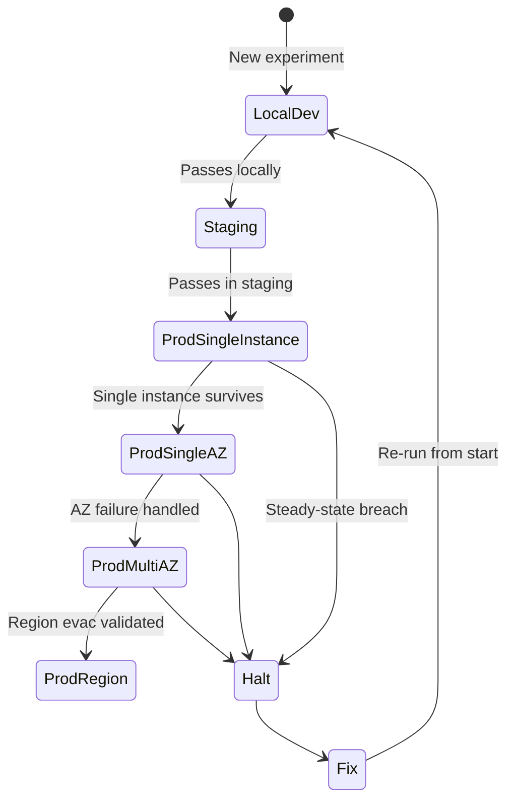
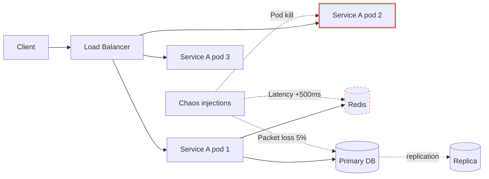

# Chaos Engineering

## Why This Exists

**Problem.** Distributed systems fail in ways nobody predicted. The bug that takes you down at 3am is rarely the one in the code you wrote yesterday — it's the interaction between a stale DNS cache, a connection pool exhaustion, a retry without backoff, and a dependency you forgot was on the critical path. Code review, unit tests, integration tests, and load tests all assume **the dependencies behave**. Chaos engineering assumes they don't.

**Key insight.** Resilience is a property of the *running system*, not the design document. The only way to know whether your circuit breakers, retries, timeouts, fallbacks, replicas, and runbooks actually work is to break things on purpose, in a controlled way, and watch what happens. Untested failover is a fiction. Most "highly available" systems have never had their HA path exercised under load.

**Reach for this when:**
- Your last 3 incidents had postmortem actions like "add timeout to X" or "we didn't know Y was a hard dependency".
- You have replicas, retries, and circuit breakers but no evidence they engage correctly.
- A new engineer asks "what happens if Redis is down?" and nobody can answer with confidence.
- You depend on a third-party API and have never tested the path where it returns 500s for 10 minutes.
- You want to validate a runbook (region evac, DB failover) before you need it for real.
- Leadership wants quantified reliability claims, not "we think it's fine".

**Don't reach for this when:**
- You don't have observability (you can't measure steady-state, so you can't detect deviation). **Fix monitoring first.**
- Your system has known critical bugs — fix the bug you see before hunting unknown ones.
- You haven't done a basic threat model / dependency map. You're shooting in the dark.
- The team doesn't have an on-call rotation or incident process. Chaos creates incidents; somebody has to respond.
- You're a 5-person startup with a single monolith on one VM. The blast radius is "everything"; the value of running a planned experiment is small. Add chaos when you have redundancy worth verifying.

## Diagrams

### The chaos experiment loop



### Blast-radius progression



### Where injection happens



## The Five Principles (principlesofchaos.org)

The canonical formulation, from Rosenthal et al. at Netflix (2015, refined ~2018):

1. **Build a hypothesis around steady-state behavior.** Define a *measurable* output (orders/sec, p99 latency, error rate) that represents healthy operation. Don't reason about internals; reason about user-visible behavior. The hypothesis is: "Under fault X, this metric stays within band Y."
2. **Vary real-world events.** Inject things that actually happen: hardware failure, network partition, latency, dependency 500s, clock skew, DNS resolution failure, disk full, CPU stress, memory pressure. Don't invent exotic scenarios; replay history.
3. **Run experiments in production.** Staging doesn't have the traffic shape, the real data volume, the actual configs, or the real third-party endpoints. Bugs hide in the gaps. (See "Production vs staging" below — this principle is contested but the original Netflix position is unambiguous.)
4. **Automate experiments to run continuously.** A one-off Game Day is a snapshot; the system regresses. Continuous chaos catches regressions when a config change quietly removes a fallback.
5. **Minimize blast radius.** Start with the smallest possible scope (one request, one pod, one customer cohort). Have an abort mechanism that's faster than human reaction time. *This is the principle that distinguishes engineering from sabotage.*

## Anatomy of an Experiment

Every chaos experiment, regardless of tool, has the same five-part structure. Treat it as a contract:

```yaml
# experiment.yaml — vendor-neutral structure
name: redis-cache-down-checkout
hypothesis:
  steady_state:
    metric: checkout_success_rate
    window: 5m
    threshold: ">= 99.5%"
  prediction: "If Redis cache returns errors, checkout falls back to DB
               and steady-state holds (latency may degrade)."
method:
  fault: dependency_error
  target: redis-prod
  parameters:
    error_rate: 100%
    duration: 3m
blast_radius:
  scope: 5%   # 5% of pods, sticky-routed
  expand_after: 2 successful runs
abort:
  conditions:
    - checkout_success_rate < 98% for 30s
    - p99_latency > 2s for 1m
    - on_call_paged: true
  action: revert_fault_immediately
rollback:
  automatic: true
  manual_command: "chaosctl abort redis-cache-down-checkout"
```

If you can't fill in all five sections, you're not running an experiment — you're guessing.

## Picking a Tool

| Tool | Substrate | Strengths | Use when |
|------|-----------|-----------|----------|
| **Chaos Monkey** (Netflix, 2011) | EC2 instances via Spinnaker | Simple instance termination, battle-tested, the original | You want random instance kills in AWS and use Spinnaker. Otherwise dated. |
| **Chaos Mesh** (CNCF, PingCAP) | Kubernetes (CRD-driven) | Rich fault library (network, IO, kernel, time, JVM), web UI, runs as operator | K8s-native shop; want declarative experiments alongside manifests. |
| **LitmusChaos** (CNCF graduated) | Kubernetes | Hub of pre-built experiments, GitOps-friendly, ChaosCenter dashboard | K8s shop; want a library of community experiments and SRE workflows. |
| **Gremlin** | SaaS, agent-based, host + K8s | Polished UX, safety controls, "halt all" big red button, compliance reporting | Enterprise; want managed safety controls, SOC2 evidence, no infra to run. |
| **AWS FIS (Fault Injection Service)** | AWS resources (EC2, RDS, EKS, ECS, network) | Native to AWS IAM/CloudWatch, can target across services, stop conditions wired to alarms | Heavy AWS shop; want to inject AZ failure, EBS pause, RDS reboot with audit trail. |
| **Toxiproxy** (Shopify) | TCP proxy, language-agnostic | Lightweight, scriptable, perfect for integration tests | You need deterministic latency/partition injection in CI, not prod chaos. |
| **Pumba** | Docker | Container kill / netem on Docker hosts | Pre-K8s Docker environments. Largely superseded. |

**Heuristic:** if you're on Kubernetes, default to **Chaos Mesh** or **LitmusChaos**. If you're on AWS without K8s, default to **AWS FIS**. Use **Toxiproxy** in integration tests regardless. Reach for **Gremlin** when you need centralized governance and don't want to run the platform.

## Concrete: Chaos Mesh experiment (K8s)

A pod-kill experiment, scoped to 1 pod of a 6-replica deployment, in a labelled namespace, with abort wired to a Prometheus alert:

```yaml
apiVersion: chaos-mesh.org/v1alpha1
kind: PodChaos
metadata:
  name: kill-checkout-pod
  namespace: chaos-experiments
spec:
  action: pod-kill
  mode: fixed
  value: "1"                 # kill exactly 1 pod
  selector:
    namespaces: [prod]
    labelSelectors:
      app: checkout
      chaos-eligible: "true" # opt-in label; not all pods are fair game
  duration: "30s"
---
# Abort: Workflow that watches a metric and aborts if breached
apiVersion: chaos-mesh.org/v1alpha1
kind: Workflow
metadata:
  name: kill-checkout-with-guard
spec:
  entry: parallel-guard
  templates:
    - name: parallel-guard
      templateType: Parallel
      children: [chaos, abort-watcher]
    - name: chaos
      templateType: PodChaos
      podChaos: { ...as above... }
    - name: abort-watcher
      templateType: Task
      task:
        container:
          image: prom/prometheus-watcher:1.0
          args:
            - "--query=histogram_quantile(0.99,rate(http_duration_seconds_bucket{svc='checkout'}[1m]))"
            - "--threshold=2.0"
            - "--abort-on-breach=true"
```

Things to notice:
- **Opt-in via label** (`chaos-eligible: "true"`). Without this you'll eventually nuke a stateful pod nobody flagged.
- **Bounded duration**. If your watcher dies, the fault still self-clears.
- **Selector is namespace + label**, not "any pod". A wildcard scope is how you take down prod.

## Concrete: AWS FIS (region-agnostic)

Injecting an EC2 instance stop on 1% of an ASG, with a CloudWatch alarm as a stop condition:

```json
{
  "description": "Stop 1% of orders-svc ASG, abort if 5xx > 1%",
  "roleArn": "arn:aws:iam::123:role/FIS-ExperimentRole",
  "stopConditions": [
    {
      "source": "aws:cloudwatch:alarm",
      "value": "arn:aws:cloudwatch:us-east-1:123:alarm:orders-5xx-high"
    }
  ],
  "targets": {
    "asg-instances": {
      "resourceType": "aws:ec2:instance",
      "resourceTags": { "Service": "orders", "ChaosEligible": "true" },
      "selectionMode": "PERCENT(1)"
    }
  },
  "actions": {
    "stop-instances": {
      "actionId": "aws:ec2:stop-instances",
      "parameters": { "startInstancesAfterDuration": "PT2M" },
      "targets": { "Instances": "asg-instances" }
    }
  }
}
```

The **stopCondition wired to a CloudWatch alarm** is the load-bearing part. If the experiment causes 5xx to climb, FIS auto-aborts and brings instances back. *Never* run an FIS experiment without at least one stop condition; you've replaced "controlled experiment" with "outage".

## Game Days: chaos with humans in the loop

Automated experiments verify what you expect to break. Game Days verify what *people* do when things break. The difference matters: most outages are extended not by the original fault but by humans paging the wrong team, missing a runbook step, or losing 20 minutes finding the dashboard.

A Game Day is a scheduled, scoped, *announced* exercise. The structure that works:

1. **Pre-brief (T-7 days).** Agree on scope, hypothesis, abort criteria, who's on-call, who's running it, who's a watcher (silent observer logging timing).
2. **Runbook of injections.** Sequenced, escalating. Each step has a hypothesis and abort.
3. **Live execution.** GameMaster injects fault. On-call team responds *as if it were a real page* — they don't know what was injected (or they do, depending on goal).
4. **Wall-clock timing.** Time-to-detect, time-to-page, time-to-mitigate, time-to-resolve. These are your real numbers.
5. **Hot-wash (immediately after).** What did we learn? What broke that we didn't expect? What's the next experiment?
6. **Action items with owners and dates.** Otherwise the exercise was theater.

Two flavors worth distinguishing:
- **Open-book Game Day.** Team knows the scenario; tests runbooks and tooling. Good for new services, new hires.
- **Closed-book Game Day.** Team only knows "something will happen in this window". Tests detection and triage. Higher fidelity but psychologically expensive — don't do this every week.

The AWS Builders' Library article *"Workload isolation using shuffle-sharding"* and Google's *SRE Workbook* ch. 28 ("Disaster Role Playing") describe how Amazon and Google run these. Both teams converge on the same answer: a small recurring exercise (~monthly, ~2 hours) compounds far more than a once-a-year heroic effort.

## Production vs staging: the honest tradeoff

The strict Principles position (#3) says *production*. Reality is more nuanced:

| Run in… | When it's right | What you give up |
|---------|-----------------|------------------|
| **Local / CI** (Toxiproxy) | Validating timeout config, retry logic of a single service, in deterministic tests | No traffic shape, no real dependencies, no concurrency effects |
| **Staging** | First-time experiments, exotic faults (kernel panic, clock skew >1h), team training | Staging is never a faithful prod replica — config drift, traffic shape, data volume all differ. **Bugs hide in the gaps.** |
| **Production, dark / shadow** | Replay traffic into a parallel stack with faults injected | Doesn't validate the real customer-facing path; complex to set up |
| **Production, single instance / single AZ** | Routine, automated experiments after staging passes | Small but nonzero customer impact possible; needs strong abort |
| **Production, full-region failover** | Quarterly Game Day; cannot be validated any other way | Highest stakes; coordinate with comms, support, leadership |

**The hard rule:** every production experiment must have (a) an automated abort wired to a customer-facing SLI, (b) a manual abort button, (c) a known-not-running blackout window (Black Friday, ticket sale, regulator audit).

**The harder rule, learned the hard way:** if your *staging* environment can't survive an experiment, your *production* will not survive the equivalent fault. Run it in staging first, but don't stop there.

## Steady-state metrics that actually work

Picking the right SLI for your hypothesis is the most-skipped step. Bad picks:

- **CPU usage.** Internal, not customer-facing. CPU can spike while users are happy.
- **Error rate of one service.** Misses cascading failures upstream.
- **"Number of pods running".** Tautological; you injected a pod kill.

Good picks:

- **Customer-funnel completion rate** (orders/min, signups/min, video starts/min). Hard to fake, directly tied to revenue.
- **End-to-end p99 latency at the edge** (CDN or LB). Captures the whole stack.
- **Error budget burn rate** (per the SRE workbook). Already calibrated to user pain.

Compute steady-state from a *baseline window* (e.g., trailing 1 hour, same time previous week) and define the hypothesis as a band: `metric ∈ [baseline - 3σ, baseline + 3σ]`. The 3σ comes from the SRE Workbook's discussion of statistically valid SLIs (ch. 4).

## Trade-offs

| Benefit | Cost |
|---------|------|
| Find weaknesses on a Tuesday afternoon (planned, staffed) instead of 3am Saturday | Real customer impact possible if abort fails or blast radius mis-scoped |
| Validates that retry/timeout/circuit breaker config actually works | Requires investment in observability *first* — no SLI, no experiment |
| Builds team muscle for incident response | Adds toil: someone owns the chaos platform, experiments rot if unmaintained |
| Surfaces hidden dependencies (the "implicit DAG") | Surfaces them in production, which means you've now caused the small outage you were trying to avoid |
| Quantifiable resilience claims for compliance / leadership | Compliance teams may push back; legal review of "intentional production failure" non-trivial |
| Continuous experiments catch regressions when configs drift | Continuous experiments require maintenance; flapping experiments train teams to ignore alerts |
| Pre-prod chaos is cheap and finds 80% of issues | Pre-prod gives false confidence; you'll skip prod and miss the other 20% |

## Common Pitfalls

- **No steady-state defined.** "We injected a fault and stuff seemed fine" is not an experiment. You need a metric with a threshold.
- **Skipping the hypothesis.** If you don't write down what you expect *before* the experiment, you'll rationalize whatever happens after.
- **Wildcard selectors.** `mode: all` in Chaos Mesh, or an FIS target with no resource tags, has caused real outages. Always opt-in by label/tag.
- **No abort wired to an SLI.** Manual abort is fine for Game Days, useless for automated experiments — by the time a human reacts, you've burned 5 minutes of error budget.
- **Running chaos without dependency owners knowing.** Killing a pod that holds a long-lived gRPC connection to a partner team's service will page *them* at 2am. Coordinate.
- **Treating staging as equivalent to prod.** Staging passes ≠ prod passes. Staging is a sanity check, not validation.
- **Chaos as performance theater.** Running Chaos Monkey weekly while never investigating a single failure is worse than not running it; you've trained the team to expect random pods to die and ignore the signal.
- **Forgetting stateful systems.** Killing a Postgres primary "to see what happens" with no read replica promotion configured ≠ chaos engineering, that's just an outage.
- **No blackout calendar.** Running chaos during Black Friday, an earnings call, or a regulator audit is career-defining in the bad way.
- **Experiment results not actioned.** Found a weakness, filed a ticket, ticket sat in backlog 18 months. The fault still kills you when it happens for real.
- **Overconfidence after one Game Day.** "We tested AZ failure" — you tested it once, with the team that built the system, on a Tuesday. That's not a guarantee, it's a data point.
- **Confusing fault injection with chaos engineering.** Killing a pod is a fault. Chaos engineering is the *scientific method around* fault injection: hypothesis, blast radius, abort, learn. Without those, you have a vandal with kubectl.

## Decision Table

| Situation | Reach for | Don't reach for |
|-----------|-----------|-----------------|
| First time doing chaos, K8s shop | Chaos Mesh in staging, single-pod kill, opt-in label | Production-wide experiment, AZ takedown |
| Validating retry/timeout config of one service | **Toxiproxy in CI**, deterministic latency injection | Production chaos platform overhead |
| Want to verify multi-AZ failover | **AWS FIS network disruption** scoped to one AZ, with stop conditions on customer SLIs | Manually terminating instances ad-hoc |
| Compliance asks for evidence of resilience | **Gremlin** (SOC2 reports) or AWS FIS (CloudTrail audit) | Open-source tool with no audit trail |
| Onboarding a new SRE | **Open-book Game Day** on a non-critical service | Production experiment they don't understand |
| Validating runbooks | **Closed-book Game Day**, watcher times each step | Tabletop only — paper exercises miss tooling gaps |
| Service has no observability | **Stop. Build SLIs first.** | Any chaos tool — you can't measure steady-state |
| 5-person startup, single VM | **Improve redundancy first**; chaos has nothing to verify | Chaos Monkey on a single instance |
| Quarterly resilience program | Mix: continuous automated experiments + monthly Game Days + quarterly multi-region drill | Annual heroic Game Day only |
| Have a dependency you can't fault-inject (e.g. payment provider) | **Toxiproxy as fault gateway** in front of it; or run a sandboxed simulator | Hitting the real provider's API with chaos |

## References

- Principles of Chaos Engineering — *principles of chaos engineering* — https://principlesofchaos.org/
- Rosenthal, Hochstein, Blohowiak, Jones, Basiri — *Chaos Engineering* (O'Reilly 2017, free PDF) — https://www.oreilly.com/library/view/chaos-engineering/9781491988459/
- Basiri et al. — *Chaos Engineering* (IEEE Software, 2016) — https://www.computer.org/csdl/magazine/so/2016/03/mso2016030035
- Netflix Tech Blog — *The Netflix Simian Army* — https://netflixtechblog.com/the-netflix-simian-army-16e57fbab116
- Netflix Tech Blog — *Chaos Engineering Upgraded* (FIT, ChAP) — https://netflixtechblog.com/chaos-engineering-upgraded-878d341f15fa
- Adrian Cockcroft — *Failure Modes and Continuous Resilience* (QCon) — https://www.infoq.com/presentations/failure-modes-resilience/
- Beyer, Jones, Petoff, Murphy (eds.) — *Site Reliability Engineering* — ch. 22 "Addressing Cascading Failures" — https://sre.google/sre-book/addressing-cascading-failures/
- Beyer et al. — *The Site Reliability Workbook* — ch. 28 "Disaster Role Playing" — https://sre.google/workbook/disaster-role-playing/
- Beyer et al. — *Building Secure and Reliable Systems* — ch. 16 "Disaster Planning" — https://sre.google/books/building-secure-reliable-systems/
- AWS Builders' Library — *Workload isolation using shuffle-sharding* — https://aws.amazon.com/builders-library/workload-isolation-using-shuffle-sharding/
- AWS Builders' Library — *Caching challenges and strategies* — https://aws.amazon.com/builders-library/caching-challenges-and-strategies/
- AWS — *AWS Fault Injection Service User Guide* — https://docs.aws.amazon.com/fis/latest/userguide/what-is.html
- Chaos Mesh — *Documentation* — https://chaos-mesh.org/docs/
- LitmusChaos — *Documentation (CNCF)* — https://docs.litmuschaos.io/
- Gremlin — *Chaos Engineering: the history, principles, and practice* — https://www.gremlin.com/community/tutorials/chaos-engineering-the-history-principles-and-practice/
- Shopify — *Toxiproxy* — https://github.com/Shopify/toxiproxy
- Casey Rosenthal & Nora Jones — *Chaos Engineering: System Resiliency in Practice* (O'Reilly 2020) — book; cite chapters directly.
- Kleppmann — *Designing Data-Intensive Applications* — ch. 8 "The Trouble with Distributed Systems" (failure model context).
- Pat Helland — *Memories, Guesses, and Apologies* — http://blogs.msdn.com/b/pathelland/archive/2007/05/15/memories-guesses-and-apologies.aspx
- Cindy Sridharan — *Testing in Production, the safe way* — https://copyconstruct.medium.com/testing-in-production-the-safe-way-18ca102d0ef1
- Adrian Colyer (Morning Paper) — *Lineage-driven fault injection* (Alvaro et al., SIGMOD 2015) — https://blog.acolyer.org/2015/06/22/lineage-driven-fault-injection/

## See Also

- `../circuit-breaker/` — what chaos experiments validate; see for the actual breaker implementation
- `../timeouts/` — most chaos findings reduce to "missing or wrong timeout"
- `../bulkheads/` — isolation patterns whose efficacy is only knowable via chaos
- `../graceful-degradation/` — what your system should do when chaos confirms a dependency is gone
- `../incident-response/` — Game Days are dress rehearsals for this
- `../runbooks/` — chaos validates runbooks; runbooks are inputs to Game Days
- `../observability/` — non-negotiable prerequisite to any chaos work
- `../load-shedding/` — chaos often reveals that load-shedding isn't wired up
- `../disaster-recovery/` — region-level chaos overlaps heavily; multi-region drills are the apex Game Day
