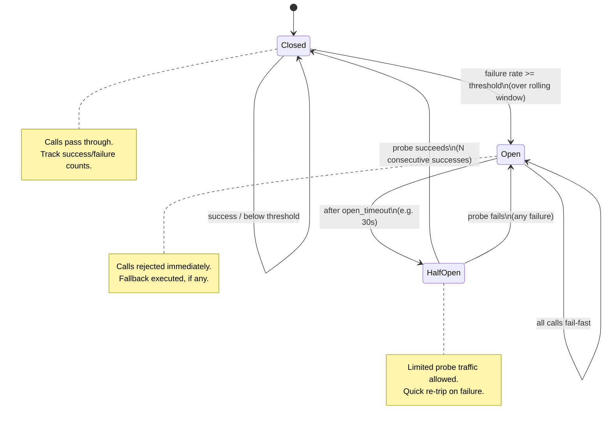
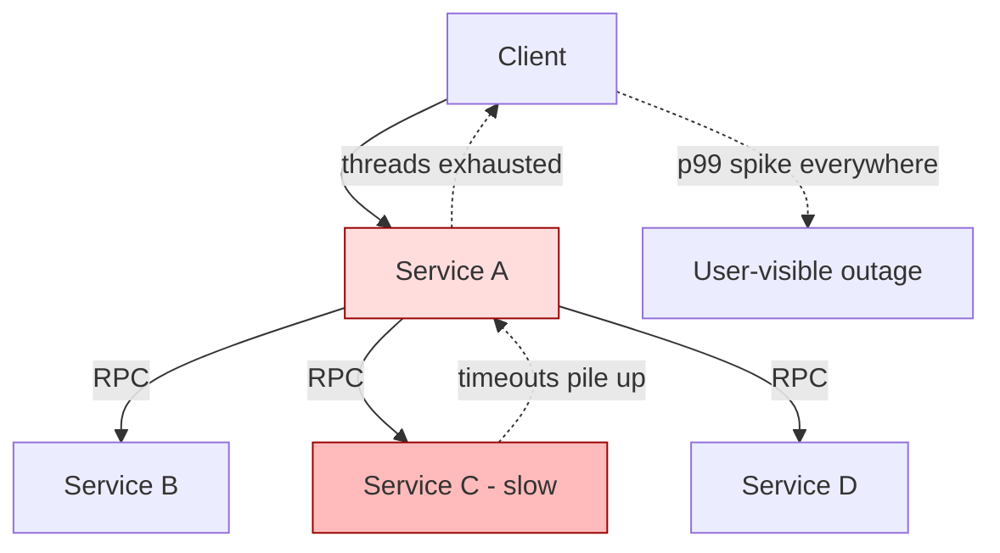
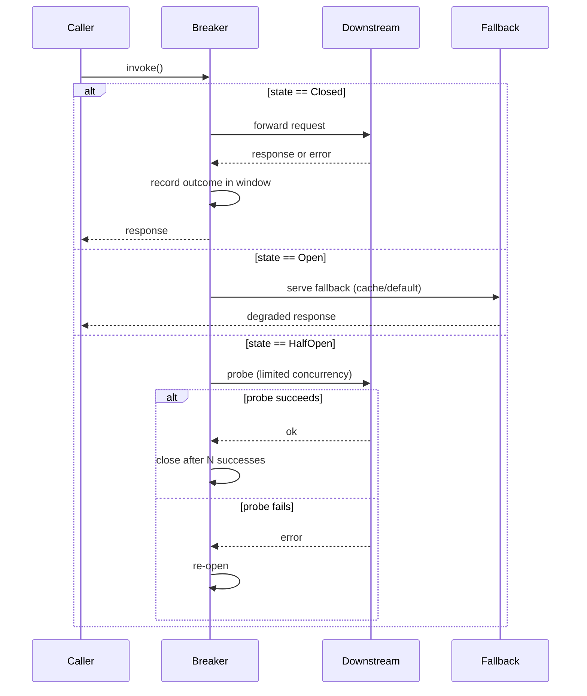

# Circuit Breaker

## Why This Exists

**Problem.** A downstream dependency degrades — not crashes, just gets slow. Each caller waits on a 30-second timeout. Threads block. Connection pools drain. The caller's caller times out. The failure walks up the dependency graph until the entire system is unavailable. This is **cascading failure**, and it is the dominant failure mode in service-oriented architectures. Michael Nygard named this anti-pattern in *Release It!* (2007) and prescribed the circuit breaker as the canonical defense.

**Key insight.** When a dependency is broken, **calling it again is worse than not calling it at all**. The breaker accepts that fact: once failures cross a threshold, *fail fast locally* instead of propagating slow failures upstream. A blown breaker converts slow timeouts (which consume threads, sockets, file descriptors) into instant rejections (which release them). It also gives the broken downstream a chance to recover by removing load — without breakers, recovery itself triggers a thundering herd.

**Reach for this when:**
- A synchronous RPC dependency can be slow or unavailable, and your caller has bounded resources (threads, sockets, goroutines, event-loop slots).
- You have a meaningful **fallback** — a cached value, default response, queued retry, or graceful degradation. (No fallback? You still want the breaker to shed load and protect the downstream — but tell the user honestly.)
- Calls are expensive enough that "fail fast" measurably preserves caller capacity.
- You operate at a scale where the difference between p99 = 30s and p99 = 50ms matters to the next layer up.

**Don't reach for this when:**
- The dependency is **in-process** (function call, local cache lookup). Breakers are for *remote* calls with independent failure modes.
- You only have one downstream and no fallback — a breaker just changes "slow error" into "fast error". Sometimes worth it for resource preservation; sometimes pure theater. Be honest.
- Calls are *idempotent reads* against a single low-latency cache. **Load shedding** at the server side is often a better tool.
- You're in a **batch / async** context where backpressure (queues, semaphores, rate limiters) is the right primitive — see [../../communication/backpressure/](../../communication/backpressure/).
- You haven't first set sane **timeouts and bounded retries**. A breaker on top of unbounded retries is lipstick on a pig. Fix the timeouts first.

## Diagrams

### The three states



### Why the breaker matters: blast radius



Without a breaker on `A -> C`, slow C eats A's threads. With a breaker, A trips after a threshold and serves a fallback (or fast 503) for C-dependent paths only. **Other paths through A keep working.** This is the entire point.

### Request flow with breaker



## Core Implementation

### Minimal state machine (Python, threadsafe)

This is the shape of every real breaker. Production libraries add metrics, sliding windows, and bulkheads — the core is ~80 lines.

```python
import time
import threading
from enum import Enum
from collections import deque
from dataclasses import dataclass, field
from typing import Callable, TypeVar, Generic

T = TypeVar("T")

class State(Enum):
    CLOSED = "closed"
    OPEN = "open"
    HALF_OPEN = "half_open"

class CircuitOpenError(Exception):
    """Raised when a call is rejected because the breaker is open."""

@dataclass
class CircuitBreaker(Generic[T]):
    # Trip when failures / total >= failure_rate over a rolling window
    # of at least min_calls samples.
    failure_rate: float = 0.5
    min_calls: int = 20
    window_size: int = 100              # rolling sample size
    open_timeout_s: float = 30.0        # how long to stay open before probing
    half_open_max_calls: int = 1        # concurrent probes allowed
    half_open_required_successes: int = 3

    _state: State = field(default=State.CLOSED, init=False)
    _outcomes: deque = field(default_factory=lambda: deque(maxlen=100), init=False)
    _opened_at: float = field(default=0.0, init=False)
    _half_open_in_flight: int = field(default=0, init=False)
    _half_open_successes: int = field(default=0, init=False)
    _lock: threading.Lock = field(default_factory=threading.Lock, init=False)

    def __post_init__(self):
        self._outcomes = deque(maxlen=self.window_size)

    def _can_attempt(self) -> tuple[bool, State]:
        """Decide whether to allow this call. Returns (allowed, observed_state)."""
        with self._lock:
            now = time.monotonic()
            if self._state == State.OPEN:
                if now - self._opened_at >= self.open_timeout_s:
                    # Transition to half-open: cautiously probe.
                    self._state = State.HALF_OPEN
                    self._half_open_in_flight = 0
                    self._half_open_successes = 0
                else:
                    return False, State.OPEN

            if self._state == State.HALF_OPEN:
                if self._half_open_in_flight >= self.half_open_max_calls:
                    return False, State.HALF_OPEN
                self._half_open_in_flight += 1
                return True, State.HALF_OPEN

            # CLOSED
            return True, State.CLOSED

    def _record(self, success: bool, observed_state: State) -> None:
        with self._lock:
            if observed_state == State.HALF_OPEN:
                self._half_open_in_flight -= 1
                if success:
                    self._half_open_successes += 1
                    if self._half_open_successes >= self.half_open_required_successes:
                        # Recovered. Reset and resume normal operation.
                        self._state = State.CLOSED
                        self._outcomes.clear()
                else:
                    # Single failure during probe re-opens immediately.
                    # This is the conservative choice — Hystrix and resilience4j
                    # both do this. Don't try to "be clever" here.
                    self._state = State.OPEN
                    self._opened_at = time.monotonic()
                return

            # CLOSED: track in rolling window
            self._outcomes.append(success)
            if len(self._outcomes) >= self.min_calls:
                failures = sum(1 for ok in self._outcomes if not ok)
                if failures / len(self._outcomes) >= self.failure_rate:
                    self._state = State.OPEN
                    self._opened_at = time.monotonic()

    def call(self, fn: Callable[..., T], *args, fallback: Callable[..., T] | None = None, **kwargs) -> T:
        allowed, observed = self._can_attempt()
        if not allowed:
            if fallback is not None:
                return fallback(*args, **kwargs)
            raise CircuitOpenError(f"breaker is {observed.value}")

        try:
            result = fn(*args, **kwargs)
        except Exception:
            self._record(success=False, observed_state=observed)
            raise
        self._record(success=True, observed_state=observed)
        return result
```

### Key implementation choices, explained

1. **Rolling window, not consecutive failures.** Counting only "5 in a row" is fragile under bursty traffic. Use a sliding window (count- or time-based) and a rate threshold. Hystrix used a 10-second rolling bucket window; resilience4j defaults to a count-based ring buffer of 100. Both work; pick one that matches your traffic shape.
2. **`min_calls` floor.** Don't trip on "1 of 1 failed". Below the floor the breaker stays closed and just observes. This avoids opening on cold-start noise.
3. **Half-open is single-flight by default.** Letting 100 probes through at once defeats the purpose — you wanted to give the downstream a break. One probe (or a tiny fraction of traffic) is correct. resilience4j calls this `permittedNumberOfCallsInHalfOpenState`.
4. **Single failure in half-open re-opens.** Tempting to "give it another chance"; don't. The cost of re-opening is tiny; the cost of slamming a recovering service is large.
5. **Failures are *not* the same as exceptions.** `404 Not Found` for a real-not-found is a *successful* call. So is `400 Bad Request`. Only count timeouts, 5xx, connection errors, and your own deadline overruns. Resilience4j calls this the `recordExceptions` / `ignoreExceptions` split. Get this wrong and your breaker trips on user errors.

### Resilience4j (Java) — production wiring

```java
// Modern JVM standard since Hystrix went into maintenance mode in 2018.
import io.github.resilience4j.circuitbreaker.CircuitBreaker;
import io.github.resilience4j.circuitbreaker.CircuitBreakerConfig;
import io.github.resilience4j.circuitbreaker.CircuitBreakerRegistry;
import java.time.Duration;

CircuitBreakerConfig config = CircuitBreakerConfig.custom()
    .slidingWindowType(CircuitBreakerConfig.SlidingWindowType.COUNT_BASED)
    .slidingWindowSize(100)
    .minimumNumberOfCalls(20)
    .failureRateThreshold(50.0f)            // percent
    .slowCallRateThreshold(50.0f)           // also trip on slow calls
    .slowCallDurationThreshold(Duration.ofSeconds(2))
    .waitDurationInOpenState(Duration.ofSeconds(30))
    .permittedNumberOfCallsInHalfOpenState(3)
    .automaticTransitionFromOpenToHalfOpenEnabled(true)
    // Don't trip on business errors — only on infrastructure failures.
    .recordExceptions(IOException.class, TimeoutException.class)
    .ignoreExceptions(NotFoundException.class, ValidationException.class)
    .build();

CircuitBreakerRegistry registry = CircuitBreakerRegistry.of(config);
CircuitBreaker breaker = registry.circuitBreaker("payment-service");

// Decorate the call. Resilience4j composes with retry, bulkhead, rate limiter.
Supplier<Receipt> decorated = CircuitBreaker.decorateSupplier(
    breaker,
    () -> paymentClient.charge(orderId, amount)
);

Receipt receipt = Try.ofSupplier(decorated)
    .recover(CallNotPermittedException.class, ex -> Receipt.queuedForLater(orderId))
    .recover(IOException.class, ex -> Receipt.queuedForLater(orderId))
    .get();
```

Three details that matter:
- **`slowCallRateThreshold`** is what distinguishes a modern breaker from a 2010-era one. A dependency that returns 200 OK after 30 seconds is *worse* than one that returns 500 immediately — it eats your threads. Trip on slow calls, not just errors. Hystrix never had this; resilience4j and Polly do.
- **`automaticTransitionFromOpenToHalfOpenEnabled`** uses a scheduled thread instead of "check on next call". Without it, if no traffic arrives the breaker never probes — and the first request after a quiet period eats the full timeout.
- **`CallNotPermittedException`** is the breaker's own rejection. Recover from it *separately* from the downstream's exceptions — they mean different things to your fallback.

### Go — gobreaker

```go
import (
    "errors"
    "time"
    "github.com/sony/gobreaker"
)

settings := gobreaker.Settings{
    Name:        "billing-api",
    MaxRequests: 3,                  // half-open probe budget
    Interval:    60 * time.Second,   // closed-state counter reset
    Timeout:     30 * time.Second,   // open -> half-open
    ReadyToTrip: func(counts gobreaker.Counts) bool {
        // Require at least 20 samples and a 50% failure rate.
        // gobreaker has no built-in min-calls; enforce here.
        return counts.Requests >= 20 &&
            float64(counts.TotalFailures)/float64(counts.Requests) >= 0.5
    },
    OnStateChange: func(name string, from, to gobreaker.State) {
        metrics.BreakerStateGauge.WithLabelValues(name, to.String()).Set(1)
        log.Warn("breaker state change", "name", name, "from", from, "to", to)
    },
}

cb := gobreaker.NewCircuitBreaker(settings)

result, err := cb.Execute(func() (interface{}, error) {
    return billingClient.Charge(ctx, req)
})
if errors.Is(err, gobreaker.ErrOpenState) {
    // Fail-fast path: enqueue, return cached, or 503 with Retry-After.
    return enqueueForRetry(req)
}
```

### Per-host vs aggregate breakers

A subtle and frequently-wrong design choice. If you talk to a downstream service via a load balancer that hides which instance handled the call, you have **one breaker per logical dependency** and you can only see aggregate health. Fine for many cases.

But if your client has **direct host knowledge** (Eureka, Consul, gRPC client-side load balancing, k8s headless service), you almost certainly want **one breaker per host**:

| Scenario | Breaker scope | Rationale |
|---|---|---|
| Client uses ALB / NLB / API Gateway | One breaker for the logical service | You can't isolate individual hosts; aggregate is all you observe. |
| Client uses Eureka / Consul / xDS / DNS round-robin | One breaker **per host** (and optionally one per logical service) | A single bad host shouldn't trip the whole breaker. Per-host isolation routes around the bad node while keeping the service usable. |
| Sharded service (per-tenant or per-key routing) | One breaker per shard | A single hot/broken shard shouldn't quarantine all tenants. |

Per-host is what gives you **outlier detection** (Envoy's name for the same idea: eject hosts with high consecutive 5xx rates from the load-balancing pool). Hystrix had this via `HystrixCommandKey` keyed on host; resilience4j users typically pair the breaker with their service-discovery client (Spring Cloud LoadBalancer, etc.). Service meshes (Envoy, Istio, Linkerd) do per-host outlier detection at the proxy layer, which often makes application-level breakers unnecessary for the *host* dimension — keep your application breaker for the *logical dependency* dimension.

```python
# Sketch: one breaker per (service, host) pair.
class PerHostBreakerPool:
    def __init__(self, factory):
        self._breakers = {}
        self._factory = factory
        self._lock = threading.Lock()

    def for_host(self, service: str, host: str) -> CircuitBreaker:
        key = (service, host)
        with self._lock:
            if key not in self._breakers:
                self._breakers[key] = self._factory(service, host)
            return self._breakers[key]
```

## Hystrix history (and why it matters)

Netflix open-sourced Hystrix in 2012; it was the canonical Java circuit breaker for half a decade and shaped how the industry thinks about the pattern. Hystrix bundled four primitives that — taken together — define what people *mean* when they say "circuit breaker":

1. **Circuit breaker state machine** (the focus of this doc).
2. **Bulkhead via thread pool isolation.** Each `HystrixCommand` ran in its own thread pool. A slow dependency could exhaust *its own* pool, but never the caller's main pool. This is arguably more important than the breaker itself — see [../bulkheads/](../bulkheads/).
3. **Timeouts with thread interruption.** Every command had a timeout that fired regardless of the underlying client's timeout (which was famously unreliable in many 2010-era HTTP clients).
4. **Fallback chains.** Standard hooks for cached / static / "next-tier" fallbacks.

In **November 2018, Netflix put Hystrix into maintenance mode** and recommended migration to **resilience4j** (and internally moved to adaptive concurrency limits — see "alternatives" below). The reasons matter:
- **Thread-pool-per-dependency is expensive.** At Netflix scale (hundreds of dependencies per service) the context-switch and memory cost dominated. Resilience4j defaults to *semaphore* isolation; thread pools are opt-in.
- **Static thresholds don't adapt.** A breaker tuned for normal traffic was wrong during peak; one tuned for peak was wrong at 3am. Adaptive systems (concurrency limits via Little's Law, AIMD) self-tune.
- **Service meshes ate the network-level concerns.** Envoy/Istio do outlier detection, retries, and timeouts at the sidecar — moving them out of application code.

The lesson: the *pattern* is timeless, but the *implementation* you should reach for has changed. New Java code → resilience4j. New Go code → gobreaker or sony/gobreaker. New polyglot infra → consider doing it in your service mesh. Don't write a new Hystrix.

## Trade-offs

| Benefit | Cost |
|---|---|
| Converts slow timeouts into fast rejections — preserves caller threads/sockets/FDs | Adds a new failure mode: false trips during transient blips, leading to unnecessarily degraded responses |
| Removes load from a struggling downstream, allowing recovery without a thundering herd | Requires careful tuning (failure rate, window size, timeout) — wrong values create new outages |
| Makes failure modes *observable* via state-change events and metrics | Adds operational surface: dashboards, alerts on stuck-open breakers, runbooks for manual reset |
| Composes cleanly with retry, bulkhead, rate limiter (resilience4j, Polly) | Composition order matters: retry-inside-breaker vs breaker-inside-retry have very different semantics |
| Half-open probing detects recovery without external health checks | If no traffic arrives, breaker can be stuck open until first request — needs scheduled probing |
| Per-host breakers route around single bad nodes | Memory/state grows with topology; needs eviction for ephemeral hosts (k8s pods) |
| Forces you to design a fallback path | If you can't write a meaningful fallback, you're back to fast-failing — sometimes fine, sometimes not |
| Decouples your availability from each dependency's | Encourages "dependency on the breaker" thinking — teams stop *fixing* flaky downstreams because "the breaker handles it" |

## Common Pitfalls

- **Tripping on user errors.** A breaker that opens because users are submitting `400 Bad Request` is a sev-2 waiting to happen. Always partition exceptions into "infrastructure failures" (count) and "business errors" (ignore). resilience4j: `recordExceptions` vs `ignoreExceptions`. Hystrix: `HystrixBadRequestException`.
- **No `min_calls` floor.** A cold-start service sees 1 request, it fails, breaker opens. Now nothing else can call the dependency. Always require a minimum sample size (20-100) before the rate threshold is evaluated.
- **Retry inside breaker without a budget.** Caller retries 3x → each retry counts as a fresh call → breaker sees 3x failure volume → trips on the first user-visible error. Use a **retry budget** (a separate token bucket) and put the breaker *outside* the retry, or use resilience4j's `Retry.decorateSupplier(retry, breaker.decorate(...))` deliberately.
- **Stuck-open breaker with no traffic.** If the breaker only checks `now - opened_at` on the next call, a service with bursty traffic can sit open for hours. Use scheduled transition (resilience4j's `automaticTransitionFromOpenToHalfOpenEnabled`) or a periodic synthetic health check.
- **No metric on state changes.** "Breaker state" must be a first-class metric (gauge per breaker) and state transitions must emit events. Without this, you'll find out about a stuck-open breaker from customer support.
- **Aggregating across all hosts when you have host info.** One bad pod takes down the whole service from your perspective. Use per-host breakers when you have the topology.
- **Using `consecutive failures` as the only signal.** Robust under steady traffic; useless under bursty traffic. Use windowed rates.
- **Fallbacks that call the same dependency.** A surprisingly common bug: the fallback for `getUser()` reads from a cache that's populated by `getUser()`. When the breaker opens, the cache goes cold, and the fallback fails too. Fallbacks must be on a fundamentally different dependency graph (static data, local cache, queue-and-defer).
- **Sharing a breaker across unrelated operations.** "All calls to ServiceX" is a tempting key, but `getUser` failing does not mean `listOrders` will fail. Per-endpoint breakers are sometimes worth it — at the cost of more state.
- **Manual reset as the recovery story.** "On-call resets the breaker via JMX" is not a recovery story; it's a confession. Automatic half-open is the whole point.

## Decision Table: Circuit Breaker vs Alternatives

| You have... | Use... | Why |
|---|---|---|
| Synchronous RPC dependency, bounded caller resources, fallback exists | **Circuit breaker** | Canonical fit. Stops cascades, gives downstream room to recover. |
| Server-side overload, want to protect *yourself* not your callers | **Load shedding** (admission control, AQM) | Breaker is a *client-side* tool. The server needs its own defenses — drop low-priority traffic, return 429/503 with backoff. See [../load-shedding/](../load-shedding/). |
| Client wants to dynamically learn the right concurrency limit | **Adaptive concurrency limits** (Netflix concurrency-limits, gradient2, AIMD) | Self-tunes. No magic threshold to pick. What Netflix replaced Hystrix with internally. |
| Need to isolate failure of one dependency from another | **Bulkhead** (semaphore or thread pool per dependency) | Breaker stops calls; bulkhead caps *concurrent* calls. Use both. See [../bulkheads/](../bulkheads/). |
| Need to limit *rate* of calls regardless of success | **Rate limiter** (token bucket / leaky bucket) | Different concern: rate vs failure. Often paired with breaker. See [../rate-limiting/](../rate-limiting/). |
| Producer overwhelms consumer in async pipeline | **Backpressure** (bounded queue, reactive streams) | Breaker is for sync RPC; backpressure is for async streams. See [../../communication/backpressure/](../../communication/backpressure/). |
| Network-level failures (timeouts, connection errors) at L7 | **Service mesh outlier detection** (Envoy, Istio, Linkerd) | Push it down to the sidecar — your application code shouldn't reimplement this. Application breaker still useful for *logical* errors. |
| Single dependency, no meaningful fallback, can't shed | **Just timeouts + bounded retries with jitter** | Breaker adds complexity for marginal benefit when the failure mode is "user sees error" either way. |
| Read-mostly traffic with a cache | **Stale-while-revalidate** + breaker on the origin | Cache absorbs the breaker-open period invisibly. See [../../performance/caching/](../../performance/caching/). |
| Cross-region / cross-AZ failure | **Failover / shuffle sharding** + breaker per region | Breaker is the trigger for the failover. The failover is the recovery. |

## Operational Notes

**Metrics you must export per breaker:**
- `breaker_state{name=...}` — gauge, 0=closed / 1=half_open / 2=open.
- `breaker_calls_total{name=..., outcome=success|failure|rejected|slow}` — counter.
- `breaker_state_transitions_total{name=..., from=..., to=...}` — counter.
- `breaker_open_duration_seconds{name=...}` — histogram of how long it stays open per trip.

**Alerts:**
- Page on `breaker_state == OPEN for > 10 minutes` — it should have probed and either recovered or stayed open with a clear root cause by now.
- Warn on `rate(breaker_state_transitions_total{to="open"}) > 0` for breakers that should be closed almost always — flapping breakers indicate a tuning problem or a real intermittent dependency issue.

**Runbook entries:**
- "Breaker X is stuck open" → check the *downstream's* health first; the breaker is messenger, not cause. Then check if the breaker's failure-detection logic is treating recoverable errors as failures.
- "Breaker X is flapping" → the failure rate is hovering around the threshold. Either the threshold is wrong or the dependency is genuinely intermittent. Don't just raise the threshold; understand why.

## References

**Primary sources:**
- Michael T. Nygard — *Release It! Design and Deploy Production-Ready Software* (Pragmatic Bookshelf, 2nd ed. 2018) — chapters on Stability Patterns ("Circuit Breaker", "Timeouts", "Bulkheads", "Steady State"). The original prose definition of the pattern. — https://pragprog.com/titles/mnee2/release-it-second-edition/
- Martin Fowler — "CircuitBreaker" (bliki) — https://martinfowler.com/bliki/CircuitBreaker.html
- Netflix Tech Blog — "Hystrix" announcement and design notes — https://netflixtechblog.com/introducing-hystrix-for-resilience-engineering-13531c1ab362
- Netflix — Hystrix repository (now in maintenance mode) — https://github.com/Netflix/Hystrix/wiki
- Netflix — "Performance Under Load" / adaptive concurrency limits (the post-Hystrix direction) — https://netflixtechblog.medium.com/performance-under-load-3e6fa9a60581
- resilience4j — official documentation, the modern JVM standard — https://resilience4j.readme.io/docs/circuitbreaker
- Polly (.NET) — official docs — https://www.pollydocs.org/strategies/circuit-breaker.html
- sony/gobreaker (Go) — https://github.com/sony/gobreaker
- Envoy — Outlier Detection (host-level breaker at the proxy) — https://www.envoyproxy.io/docs/envoy/latest/intro/arch_overview/upstream/outlier
- AWS Builders' Library — Marc Brooker, "Timeouts, retries, and backoff with jitter" — https://aws.amazon.com/builders-library/timeouts-retries-and-backoff-with-jitter/
- AWS Builders' Library — David Yanacek, "Avoiding fallback in distributed systems" — https://aws.amazon.com/builders-library/avoiding-fallback-in-distributed-systems/  (read this *with* Nygard — they disagree productively about fallbacks)
- Google SRE Book — Chapter 22, "Addressing Cascading Failures" — https://sre.google/sre-book/addressing-cascading-failures/
- Google SRE Workbook — Chapter 8, "On-Call" + Chapter 5, "Alerting on SLOs" — https://sre.google/workbook/table-of-contents/
- Building Secure and Reliable Systems — Chapter 8, "Design for Resilience" — https://sre.google/books/building-secure-reliable-systems/
- DDIA (Kleppmann, 2017) — Chapter 8, "The Trouble with Distributed Systems" (timeouts, unbounded delays); Chapter 9, "Consistency and Consensus" (failure detection limits).
- Pat Helland — "Idempotence Is Not a Medical Condition" — https://queue.acm.org/detail.cfm?id=2187821 (relevant when designing fallbacks that may be retried).
- IETF RFC 9110 — HTTP Semantics, §15.5.4 (429 Too Many Requests) and §15.6.4 (503 Service Unavailable) for the right status codes when a breaker is open. — https://www.rfc-editor.org/rfc/rfc9110.html

## See Also

- [../bulkheads/](../bulkheads/) — Pair with circuit breaker. Breaker stops *failing* calls; bulkhead caps *concurrent* calls. Hystrix bundled them; resilience4j keeps them separate.
- [../load-shedding/](../load-shedding/) — Server-side counterpart. Often the right tool when you control the overloaded service.
- [../rate-limiting/](../rate-limiting/) — Different axis: rate, not failure. Frequently deployed alongside.
- [../../communication/backpressure/](../../communication/backpressure/) — The async-pipeline analog of breakers + bulkheads.
- [../graceful-degradation/](../graceful-degradation/) — Where your fallback strategies live.
- [../../architecture-patterns/service-mesh/](../../architecture-patterns/service-mesh/) — Where outlier detection and per-host breaking can move out of application code.
- [../../performance/use-red-methods/](../../performance/use-red-methods/) — How to monitor a breaker's effect on the four golden signals.
- [../chaos-engineering/](../chaos-engineering/) — How to verify your breakers actually trip when they should (GameDay, fault injection).
