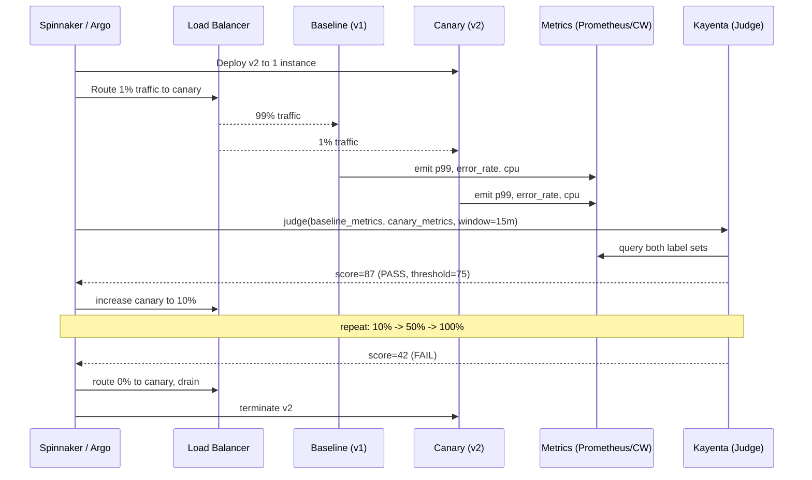
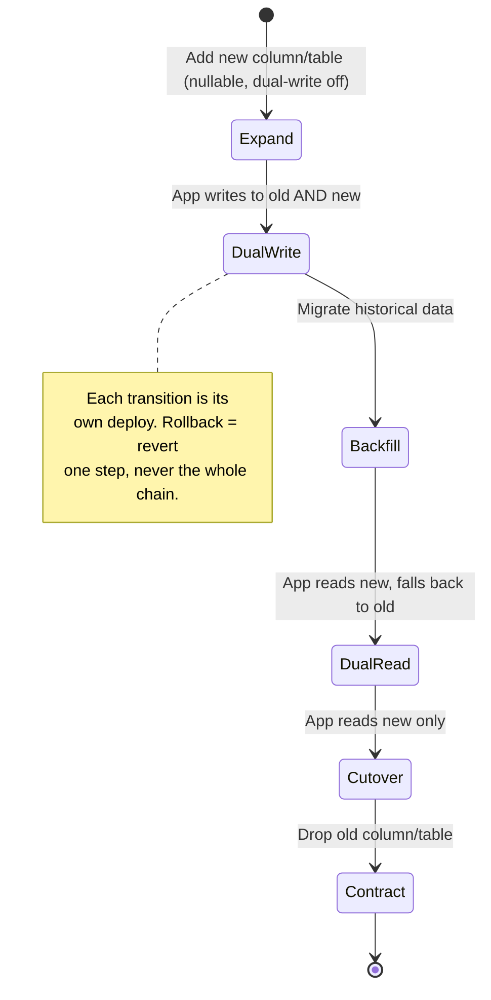

# Deployment Strategies

## Why This Exists

**Problem.** A release is the single most likely cause of an outage. Most production incidents trace back to a recent change, and the deployment mechanism — not the code — often decides whether a bug becomes a 30-second blip or a four-hour postmortem. Teams default to "rolling update" because Kubernetes does it by default, then get burned the first time they deploy a backwards-incompatible schema, a regression that only shows up under real traffic, or a change that interacts badly with a long-lived connection pool.

**Key insight.** Deployment strategy is a **risk-budgeting** decision, not a tooling decision. You are choosing how much blast radius a bad version is allowed to have, how fast you can detect it, and how cheaply you can revert. Blue-green minimizes blast radius at the cost of capacity; canary minimizes capacity cost at the cost of detection time; rolling is cheap and middling on both axes; shadow eliminates user-visible risk entirely but cannot validate write paths. The hard part isn't picking — it's making the choice **compatible with your database schema, stateful connections, and feature flags** so rollback is actually possible.

**Reach for this when:**
- A deploy needs to be reversible in seconds, not minutes (payments, auth, billing).
- You want to validate a new version with **real traffic** before betting the fleet on it.
- A change is risky enough that "deploy and watch dashboards" isn't acceptable — you want statistical comparison (Kayenta-style ACA).
- You're shipping a backwards-incompatible API or schema change and need a migration plan, not just a deploy plan.
- The blast radius of a regression at 100% rollout would be a paging incident.

**Don't reach for this when:**
- You're deploying a **stateless dev/staging service** with low traffic — a rolling update is fine, don't overengineer.
- The change is a documentation/config-only flag flip — feature flags are the right tool, not a redeploy.
- You're in a pre-product-market-fit prototype where speed > safety. (But know you're making the trade.)
- Your service has no health checks and no metrics — fix observability first; no deployment strategy can save you from blind rollouts.

---

## Diagrams

### Strategy comparison — traffic shape over time

```mermaid
flowchart TD
    subgraph BG["Blue-Green"]
        BG1[100% v1] -->|cutover| BG2[100% v2]
    end
    subgraph CN["Canary"]
        CN1[100% v1] --> CN2[99% v1 / 1% v2]
        CN2 --> CN3[90% v1 / 10% v2]
        CN3 --> CN4[50% / 50%]
        CN4 --> CN5[100% v2]
    end
    subgraph RL["Rolling"]
        RL1[N pods v1] --> RL2[N-1 v1 / 1 v2]
        RL2 --> RL3[gradual replace]
        RL3 --> RL4[N pods v2]
    end
    subgraph SH["Shadow"]
        SH1[100% v1 serves users] --> SH2[v2 receives copy of traffic]
        SH2 --> SH3[compare responses, discard v2 output]
    end
```



### Canary with automated analysis (Kayenta pattern)



### Expand/contract for DB-coupled deploys



---

## The Four Strategies

### 1. Blue-Green

Two identical environments. **Blue** serves all traffic. Deploy v2 to **green**, smoke-test it, flip the load balancer. Old environment stays warm for instant rollback.

```yaml
# AWS ALB target group swap (Terraform)
resource "aws_lb_listener_rule" "active" {
  listener_arn = aws_lb_listener.https.arn
  priority     = 1
  action {
    type             = "forward"
    target_group_arn = var.active_color == "blue" ? aws_lb_target_group.blue.arn : aws_lb_target_group.green.arn
  }
  condition {
    path_pattern { values = ["/*"] }
  }
}
# Cutover: change var.active_color from "blue" to "green", terraform apply.
# Rollback: change it back. Seconds, not minutes.
```

**When it shines.** Stateless services where you can afford 2× capacity during the window. Strong rollback story — flip the LB back, you're done. Excellent for **scheduled-window deploys** (e.g., financial systems with maintenance windows).

**When it bites.**
- **Long-lived connections** (WebSocket, gRPC streaming, DB connection pools) don't migrate cleanly. You either drain them slowly (defeating the "instant cutover" property) or kill them (user-visible).
- **Database is shared.** Both colors hit the same DB. If v2 needs a schema change, blue-green alone does nothing — you need expand/contract on top.
- **Cost.** 2× steady-state capacity, or you accept reduced capacity during the window.
- **Cache warmup.** Green starts cold. Cutover at peak traffic = p99 spike from cache misses. Pre-warm green with synthetic or shadow traffic before flipping.

### 2. Canary

Route a small slice of real traffic to v2. Watch metrics. If healthy, increase the slice. If not, drain and roll back.

```yaml
# Argo Rollouts canary with analysis
apiVersion: argoproj.io/v1alpha1
kind: Rollout
metadata:
  name: payments-api
spec:
  replicas: 20
  strategy:
    canary:
      canaryService: payments-canary
      stableService: payments-stable
      trafficRouting:
        istio:
          virtualService:
            name: payments-vs
            routes: [primary]
      steps:
        - setWeight: 1            # 1% canary
        - pause: { duration: 10m }
        - analysis:               # automated check
            templates:
              - templateName: success-rate-and-latency
            args:
              - name: service-name
                value: payments-canary
        - setWeight: 10
        - pause: { duration: 15m }
        - analysis: { templates: [{ templateName: success-rate-and-latency }] }
        - setWeight: 50
        - pause: { duration: 30m }
        - setWeight: 100
---
apiVersion: argoproj.io/v1alpha1
kind: AnalysisTemplate
metadata:
  name: success-rate-and-latency
spec:
  args:
    - name: service-name
  metrics:
    - name: success-rate
      interval: 1m
      successCondition: result[0] >= 0.995
      failureLimit: 3
      provider:
        prometheus:
          address: http://prometheus.monitoring:9090
          query: |
            sum(rate(http_requests_total{service="{{args.service-name}}",code!~"5.."}[5m]))
            /
            sum(rate(http_requests_total{service="{{args.service-name}}"}[5m]))
    - name: p99-latency-ratio
      interval: 1m
      # canary p99 must not be >20% worse than stable
      successCondition: result[0] <= 1.20
      provider:
        prometheus:
          address: http://prometheus.monitoring:9090
          query: |
            histogram_quantile(0.99, sum(rate(http_request_duration_seconds_bucket{service="payments-canary"}[5m])) by (le))
            /
            histogram_quantile(0.99, sum(rate(http_request_duration_seconds_bucket{service="payments-stable"}[5m])) by (le))
```

**When it shines.** You need to validate a change against **real production traffic patterns** that staging cannot reproduce (long-tail user agents, regional quirks, real payment processors). Cheaper than blue-green — only one extra instance during the early stages.

**When it bites.**
- **Sticky sessions / user routing.** If 1% of users land on the canary and a bug corrupts their cart, you've still corrupted real carts. "Canary" doesn't mean "safe", it means "small blast radius".
- **Slow signals.** Bugs that only manifest after hours (memory leaks, slow query plan regressions) need long bake times. Don't auto-promote in 10 minutes.
- **Asymmetric load.** If your LB routes 1% by request count but those 1% are heavy users, your canary sees disproportionate load. Use weighted routing on user IDs, not request counts, when load varies by user.
- **Cardinality of users on canary.** With 1% routing, low-traffic features may never hit the canary at all. Bake time must scale with feature traffic.

#### Automated Canary Analysis (Kayenta)

Spinnaker's **Kayenta** popularized statistical canary judgment: instead of "is canary error rate < 1%?", compare canary metrics **against a baseline deployed simultaneously** using Mann-Whitney U tests on each metric. This controls for environmental noise (a deploy during a traffic spike won't false-fail because both baseline and canary see the spike).

```json
// Kayenta canary config (excerpt)
{
  "name": "payments-canary-config",
  "metrics": [
    {
      "name": "error-rate",
      "query": {
        "type": "prometheus",
        "metricName": "http_requests_total",
        "labelBindings": ["code=~\"5..\""]
      },
      "groups": ["critical"],
      "analysisConfigurations": {
        "canary": {
          "direction": "increase",
          "nanStrategy": "replace",
          "critical": true
        }
      }
    },
    {
      "name": "p99-latency",
      "query": { "type": "prometheus", "metricName": "request_duration_seconds_p99" },
      "groups": ["critical"],
      "analysisConfigurations": {
        "canary": { "direction": "increase", "critical": true }
      }
    },
    {
      "name": "cpu-usage",
      "groups": ["informational"],
      "analysisConfigurations": { "canary": { "direction": "either", "critical": false } }
    }
  ],
  "classifier": {
    "groupWeights": { "critical": 100, "informational": 0 },
    "scoreThresholds": { "pass": 75, "marginal": 50 }
  }
}
```

**Key Kayenta principles** (from the Netflix/Google paper):
- Always deploy a **baseline** alongside the canary, even though you have stable production. The baseline is a fresh instance of v1 that gets the same routing weight as the canary, so both are compared on equal footing (cold caches, fresh JVM, same instance type).
- **Direction matters.** Latency increasing is bad. CPU increasing might be fine if throughput is up. Error rate increasing is always bad.
- **Critical vs informational.** Critical metrics fail the canary; informational metrics annotate but don't block.
- **Score threshold.** Below 75 = fail, 75–99 = marginal (human review), 100 = pass. Tune to your tolerance.

### 3. Rolling

Replace instances N at a time. Kubernetes default. Cheap, simple, no extra capacity needed beyond surge.

```yaml
apiVersion: apps/v1
kind: Deployment
metadata: { name: api }
spec:
  replicas: 20
  strategy:
    type: RollingUpdate
    rollingUpdate:
      maxSurge: 25%        # at most 25 pods total during rollout
      maxUnavailable: 0    # never drop below 20 healthy pods
  template:
    spec:
      containers:
        - name: api
          image: api:v2
          readinessProbe:
            httpGet: { path: /health/ready, port: 8080 }
            initialDelaySeconds: 10
            periodSeconds: 5
            failureThreshold: 3
          # MUST: readiness gates prevent routing traffic to a pod that
          # has started but hasn't warmed its connection pools / cache.
          startupProbe:
            httpGet: { path: /health/startup, port: 8080 }
            failureThreshold: 30
            periodSeconds: 10
```

**When it shines.** Stateless services with good health checks, where small partial failures during rollout are tolerable. The default for a reason.

**When it bites.**
- **Mixed-version state.** During the rollout, both v1 and v2 are serving traffic simultaneously. If they share a cache, a queue, or a database with incompatible schemas, you have a **silent corruption window**.
- **Sticky bugs.** A bug only triggered at 100% of traffic on v2 is invisible during a 25% rollout — and then it's too late.
- **Rollback is also a rolling update.** "Rollback" means another full rolling update back to v1. Not seconds. Minutes, sometimes longer than the original rollout.
- **No automated gating.** Vanilla Kubernetes rolling updates have no concept of "pause and check metrics". Bare rolling updates without analysis are how you ship a regression to 100% before alarms fire.

### 4. Shadow (Mirror / Dark Launch)

Send a **copy** of production traffic to v2, but don't return its responses to users. Compare outputs offline.

```yaml
# Istio VirtualService: mirror 100% of traffic to v2, serve only v1
apiVersion: networking.istio.io/v1beta1
kind: VirtualService
metadata: { name: api }
spec:
  hosts: [api]
  http:
    - route:
        - destination: { host: api, subset: v1 }
          weight: 100
      mirror:
        host: api
        subset: v2
      mirrorPercentage: { value: 100.0 }
```

```python
# Comparison harness — log divergences for offline analysis
import hashlib, json, structlog
log = structlog.get_logger()

def compare_responses(req_id, v1_resp, v2_resp):
    if v1_resp.status_code != v2_resp.status_code:
        log.warn("status_divergence", req_id=req_id,
                 v1=v1_resp.status_code, v2=v2_resp.status_code)
        return
    # Normalize: drop fields that legitimately vary (timestamps, request_ids).
    def normalize(body):
        d = json.loads(body)
        for k in ("server_time", "request_id", "trace_id"):
            d.pop(k, None)
        return json.dumps(d, sort_keys=True)
    h1 = hashlib.sha256(normalize(v1_resp.text).encode()).hexdigest()
    h2 = hashlib.sha256(normalize(v2_resp.text).encode()).hexdigest()
    if h1 != h2:
        log.warn("body_divergence", req_id=req_id,
                 v1_hash=h1[:8], v2_hash=h2[:8])
```

**When it shines.** Refactors and rewrites where behavior should be identical. Performance validation under real load. ML model rollouts where you want to compare predictions side-by-side.

**When it bites.**
- **Side effects double-fire.** If v2 charges a credit card, sends an email, or writes to a queue, shadowing causes **duplicate charges and duplicate emails**. You must stub or sandbox every write path before mirroring. This is the #1 failure mode of shadow deployments.
- **Downstream load doubles.** v2 calling the same downstream services as v1 means 2× load on dependencies. Either downstream services need to scale, or v2 must hit isolated stubs.
- **Cannot validate write correctness.** Shadow only validates read paths and pure compute. A new payment flow cannot be validated by shadow alone — you still need a canary for the writes.
- **Response timing.** If v2 is slow, mirrored requests pile up. Set aggressive timeouts on the mirror path.

---

## Database-Coupled Deploys: Expand/Contract

Most deployment failures aren't in the application — they're in the database migration that the application depends on. You **cannot** blue-green or canary across a backwards-incompatible schema change. The fix is the **expand/contract pattern** (also called "parallel change" — Fowler):

| Phase | Schema | App v1 | App v2 |
|---|---|---|---|
| 1. Expand | Add nullable `email_normalized` column | reads/writes `email` | not deployed |
| 2. Dual-write | (same) | writes `email` only | writes `email` AND `email_normalized` |
| 3. Backfill | (same) | (same) | (same) — async job populates `email_normalized` for old rows |
| 4. Dual-read | (same) | reads `email` | reads `email_normalized` ?? `email` |
| 5. Cutover | (same) | reads `email` | reads `email_normalized` only |
| 6. Contract | Drop `email` column | (decommissioned) | reads/writes `email_normalized` |

**Each row is its own deploy.** You can roll back any single transition without rolling back the data. Never combine schema changes with application logic in one deploy — the rollback path is too dangerous.

```sql
-- Phase 1 (Expand): MUST be backwards-compatible.
ALTER TABLE users ADD COLUMN email_normalized TEXT;
-- DO NOT add NOT NULL here. Old code paths don't write it.
-- DO NOT add a default that triggers a table rewrite on large tables (Postgres < 11).

-- Phase 3 (Backfill): chunked, idempotent, throttled.
-- WHY chunked: a single UPDATE on 1B rows = lock contention + WAL blowup.
DO $$
DECLARE
  batch_size INT := 10000;
  affected INT;
BEGIN
  LOOP
    UPDATE users
       SET email_normalized = lower(trim(email))
     WHERE email_normalized IS NULL
       AND id IN (
         SELECT id FROM users
          WHERE email_normalized IS NULL
          LIMIT batch_size FOR UPDATE SKIP LOCKED
       );
    GET DIAGNOSTICS affected = ROW_COUNT;
    EXIT WHEN affected = 0;
    COMMIT;
    PERFORM pg_sleep(0.1);  -- backpressure
  END LOOP;
END $$;

-- Phase 6 (Contract): only after monitoring confirms zero reads of old column.
-- Add metric: count(*) WHERE email IS NOT NULL AND email_normalized IS NULL = 0
ALTER TABLE users DROP COLUMN email;
```

**Hard rules:**
- Migrations run **before** the app deploy that depends on them, never as part of it.
- Migrations must be **online** (no long table locks). Use `pt-online-schema-change` (MySQL), Postgres `CREATE INDEX CONCURRENTLY`, or `gh-ost`.
- Every step is reversible **forward**. You don't roll back a backfill — you write a new migration that nulls the column.
- Monitor the contract step for at least one full traffic cycle (typically a week) before dropping the old column.

---

## Trade-offs

| Strategy | Benefit | Cost |
|---|---|---|
| **Blue-Green** | Instant rollback (LB flip); full pre-cutover validation in green | 2× capacity; long-lived connections drop; shared DB still couples versions |
| **Canary** | Validates against real traffic; small blast radius; statistical rigor with ACA | Slow rollout; mixed-version state; sticky-session edge cases; needs strong metrics |
| **Rolling** | Cheap; default in K8s; smooth capacity profile | Mixed-version state for the whole rollout; rollback is also slow; no built-in gating |
| **Shadow** | Zero user-visible risk; great for refactors and load testing | Side effects double-fire; 2× downstream load; can't validate write paths; comparison harness is its own engineering project |
| **Expand/Contract** | Decouples schema from app deploys; each step independently reversible | More deploys (5–6 per "feature"); requires discipline; backfills can take days on large tables |

---

## Common Pitfalls

- **"We have rollback because we have CI/CD."** No. Rollback is the deploy in reverse, plus a database that's still compatible with the old code. If your migration drops a column, you do not have rollback.
- **Shadow traffic to a service that sends emails.** Customers got 2× the password-reset emails for a week. Stub all I/O before mirroring.
- **Canary auto-promotes in 5 minutes.** A memory leak doubles RSS every 30 minutes. The canary looked great. The full fleet OOMed at 03:00. Bake time must exceed the slowest signal you care about.
- **Blue-green at peak traffic.** Cutover sent 100% of traffic to a fleet with cold connection pools. p99 spiked 10×. Pre-warm green with synthetic load or a shadow phase before flipping.
- **Rolling update with no readiness gate.** New pods reported ready before their JVM finished warming, took traffic, and timed out. `readinessProbe` was checking `/health` which returned 200 the moment the HTTP server started. Add a real readiness check that exercises dependencies.
- **Canary on user_id % 100 < 1, but feature only used by power users.** Canary saw zero traffic for the new feature. Promoted to 100%. Power users hit the bug. **Route by user attribute relevant to the feature, not random hash.**
- **DB-coupled deploys with no expand/contract.** Migration adds NOT NULL column with no default. Deploy of v1 (pre-migration) fails because old rows don't satisfy the constraint. Deploy of v2 (post-migration) works. Rollback to v1 is impossible without a counter-migration.
- **Promoting a canary at 50% with one minute of green metrics.** The canary was on 50% for 1 minute, every metric green, promote. Turns out the failure mode triggered on a once-per-hour cron. Time-window your gates to the periodicity of your workload.
- **No baseline in canary analysis.** Comparing canary metrics directly to long-running stable production is biased — stable has warm caches, the canary doesn't. Always deploy a fresh baseline alongside the canary (Kayenta's core insight).
- **Rolling back the application but not the feature flag.** v2 introduced a flag, the flag wrote to a new DB column, you rolled back the binary but not the flag config — flag is still on, v1 doesn't know about the column, errors. Treat config changes as deploys.

---

## Decision Table

| Situation | Use | Why |
|---|---|---|
| Stateless service, good health checks, low-risk change | **Rolling** | Cheapest; default for a reason |
| Payments / auth / billing — must rollback in seconds | **Blue-Green** | LB flip is the fastest rollback known |
| New ML model, new ranking algorithm, refactor of pure compute | **Shadow then Canary** | Shadow validates correctness offline; canary validates writes |
| Backwards-incompatible schema or API change | **Expand/Contract + Canary** | The migration is the deploy; canary the app on top |
| Service with long-lived gRPC/WebSocket connections | **Canary with long bake** | Blue-green drops the connections; rolling fights the same problem; canary lets you drain gracefully |
| Stateful service (DB, queue, cache) | **In-place rolling with leader election + N+1 redundancy** | Blue-green doubles your data footprint; not viable for storage |
| Untrusted third-party code (plugin, customer-supplied lambda) | **Canary at very low % with strict ACA** | You cannot trust the code; minimize blast radius until proven |
| Internal tool, single-digit users | **Rolling, no analysis** | Don't overengineer; the users will tell you if it broke |
| Change that interacts with downstream rate limits | **Canary, never shadow** | Shadow doubles outbound calls and trips downstream limits |
| Mobile app backend with long client TTLs | **Blue-Green or Canary with version pinning** | Mobile clients won't refresh for hours; new server must support old clients regardless |

---

## References

- **Martin Fowler — BlueGreenDeployment** — https://martinfowler.com/bliki/BlueGreenDeployment.html — the canonical formulation; read this first.
- **Martin Fowler — ParallelChange (expand/contract)** — https://martinfowler.com/bliki/ParallelChange.html — the schema-migration discipline.
- **Martin Fowler — CanaryRelease** — https://martinfowler.com/bliki/CanaryRelease.html
- **Spinnaker / Netflix — Automated Canary Analysis (Kayenta)** — https://netflixtechblog.com/automated-canary-analysis-at-netflix-with-kayenta-3260bc7acc69
- **Spinnaker docs — Kayenta canary configuration** — https://spinnaker.io/docs/guides/user/canary/
- **Argo Rollouts — progressive delivery for Kubernetes** — https://argoproj.github.io/argo-rollouts/
- **Google SRE Book — Ch. 8: Release Engineering** — https://sre.google/sre-book/release-engineering/
- **Google SRE Book — Ch. 27: Reliable Product Launches at Scale** — https://sre.google/sre-book/reliable-product-launches/
- **SRE Workbook — Ch. 16: Canarying Releases** — https://sre.google/workbook/canarying-releases/
- **AWS Builders' Library — Going faster with continuous delivery** — https://aws.amazon.com/builders-library/going-faster-with-continuous-delivery/
- **AWS Builders' Library — Automating safe, hands-off deployments** — https://aws.amazon.com/builders-library/automating-safe-hands-off-deployments/
- **AWS Builders' Library — Ensuring rollback safety during deployments** — https://aws.amazon.com/builders-library/ensuring-rollback-safety-during-deployments/
- **DDIA — Ch. 4: Encoding and Evolution** — schema evolution and backwards/forwards compatibility (Kleppmann, O'Reilly 2017).
- **DDIA — Ch. 5: Replication** — implications for multi-version state during rollout.
- **Jez Humble & David Farley — Continuous Delivery** — Addison-Wesley 2010 — chapters on deployment pipelines and zero-downtime releases.
- **Charity Majors — "Test in production"** — https://charity.wtf/2021/06/30/observability-and-the-glorious-future-2/ — the empirical case for canary > staging.
- **GitHub — gh-ost (online MySQL schema migration)** — https://github.com/github/gh-ost
- **Percona — pt-online-schema-change** — https://docs.percona.com/percona-toolkit/pt-online-schema-change.html

---

## See Also

- `../feature-flags/` — decouple deploy from release; the missing half of canary
- `../circuit-breaker/` — protect against the bad version's downstream effects during rollout
- `../health-checks/` — readiness vs liveness; the foundation any deployment strategy stands on
- `../chaos-engineering/` — validate that your rollback path actually works before you need it
