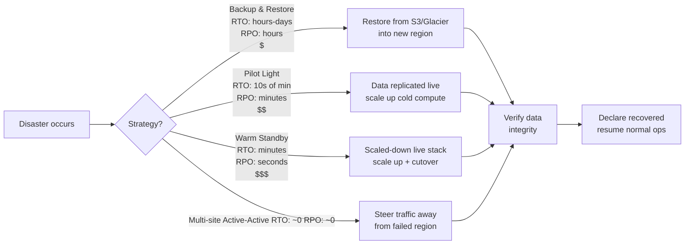
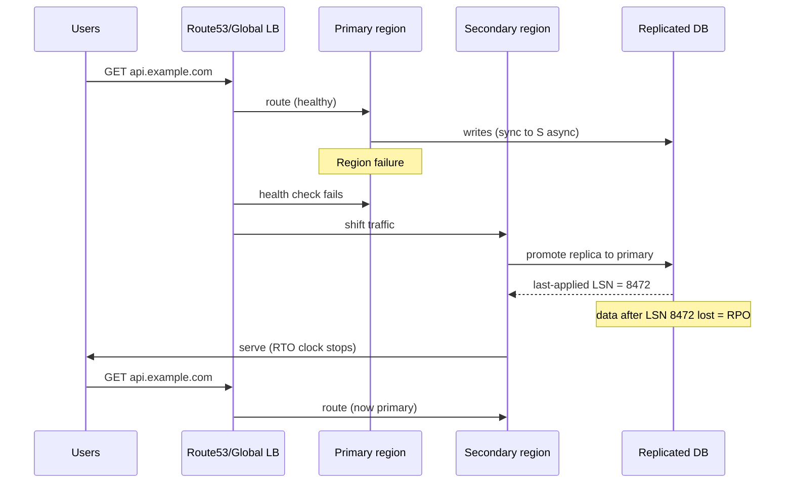
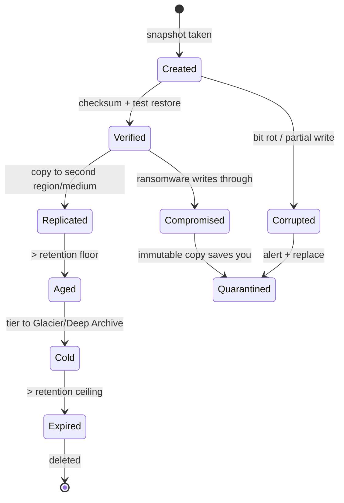
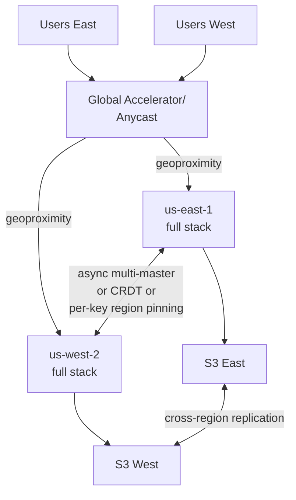

# Disaster Recovery

## Why This Exists

**Problem.** Most teams have backups. Few teams have *recovery*. The gap between "we take nightly snapshots" and "we restored a 4 TB Postgres into a new region in 47 minutes with verified data integrity" is a chasm filled with: untested runbooks, IAM roles that only exist in the dead account, encryption keys stored in the dead region, DNS TTLs of 24 hours, and a senior engineer who is on a plane.

**Key insight.** *DR is a product feature, not an ops checkbox.* Recovery time and recovery point are measurable, testable SLOs that trade off directly against cost. Pick numbers, then engineer to them — never the other way around. Untested DR is *worse than no DR* because it creates false confidence.

The two numbers that drive every other decision:

- **RPO (Recovery Point Objective)** — *how much data can you lose?* The maximum acceptable gap between the last durable write and the disaster. Zero RPO is synchronous replication (and pays a latency tax on every write). 5 minutes is async replication. 24 hours is nightly snapshots.
- **RTO (Recovery Time Objective)** — *how long can you be down?* The clock from disaster declared to service restored. Seconds = active-active. Minutes = warm standby. Hours = pilot light. Days = restore-from-backup.

**Reach for this when:**
- You're sizing a DR strategy from scratch and need to cost-justify active-active vs pilot light.
- You're picking RPO/RTO targets for an SLO conversation with the business.
- A regulator (SOC2, HIPAA, PCI-DSS, FFIEC, GDPR) is asking for a tested DR plan.
- Backups exist but no one has ever done a full restore.
- You suspect ransomware blast radius would also encrypt your backups (it usually does).

**Don't reach for this when:**
- The problem is intra-AZ HA (use auto-scaling groups, multi-AZ RDS, leader election — that's *availability*, not DR).
- You need application-level rollback after a bad deploy (that's deployment hygiene — feature flags, blue/green, canary).
- The data is fully ephemeral (caches, derived state) — recovering those is a *capacity* problem, not DR.

---

## Diagrams

### The four AWS DR strategies, by RTO/RPO and cost



### Failover sequence for an active-passive multi-region service



### State of a backup over its lifecycle



---

## RPO and RTO — picking numbers honestly

The cost curve of DR is **superlinear** as RPO/RTO approach zero. A useful first-order model:

| RPO     | RTO      | Strategy            | Approx. cost multiplier vs single-region |
|---------|----------|---------------------|------------------------------------------|
| 24 h    | 24 h     | Backup & restore    | 1.05x (storage only)                    |
| 1 h     | 4 h      | Pilot light         | 1.2x                                    |
| 1 min   | 10 min   | Warm standby        | 1.5–2x                                  |
| ~0      | ~0       | Active-active       | 2–2.5x + dev complexity tax             |

**How to pick:**

1. **Cost of downtime per minute** — for an e-commerce checkout this is direct revenue + reputation; for an internal HR tool it's near zero during off-hours.
2. **Cost of data loss per record** — financial transactions are non-negotiable; analytics events tolerate hours of loss.
3. **Regulatory floor** — PCI-DSS, FFIEC, and many healthcare regs impose minimums regardless of business impact.
4. **Engineering cost** — active-active forces you to confront [conflict resolution, idempotency, and clock skew](../../data-systems/consistency-models/) on every write path. That tax is permanent.

Write the numbers down, get them signed off, and put them in your runbook header. *RPO/RTO is a contract.*

---

## The 3-2-1 backup rule (and why 3-2-1-1-0 is the modern version)

The classic rule, codified by US-CERT and widely adopted:

> **3** copies of data, on **2** different media, with **1** copy offsite.

The modern extension (Veeam's "3-2-1-1-0" formulation, now mainstream):

> 3 copies, 2 media, 1 offsite, **1 immutable/offline**, **0 errors after verification**.

### Why each number matters

- **3 copies** — production + 2 backups. Single backup = single point of failure (the backup tape that no one tested).
- **2 media** — disk + object storage, or object storage + tape. Defends against silent corruption affecting one storage class (e.g., a filesystem bug, a vendor outage, a misconfigured lifecycle policy that deletes everything).
- **1 offsite** — different region, different cloud account, or different cloud provider. Defends against region-wide events (AWS us-east-1 control plane, fires, floods, geopolitical seizure).
- **1 immutable** — S3 Object Lock in Compliance mode, AWS Backup Vault Lock, tape in a vault. Defends against **ransomware that uses your IAM credentials** (the modern threat — attackers encrypt or delete backups *first* before pivoting to production).
- **0 errors** — every backup is verified by *actual restore*, not just checksums. A backup you haven't restored is a hypothesis, not a backup.

### Concrete S3 implementation

```hcl
# Terraform — immutable S3 backup vault
resource "aws_s3_bucket" "dr_backups" {
  bucket = "acme-dr-backups-prod"
  # Object Lock can ONLY be enabled at bucket creation. Once on, it cannot be disabled.
  object_lock_enabled = true
}

resource "aws_s3_bucket_versioning" "dr_backups" {
  bucket = aws_s3_bucket.dr_backups.id
  versioning_configuration {
    status = "Enabled"
  }
}

resource "aws_s3_bucket_object_lock_configuration" "dr_backups" {
  bucket = aws_s3_bucket.dr_backups.id
  rule {
    default_retention {
      mode = "COMPLIANCE"  # GOVERNANCE allows privileged delete; COMPLIANCE does not.
      days = 35            # auditors usually want >= 30
    }
  }
}

# Cross-region replication into a SEPARATE AWS ACCOUNT.
# Same-account replication does not defend against credential compromise.
resource "aws_s3_bucket_replication_configuration" "dr_backups" {
  bucket = aws_s3_bucket.dr_backups.id
  role   = aws_iam_role.replication.arn

  rule {
    id     = "replicate-to-dr-account"
    status = "Enabled"
    destination {
      # Separate account ID — attacker compromising prod account can't delete this.
      bucket        = "arn:aws:s3:::acme-dr-vault-isolated"
      account       = var.dr_account_id
      storage_class = "DEEP_ARCHIVE"
      access_control_translation { owner = "Destination" }
    }
  }
}
```

The non-obvious win: **replicate into a separate AWS account with no human SSO access**, only break-glass credentials in a sealed vault. Compliance mode + cross-account = ransomware can't reach it even if every IAM user in prod is compromised.

---

## Restore drills — the only thing that actually matters

> "Untested backups are Schrödinger's data — simultaneously present and absent until you try to restore."

A backup that has never been restored is not a backup. It is a *prayer*. Most teams discover their DR is broken during the actual disaster, when they are also panicking, paged at 03:00, and have a CEO on the call.

### Drill cadence

| Drill type                  | Frequency       | What it proves                                                  |
|-----------------------------|-----------------|------------------------------------------------------------------|
| Snapshot restore (file-level) | weekly (auto)  | Backup files are readable, checksums match.                      |
| Database PITR restore       | monthly         | Logs replay, schema is intact, app can connect.                  |
| Region failover (game day)  | quarterly       | DNS, IAM, KMS keys, secrets all exist in DR region.              |
| Full company-wide DR        | annually        | Cross-team runbooks, on-call escalation, business comms work.    |
| Ransomware tabletop         | semi-annually   | Immutable backups are reachable; clean-room rebuild works.       |

### What a real restore drill looks like

```python
# tools/dr_drill.py — automated weekly restore verification
# Run from the DR region, NOT from the primary. If primary is down, the drill must still work.
import boto3, time, hashlib, sys
from datetime import datetime, timedelta

DR_REGION = "us-west-2"
PROD_REGION = "us-east-1"
EXPECTED_RPO_MINUTES = 60   # contract with the business
EXPECTED_RTO_MINUTES = 30   # contract with the business

rds = boto3.client("rds", region_name=DR_REGION)

def latest_snapshot(db_id: str) -> dict:
    snaps = rds.describe_db_snapshots(
        DBInstanceIdentifier=db_id,
        SnapshotType="automated",
    )["DBSnapshots"]
    return max(snaps, key=lambda s: s["SnapshotCreateTime"])

def assert_rpo(snap: dict) -> None:
    age = datetime.now(snap["SnapshotCreateTime"].tzinfo) - snap["SnapshotCreateTime"]
    if age > timedelta(minutes=EXPECTED_RPO_MINUTES):
        # Page someone. The contract is broken.
        raise AssertionError(f"RPO violated: snapshot is {age} old, contract is {EXPECTED_RPO_MINUTES}m")

def restore_and_time(snap_id: str) -> float:
    """Returns RTO in seconds. Uses a unique target id so we don't collide with prior drills."""
    target = f"dr-drill-{int(time.time())}"
    t0 = time.time()
    rds.restore_db_instance_from_db_snapshot(
        DBInstanceIdentifier=target,
        DBSnapshotIdentifier=snap_id,
        DBInstanceClass="db.t3.medium",  # smallest viable; we tear down after
    )
    waiter = rds.get_waiter("db_instance_available")
    waiter.wait(DBInstanceIdentifier=target, WaiterConfig={"MaxAttempts": 60})
    rto = time.time() - t0

    # CRITICAL: verify the data, not just that the instance booted.
    # An empty database boots happily. Run a known-row probe.
    verify_data_integrity(target)

    # Tear down — DR drills must not leak resources.
    rds.delete_db_instance(DBInstanceIdentifier=target, SkipFinalSnapshot=True)
    return rto

def verify_data_integrity(db_id: str) -> None:
    """Connect to restored DB and check a canary row that prod writes every minute."""
    # ... connect via secrets manager, run: SELECT canary_hash FROM dr_canary ORDER BY ts DESC LIMIT 1
    # ... compare against expected hash from prod's canary topic
    # If hash mismatches OR table missing OR connection fails → drill fails loudly.
    pass

if __name__ == "__main__":
    snap = latest_snapshot("acme-prod-primary")
    assert_rpo(snap)
    rto_seconds = restore_and_time(snap["DBSnapshotIdentifier"])
    if rto_seconds > EXPECTED_RTO_MINUTES * 60:
        sys.exit(f"RTO violated: {rto_seconds}s > {EXPECTED_RTO_MINUTES * 60}s")
    print(f"OK — RPO {snap['SnapshotCreateTime']}, RTO {rto_seconds:.0f}s")
```

The two anti-patterns this kills:

1. **Restore-success-without-data-verification.** An empty Postgres restores in 90 seconds and reports "available". Your drill must read a canary row that prod writes continuously and verify the hash.
2. **Restore-from-the-same-region.** If the snapshot only exists in `us-east-1` and your runbook restores in `us-east-1`, you have not tested DR. You have tested HA.

---

## Active-active vs active-passive (multi-region)

This is the hardest decision in DR architecture. Get it wrong and you either pay 2.5x for capacity you never use *or* you discover during a real failover that your "warm" standby has stale IAM, missing KMS grants, and an outdated TLS cert.

### Active-passive (warm standby / pilot light)

One region serves traffic; the other is sized to take over. Data flows one direction (primary → secondary) via async replication.

```yaml
# Pseudocode — Route53 health-check failover
# DNS routing as the failover primitive. Simple, slow (TTL-bound), but battle-tested.
resources:
  - type: route53.health_check
    id: primary-health
    target: api-primary.us-east-1.example.internal
    interval: 10s
    failure_threshold: 3   # ~30s to declare primary unhealthy

  - type: route53.record
    name: api.example.com
    type: A
    ttl: 30                # short TTL = fast failover, more DNS load
    failover_routing:
      - set: primary
        health_check: primary-health
        target: alb-primary.us-east-1.amazonaws.com
      - set: secondary
        target: alb-secondary.us-west-2.amazonaws.com
```

**Pros:** Simpler write path (single primary, no conflicts). Cheaper. Easier to reason about consistency.
**Cons:** Failover is *an event* — you discover what's broken under pressure. Cold capacity is slow to warm. Asymmetric load testing.

### Active-active

Both regions serve traffic; both accept writes. Requires conflict resolution.



**Pros:** RTO ≈ 0 — failover is just a traffic shift. You exercise the DR path *every day*. Lower latency for global users.
**Cons:** **You have to solve conflict resolution.** Concurrent writes to the same key in two regions need either:
- A single global writer per key (region-pinning by user/tenant), or
- A CRDT (last-writer-wins with HLC, or counters/sets that converge), or
- An explicit conflict-resolution callback (DynamoDB Global Tables = LWW, Cassandra = LWW, Spanner = TrueTime synchronous).

If your data model can't tolerate eventual consistency on the write path, active-active is *active-passive with extra steps*. See [DDIA ch. 5 (Replication)](../../data-systems/consistency-models/) and ch. 9 (Consistency and Consensus).

### The honest comparison

| Dimension                | Active-passive       | Active-active            |
|--------------------------|----------------------|--------------------------|
| RTO                      | 1–30 min             | 0–60 sec                 |
| RPO                      | Seconds–minutes (async) | Near-zero (sync) or seconds (async) |
| Cost (compute)           | 1.2–2x               | 2–2.5x                   |
| Cost (engineering)       | Moderate             | High (perpetual tax)     |
| Failover testing         | Periodic event       | Continuous               |
| Conflict resolution      | None (single writer) | Required                 |
| Operational complexity   | Medium               | High                     |
| Best for                 | Stateful core systems with strong consistency | Stateless services, CRDT-friendly data, global UX |

**The pragmatic middle.** Most production systems should be **active-active for stateless services + active-passive for the system of record**. Your API tier and caches run hot in both regions; your Postgres has a single primary with a hot standby. This gives you ~minute RTO without paying the full active-active tax on the data layer.

---

## Data residency

DR plans collide with data residency law in three predictable places:

1. **GDPR Article 44–50** — personal data of EU residents may not be transferred outside the EEA without an adequacy decision or SCCs. Your "DR copy in us-west-2" may be illegal if it contains EU PII.
2. **China PIPL / Russia 242-FZ / India DPDP** — explicit data localization. Backups must stay in-country, which means your DR region is also in-country, which means a country-wide event has no recovery path.
3. **HIPAA & FedRAMP** — require BAAs and authorized regions. AWS GovCloud is its own DR domain; you cannot fail over to commercial regions.

Practical patterns:

- **Tenant-keyed region pinning.** Each tenant has a `home_region` column. All their data (and backups) live there. DR within that legal boundary (eu-west-1 ↔ eu-central-1).
- **Encryption with regional keys.** Data is encrypted with KMS keys that don't leave the region. The ciphertext can replicate freely; the keys can't. If the region is gone *and* the keys are gone, the data is gone — by design.
- **Anonymization for cross-region analytics.** PII stays in-region; pseudonymized event streams flow to a global lake.

This is why **active-active across legal boundaries is usually impossible** for systems with regulated PII. You end up with N independent active-passive deployments, one per jurisdiction.

---

## AWS Well-Architected DR pillar — the four strategies in one table

The [AWS Well-Architected Reliability Pillar](https://docs.aws.amazon.com/wellarchitected/latest/reliability-pillar/) and the [Disaster Recovery whitepaper](https://docs.aws.amazon.com/whitepapers/latest/disaster-recovery-workloads-on-aws/disaster-recovery-options-in-the-cloud.html) define a canonical taxonomy:

| Strategy           | RTO          | RPO          | Cost  | What's running in DR region                                |
|--------------------|--------------|--------------|-------|-------------------------------------------------------------|
| Backup & Restore   | hours–days   | hours        | $     | Nothing. Just snapshots in S3.                              |
| Pilot Light        | 10s of min   | minutes      | $$    | Data replicating live; compute is OFF or minimal.           |
| Warm Standby       | minutes      | seconds      | $$$   | Scaled-down full stack; ready to scale up.                  |
| Multi-site A/A     | seconds      | near-zero    | $$$$  | Full stack at 50%+ capacity, serving traffic.               |

The whitepaper's most-overlooked guidance: **the strategy should be measured per-workload, not per-company.** Your billing system might be warm-standby; your marketing site might be backup-and-restore; your fraud detection might be active-active. Mixing strategies is the right answer.

---

## Trade-offs

| Benefit                                     | Cost                                                                       |
|---------------------------------------------|----------------------------------------------------------------------------|
| Lower RPO via synchronous replication       | Write latency tax on every transaction (cross-AZ ~1–2ms, cross-region 30–80ms+) |
| Lower RTO via active-active                 | Conflict resolution complexity + 2x+ infra cost forever                    |
| Cheaper RTO/RPO via async replication       | Acknowledge data loss window — write it into the SLO contract              |
| 3-2-1-1 backups defeat ransomware           | Storage cost ~3x; immutable backups can't be deleted to fix mistakes       |
| Frequent restore drills catch silent rot    | Engineering hours; production-like test infra; tear-down discipline        |
| Multi-region failover via DNS               | TTL-bound recovery floor (~30s+); some clients ignore TTL                  |
| Pilot light minimizes idle compute cost     | Cold-start time on failover; capacity may not be available when you need it |
| Cross-account backups defeat IAM compromise | Operational complexity; cross-account IAM is its own attack surface        |
| Region pinning satisfies data residency     | DR within the same legal jurisdiction only; correlated risk in country-wide events |

---

## Common Pitfalls

- **The runbook lives in the failed region.** Confluence/Wiki hosted on the same infra you're trying to recover. **Mitigation:** PDF the top 5 runbooks quarterly, store in S3 cross-region + on every on-call laptop.
- **The IAM role only exists in the dead region.** Cross-region failover needs IAM principals, KMS keys, secrets, ECR images all pre-staged in DR. Bootstrap the DR region with Terraform/CDK *from a third location*.
- **DNS TTLs of 24 hours.** You can't fail over faster than your TTL, and many DNS resolvers ignore short TTLs anyway. Use Route53 health checks + 30–60s TTL, and accept that some clients will be slow.
- **Backups encrypted with keys that only exist in prod.** If the KMS key is regional and the region is gone, the backups are entropy. Use AWS KMS multi-region keys or replicate keys explicitly.
- **"Snapshot succeeded" ≠ "data is recoverable."** EBS snapshots can succeed against a corrupted filesystem. Postgres logical backups (`pg_dump`) succeed against tables but not against undumped sequences. Run actual restore + integrity checks.
- **Ransomware encrypts your backups first.** Modern ransomware actors live in the network for weeks, identify backup systems, and destroy them *before* triggering encryption. Immutable storage (Object Lock COMPLIANCE) is the only defense.
- **Drift between primary and standby config.** The DR region was set up 18 months ago and has drifted — different AMI, different runtime, different DB extension list. Use IaC and run the same pipeline into both regions.
- **The drill is a script, not a person.** A scripted drill exercises the script. A real disaster has a frantic human typing. Run "find the runbook with no warning" drills — page someone at random and time their TTI (time to instructions).
- **Restore tests don't include the application.** You restored Postgres but never confirmed the app could connect with new credentials, new DNS, new TLS certs, new VPC peering. Restore the *system*, not the database.
- **No one knows who declares disaster.** Failover is destructive (split-brain risk). The decision authority must be defined *before* the disaster — usually a named on-call lead with a documented checklist.
- **Cross-region replication lag is silent.** Async replication accumulates lag during high write load. Monitor `ReplicaLag` and alarm at >1.5x your RPO. A 6-hour-lagged replica is not a 5-minute-RPO replica.
- **Backup window collides with batch job.** Snapshot during nightly ETL gives you a snapshot of half-applied state. Use crash-consistent application-level backups (`pg_basebackup`, MongoDB `mongodump --oplog`) or pause the writer.

---

## Decision Table

| If…                                                                         | Then use…                                | Not…                                                |
|-----------------------------------------------------------------------------|------------------------------------------|------------------------------------------------------|
| Internal tool, downtime tolerable in hours                                  | Backup & Restore (S3 + IaC)              | Active-active (massively over-engineered)            |
| Customer-facing app, RTO < 30 min, single primary writer OK                 | Warm standby + Route53 failover          | Backup-and-restore (RTO too slow)                    |
| Global product with users on every continent, low latency required         | Active-active with region-pinned writes  | Active-passive (latency suffers for far-region users)|
| Strong consistency required (financial ledger)                              | Active-passive with sync replication or Spanner-style consensus | Multi-master active-active (conflicts will eat you) |
| Regulated PII with data residency                                           | Per-jurisdiction active-passive          | Cross-jurisdiction active-active (illegal)           |
| Ransomware is in your threat model (it is)                                  | 3-2-1-1: immutable cross-account backups | Same-account snapshots only                          |
| Stateless service with DB elsewhere                                         | Multi-region active-active stateless tier| Pilot light (wasteful — compute is cheap stateless)  |
| You have one engineer doing DR part-time                                    | Backup & restore + quarterly drills      | Active-active (operational burden too high)          |
| You're at a regulated bank/healthcare/payments                              | Warm standby minimum, documented drills, named DR officer | Backup-and-restore (won't pass audit) |
| Storage system itself supports global tables (DynamoDB, Spanner, Cosmos)   | Use the managed multi-region feature     | Building your own replication on top                 |

---

## References

- AWS — *Disaster recovery options in the cloud* (Well-Architected) — https://docs.aws.amazon.com/whitepapers/latest/disaster-recovery-workloads-on-aws/disaster-recovery-options-in-the-cloud.html
- AWS — *Reliability Pillar — AWS Well-Architected Framework* — https://docs.aws.amazon.com/wellarchitected/latest/reliability-pillar/welcome.html
- AWS Builders' Library — *Static stability using Availability Zones* (Becky Weiss) — https://aws.amazon.com/builders-library/static-stability-using-availability-zones/
- AWS Builders' Library — *Implementing health checks* — https://aws.amazon.com/builders-library/implementing-health-checks/
- AWS — *Backup and recovery approaches on AWS* — https://docs.aws.amazon.com/whitepapers/latest/backup-recovery/backup-recovery.html
- AWS — *S3 Object Lock* (immutability primitive) — https://docs.aws.amazon.com/AmazonS3/latest/userguide/object-lock.html
- Google SRE Book — Ch. 26 *Data Integrity: What You Read Is What You Wrote* — https://sre.google/sre-book/data-integrity/
- Google SRE Workbook — Ch. 9 *Incident Response* — https://sre.google/workbook/incident-response/
- Google — *Building Secure & Reliable Systems* — Ch. 9 *Design for Recovery* — https://sre.google/books/building-secure-reliable-systems/
- Kleppmann — *Designing Data-Intensive Applications*, Ch. 5 (Replication) and Ch. 8 (Trouble with Distributed Systems) — O'Reilly 2017
- US-CISA — *Data Backup Options* (origin of the 3-2-1 rule) — https://www.cisa.gov/sites/default/files/publications/data_backup_options.pdf
- Veeam — *3-2-1-1-0 backup rule* — https://www.veeam.com/blog/321-backup-rule.html
- NIST SP 800-34 Rev. 1 — *Contingency Planning Guide for Federal Information Systems* — https://csrc.nist.gov/publications/detail/sp/800-34/rev-1/final
- Werner Vogels — *Eventually Consistent* (CACM 2009) — https://www.allthingsdistributed.com/2008/12/eventually_consistent.html
- Pat Helland — *Life Beyond Distributed Transactions* — https://queue.acm.org/detail.cfm?id=3025012
- ISO/IEC 27031 — *Guidelines for ICT readiness for business continuity* (paid standard, no free URL)
- Martin Fowler — *Recovery Block* and *Bulkhead* patterns — https://martinfowler.com/bliki/

---

## See Also

- [../circuit-breaker/](../circuit-breaker/) — failure isolation that buys you time during partial outages
- [../bulkheads/](../bulkheads/) — preventing failure spread that triggers DR scenarios
- [../chaos-engineering/](../chaos-engineering/) — proactive failure injection (the "drill the drill" practice)
- [../incident-response/](../incident-response/) — the human/process side of declaring and managing a disaster
- [../slo-sli-sla/](../slo-sli-sla/) — RTO/RPO are SLOs; treat them with the same rigor
- [../runbooks/](../runbooks/) — the artifact you reach for at 03:00 when DNS is sideways
