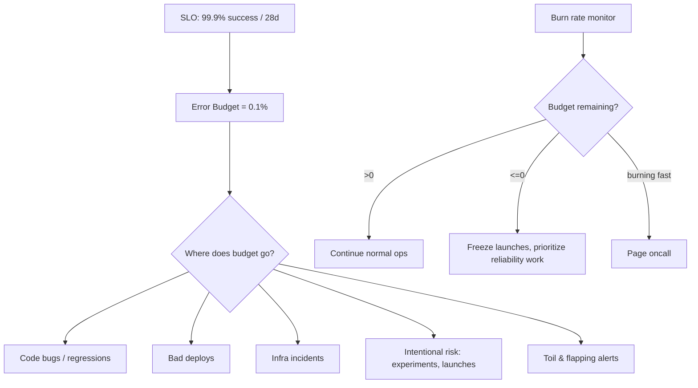
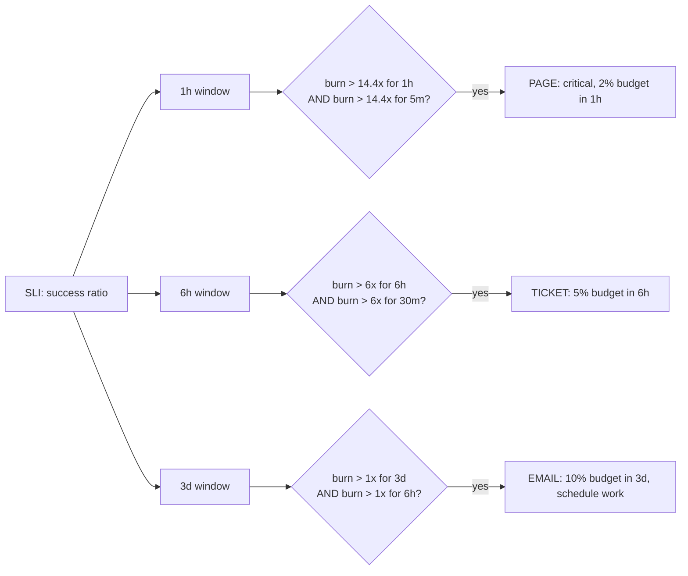
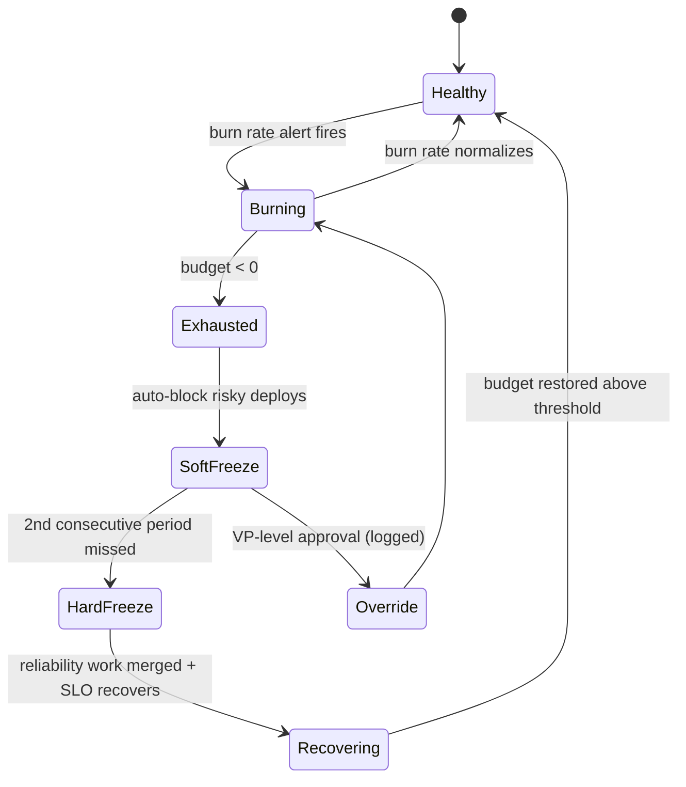

# Error Budgets

## Why This Exists

**Problem.** Reliability and feature velocity are in direct tension. Without a quantitative contract, every reliability decision becomes a political fight: SRE wants stability, product wants launches, executives want both, oncall pays the cost in pages and weekends. The most common failure modes:

- **Aspirational SLOs** ("five nines!") that nobody defends, so reliability is whatever happens to ship.
- **Page-on-everything alerting** that wakes humans for blips far smaller than what users notice.
- **Heroics-driven launches** where a team ships a regression, oncall mops up for a week, and the team is rewarded for the launch.
- **Reliability debt** that nobody can quantify, so it never gets prioritized.

**Key insight.** An error budget is the *inverse of an SLO*: if your SLO says 99.9% successful requests over 28 days, your budget is 0.1% of requests = ~40 minutes of total badness per 28d. That budget is a **currency**. Spending it on a risky launch is fine. Spending it on toil and bad deploys is not. When the budget is exhausted, the contract says: **stop launching, fix reliability**. This converts arguments into accounting.

The error budget is not a punishment. It is a license to ship risk *up to a known limit*. If you never burn budget, your SLO is too loose or you are over-investing in reliability.

**Reach for this when:**
- You have a real SLI you can measure (request success rate, latency-bucket success, freshness, durability) over a meaningful window (4w, 30d).
- Product and reliability decisions are colliding and you need a referee.
- You want to replace symptom-based alerts ("CPU > 80%") with user-impact alerts.
- You need to justify a deploy freeze, a rollback, or a reliability sprint with data.

**Don't reach for this when:**
- You don't yet have a reliable SLI pipeline. *Build measurement first.* A wrong SLI is worse than no SLO.
- The system is pre-launch / pre-PMF; you don't know what users care about yet. Use rough monitoring; defer SLOs.
- The metric is gameable or aggregates away the pain (e.g. an "availability" metric that hides one tenant being 100% down).
- The service is a hard-real-time control loop where 99.9% is meaningless — you need different reliability primitives (formal verification, redundancy budgets).
- You only have one user / one tenant. SLOs assume statistical aggregation.

## Diagrams

### Budget as a finite resource over a rolling window



### Multi-window, multi-burn-rate alert flow



### Deploy gate state machine



## Operationalizing an SLO

The skill is not "pick a number". It is the discipline of turning a number into a daily mechanism.

### 1. Pick the SLI first, the SLO second

A good SLI is a **ratio of good events to valid events**, scoped to user-visible behavior. Examples:

| Service type        | Good SLI                                                  | Bad SLI                                |
|---------------------|-----------------------------------------------------------|----------------------------------------|
| Request/response    | (HTTP 2xx + 4xx-not-our-fault) / valid requests           | "uptime" of the load balancer          |
| Async / pipeline    | events processed within latency target / events received  | queue depth                            |
| Storage / DB        | reads returning correct data within Xms / total reads     | disk IOPS                              |
| Batch / freshness   | jobs completed by deadline / jobs scheduled               | average runtime                        |

**Crucial detail: filter out invalid traffic.** 4xx-client-error responses are usually the client's fault and should not count against you. But a 400 from your own malformed contract on a deploy *is* your fault — distinguish them.

### 2. Compute the budget

For SLO `S` over window `W` with `N` valid events:

```python
# slo.py — error budget primitives, dimensionless
from dataclasses import dataclass
from datetime import timedelta

@dataclass(frozen=True)
class SLO:
    name: str
    target: float            # e.g. 0.999
    window: timedelta        # e.g. 28 days

    @property
    def budget_fraction(self) -> float:
        """Fraction of events allowed to be bad."""
        return 1.0 - self.target

    def budget_events(self, valid_events: int) -> float:
        """Absolute count of bad events allowed."""
        return valid_events * self.budget_fraction

    def budget_seconds(self, total_seconds: int) -> float:
        """For time-based SLOs only — prefer event-based."""
        return total_seconds * self.budget_fraction


# Example: 99.9% success over 28d, 100M requests in window
checkout = SLO("checkout-availability", target=0.999, window=timedelta(days=28))
print(checkout.budget_events(100_000_000))  # 100,000 bad requests allowed
print(checkout.budget_seconds(28 * 86400))  # ~2,419 seconds = ~40 min
```

A common mistake is to anchor on time ("we have 40 minutes of downtime") when the system is request-driven. **A 5-second outage during peak traffic burns far more budget than a 5-minute outage at 3am.** Use event-based budgets unless the system genuinely is binary up/down.

### 3. Burn rate, not raw consumption

The interesting question is not "how much budget have we burned" but "how fast are we burning it". Burn rate `B` is the multiple of the steady-state error rate:

```
B = (bad_events_in_window / valid_events_in_window) / (1 - SLO_target)
```

If `B = 1`, you will exactly exhaust the budget over the SLO window. If `B = 14.4`, you will exhaust the *full* 28-day budget in `28d / 14.4 ≈ 2 days` — but more importantly, you'll burn 2% of the budget in **1 hour**. That is the rationale behind Google's classic burn-rate alert thresholds.

### 4. Multi-window, multi-burn-rate alerting

This is the canonical recipe from **SRE Workbook ch. 5** ("Alerting on SLOs"). Naive alerts on a single window suffer from one of two failure modes:

- **Short window only** → noisy, fires on transient blips, low precision.
- **Long window only** → slow to fire, high recall but bad time-to-detect.

The fix is to require **two windows to agree**: a long window establishes that the burn is sustained, a short window keeps detection fast. Pair multiple `(threshold, long, short)` tuples to span severities:

| Severity   | Burn rate | Long window | Short window | Budget consumed if it fires | Action  |
|------------|-----------|-------------|--------------|-----------------------------|---------|
| Critical   | 14.4x     | 1h          | 5m           | 2% in 1h                    | Page    |
| High       | 6x        | 6h          | 30m          | 5% in 6h                    | Page    |
| Medium     | 3x        | 24h         | 2h           | 10% in 24h                  | Ticket  |
| Low        | 1x        | 3d          | 6h           | ~10% in 3d                  | Email/dashboard |

Concrete Prometheus / PromQL:

```yaml
# error-budget-alerts.yaml — adapt to your metrics names
groups:
- name: checkout-slo-burn
  rules:
  # Recording rules: success ratio over multiple windows
  - record: job:slo_errors_ratio_rate1h
    expr: |
      sum(rate(http_requests_total{job="checkout",code=~"5.."}[1h]))
        /
      sum(rate(http_requests_total{job="checkout"}[1h]))

  - record: job:slo_errors_ratio_rate5m
    expr: |
      sum(rate(http_requests_total{job="checkout",code=~"5.."}[5m]))
        /
      sum(rate(http_requests_total{job="checkout"}[5m]))

  - record: job:slo_errors_ratio_rate6h
    expr: |
      sum(rate(http_requests_total{job="checkout",code=~"5.."}[6h]))
        /
      sum(rate(http_requests_total{job="checkout"}[6h]))

  - record: job:slo_errors_ratio_rate30m
    expr: |
      sum(rate(http_requests_total{job="checkout",code=~"5.."}[30m]))
        /
      sum(rate(http_requests_total{job="checkout"}[30m]))

  # SLO target = 0.999, so budget = 0.001
  # 14.4x burn = 0.0144 error ratio
  - alert: CheckoutSLOBurnCritical
    expr: |
      job:slo_errors_ratio_rate1h  > (14.4 * 0.001)
      and
      job:slo_errors_ratio_rate5m  > (14.4 * 0.001)
    for: 2m
    labels:
      severity: page
      slo: checkout-availability
    annotations:
      summary: "Checkout burning 14.4x — 2% of 28d budget in 1h"
      runbook: "https://wiki/runbooks/checkout-slo"

  # 6x burn over 6h, confirmed in 30m
  - alert: CheckoutSLOBurnHigh
    expr: |
      job:slo_errors_ratio_rate6h  > (6 * 0.001)
      and
      job:slo_errors_ratio_rate30m > (6 * 0.001)
    for: 15m
    labels:
      severity: page
      slo: checkout-availability
    annotations:
      summary: "Checkout burning 6x — 5% of 28d budget in 6h"
```

The `and` requirement is the crucial part: short window for fast detection, long window to confirm the burn is real and not a transient. If you've never tuned this before, **steal Google's numbers and adjust later**.

### 5. Reset semantics: rolling vs calendar windows

| Approach                | Pro                                   | Con                                                    |
|-------------------------|---------------------------------------|--------------------------------------------------------|
| Rolling 28d (recommended) | Always reflects recent past; smooth   | Bad incident "haunts" you for 28d                      |
| Calendar month           | Easier comms; clean reset             | Sharp discontinuities; bad luck on the 1st is brutal   |
| Quarterly                | Aligns with planning                  | Too lagging for ops decisions                          |

Most practitioners use **rolling 28d for ops** (alerting, freezes) and **calendar quarter for planning** (postmortems, headcount). Don't mix.

## Freezing Deploys When the Budget is Exhausted

The error-budget contract has teeth only if exhausting it actually changes behavior. The norm from SRE ch. 3:

> If the SLO is missed, releases are halted until the error budget is refilled.

In practice, "halted" is too binary. Use a graded response:

```python
# deploy_gate.py — call from CI before allowing a release
from enum import Enum

class FreezeLevel(Enum):
    NONE = 0          # normal operations
    SOFT = 1          # warn, require ack from on-caller
    HARD = 2          # block all non-reliability deploys
    EMERGENCY = 3     # block everything except rollbacks + sec patches

def freeze_level(budget_remaining_fraction: float, burn_rate_1h: float) -> FreezeLevel:
    """
    budget_remaining_fraction: 1.0 = full budget, 0.0 = exhausted, <0 = over.
    burn_rate_1h: current 1-hour burn rate multiple.
    """
    if budget_remaining_fraction < -0.5:
        return FreezeLevel.EMERGENCY     # 1.5x over budget
    if budget_remaining_fraction < 0:
        return FreezeLevel.HARD          # exhausted
    if budget_remaining_fraction < 0.25 and burn_rate_1h > 2:
        return FreezeLevel.SOFT          # 25% left and still burning
    return FreezeLevel.NONE


def gate_deploy(change_type: str, level: FreezeLevel, override: bool = False) -> bool:
    """Returns True if deploy may proceed."""
    if level == FreezeLevel.NONE:
        return True
    if level == FreezeLevel.SOFT:
        # require on-caller ack, but don't block
        return True  # CI surfaces a banner
    if level == FreezeLevel.HARD:
        if change_type in ("reliability-fix", "rollback", "security-patch"):
            return True
        if override:
            # Logged, audited, requires VP approval
            return True
        return False
    if level == FreezeLevel.EMERGENCY:
        return change_type in ("rollback", "security-patch")
    return False
```

**The freeze policy must be written down before you need it.** Trying to negotiate "is this a reliability fix?" mid-incident is when the policy fails. A good policy specifies:

1. Who can declare a freeze (usually: triggered automatically by burn rate + budget).
2. Who can grant overrides (named role, not "the loudest VP").
3. What counts as a reliability deploy (allowlist, not vibes).
4. How freezes end (budget recovers above 25% AND postmortem AIs are merged).
5. **The freeze applies to the team, not just SRE.** If only SRE can fix it, the team has no skin in the game.

### Anti-patterns

- **Deploy on Friday during freeze**: the freeze is real or it isn't.
- **"Just this one launch"**: every launch is the special launch. The data says no.
- **Hand-wave the SLO upward when you miss it**: this destroys trust. If the SLO was wrong, *change it deliberately at a quarterly review*, not in the middle of the incident.
- **Freeze without consequences**: if missing the budget changes nothing, teams ignore it. Tie it to launch-readiness reviews and headcount.

## Org Dynamics

Error budgets are a sociotechnical tool. They mostly fail for human reasons.

**The product/SRE contract.** The classic Google formulation: SRE agrees to support a service iff the team agrees to (a) take on toil if SLO is loose, (b) feature freeze if SLO is tight. The error budget is the dial. Without this contract, SRE becomes a pager-receiving cost center.

**The "we're special" trap.** Every team thinks their service deserves higher availability. Push back: each additional 9 is ~10x the engineering cost. If you can't articulate the user-visible cost of a 1% miss in money or trust, your SLO is aspirational.

**The incentive cliff.** If teams are punished for burning budget, they hide incidents and game SLIs. If teams are never punished, the budget is theater. The middle ground: **burning budget is fine, ignoring postmortem AIs is not.** Track AI completion rate, not incident count.

**Executive escalation.** When a VP overrides a freeze, log it. Review overrides quarterly. If overrides happen routinely, either (a) the SLO is wrong, or (b) the org doesn't actually buy the contract, in which case error budgets aren't your real problem.

**Cross-team dependencies.** Your service's SLO is bounded by your dependencies' SLOs. If you depend on three services each at 99.9%, your max achievable is ~99.7% before any of your own bugs. Either negotiate stricter dependency SLOs, build redundancy, or lower your own SLO. *Don't promise what your stack can't deliver.*

**The "one tenant" problem.** A 99.99% global success rate can hide one tenant being 100% broken. Slice SLOs per tenant or per critical journey. SRE Workbook calls this "user journey SLOs". Aggregate metrics lie.

## Trade-offs

| Benefit                                                   | Cost                                                                |
|-----------------------------------------------------------|---------------------------------------------------------------------|
| Quantitative referee for ship-vs-stabilize decisions      | Requires real SLI pipeline + months of data before it stabilizes    |
| Reduces page volume — only burn-rate alerts page humans   | Investment in recording rules, alert tuning, runbook discipline     |
| Aligns engineering, product, and SRE on a common metric   | Introduces a process surface that can be gamed if not audited       |
| License to ship risk: budget remaining = freedom to launch| Teams may chase 100% budget consumption ("use it or lose it")       |
| Surfaces hidden reliability debt as concrete burn rate    | Can mask single-tenant outages behind aggregate metrics             |
| Drives postmortem follow-through (AIs unblock the freeze) | Org culture must actually respect the freeze; otherwise it's theater|
| Multi-burn-rate alerts catch both fast and slow drifts    | Six-rule alert schemes are complex; teams copy them and forget why  |

## Common Pitfalls

- **Aggregating away the pain.** A global 99.95% with one tenant at 80% is a happy dashboard and an angry customer. Per-tenant or per-journey SLIs catch this.
- **Counting all 5xx as bad.** A 503 returned because the client *did* hit a configured rate limit is correct behavior, not a budget burn. Distinguish "we failed" from "we deflected". Conversely, a 200 returning a corrupt body is a budget burn that your SLI misses.
- **Latency SLO with mean instead of percentile.** A mean of 200ms hides a long tail. Use bucketed histogram counters: `success = (status==2xx AND latency < 500ms)`.
- **Time-based budgets for traffic-driven services.** "40 minutes of downtime" is a useful headline but a bad operational metric — peak hour outages burn vastly more user impact than off-peak ones.
- **Static SLO forever.** You set 99.9%, the system improved, you never revisited. The budget became a vanity metric. Revisit SLOs at least annually; tighten when you can, loosen when business reality demands.
- **Budgets without a defined response.** "We track it" is not enough. The freeze rule, the page rule, and the override rule must exist *before* you burn budget.
- **The synthetic-prober monoculture.** Probers tell you "the API answered" — they don't tell you "the user could check out". Real-user metrics + synthetic + log-based SLIs together. Probers alone lie when only the prober's path is healthy.
- **Reset roulette on calendar boundaries.** A team gets through Dec with 0% budget left, then ships a risky launch on Jan 1 because "the budget reset". Use rolling windows for ops decisions.
- **Stale recording rules.** If your `slo_errors_ratio_rate1h` rule lags 5 minutes, your "5m short window" alert is meaningless. Verify ingestion lag.
- **Treating the SLO as the goal.** The SLO is a *floor*. If you're at exactly 99.9%, you have zero margin. Aspirational performance should be tighter than the SLO; the gap is your safety margin.
- **Burn-rate alerts on flat traffic.** If you have low QPS, a single error spikes the rate. Add `min_requests` guards or use Bayesian smoothing for low-traffic SLIs.

## Decision Table

| Situation                                                    | Use error budgets? | Alternative / supplement                          |
|--------------------------------------------------------------|--------------------|---------------------------------------------------|
| Public-facing service with measurable user-impact SLI        | **Yes, primary**   | Pair with per-tenant breakdowns                   |
| Internal tool, no clear user metric                          | Maybe              | Track availability informally; defer SLOs         |
| Pre-PMF startup, < 6 months traffic data                     | No                 | Symptom-based alerts; revisit at scale            |
| Hard-real-time / safety-critical (medical, avionics)         | No (alone)         | Formal verification + redundancy budgets          |
| Batch / freshness pipeline                                   | **Yes**            | Use freshness SLI: "% jobs done by deadline"      |
| Storage / durability                                         | **Yes, distinct**  | Separate durability SLO from availability SLO     |
| Single-tenant SaaS where one customer = whole business       | Yes, but simple    | Per-customer SLO; raw outage minutes work fine    |
| You don't have an SLI pipeline yet                           | No                 | **Build the SLI first.** Months before SLO.       |
| You have an SLI but no political mandate to freeze deploys   | Partial            | Use as alerting tool only; revisit org contract   |
| Mature org, multiple services, central reliability function  | **Yes, federated** | Budget per service + cross-service dependency map |

### Multi-burn-rate vs single-threshold alerts

| Need                                            | Recommendation                                                  |
|-------------------------------------------------|-----------------------------------------------------------------|
| Fast detection of major outages                 | Multi-window multi-burn-rate (Workbook ch. 5)                   |
| Detection of slow chronic regressions           | Long-window 1x burn rate, ticket-only                           |
| Low-traffic service                             | Use absolute error count thresholds, not ratios                 |
| You're starting from scratch                    | Adopt Google's 14.4x / 6x / 3x / 1x as defaults; tune later     |
| You have many SLOs and limited alerting budget  | Page only on 14.4x and 6x; the rest become tickets/dashboards   |

## References

- Google — *Site Reliability Engineering* — ch. 3 ("Embracing Risk") and ch. 4 ("Service Level Objectives") — https://sre.google/sre-book/embracing-risk/
- Google — *The Site Reliability Workbook* — ch. 2 ("Implementing SLOs") and ch. 5 ("Alerting on SLOs") — https://sre.google/workbook/alerting-on-slos/
- Google — *Building Secure and Reliable Systems* — ch. 16 ("Disaster Planning") for budget-driven exercise design — https://sre.google/books/building-secure-reliable-systems/
- Štěpán Davidovič & Betsy Beyer — "SLO Engineering Case Studies" (SRE Workbook ch. 14) — https://sre.google/workbook/slo-engineering-case-studies/
- AWS — *Builders' Library* — "Implementing health checks" (relevant to SLI design) — https://aws.amazon.com/builders-library/implementing-health-checks/
- AWS — *Builders' Library* — "Avoiding insurmountable queue backlogs" (freshness SLIs) — https://aws.amazon.com/builders-library/avoiding-insurmountable-queue-backlogs/
- Liz Fong-Jones & Seth Vargo — "How SRE teams are organized, and how to get started" — https://cloud.google.com/blog/products/devops-sre/how-sre-teams-are-organized-and-how-to-get-started
- Prometheus docs — "Recording rules" and "Alerting rules" — https://prometheus.io/docs/prometheus/latest/configuration/alerting_rules/
- Alex Hidalgo — *Implementing Service Level Objectives* (O'Reilly, 2020) — book reference, no canonical URL.
- Google — "SLO Burn Rate Alerting" calculator (informal) — https://sre.google/workbook/alerting-on-slos/#6-multiwindow-multi-burn-rate-alerts
- Charity Majors — "Observability and SLOs" — https://charity.wtf/2020/03/03/observability-is-a-many-splendored-thing/

## See Also

- `../slo-sli-sla/` — the canonical upstream skill: defining the SLI and SLO that an error budget is computed from.
- `../incident-response/` — what happens *after* the burn-rate page fires
- `../postmortems/` — the action items that unblock a deploy freeze
- `../chaos-engineering/` — intentional budget spend to validate resilience
- `../capacity-planning/` — relating headroom and SLO targets
