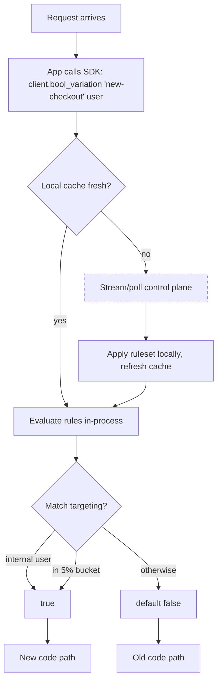
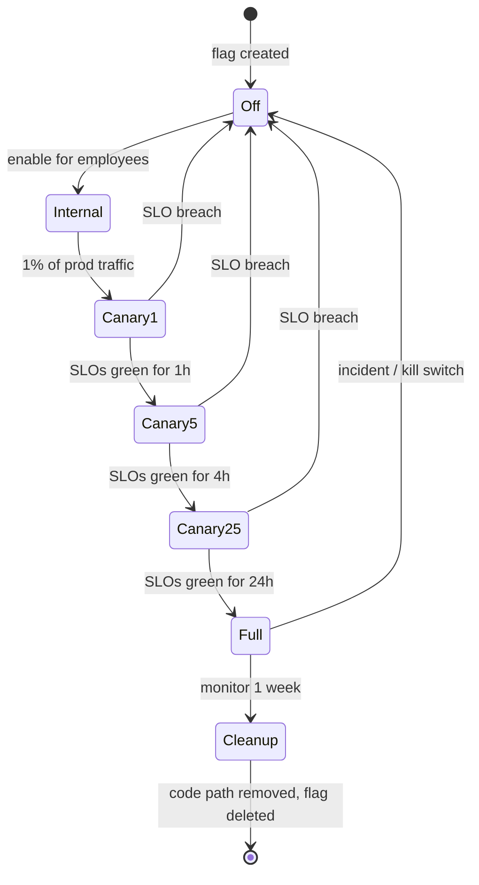
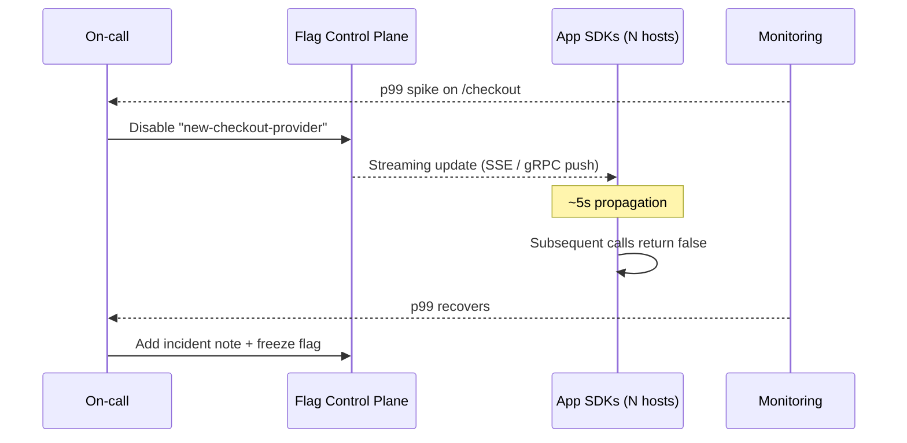

# Feature Flags

## Why This Exists

**Problem.** Deployment and release are conflated. Every code change goes live the moment the binary boots. There is no way to dark-launch, no way to gradually expose a new code path, no kill switch when the new feature spikes p99, and no way to A/B test without forking the deployment. When something breaks at 03:00, the only mitigation is "roll back the deploy" — which takes 20 minutes, requires re-running the pipeline, and may be blocked by a database migration that already ran.

**Key insight.** A feature flag is a **runtime conditional** — `if flag_enabled("new-checkout", user) then new_path() else old_path()` — controlled by a configuration system **outside the code deployment**. This single act of indirection lets you:

1. **Decouple deploy from release.** Code ships dark; the product manager flips the flag when they're ready.
2. **Expose risk gradually.** 1% → 5% → 25% → 100% over days, watching SLOs at each step.
3. **Mitigate without rollback.** Bad code? Flip the flag off in 5 seconds, no pipeline involved.
4. **Target by attribute.** Internal users first; one tenant who opted into the beta; one region; one device class.
5. **Run experiments.** Random assignment + metric measurement = A/B test.

But flags are not free. Every flag is a branch in your code, a configuration knob in your control plane, and a cognitive load on every engineer reading the file. **Flag debt** — hundreds of stale flags, half of them tangled with each other — is real, and it is the dominant failure mode of mature flag programs.

**Reach for this when:**
- A change has nontrivial blast radius (new payment processor, new ranking algorithm, new database read path).
- You want to dark-launch — ship code now, decide release timing later.
- You need a kill switch for a dependency that might fail (e.g., third-party auth provider, recommendation service).
- You're running A/B tests or canary rollouts with metric gates.
- A subset of users (internal, beta, one tenant) needs different behavior.
- You need to roll back faster than your deploy pipeline can.

**Don't reach for this when:**
- The change is trivial (typo fix, comment update). Don't flag-wrap everything; you'll drown in toggles.
- The "flag" is really a permanent configuration (e.g., feature available on the Enterprise plan). That's **entitlement / authorization**, not a flag — model it as a product capability with a real lifecycle.
- The flag is replacing missing tests. Flags hide bugs from 99% of users; the bug still ships.
- You haven't decided on a removal plan. **Every flag needs a death date.** A flag without an expiry is a permanent `if`-branch you'll regret.
- The control plane has worse availability than the data plane it gates. A flag service that goes down and takes your checkout with it is an anti-pattern (see Pitfalls).

Pete Hodgson's *Feature Toggles (aka Feature Flags)* on martinfowler.com is the canonical taxonomy: **release toggles**, **experiment toggles**, **ops toggles** (kill switches), and **permissioning toggles** each have different lifetimes and owners. Treating them all the same is the root of flag debt.

## Diagrams

### Flag evaluation path (SDK + control plane)



**Critical:** The SDK evaluates **in-process** against a locally cached ruleset. The control plane is the source of truth, but a request never blocks on a network call to it. If the control plane is unreachable, the SDK serves the last-known ruleset (or a hard-coded default). This is what makes flags safe to put on the hot path.

### Progressive rollout state machine



### Kill-switch sequence during incident



## Core Patterns

### 1. The flag interface — keep it boring

Whatever vendor you pick, abstract it behind a tiny interface owned by your team. This protects you from vendor lock-in and lets you stub flags in tests.

```python
# flags.py — the only file that imports the vendor SDK
from typing import Protocol
import ldclient
from ldclient.config import Config

class FlagClient(Protocol):
    def bool_variation(self, key: str, ctx: dict, default: bool) -> bool: ...
    def string_variation(self, key: str, ctx: dict, default: str) -> str: ...
    def int_variation(self, key: str, ctx: dict, default: int) -> int: ...

class LaunchDarklyClient:
    def __init__(self, sdk_key: str):
        ldclient.set_config(Config(sdk_key))
        self._c = ldclient.get()

    def bool_variation(self, key: str, ctx: dict, default: bool) -> bool:
        # ALWAYS pass a default. If the SDK fails to evaluate (network down,
        # corrupt ruleset, unknown flag), it returns the default. The default
        # is the safe value — usually "off" for new code, "on" for kill switches.
        user = {"key": ctx["user_id"], "custom": ctx}
        return self._c.variation(key, user, default)
```

Two non-obvious rules:

1. **The default is the disaster value.** If the flag system completely fails, what behavior do you want? For a release toggle, default is `false` (run the old code). For a kill switch, default is `true` (the feature is on; the kill switch is the *deviation*). Get this backwards and your kill switch becomes a kill-yourself switch when the control plane has an outage.
2. **Never call the SDK from a hot loop without caching the result for the request.** Resolve flags once at the request boundary, pass the resolved values down. Otherwise a single request evaluates `is_new_pricing_enabled` 400 times.

### 2. Rule shape — targeting, segments, percentage

A useful flag has more structure than on/off. Most vendors converge on roughly this shape:

```yaml
# flags/new-checkout.yaml — what the rules look like (vendor-agnostic)
key: new-checkout
description: "Route to the v2 checkout service. Owner: payments-team. Expires: 2026-08-01."
default_variation: "off"
variations:
  on: true
  off: false
rules:
  # Rule order matters — first match wins.
  - id: internal-employees
    if: { user.email: { ends_with: "@example.com" } }
    serve: on

  - id: opted-in-beta-tenants
    if: { tenant.id: { in: ["acme", "globex", "initech"] } }
    serve: on

  - id: gradual-rollout-eu
    if: { user.region: { equals: "eu-west-1" } }
    rollout:
      # Bucketing is deterministic on user.id — the same user always lands
      # in the same bucket as the percentage moves up. This is critical
      # for experiment validity and for not flapping users between variants.
      bucket_by: user.id
      percent_on: 25

  - id: gradual-rollout-us
    if: { user.region: { equals: "us-east-1" } }
    rollout: { bucket_by: user.id, percent_on: 5 }

fallthrough: off
```

**Deterministic bucketing.** The user-to-bucket function must be stable. The standard recipe: `bucket = hash(flag_key + ":" + user_id) % 10000; serve_on = (bucket < percent_on * 100)`. Hash on `flag_key + user_id`, not just `user_id` — otherwise the same users always end up in the same buckets across all flags, which biases experiments.

```go
// Deterministic bucketing in Go — same logic every SDK uses internally.
func InBucket(flagKey, userID string, percentOn float64) bool {
    h := sha256.Sum256([]byte(flagKey + ":" + userID))
    // Take first 4 bytes as uint32, normalize to [0, 1).
    n := binary.BigEndian.Uint32(h[:4])
    bucket := float64(n) / float64(math.MaxUint32)
    return bucket < percentOn/100.0
}
```

### 3. Kill switches — the highest-leverage pattern

A **kill switch** (Hodgson's "ops toggle") wraps a risky dependency or expensive code path so on-call can disable it instantly. Unlike release toggles, kill switches are **long-lived** — they may live forever.

```typescript
// recommendation-service.ts
async function getRecommendations(userId: string): Promise<Item[]> {
  // Kill switch wraps a dependency that has historically gone bad.
  // Default is `true` — feature is normally on. The kill switch is the deviation.
  const enabled = await flags.boolVariation(
    "recs-service-enabled",
    { user_id: userId },
    /* default */ true
  );

  if (!enabled) {
    // Fallback: serve cached or popular items. NEVER throw — the whole point
    // of the kill switch is graceful degradation.
    return getFallbackRecommendations();
  }

  try {
    return await recsClient.fetch(userId, { timeoutMs: 200 });
  } catch (err) {
    // Belt-and-suspenders: the kill switch is for known-bad-state.
    // Per-request errors still need a circuit breaker / fallback.
    log.warn("recs fetch failed, serving fallback", { err });
    return getFallbackRecommendations();
  }
}
```

A maturity test: **how many kill switches did you flip in the last 6 months?** If zero, you don't trust them — they probably don't work. Run a quarterly game day where you flip every kill switch in staging and verify the fallback path.

### 4. Progressive rollout with SLO gates

The point of a percentage rollout is to **bound the blast radius of bugs** that only surface under production load. Wire the rollout to your monitoring:

```python
# rollout_controller.py — promoted via CI, not a human clicking buttons
STAGES = [0, 1, 5, 25, 50, 100]

def advance_rollout(flag_key: str):
    current = flags_admin.get_percent(flag_key)
    next_pct = next(p for p in STAGES if p > current)

    # Gate on SLO health for this flag's owning service.
    slo = monitoring.get_slo("checkout-service", window="1h")
    if slo.error_rate > 0.005 or slo.p99_ms > 800:
        alert_oncall(f"holding {flag_key} at {current}% — SLO breach")
        return

    flags_admin.set_percent(flag_key, next_pct)
    log.info(f"advanced {flag_key} to {next_pct}%")

    # Hold time grows with percentage — you want enough traffic at low
    # percentages to detect issues before they hit everyone.
    schedule_next_advance(flag_key, hold_for=hold_time(next_pct))

def hold_time(pct: int) -> timedelta:
    return {0: 0, 1: timedelta(hours=1), 5: timedelta(hours=4),
            25: timedelta(hours=12), 50: timedelta(hours=24),
            100: timedelta(days=7)}[pct]  # 1-week observation before flag deletion
```

### 5. Experiment flags — separate from release flags

An **experiment flag** randomly assigns users to variants and ties exposure to metric measurement. This has different requirements from a release flag:

| Requirement | Release flag | Experiment flag |
|---|---|---|
| Stable assignment per user | nice-to-have | **mandatory** (or you contaminate the experiment) |
| Exposure logging | optional | **mandatory** (you need an `(user, variant, time)` event for stats) |
| Equal-traffic variants | no | yes (95% control, 5% treatment is fine; 50/50 is typical) |
| Lifetime | days–weeks | duration of experiment |
| Owner | engineering | data science / product |

Statsig and LaunchDarkly Experimentation handle this natively. With Unleash or Flagsmith, you can do it but you're responsible for the exposure-logging side.

```python
# Experiment exposure — log every evaluation that "counted"
def get_pricing(user):
    variant = flags.string_variation("pricing-experiment-q3", user, "control")
    # The exposure event is what stats are computed on. Log it once per
    # (user, experiment) per session, not every evaluation.
    if not request.exposed_to.contains("pricing-experiment-q3"):
        analytics.track("$exposure", {
            "experiment": "pricing-experiment-q3",
            "variant": variant,
            "user_id": user["id"],
        })
        request.exposed_to.add("pricing-experiment-q3")
    return PRICING_TABLES[variant]
```

### 6. Vendor choice — the honest matrix

| Vendor | Hosting | Strength | Weakness |
|---|---|---|---|
| **LaunchDarkly** | SaaS (self-host enterprise) | Most mature SDKs, streaming updates, audit log, deep integrations | Expensive at scale ($$$ per MAU); vendor lock-in via custom rule shape |
| **Unleash** | OSS, self-host or SaaS | Open source (Apache 2.0), simple Go server, good for self-host | Smaller SDK ecosystem; experimentation is bolt-on |
| **Flagsmith** | OSS, self-host or SaaS | Open source, Django backend, good if you already run Django | Smaller scale ceiling; fewer enterprise features |
| **Statsig** | SaaS | Best-in-class experimentation (CUPED, sequential testing), generous free tier | Newer; experimentation-first means flag-only use feels heavy |
| **OpenFeature** | spec / SDKs | Vendor-neutral SDK + spec (CNCF). Lets you swap providers. | A spec, not a backend — you still need a provider |
| **Roll-your-own** | yours | No bill; tailored to your stack | You will reinvent: streaming updates, audit log, RBAC, SDKs in 5 languages, multi-region resilience. **Almost always a mistake** unless flags are core to your product. |

Default recommendation: start with **OpenFeature SDK** wrapping a concrete provider (LaunchDarkly if you have budget, Unleash if you want self-host). You retain optionality.

### 7. Flag debt — the killer

Every flag is a code branch. A codebase with 50 active flags has up to `2^50` theoretical execution paths; in practice the combinations that actually exist are still in the dozens, and most will never be tested together.

The decay curve is brutal: a flag added for a 2-week rollout in March is still in the code in October because nobody owns its removal. By next March you have 200 such flags. By the year after that, deleting any one of them is scary because you don't know who depends on it.

**Mitigations that work:**

1. **Mandatory expiry date in the flag config.** No expiry → flag won't deploy.
2. **Flag has a single named owner** (a person, not a team) — team owners diffuse to nobody.
3. **Stale-flag bot.** A weekly job that lists flags >90 days old, posts to the owner's Slack, and files a ticket.
4. **"Flag cleanup" as a definition-of-done item** for the feature ticket. The flag isn't done when it's at 100% — it's done when the code branch is removed.
5. **Linter integration.** When a flag is marked `expired` in the control plane, CI fails on any code that references it.

```python
# stale_flag_audit.py — runs weekly in CI
def audit():
    for flag in flags_admin.list_all():
        age_days = (now() - flag.created_at).days
        at_full_rollout_for = (now() - flag.last_changed).days

        if flag.kind == "release" and age_days > 90:
            file_ticket(
                owner=flag.owner,
                title=f"Stale release flag: {flag.key} ({age_days} days old)",
                body=f"Currently {flag.current_percent}%. Either remove or document why."
            )

        if flag.kind == "release" and flag.current_percent == 100 and at_full_rollout_for > 14:
            file_ticket(
                owner=flag.owner,
                title=f"Flag {flag.key} at 100% for {at_full_rollout_for}d — clean up code",
            )
```

### 8. Testing flagged code

Every flagged path must be tested in **both** states. The bug isn't `if (newCode())` — it's that you only ever ran the old path in tests and the new path in prod.

```python
import pytest

@pytest.fixture
def flags_off():
    with patch.object(flags, "bool_variation", return_value=False):
        yield

@pytest.fixture
def flags_on():
    with patch.object(flags, "bool_variation", return_value=True):
        yield

@pytest.mark.parametrize("fixture", ["flags_off", "flags_on"])
def test_checkout_works_either_way(request, fixture):
    request.getfixturevalue(fixture)
    result = checkout(cart=sample_cart())
    assert result.status == "ok"
    # Both paths must produce a valid receipt — semantic invariants don't
    # depend on which branch executes.
```

For flags with multiple variations, parametrize over all variations. CI should fail if a new flag is added without a test for each variation.

### 9. Don't tangle flags with each other

`if (flagA && (flagB || flagC))` is a sign of trouble. Each flag should gate one decision. If two flags are deeply entangled, either:

- Combine them into one flag with multiple variations, or
- Sequence the rollouts: get flag A to 100% and removed before introducing flag B.

Tangled flags multiply test combinations and make rollback ambiguous (turn off A or B?).

## Trade-offs

| Benefit | Cost |
|---|---|
| Decouple deploy from release; ship dark code | Every flag is a branch — cyclomatic complexity grows fast |
| Instant kill switch (seconds, not pipeline minutes) | Control plane is now a tier-0 dependency — its outage is your outage |
| Gradual rollout bounds blast radius | More moving parts to monitor and reason about per-feature |
| A/B experimentation possible | Statistically valid experiments require careful exposure logging and consistent bucketing |
| Targeted rollouts (internal, beta, regional) | Targeting rules drift; "internal-only" silently leaks when an attribute changes |
| Mitigate without rollback | If the flag system is down, you can't mitigate either — need bootstrap defaults |
| Engineering velocity (less merge contention on long-lived branches) | Flag debt is real; cleanup is unglamorous and gets deferred |
| Vendor handles SDK, streaming, audit log | Vendor cost scales with MAU and flag count; lock-in is sticky |

## Common Pitfalls

- **Defaulting to the unsafe value.** If your SDK fails to reach the control plane and your kill switch defaults to `false` ("kill the feature"), then a control-plane outage kills the feature for everyone. Defaults should be the **status quo**, not the deviation.
- **Synchronous SDK calls on the hot path.** SDK looks like a function call but if it blocks on a network round-trip every evaluation, you've added latency proportional to flag count. Use SDKs that evaluate locally with a streaming-updated cache.
- **Single-region control plane.** Your service is multi-region; your flag service is in `us-east-1`. When `us-east-1` has its annual bad day, your flag system goes with it. Mirror flag config to every region; SDK should fail open to local cache.
- **Flag without an owner.** "The team owns it." Six months later the team is reorganized and nobody knows what the flag does. Always a named individual + named secondary.
- **Flag without an expiry.** It will be there in 5 years. Guaranteed.
- **Using flags as auth.** "Premium feature" gated by a flag is a permanent flag. That's not a flag — that's an entitlement. Model it as an ACL or product capability with a real lifecycle, billing integration, and audit log.
- **Bucketing on session ID.** Users log in/out, get new sessions, flap between variants. Always bucket on a stable identifier (user ID, account ID, device ID).
- **No exposure logging for experiments.** You ran the experiment, you saw a 2% lift, you shipped. Then you find out half the "treatment" users never actually saw the treatment because the flag short-circuited earlier. Log exposures at the *evaluation point*, not at the experiment-design point.
- **Reading flags inside tight loops.** `for item in cart: if flag_enabled('new-pricing'): ...` — evaluate once outside the loop. Most SDKs will short-circuit but don't rely on it.
- **Skipping the rollback test.** You rolled out 0 → 100% smoothly. But did you verify that going 100 → 0 also works? At 100% you may have written data that the old code path can't read.
- **Forward-incompatible data.** New code path writes records with a `v2_field`. Flag flips off. Old code path can't read records with `v2_field` and crashes. **Always make the new code's writes readable by the old code** for the duration of the rollout.
- **Trusting the audit log only after an incident.** "Who turned this flag on at 03:00?" If your control plane doesn't have an immutable audit log with actor + reason, you can't answer.
- **Cross-region drift.** Engineer flips flag in `us` console, forgets `eu`. Behavior diverges. Use a control plane with global propagation, or wrap admin actions in a script that hits all regions.
- **Flag-driven schema branches.** Two flag states mean two database schemas. Now your migration is also flagged. Now your rollback is also flagged. This way lies madness — sequence schema changes around flags, never inside them.

## Decision Table

| Situation | Use feature flag? | Alternative | Why |
|---|---|---|---|
| Risky migration of payment provider | **Yes** (release flag + kill switch) | Big-bang deploy + hope | Need percentage rollout and instant kill |
| One enterprise customer wants a custom workflow | **No** — use entitlements/config | Multi-tenant config table; product capability | This is a permanent business rule, not a temporal toggle |
| A/B test new pricing model | **Yes** (experiment flag) | Cohort analysis post-deploy | Random assignment requires runtime decision; need exposure logs |
| Disabling a brittle external dependency | **Yes** (long-lived kill switch) | Circuit breaker only | Circuit breaker is automatic; kill switch is manual override for known-bad |
| Configurable timeouts, batch sizes | **No** — use config | Environment vars / config service | Not a behavioral branch; just a knob |
| Migrating from REST to gRPC internal API | **Yes** (release flag, then remove) | Parallel deploy + DNS swap | Want gradual rollout and per-caller control |
| Region-specific feature (GDPR data residency) | **No** — use entitlements | Region-aware service config | Permanent regulatory boundary, not a toggle |
| Per-user beta access | **Yes** (targeting rule) | Separate beta deployment | Targeting rule is cheaper than separate infra |
| Hiding unfinished UI in prod | **Yes** (release flag, internal-only target) | Long-lived feature branch | Trunk-based development beats merge hell |
| Switching ML model versions | **Yes** (experiment flag) | Shadow traffic + manual cutover | Need to compare metrics across variants |
| Debug-only verbose logging | **No** — use log levels | `LOG_LEVEL=debug` env var | Already a solved problem |
| Customer-facing premium feature | **No** — entitlement | Product / billing / ACL | Has revenue and lifecycle; not a toggle |

## References

- Pete Hodgson — *Feature Toggles (aka Feature Flags)* — https://martinfowler.com/articles/feature-toggles.html — the canonical taxonomy: release / experiment / ops / permissioning toggles. Read this first.
- Martin Fowler — *FeatureBranch (and why feature flags beat it)* — https://martinfowler.com/bliki/FeatureBranch.html
- Jez Humble & David Farley — *Continuous Delivery* (Addison-Wesley 2010), ch. 13 "Managing Components and Dependencies" — origin of "decouple deploy from release."
- Google — *Site Reliability Engineering*, ch. 8 "Release Engineering" — https://sre.google/sre-book/release-engineering/
- Google — *SRE Workbook*, ch. 16 "Canarying Releases" — https://sre.google/workbook/canarying-releases/
- AWS Builders' Library — *Going faster with continuous delivery* — https://aws.amazon.com/builders-library/going-faster-with-continuous-delivery/
- AWS Builders' Library — *Automating safe, hands-off deployments* — https://aws.amazon.com/builders-library/automating-safe-hands-off-deployments/
- LaunchDarkly — *Effective Feature Management* (free e-book) — https://launchdarkly.com/effective-feature-management-ebook/ — vendor-y but the SDK architecture chapter is solid.
- Unleash — *Feature Toggle Types* docs — https://docs.getunleash.io/reference/feature-toggle-types
- Flagsmith — *Open-source feature flags* docs — https://docs.flagsmith.com/
- Statsig — *Experimentation 101* — https://docs.statsig.com/experiments-plus/intro
- OpenFeature — *Specification* — https://openfeature.dev/specification/ — CNCF vendor-neutral flag SDK spec.
- Facebook (Meta) Engineering — *Rapid release at massive scale* — https://engineering.fb.com/2017/08/31/web/rapid-release-at-massive-scale/ — gatekeeper system, dark launches at FB scale.
- Etsy Engineering — *How does Etsy manage development and operations?* — https://www.etsy.com/codeascraft/how-does-etsy-manage-development-and-operations — early canonical write-up on feature flags + continuous deployment.
- Sam Newman — *Building Microservices*, 2nd ed (O'Reilly 2021), ch. 7 — feature toggles in the context of service evolution.
- DDIA (Kleppmann, O'Reilly 2017), ch. 4 "Encoding and Evolution" — relevant for forward/backward compat during flagged rollouts.
- Trunk-Based Development — https://trunkbaseddevelopment.com/ — flags are the dual of long-lived branches.

## See Also

- `../circuit-breaker/` — automated kill switch on per-request error signals; complements manual flags.
- `../graceful-degradation/` — what to serve when the kill switch is flipped.
- `../slo-sli-sla/` — gating rollout advancement on SLO health.
- `../incident-response/` — the runbook for "flip the kill switch at 03:00."
