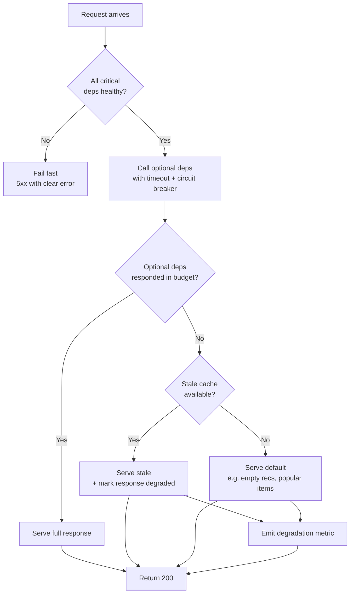
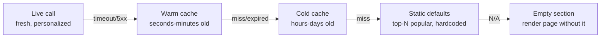

# Graceful Degradation

## Why This Exists

**Problem.** Every non-trivial system depends on things that fail: databases, downstream services, third-party APIs, ML models, caches, DNS, an entire AWS region. The default behavior of most code is to propagate the failure: a 5xx from the recommendations service becomes a 5xx on the homepage. This is the worst possible outcome — users see nothing instead of *almost everything*.

**Key insight.** Most user-facing requests don't need every backend to be healthy. A product page can render without personalized recs. A checkout can complete without the loyalty-points service. Search can return stale results from a cache when the live index is down. **Graceful degradation is the deliberate decision to identify which dependencies are critical vs. optional, and to design code paths that serve a degraded-but-useful response when the optional ones fail.**

The S3 us-east-1 outage of 2017-02-28 is the canonical case study: services that hard-coded S3 reads into the request path went dark for 4+ hours. Services that treated S3 as a *cache* (with a fallback to recompute, or to a "good-enough" stale value) kept serving. Same dependency, different blast radius — entirely a design choice.

**Reach for this when:**
- A dependency is *optional* for the core user value (recs, personalization, scoring, enrichment, telemetry).
- You can produce a useful answer from cache, defaults, or a cheaper computation.
- Outages of a downstream are frequent enough that you can't afford to take them on the chin (>0.1% of requests, or any single dependency that has taken you down before).
- You operate in a region/AZ topology where partial-failure is the dominant failure mode (not "everything works or nothing works").

**Don't reach for this when:**
- The dependency is *essential* (you cannot ship a checkout without a payments backend; degrade by failing fast and clearly, not by faking success).
- The "degraded" response would be **wrong in a way users can't detect** (silently returning stale balances, missing safety filters, ignoring auth checks). Wrong-and-fast is worse than down.
- Correctness is regulated (medical dosing, financial settlement, identity verification). Degrade to a clear unavailable, never to a guess.
- The savings aren't real: if your "fallback" calls another service that's down for the same reason, you've just added a hop.

---

## Diagrams

### Degradation decision flow per request



### Layered fallbacks (the onion)



---

## The taxonomy: five ways to degrade

Pick deliberately. Each row trades off freshness, correctness, and operational complexity differently.

| Strategy | What you serve | Storage cost | Correctness risk | When to use |
|---|---|---|---|---|
| **Fallback cache** | Last-known-good value from cache | High (must store + refresh) | Stale data | Recs, search, feature flags, config |
| **Default response** | Hardcoded "good enough" answer | None | Generic, not personalized | Empty-state UIs, top-N popular items |
| **Feature drop** | Render page without the feature | None | User loses functionality | Personalization, ads, related content |
| **Cheaper computation** | Approximate / lower-quality result | CPU on you | Quality degradation | ML re-rankers (fall back to popularity), search (lexical instead of semantic) |
| **Load shedding** | 5xx for a fraction of traffic to protect the rest | None | Some users see errors | Overload protection, regional brownout |

These compose. A real system layers all five.

---

## Pattern 1: Fallback cache (the workhorse)

The single most valuable pattern. Cache every response from your optional dependencies with a long TTL, *separate* from the freshness TTL. When the live call fails or times out, serve the stale value.

```python
# Python — fallback cache with separate freshness vs. liveness TTLs
import time
import logging
from dataclasses import dataclass
from typing import Optional, Callable, TypeVar, Generic

T = TypeVar("T")
log = logging.getLogger(__name__)

@dataclass
class Cached(Generic[T]):
    value: T
    stored_at: float

class FallbackCache(Generic[T]):
    """
    Two TTLs:
      - fresh_ttl_s: serve from cache without calling origin
      - stale_ttl_s: serve from cache ONLY IF origin is unhealthy
    The gap between them is the "degradation window" — how long you'll
    keep serving while the origin is down.
    """

    def __init__(self, fresh_ttl_s: float, stale_ttl_s: float, store):
        assert stale_ttl_s >= fresh_ttl_s, "stale must outlive fresh"
        self.fresh_ttl_s = fresh_ttl_s
        self.stale_ttl_s = stale_ttl_s
        self.store = store  # any KV: Redis, Memcached, in-process LRU

    def get_or_fetch(
        self,
        key: str,
        fetch: Callable[[], T],
        on_degraded: Optional[Callable[[T], None]] = None,
    ) -> T:
        cached: Optional[Cached[T]] = self.store.get(key)
        now = time.monotonic()

        # Hot path: fresh cache hit
        if cached and (now - cached.stored_at) < self.fresh_ttl_s:
            return cached.value

        # Try the origin
        try:
            value = fetch()
            self.store.set(key, Cached(value=value, stored_at=now))
            return value
        except Exception as e:
            log.warning("fetch failed for %s: %s", key, e)

        # Origin failed — fall back to stale if we have it
        if cached and (now - cached.stored_at) < self.stale_ttl_s:
            log.info("serving stale for %s (age=%.1fs)", key, now - cached.stored_at)
            if on_degraded:
                on_degraded(cached.value)
            # IMPORTANT: emit a metric so you can see degradation in dashboards
            metrics.increment("cache.degraded_serve", tags={"key_prefix": key.split(":")[0]})
            return cached.value

        # No stale either — let the caller decide (raise, default, drop feature)
        raise OriginUnavailable(f"no cache and origin down for {key}")
```

**Two TTLs, not one.** The mistake is using a single TTL: `cache for 5 minutes`. That couples freshness to liveness. Decouple them. Fresh for 5 minutes, stale-acceptable for 24 hours, means you keep serving for a full day of origin downtime.

**Negative caching matters too.** If the origin returns "not found", cache that — but with a *much* shorter TTL, and ideally as a separate value type so you can purge it when the origin comes back.

---

## Pattern 2: Default response

When you have no cache (cold start, new key, cache wiped), fall through to a static default.

```typescript
// TypeScript — recommendations endpoint with layered fallbacks
async function getRecommendations(userId: string, ctx: RequestCtx): Promise<Rec[]> {
  // Critical-path budget: 80ms. Past that, we degrade.
  const deadline = Date.now() + 80;

  try {
    return await withTimeout(
      personalizedRecs(userId, ctx),
      deadline - Date.now(),
    );
  } catch (e) {
    ctx.markDegraded("personalized_recs", e);
  }

  // Fallback 1: warm cache of this user's last good recs
  const cached = await recCache.getStale(userId);
  if (cached) {
    ctx.markDegraded("served_stale_recs");
    return cached;
  }

  // Fallback 2: cohort-level recs (cheaper, less personal)
  try {
    return await cohortRecs(ctx.cohort, { timeoutMs: 30 });
  } catch (e) {
    ctx.markDegraded("cohort_recs_failed", e);
  }

  // Fallback 3: top-N globally popular, refreshed hourly into local memory
  return TOP_POPULAR; // never empty, never throws
}
```

The endpoint **cannot fail** — it always returns *something*. The caller (the page renderer) gets the same shape regardless. The cost: a tiny `degraded` flag that observability can scrape.

---

## Pattern 3: Feature drop

Some features are independent enough to just *not render* when their backend is down. The product page still loads — it just doesn't have the "frequently bought together" carousel.

```python
# Server-side render with optional sections
async def render_product_page(product_id: str, ctx) -> Page:
    # Critical: product details. If this fails, return 5xx — page is meaningless.
    product = await get_product(product_id)  # no fallback, no timeout fallback

    # Optional sections, each with its own budget. Failures become None.
    recs, reviews_summary, related = await gather_with_fallback(
        (get_recs(product_id, ctx), default=[], timeout_ms=80),
        (summarize_reviews(product_id), default=None, timeout_ms=120),
        (get_related(product_id), default=[], timeout_ms=60),
    )

    return Page(
        product=product,
        recs=recs,                       # may be []
        reviews_summary=reviews_summary, # may be None — template handles it
        related=related,                 # may be []
    )
```

The template must be designed to render with absent sections. This is a UX contract, not just a code pattern — designers have to sign off on the empty states.

---

## Pattern 4: Cheaper computation (quality degradation)

When an expensive path fails, fall back to a cheap one that produces a worse answer.

```go
// Go — search with semantic re-ranking, falling back to lexical-only on failure
func Search(ctx context.Context, q string) ([]Result, error) {
    // Always run the cheap, reliable lexical search.
    lexical, err := elasticSearch(ctx, q)
    if err != nil {
        return nil, err // critical path failure
    }

    // Try to improve results with the ML re-ranker, but bound the budget.
    rerankCtx, cancel := context.WithTimeout(ctx, 120*time.Millisecond)
    defer cancel()

    reranked, err := mlReranker.Rank(rerankCtx, q, lexical)
    if err != nil {
        // Re-ranker is down or slow. That's fine — return lexical.
        metrics.Inc("search.degraded.no_rerank", 1)
        return lexical, nil
    }
    return reranked, nil
}
```

The user gets *worse* results, not *no* results. They likely don't notice. You log the degradation rate; if it sustains above some threshold, page someone.

---

## Pattern 5: Load shedding (when you are the failure)

Sometimes the right degradation is to refuse some traffic so the rest can succeed. This is graceful degradation of *throughput* rather than features.

```python
# Adaptive concurrency limiter — shed traffic when latency degrades
class AdaptiveLimiter:
    def __init__(self, target_latency_ms: float, min_limit: int, max_limit: int):
        self.target = target_latency_ms
        self.limit = min_limit
        self.min, self.max = min_limit, max_limit
        self.in_flight = 0

    def try_acquire(self, priority: str) -> bool:
        if self.in_flight >= self.limit:
            # Shed: prefer to reject low-priority traffic first.
            if priority == "low":
                return False
            # For high-prio (e.g. authenticated checkout), still try.
            if self.in_flight >= self.max:
                return False
        self.in_flight += 1
        return True

    def release(self, observed_latency_ms: float):
        self.in_flight -= 1
        # AIMD-style: increase if we have headroom, decrease aggressively if not.
        if observed_latency_ms < self.target * 0.8 and self.limit < self.max:
            self.limit += 1
        elif observed_latency_ms > self.target * 1.2:
            self.limit = max(self.min, self.limit // 2)
```

Tier your traffic: shed bots and prefetch first, then anonymous reads, then logged-in reads. Never shed the writes that prevent inconsistency (a checkout completion that already charged the card).

---

## The AWS S3 us-east-1 outage cookbook (2017-02-28)

The 4-hour S3 outage on 2017-02-28 took down a wide swath of the internet. Post-mortem lessons, distilled into a checklist:

1. **Treat S3 (and any single-region service) as a cache, not a source of truth in the request path.** If a `GET` to S3 is on your critical path with no fallback, your availability is bounded by S3's. Replicate to a second region with cross-region replication, OR keep an in-process / Memcached / DynamoDB Global Tables fallback for the hottest 1% of keys that serve 99% of traffic.

2. **Don't store your status page assets in the region you're statusing.** During the 2017 outage, the AWS Status Dashboard itself was impaired because its assets were in S3 us-east-1. Your runbook, status page, and on-call dashboard must survive the outage they describe.

3. **Failover requires keys you can read without S3.** If your region-failover routing logic itself reads a config from S3, you're cooked. Bake critical routing into DNS TTL or a secondary store.

4. **Cold-start dependencies are landmines.** Many services were "up" but couldn't launch new instances because AMIs / Lambda code / Docker images lived in S3. Treat your launch path as part of your availability story — pre-warm capacity, multi-region your container registry, and use deployment artifacts that don't require the failing region.

5. **Cross-service dependencies cascade.** During the outage, Lambda, EBS snapshots, ECS task launching, and many other AWS services degraded — each had S3 in their critical path. Map your *transitive* dependencies, not just direct ones. You depend on what you depend on depends on.

6. **Stale-good-enough beats fresh-unavailable.** Services that served stale config, stale catalog, stale recs from a local in-process cache stayed up. Services that re-validated on every request died. Default to **trust the cache**; refresh in the background.

The general lesson: **identify your single points of failure (regions, services, vendors), and for each, have a "we serve a worse answer" path that doesn't involve them.**

---

## Testing degradation: chaos game days

**Code paths that aren't tested don't work.** Fallback paths are exercised < 0.01% of the time in production. They will rot silently — dependencies change, the fallback cache gets purged in a deploy, the default response refers to a deleted SKU. The only way to keep them working is to exercise them deliberately.

### Game day mechanics

A **game day** is a scheduled exercise where you intentionally break a dependency and observe the system. Real ones look like:

1. **Pick a single failure scenario.** "DynamoDB-backed feature flags service returns 500 to 100% of requests for 30 minutes." Don't combine failures on day one — diagnosis gets impossible.
2. **Pre-declare success criteria.** What metric shows we degraded gracefully? E.g. "user-facing 5xx stays < 0.5%, p99 < 200ms, no cascading alarms in adjacent services."
3. **Announce a window.** Sales/CS need to know. Run during business hours so the on-call can observe; never overnight.
4. **Use a real tool.** AWS Fault Injection Service (FIS), Gremlin, or Toxiproxy for network-level fault injection. Don't `iptables drop` by hand.
5. **Have an abort button.** A single command must stop the experiment. Test it before the experiment.
6. **Hold a blameless post-mortem within 48h.** Even if everything went perfectly. Especially then — capture *why* it worked.

```yaml
# Example: AWS FIS experiment template — inject latency into a downstream
# (real IDs/ARNs redacted)
description: "Inject 800ms latency into recs-service for 10 min"
roleArn: arn:aws:iam::ACCOUNT:role/FISRole
stopConditions:
  - source: aws:cloudwatch:alarm
    value: arn:aws:cloudwatch:us-east-1:ACCOUNT:alarm:UserFacing5xx_HighSev1
targets:
  recsHosts:
    resourceType: aws:ec2:instance
    resourceTags: { service: recs-service, env: prod }
    selectionMode: PERCENT(20)  # only 20% of fleet — partial degradation, more realistic
actions:
  injectLatency:
    actionId: aws:ssm:send-command/AWSFIS-Run-Network-Latency
    parameters:
      duration: PT10M
      delayMilliseconds: "800"
    targets:
      Instances: recsHosts
```

### What to look for during the game day

| Symptom | What it tells you |
|---|---|
| Caller p99 spikes by exactly the timeout duration | Timeouts are working; circuit breaker is *not* — it should trip and skip the call |
| Caller p99 spikes far beyond the timeout | Connection-pool exhaustion or thread starvation; your timeout doesn't really cancel work |
| 5xx rate climbs in unrelated services | Cascading failure — shared resource (thread pool, connection limit, downstream's downstream) |
| Degradation metric doesn't increment | Your fallback path isn't being taken — code is throwing somewhere upstream of the catch |
| Cache hit rate drops to zero in fallback mode | Your cache key includes a request-id or timestamp by mistake |
| User-visible behavior is *fine* | Either you've succeeded, or your monitoring can't see what users see — verify externally |

### Cadence

- **Pre-prod**: continuously, in CI. Fault-injection tests as part of the integration suite (Toxiproxy + a few canary scenarios).
- **Prod**: monthly per critical dependency, quarterly cross-team game days, annually a region-failover exercise.

The goal isn't to find new bugs — it's to **prove the fallback paths still work** as the codebase evolves.

---

## Trade-offs

| Benefit | Cost |
|---|---|
| Single dependency outage no longer takes down the page | Code complexity: every optional call needs a fallback path |
| Higher effective availability than the product of all dependency availabilities | Stale data risk: users may see outdated recs / counts / prices |
| Bounded blast radius for downstream incidents | Storage cost for fallback caches (often 2-10x the live cache) |
| User experience degrades smoothly instead of cliff-falling | Observability burden: you must monitor degradation rate, not just success rate |
| Buys time to fix the real issue | Fallback paths rot if not exercised — game days are not optional |
| Decouples your release / SLA from your dependencies' | Risk of "silent degradation": serving stale-and-wrong without telling anyone |
| Enables regional failover without coordinating every dependency | Mental model is harder: there are now N modes the system can be in, not 2 |

---

## Common pitfalls

- **Single TTL for both freshness and liveness.** "Cache for 5 minutes" means after 5 minutes you're calling the broken origin again. Use two TTLs: fresh window and stale-acceptable window.
- **Fallback path that calls the same broken thing.** Your "fallback cache" lives in the same Redis cluster as the origin's cache, and Redis is what's down. Map the dependency graph end-to-end.
- **No metric on degraded serves.** You're degrading silently. The dashboard shows green. Three weeks later you realize the live API has been broken the whole time and you're serving stale to everyone. **Always emit a metric and alarm at high degradation rate** (e.g. "degraded_serve > 5% for 10min").
- **Defaults that are wrong-but-look-right.** Returning `recs = []` is fine. Returning `account_balance = 0` because the balance service is down is *catastrophic* — users will think they were robbed. Distinguish "degraded but valid" from "we don't know".
- **Timeout not actually canceling the work.** In many language/library combos (Python `requests`, naive Java executor pools) a "timeout" returns control to the caller but the worker thread keeps running, holding the connection, exhausting the pool. Verify with load tests that the timeout *frees the resource*.
- **Circuit breaker that never closes.** A breaker that opens but has no half-open probe will stay open forever once the dependency recovers. Always include a probing strategy.
- **Cold cache after deploy.** A fresh container has no fallback cache. Deploys during a degraded period make things *worse* until the cache fills. Pre-warm critical caches on startup, or stagger deploys.
- **Game days only on Friday afternoon.** No one will fix what they find. Schedule mid-week with the relevant teams present.
- **Stale data feeding business logic.** Serving stale recommendations: fine. Serving stale rate-limit counters → users abuse the system. Serving stale auth → security incident. Pick optional dependencies deliberately.
- **The fallback is never tested in prod.** Staging "works" because the dependency rarely fails there. Real-world test = inject failure into a small percentage of production traffic.
- **Treating the status page as exempt.** During an outage you'll need to communicate. Host your status page, runbook, and on-call docs *outside* your own infrastructure.
- **Cascading degradation under load.** Each service degrades by retrying on the next service. Retries amplify. Without jitter and backoff, the second-tier services collapse before users even notice the first-tier issue.

---

## Decision table

| Scenario | Recommended approach | Why not the alternative |
|---|---|---|
| Recommendations service returns 5xx | Fallback cache → cohort recs → top-N popular | Failing the request loses the entire product page for an optional feature |
| Payment authorization service times out | Fail fast with clear error to user | Faking success risks duplicate charges or unauthorized fulfillment — never degrade transactional truth |
| ML re-ranker latency spike | Drop the re-rank, return lexical/baseline | Waiting for the re-ranker blocks the entire search; the cheap baseline is good enough |
| Auth service down | Read-only mode for already-authenticated sessions; reject new logins | Allowing unauthenticated reads of private data is a security incident, not a degradation |
| Region (us-east-1) outage | Failover to alternate region with stale data | Trying to keep serving from the failing region prolongs the outage and burns retry budget |
| Database write replica down | Reject writes; serve reads from replicas | Buffering writes locally without consensus risks data loss or split-brain |
| Feature flag service unreachable | Bake last-known-good config into binary on deploy; serve from there | If you fall back to "default off" for everything, a flag service blip silently disables features |
| Telemetry / logging pipeline backed up | Drop / sample telemetry; never block the request | Blocking user requests on async observability is the textbook self-inflicted outage |
| Search index unavailable | Serve from a smaller, older snapshot or LRU of recent queries | Returning empty results looks broken; stale-but-relevant is dramatically better |
| Cart / session store down | Read-only browse mode + clear banner ("checkout temporarily unavailable") | Silently failing checkouts produces support tickets *and* lost revenue |
| Pricing service down | Hard fail — never display a stale price | Stale prices commit you legally to honor them; this is one of the few cases where down > wrong |

---

## References

- **Beyer et al. — *Site Reliability Engineering* — ch. 22 "Addressing Cascading Failures"** — https://sre.google/sre-book/addressing-cascading-failures/ — Foundational. The patterns for load shedding, graceful degradation, and queue management are all here. Read this first.
- **Adkins et al. — *The Site Reliability Workbook* — ch. 22 "Addressing Cascading Failures" / ch. 8 "On-Call"** — https://sre.google/workbook/table-of-contents/ — Practical companion with worked examples, including the load-shedding and circuit-breaker case studies.
- **Beyer et al. — *Site Reliability Engineering* — ch. 21 "Handling Overload"** — https://sre.google/sre-book/handling-overload/ — Adaptive throttling, client-side rate limiting, criticality-based shedding.
- **AWS — Summary of the Amazon S3 Service Disruption in the Northern Virginia (US-EAST-1) Region (2017-02-28)** — https://aws.amazon.com/message/41926/ — The official S3 outage post-mortem. Required reading for anyone designing region-resilient systems.
- **AWS Builders' Library — Marc Brooker — "Avoiding fallback in distributed systems"** — https://aws.amazon.com/builders-library/avoiding-fallback-in-distributed-systems/ — Important counter-perspective: fallbacks add modes and modes add bugs. When *not* to use fallback.
- **AWS Builders' Library — "Timeouts, retries, and backoff with jitter"** — https://aws.amazon.com/builders-library/timeouts-retries-and-backoff-with-jitter/ — The retry mechanics that sit underneath any degradation strategy.
- **AWS Builders' Library — "Using load shedding to avoid overload"** — https://aws.amazon.com/builders-library/using-load-shedding-to-avoid-overload/ — Practical load-shedding patterns from inside AWS.
- **AWS Builders' Library — "Static stability using Availability Zones"** — https://aws.amazon.com/builders-library/static-stability-using-availability-zones/ — How to design so that an AZ or region failure doesn't require a control-plane response.
- **AWS Fault Injection Service (FIS) — Documentation** — https://docs.aws.amazon.com/fis/latest/userguide/what-is.html — The managed service for chaos experiments on AWS.
- **Netflix — Principles of Chaos Engineering** — https://principlesofchaos.org/ — Concise, opinionated charter for chaos engineering practice.
- **Casey Rosenthal & Nora Jones — *Chaos Engineering* (O'Reilly, 2020)** — Book-length treatment of the discipline. ISBN 978-1492043867.
- **Adkins et al. — *Building Secure and Reliable Systems* — ch. 8 "Design for Resilience"** — https://sre.google/books/building-secure-reliable-systems/ — Resilience patterns from a security-aware perspective.
- **Kleppmann — *Designing Data-Intensive Applications* — ch. 8 "The Trouble with Distributed Systems"** — Failures, partial failures, and how systems must reason about them. (Book — no canonical free URL.)
- **Michael T. Nygard — *Release It!* (2nd ed., Pragmatic, 2018)** — Stability patterns chapter (Circuit Breaker, Bulkhead, Timeouts, Steady State, Fail Fast). The original source for "degradation as a deliberate design".
- **Pat Helland — "Memories, Guesses, and Apologies"** — https://www.foundationdb.org/files/idempotence.pdf (related: https://queue.acm.org/detail.cfm?id=3036398) — On serving "good-enough" answers and apologizing later.
- **Martin Fowler — "Circuit Breaker"** — https://martinfowler.com/bliki/CircuitBreaker.html — Canonical write-up of the pattern that underpins most degradation logic.
- **Shopify Engineering — "Toxiproxy"** — https://github.com/Shopify/toxiproxy — The tool of choice for injecting network failures in pre-prod tests.

---

## See Also

- `../circuit-breaker/` — the mechanism that detects an unhealthy dependency and opens the path to your fallback.
- `../timeouts/` — bounded waits and backoff with jitter; degradation triggers off these.
- `../bulkheads/` — isolating thread/connection pools so one slow dependency can't starve the rest.
- `../load-shedding/` — degradation of throughput when *you* are the bottleneck.
- `../chaos-engineering/` — the broader discipline; game days are one tactic.
- `../../performance/use-red-methods/` — degradation must be visible: emit and alarm on degraded-serve rate.
- `../../communication/idempotency/` — degradation via retry only works if the operation is idempotent.
- `../feature-flags/` — flags are how you trip degradation manually during an incident.
