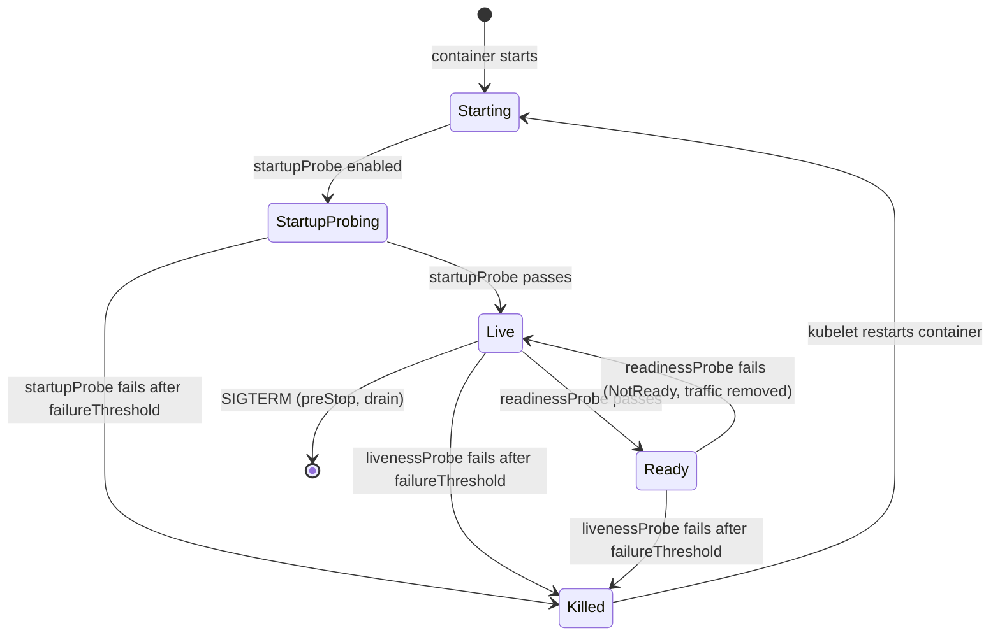
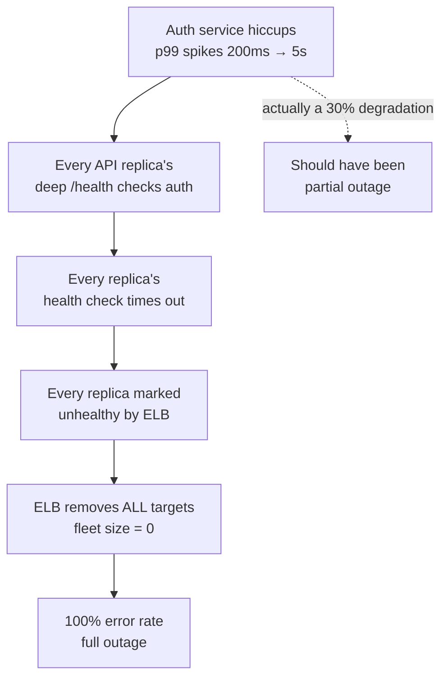
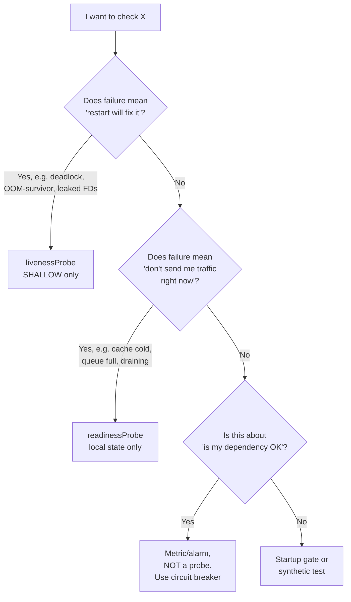

# Health Checks

## Why This Exists

**Problem.** Health checks are the most under-designed reliability primitive. Teams write a `/health` endpoint that returns `200 OK` if the process is alive, point Kubernetes / ELB / Consul at it, and then are surprised when:

- The orchestrator kills a perfectly healthy pod because the probe timed out under load.
- A downstream dependency hiccups and *every* replica simultaneously reports unhealthy, so the load balancer drains the entire fleet — turning a partial outage into a total one (a **trapdoor / lock-step failure**).
- The endpoint returns `200` while the application is actually deadlocked on a connection pool, dropping every real request.
- A pod is marked Ready before its caches are warm, gets traffic, and tail latency spikes.

**Key insight.** A health check is **not** a diagnostic. It is a *control signal* that the orchestrator uses to make destructive decisions: kill processes, drop traffic, fail over, page humans. The blast radius of a bad health check is the entire fleet, not one node. Therefore:

1. **Liveness, readiness, and startup probes are different things.** Conflating them is the #1 source of outages caused by health checks themselves.
2. **Deep health checks** (which exercise dependencies) give you better detection but **must not be used for liveness or for load-balancer in/out** without a circuit breaker — or a single bad dependency takes the whole fleet down at once.
3. **Shallow health checks** (process is alive, event loop spins) are cheap, safe, and weakly diagnostic. They're the right answer for liveness.
4. The right architecture is usually: **shallow liveness + medium readiness + deep, async, *observable-but-not-actuating* dependency check**.

This is exactly the lesson from Google SRE (ch. 19, Load Balancing in the Datacenter, and ch. 22, Addressing Cascading Failures) and from Amazon's "Implementing health checks" Builders' Library article.

### Reach for this when

- You're choosing what to put behind `livenessProbe`, `readinessProbe`, or an ELB target group health check.
- A dependency outage cascaded into your fleet being marked entirely unhealthy.
- Kubernetes is killing pods you believe are healthy (probe timeouts, GC pauses, slow starts).
- You're designing a service mesh or load balancer health policy and need to decide between "fail open" and "fail closed".
- You're shipping a service that has slow warmup (JIT, cache prefill, model load) and naive probes are killing it during boot.

### Don't reach for this when

- You need full observability — health checks are a binary signal, not a metric. Use SLOs, RED/USE metrics, and tracing for that.
- You want to verify a deploy is correct — that's a synthetic probe / canary, not a probe endpoint.
- You're trying to coordinate distributed leader election — use a real consensus system (etcd, ZooKeeper) and lease-based liveness, not HTTP probes.

## Diagrams

### The three probe lifecycles in Kubernetes



Three distinct controls:

- **startupProbe** — gates the other two while the app is booting. Without it, a slow start trips livenessProbe and you get a crash loop.
- **livenessProbe** — "should I kill and restart this container?" Failure is destructive. Must be shallow.
- **readinessProbe** — "should the Service / load balancer route traffic to this Pod?" Failure removes traffic but does not restart. Can be deeper.

### Trapdoor / lock-step failure



A *partial* dependency degradation became a *total* outage because the health check was a perfect lock-step amplifier. This is the canonical failure mode that motivates separating dependency monitoring from traffic-actuating probes.

### Decision flow: which probe should this check be?



## Core Patterns

### 1. The three-endpoint pattern (recommended baseline)

Expose three endpoints. Each has a different cost, blast radius, and consumer.

```python
# Python / FastAPI example. Same shape works in Go, Java, Node.
from fastapi import FastAPI, Response, status
import asyncio
import time

app = FastAPI()

# Process-local state
_started_at = time.monotonic()
_startup_complete = False
_draining = False

# Set this in your startup hook AFTER caches warm, migrations run, etc.
async def on_startup():
    global _startup_complete
    await warm_caches()
    await verify_schema_version()
    _startup_complete = True

# 1. LIVENESS — shallowest possible. Process is alive and the event loop spins.
#    NEVER touch a dependency here. NEVER acquire a lock. NEVER do I/O.
#    Failure here means "kubelet, please SIGKILL me".
@app.get("/livez")
async def livez():
    # Just returning 200 is fine. Some teams add a tiny "did the event loop
    # tick recently?" check — useful for catching deadlocks in async runtimes.
    return {"status": "ok"}

# 2. READINESS — should I receive traffic right now?
#    Local state only. Things that are TRUE for me but might be FALSE for my peer.
#    Failure here means "load balancer, drain me; orchestrator, don't restart me".
@app.get("/readyz")
async def readyz(response: Response):
    if not _startup_complete:
        response.status_code = status.HTTP_503_SERVICE_UNAVAILABLE
        return {"status": "starting"}
    if _draining:
        response.status_code = status.HTTP_503_SERVICE_UNAVAILABLE
        return {"status": "draining"}
    # Local resource saturation: am *I* overloaded?
    if local_queue_depth() > MAX_QUEUE:
        response.status_code = status.HTTP_503_SERVICE_UNAVAILABLE
        return {"status": "overloaded"}
    return {"status": "ready"}

# 3. DEPENDENCY HEALTH — observable, NOT actuating.
#    Scraped by monitoring/dashboards/oncall. NEVER wired to a probe that
#    can drain traffic or restart pods. This is where you put deep checks.
@app.get("/healthz/deep")
async def deep_health():
    checks = await asyncio.gather(
        check_db(),         # SELECT 1 with a 250ms timeout
        check_cache(),      # PING with a 100ms timeout
        check_downstream(), # HEAD /livez on critical deps
        return_exceptions=True,
    )
    return {"checks": [serialize(c) for c in checks]}
```

Why three? Because the *question* each one answers is different, and so is the *action* its answer triggers.

| Endpoint     | Question                            | Cost     | Action on failure          | Who consumes it      |
|--------------|-------------------------------------|----------|----------------------------|----------------------|
| `/livez`     | Is my process wedged?               | ~0       | Restart container          | kubelet, runit       |
| `/readyz`    | Should I get traffic right now?     | tiny     | Drain traffic              | k8s Service, ELB     |
| `/healthz/deep` | Are my dependencies OK?          | high     | Page / dashboard           | Prometheus, oncall   |

### 2. Kubernetes probe configuration

```yaml
# Production-grade probes for a JVM / slow-starting service.
apiVersion: apps/v1
kind: Deployment
metadata:
  name: payments-api
spec:
  template:
    spec:
      containers:
      - name: api
        image: payments-api:1.42.0
        ports:
        - containerPort: 8080

        # STARTUP — buys the app time to boot before liveness can kill it.
        # failureThreshold * periodSeconds = max boot time.
        # 30 * 5s = 150s boot budget. Tune from real p99 startup time + 50%.
        startupProbe:
          httpGet: { path: /livez, port: 8080 }
          periodSeconds: 5
          failureThreshold: 30
          timeoutSeconds: 2

        # LIVENESS — shallow, fast, conservative.
        # If this fails 3x in a row, kubelet kills the container.
        # Do NOT make this aggressive. False positives = crash loops.
        livenessProbe:
          httpGet: { path: /livez, port: 8080 }
          periodSeconds: 10
          timeoutSeconds: 1
          failureThreshold: 3
          # successThreshold MUST be 1 for liveness (Kubernetes requirement).

        # READINESS — can be slightly more sensitive.
        # Failing this just removes the pod from the Service endpoints.
        readinessProbe:
          httpGet: { path: /readyz, port: 8080 }
          periodSeconds: 5
          timeoutSeconds: 2
          failureThreshold: 2
          successThreshold: 1
          initialDelaySeconds: 0  # startupProbe gates it; don't double-gate.

        # GRACEFUL SHUTDOWN — flip /readyz to 503 *before* SIGTERM-ing the process.
        # Without this, in-flight requests die when k8s drains.
        lifecycle:
          preStop:
            exec:
              command: ["/bin/sh", "-c", "curl -s -X POST localhost:8080/admin/drain && sleep 15"]
        terminationGracePeriodSeconds: 30
```

Three things people get wrong here:

1. **No startupProbe**, so liveness fires during a slow boot and the container crash-loops. Always use `startupProbe` for anything that takes more than ~10s to start.
2. **`livenessProbe` points at a deep endpoint**, so a database hiccup kills every replica. Liveness must be process-local.
3. **No `preStop` drain**, so during rollouts the pod is killed while it still has in-flight requests. The drain hook flips `/readyz` to 503 first, then waits long enough for the kube-proxy / ELB to notice and stop routing.

### 3. Deep checks done correctly: observe, don't actuate

Deep health checks are *valuable* — they catch real problems traffic-shape probes miss. The trick is to **never let them control destructive behavior directly**.

```go
// Go example: cache the deep check result, expose it for scraping,
// and feed it through a circuit breaker before letting it influence readiness.
package health

import (
    "context"
    "sync/atomic"
    "time"
)

type DepStatus struct {
    Healthy   bool
    LastCheck time.Time
    LastError string
}

type DeepChecker struct {
    db, cache, downstream Checker
    status                atomic.Pointer[DepStatus]
}

// Run in a goroutine on startup. Polls dependencies on a fixed interval
// and stores the last result. The HTTP handler reads the cached value —
// it does NOT trigger a check on demand. This is the key isolation:
// the rate of probe scrapes (1/s, 10/s, whatever) does not become the
// rate of database queries.
func (d *DeepChecker) Run(ctx context.Context) {
    t := time.NewTicker(5 * time.Second)
    defer t.Stop()
    for {
        select {
        case <-ctx.Done():
            return
        case <-t.C:
            cctx, cancel := context.WithTimeout(ctx, 2*time.Second)
            ok := d.db.Check(cctx) && d.cache.Check(cctx) && d.downstream.Check(cctx)
            cancel()
            d.status.Store(&DepStatus{
                Healthy:   ok,
                LastCheck: time.Now(),
            })
        }
    }
}

// Exposed at /healthz/deep — for monitoring/oncall, NOT for the load balancer.
func (d *DeepChecker) Handler(w http.ResponseWriter, r *http.Request) {
    s := d.status.Load()
    if s == nil || !s.Healthy {
        w.WriteHeader(503)
    }
    json.NewEncoder(w).Encode(s)
}
```

If you *do* want dependency health to influence readiness, gate it through a fleet-wide circuit breaker — see "trapdoor avoidance" below.

### 4. Trapdoor avoidance: never drain more than N% of the fleet

The single most important rule when wiring dependency checks to anything that drops traffic:

> **If the failure is correlated across the fleet, the health check must refuse to act on it.**

Implementations:

- **AWS ELB / ALB:** `MinimumHealthyTargetCount` (or "minimum healthy targets percent") — keep at least 50% of targets in service even if they all report unhealthy. The ELB will route to "unhealthy" targets rather than drop the fleet to zero. This is "fail open under correlated failure" and it's the right default.
- **Envoy / service mesh:** `panic_threshold` (default 50%) — when the fraction of healthy upstream hosts drops below the threshold, Envoy ignores health and load-balances across all of them.
- **Kubernetes:** there is no built-in equivalent for Service endpoints — once `readinessProbe` fails, the pod is removed. This is *why* you must not put dependency checks in `readinessProbe`. Use a sidecar circuit breaker, or just don't do it.

```yaml
# AWS ALB target group — fail-open behavior on correlated failure
TargetGroupAttributes:
  - Key: load_balancing.algorithm.type
    Value: least_outstanding_requests
  # If everything looks unhealthy, keep routing to 50% of targets anyway.
  # Better to send traffic to a possibly-degraded host than to send 100% to /dev/null.
  - Key: target_group_health.unhealthy_state_routing.minimum_healthy_targets.percentage
    Value: "50"
```

```yaml
# Envoy cluster — panic threshold prevents lock-step drain
clusters:
- name: payments
  health_checks:
  - timeout: 1s
    interval: 5s
    unhealthy_threshold: 3
    healthy_threshold: 2
    http_health_check: { path: /readyz }
  common_lb_config:
    healthy_panic_threshold:
      value: 50.0  # if <50% healthy, route to all hosts ignoring health
```

### 5. Liveness done wrong vs right

```python
# WRONG — this killed an entire fleet during a Redis incident
@app.get("/livez")
async def livez_bad(response: Response):
    # Touches a dependency. When Redis was slow, every replica's livenessProbe
    # timed out. Kubelet crash-looped every pod simultaneously. Recovery took
    # 40 minutes after Redis came back because pods couldn't get past startup.
    if not await redis.ping(timeout=0.5):
        response.status_code = 503
    return {}

# RIGHT — answers only "is the process wedged?"
@app.get("/livez")
async def livez_good():
    return {"status": "ok"}

# RIGHT (more sophisticated) — detects async event-loop deadlock
_last_tick = time.monotonic()
async def heartbeat():
    global _last_tick
    while True:
        _last_tick = time.monotonic()
        await asyncio.sleep(1)

@app.get("/livez")
async def livez_with_heartbeat(response: Response):
    # If the event loop is wedged, _last_tick stops advancing.
    if time.monotonic() - _last_tick > 30:
        response.status_code = 503
        return {"status": "event loop stalled"}
    return {"status": "ok"}
```

### 6. Readiness for slow-warming services

Naive readiness flips green the instant the HTTP server binds. For services with caches, JIT, or model loads, this means the first ~30s of traffic hits a cold instance and tail latency spikes. Fix: gate readiness on **business-meaningful warmup**.

```java
// Java / Spring Boot — readiness only true after cache prefill + JIT warmup
@Component
public class WarmupReadiness implements HealthIndicator {
    private final AtomicBoolean ready = new AtomicBoolean(false);

    @PostConstruct
    public void warm() {
        CompletableFuture.runAsync(() -> {
            // 1. Prefill hot keys
            cacheLoader.preload(TOP_10K_PRODUCT_IDS);
            // 2. Run a few dummy requests through the hot path so the JIT
            //    compiles them before real traffic hits.
            for (int i = 0; i < 1000; i++) {
                hotPath.execute(SYNTHETIC_REQUEST);
            }
            // 3. Verify schema version against DB once
            schemaCheck.verify();
            ready.set(true);
        });
    }

    @Override
    public Health health() {
        return ready.get() ? Health.up().build() : Health.down().build();
    }
}
```

## Trade-offs

| Benefit | Cost |
|---|---|
| Fast detection of dead processes (shallow liveness) | Tells you nothing about whether the app actually serves requests correctly |
| Deep checks catch real dependency failures | Can cause correlated, fleet-wide drains if wired to actuating probes |
| Aggressive thresholds detect issues fast | False positives cause crash loops and traffic instability |
| Lenient thresholds reduce flapping | Real failures take longer to detect, increasing user-visible error rate |
| Three separate endpoints give clean separation | More code, more to maintain, more places to misconfigure |
| Caching dependency check results decouples scrape rate from query rate | Stale results — a dependency can fail and the cache won't know for `interval` seconds |
| `panic_threshold` / minimum-healthy-percent prevents trapdoor failures | Routes traffic to genuinely-broken hosts during real fleet-wide outages |
| `preStop` drain hook prevents in-flight request loss | Increases rollout time; misconfigured drains hang deployments |
| Readiness gated on warmup eliminates cold-start tail latency | Slower scaling — autoscaler needs to wait longer before new replicas help |

## Common Pitfalls

- **Putting dependency checks in `livenessProbe`.** A dependency hiccup becomes a fleet-wide crash loop. Recovery is much slower than the original incident. Liveness must be process-local. (This is the #1 production incident from health checks. Cited in AWS, Google, Shopify, and GitLab postmortems.)
- **No `startupProbe` on a slow-starting app.** Liveness fires during boot, container restarts, restart-loop. Often masked as "flaky deploy" until you read the kubelet logs.
- **`successThreshold > 1` on liveness.** Kubernetes silently rejects this — liveness can only require 1 success to recover. If you wrote `successThreshold: 3`, your config is invalid in a way the API server may or may not catch depending on version.
- **Same endpoint for liveness and readiness.** Now you can't distinguish "kill me" from "drain me", and any change you make to one affects the other. Always separate.
- **Health endpoint requires authentication.** kubelet doesn't have your bearer token. Use a separate unauthenticated port or path, or accept connections only from the pod IP.
- **Health endpoint is on the same port as user traffic and behind the same handler chain.** Now your `/livez` competes with real requests for thread pool slots, and a saturated thread pool fails liveness — exactly when you'd most want to keep the pod alive to drain. Bind the admin port separately (e.g., 8081) and use a different listener.
- **Probe `timeoutSeconds: 1` against a GC-pausing JVM.** Major GCs can pause the whole JVM for >1s on a large heap. Probe times out, kubelet kills the pod, you lose a perfectly fine instance. Tune timeouts to be larger than your GC p99 pause.
- **No `preStop` drain.** During rollouts, pods are SIGTERM'd while still in the Service endpoints — kube-proxy takes time to propagate the removal. In-flight requests fail. Always `preStop` -> flip readiness to 503 -> sleep -> let SIGTERM happen.
- **Probing through TLS to a busy port.** TLS handshake under load adds latency that makes probes flap. Use HTTP probes on a plaintext admin port.
- **Health check that allocates memory or starts goroutines per call.** Under high probe rates this becomes a leak. Make probe handlers allocation-free.
- **Treating health as binary when reality is graded.** "Healthy" is a misnomer — a service is on a continuum of degraded. Use SLO burn-rate alerts (SRE Workbook ch. 5) for the gradient; reserve probes for the binary "kill or drain" decisions.
- **Using `/health` to verify the app is *correct*.** That's a synthetic / canary check, not a probe. Probes run on the path between kubelet and the pod; canaries run end-to-end through the load balancer. Different things, different failure modes.
- **Ignoring the cardinality of the actuator.** ELB checks every 30s; Kubernetes default is every 10s; some service meshes check every 1s. A "deep" check that does 3 dependency RPCs at 1Hz across 200 replicas is 600 RPS of pure health-check load — visible in your downstream's metrics and capacity planning.

## Decision Table

| Scenario | What to put where | Why |
|---|---|---|
| Stateless microservice with fast startup | `/livez` shallow, `/readyz` shallow + drain flag, no startupProbe | Don't over-engineer; shallow is enough |
| JVM service with 60s warmup | startupProbe (long), shallow liveness, readiness gated on warmup complete | Without startupProbe, liveness kills the boot |
| Service with critical synchronous dependency (DB) | Deep check on separate endpoint scraped by Prometheus; readiness gated on local pool only; circuit breaker for actual request handling | Don't let dependency drag drain you |
| Background worker / job runner | livenessProbe on heartbeat-from-loop; no readinessProbe (no traffic) | Workers don't have Service endpoints |
| Stateful service (database replica, cache) | Custom probe that knows replication lag / quorum state; usually shallow liveness + smarter readiness | One-size-fits-all probes don't model state |
| Service behind ALB | ALB health on `/readyz`, configure `unhealthy_state_routing.minimum_healthy_targets` ≥ 50% | Prevents trapdoor; ELB has the knob, k8s Service does not |
| Service behind k8s Service only | Cannot do "minimum healthy" — use a sidecar circuit breaker, or keep readiness shallow and accept some flap | k8s endpoints model is binary |
| You want to know "is my dep up" | Async cached check + metric + alarm + dashboard. **Not** wired to probe. | Decouple observation from action |
| Service mesh (Envoy, Istio) | Health checks per cluster with `panic_threshold: 50` | Mesh has the knob; use it |
| Choosing between liveness and readiness for a check | Ask: "is the right action restart, or stop traffic?" If neither, it's not a probe — it's a metric. | This is the whole game |

## References

- Beyer, Jones, Petoff, Murphy — *Site Reliability Engineering* (Google) — Chapter 19, "Load Balancing in the Datacenter" (graceful degradation, lame-duck states) — https://sre.google/sre-book/load-balancing-datacenter/
- Beyer et al. — *SRE Book* — Chapter 22, "Addressing Cascading Failures" (lock-step / trapdoor failures, capacity loss feedback loops) — https://sre.google/sre-book/addressing-cascading-failures/
- Beyer et al. — *SRE Book* — Chapter 21, "Handling Overload" — https://sre.google/sre-book/handling-overload/
- Beyer et al. — *The Site Reliability Workbook* — Chapter 5, "Alerting on SLOs" (why probes are not your alerting story) — https://sre.google/workbook/alerting-on-slos/
- Adrian Hilton (AWS) — *Implementing health checks* — Amazon Builders' Library — https://aws.amazon.com/builders-library/implementing-health-checks/ — the canonical "shallow vs deep, why deep checks cause trapdoor failures" article
- Marc Brooker (AWS) — *Avoiding fallback in distributed systems* — Builders' Library — https://aws.amazon.com/builders-library/avoiding-fallback-in-distributed-systems/ (related: why fail-open during correlated failure)
- Kubernetes Documentation — *Configure Liveness, Readiness and Startup Probes* — https://kubernetes.io/docs/tasks/configure-pod-container/configure-liveness-readiness-startup-probes/
- Kubernetes Documentation — *Pod Lifecycle / Container probes* — https://kubernetes.io/docs/concepts/workloads/pods/pod-lifecycle/#container-probes
- Envoy Proxy Documentation — *Health checking* — https://www.envoyproxy.io/docs/envoy/latest/intro/arch_overview/upstream/health_checking
- Envoy — *Outlier detection / panic threshold* — https://www.envoyproxy.io/docs/envoy/latest/intro/arch_overview/upstream/load_balancing/panic_threshold
- AWS Documentation — *Application Load Balancer health checks for target groups* — https://docs.aws.amazon.com/elasticloadbalancing/latest/application/target-group-health-checks.html
- AWS Documentation — *Target group health (minimum healthy targets)* — https://docs.aws.amazon.com/elasticloadbalancing/latest/application/target-group-health.html
- Cindy Sridharan — *Health checks and graceful degradation in distributed systems* — https://copyconstruct.medium.com/health-checks-and-graceful-degradation-in-distributed-systems-cce5dbb15ada — practitioner perspective with war stories
- Kleppmann — *Designing Data-Intensive Applications* — Chapter 8, "The Trouble with Distributed Systems" (why naive failure detectors are wrong) — book
- Heidi Howard et al. — discussion of failure detectors in distributed systems literature, e.g. Chandra-Toueg "Unreliable Failure Detectors for Reliable Distributed Systems" (1996) — https://www.cs.utexas.edu/~lorenzo/corsi/cs380d/papers/p225-chandra.pdf

## See Also

- `../circuit-breaker/` — what to do when a dependency fails, instead of taking yourself down
- `../graceful-degradation/` — partial-function strategies when deep health is red
- `../load-shedding/` — `/readyz` returning 503 under overload as a load-shedding signal
- `../timeouts/` — sibling problem: timeouts inside health checks
