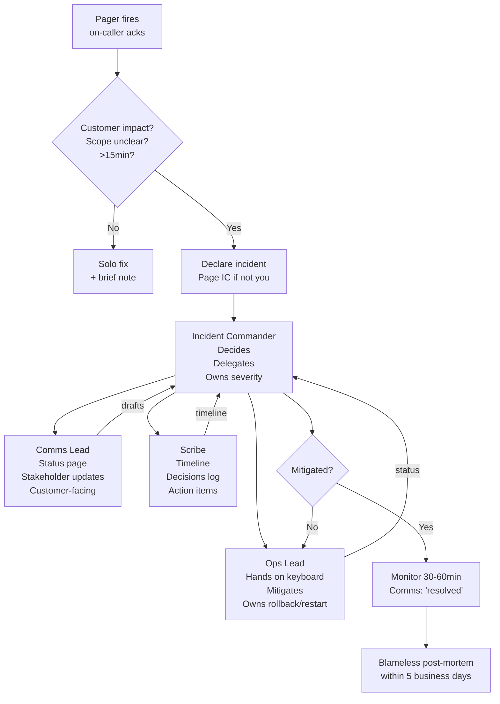
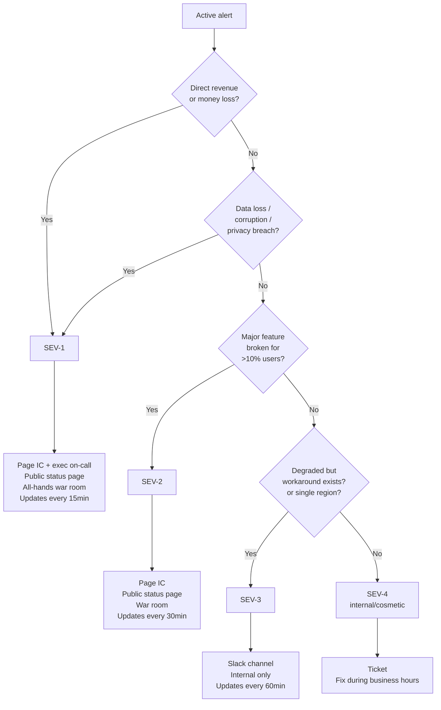
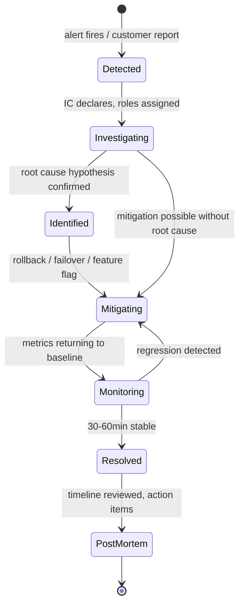

# Incident Response

## Why This Exists

**Problem.** When production is on fire, the failure mode is not technical — it is coordination. Three engineers all start mitigating in parallel, two of them stomp on each other's rollbacks, nobody is talking to support, the status page is stale, the VP is texting the on-caller asking "what's going on", and the timeline is being reconstructed from Slack scrollback two days later. The outage lasts 90 minutes because of communication overhead, not because the bug was hard.

**Key insight.** Incident response is a *role-based protocol*, not a skill set. The on-call engineer who pages first is not the Incident Commander — they become IC by declaring it, and their first job is to *stop debugging* and start coordinating. Roles separate decision-making (IC) from hands-on-keyboard work (Ops) from external communication (Comms) from memory (Scribe). This is straight from FEMA's Incident Command System, adapted by Google SRE (ch. 14) and PagerDuty.

**Reach for this when:**
- An alert fires with customer impact (errors, latency, data loss, money loss)
- Multiple engineers are needed and must not collide
- The blast radius is unclear and might grow
- Duration will exceed ~15 minutes or severity is SEV-1/SEV-2
- Executives, support, or external customers need updates
- You're the on-caller and you don't yet know if this is "an incident" — declare anyway, downgrading is cheap

**Don't reach for this when:**
- Single-engineer fix with no customer impact (a flaky canary, a stuck job you can rerun) — just fix it and write a brief note
- Pre-production / staging only — use change-management, not incident response
- Security breach with active adversary — fork to your security incident playbook, which has different comms rules (need-to-know, no public status page)
- Planned maintenance gone sideways — first decide if it's still a maintenance window or now an incident; if customers are impacted beyond the announced window, declare

## Diagrams

### Roles and information flow during a live incident



### Severity decision tree



### State machine for an incident



## The Four Roles

You only need one human per role for small incidents — the IC can also be Scribe in a SEV-3 with two engineers. **Never** combine IC and Ops: the person typing `kubectl rollout undo` cannot also be tracking who is doing what. That is the first rule of war room hygiene.

### Incident Commander (IC)

The IC owns the incident. They do not fix bugs. They do not type commands in production. Their job is:

- **Declare** the incident and severity
- **Assign** roles (Ops, Comms, Scribe; pull more responders if needed)
- **Decide** between competing mitigation paths (rollback vs. failover vs. wait)
- **Drive** the call: every ~10 minutes, ask "where are we, what do we know, what are we trying next, what's the time-bound?"
- **Hand off** explicitly when fatigued ("I am handing IC to @alice at 03:47, alice please confirm")
- **Close** the incident and schedule the post-mortem

A good IC is the one asking dumb questions on purpose: "What does this graph mean? What are we ruling out? Is the rollback safe if customers are mid-transaction?" The IC is the only role that can override an engineer's instinct to "just try one more thing" — which is the most common cause of extended outages (Google SRE Workbook, ch. 9 — Incident Response).

### Ops Lead

Ops is the only person with production write access during the incident. If you have three engineers all running commands, you have three incidents.

- Executes mitigations: rollback, restart, failover, feature flag, traffic shift, capacity bump
- Reports facts to IC: "rollback started at 03:14, expect completion 03:18"
- **Reads back** destructive commands before running them (`kubectl delete pod xxx — confirm?`) — see "two-person rule" below for SEV-1
- Does not freelance. If Ops sees a second issue, they tell the IC, who decides whether to spawn a sub-IC

### Comms Lead

Comms talks to humans outside the war room — customers, support, executives, sometimes regulators. They translate engineer-speak into outcomes.

- Drafts status page updates; IC approves before publishing
- Updates internal Slack/Chime channel for stakeholders on a fixed cadence (15min for SEV-1)
- Fields questions from execs and support so engineers don't have to context-switch
- Maintains the "what we know vs. what we're investigating" boundary — never speculate publicly

### Scribe

The Scribe is the team's memory. Without a Scribe, your post-mortem timeline is reconstructed from Slack three days later, and it will be wrong.

- Writes timestamped events to a shared doc (or pinned thread)
- Captures decisions and *why* — "decided to roll back v4.12 instead of forward-fix; rollback safer given mid-transaction state, IC: bob, 03:21"
- Tracks open questions and action items
- Does not need to be senior — this is an excellent role for someone learning the system

## Severity Levels

Severity is a forcing function for **response intensity**, not a measure of engineering difficulty. A typo in a config file can be SEV-1 if it takes down checkout. Calibrate severity to *customer-visible impact*.

| Sev | Trigger | Response | Comms cadence | Examples |
|-----|---------|----------|---------------|----------|
| SEV-1 | Revenue loss, data loss, major outage, security breach with impact | All-hands; page IC + exec on-call; public status page; war room until resolved | Every 15min | Checkout 5xx, duplicate charges, primary DB down, S3 region failure |
| SEV-2 | Major feature broken for >10% users; SLO burn rate > 14x | Page IC; public status page; dedicated war room | Every 30min | Search broken; one of three regions down; significant latency spike |
| SEV-3 | Degraded service with workaround; single tenant impact; SLO burn rate 2-14x | Slack channel; internal only; one engineer + IC if needed | Every 60min | Slow queries on one shard; flaky region; non-critical job backlog |
| SEV-4 | Internal-only, cosmetic, or no customer impact | Ticket | None | Dashboard typo; alert misfire; cron job late by minutes |

Two patterns to avoid:

**Sandbagging.** Calling SEV-2 when it's clearly SEV-1 because "we want to keep it small". The cost of an unnecessary SEV-1 page is one annoyed exec; the cost of a sandbagged SEV-1 is missed escalation, late status page, and customer trust loss.

**Severity drift.** A SEV-3 that's been running 4 hours with no progress is a SEV-2. The IC must re-evaluate severity at every status checkpoint. Re-grade up *aggressively*, down *conservatively*.

## Comms Templates

The single most expensive mistake in real incidents: writing the customer message from scratch at 3am. Pre-stage these templates and fill the blanks.

### Status page — initial (within 5 min of declaring SEV-1/2)

```
[INVESTIGATING] We are aware of an issue affecting <product/feature>.
Customers may experience <symptom — e.g., "errors when placing orders",
"slow page loads in US-East">. Our engineers are investigating.
Next update by <time, +15min>.
```

Rules:
- **Do not** name the root cause until confirmed. "DB issue" is fine; "Postgres replication lag" is speculation that will be wrong half the time.
- **Always** commit to a next-update time. Customers tolerate "we don't know yet" if they know when they'll hear next.
- **Symptoms, not internals.** Customers don't care about your microservices.

### Status page — identified

```
[IDENTIFIED] We have identified the cause of <symptom> and are
deploying a fix. <Impact statement: "Approximately X% of requests
are affected" or "Customers in <region> may see..."> 
Next update by <time>.
```

### Status page — monitoring

```
[MONITORING] A fix has been deployed and we are seeing recovery.
We will continue monitoring to confirm resolution. Next update
by <time, +30min>.
```

### Status page — resolved

```
[RESOLVED] The issue has been fully resolved as of <time>.
Total impact: <duration>, <symptoms>. We will publish a detailed
post-mortem within <5 business days>. We apologize for the disruption.
```

### Internal stakeholder update (Slack/email, every 15-30 min)

```
INC-2024-0847 | SEV-1 | <product> errors
Status: Mitigating
IC: @alice  Ops: @bob  Comms: @carol
Started: 03:14 UTC  Duration: 47min
Customer impact: ~12% of checkout requests returning 500
Current action: Rolling back deploy v4.12.0 -> v4.11.3
ETA: 03:55 UTC
Next update: 04:00 UTC
War room: <link>  Status page: <link>  Doc: <link>
```

### "Page the executive" template (SEV-1 only, after first 30 min)

```
SEV-1 active: <one-line symptom>
Started <time>, ~<duration> in.
Customer impact: <number/percent affected, money/data exposure>
Current state: <mitigating | investigating>
ETA to mitigation: <time or "unknown — will update in 15min">
IC: <name>. War room: <link>.
You do not need to join unless you want to. We will update every 15min.
```

The last line is essential. If executives feel obligated to join, they will, and they will become a tax on the IC. Tell them they don't need to.

## War Room Hygiene

A war room (video call, dedicated Slack channel, or both) is a finite-attention environment. Most incidents that drag past 60 minutes do so because the war room becomes noisy.

**Hygiene rules:**

1. **One channel of truth.** All commands run, all metrics observed, all decisions go into the incident doc *and* the war room channel. If it's not in the doc, it didn't happen.
2. **No side-bar DMs.** If two engineers are debating in DMs, the IC and Scribe lose the thread. Drag it back into the channel.
3. **Speak the action, then do it.** Ops says "I'm going to restart pod xyz, anyone object?" — pause 5 seconds — then runs it. This catches mistakes (Google SRE ch. 14: "during incidents, communicate intent").
4. **Time-box hypotheses.** "We'll spend 10 minutes on the cache theory; if no progress, we roll back." The IC enforces the timer.
5. **Eject lurkers.** Anyone not in a role and not actively contributing should leave or be muted. Curiosity is expensive at 3am.
6. **Hand off explicitly.** No silent handoffs. "@alice, I am IC. Confirm." "Confirmed, I am IC as of 04:12."
7. **Two-person rule for irreversible actions in SEV-1.** Database drops, traffic shifts that cannot be reverted, billing reruns — Ops proposes, second engineer confirms, IC authorizes. Three voices on the channel before the keystroke.

### Anti-patterns (real war stories from postmortems)

- **The hero.** A senior engineer disappears for 20 minutes, comes back having "fixed it" by running an undocumented script. Now nobody else can support the system. IC must surface and stop this.
- **The shadow IC.** A VP joins the call and starts making decisions. Politely: "Thanks for the input — I'm the IC, I'll take that under advisement." Authority during the incident derives from the role, not the org chart.
- **Mitigation theater.** Restarting things to "see if it helps" without a hypothesis. If you don't know why a restart would help, you don't know if it'll make things worse.
- **The lost timeline.** Scribe drops off, nobody notices, post-mortem timeline has a 90-minute gap. IC checks in with Scribe every status round.

## Worked Example: Pseudocode for the IC's First 10 Minutes

```python
# Not real code — a runbook expressed as pseudocode for clarity
def on_page_received(alert):
    # 0. Acknowledge within 5 minutes (your SLA to the team)
    pager.ack(alert)

    # 1. Triage. Is this an incident?
    impact = quick_check(alert)  # error rate, p99, customer reports
    if not impact.customer_visible and impact.scope_clear and eta < 15min:
        return solo_fix(alert)

    # 2. Declare. Don't wait for certainty.
    incident = declare_incident(
        severity=initial_severity(impact),  # err on the side of higher
        symptom=alert.summary,
    )

    # 3. Become IC, or page one.
    if i_can_step_back_from_keyboard():
        incident.assign_ic(me)
    else:
        incident.page_ic()  # I stay as Ops

    # 4. Open the war room. Pin the doc.
    war_room = open_channel(incident.id)
    doc = create_incident_doc(incident.id)
    war_room.pin(doc.url)

    # 5. Assign the other 3 roles.
    incident.assign_ops(next_on_call_with_prod_access())
    incident.assign_comms(next_on_call_comms_or_em())
    incident.assign_scribe(any_available_engineer())

    # 6. Status page — initial post within 5 min for SEV-1/2.
    if incident.severity in (SEV_1, SEV_2):
        statuspage.post(template="investigating",
                        symptom=user_visible_summary(impact),
                        next_update=now() + 15min)

    # 7. Set the cadence. The IC's loop:
    while not incident.resolved:
        ops_status = ask_ops("status, hypothesis, next action, eta?")
        scribe.log(ops_status)
        if cadence_due(incident.severity):
            comms.update(stakeholders=internal_and_external)
        if ops_status.stuck and ops_status.duration > 15min:
            consider_rollback_or_escalate()
        sleep(check_interval(incident.severity))  # 5-10 min

    # 8. Resolution.
    monitor_for(30 if SEV_1 else 15, minutes)
    if metrics_stable():
        statuspage.post(template="resolved")
        schedule_postmortem(within_business_days=5)
```

## Status Pages: What to Run

The status page is a contract with customers. Two rules:

1. **Public-facing status page MUST be customer-visible during outages.** If you only update it after the incident, customers don't trust it and call support instead — multiplying load.
2. **Internal status page is separate.** Operational details (which AZ, which service) belong internally; customers see symptoms.

Common products: Statuspage (Atlassian), Better Uptime, Instatus, custom (S3 + static site so it survives your own outage). The "host on the same infra" anti-pattern caused multiple high-profile status pages to go dark *during* the outage they were meant to report on. Status page must be on independent infra (different cloud or static-hosted).

### Status update grammar

Each update advances the state machine: `Investigating → Identified → Monitoring → Resolved`. Don't skip states unless you genuinely went straight from "investigating" to "resolved" because the issue self-healed (and even then, post one more update saying so).

## Handing Off to the Post-Mortem

The incident is not over when the alert clears. It is over when:

1. The status page reads "resolved"
2. The Scribe has a clean timeline
3. A post-mortem owner is assigned (usually IC)
4. A post-mortem date is on the calendar (within 5 business days)
5. Action items are filed as tickets, with owners

The post-mortem is **blameless** — focus on systems and decisions, never individuals. (Google SRE ch. 15 — "Postmortem Culture: Learning from Failure".) The output is action items that change the system, not "John needs to be more careful." See `../postmortems/` for the full structure.

## Trade-offs

| Benefit | Cost |
|---------|------|
| Role separation prevents collisions, enables parallelism | Requires pre-trained on-call rotation; cold ICs are worse than no ICs |
| Status page builds customer trust | Stale or wrong status pages destroy more trust than no page; demands discipline |
| Severity levels force-fit response intensity | Mis-calibrated severity rubric leads to alert fatigue or sandbagging |
| Pre-staged comms templates remove cognitive load at 3am | Templates can become stale; "robotic" tone if not reviewed quarterly |
| Two-person rule prevents irreversible mistakes | Adds 30-60s latency to mitigation; in genuine crises this can hurt |
| Blameless post-mortems improve the system | Requires culture work; in punitive cultures, engineers hide details |
| Scribe creates accurate timelines | One more role to staff; in small orgs, IC ends up scribing too |
| War room hygiene keeps the channel useful | Feels bureaucratic; junior engineers may resist |

## Common Pitfalls

- **No declared IC.** Three engineers debugging in parallel, all assuming someone else is coordinating. **Mitigation:** the first responder declares "I am IC" or "we need an IC, paging X" within the first 5 minutes.
- **IC at the keyboard.** The IC starts typing `kubectl` commands, loses the big picture, the incident drags. **Mitigation:** if you're touching prod, you're Ops; hand IC off explicitly.
- **Premature root-cause naming on status page.** "Database issue" turns out to be a CDN issue; you've now confused customers and own a correction. **Mitigation:** describe symptoms, not causes, until cause is *confirmed*.
- **Status page silence.** First update at minute 5, second at minute 90. Customers fill the silence with assumptions. **Mitigation:** every status update commits to the next update time. Even "no new info, next update in 15min" is a valid update.
- **Mitigation theater.** "Restart and see what happens." Sometimes works, often makes things worse, always confuses the timeline. **Mitigation:** every action has a hypothesis ("I think a stale connection pool is the cause; restart should clear it; I expect error rate to drop within 90s"). If the hypothesis is "I have no idea", say so and consider rollback instead.
- **Forgetting to time-box hypotheses.** Forty-five minutes deep into a "this is definitely the cache" theory that doesn't pan out. **Mitigation:** IC sets explicit timers ("10 minutes on cache hypothesis, then we roll back v4.12 regardless").
- **Tribal-knowledge handoffs.** Day-shift hands off to night-shift via a 30-second voice call; night-shift misses three critical decisions. **Mitigation:** explicit written handoff using the incident doc, including state machine status, current action, and known-but-not-tried options.
- **Customer support out of the loop.** Support gets flooded with tickets they can't answer because Comms forgot to brief them. **Mitigation:** Comms' first internal update at incident declaration *includes* a support-readable summary.
- **Resolved too early.** Metrics return to normal at minute 47, IC marks resolved at minute 49, regression at minute 55. **Mitigation:** monitoring period of 30 minutes (SEV-1) or 15 minutes (SEV-2) before declaring resolved.
- **No incident at all.** "It's just a blip, no need to formalize" — 90 minutes later, three engineers have spent uncoordinated effort. **Mitigation:** declaring is *cheap*; downgrading is *cheap*; not declaring is *expensive*.
- **Status page on the same infra as the failed service.** Documented multiple times in real outages. **Mitigation:** independent hosting, ideally a static site on a different cloud.
- **Never running drills.** First time you run the IC playbook should not be a real SEV-1. **Mitigation:** run game days / DiRT exercises (Google SRE Workbook ch. 8 — "Engaging with Disaster Recovery Testing").

## Decision Table

| Situation | Approach | Why |
|-----------|----------|-----|
| Alert fires, single engineer can fix in <15min, no customer impact | Solo fix + brief retro note | Incident response is overhead; don't pay it for trivia |
| Alert fires, customer impact unclear | Declare SEV-3, downgrade later if benign | Declaring is cheap; not declaring is expensive |
| Alert fires, clear customer impact, single team | Declare SEV-2, IC + Ops + Comms (Scribe optional) | Standard path |
| Alert fires, money loss / data loss / multi-region | Declare SEV-1, page exec on-call, full role assignment | Visibility and parallelism matter more than minimizing pages |
| Mid-incident, second issue surfaces | IC decides: same incident or sub-IC for new one | Two ICs in one war room is chaos |
| Mid-incident, IC fatigued (>2hr) | Explicit handoff to fresh IC | Cognitive load decays fast under stress |
| Root cause unclear after 30min | IC considers rollback even without root cause | Mitigation > understanding when customers are bleeding |
| Resolved but no clear cause | Mark resolved; post-mortem hunts root cause | Don't extend war room indefinitely |
| Security incident with active adversary | Fork to security playbook; restrict comms | Status page might tip off adversary |
| Recurring "incident" type (3rd time this month) | Skip post-mortem? **No.** Demand systemic action items | Repeated incidents = unmet action items |

## References

- Google — Site Reliability Engineering, Chapter 14 "Managing Incidents" — https://sre.google/sre-book/managing-incidents/
- Google — Site Reliability Engineering, Chapter 15 "Postmortem Culture: Learning from Failure" — https://sre.google/sre-book/postmortem-culture/
- Google — The Site Reliability Workbook, Chapter 9 "Incident Response" — https://sre.google/workbook/incident-response/
- Google — The Site Reliability Workbook, Chapter 8 "On-Call" — https://sre.google/workbook/on-call/
- PagerDuty — Incident Response Documentation — https://response.pagerduty.com/
- PagerDuty — Incident Response: Roles — https://response.pagerduty.com/before/different_roles/
- PagerDuty — Incident Command System (severity levels) — https://response.pagerduty.com/before/severity_levels/
- PagerDuty — Postmortem Documentation — https://postmortems.pagerduty.com/
- Atlassian — Incident Management Handbook — https://www.atlassian.com/incident-management/handbook
- AWS — Builders' Library — Operational Excellence — https://aws.amazon.com/builders-library/
- AWS — Builders' Library — "My CI/CD pipeline is my crystal ball" — https://aws.amazon.com/builders-library/cicd-pipeline/
- FEMA — Incident Command System (origin of role-based incident response) — https://training.fema.gov/emiweb/is/icsresource/
- Google — Building Secure and Reliable Systems, Chapter 17 "Crisis Management" — https://sre.google/books/building-secure-reliable-systems/
- John Allspaw — "Blameless PostMortems and a Just Culture" — https://www.etsy.com/codeascraft/blameless-postmortems/
- Statuspage (Atlassian) — Best Practices for Incident Communication — https://www.atlassian.com/incident-management/incident-communication

## See Also

- `../postmortems/` — Blameless post-mortem structure, action items, timeline reconstruction
- `../runbooks/` — Pre-written mitigation procedures the Ops lead executes
- `../chaos-engineering/` — Surfacing failure modes before customers do
- `../observability/` — Dashboards, traces, and logs the IC uses to drive the call
- `../disaster-recovery/` — Multi-region failover playbooks for the worst SEV-1s
- `../../security/security-incident-response/` — When the playbook forks for active adversaries
