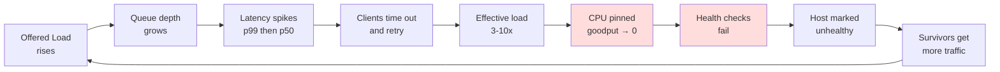
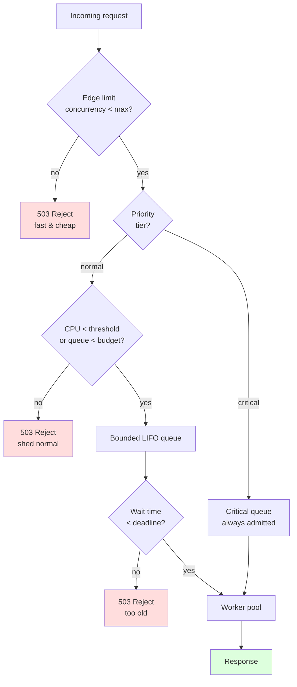
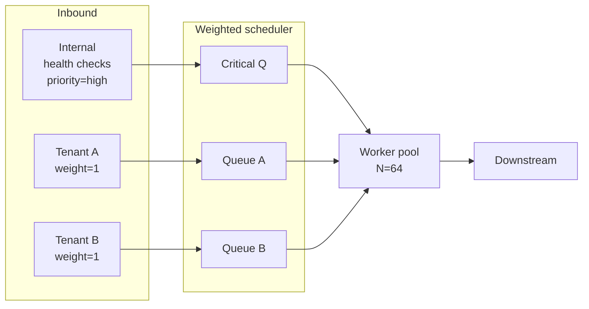

# Load Shedding

## Why This Exists

**Problem.** Every server has a maximum sustainable throughput. Past that point, more concurrent work makes *every* request slower — context switches, lock contention, GC pressure, queue depth, and TCP backpressure all compound. The system enters a regime where **goodput collapses while load keeps climbing**. Latency goes from 50ms to 5s, callers time out, callers retry, retries multiply load, and the service is now serving zero successful requests at 100% CPU. This is the classic "congestion collapse" curve.

**Key insight.** When you can't handle every request, the *kindest* thing you can do is **fail some requests fast and cheaply** so that the rest succeed. A service that returns `503` for 20% of requests in 1ms is more useful than one that returns `200` for 0% of requests after 30s. Load shedding is a form of *negative backpressure*: rather than letting the queue grow until something else breaks (memory, file descriptors, downstream services), you **enforce a budget** at the edge.

**Reach for this when:**
- You have a **bimodal request mix** — fast cache hits and slow database queries on the same threadpool, and the slow ones are starving the fast ones.
- You serve **many tenants** and one bad tenant (a runaway batch job, a misconfigured retry loop) can bring down the others.
- Your service has a **hard concurrency ceiling** (DB connections, threadpool size, GPU memory) and exceeding it causes catastrophic, not graceful, degradation.
- You see **retry amplification** — a 1.2x load spike turns into 3-5x because callers retry on timeout.
- Your downstream is the bottleneck and you're queueing unboundedly upstream.

**Don't reach for this when:**
- You're not actually overloaded — fix the slow path, add capacity, cache, or paginate first. Load shedding is the *last* line of defense, not the first.
- The load is transient and bounded — a small in-process queue with a bounded wait is simpler.
- Your traffic is from a single trusted batch job — flow control via a token bucket on the producer side is more direct.
- Requests are not independent (e.g., a transaction across N requests where shedding 1 of N corrupts state). Shed at the unit-of-work boundary, not mid-transaction.

## Diagrams

### The overload cliff (without shedding)



### Load shedding admission control



### Priority + tenant fairness



## Core Patterns

### 1. The simplest useful shedder: bounded concurrency at the edge

Most overload incidents would have been bounded by **a single semaphore in front of the work**. Don't skip this because it looks too simple — it isn't.

```python
# Python, FastAPI / asyncio. The 90% solution.
import asyncio
from contextlib import asynccontextmanager
from fastapi import FastAPI, HTTPException, Request

# Sized to the point where p99 latency stays sane under sustained load.
# Determine via load test, not by guessing. See "Sizing" below.
MAX_INFLIGHT = 200

inflight = asyncio.Semaphore(MAX_INFLIGHT)
shed_count = 0  # export to your metrics system

@asynccontextmanager
async def admit():
    # acquire_nowait raises if the semaphore is exhausted — this is the shed signal.
    if not inflight.locked() and inflight._value > 0:
        await inflight.acquire()
        try:
            yield
        finally:
            inflight.release()
    else:
        raise HTTPException(
            status_code=503,
            detail="overloaded",
            headers={"Retry-After": "1"},  # tell clients to back off
        )

app = FastAPI()

@app.middleware("http")
async def shed_middleware(request: Request, call_next):
    global shed_count
    try:
        async with admit():
            return await call_next(request)
    except HTTPException as e:
        if e.status_code == 503:
            shed_count += 1
        raise
```

**Why this works.** Concurrency, not RPS, is what kills servers. A box that can sustain 200 concurrent requests at 50ms each handles 4000 RPS — the same box at 500 concurrent requests at 1s each handles 500 RPS. By **bounding concurrency**, you bound queue depth, which bounds tail latency, which bounds the conditions that trigger retry storms.

**Why `Retry-After` matters.** A 503 without backoff guidance just becomes the next request's problem. AWS SDKs, Envoy, gRPC retry policies, and well-written clients all honor `Retry-After`.

### 2. CPU-based shedding (load average is wrong; use sampled CPU)

When the bottleneck is CPU rather than concurrency (encoding, JSON parsing, crypto, ML inference), shed based on observed CPU. **Don't use 1-min `loadavg`** — it's an exponentially-weighted average that lags 30+ seconds behind reality. You'll shed long after the spike is over.

```go
// Go. Sample CPU every 100ms; shed probabilistically when over threshold.
package shed

import (
    "math/rand"
    "sync/atomic"
    "time"

    "github.com/shirou/gopsutil/v3/cpu"
)

type CPUShedder struct {
    // current sampled CPU utilization in [0, 1.0]
    util atomic.Uint64
    // shed nothing below this; shed everything above ceiling
    floor   float64 // e.g. 0.70
    ceiling float64 // e.g. 0.95
}

func NewCPUShedder(floor, ceiling float64) *CPUShedder {
    s := &CPUShedder{floor: floor, ceiling: ceiling}
    go s.sampleLoop()
    return s
}

func (s *CPUShedder) sampleLoop() {
    // 100ms is a good sweet spot: short enough to react, long enough to be stable.
    // 1s sampling is too slow; sub-50ms sampling is jittery.
    ticker := time.NewTicker(100 * time.Millisecond)
    defer ticker.Stop()
    for range ticker.C {
        pcts, err := cpu.Percent(0, false)
        if err != nil || len(pcts) == 0 {
            continue
        }
        s.util.Store(uint64(pcts[0] * 1000)) // store as fixed point
    }
}

// ShouldShed returns true if this request should be rejected.
// Probability ramps linearly between floor and ceiling.
// Below floor: 0%. Above ceiling: 100%. Between: linear.
func (s *CPUShedder) ShouldShed() bool {
    u := float64(s.util.Load()) / 1000.0
    if u < s.floor {
        return false
    }
    if u >= s.ceiling {
        return true
    }
    p := (u - s.floor) / (s.ceiling - s.floor)
    return rand.Float64() < p
}
```

**Why probabilistic, not threshold.** A hard cutoff at 90% creates oscillation: you shed → CPU drops to 85% → admit fully → CPU jumps to 95% → shed everything → CPU drops → repeat. A linear ramp produces a smooth equilibrium where shed rate matches the overshoot.

**Caveat.** CPU is a *symptom*, not the cause. If your bottleneck is downstream latency or DB connections, CPU shedding will mis-fire. Combine with concurrency limits.

### 3. Priority queues (shed cheap requests first; protect health checks)

Not all requests are equal. The classic AWS Builders' Library example: **never shed your own health-check or control-plane traffic** — if you do, the load balancer pulls you out of rotation, the survivors get more load, and the whole fleet collapses.

```java
// Java. Three-tier priority with strict admission control per tier.
public final class TieredShedder {

    public enum Tier {
        // Internal: health checks, GetServerStatus, control plane.
        // Always admitted unless the box is literally on fire.
        CRITICAL(0.99, Integer.MAX_VALUE),
        // Authenticated user-initiated requests. Shed last.
        FOREGROUND(0.85, 800),
        // Async, batch, retries, prefetch. Shed first.
        BACKGROUND(0.60, 200);

        public final double cpuLimit;
        public final int concurrencyLimit;
        Tier(double cpuLimit, int concurrencyLimit) {
            this.cpuLimit = cpuLimit;
            this.concurrencyLimit = concurrencyLimit;
        }
    }

    private final Map<Tier, Semaphore> semaphores = new EnumMap<>(Tier.class);
    private final CPUSampler cpu;

    public TieredShedder(CPUSampler cpu) {
        this.cpu = cpu;
        for (Tier t : Tier.values()) {
            semaphores.put(t, new Semaphore(t.concurrencyLimit));
        }
    }

    public boolean tryAdmit(Tier tier) {
        // CRITICAL bypasses CPU check — we'd rather thrash than be marked unhealthy.
        if (tier != Tier.CRITICAL && cpu.utilization() > tier.cpuLimit) {
            return false;
        }
        return semaphores.get(tier).tryAcquire();
    }

    public void release(Tier tier) {
        semaphores.get(tier).release();
    }
}
```

**Tier sizing rule of thumb.** `CRITICAL` ≪ `FOREGROUND` < `BACKGROUND` in *count* but the inverse in *priority*. Critical traffic is rare but must always succeed. Background traffic is high-volume but resumable.

### 4. LIFO over FIFO under overload

Surprising but well-documented: when a queue is already over budget, **process newest requests first**. The oldest requests in the queue are the ones whose clients have already given up and will retry — finishing them is wasted work.

```typescript
// TypeScript. LIFO admission with deadline-aware shedding.
interface Job {
    enqueuedAt: number; // ms epoch
    deadline: number;   // ms epoch — when client will time out
    run: () => Promise<void>;
}

class LIFOShedder {
    private stack: Job[] = [];
    private readonly maxDepth: number;
    private readonly maxAgeMs: number;
    private active = 0;
    private readonly maxActive: number;

    constructor(maxDepth: number, maxAgeMs: number, maxActive: number) {
        this.maxDepth = maxDepth;
        this.maxAgeMs = maxAgeMs;
        this.maxActive = maxActive;
    }

    submit(job: Job): boolean {
        // Drop oldest if over depth — they're stalest.
        if (this.stack.length >= this.maxDepth) {
            this.stack.shift(); // drop oldest, not newest
        }
        this.stack.push(job);
        this.pump();
        return true;
    }

    private pump() {
        while (this.active < this.maxActive && this.stack.length > 0) {
            const job = this.stack.pop()!; // LIFO — newest first
            const now = Date.now();

            // Deadline check: client has already timed out, don't bother.
            if (now > job.deadline || now - job.enqueuedAt > this.maxAgeMs) {
                continue; // shed silently — caller already gave up
            }

            this.active++;
            job.run().finally(() => {
                this.active--;
                this.pump();
            });
        }
    }
}
```

**Why this is counter-intuitive but correct.** Under steady-state, FIFO and LIFO have identical throughput and similar mean latency. Under overload, FIFO guarantees that *every* request times out (because each request waits behind a backlog longer than its deadline), while LIFO ensures *some* requests succeed (the freshest ones). Marc Brooker's "Fairness in Multi-Tenant Systems" and the Cockroach Labs admission control work both arrived at this independently. See also the "scoreboard" pattern in Facebook's Akkio paper.

### 5. Token-bucket admission per tenant (fairness)

If one tenant can hog all your capacity, you have a noisy-neighbor problem, not a load-shedding problem. Token buckets per tenant give fair shares while still permitting bursts.

```python
# Python. Sliding-window token bucket per tenant.
import time
from dataclasses import dataclass, field
from threading import Lock

@dataclass
class TokenBucket:
    rate: float           # tokens per second (steady-state quota)
    capacity: float       # max burst size
    tokens: float = 0.0
    last: float = field(default_factory=time.monotonic)
    lock: Lock = field(default_factory=Lock)

    def take(self, n: float = 1.0) -> bool:
        with self.lock:
            now = time.monotonic()
            elapsed = now - self.last
            # Refill, capped at capacity.
            self.tokens = min(self.capacity, self.tokens + elapsed * self.rate)
            self.last = now
            if self.tokens >= n:
                self.tokens -= n
                return True
            return False

class FairShedder:
    def __init__(self, default_rate: float, default_capacity: float):
        self.buckets: dict[str, TokenBucket] = {}
        self.default_rate = default_rate
        self.default_capacity = default_capacity
        self.lock = Lock()

    def admit(self, tenant_id: str) -> bool:
        with self.lock:
            b = self.buckets.get(tenant_id)
            if b is None:
                b = TokenBucket(self.default_rate, self.default_capacity)
                self.buckets[tenant_id] = b
        return b.take()
```

**Sizing.** `rate` is the steady-state quota you've sold or implicitly promised. `capacity` is `rate * burst_seconds` — typically 1-10 seconds of burst. Higher burst hides latency from clients during your hiccups but also lets a misbehaving tenant inject 10s of overload.

### 6. Adaptive concurrency limits (Netflix concurrency-limits / TCP Vegas)

Static limits are fragile — you re-tune every time hardware, code, or traffic changes. Adaptive algorithms infer the optimal concurrency from observed RTT, the same way TCP Vegas detects congestion before packet loss.

```java
// Pseudocode following Netflix concurrency-limits library (Vegas variant).
// Observed minRTT is the no-queueing latency. Current RTT minus minRTT is queue delay.
// If queue delay grows, decrease limit. If it stays low, slowly increase.

class VegasLimit {
    int limit = 10;          // current concurrency limit
    long minRTT = Long.MAX_VALUE;
    final int alpha = 3;     // expand if queue < alpha
    final int beta = 6;      // shrink if queue > beta

    synchronized int update(long rttNanos, int currentInflight) {
        minRTT = Math.min(minRTT, rttNanos);
        // estimated queue size = inflight - (BDP at minRTT)
        double bdp = limit * ((double) minRTT / rttNanos);
        double queue = limit - bdp;

        if (queue < alpha)      limit++;        // additive increase, headroom available
        else if (queue > beta)  limit = Math.max(1, limit - 1); // shrink, queueing detected

        return limit;
    }
}
```

**When to use this.** When your traffic profile shifts often (mixed read/write, deploys with very different cost), or your dependencies' capacity changes (autoscaling DBs, shared infra). When traffic is stable and you control the workload, a tuned static limit is simpler and just as good.

### 7. Edge / API-gateway shedding

Shedding *inside* your service is too late if the request already cost you a TLS handshake, request parsing, auth lookup, and a thread. Shed at the **edge** — load balancer, API gateway, or service mesh — where rejection is cheapest.

```yaml
# Envoy: local rate limiting + adaptive concurrency.
http_filters:
  - name: envoy.filters.http.local_ratelimit
    typed_config:
      "@type": type.googleapis.com/envoy.extensions.filters.http.local_ratelimit.v3.LocalRateLimit
      stat_prefix: edge_shed
      token_bucket:
        max_tokens: 1000
        tokens_per_fill: 1000
        fill_interval: 1s
      filter_enabled: { default_value: { numerator: 100 } }
      filter_enforced: { default_value: { numerator: 100 } }
      response_headers_to_add:
        - header: { key: x-shed-reason, value: rate_limit }

  - name: envoy.filters.http.adaptive_concurrency
    typed_config:
      "@type": type.googleapis.com/envoy.extensions.filters.http.adaptive_concurrency.v3.AdaptiveConcurrency
      gradient_controller_config:
        sample_aggregate_percentile: { value: 90 }
        concurrency_limit_params:
          max_concurrency_limit: 1000
        min_rtt_calc_params:
          interval: 30s
          request_count: 50
```

## Sizing the Limits

Don't guess. Run a **load test that increases offered load until goodput plateaus**, then look at the concurrency at that knee.

1. Ramp offered RPS from 10% to 200% of expected peak over 10 minutes.
2. Plot goodput (successful_requests / sec) vs. offered load.
3. Find the **knee** — the point past which goodput stops increasing.
4. Record concurrency-in-flight at that knee. **That's your `MAX_INFLIGHT`**, minus 10-20% safety margin.
5. Verify p99 latency at the knee is acceptable. If not, the knee is past the latency budget; pick the latency-bounded concurrency instead.

Re-run on every major release, not just at launch. Code paths drift.

## Trade-offs

| Benefit | Cost |
|---|---|
| Bounded latency under overload (p99 stays survivable) | Some requests fail that *could* have succeeded if timing were perfect |
| Prevents cascading failures and brown-outs | Adds complexity: sizing, alerting on shed rate, tier classification |
| Protects downstream dependencies from your retry storms | Clients must implement retries-with-backoff to actually benefit |
| LIFO + deadlines avoid useless work on dead requests | LIFO violates intuitive "fairness" — old requests can starve under sustained overload |
| Per-tenant fairness prevents noisy neighbors | Requires reliable tenant identification at the admission point |
| CPU-based shedding adapts to code/hardware changes | Symptom-based; mis-fires when bottleneck is downstream, not CPU |
| Adaptive concurrency self-tunes | Harder to reason about; debugging "why did it shed at 50 RPS?" is non-trivial |
| Edge shedding rejects cheaply (no thread, no DB) | Edge has less context — can't distinguish cheap from expensive requests |

## Common Pitfalls

- **Shedding too late.** If you only shed when the queue is already 10s deep, you've already lost. Shed *before* the symptom — at concurrency ceiling, not at "everything is on fire."
- **Shedding health checks.** The classic disaster: under load you start returning 503 to your load balancer, it pulls you out, the survivors get even more load, and you have a fleet-wide outage from a small overshoot. Always tier health checks as `CRITICAL`.
- **Retries that ignore `Retry-After`.** Your shedding only works if clients back off. Check that *your own* internal SDKs honor 503 + `Retry-After`. Many don't.
- **Retry amplification across retry layers.** App retries 3x, SDK retries 3x, sidecar retries 3x = 27x amplification on a single user-visible failure. Use **retry budgets** (e.g., gRPC `RETRY_PUSHBACK`, Finagle's "retry budget" — max 20% retries of total requests) and shed retries *before* fresh requests.
- **Static limits that drift.** A limit tuned 18 months ago for an old code path is now wrong. Either re-tune on every release or use adaptive limits.
- **Loadavg-based shedding.** `uptime` 1-min loadavg lags reality by 30+ seconds. By the time it crosses your threshold, the spike is over. Use sampled CPU at 100ms granularity.
- **Per-instance shedding without coordination.** If one host sheds and the load balancer doesn't notice, traffic just piles onto the others. Either propagate shed state (gRPC `LRS`, Envoy outlier detection) or rely on round-robin to distribute the pain evenly.
- **Shedding inside a transaction.** If you've already taken a DB lock, started a saga, or charged a credit card, shedding mid-flight leaks state. Shed at the unit-of-work boundary, not in the middle.
- **Forgetting to alert on shed rate.** A service quietly shedding 10% of traffic for a week because nobody alerted on it is worse than an outage — you don't know your real capacity. Alert on `shed_rate > X%` for `> 5min`.
- **Treating shedding as a substitute for capacity.** Shedding bounds the *blast radius* of overload; it doesn't make you faster. If you're shedding 30% of traffic at p50 load, you're under-provisioned, not well-protected.
- **No `Retry-After` jitter.** All shed clients retrying at exactly `Retry-After=1s` produces a thundering herd 1s later. Add jitter (RFC 7231 says `Retry-After` is a minimum — clients should add jitter; servers should expect they don't).

## Decision Table

| Symptom / Need | Reach for | Don't reach for |
|---|---|---|
| Single-threaded process, easy to reason about, just need a ceiling | Bounded concurrency semaphore (pattern 1) | Adaptive concurrency (overkill) |
| CPU-bound (encoding, ML, JSON), fluctuating workload mix | CPU-based probabilistic shedding (pattern 2) | Loadavg-based shedding |
| Multi-tenant SaaS, noisy-neighbor risk | Per-tenant token buckets (pattern 5) | Global concurrency limit alone |
| Mixed critical/background traffic | Tiered priority queues (pattern 3) | Single FIFO queue |
| Strict client deadlines (gRPC `grpc-timeout`) | LIFO + deadline check (pattern 4) | FIFO queue without deadlines |
| Traffic mix shifts often, hard to size statically | Adaptive concurrency limits / Netflix Vegas (pattern 6) | Static semaphore |
| Requests are cheap to reject, expensive to process | Edge / API-gateway shedding (pattern 7) | In-process shedding only |
| Burst tolerance > steady-state capacity | Token bucket (capacity > rate) | Hard concurrency limit |
| Load is producer-driven (your own batch job) | Producer-side flow control / token bucket | Consumer-side shedding (asymmetric battle) |
| Downstream is the bottleneck | Concurrency limit sized to downstream + circuit breaker | CPU shedding (will mis-fire) |
| Need to drop oldest stale work | LIFO with max-age check | FIFO |
| Need fairness across many small clients | Weighted fair queueing / DRR | LIFO (starves under sustained load) |

## Related Patterns (and how they differ)

- **Circuit breakers.** Open when downstream is failing; load shedding rejects when *you* are overloaded. Use both — circuit-break on dependency, shed on self.
- **Rate limiting.** Imposes a *contractual* cap (e.g., "100 RPS per API key") regardless of capacity. Load shedding is *capacity-aware* — admits as much as it can. Often deployed together.
- **Bulkheads.** Partition resources so one subsystem's overload can't drain another. Tiered shedding is bulkheading by request priority.
- **Backpressure.** A protocol-level mechanism (TCP zero-window, gRPC flow control, Reactive Streams) that slows the producer. Shedding is what you do when backpressure isn't possible (e.g., HTTP/1.1) or hasn't kicked in fast enough.
- **Queueing with a bounded queue.** A bounded queue with `reject` policy *is* a load shedder. The pattern in this skill is just the explicit, observable, tunable version of that.

## References

- AWS Builders' Library — David Yanacek — *Using load shedding to avoid overload* — https://aws.amazon.com/builders-library/using-load-shedding-to-avoid-overload/
- AWS Builders' Library — Marc Brooker — *Fairness in multi-tenant systems* — https://aws.amazon.com/builders-library/fairness-in-multi-tenant-systems/
- AWS Builders' Library — *Timeouts, retries, and backoff with jitter* — https://aws.amazon.com/builders-library/timeouts-retries-and-backoff-with-jitter/
- AWS Builders' Library — *Avoiding fallback in distributed systems* — https://aws.amazon.com/builders-library/avoiding-fallback-in-distributed-systems/
- Google SRE Book — ch. 21 *Handling Overload* — https://sre.google/sre-book/handling-overload/
- Google SRE Book — ch. 22 *Addressing Cascading Failures* — https://sre.google/sre-book/addressing-cascading-failures/
- Google SRE Workbook — ch. 8 *On-Call* and ch. 11 *Managing Load* — https://sre.google/workbook/managing-load/
- Netflix Tech Blog — *Performance Under Load* (concurrency-limits library, adaptive limits) — https://netflixtechblog.medium.com/performance-under-load-3e6fa9a60581
- Netflix concurrency-limits — https://github.com/Netflix/concurrency-limits
- Marc Brooker — *What is Backpressure?* — https://brooker.co.za/blog/2021/05/24/backpressure.html
- Marc Brooker — *Exponential Backoff And Jitter* — https://aws.amazon.com/blogs/architecture/exponential-backoff-and-jitter/
- Envoy — *Adaptive Concurrency filter* — https://www.envoyproxy.io/docs/envoy/latest/configuration/http/http_filters/adaptive_concurrency_filter
- Envoy — *Local Rate Limit filter* — https://www.envoyproxy.io/docs/envoy/latest/configuration/http/http_filters/local_rate_limit_filter
- gRPC — *Retry design (retry budgets, throttling)* — https://github.com/grpc/proposal/blob/master/A6-client-retries.md
- Cockroach Labs — *Admission Control in CockroachDB* — https://www.cockroachlabs.com/blog/admission-control-in-cockroachdb/
- Jaana Dogan — *The math of capacity planning* — https://rakyll.org/capacity-planning/
- DDIA (Kleppmann, 2017) — ch. 8 *The Trouble with Distributed Systems* (timeouts, unbounded queueing) and ch. 11 *Stream Processing* (backpressure)
- Building Secure and Reliable Systems — ch. 8 *Designing for Resilience* — https://sre.google/books/building-secure-reliable-systems/
- L. S. Brakmo, S. W. O'Malley, L. L. Peterson — *TCP Vegas: New Techniques for Congestion Detection and Avoidance* (1994) — the algorithm behind adaptive concurrency

## See Also

- `../circuit-breaker/` — open the circuit when *downstream* is unhealthy; complementary to load shedding when *you* are unhealthy.
- `../bulkheads/` — partitioning resources; tiered shedding is a special case.
- `../../communication/backpressure/` — protocol-level flow control upstream of shedding.
- `../rate-limiting/` — contractual caps vs. capacity-aware shedding.
- `../graceful-degradation/` — what to serve *instead* of a 503 when shedding (cached/stale, reduced fidelity).
- `../health-checks/` — why you must never shed your own health-check traffic.
- `../../performance/use-red-methods/` — measuring shed rate alongside the four golden signals.
