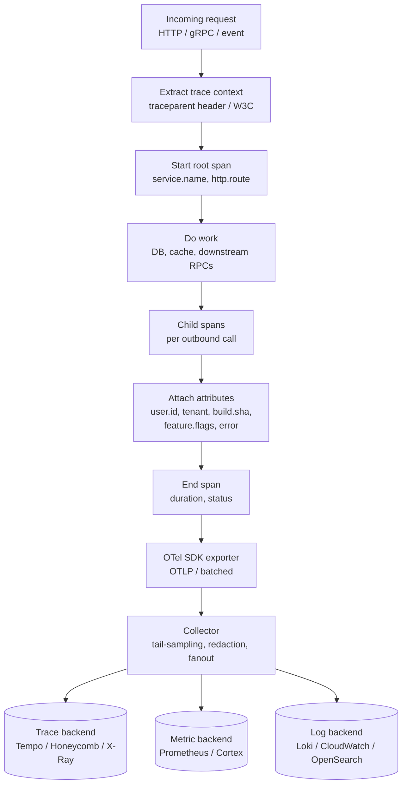
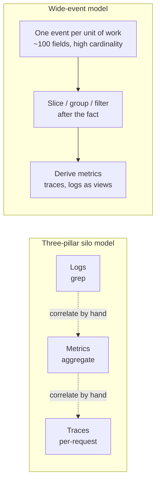
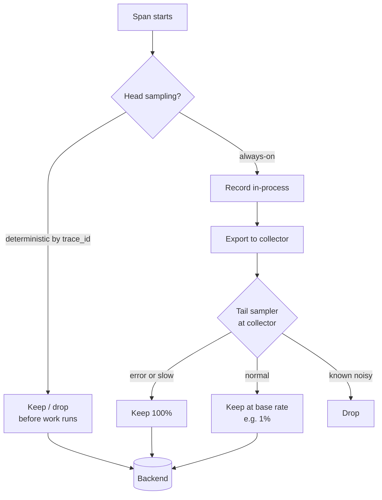

# Observability

## Why This Exists

**Problem.** Production systems fail in ways you didn't predict. A traditional "monitoring" stack tells you that *something* is wrong (CPU is high, error rate is up) but not *why*. By the time you're paging a human, the question is rarely "is it broken?" — it's "which of fifty deploys, one hundred dependencies, and ten million users caused this specific shape of broken?" Pre-aggregated metrics and unindexed log greps cannot answer that.

**Key insight (Charity Majors).** Observability is the property of a system that lets you ask **new questions about its behavior without shipping new code**. The unit of observability is not the log line or the metric — it's the **wide, structured event with high-cardinality fields** (user_id, build_sha, shard, feature_flag, region, request_id) that you can slice, group, and filter arbitrarily after the fact. Three pillars (logs/metrics/traces) is a useful sales taxonomy but a mediocre design model: the pillars overlap, and treating them as separate silos forces you to correlate by hand at 3am.

**Reach for this when:**
- You're investigating an unknown-unknown — "what changed?" or "who is affected?"
- Latency P99 spiked but P50 is fine, and you need to find the *specific population* causing tail latency
- A bug only reproduces for one customer, one device class, one shard, or one feature-flag combination
- Cascading failures across microservices: which hop is the root, which are downstream effects
- You're picking an SDK / vendor / sampling strategy for a new service
- You're defining SLOs and need to choose RED, USE, or the four golden signals
- A teammate proposes "let's just add a Grafana panel for that" — almost always the wrong instinct

**Don't reach for this when:**
- You already know exactly what dimension matters and it's low-cardinality (CPU, queue depth, GC pause). Use a metric, you don't need a trace.
- The system is a batch job with one input and one output. A structured log line + exit code is enough.
- You're profiling CPU/memory inside one process. Use a profiler (pprof, async-profiler, perf) — observability tools sample too coarsely for hotspot analysis.
- Compliance auditing where you must retain *every* event verbatim. That's an immutable log/audit pipeline, not observability — different durability and retention guarantees.

## Diagrams

### How a single request becomes signals



### Wide events vs three-pillar silos



### Sampling decision flow (head vs tail)



## The three pillars and why the framing leaks

| Pillar | What it is | What it answers well | Where it fails |
|---|---|---|---|
| **Metrics** | Pre-aggregated numeric time series (counter, gauge, histogram) with low-cardinality labels | "Is the system healthy *in aggregate*?" Dashboards, alerts, capacity planning | Cannot answer "which user?" or "which build?" — cardinality explosion. Pre-aggregated == lossy by design. |
| **Logs** | Append-only stream of timestamped records (ideally structured) | Forensic detail, audit, "what exactly happened at 14:03:22 on host-7" | No structure across requests; full-text grep at scale is slow and expensive; correlation across services is manual. |
| **Traces** | Causal graph of spans across services for a single request | "Where did time go in *this* request? Which hop failed?" | Sampling drops the rare events you actually want; per-trace UIs are bad at population analysis ("how many users hit this code path?"). |

**The leak.** A modern wide-event row contains the metric numbers (duration, bytes), the log message (event.name + attributes), and the trace context (trace_id, span_id, parent_id). Storing them as one event per unit of work and *deriving* metrics/logs/traces as views is strictly more powerful than three independent pipelines. This is the Honeycomb / Charity Majors thesis, and it's why OpenTelemetry's data model is span-centric rather than pillar-centric. The four golden signals (latency, traffic, errors, saturation — SRE Book ch. 6) and RED/USE map cleanly onto wide events.

## OpenTelemetry: the only sane vendor-neutral choice

OpenTelemetry (OTel) is a CNCF project providing:
- **API** — the surface your code calls (`tracer.start_span`, `meter.create_counter`)
- **SDK** — the in-process implementation (sampling, batching, context propagation)
- **OTLP** — the wire protocol (gRPC or HTTP, protobuf payloads)
- **Collector** — a stateless agent/gateway that receives, processes, and fans out signals
- **Semantic conventions** — agreed names (`http.request.method`, `db.system`, `service.name`) so dashboards and alerts work across stacks

If you're starting in 2026, **start with OTel**. Vendor SDKs (Datadog tracer, New Relic agent, X-Ray daemon) lock you in and mostly emit OTel under the hood now anyway.

### Minimal Python service with OTel

```python
# app.py — a Flask service emitting traces, metrics, and structured logs
# All three signals share trace context, so they correlate automatically.

import logging
import os
from flask import Flask, request

from opentelemetry import trace, metrics
from opentelemetry.sdk.resources import Resource
from opentelemetry.sdk.trace import TracerProvider
from opentelemetry.sdk.trace.export import BatchSpanProcessor
from opentelemetry.sdk.metrics import MeterProvider
from opentelemetry.sdk.metrics.export import PeriodicExportingMetricReader
from opentelemetry.exporter.otlp.proto.grpc.trace_exporter import OTLPSpanExporter
from opentelemetry.exporter.otlp.proto.grpc.metric_exporter import OTLPMetricExporter
from opentelemetry.instrumentation.flask import FlaskInstrumentor
from opentelemetry.instrumentation.requests import RequestsInstrumentor

# Resource = the entity producing telemetry. service.name is mandatory; without
# it, every backend will bucket your data under "unknown_service" and you'll cry.
resource = Resource.create({
    "service.name": os.environ["OTEL_SERVICE_NAME"],          # e.g. "checkout-api"
    "service.version": os.environ.get("BUILD_SHA", "dev"),    # critical: lets you slice by deploy
    "deployment.environment": os.environ.get("ENV", "prod"),
})

# Traces
trace.set_tracer_provider(TracerProvider(resource=resource))
trace.get_tracer_provider().add_span_processor(
    BatchSpanProcessor(OTLPSpanExporter())  # endpoint via OTEL_EXPORTER_OTLP_ENDPOINT
)
tracer = trace.get_tracer(__name__)

# Metrics
metrics.set_meter_provider(MeterProvider(
    resource=resource,
    metric_readers=[PeriodicExportingMetricReader(OTLPMetricExporter())],
))
meter = metrics.get_meter(__name__)
checkout_failures = meter.create_counter(
    "checkout.failures",
    description="Failed checkout attempts",
    unit="1",
)

app = Flask(__name__)
FlaskInstrumentor().instrument_app(app)   # auto-spans for every route
RequestsInstrumentor().instrument()       # auto-spans for outbound HTTP

log = logging.getLogger(__name__)


@app.route("/checkout", methods=["POST"])
def checkout():
    # Manual span for the business transaction. Attach the high-cardinality
    # fields you'll want to slice on later. Cost is ~bytes per attribute;
    # benefit is "find every failed checkout for tenant=acme on build=abc123."
    with tracer.start_as_current_span("checkout.execute") as span:
        body = request.get_json(force=True)
        user_id = body["user_id"]
        cart_id = body["cart_id"]
        tenant = request.headers.get("x-tenant", "unknown")

        span.set_attribute("user.id", user_id)            # high-cardinality, fine
        span.set_attribute("tenant.id", tenant)
        span.set_attribute("cart.id", cart_id)
        span.set_attribute("cart.item_count", len(body.get("items", [])))

        try:
            result = run_checkout(user_id, cart_id)       # may call DB, payment, etc.
            span.set_attribute("checkout.result", result.status)
            return {"ok": True, "order_id": result.order_id}
        except PaymentDeclined as e:
            # Mark span as error so backends bucket it correctly.
            span.set_status(trace.Status(trace.StatusCode.ERROR, str(e)))
            span.set_attribute("error.type", "payment_declined")
            span.set_attribute("payment.decline_code", e.code)
            checkout_failures.add(1, {"reason": "payment_declined", "tenant": tenant})
            # Structured log carries the same trace_id, so it joins to the trace.
            log.warning("checkout_failed", extra={
                "user_id": user_id, "cart_id": cart_id,
                "decline_code": e.code,
            })
            return {"ok": False, "error": "payment_declined"}, 402
```

### Context propagation across services (Go example)

```go
// downstream.go — a Go HTTP client that propagates trace context.
// Without this, your traces break at every service boundary.

package main

import (
	"context"
	"net/http"

	"go.opentelemetry.io/contrib/instrumentation/net/http/otelhttp"
	"go.opentelemetry.io/otel"
	"go.opentelemetry.io/otel/attribute"
)

var tracer = otel.Tracer("inventory-client")

// CheckStock calls the inventory service. The otelhttp.Transport injects the
// W3C traceparent header so the receiver continues the same trace.
func CheckStock(ctx context.Context, sku string) (int, error) {
	ctx, span := tracer.Start(ctx, "inventory.check_stock",
		// Span attributes: sku is high-cardinality; that's expected and good.
		// Do NOT put PII here — see "Common Pitfalls."
		trace.WithAttributes(attribute.String("sku", sku)),
	)
	defer span.End()

	client := &http.Client{
		// otelhttp.NewTransport wraps the round-tripper to inject traceparent
		// and emit a child span for the outbound request.
		Transport: otelhttp.NewTransport(http.DefaultTransport),
	}
	req, _ := http.NewRequestWithContext(ctx, "GET",
		"http://inventory/stock?sku="+sku, nil)
	resp, err := client.Do(req)
	if err != nil {
		span.RecordError(err)
		return 0, err
	}
	defer resp.Body.Close()
	// ... parse and return
	return parseStock(resp)
}
```

## Structured logging: stop printing english

Unstructured logs (`log.Info("user " + id + " did thing")`) are an anti-pattern in any system you don't `tail -f` from a single terminal. Use **structured logs**: JSON (or logfmt) with a fixed schema and named fields.

### Bad

```python
log.info(f"user {user_id} placed order {order_id} total ${total} for tenant {tenant}")
# To find "all orders > $100 for tenant=acme" you must regex-parse the message.
# When the message format changes, every dashboard breaks silently.
```

### Good

```python
log.info("order_placed", extra={
    "user_id": user_id,
    "order_id": order_id,
    "total_cents": int(total * 100),   # integers, not floats — comparisons are exact
    "tenant": tenant,
    "build_sha": BUILD_SHA,
})
# Backend can index every field. "tenant=acme AND total_cents>10000" is a query.
```

### Logger configuration that works in production (Python)

```python
# logging_config.py — JSON logs to stdout with trace correlation.

import json, logging, sys
from opentelemetry import trace

class JSONFormatter(logging.Formatter):
    def format(self, record):
        # Pull active trace context so each log line carries trace_id/span_id.
        span = trace.get_current_span()
        ctx = span.get_span_context() if span else None

        payload = {
            "ts": self.formatTime(record, "%Y-%m-%dT%H:%M:%S.%f"),
            "level": record.levelname,
            "logger": record.name,
            "msg": record.getMessage(),
            "service": "checkout-api",
        }
        if ctx and ctx.is_valid:
            # 32-hex trace_id and 16-hex span_id — what every backend expects.
            payload["trace_id"] = format(ctx.trace_id, "032x")
            payload["span_id"] = format(ctx.span_id, "016x")
        # Anything passed via `extra=` lands in record.__dict__.
        for k, v in record.__dict__.items():
            if k not in _STD_LOGRECORD_ATTRS and not k.startswith("_"):
                payload[k] = v
        if record.exc_info:
            payload["exc"] = self.formatException(record.exc_info)
        return json.dumps(payload, default=str)

handler = logging.StreamHandler(sys.stdout)
handler.setFormatter(JSONFormatter())
logging.basicConfig(level=logging.INFO, handlers=[handler])
```

**Rules of thumb for log fields:**
- One `event_name` per call (snake_case verb_noun: `order_placed`, `cache_miss`)
- Always include: `service`, `build_sha`, `env`, `trace_id`, `span_id`
- Always include the *primary keys* of the entities the event touches: `user_id`, `tenant`, `order_id`
- Never include: passwords, full credit card numbers, raw OAuth tokens, full request bodies (redact)
- Use units in field names (`latency_ms`, `total_cents`, `bytes_in`) — avoids "wait, is this seconds?" at 3am

## High-cardinality is the point, not the problem

A **high-cardinality field** is one with many distinct values: `user_id` (millions), `request_id` (per-request, unbounded), `build_sha` (per-deploy). A **low-cardinality field** has few: `region` (~20), `http.status_code` (~50), `service.name` (~hundreds).

Traditional metrics systems (Prometheus, StatsD) explode on high cardinality because every unique label-set becomes a separate time series stored forever. Adding `user_id` as a label to a metric in Prometheus is a known way to take down the metrics infrastructure.

Wide-event / column-store backends (Honeycomb, ClickHouse-based stacks, modern tracing systems) are designed for high cardinality: each event is a row with arbitrary columns; queries are scans over a time window with predicate pushdown.

| Question | Needs high cardinality? | Right tool |
|---|---|---|
| "What's overall p99 latency?" | No | Metric (histogram) |
| "What's p99 latency *for tenant=acme*?" | Yes (one tenant) | Wide events / traces filtered by tenant |
| "Which users hit this slow code path in the last hour?" | Yes (per user) | Wide events grouped by user_id |
| "How many 500s last week?" | No | Metric (counter) |
| "Did the 500s correlate with a specific build_sha?" | Medium | Wide events grouped by build_sha |

**Rule.** Use metrics for *known questions* on low-cardinality dimensions (alerts, capacity dashboards). Use wide events for *unknown questions* on high-cardinality dimensions (debugging, root-causing).

## Sampling: you cannot afford to keep everything

At scale, exporting every span to a backend costs more than the workload itself. Sampling is mandatory. The choice is **head sampling** vs **tail sampling**.

### Head sampling

Decide *at span start* whether to keep the trace, deterministically by trace_id (so all services agree). Cheap, predictable, and *biased* — you pre-decide before knowing whether the trace was interesting.

```yaml
# OTel SDK env vars — head-sample 1% of traces.
OTEL_TRACES_SAMPLER: parentbased_traceidratio
OTEL_TRACES_SAMPLER_ARG: "0.01"
```

### Tail sampling

Buffer all spans for a trace at a collector, decide *after* the trace completes based on its outcome (was it slow? did it error?). Keeps the rare-but-important traces; drops the boring 200 OKs.

```yaml
# otel-collector-config.yaml — tail-based sampling
processors:
  tail_sampling:
    decision_wait: 10s         # buffer up to 10s before deciding
    num_traces: 50000          # in-flight cap; tune to memory budget
    expected_new_traces_per_sec: 5000
    policies:
      # 1) Always keep errors.
      - name: errors-policy
        type: status_code
        status_code: { status_codes: [ERROR] }
      # 2) Always keep slow traces (p99-ish).
      - name: latency-policy
        type: latency
        latency: { threshold_ms: 1000 }
      # 3) Always keep traces touching a critical path.
      - name: critical-route
        type: string_attribute
        string_attribute:
          key: http.route
          values: [/checkout, /payment]
      # 4) Keep 1% of everything else (representative sample for baselines).
      - name: baseline
        type: probabilistic
        probabilistic: { sampling_percentage: 1 }

exporters:
  otlp/honeycomb:
    endpoint: api.honeycomb.io:443
    headers: { x-honeycomb-team: ${HONEYCOMB_API_KEY} }

service:
  pipelines:
    traces:
      receivers: [otlp]
      processors: [tail_sampling, batch]
      exporters: [otlp/honeycomb]
```

### When to use which

| Strategy | Use when | Don't use when |
|---|---|---|
| **Head, 100%** | Low-volume services (<100 RPS), dev/staging | Anything at scale — bill explodes |
| **Head, deterministic ratio** | High volume, simple system, baselines matter more than rare-event capture | You need to debug 1-in-a-million errors — head sampling will drop them |
| **Tail, error+latency biased** | Production at scale; you care about anomalies | You can't run a stateful collector tier (head sampling is simpler) |
| **Dynamic / adaptive** | Massive scale, traffic spikes (Black Friday) | Small teams — operational complexity not worth it |

## RED, USE, and the four golden signals

Three overlapping methodologies. Pick by what you're observing.

### RED — for request-driven services (Tom Wilkie)

For each service, track:
- **R**ate — requests per second
- **E**rrors — failed requests per second (or % of rate)
- **D**uration — distribution of request latencies (always histogram, never average)

RED is the right default for HTTP/gRPC services, queue consumers, anything that processes *units of work*.

```promql
# Prometheus / PromQL — RED metrics derived from a histogram

# Rate: requests per second over 5 minutes
sum(rate(http_server_requests_total{service="checkout"}[5m])) by (route)

# Errors: error rate as a fraction of total
sum(rate(http_server_requests_total{service="checkout",status=~"5.."}[5m])) by (route)
  /
sum(rate(http_server_requests_total{service="checkout"}[5m])) by (route)

# Duration: p99 latency
histogram_quantile(0.99,
  sum(rate(http_server_request_duration_seconds_bucket{service="checkout"}[5m]))
    by (le, route)
)
```

### USE — for resources (Brendan Gregg)

For each finite resource (CPU, memory, disk, NIC, DB connection pool):
- **U**tilization — % of time the resource was busy
- **S**aturation — queue depth / wait time when over capacity
- **E**rrors — operations that failed

USE is the right lens for capacity / infrastructure debugging — when the question is "is this box / pool / queue overloaded?" not "is this service serving correctly?"

### Four golden signals (SRE Book ch. 6)

Latency, traffic, errors, saturation. The union of RED (latency, traffic, errors) and the *saturation* part of USE. If you're alerting on a service, alert on these four — preferably as **SLO burn-rate alerts**, not threshold alerts on raw metrics.

### SLOs: the antidote to "everything is yellow"

A service-level objective is a target on a service-level indicator (SLI). Example:
> **SLI**: fraction of /checkout requests in the last 30 days served in <500ms with HTTP <500.
> **SLO**: 99.9% of those requests succeed.
> **Error budget**: 0.1% × monthly_requests = the number of "bad" events you can afford.

Alert on **error-budget burn rate** (multi-window: fast burn = page now; slow burn = ticket). This is the only alerting strategy that scales — threshold alerts on individual metrics produce a wall of false positives. See SRE Workbook ch. 5 (Alerting on SLOs).

```yaml
# Prometheus alert rule — multi-window burn-rate alert
# Pages when we'll burn the entire 30-day budget in <2h.
- alert: CheckoutSLOFastBurn
  expr: |
    (
      slo:checkout_availability:burnrate_5m > (14.4 * 0.001)
      and
      slo:checkout_availability:burnrate_1h > (14.4 * 0.001)
    )
  for: 2m
  annotations:
    summary: "Checkout burning error budget 14.4x normal — paging on-call"
```

## Trade-offs

| Benefit | Cost |
|---|---|
| Wide events answer arbitrary post-hoc questions | Higher per-event payload than metrics; need column-store backend (Honeycomb, ClickHouse, Tempo) |
| OpenTelemetry is vendor-neutral, future-proof | API still churns in some signals (logs GA later than traces); SDK overhead non-trivial in hot paths |
| High-cardinality fields enable per-user / per-tenant debugging | Will destroy a Prometheus-style metrics backend if you put them on metrics |
| Tail sampling keeps the *interesting* traces | Requires stateful collector tier; adds 5–30s latency before traces appear; complicates HA |
| Structured JSON logs are queryable, machine-parseable | More verbose than plain text; slower to write at extreme rates; eat more disk |
| RED / USE / golden signals give a complete coverage matrix | Overlapping signals — you'll double-count if you don't pick one as canonical per service |
| SLO burn-rate alerts dramatically cut false-positive pages | Require honest historical SLI data + stakeholder agreement on the SLO; political work, not just engineering |
| Auto-instrumentation (OTel agents, Java agent, eBPF) covers 80% for free | Hides what's happening; surprise spans appear in unexpected places; can break weird frameworks |

## Common Pitfalls

- **`service.name` missing or wrong.** Every span lands under "unknown_service" and you cannot filter by service. Set `OTEL_SERVICE_NAME` *and* `service.version` (build SHA) on every deployable.
- **PII in span attributes.** Email, full name, raw card numbers, OAuth tokens, JWTs. Once exported they are very hard to scrub. Redact at the SDK with a span processor or at the collector with the `redaction` / `attributes` processor before export.
- **Cardinality bombs in metrics.** Adding `user_id` or `request_id` as a Prometheus label. The series count explodes; the backend OOMs. Put high-cardinality fields on **events/spans**, not metrics.
- **Sampling drops the bug.** Head sampling at 1% with no tail-sampling tier means the customer-impacting once-an-hour error never appears in your traces. Always tail-sample errors and slow traces at 100%.
- **Average latency dashboards.** Averages lie about distributions. *Always* histograms; alert on p99 (or p99.9 for hot paths). See "Latency Lies" — Gil Tene.
- **Logging inside hot loops without sampling.** A `log.info` inside an N=1M loop generates a million log lines, blows out your log bill, and slows the loop. Sample logs the same way you sample traces.
- **Trace context not propagated.** Every service in the request path *must* pass `traceparent` / `tracestate` headers. One un-instrumented hop and the trace breaks; you get two disconnected partial traces.
- **Logs/metrics/traces in three vendors.** Cross-pillar correlation becomes a manual UUID copy-paste at 3am. Either unify on one backend or ensure all three carry `trace_id` so a query in one jumps cleanly to another.
- **Dashboards as alerts.** A dashboard nobody looks at is not telling you anything. If it matters, it's an SLO burn-rate alert. If it doesn't matter, delete it.
- **"We'll add observability later."** Adding instrumentation to a system in flames is harder than adding it to a healthy one. Instrument from day one — the OTel auto-instrumentation gives you a free baseline.
- **Re-using `request_id` as `trace_id`.** They are not the same: trace_id is 128-bit, hex, generated by the tracer; request_id is your application-level idempotency key. Carry both, in distinct fields.
- **Retention everywhere == retention nowhere.** Storing 100% of traces for 30 days is cost-suicide. Tier: 100% for 24h, sampled-only for 7d, aggregates-only beyond that.

## Decision Table

| Situation | Use | Not |
|---|---|---|
| Picking a tracer SDK in 2026 | **OpenTelemetry** | Vendor-proprietary SDK (Datadog, NR, Jaeger client) |
| "Is the system up?" alert | **SLO burn-rate alert** on golden signals | Threshold alert on CPU/memory |
| Debugging tail latency for one tenant | **High-cardinality wide events** filtered by `tenant.id` | Average-latency dashboard |
| Capacity planning for a worker pool | **USE** (utilization + saturation + errors) | RED (request-shaped, wrong lens) |
| Public HTTP API alerting | **RED** plus saturation = four golden signals | USE alone |
| Sampling at 100k+ RPS | **Tail sampling** at collector, biased on errors+latency | Head sample 100% |
| Sampling at 100 RPS dev service | **Head sampling 100%** | Tail sampling (operational overhead unjustified) |
| Audit trail for SOX / HIPAA | **Dedicated immutable log pipeline** with WORM storage | Observability backend (different durability guarantees) |
| Profile CPU hotspot in one process | **pprof / async-profiler / perf** | Distributed tracing (too coarse) |
| Find which build_sha caused regression | **Wide events grouped by `service.version`** | Diff two log files |
| Cross-service request correlation | **Trace context propagation (W3C traceparent)** | Custom `X-Request-Id` header (works but doesn't carry sampling decision) |
| Storage for 30d of full-fidelity events | **Column store + tiered retention** | Elasticsearch with everything hot |

## References

**Books / chapters**
- Beyer, Jones, Petoff, Murphy — *Site Reliability Engineering* — https://sre.google/sre-book/table-of-contents/ (esp. ch. 6 "Monitoring Distributed Systems", ch. 4 "SLOs")
- Beyer et al. — *The Site Reliability Workbook* — https://sre.google/workbook/table-of-contents/ (esp. ch. 4 "SLO Engineering Case Studies", ch. 5 "Alerting on SLOs")
- Majors, Fong-Jones, Miranda — *Observability Engineering* (O'Reilly, 2022) — https://www.oreilly.com/library/view/observability-engineering/9781492076438/
- Kleppmann — *Designing Data-Intensive Applications* (DDIA, O'Reilly 2017), ch. 1 ("Reliable, Scalable, and Maintainable Applications") for the reliability framing that observability supports
- Gregg — *Systems Performance* (2nd ed., Addison-Wesley 2020), ch. 2 introduces USE method

**Primary writing**
- Charity Majors — "Observability — A Manifesto" — https://www.honeycomb.io/blog/observability-a-manifesto
- Charity Majors — "Logs vs. Structured Events" — https://charity.wtf/2019/02/05/logs-vs-structured-events/
- Charity Majors — "Metrics: not the observability droids you're looking for" — https://charity.wtf/2018/03/27/metrics-not-the-observability-droids-youre-looking-for/
- Tom Wilkie — "The RED Method: How To Instrument Your Services" — https://grafana.com/blog/2018/08/02/the-red-method-how-to-instrument-your-services/
- Brendan Gregg — "The USE Method" — https://www.brendangregg.com/usemethod.html
- Gil Tene — "How NOT to Measure Latency" (talk + slides) — https://www.infoq.com/presentations/latency-response-time/
- Cindy Sridharan — *Distributed Systems Observability* (free O'Reilly report) — https://www.oreilly.com/library/view/distributed-systems-observability/9781492033431/
- Cindy Sridharan — "Logs and Metrics and Graphs, Oh My!" — https://copyconstruct.medium.com/logs-and-metrics-6d34d3026e38

**Specs and standards**
- OpenTelemetry — official docs — https://opentelemetry.io/docs/
- OpenTelemetry — Semantic Conventions — https://opentelemetry.io/docs/specs/semconv/
- OpenTelemetry — Sampling — https://opentelemetry.io/docs/concepts/sampling/
- W3C Trace Context — https://www.w3.org/TR/trace-context/
- W3C Baggage — https://www.w3.org/TR/baggage/
- OTLP protocol — https://opentelemetry.io/docs/specs/otlp/

**Vendor / practitioner deep dives**
- AWS Builders' Library — "Instrumenting distributed systems for operational visibility" — https://aws.amazon.com/builders-library/instrumenting-distributed-systems-for-operational-visibility/
- AWS Builders' Library — "Building dashboards for operational visibility" — https://aws.amazon.com/builders-library/building-dashboards-for-operational-visibility/
- Google — "Monarch: Google's Planet-Scale In-Memory Time Series Database" (VLDB 2020) — https://www.vldb.org/pvldb/vol13/p3181-adams.pdf
- Google — Dapper paper (origin of distributed tracing) — https://research.google/pubs/dapper-a-large-scale-distributed-systems-tracing-infrastructure/
- Honeycomb — "Tail Sampling: Why Trace Sampling at the Edge Is the Future" — https://www.honeycomb.io/blog/tail-sampling-why-tracing-edge

## See Also

- `../incident-response/` — how observability data feeds the incident lifecycle
- `../chaos-engineering/` — testing your observability by intentionally breaking things
- `../../security/audit-logging/` — when "logs" must be tamper-evident, not just queryable
- `../capacity-planning/` — using USE-method signals to forecast capacity
