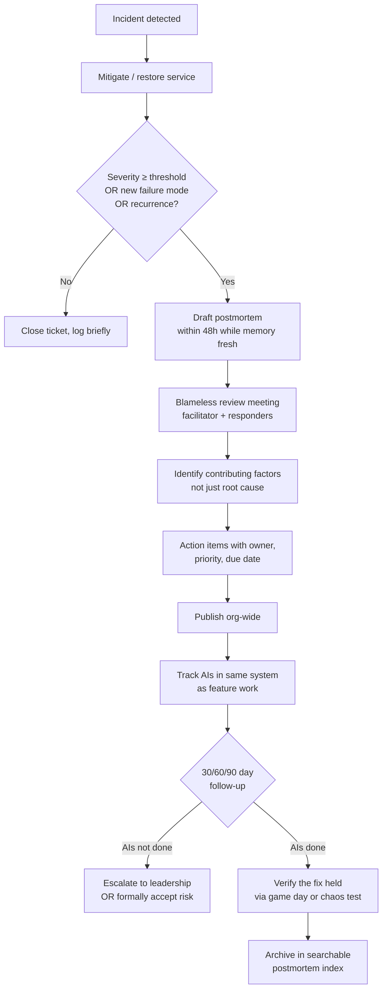
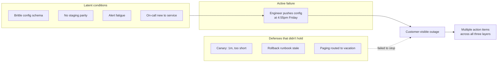

# Postmortems

## Why This Exists

**Problem.** Outages keep happening. Often the same outage. The team writes a doc, files a few JIRAs, and six months later the same null-pointer-on-config-reload takes prod down again — usually right after a Friday deploy. The action items in the original doc were marked "won't fix" or quietly closed. Nobody learned. The org's institutional memory is a graveyard of unread Confluence pages.

**Key insight.** A postmortem is **not a writeup of what happened**. It is a **structured intervention against organizational forgetting**, anchored by three contracts:
1. **Blameless** — humans operating under time pressure with imperfect information are not the bug; the system that let them make that decision is.
2. **Systemic** — five-whys is a starting heuristic, not a diagnosis. The root cause is almost never a single human action; it's the **interaction of contributing factors** in a sociotechnical system.
3. **Closed-loop** — every action item has an owner, a deadline, a priority commensurate with the failure's severity, and is tracked to completion in the same system as feature work. Otherwise it rots.

If you skip any of the three, you have **theatre**, not a postmortem. You'll feel productive and you will hit the same outage again.

**Reach for this when:**
- An incident exceeded a severity threshold (customer-visible impact, SLO burn, data loss, security event, regulatory implication).
- A near-miss had high potential blast radius (someone caught it before it shipped, but the gap was real).
- You repeated an incident pattern — recurrence itself is the trigger, even if individually small.
- A new failure mode you've never seen before, regardless of severity (learning > severity).
- An incident response itself was botched (slow detection, unclear ownership, communication failure) — postmortem the response, not just the outage.

**Don't reach for this when:**
- A trivial bug you can fix-and-move-on with a one-line PR description. Postmortems have overhead; budget them for what's worth the budget.
- An interpersonal conflict — that's a manager conversation, not a doc.
- Performance tuning that wasn't an incident — write a design doc instead.
- You can't make it blameless. If leadership wants names, abort and escalate; a blameful postmortem teaches "hide mistakes" and is **net negative**.

## Diagrams

### The postmortem lifecycle



### Sociotechnical causation: why "root cause" is misleading



A single "root cause" framing makes you fix only the trigger. The Swiss-cheese model (Reason, 1990) — adopted by SRE, aviation, and medicine — says **outages happen when holes in many defenses align**. Your action items must address conditions, triggers, AND defenses.

## The Postmortem Template

Use a template. Always. Templates are not bureaucracy; they're **forcing functions for the questions humans skip when stressed**. Below is a battle-tested template synthesizing Google SRE Book ch. 15, Etsy's Debriefing Facilitation Guide, and PagerDuty's open-source postmortem template.

```markdown
# Postmortem: <short, specific title — e.g. "Checkout 500s from expired TLS cert, 2026-04-12">

**Status:** Draft | In Review | Final
**Severity:** SEV-1 / SEV-2 / SEV-3   (define these org-wide; don't argue per-incident)
**Authors:** <names>
**Facilitator:** <neutral party, NOT the incident commander>
**Reviewers:** <on-call, IC, manager, adjacent-team rep>
**Date of incident:** YYYY-MM-DD HH:MM TZ
**Duration:** <detection-to-mitigation>, <full resolution if longer>

---

## TL;DR
Three sentences max. What broke, who was affected, why it happened, what you're doing about it. Most readers stop here. Make it count.

## Impact
- Customer impact: requests failed, users affected, revenue lost, SLO budget burned, contracts breached.
- Internal impact: deploys blocked, on-call hours, blast on adjacent services.
- Quantify wherever possible — "≈12,400 checkout attempts returned 500 between 14:02–14:47 UTC; estimated $X revenue impact; SLO error budget for checkout-availability burned 38% of monthly window."

## Timeline (UTC, monotonic)
| Time     | Event |
|----------|-------|
| 13:58    | Deploy v847 starts (config change to TLS bundle) |
| 14:02    | First 5xx alert fires; alert routed to on-call A |
| 14:03    | On-call A acks page; pulls dashboards |
| 14:09    | On-call A escalates to senior B; declares SEV-2 |
| 14:14    | Hypothesis: bad cert; verified in logs |
| 14:22    | Rollback initiated |
| 14:26    | Rollback completes; error rate returns to baseline |
| 14:47    | Backlog of retried requests drains |
| 15:30    | Status page updated to "resolved" |

Rules: include detection time, ack time, mitigation time, resolution time. **Include "what we thought was happening" alongside what was actually happening** — the divergence is itself a finding.

## What Happened (Narrative)
A few paragraphs in plain English. Lead reader through it like a story. Avoid blame language — write "the deploy was triggered" not "Alice triggered the deploy." Names appear in the timeline, not the narrative.

## Contributing Factors
Not "the root cause." A list. Each is a hole in the cheese.

1. **Latent: TLS bundle update path bypassed canary** — a special-case for cert renewals shipped without a canary stage. (Predates this incident by ~9 months.)
2. **Active: cert rotation script picked an expired intermediate** — bug in the bundle-builder, line X of repo Y.
3. **Defense gap: alert fired only on 5xx rate, not on TLS handshake errors** — handshake errors were visible 90s before the 5xx rate triggered.
4. **Defense gap: rollback runbook referenced a deprecated CLI flag** — added 2 minutes to mitigation.
5. **Process: deploy windows allow Friday-afternoon config pushes** — recurring contributing factor across multiple SEV-2s in last quarter.

## Five Whys (As a Starting Point, Not a Stopping Point)
> Why did checkout return 500s? → Backend couldn't reach payment service.
> Why? → TLS handshake to payment service failed.
> Why? → Server presented an expired intermediate cert.
> Why? → Cert bundle builder selected a stale intermediate from cache.
> Why? → Cache invalidation only triggers on leaf-cert rotation, not intermediate rotation.

**Note:** Five-whys gave us one cause chain. The contributing-factors list above captures the **other four** that mattered. Don't ship a postmortem that only has the five-whys ladder.

## What Went Well
Genuinely. List 3–5 things. This is not filler — naming what worked **reinforces those behaviors** and prevents over-correction.
- Detection-to-ack was 60 seconds.
- On-call escalated within 6 minutes — followed runbook.
- Customer-comms team posted to status page within 12 minutes.

## What Went Poorly
- Rollback took 13 minutes due to stale runbook.
- TLS handshake metric existed but wasn't on the primary dashboard.
- Two of the three responders had never paged on this service before.

## Where We Got Lucky
The asymmetric question that surfaces hidden risk. "If X had been slightly different, this would have been much worse."
- The expired intermediate had been valid until 14:00; if rotation had run an hour earlier, customers in EU peak would have been hit.
- The fallback payment provider was healthy; if we'd had a correlated incident there, we'd have had a hard outage.

## Action Items
| ID | Action | Type | Owner | Priority | Due | Tracking |
|----|--------|------|-------|----------|-----|----------|
| AI-1 | Add canary stage to cert-rotation deploy path | Prevent | @alice | P0 | 2026-04-26 | JIRA-1234 |
| AI-2 | Add TLS-handshake-error metric to primary dashboard + alert | Detect | @bob | P1 | 2026-05-03 | JIRA-1235 |
| AI-3 | Update rollback runbook; quarterly drill | Mitigate | @carol | P1 | 2026-05-10 | JIRA-1236 |
| AI-4 | Block Friday-afternoon deploys for SEV-1-eligible services | Process | @dave | P2 | 2026-05-17 | JIRA-1237 |
| AI-5 | Game-day exercise: simulate cert expiry in staging | Verify | @alice | P2 | 2026-06-01 | JIRA-1238 |

Action-item taxonomy (every postmortem should produce items in ≥3 of these):
- **Prevent** — stop the trigger from happening.
- **Detect** — catch it faster next time.
- **Mitigate** — recover faster once detected.
- **Verify** — prove the fix actually works (chaos test, game day).
- **Process** — change how decisions are made.

## Categorization (for trend analysis)
- **Failure category:** dependency-failure / config-change / capacity / code-defect / security / human-error-while-following-procedure / external
- **Trigger:** deploy / config push / traffic spike / dependency outage / data corruption / time-based (cert/cron) / unknown
- **Detection source:** alert / customer report / dashboard / chaos test / on-call browse
- **Service:** <service name>
- **Tags:** tls, cert-rotation, friday-deploy, runbook-stale

(These tags drive your quarterly trend report. Without categorization, you cannot see "60% of our SEV-2s last quarter were Friday deploys" — and you will not act on what you cannot see.)

## Related Incidents / Prior Art
- INC-2025-11-04: similar TLS rotation issue, different service, AIs partially completed.
- INC-2026-01-22: Friday-deploy SEV-2 in adjacent service.

## Supporting Data
- Dashboard snapshots
- Log queries (preserve them — Splunk URLs rot)
- Graphs of error rate, latency, saturation
- Slack / chat transcript excerpts (with consent)
```

## Facilitation: The Meeting

The doc is half the artifact. The meeting where you build it is the other half. Etsy's Debriefing Facilitation Guide is the canonical reference; the essentials:

```
Role: Facilitator
- NOT the incident commander, NOT the engineer who pushed the change.
- Neutral party. Often a peer SRE or engineer from an adjacent team.
- Job: extract the fullest picture, not assign cause.

Opening (2 min):
  "We're here to learn, not to assign blame. Anyone whose actions are
   discussed today acted reasonably given what they knew at the time.
   If a question feels like it's hunting for who-did-what, I'll redirect."

Walk the timeline (15-30 min):
  - Each responder narrates their slice from their POV.
  - Ask: "What did you think was happening?"  (mental model)
           "What were you looking at?"        (observed signals)
           "What did you consider doing and not do, and why?"  (counterfactual reasoning)
           "What surprised you?"              (gap between mental model and reality)

Anti-patterns to interrupt:
  - "X should have known..."  → "What information would have made that
                                  knowable in the moment?"
  - "We need to be more careful." → "What system change makes carefulness
                                      the default rather than a virtue?"
  - "Just add more tests."   → "What kind of test would have caught this?
                                 If we can't specify it, the AI is too vague."

Close (10 min):
  - Read the action items aloud. Confirm owners aloud. Confirm dates aloud.
  - Ask: "Is anything missing? Anything we softened that we shouldn't have?"
```

## Action Items That Don't Rot

This is where 90% of postmortems fail. The doc gets written. The AIs get filed. Nothing happens. Six months later, recurrence.

**The three rules:**

1. **Track AIs in the same system as feature work.** If features live in JIRA and AIs live in a Confluence checklist, AIs lose. Same system, same priorities, same standups. AIs without tickets don't exist.

2. **AI priority is a function of incident severity.** Codify this:

| Incident severity | AI priority floor | Default deadline |
|-------------------|-------------------|------------------|
| SEV-1 (full outage, data loss) | P0 — drops other work | 2 weeks |
| SEV-2 (partial outage, SLO burn) | P1 | 4 weeks |
| SEV-3 (degraded, no SLO breach) | P2 | 8 weeks |
| Near-miss | P2 (often P1 if blast radius was high) | case-by-case |

   You will be tempted to mark every AI P3. Resist. P3 means "won't happen."

3. **30/60/90-day follow-ups are mandatory.** A reliability review meeting (or equivalent) checks every open AI from the last quarter. Two outcomes only:
   - **Done** — verified, ideally by chaos test or game day, not just "merged."
   - **Formally accept the risk** — name a leader who signs off, in writing, with a timestamp. "We are choosing not to do this because Y." This is allowed. **Silent rot is not.**

### Sample tracking schema (SQL)

```sql
-- Postmortems table — one row per incident
CREATE TABLE postmortems (
    id              TEXT PRIMARY KEY,        -- e.g. PM-2026-04-12-checkout
    incident_date   DATE NOT NULL,
    severity        TEXT NOT NULL CHECK (severity IN ('SEV-1','SEV-2','SEV-3','near-miss')),
    service         TEXT NOT NULL,
    failure_category TEXT NOT NULL,          -- dependency / config / capacity / code / security / process
    trigger_type    TEXT NOT NULL,           -- deploy / config-push / traffic / dependency / time-based
    detection_source TEXT NOT NULL,          -- alert / customer / dashboard / chaos
    duration_minutes INT NOT NULL,
    customer_impact_users BIGINT,
    slo_budget_burned_pct NUMERIC,
    doc_url         TEXT NOT NULL,
    tags            TEXT[]
);

-- Action items — denormalized so we can query AI health independently
CREATE TABLE postmortem_action_items (
    id              TEXT PRIMARY KEY,
    postmortem_id   TEXT NOT NULL REFERENCES postmortems(id),
    description     TEXT NOT NULL,
    type            TEXT NOT NULL CHECK (type IN ('prevent','detect','mitigate','verify','process')),
    owner           TEXT NOT NULL,
    priority        TEXT NOT NULL CHECK (priority IN ('P0','P1','P2','P3')),
    due_date        DATE NOT NULL,
    status          TEXT NOT NULL CHECK (status IN ('open','in_progress','done','accepted_risk','dropped')),
    closed_date     DATE,
    tracking_ticket TEXT NOT NULL,            -- the JIRA / GitHub issue
    risk_acceptance_signoff TEXT               -- name + date when status='accepted_risk'
);

-- The query that drives the quarterly review:
SELECT
    pm.severity,
    pm.failure_category,
    COUNT(*) AS incident_count,
    SUM(pm.duration_minutes) AS total_downtime_min,
    AVG(pm.duration_minutes) AS avg_mttr_min
FROM postmortems pm
WHERE pm.incident_date >= NOW() - INTERVAL '90 days'
GROUP BY pm.severity, pm.failure_category
ORDER BY incident_count DESC;

-- Find rotting action items:
SELECT
    ai.id, ai.description, ai.owner, ai.priority,
    ai.due_date, NOW()::date - ai.due_date AS days_overdue,
    pm.severity, pm.id AS postmortem
FROM postmortem_action_items ai
JOIN postmortems pm ON pm.id = ai.postmortem_id
WHERE ai.status IN ('open','in_progress')
  AND ai.due_date < NOW()::date
ORDER BY pm.severity, days_overdue DESC;
```

## Five Whys vs Systemic Causation

Five-whys (Toyota Production System, Taiichi Ohno) is the most popular tool and the most over-applied. Use it as a **starting heuristic**, not the deliverable. The failure modes:

- **Single-thread bias.** Five-whys gives you one chain. Real incidents are graphs of contributing factors. Always do five-whys **once per contributing factor**, not once per incident.
- **Stops at the human.** Naive five-whys ladders to "...because the engineer made a mistake" and stops. Wrong. Why was the system arranged so the mistake was possible / undetected / unrecoverable? Three more whys at minimum.
- **Confirmation bias.** Once you have a candidate chain, stop. Don't search for disconfirming evidence. **Always** ask: "What other explanations are consistent with the data?" Force at least two competing hypotheses before settling.

The systemic alternative is the **Swiss-cheese model** (James Reason, *Human Error*, 1990) plus **STAMP / CAST** (Nancy Leveson, *Engineering a Safer World*, 2011) for serious incidents. The framing:

- **Latent conditions** — design or process choices that made the incident possible (sometimes years earlier).
- **Active failures** — the trigger that aligned the holes.
- **Defenses** — what was supposed to stop it, and what didn't.

Your contributing-factors list should have items in all three categories. If they're all in "active failures," your analysis is shallow.

## Categorization for Trend Analysis

The single most under-valued postmortem practice. **Categorize every postmortem so you can see patterns at the quarterly level.**

Minimum tags per postmortem:

```yaml
failure_category: # exactly one
  - dependency_failure   # downstream service / DB / network
  - config_change        # deploy or runtime config
  - capacity             # OOM, CPU, connection pool, disk
  - code_defect          # bug introduced or latent
  - security             # auth, authz, vuln, leak
  - data                 # corruption, migration, schema
  - human_procedure      # human followed wrong/ambiguous procedure
  - external             # cloud provider, ISP, third-party

trigger:                 # what kicked it off
  - deploy
  - config_push
  - traffic_spike
  - dependency_outage
  - time_based           # cert expiry, cron, leap second
  - data_event           # bad input, schema drift
  - unknown

detection_source:
  - automated_alert
  - customer_report
  - dashboard_browse
  - chaos_or_gameday
  - external_party

services_impacted: [...]
duration_buckets: # for histogramming
  - <5min | 5-15 | 15-60 | 1-4h | 4-24h | >24h
```

After 6–12 incidents, run the histograms. You will see things like:
- "70% of our SEV-2s in Q2 were config-push, detected by customer report." → invest in **canary + faster detection**, not in more code review.
- "All four data-corruption incidents this year happened during off-hours migrations." → invest in **migration tooling**, not in more eyes-on.
- "TLS-related incidents recurred in three different services." → it's a **platform** problem, not a service problem.

You cannot make these calls without categorization. Tag discipline is the difference between learning and theatre.

## Trade-offs

| Benefit | Cost |
|---------|------|
| Blameless framing surfaces contributing factors humans would otherwise hide | Requires leadership to genuinely not punish on-call decisions; one revenge-firing kills the practice for years |
| Templates produce comparable, searchable artifacts | Templates feel like overhead; teams will resist; you need an exec mandate or strong SRE culture |
| Action-item tracking with priority floors prevents recurrence | Real engineering hours diverted from features; budget for it explicitly (10–20% of SRE time is typical) |
| Systemic / Swiss-cheese analysis catches latent conditions | Slower than five-whys; harder to write; requires facilitator skill |
| Categorization enables trend analysis and platform investment | Tag drift over time; needs a curator and a quarterly review |
| Public postmortems (within the company) cross-pollinate learning | Some orgs leak them externally; you'll need to maintain an internal-only repo separately from anything public |
| Game days / chaos testing verify fixes held | Real money; real risk of *causing* an incident; needs careful scoping |
| Severity-tied AI priority forces real prioritization | Pushes back on quarterly feature plans; product managers will object |

## Common Pitfalls

- **The blameless theatre.** Doc says "blameless" but the meeting included "Alice's mistake was..." three times. People notice. Once they notice, they stop volunteering information. From then on, postmortems return only the surface story.
- **The "human error" stop.** Root cause: "engineer ran the wrong command." Action item: "be more careful." This is not a postmortem. It is a confession written under duress. Three more whys.
- **The five-whys monoculture.** Single causal chain, no contributing factors, no defenses. Ships in 30 minutes, prevents nothing.
- **The action-item graveyard.** AIs filed in a Confluence checklist that nobody reads. Six months later: "we already had this exact incident in March."
- **Postmortems only for SEV-1.** SEV-2s and near-misses are where you learn cheaply. SEV-1s are where you learn expensively. Skip the cheap learning at your peril.
- **No follow-up loop.** No 30/60/90 review means open AIs accumulate forever, signal-to-noise of the AI tracker rots, then everyone gives up. Schedule the review on the calendar, not "when we have time."
- **Severity inflation.** Everything becomes SEV-2 to justify a postmortem. Severity loses meaning. Define SEVs precisely and hold the line.
- **Severity deflation.** Customer-impacting incident downgraded so it doesn't trigger paperwork. Same problem in reverse — and worse, because the public-impact metrics are now wrong.
- **The hero narrative.** Postmortem celebrates the on-call who saved the day. Feels good; teaches "we depend on heroes." The system that *required* a hero is the actual finding.
- **Over-engineering the template.** Forty-section template with mandatory CSAT score and stakeholder-impact matrix. Nobody fills it out. Use the template above; trim before you grow.
- **Confidentiality fences too high.** Postmortems locked to the team that owned the incident. Adjacent teams hit the same failure mode. Default-open within the org (with PII redacted).
- **Chaos engineering as a substitute for postmortems.** They're complements, not substitutes. Game days verify fixes; postmortems generate the "fix what" list.
- **Postmortems for things that aren't incidents.** "We need to postmortem this design decision" — no, you need a retrospective or a design review. Different tools.

## Decision Table

| Situation | Use this | Not this |
|-----------|----------|----------|
| Customer-visible outage, SEV-1 or SEV-2 | Full postmortem with facilitator | Slack writeup |
| Near-miss with high blast radius | Full postmortem, P1 AIs | Skip ("nothing happened") |
| Repeat of a known failure mode | Full postmortem; root cause is "we didn't fix this last time" | Append to old PM |
| Trivial bug, one-PR fix, no customer impact | Bug ticket | Postmortem |
| Recurring small issue across many services | Trend-analysis review (quarterly), not per-incident PM | Many tiny PMs |
| Botched incident response (slow, confused, miscommunicated) | Postmortem the response, separately or jointly | Pretend it was fine |
| Major design failure (no incident yet) | Design review / RFC retrospective | Postmortem |
| Interpersonal / team dysfunction surfaced during incident | Manager 1:1s + team retrospective | Postmortem (do not name in PM) |
| Security incident with regulatory implications | Postmortem + separate security incident process; legal in the loop | Public postmortem |
| Vendor / cloud-provider outage | Postmortem of *your* response and *your* defenses; do not write the vendor's PM | "Not our fault" memo |

| Diagnostic technique | Reach for it when | Avoid when |
|----------------------|-------------------|-----------|
| Five Whys | Quick triage; single obvious cause chain; SEV-3 | SEV-1; novel failure mode; multiple contributing systems |
| Swiss Cheese / Reason | Multi-defense failure; mature SRE org | Lightweight incidents; no time |
| STAMP / CAST | High-stakes (safety, financial, regulatory) | Routine outages; team lacks training |
| Fishbone (Ishikawa) | Brainstorming contributing factors with mixed-discipline group | Solo writeup |
| Timeline-only narrative | Communication artifact for execs | The actual analysis (it isn't) |

## References

Primary sources, ordered by usefulness for someone implementing this:

- Beyer, Jones, Petoff, Murphy — *Site Reliability Engineering* (Google, O'Reilly 2016) — **ch. 15 "Postmortem Culture: Learning from Failure"** — https://sre.google/sre-book/postmortem-culture/
- Beyer et al. — *The Site Reliability Workbook* — **ch. 10 "Postmortems"** with worked examples — https://sre.google/workbook/postmortem-culture/
- Etsy Engineering — *Debriefing Facilitation Guide* (John Allspaw, Morgan Evans, Daniel Schauenberg) — https://github.com/etsy/DebriefingFacilitationGuide
- John Allspaw — *Blameless PostMortems and a Just Culture* (Etsy Code as Craft, 2012) — https://www.etsy.com/codeascraft/blameless-postmortems/
- John Allspaw — *The Infinite How: How (instead of "Why") for Incident Reviews* — https://www.adaptivecapacitylabs.com/blog/2019/05/12/the-infinite-how-how-instead-of-why-for-incident-reviews/
- Nancy Leveson — *Engineering a Safer World: Systems Thinking Applied to Safety* (MIT Press, 2011) — STAMP / CAST methodology, free PDF — https://mitpress.mit.edu/9780262533690/engineering-a-safer-world/
- James Reason — *Human Error* (Cambridge University Press, 1990) — Swiss-cheese model. (No free URL; cite the book.)
- Sidney Dekker — *The Field Guide to Understanding 'Human Error'* (3rd ed., CRC Press, 2014) — old-view vs new-view of human error. (No free URL; cite the book.)
- Richard Cook — *How Complex Systems Fail* (1998) — 18-point essay; foundational reading — https://how.complexsystems.fail/
- PagerDuty — *Postmortem template & process* (open source) — https://postmortems.pagerduty.com/
- Google — *Building Secure and Reliable Systems* — ch. on incident response and postmortems — https://sre.google/books/building-secure-reliable-systems/
- AWS Builders' Library — *Avoiding insurmountable queue backlogs*, *Workload isolation using shuffle sharding*, *Going faster with continuous delivery* — incident-prevention companion reading — https://aws.amazon.com/builders-library/
- Will Gallego — *Blameless: When Things Go Wrong* (talk, 2018) — https://willgallego.com/2018/01/16/blameless-when-things-go-wrong/
- Lorin Hochstein — Resilience Engineering reading list — https://github.com/lorin/resilience-engineering
- VOID (Verica Open Incident Database) — public corpus of postmortems for pattern study — https://www.thevoid.community/

## See Also

- `../slo-sli-sla/` — severity thresholds and AI-priority floors hang off your SLO definitions
- `../incident-response/` — what happens *during* the page; postmortem starts after mitigation
- `../chaos-engineering/` — verification AIs land here ("game-day this scenario quarterly")
- `../capacity-planning/` — when failure_category=capacity recurs in trend analysis
- `../disaster-recovery/` — for SEV-1 data-loss postmortems with cross-region implications
