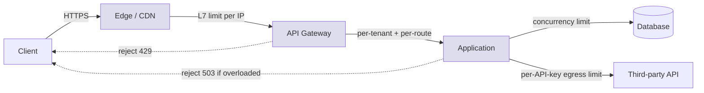
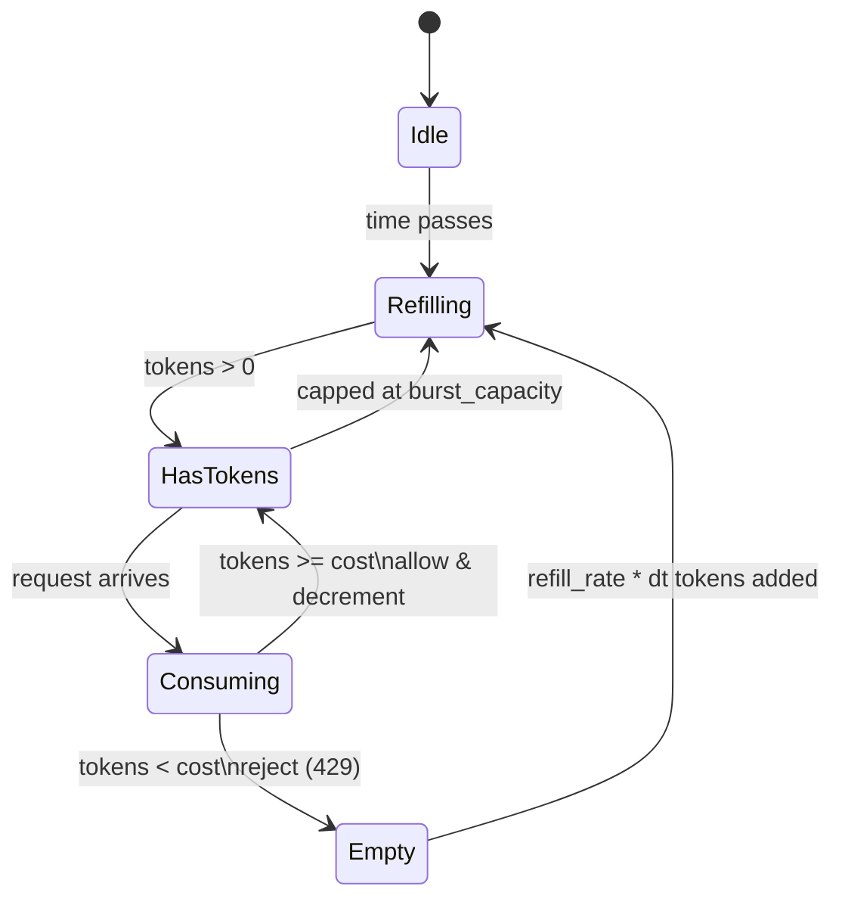
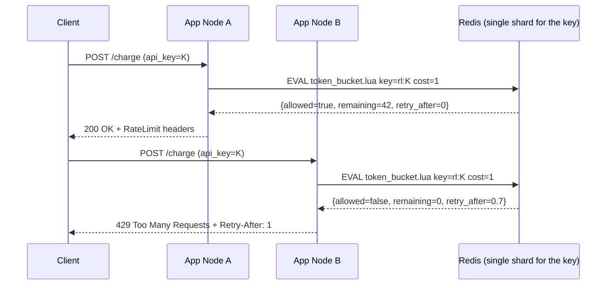

# Rate Limiting

## Why This Exists

**Problem.** Every shared service has a finite capacity (CPU, DB connections, downstream API quota). When demand exceeds it, latency climbs, tail latencies explode, and failures cascade. A *small* number of misbehaving callers — a buggy retry loop, a scraping bot, a single tenant doing a bulk import — can degrade service for everyone. Without rate limiting, your only options are over-provisioning (expensive) or letting the system fall over (worse).

**Key insight.** Rate limiting is a **load-shedding** primitive, not a billing primitive. Its job is to keep the system *responsive* under overload by rejecting some requests *fast and cheaply* so the rest can succeed. Choice of algorithm is a trade between **smoothness** (how bursty traffic can be), **memory cost** (state per key), and **fairness** (how precisely you can enforce a quota at a window boundary). The cost of a *wrong* rejection (429) is almost always lower than the cost of a degraded *successful* response, so when in doubt, shed earlier.

**Reach for this when:**
- A single client/tenant can monopolize a shared resource (DB, third-party API quota, expensive compute).
- You serve untrusted or semi-trusted callers (public APIs, webhooks, login endpoints).
- Retries from clients can amplify load during partial outages (the *retry storm*).
- You need fairness across tenants with different SLAs (free vs paid, internal vs external).
- You're integrating a downstream API with a hard quota and need to shape egress.

**Don't reach for this when:**
- The bottleneck is a single hot row / lock — rate limiting won't fix lock contention; you need sharding, batching, or async writes.
- You need *admission control* with priority and queueing under sustained overload — see `../load-shedding/` and Google SRE Workbook ch. 11. Rate limits are coarse; load shedders are adaptive.
- You're trying to enforce *correctness* (e.g. one charge per order). Use idempotency keys and locks; rate limits are best-effort and racy at the boundary.
- The traffic is internal RPC between services you control — prefer **concurrency limits** (semaphores, bounded thread pools) which adapt to actual capacity, not a wall-clock rate.

## Diagrams

### Where rate limiting sits in the request path



Each tier rejects what *its* downstream cannot absorb. **Cheap rejections happen as far left as possible.**

### Token bucket: the canonical algorithm



Two parameters: **refill rate** (steady-state allowed throughput) and **bucket size / burst** (how much short-term burstiness you tolerate). Allowing a burst of `B` over a refill rate `R` means the worst-case load for any window of length `t` is `B + R*t`.

### Distributed limiter with Redis as authority



The script must be **atomic** (Lua / `MULTI`+`WATCH` / `FCALL`). If Redis is down, fail *open* (allow) for soft limits and *closed* (deny) for security-critical limits like login.

---

## The Five Algorithms

### 1. Fixed window counter

The simplest. Bucket by wall-clock window (e.g. minute), increment a counter, reject when over `N`.

```python
# Pseudocode — DO NOT use as-is; has the boundary-burst bug shown below.
def allow(key: str, limit: int, window_s: int) -> bool:
    bucket = f"rl:{key}:{int(time.time()) // window_s}"
    n = redis.incr(bucket)
    if n == 1:
        redis.expire(bucket, window_s)
    return n <= limit
```

**Failure mode (war story).** With `limit=100/min`, a client can send **200 requests in 2 seconds** by firing 100 at `12:00:59.5` and 100 more at `12:01:00.0`. The window resets and the counter starts over. You promised 100/min; you got 200 inside 1 second. This boundary-burst is why fixed-window is a footgun for anything load-bearing.

**When to use anyway:** internal dashboards, coarse abuse counters, anything where 2x burst at the boundary doesn't matter. Memory cost: 1 counter per key per window. Cheap.

### 2. Sliding window log

Store a timestamped log of every request; on each request, drop entries older than the window and count what's left.

```python
# Sliding window log via Redis sorted set. Accurate but O(N) memory per key.
def allow(key: str, limit: int, window_s: int, now_ms: int) -> bool:
    cutoff = now_ms - window_s * 1000
    pipe = redis.pipeline()
    pipe.zremrangebyscore(key, 0, cutoff)         # drop expired
    pipe.zadd(key, {f"{now_ms}-{uuid4()}": now_ms})
    pipe.zcard(key)
    pipe.expire(key, window_s + 1)
    _, _, count, _ = pipe.execute()
    return count <= limit
```

**Properties.** Exact. No boundary burst. **But:** O(N) memory per key where N is the limit (a `1000/min` limiter on a hot tenant stores 1000 timestamps in Redis). For high-volume APIs this gets expensive fast. Use when accuracy matters more than memory: payment APIs, security-critical endpoints.

### 3. Sliding window counter (approximate)

Hybrid: keep counters for the current and previous fixed window; weight the previous window by how much of it falls inside the current rolling window.

```python
def allow(key: str, limit: int, window_s: int, now: float) -> bool:
    cur_window = int(now) // window_s
    prev_window = cur_window - 1
    elapsed_in_cur = (now % window_s) / window_s   # 0.0 .. 1.0

    cur = int(redis.get(f"rl:{key}:{cur_window}") or 0)
    prev = int(redis.get(f"rl:{key}:{prev_window}") or 0)
    estimate = prev * (1 - elapsed_in_cur) + cur

    if estimate >= limit:
        return False
    redis.incr(f"rl:{key}:{cur_window}")
    redis.expire(f"rl:{key}:{cur_window}", 2 * window_s)
    return True
```

**Properties.** Constant memory (2 counters per key). Smooths the boundary burst. Slight error (assumes traffic in the previous window was uniform), bounded by the burst rate. **This is what Cloudflare uses at edge** — see references. Almost always the right choice for HTTP APIs.

### 4. Token bucket

Token bucket allows controlled bursts up to `capacity`, then enforces a steady refill rate. Stripe's published reference implementation is a token bucket; so are most cloud SDK throttlers (AWS SDK, GCP).

```lua
-- token_bucket.lua  — atomic Redis script.
-- KEYS[1] = bucket key
-- ARGV[1] = refill_rate (tokens/sec), ARGV[2] = capacity,
-- ARGV[3] = now_ms, ARGV[4] = cost
local key = KEYS[1]
local rate = tonumber(ARGV[1])
local cap = tonumber(ARGV[2])
local now = tonumber(ARGV[3])
local cost = tonumber(ARGV[4])

local data = redis.call('HMGET', key, 'tokens', 'ts')
local tokens = tonumber(data[1]) or cap
local ts = tonumber(data[2]) or now

-- Refill based on elapsed time. Crucially, this is lazy — we don't run a
-- background job, we compute on read. Cheaper and avoids clock skew between
-- a refiller process and the limit check.
local delta = math.max(0, now - ts) / 1000.0
tokens = math.min(cap, tokens + delta * rate)

local allowed = 0
local retry_after_ms = 0
if tokens >= cost then
  tokens = tokens - cost
  allowed = 1
else
  retry_after_ms = math.ceil(((cost - tokens) / rate) * 1000)
end

redis.call('HMSET', key, 'tokens', tokens, 'ts', now)
-- TTL slightly longer than time to refill from empty, so idle keys evict.
redis.call('PEXPIRE', key, math.ceil((cap / rate) * 1000) + 1000)

return {allowed, tokens, retry_after_ms}
```

```python
# Python caller. Note the cost parameter — different endpoints can charge
# different amounts (a "search" might cost 10 tokens, a "ping" 1).
class TokenBucket:
    def __init__(self, redis_client, script_sha):
        self.r = redis_client
        self.sha = script_sha

    def check(self, key: str, rate: float, capacity: int, cost: int = 1):
        now_ms = int(time.time() * 1000)
        allowed, remaining, retry_ms = self.r.evalsha(
            self.sha, 1, f"rl:tb:{key}", rate, capacity, now_ms, cost,
        )
        return RateLimitResult(
            allowed=bool(allowed),
            remaining=int(remaining),
            retry_after_s=retry_ms / 1000.0,
        )
```

**Properties.** Allows bursts up to `capacity`, sustains `rate`. Constant memory per key. Easy to reason about. The dominant choice for general-purpose API rate limiting.

### 5. Leaky bucket (queue formulation)

Imagine a queue with bounded capacity that drains at a fixed rate. If the queue is full, requests are *dropped* (not queued). If it has room, they're *enqueued* and processed at the leak rate.

Two practical variants:
- **Leaky bucket as meter** (mathematically equivalent to token bucket): no queue, just check that arrival rate ≤ leak rate plus slack.
- **Leaky bucket as queue**: actually buffer requests and serve them at a fixed rate. This *smooths* output but adds latency.

Use the queue variant when the downstream **cannot tolerate bursts** (hard external quota, fragile DB). Use token bucket when latency matters and bursts are fine.

```go
// Go example: leaky bucket as queue, smoothing egress to a third-party API.
type LeakyBucket struct {
    mu       sync.Mutex
    queue    chan func()
    leakEvery time.Duration
}

func NewLeakyBucket(capacity int, ratePerSec float64) *LeakyBucket {
    lb := &LeakyBucket{
        queue:     make(chan func(), capacity),
        leakEvery: time.Duration(float64(time.Second) / ratePerSec),
    }
    go lb.drain()
    return lb
}

func (lb *LeakyBucket) drain() {
    t := time.NewTicker(lb.leakEvery)
    defer t.Stop()
    for range t.C {
        select {
        case fn := <-lb.queue:
            fn()
        default:
            // bucket empty, idle tick
        }
    }
}

// Submit returns false immediately if the queue is full ("bucket overflow").
// Caller surfaces 429 to the client.
func (lb *LeakyBucket) Submit(fn func()) bool {
    select {
    case lb.queue <- fn:
        return true
    default:
        return false
    }
}
```

---

## Centralized vs Distributed Enforcement

### Single-node (in-process)

If every request for a given key lands on the same node (sticky sessions, consistent hashing at the LB), an in-process limiter is correct, fast, and survives Redis outages.

```python
# Per-process token bucket with a lock-free fast path.
# Use when traffic is partitioned by a routing key upstream.
from threading import Lock

class LocalTokenBucket:
    __slots__ = ("rate", "cap", "tokens", "ts", "lock")
    def __init__(self, rate: float, cap: float):
        self.rate, self.cap = rate, cap
        self.tokens, self.ts = cap, time.monotonic()
        self.lock = Lock()

    def allow(self, cost: float = 1.0) -> bool:
        with self.lock:
            now = time.monotonic()
            self.tokens = min(self.cap, self.tokens + (now - self.ts) * self.rate)
            self.ts = now
            if self.tokens >= cost:
                self.tokens -= cost
                return True
            return False
```

### Distributed across N nodes — three options

**Option A: Centralized authority (Redis + Lua).** Every node calls the same Redis key. Accurate, simple, **but** every request adds an RTT to Redis (~0.5–1 ms in-region) and Redis becomes a tier-1 dependency. Use for paid-tier limits, billing-relevant counters, and security-critical limits where accuracy matters.

**Option B: Local limit with global budget (per-node share).** If you have `N` nodes and a global limit `L`, give each node `L/N`. **Fails badly when traffic is unbalanced** — a hot key hashing to one node only gets `L/N`, but that node sees all the traffic. Avoid unless you have load-balancer affinity per limited key.

**Option C: Eventually consistent, gossip-based.** Nodes track local counts and asynchronously sync via gossip / shared cache. Allows brief over-shoots but no per-request RTT. Used by some CDNs at edge scale. Complex; reach for it only when you've outgrown option A.

```python
# Sketch of "Option A" wiring with circuit-breaker fallback.
class DistributedLimiter:
    def __init__(self, redis_client, fallback: LocalTokenBucket, mode="fail-open"):
        self.tb = TokenBucket(redis_client, _SHA)
        self.fallback = fallback
        self.mode = mode
        self.breaker = CircuitBreaker(threshold=10, cooldown=5.0)

    def allow(self, key: str, rate: float, cap: int, cost: int = 1) -> bool:
        if self.breaker.is_open():
            # Redis is unhealthy. Decide carefully:
            #   - Public API: fail open — better to over-serve than reject all.
            #   - Login / payment: fail closed — better to reject than allow abuse.
            return self.fallback.allow(cost) if self.mode == "fail-open" else False

        try:
            return self.tb.check(key, rate, cap, cost).allowed
        except RedisError:
            self.breaker.record_failure()
            return self.fallback.allow(cost) if self.mode == "fail-open" else False
```

### Redis Cluster note

If the rate-limit key space is sharded across a Redis Cluster, **each key still lives on a single shard** — that's fine, the Lua script remains atomic for that shard. Just don't write a script that touches multiple keys on different slots; use `{hash-tag}` notation to co-locate related keys, or run the script with `KEYS[1]` only.

---

## Policy: Per-User vs Per-Tenant vs Per-Route

You almost always need **multiple limits stacked**. A single limit is brittle: per-IP misses the abuser behind a NAT, per-user misses the bot army with 10k stolen tokens, per-route misses the tenant hammering one expensive endpoint.

| Dimension | What it protects against | Typical scope |
|---|---|---|
| Per-IP | Anonymous abuse, brute force on `/login` | Coarse, at edge |
| Per-API-key / user | Buggy client, lost credential | Per identity, in app |
| Per-tenant (org) | Noisy neighbor across users in one customer | Per billing entity |
| Per-route + per-tenant | One expensive endpoint melting the cluster | Fine-grained, in app |
| Global (capacity) | Total system overload | Datacenter / region |

```python
# Stacked limits — first failing limit decides. Order matters: cheap checks first.
LIMITS = [
    ("ip",           lambda req: f"ip:{req.ip}",                   1000, 60),
    ("user",         lambda req: f"u:{req.user_id}",                300, 60),
    ("tenant",       lambda req: f"t:{req.tenant_id}",             5000, 60),
    ("tenant+route", lambda req: f"t:{req.tenant_id}:r:{req.route}", 50,  1),
]

def check_all(req):
    for name, key_fn, limit, window in LIMITS:
        ok, retry = limiter.allow(key_fn(req), rate=limit/window, cap=limit)
        if not ok:
            return Reject(scope=name, retry_after=retry)
    return Allow()
```

**Cost weighting.** Not all requests are equal. A list endpoint that hits five DB shards is "worth" 5; a cache-served static profile is worth 0. Use a `cost` parameter on token bucket. The AWS SDK uses this idea for adaptive client-side throttling.

---

## 429 vs 503 — The Distinction That Matters

These look similar; they mean very different things to a well-behaved client and to your post-mortem.

| Code | Semantic | When |
|---|---|---|
| **429 Too Many Requests** | "You specifically exceeded a known limit." | Rate-limit policy, quota exceeded. Client should back off or pay for more. |
| **503 Service Unavailable** | "We can't serve right now (capacity / dependency)." | System overload, dependency outage, deploy. Should be retried with backoff. |
| 504 Gateway Timeout | Upstream took too long. | Set lower than client's read timeout. |
| 408 Request Timeout | Client took too long to send. | Slow-loris protection. |

**The cardinal rule:** if you return 429, the client knows *its* behavior caused the rejection. If you return 503, the client knows *the system* is unhealthy. Conflating these makes incident triage miserable — you'll see "elevated 429s" in graphs and not know whether you have a noisy client or a melting backend.

**Headers to set on 429** (RFC 6585, RFC 9239 draft-ietf-httpapi-ratelimit-headers):

```
HTTP/1.1 429 Too Many Requests
Retry-After: 17
RateLimit-Limit: 1000
RateLimit-Remaining: 0
RateLimit-Reset: 17
RateLimit-Policy: 1000;w=60
Content-Type: application/problem+json

{"type":"https://example.com/errors/rate-limit",
 "title":"Too Many Requests",
 "status":429,
 "scope":"tenant+route",
 "detail":"Limit of 50 req/s on /v1/charges exceeded."}
```

Use **`Retry-After`** with **jitter on the client side** — never have N rejected clients all retry at exactly `Retry-After` seconds; that's a synchronized retry storm. The header tells the client the *minimum* wait; it should add `[0, retry_after)` jitter.

---

## Trade-offs

| Benefit | Cost |
|---|---|
| Smooths bursty traffic so backends see a manageable load | False positives reject legitimate users — need observability + clear 429 docs |
| Cheap to reject at the edge (microseconds, no DB hit) | Wrong tier of enforcement (only at app, not edge) leaks attack traffic deeper |
| Per-tenant fairness prevents noisy-neighbor degradation | Multi-dimensional policies (tenant × route × method) explode in complexity |
| Token bucket allows bursts without abandoning steady-rate enforcement | Burst capacity tuning is empirical — wrong value either rejects normal users or lets DBs melt |
| Centralized Redis enforcement is exact and auditable | Adds a tier-1 dependency: Redis outage now affects every request unless fail-open is wired |
| Sliding window counter is constant memory and accurate enough | Approximation can over- or under-count by up to one window's worth at boundary |
| Fixed window is trivial to implement and explain | Boundary burst lets clients send 2× the limit at window edges |
| Concurrency limits adapt to real capacity | Harder to communicate to clients ("how much can I send?") than a wall-clock rate |
| 429 + `Retry-After` lets well-behaved clients self-regulate | Misbehaving clients ignore headers — still need IP-level shedding upstream |

---

## Common Pitfalls

- **Boundary burst on fixed window.** Already covered. Fix: switch to sliding window counter or token bucket for any limit ≥ "important."
- **Clock skew between nodes.** All time-based algorithms assume monotonic, agreed-upon time. Centralize timekeeping in Redis (`redis.call('TIME')` inside Lua) rather than passing client-side `now()`. Stripe's blog explicitly warns about this.
- **Synchronized retries → thundering herd.** Clients all retrying at exactly `Retry-After`. Always have clients add jitter. See AWS Architecture Blog "Exponential Backoff and Jitter" — the "full jitter" variant is usually best.
- **Counting failed requests.** Should a 500 from your backend count against the user's quota? Almost always **no** — you penalize users for your own outages. Refund the token on 5xx (but not on 4xx caused by them).
- **Limiter is the new SPOF.** A buggy or slow limiter can become the source of latency spikes. Set strict timeouts (≤5 ms) on Redis calls, with a fallback. Monitor p99 of the limiter itself. If your limiter adds 50 ms of p99 you've hurt the system more than you've helped.
- **Fail-closed where you should fail-open.** A Redis blip rejecting all traffic during a retail spike is a self-inflicted outage. Default to fail-open for soft limits. Only fail-closed for security-critical paths (auth, signup, payment idempotency).
- **One global key for everything.** `INCR rl:global` is a hot key that pegs a single Redis shard. Shard limits by a high-cardinality dimension (tenant, user, IP) so traffic spreads across the cluster.
- **Mismatched scopes in stacked limits.** A per-IP limit lower than per-user limit means logged-in users still hit the IP cap behind corporate NAT. Stack with care; whitelist trusted networks where appropriate.
- **Forgetting WebSocket / streaming.** WebSocket is one HTTP upgrade then a long-lived connection. A per-request rate limit doesn't apply. You need per-message or per-connection limits, plus connection caps.
- **Not exposing limits in headers.** If the client can't see how close to the limit it is, it can't behave. **Always** emit `RateLimit-*` headers, even on 200 responses. Stripe, GitHub, and Discord all do.
- **Counting bytes vs requests.** A `1000 req/s` limit is meaningless if requests carry 100 MB bodies. For upload/large-payload APIs, also limit bytes/sec.
- **Per-method confusion.** A `GET` and a `POST` at the same path can have very different costs. Limit on `(tenant, route, method)` for expensive endpoints.

---

## Decision Table

| Situation | Use | Why |
|---|---|---|
| Public REST API, mixed traffic, want bursts | **Token bucket** (Redis + Lua) | Standard. Stripe uses this. Bursts are ergonomic. |
| Hard external quota (e.g. SES, Stripe, OpenAI) you must not exceed | **Leaky bucket as queue** | Smooths egress. Latency cost is acceptable for compliance with quota. |
| Edge / CDN limit per IP, millions of distinct keys, memory matters | **Sliding window counter** | Constant memory, accurate enough. What Cloudflare ships. |
| Audit-critical limit (compliance: ≤ N login attempts in 5 min) | **Sliding window log** | Exact. Memory is fine because volumes are low. |
| Internal RPC between trusted services | **Concurrency limit** (semaphore) | Adapts to actual capacity; no need for wall-clock rate. |
| Defending login from brute force | **Sliding window log** + IP+account stacked, fail-closed | Accuracy + security; Redis outage should not let attacks through. |
| Protecting backend from retry storms during outage | **Token bucket per client** + `Retry-After` with jitter | Self-regulating. Combine with circuit breaker. |
| Want global fairness across tenants | **Token bucket per tenant** stacked with global cap | Per-tenant prevents noisy neighbor; global cap protects total capacity. |
| Have one node per partition (sharded) | **In-process token bucket** | Skip Redis. Faster, simpler, still correct. |
| Very high RPS (>100k/s per key) and Redis is bottleneck | **Local limit + async global reconciliation** | Trade exactness for throughput. Document the slop. |
| Don't know your limits yet | **Start with logging-only mode** | Emit "would have been limited" metrics for 1 week, tune, then enforce. |

---

## Operational Practices

**Roll out in shadow mode.** First deploy emits "would-have-rejected" metrics without rejecting anything. Watch for a week. Tune limits to leave normal users untouched at p99.5. Then flip to enforce.

**Two metrics that matter most:**
- `rate_limit_rejections_total{scope, route, tenant}` — should be near zero for trusted tenants. A spike is either a bad actor or your limits are too tight.
- `rate_limit_check_duration_seconds` — your limiter's own latency. p99 should be sub-millisecond for in-process, ≤5 ms for Redis-backed. If this rises, you've created a hot key.

**Document limits publicly.** GitHub, Stripe, Twilio all publish their limits. Hidden limits frustrate developers and generate support load. If you want different limits for paid tiers, document the tiers.

**Allow override for ops.** A `X-RateLimit-Bypass-Token` header gated by mTLS / a signed JWT is invaluable during incidents and load tests. Audit its use. (Don't put a static secret here. Use short-lived signed tokens.)

**Rate limit your rate-limit metrics.** Yes, really. A rejected-request log line per 429 will swamp your logging pipeline during a real attack. Sample, or aggregate before logging.

---

## References

- Stripe Engineering Blog — *Scaling your API with rate limiters* (Paul Tarjan, 2017) — https://stripe.com/blog/rate-limiters — the canonical industry write-up; covers token bucket, request rate vs concurrency, fairness across tiers, and the Lua-on-Redis pattern. **Read this first.**
- Cloudflare Blog — *How we built rate limiting capable of scaling to millions of domains* — https://blog.cloudflare.com/counting-things-a-lot-of-different-things/ — sliding-window-counter approximation at edge scale.
- AWS Architecture Blog — *Exponential Backoff and Jitter* (Marc Brooker) — https://aws.amazon.com/blogs/architecture/exponential-backoff-and-jitter/ — required reading for the client side; rate limits without jitter cause synchronized retry storms.
- AWS Builders' Library — *Using load shedding to avoid overload* — https://aws.amazon.com/builders-library/using-load-shedding-to-avoid-overload/ — load shedding is the adaptive cousin of rate limiting; understand both.
- AWS Builders' Library — *Timeouts, retries, and backoff with jitter* — https://aws.amazon.com/builders-library/timeouts-retries-and-backoff-with-jitter/
- Google SRE Workbook — Ch. 11 *Managing Load* — https://sre.google/workbook/managing-load/ — graceful degradation, load shedding, criticality, and the limits of rate limiting.
- Google SRE Book — Ch. 21 *Handling Overload* — https://sre.google/sre-book/handling-overload/ — adaptive throttling client-side; the "AIMD" idea.
- Google SRE Book — Ch. 22 *Addressing Cascading Failures* — https://sre.google/sre-book/addressing-cascading-failures/ — why rate limiting alone is not enough; you need backpressure end-to-end.
- IETF RFC 6585 — *Additional HTTP Status Codes* (defines 429) — https://datatracker.ietf.org/doc/html/rfc6585
- IETF Draft — *RateLimit header fields for HTTP* (httpapi-ratelimit-headers) — https://datatracker.ietf.org/doc/draft-ietf-httpapi-ratelimit-headers/ — current standardization of `RateLimit-*` headers.
- IETF RFC 7231 §6.6.4 — *503 Service Unavailable* semantics — https://datatracker.ietf.org/doc/html/rfc7231#section-6.6.4
- Kleppmann — *Designing Data-Intensive Applications* (O'Reilly, 2017) — Ch. 8 "The Trouble with Distributed Systems" (clock skew & rate limiters), Ch. 9 "Consistency and Consensus" (why Redis-as-authority is OK if you accept its consistency model).
- Beyer et al. — *Building Secure and Reliable Systems* — Ch. 8 *Design for Resilience* — https://sre.google/books/building-secure-reliable-systems/
- Marc Brooker — *What is Backoff For?* — https://brooker.co.za/blog/2022/03/22/backoff.html — concise explanation of why naive retries don't work.
- Lyft Engineering — *Envoy's global rate limiting* — https://www.envoyproxy.io/docs/envoy/latest/intro/arch_overview/other_features/global_rate_limiting — production reference architecture with a separate ratelimit service.
- Generic Cell Rate Algorithm (GCRA) — *Wikipedia, Generic cell rate algorithm* — https://en.wikipedia.org/wiki/Generic_cell_rate_algorithm — the leaky bucket variant used in ATM networks and the basis of `redis-cell`.
- `redis-cell` Redis module (GCRA implementation) — https://github.com/brandur/redis-cell — battle-tested production limiter, written in Rust.
- Discord Engineering — *How Discord stores billions of messages* mentions per-user rate limit shape — https://discord.com/blog — for an example of public rate-limit docs see https://discord.com/developers/docs/topics/rate-limits

---

## See Also

- `../load-shedding/` — Adaptive overload protection. Rate limiting is wall-clock; load shedding is queue-depth-aware. Use together.
- `../circuit-breaker/` — Stop hammering a failing dependency. Pairs with rate limiting on egress.
- `../timeouts/` — Why every limiter call must have a timeout shorter than the request budget.
- `../bulkheads/` — Resource isolation between tenants; structural cousin of per-tenant rate limits.
- `../../communication/idempotency/` — Rate limits are racy at the boundary; idempotency keys are how you get correctness.
- `../graceful-degradation/` — What to do *after* you've shed load; serve a degraded response instead of nothing.
