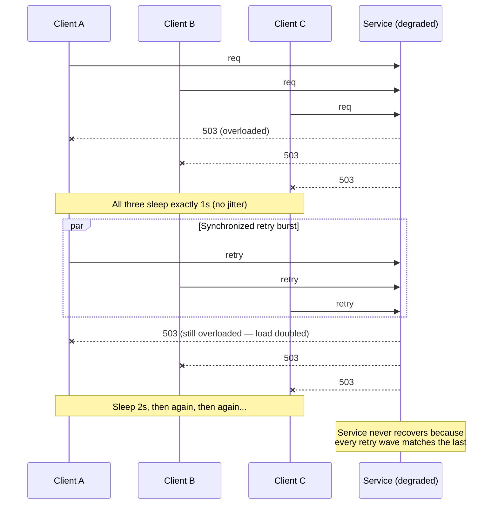
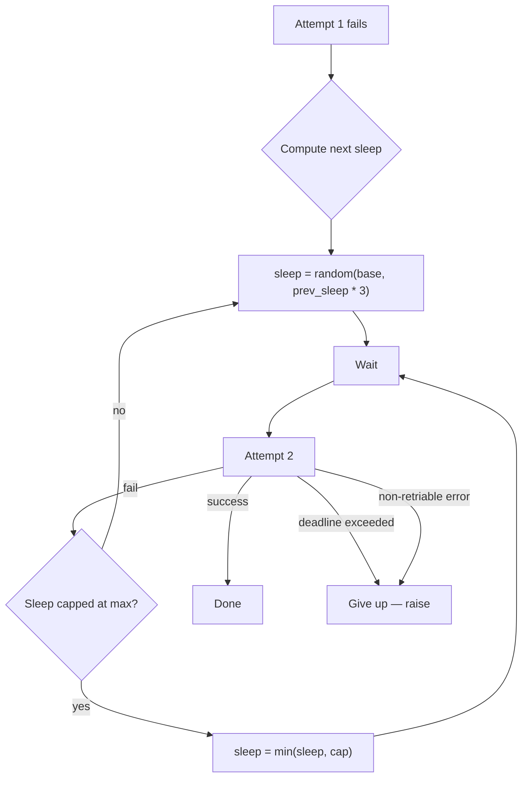
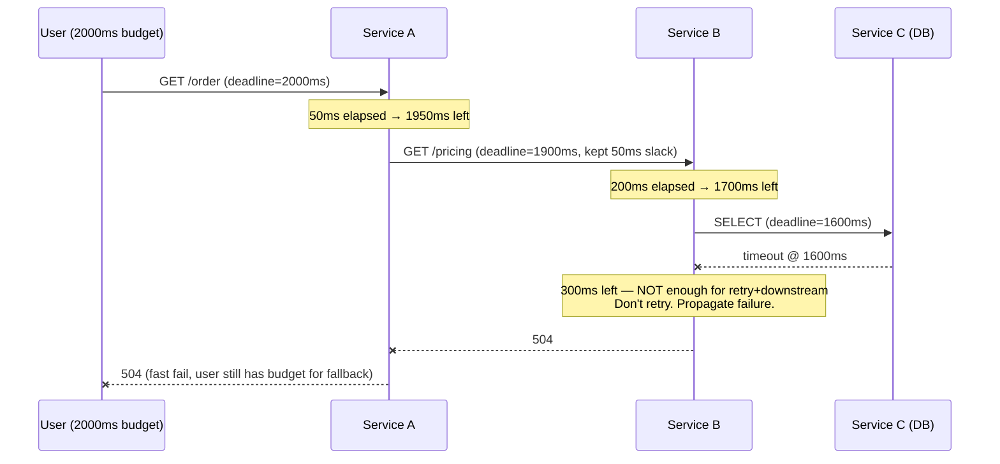

# Retries & Backoff

## Why This Exists

**Problem.** Networks fail. Servers hiccup. The naive fix — "just retry" — is the most common cause of self-inflicted outages. A blind `for attempt in range(5): try_again()` loop turns a 30-second downstream blip into a 5-minute amplification event: every caller piles on at the same moment, the recovering service gets DDoSed by its own clients, and what should have been a transient error becomes a full incident with duplicate side-effects, exhausted thread pools, and SEV-2 pages.

**Key insight.** Retries are a load-multiplier. A retry policy is a *traffic policy*, not an error-handling concern. The four things that actually matter:

1. **Backoff with jitter** so retries are spread across time, not synchronized.
2. **A retry budget** (cap retries as a fraction of outbound traffic) so a sick dependency can't recruit your service into a DDoS amplifier.
3. **Idempotency** — every retried call must be safe to execute N times, or you'll see duplicate charges, double-shipped orders, and reconciliation hell.
4. **Deadline propagation** — retries are bounded by the *original* request deadline, not by attempt count. If the upstream caller has 200ms left, you don't get to spend 2 seconds retrying.

**Reach for this when**

- A downstream service degrades and your error rate amplifies it ("retry storm" / "thundering herd").
- You're seeing duplicate side-effects (charges, emails, shipments) on a small percentage of requests.
- p99 latency spikes during partial outages because every request burns its full retry budget.
- A bounded job (cron, webhook handler, queue consumer) needs an "at-least-once eventually-succeeds" semantic.
- You're integrating with a flaky third-party API (payment processors, geocoding, LLM providers).

**Don't reach for this when**

- The error is **non-transient** (4xx validation errors, auth failures, "not found"). Retrying these wastes cycles and can mask bugs.
- You don't have idempotency. Add an idempotency key first, *then* turn on retries. Order matters.
- The operation is a long-running write to a system without dedup (legacy ledger). Use an outbox / reconciliation pattern instead — see `../../data-systems/outbox/`.
- You're inside a single TCP connection and the protocol already retries (HTTP/2, gRPC retry policy, TCP itself). Stacking retries silently multiplies attempts.

## Diagrams

### The retry storm



### Decorrelated jitter spreads load



### Deadline propagation across hops



## Core patterns

### 1. Three flavors of jitter (full, equal, decorrelated)

The seminal AWS Architecture Blog post by Marc Brooker compared these and recommended **full jitter** or **decorrelated jitter** for most workloads. "Equal jitter" sounds appealing but underperforms in simulations.

```python
import random
import time
from typing import Callable, TypeVar

T = TypeVar("T")

BASE = 0.050   # 50 ms
CAP  = 20.0    # 20 s — never sleep longer than this

def backoff_full_jitter(attempt: int) -> float:
    """sleep = uniform(0, min(cap, base * 2^attempt))
    Recommended default. Best for most cases."""
    return random.uniform(0, min(CAP, BASE * (2 ** attempt)))

def backoff_equal_jitter(attempt: int) -> float:
    """sleep = temp/2 + uniform(0, temp/2). Half deterministic, half random.
    Slightly worse than full jitter in Brooker's simulations — avoid."""
    temp = min(CAP, BASE * (2 ** attempt))
    return temp / 2 + random.uniform(0, temp / 2)

def backoff_decorrelated(prev_sleep: float) -> float:
    """sleep = min(cap, uniform(base, prev_sleep * 3))
    Stateful: depends on previous sleep, not attempt count.
    Tends to converge faster after a long pause. Good for clients that
    retry indefinitely (queue consumers, daemons)."""
    return min(CAP, random.uniform(BASE, prev_sleep * 3))
```

### 2. A retry decorator that does the right thing

This is the shape every production retry helper should have. Note what's *not* a parameter: the caller cannot disable jitter, cannot exceed the deadline, and cannot retry non-idempotent calls without explicitly opting in.

```python
import random
import time
from dataclasses import dataclass
from typing import Callable, Iterable, Type, TypeVar

T = TypeVar("T")

class RetryBudgetExhausted(Exception): ...
class DeadlineExceeded(Exception): ...

@dataclass(frozen=True)
class RetryPolicy:
    max_attempts: int = 3              # hard cap, including the first try
    base: float = 0.050                 # 50ms
    cap: float = 20.0                   # 20s — single sleep ceiling
    deadline_seconds: float | None = None
    retriable: tuple[Type[BaseException], ...] = (TimeoutError, ConnectionError)
    # Idempotency is a CALLER responsibility — we just refuse to retry
    # without an explicit acknowledgement.
    idempotent: bool = False

def retry(policy: RetryPolicy, fn: Callable[[], T]) -> T:
    if not policy.idempotent and policy.max_attempts > 1:
        raise ValueError(
            "retrying a non-idempotent operation is unsafe; "
            "set idempotent=True only after adding an idempotency key"
        )

    start = time.monotonic()
    last_exc: BaseException | None = None

    for attempt in range(policy.max_attempts):
        # Deadline check BEFORE the attempt — don't start work we can't finish.
        if policy.deadline_seconds is not None:
            elapsed = time.monotonic() - start
            if elapsed >= policy.deadline_seconds:
                raise DeadlineExceeded(f"deadline exceeded before attempt {attempt}")

        try:
            return fn()
        except policy.retriable as e:
            last_exc = e
            if attempt == policy.max_attempts - 1:
                break  # out of attempts

            # Full jitter backoff
            sleep = random.uniform(0, min(policy.cap, policy.base * (2 ** attempt)))

            # Don't sleep past the deadline — saves the caller a wasted wait.
            if policy.deadline_seconds is not None:
                remaining = policy.deadline_seconds - (time.monotonic() - start)
                if remaining <= 0:
                    raise DeadlineExceeded("deadline exceeded between attempts")
                sleep = min(sleep, max(0.0, remaining - 0.001))

            time.sleep(sleep)
        # Non-retriable exceptions propagate immediately — DO NOT catch them.
        # 4xx, validation errors, auth failures: the next attempt will fail too.

    assert last_exc is not None
    raise last_exc
```

Usage:

```python
def charge_card():
    return payment_api.charge(
        amount=4200,
        currency="USD",
        idempotency_key=request.id,   # <-- the only thing that makes this safe
    )

result = retry(
    RetryPolicy(
        max_attempts=4,
        deadline_seconds=2.0,
        idempotent=True,              # caller asserts the call is safe to repeat
    ),
    charge_card,
)
```

### 3. Token-bucket retry budget (client-side circuit-breaking)

The AWS SDK and Google's gRPC libraries both implement this: cap retries as a *ratio* of outbound calls. If you're already retrying 10% of calls, something is broken — adding more retries makes it worse, not better. The budget refills as successes accrue.

```python
import threading
import time

class RetryBudget:
    """Token bucket: every successful call earns retry credit; every retry costs.
    Refuses to retry once the bucket is empty.

    Tuning: 'token_ratio' = retries permitted per success. 0.1 = 10% retry rate ceiling.
    """
    def __init__(self, capacity: int = 100, token_ratio: float = 0.1):
        self.capacity = capacity
        self.token_ratio = token_ratio
        self._tokens = float(capacity)
        self._lock = threading.Lock()

    def on_success(self) -> None:
        with self._lock:
            self._tokens = min(self.capacity, self._tokens + self.token_ratio)

    def try_consume(self) -> bool:
        with self._lock:
            if self._tokens >= 1.0:
                self._tokens -= 1.0
                return True
            return False  # circuit-breaker behavior — fast fail

    def level(self) -> float:
        with self._lock:
            return self._tokens / self.capacity
```

Wire it in:

```python
budget = RetryBudget(capacity=100, token_ratio=0.1)

def call_with_budget():
    try:
        result = downstream.call()
        budget.on_success()
        return result
    except TimeoutError:
        if not budget.try_consume():
            metrics.incr("retry_budget_exhausted")
            raise   # fail fast; protect the dependency
        return retry(RetryPolicy(max_attempts=2, idempotent=True, deadline_seconds=1.0),
                     downstream.call)
```

### 4. Deadline propagation (gRPC / context style)

Every hop in a request chain shrinks the deadline. **Never refresh a deadline** when forwarding a request — the user's clock is the source of truth.

```go
// Go: context.WithDeadline naturally propagates.
func handleOrder(ctx context.Context, orderID string) (*Order, error) {
    // ctx already has a deadline from the inbound RPC. Don't replace it.
    pricing, err := pricingClient.Get(ctx, orderID)   // inherits deadline
    if err != nil {
        return nil, err
    }
    // Reserve some slack for the response — don't burn the whole budget downstream.
    childCtx, cancel := context.WithTimeout(ctx, timeRemaining(ctx) - 50*time.Millisecond)
    defer cancel()
    return inventoryClient.Reserve(childCtx, pricing.SKU)
}

func timeRemaining(ctx context.Context) time.Duration {
    deadline, ok := ctx.Deadline()
    if !ok {
        return 30 * time.Second  // a sane default — never "infinite"
    }
    return time.Until(deadline)
}
```

In HTTP: pass `X-Request-Deadline` or `grpc-timeout` on every hop. Logging the *remaining* deadline at each service is gold during incidents — you can see exactly where the budget evaporated.

### 5. Idempotency keys (the precondition for retries)

If you're going to retry mutating calls, you need server-side dedup. Stripe's idempotency key pattern:

```sql
-- Server side. Run inside the same txn as the actual write.
CREATE TABLE idempotency_keys (
    key            TEXT PRIMARY KEY,
    request_hash   BYTEA NOT NULL,
    response_body  JSONB,
    response_code  INT,
    created_at     TIMESTAMPTZ NOT NULL DEFAULT now(),
    expires_at     TIMESTAMPTZ NOT NULL
);

-- On every mutating request:
-- 1) Try to insert (key, request_hash). If conflict and hash matches: return cached response.
-- 2) If conflict and hash differs: 422 — same key, different request body. Reject.
-- 3) If insert succeeds: do the work, update the row with response, commit atomically.
```

```python
def charge_idempotent(key: str, amount: int, body_hash: bytes) -> Response:
    with db.transaction():
        existing = db.execute(
            "SELECT request_hash, response_body, response_code "
            "FROM idempotency_keys WHERE key = %s FOR UPDATE",
            (key,),
        ).fetchone()

        if existing:
            if existing.request_hash != body_hash:
                return Response(422, {"error": "idempotency_key_reuse"})
            # Replay the cached response — DO NOT re-execute the side-effect.
            return Response(existing.response_code, existing.response_body)

        db.execute(
            "INSERT INTO idempotency_keys (key, request_hash, expires_at) "
            "VALUES (%s, %s, now() + interval '24 hours')",
            (key, body_hash),
        )
        # Side-effect happens HERE, inside the same txn. If it fails, the
        # idempotency row rolls back too, and the next retry will execute fresh.
        result = perform_charge(amount)
        db.execute(
            "UPDATE idempotency_keys SET response_body = %s, response_code = %s "
            "WHERE key = %s",
            (json.dumps(result), 200, key),
        )
        return Response(200, result)
```

Ship the key from the client; the **client** chooses the key (e.g., a UUID) so the same key survives across retries.

### 6. What's retriable, really?

| HTTP / RPC outcome              | Retriable? | Notes                                                              |
|--------------------------------|------------|---------------------------------------------------------------------|
| Connection refused / reset      | Yes        | Likely transient. Often safe even for non-idempotent calls if connection never established. |
| Read timeout                    | **Maybe**  | The request *may have been processed*. Only retry if idempotent. |
| 408 Request Timeout             | Yes        | Server signaled it never finished — usually safe.                  |
| 425 Too Early                   | Yes        | TLS 0-RTT replay protection; safe to resend.                       |
| 429 Too Many Requests           | Yes        | **Honor `Retry-After`**. Add jitter on top.                        |
| 500 Internal Server Error       | Maybe      | Idempotent only. Could mean partial write.                          |
| 502 / 503 / 504                 | Yes        | Network/upstream failure. Standard backoff applies.                 |
| 5xx with `Retry-After`          | Yes        | Use server's value as the *floor*, add jitter.                      |
| 4xx (other, 400/401/403/404/422)| **No**     | Retrying won't fix a bug or auth failure. Surface immediately.      |
| DNS NXDOMAIN                    | No         | Config issue. Don't retry.                                          |
| TLS handshake failure           | No (usually)| Cert / SNI issue. Won't fix itself.                                |

## Trade-offs

| Benefit                                              | Cost                                                                          |
|------------------------------------------------------|-------------------------------------------------------------------------------|
| Masks transient failures → higher success rate       | Hides bugs that *should* be loud (e.g. flaky test, racy code)                 |
| Backoff smooths load on recovering dependency        | Increases tail latency: p99 = retry_count × backoff                           |
| Jitter prevents synchronized retry storms            | Makes timing-sensitive tests harder; non-deterministic                        |
| Retry budget caps amplification                      | Drops some requests during degradation that *would* have succeeded            |
| Deadline propagation gives users predictable latency | Requires every layer to honor it — partial adoption is worse than none        |
| Idempotency keys make retries safe                   | Storage cost + 1 extra round-trip; clients must remember the key across retries |
| At-least-once + idempotent = exactly-once semantics  | Forces every mutating endpoint to handle dedup state                          |

## Common Pitfalls

- **Stacked retries.** Library retries inside SDK retries inside service retries. A 3×3×3 stack means a single user request can become 27 backend calls. Audit every layer; usually only the *outermost* layer should retry.
- **No jitter.** "Retry after 1s, then 2s, then 4s" is the textbook example *and* the textbook recipe for a retry storm. The 2015 DynamoDB outage post-mortem (and many others) cite this exact pattern.
- **Retrying 4xx.** A `400 Bad Request` will be a `400 Bad Request` 30 seconds from now too. Retrying it just adds latency and load.
- **Retrying without idempotency.** Duplicate charges, double-shipped orders, and triple-emails. The retry succeeds; the user gets billed twice. The post-mortem is brutal.
- **Refreshing the deadline at each hop.** Service A has 1s left, calls Service B with `timeout=5s`. Now B can take longer than A is willing to wait — A gives up, B keeps working, the work is wasted.
- **Infinite retries on persistent failures.** A queue consumer that retries forever can lock up the queue head. Use a dead-letter queue after N attempts.
- **Retrying inside a database transaction.** The transaction holds locks; retry sleep extends lock duration; other queries pile up; deadlock storm. Retry the *whole* transaction, not a single query.
- **Cap too high.** A 60-second cap during a 1-second deadline window means you sleep through the deadline. Tune `cap << deadline`.
- **Cap too low.** All clients converge on the cap and retry simultaneously again — you've reinvented the storm. Decorrelated jitter side-steps this.
- **Synchronized clients ("thundering herd")** post-deploy or post-network-partition. All clients reconnect at t=0. Add **startup jitter** (random sleep before first connection) and stagger health-check intervals.
- **Retries on read replicas after a failover.** Replica is stale; retry hits replica again; client thinks the data is missing. Either retry against primary or detect the staleness signal.
- **Retry metrics not split from request metrics.** "Success rate is 99.9%" sounds great until you realize 30% of those successes took 3 attempts. Track `attempts_per_success` and alert on its tail.

## Decision Table

| Situation                                                    | Strategy                                                                                  |
|--------------------------------------------------------------|-------------------------------------------------------------------------------------------|
| Synchronous user-facing request                              | 1–3 attempts, full jitter, **deadline-bounded** (deadline ≤ user patience)                |
| Background job (queue consumer, cron)                        | Decorrelated jitter, large cap (minutes), DLQ after N attempts                            |
| Webhook delivery                                             | Exponential backoff with jitter, retry over hours/days, give up after 24h → DLQ           |
| Calling a third-party API with rate limits                   | Honor `Retry-After`, add jitter on top, **plus** retry budget                             |
| Mutating call without idempotency support                    | Don't retry. Add idempotency first (`../../communication/idempotency/`) or use outbox pattern.        |
| Database query timeout                                       | Retry the *transaction*, not the query. Cap at 2–3 attempts.                              |
| Internal microservice call                                   | gRPC retry policy + deadline propagation + retry budget                                   |
| Connecting to a clustered service after partition (Kafka, ZK)| Decorrelated jitter, *startup* jitter, no cap on attempts (eventually-consistent)         |
| Caller has < 100ms remaining                                 | **Don't retry.** Fast-fail; let the user retry at the edge.                               |
| Error rate > 50% from one dependency                         | Open the circuit (`../circuit-breaker/`), shed load, stop retrying for a window           |

## References

- Brooker, Marc — **"Exponential Backoff And Jitter"** (AWS Architecture Blog, the canonical jitter post) — https://aws.amazon.com/blogs/architecture/exponential-backoff-and-jitter/
- Brooker, Marc — **"Timeouts, retries, and backoff with jitter"** (AWS Builders' Library) — https://aws.amazon.com/builders-library/timeouts-retries-and-backoff-with-jitter/
- Brooker, Marc — **"Avoiding fallback in distributed systems"** (AWS Builders' Library) — https://aws.amazon.com/builders-library/avoiding-fallback-in-distributed-systems/
- Brooker, Marc — **"Avoiding overload in distributed systems by putting the smaller service in charge"** (AWS Builders' Library) — https://aws.amazon.com/builders-library/avoiding-overload-in-distributed-systems-by-putting-the-smaller-service-in-charge/
- Vogels, Werner — **"Performance and Scalability: 10 Lessons from Building Highly Scalable Services"** — referenced retry-budget pattern.
- Google SRE Book — **Ch. 22 "Addressing Cascading Failures"** (the canonical reference on retry storms and load-shedding) — https://sre.google/sre-book/addressing-cascading-failures/
- Google SRE Book — **Ch. 21 "Handling Overload"** — https://sre.google/sre-book/handling-overload/
- Google SRE Workbook — **Ch. 8 "On-Call"** and **Ch. 11 "Managing Load"** — https://sre.google/workbook/managing-load/
- gRPC documentation — **"Retry Design"** (the spec for `retryPolicy` in service config, including token-bucket budget) — https://github.com/grpc/proposal/blob/master/A6-client-retries.md
- Stripe Engineering — **"Designing robust and predictable APIs with idempotency"** — https://stripe.com/blog/idempotency
- IETF RFC 7231 §6.6.4 — **HTTP `Retry-After` header** — https://datatracker.ietf.org/doc/html/rfc7231#section-7.1.3
- IETF RFC 9110 §15.5.9 — **HTTP `429 Too Many Requests`** — https://datatracker.ietf.org/doc/html/rfc9110
- Kleppmann, Martin — **Designing Data-Intensive Applications**, Ch. 8 "The Trouble with Distributed Systems" (network failures, unreliable clocks — the *why* behind retries).
- Helland, Pat — **"Idempotence Is Not a Medical Condition"** (ACM Queue, 2012) — the foundational essay on why "retry-safe" requires explicit design — https://queue.acm.org/detail.cfm?id=2187821
- Nygard, Michael — **Release It! 2nd Ed.**, Ch. 5 "Stability Patterns" (Circuit Breaker, Bulkhead, Timeout) — Pragmatic Bookshelf, 2018.
- AWS Post-event summary — **DynamoDB Service Disruption (Sept 2015)** — discusses retry-storm amplification — https://aws.amazon.com/message/5467D2/

## See Also

- `../circuit-breaker/` — when retries aren't enough; trip the breaker and shed load
- `../timeouts/` — every retry needs a deadline; this is where deadlines come from
- `../../communication/idempotency/` — the precondition that makes mutating retries safe
- `../load-shedding/` — server-side defense when retry budgets aren't honored
- `../../data-systems/outbox/` — for at-least-once mutations to systems without dedup support
- `../../communication/message-queues/` — the terminal state for retries that have given up
- `../../performance/use-red-methods/` — `attempts_per_success` and budget-exhausted metrics
- `../../architecture-patterns/saga/` — when "retry the whole thing" needs compensation logic
