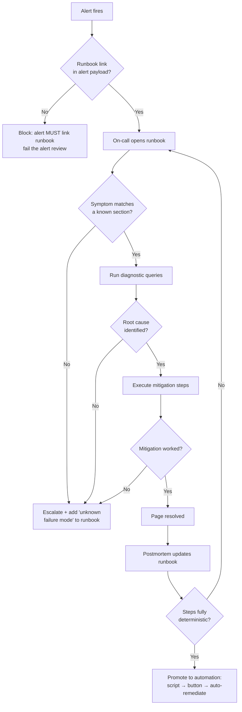
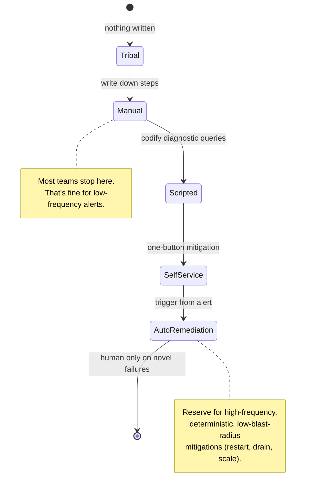

# Runbooks

## Why This Exists

**Problem.** At 3:07am the pager fires: `CheckoutP99Latency > 2s for 5m`. The on-call engineer has been on the team for six weeks. They have never seen this alert. The original author left last quarter. The dashboard is a wall of red. Every minute costs revenue. **Where do they start?**

Without a runbook the answer is: tribal knowledge, Slack archaeology, and luck. Mean time to recovery (MTTR) becomes a function of *who* paged, not *what* broke. New hires can't take pager. Senior engineers burn out being the human runbook.

**Key insight.** A runbook is a **forcing function for institutional memory**. It encodes the recovery steps for a known failure mode in a place the on-call will actually look — linked directly from the alert. The goal is not exhaustive documentation; it is to **get a tired human to the right action in under five minutes**. Every alert that can fire MUST link to a runbook entry, even if that entry says "we don't know what to do — page <expert>".

**Reach for this when:**
- You have alerts that wake humans up. Each alert needs a runbook link.
- You're onboarding a new on-call rotation and want to flatten the expertise curve.
- The same incident keeps happening and the postmortem keeps saying "we should write this down."
- You're investing in **runbook automation** — turning manual steps into self-service tooling, then into auto-remediation.

**Don't reach for this when:**
- The "runbook" would just say *call the database team*. That's an escalation policy, not a runbook. Write the escalation policy.
- The procedure is one-off and won't be repeated (e.g., a data backfill for a specific customer). Use a ticket, not a runbook.
- You're tempted to write a runbook for an unknown failure mode. Runbooks document **known** failures. For the unknown, you need a debugging guide and good observability — not a script.

This skill is grounded in **SRE Workbook ch. 8 — On-Call** and **SRE Book ch. 8 — Release Engineering / ch. 14 — Managing Incidents**. The discipline is borrowed straight from aviation checklists: when adrenaline is high and cognition is low, the checklist saves lives.

---

## Diagrams

### The runbook lifecycle: alert → runbook → automation



The arrow from postmortem back to the runbook is the **only thing that keeps a runbook alive**. If incidents don't update the runbook, it rots in six months.

### From manual runbook to auto-remediation (maturity ladder)



You do not need to climb the whole ladder. Climb until the cost of the next rung exceeds the pain it removes. Auto-remediating a flaky alert that fires once a quarter is over-engineering; auto-remediating a thread-pool exhaustion that fires twice a week is a no-brainer.

---

## What a runbook entry actually contains

A runbook entry has a **fixed, boring structure**. Boredom is the feature — the on-call's eyes need to land on the same fields every time. Below is the canonical template; copy it verbatim per alert.

```markdown
# Alert: CheckoutP99Latency

## Summary (1 line)
p99 latency on POST /checkout exceeded 2s for 5m. Customers see "spinner of doom" or 504s.

## Severity / customer impact
Sev-2. Direct revenue impact: ~$12k/min during peak. Cart abandonment climbs ~3%/min above 1.5s p99.

## Dashboards
- Service overview: https://grafana.example.com/d/checkout-overview
- Downstream deps: https://grafana.example.com/d/checkout-deps
- Recent deploys: https://deploy-tracker.example.com/svc/checkout

## Diagnostic flow (run in order, stop when you have the answer)
1. Recent deploy in last 30m? → see "Rollback" below.
2. Downstream `payment-svc` p99 > 1s? → likely upstream; page payment-oncall.
3. DB primary CPU > 80% or `pg_stat_activity` shows long-running tx? → see "DB pressure".
4. Pod CPU throttling on `checkout-api` (kubectl top, container_cpu_cfs_throttled_seconds_total > 0)? → see "Throttling".
5. None of the above → escalate to checkout-secondary on-call.

## Mitigations (each is independently safe)
### Rollback
    kubectl -n checkout rollout undo deployment/checkout-api
Verify: p99 returns < 1s within 5m. If not, this wasn't the cause; revert is harmless.

### DB pressure: kill long-running transactions
    psql -h <primary> -c "SELECT pg_terminate_backend(pid) FROM pg_stat_activity
                          WHERE state='active' AND query_start < now() - interval '60s'
                          AND application_name='checkout-api';"
Risk: terminated transactions retry from app. Safe at any traffic level.

### Throttling: scale out
    kubectl -n checkout scale deployment/checkout-api --replicas=+10
Risk: cost. Auto-scaler will reclaim within 30m.

## Escalation
- Primary: @checkout-oncall (PagerDuty: P-CHECKOUT)
- Secondary: @checkout-eng-lead (only if primary unreachable for 15m)
- Subject matter expert (DB issues): @data-platform-oncall

## Known related incidents
- INC-4421 (2025-08): same alert, root cause was payment-svc deploy.
- INC-4503 (2025-09): false positive from synthetic monitor; ignore if `synthetic_traffic_only` label set.

## Last reviewed
2026-04-12 by @ngarcia. Next review due: 2026-10-12.
```

The fields that matter most:
- **Diagnostic flow is ordered and stops early.** No on-call should run all twelve checks; they run until they find the cause.
- **Each mitigation is independently safe.** "First do X, then Y, then Z" is brittle; X alone should not break things.
- **Last reviewed** is non-optional. Stale runbooks are worse than no runbook because they breed false confidence.

---

## Wiring runbooks to alerts (the part teams forget)

A runbook nobody can find is worse than no runbook. The alert payload itself MUST carry the link. Below is a Prometheus AlertManager example — the same pattern applies in CloudWatch, Datadog, PagerDuty, etc.

```yaml
# prometheus/alerts/checkout.yaml
groups:
  - name: checkout.rules
    rules:
      - alert: CheckoutP99Latency
        expr: |
          histogram_quantile(0.99,
            sum(rate(http_request_duration_seconds_bucket{service="checkout",route="/checkout"}[5m]))
            by (le)
          ) > 2
        for: 5m
        labels:
          severity: page
          service: checkout
          team: checkout
        annotations:
          summary: "checkout p99 > 2s for 5m"
          description: "p99 = {{ $value | humanizeDuration }}; threshold = 2s"
          # The runbook URL is structured so AlertManager can route by it,
          # and so on-call sees it in PagerDuty / Slack without hunting.
          runbook_url: "https://runbooks.example.com/checkout/p99-latency"
          dashboard_url: "https://grafana.example.com/d/checkout-overview"
```

CI gate: **fail any alert PR that lacks `runbook_url`**. This is one of the highest-leverage policies you can adopt.

```python
# tools/lint_alerts.py — run in CI
import sys, yaml, pathlib

REQUIRED_ANNOTATIONS = {"summary", "description", "runbook_url"}

def lint(path: pathlib.Path) -> list[str]:
    errors = []
    doc = yaml.safe_load(path.read_text())
    for group in doc.get("groups", []):
        for rule in group.get("rules", []):
            if "alert" not in rule:
                continue
            anns = set(rule.get("annotations", {}).keys())
            missing = REQUIRED_ANNOTATIONS - anns
            if missing:
                errors.append(
                    f"{path}:{rule['alert']} missing annotations: {sorted(missing)}"
                )
            url = rule.get("annotations", {}).get("runbook_url", "")
            # Cheap heuristic — full validation happens in a separate
            # nightly job that actually fetches the URL.
            if url and not url.startswith("https://runbooks."):
                errors.append(f"{path}:{rule['alert']} runbook_url not on canonical host")
    return errors

if __name__ == "__main__":
    failed = False
    for p in pathlib.Path("prometheus/alerts").rglob("*.yaml"):
        for e in lint(p):
            print(e); failed = True
    sys.exit(1 if failed else 0)
```

A weekly job should also **fetch every `runbook_url`** and fail loudly on 404s. Dead runbook links are silent rot.

---

## Runbook automation: from steps to scripts to buttons

The **maturity ladder** in the diagram earlier is concrete. Here's what each rung looks like in practice.

### Rung 1: Manual steps (markdown)
What you saw in the template. Good enough for alerts firing < once/quarter.

### Rung 2: Diagnostic scripts
Codify the diagnostic queries so the on-call doesn't fat-finger them at 3am.

```bash
#!/usr/bin/env bash
# runbooks/checkout/diagnose-p99.sh
# Run all p99-latency diagnostics in parallel, print a summary.
set -euo pipefail

NS="checkout"
SVC="checkout-api"
DB_HOST="${DB_HOST:?must be set}"

echo "=== 1. Recent deploys (last 30m) ==="
kubectl -n "$NS" rollout history "deployment/$SVC" | tail -3

echo "=== 2. Downstream payment-svc p99 ==="
curl -sf "http://prometheus.example.com/api/v1/query" \
  --data-urlencode 'query=histogram_quantile(0.99, sum(rate(http_request_duration_seconds_bucket{service="payment"}[5m])) by (le))' \
  | jq -r '.data.result[0].value[1]'

echo "=== 3. Long-running DB transactions ==="
psql -h "$DB_HOST" -t -c "
  SELECT count(*) FROM pg_stat_activity
  WHERE state='active' AND query_start < now() - interval '60s'
    AND application_name='checkout-api';"

echo "=== 4. Pod CPU throttling ==="
kubectl -n "$NS" top pods -l app=checkout-api --no-headers \
  | awk '{ if ($2+0 > 800) print "HIGH CPU: "$0 }'
```

### Rung 3: Self-service mitigation (one-button)
Wrap the mitigation in a tool the on-call can invoke without thinking. Crucially: **dry-run by default, --apply to commit**.

```python
# runbooks/checkout/mitigate.py
import argparse, subprocess, sys, time

MITIGATIONS = {
    "rollback": [
        "kubectl", "-n", "checkout", "rollout", "undo",
        "deployment/checkout-api",
    ],
    "scale-out": [
        "kubectl", "-n", "checkout", "scale",
        "deployment/checkout-api", "--replicas=20",
    ],
    "kill-long-tx": [
        "psql", "-h", "checkout-db-primary", "-c",
        "SELECT pg_terminate_backend(pid) FROM pg_stat_activity "
        "WHERE state='active' AND query_start < now() - interval '60s' "
        "AND application_name='checkout-api';",
    ],
}

def main() -> int:
    p = argparse.ArgumentParser()
    p.add_argument("action", choices=MITIGATIONS.keys())
    p.add_argument("--apply", action="store_true",
                   help="actually run; default is dry-run")
    p.add_argument("--reason", required=True,
                   help="incident ticket or short reason; logged for audit")
    args = p.parse_args()

    cmd = MITIGATIONS[args.action]
    print(f"[{time.strftime('%FT%TZ', time.gmtime())}] action={args.action} "
          f"reason={args.reason!r} apply={args.apply}")
    print("  >", " ".join(cmd))
    if not args.apply:
        print("  (dry-run; pass --apply to execute)")
        return 0

    # Audit log first, then execute. If audit log fails we refuse to act —
    # an unaudited mitigation is worse than no mitigation in a regulated env.
    audit_log(action=args.action, reason=args.reason, cmd=cmd)
    return subprocess.call(cmd)

def audit_log(**kw) -> None:
    # Real impl writes to immutable store (CloudTrail, Splunk, etc).
    print("AUDIT", kw, file=sys.stderr)

if __name__ == "__main__":
    sys.exit(main())
```

### Rung 4: Auto-remediation
The alert itself triggers the mitigation. **Only do this when the mitigation is fully deterministic, idempotent, and bounded in blast radius.**

```yaml
# Example: AWS Systems Manager OpsCenter automation document.
# When the CheckoutP99Latency alarm enters ALARM state, SSM runs this.
schemaVersion: '0.3'
description: Auto-scale checkout-api when p99 latency alarm fires.
parameters:
  AutomationAssumeRole:
    type: String
mainSteps:
  - name: GuardrailCheck
    action: aws:executeScript
    inputs:
      Runtime: python3.11
      Handler: handler
      Script: |
        # Hard guardrails — refuse to act if any are violated.
        # 1. We've already auto-remediated this alarm in the last 30m.
        # 2. Replica count is already at MAX_REPLICAS (60).
        # 3. A deploy is in progress (don't fight the deployer).
        def handler(events, context):
            if recent_remediation(minutes=30): raise Exception("cooldown active")
            if current_replicas() >= 60:      raise Exception("at max replicas")
            if deploy_in_progress():           raise Exception("deploy active")
            return {"ok": True}
  - name: ScaleOut
    action: aws:executeAwsApi
    inputs:
      Service: eks
      Api: # ... scale +5 replicas, capped at MAX_REPLICAS
  - name: NotifyOnCall
    # Always notify a human, even on success. Auto-remediation that
    # silently masks problems is how outages compound.
    action: aws:executeAwsApi
    inputs:
      Service: sns
      Api: Publish
```

The **GuardrailCheck** step is the heart of safe auto-remediation: it answers "should we act?" before "how do we act?". Skip it and you'll auto-scale a service into bankruptcy because a metric exporter was broken.

---

## Keeping runbooks alive: living-doc discipline

Documentation rots. Runbooks rot faster because they touch fast-moving systems. Three practices keep them alive:

**1. Postmortem → runbook is mandatory.** Every incident review answers: *Did the runbook help? What was missing?* The action item "update runbook section X" is non-optional and tracked to closure. SRE Workbook ch. 10 (Postmortem Culture) treats this as a hard requirement.

**2. Quarterly runbook review.** Each runbook entry has a `last_reviewed` field. A bot files a ticket when entries pass 90 days. Reviewers walk the steps on a staging or game-day environment.

**3. Game days exercise the runbook.** Once a quarter, inject the failure (chaos engineering) and have on-call follow the runbook end-to-end. You'll discover dead links, missing permissions, and steps that no longer match reality. Game days are the single most effective rot-detector — see the SRE book ch. 28 (Disaster Role Playing).

```python
# tools/runbook_freshness.py — runs nightly, files Jira tickets
import datetime, frontmatter, pathlib

THRESHOLD_DAYS = 90
RUNBOOKS = pathlib.Path("runbooks/")

def main():
    today = datetime.date.today()
    for f in RUNBOOKS.rglob("*.md"):
        post = frontmatter.load(f)
        last = post.get("last_reviewed")
        if last is None:
            file_ticket(f, "missing last_reviewed field"); continue
        age = (today - last).days
        if age > THRESHOLD_DAYS:
            file_ticket(f, f"runbook stale: {age} days since last review")

def file_ticket(path, msg):
    # Real impl posts to Jira / Linear / SIM.
    print(f"STALE {path}: {msg}")
```

---

## Trade-offs

| Benefit | Cost |
|---|---|
| Flattens the on-call expertise curve; new hires can take pager faster | Writing and reviewing runbooks is real engineering time, not "documentation overhead" |
| MTTR drops because diagnosis is pre-decided, not improvised at 3am | Stale runbooks actively mislead — rot risk is permanent |
| Forces clarity about what "known" failure modes are, exposing gaps in observability | Tempts teams to runbook every alert symptom rather than fixing the root cause (alert fatigue) |
| Diagnostic scripts and one-button mitigations reduce fat-finger errors | Automation has its own blast radius; an unsafe mitigation script can cause the outage |
| Auto-remediation handles repetitive incidents without paging humans | Auto-remediation hides patterns; without notification + audit, you stop seeing the systemic problem |
| Runbook URLs in alerts make context discoverable from any channel (Slack, PagerDuty, mobile) | If the runbook host is down during an incident, your runbooks are inaccessible — keep mirrors |

---

## Common Pitfalls

- **Runbook says "investigate" or "look at the logs."** That's not a runbook; that's a noun. Be specific: which dashboard, which query, what threshold means what.
- **No link from alert to runbook.** The on-call ends up grepping a wiki at 3am. Hard-fail alert PRs that omit `runbook_url`.
- **Runbook references a Slack channel as primary documentation.** Slack is not durable storage. By the time the next incident happens, the relevant message is buried under 6 months of memes.
- **Steps assume context the on-call doesn't have.** "Restart the worker" — which worker? In which cluster? With what command? Write for the engineer who just got the pager and has zero context.
- **Mitigations are not idempotent.** Running step 3 twice corrupts state. Either make it idempotent or guard with a precondition check.
- **Auto-remediation without notification.** A team auto-scaled to 200 pods nightly for 6 weeks because a memory leak triggered the autoscaler. Nobody noticed until the AWS bill arrived. Always emit a signal a human reviews.
- **Auto-remediation without cooldown.** Alarm fires → auto-scale → metrics flap → alarm fires again → auto-scale → … now you have a runaway loop and a bill. Always include a cooldown guard.
- **Runbook covers symptoms, not failure modes.** Three runbook entries for "high latency" with subtly different mitigations confuses the on-call. Group by root cause (DB pressure, GC pause, dependency timeout), not by alert name.
- **No "what to do if you don't know what to do" section.** Every runbook needs an escape hatch: who to escalate to, what to log, how to declare an incident.
- **Documentation lives in three places.** Wiki, code repo, Notion. The on-call doesn't know which is canonical. Pick one. Make it obvious. Redirect the others.
- **Runbook last reviewed in 2022.** It says to ssh into a host that was deleted in a 2024 migration. Stale runbooks are worse than no runbooks because they consume the on-call's most precious resource: trust.
- **Forcing on-call to write the runbook during the incident.** Writing under pressure produces bad runbooks. Capture raw notes during; rewrite during the postmortem.

---

## Decision Table

| Situation | Use this approach | Why |
|---|---|---|
| Alert fires < once/quarter, low impact | Manual markdown runbook | Automation cost exceeds savings |
| Alert fires weekly, deterministic mitigation | One-button self-service script | Cuts MTTR and human error; humans still in loop |
| Alert fires daily, fully deterministic, bounded blast radius | Auto-remediation with guardrails + notification | Humans only see novel failures |
| Failure mode is *unknown* | Debugging guide + observability investment, NOT a runbook | Runbooks document known failures; unknowns need tooling |
| Procedure runs once (e.g., one-time data backfill) | Ticket with embedded steps | A runbook implies repeatability |
| Cross-team escalation procedure | Escalation policy in PagerDuty + on-call rotation | Not a recovery procedure; don't bury in runbook |
| Compliance-required step (e.g., regulator notification within 1h) | Runbook with explicit checkboxes + audit log | Runbook is the evidence trail |
| New service launching | Pre-launch checklist (Production Readiness Review) referencing draft runbooks | Forces runbook authorship before pager rotation begins — see SRE Workbook ch. 18 |
| Mitigation requires production write access by a non-oncall | Self-service tool with RBAC, NOT shared credentials | Audit + least privilege |
| You can't decide between "runbook" and "automation" | Start with manual runbook, climb the ladder as frequency justifies | Premature automation calcifies bad procedures |

---

## References

- Beyer, Murphy, Rensin, Kawahara, Thorne (eds.) — *The Site Reliability Workbook*, **ch. 8: On-Call** — https://sre.google/workbook/on-call/
- Beyer, Jones, Petoff, Murphy (eds.) — *Site Reliability Engineering*, **ch. 11: Being On-Call** — https://sre.google/sre-book/being-on-call/
- Beyer et al. — *Site Reliability Engineering*, **ch. 14: Managing Incidents** — https://sre.google/sre-book/managing-incidents/
- Beyer et al. — *Site Reliability Engineering*, **ch. 28: Accelerating SREs to On-Call and Beyond** (covers Disaster Role Playing / Wheel of Misfortune) — https://sre.google/sre-book/accelerating-sre-on-call/
- Lu, Adkins et al. — *The Site Reliability Workbook*, **ch. 10: Postmortem Culture** — https://sre.google/workbook/postmortem-culture/
- Adkins, Beyer, Blankinship, Lewandowski, Oprea, Stubblefield — *Building Secure and Reliable Systems*, **ch. 17: Crisis Management** — https://sre.google/books/building-secure-reliable-systems/
- Allspaw, Robbins — *Web Operations: Keeping the Data on Time* (O'Reilly, 2010) — chapter on operational documentation and on-call
- Atul Gawande — *The Checklist Manifesto* (2009) — origin of the operational-checklist mindset that runbooks borrow from aviation/medicine
- AWS Builders' Library — *Implementing health checks* — https://aws.amazon.com/builders-library/implementing-health-checks/ (informs diagnostic-flow ordering)
- AWS Builders' Library — *Avoiding fallback in distributed systems* — https://aws.amazon.com/builders-library/avoiding-fallback-in-distributed-systems/ (informs auto-remediation guardrails)
- AWS Builders' Library — *Going faster with continuous delivery* — https://aws.amazon.com/builders-library/going-faster-with-continuous-delivery/ (rollback as primary mitigation)
- Prometheus — *Alerting rules / annotations* — https://prometheus.io/docs/prometheus/latest/configuration/alerting_rules/
- PagerDuty — *Incident Response Documentation* — https://response.pagerduty.com/
- Google SRE — *Postmortem template* — https://sre.google/sre-book/example-postmortem/
- Charity Majors — *Observability vs. Monitoring: Know the Difference* (Honeycomb blog, 2018) — argues runbooks are insufficient for unknown-unknowns; observability fills the gap
- Kleppmann — *Designing Data-Intensive Applications* (O'Reilly 2017), **ch. 1 — Reliability** — definitions of MTTR, MTBF, fault vs. failure that anchor runbook scope

---

## See Also

- `../incident-response/` — Incident commander roles, comms, severity levels
- `../postmortems/` — Blameless postmortems and the action-item loop that updates runbooks
- `../chaos-engineering/` — Game days that exercise runbooks in controlled failure
- `../observability/` — Logs, metrics, traces — the substrate runbooks query
