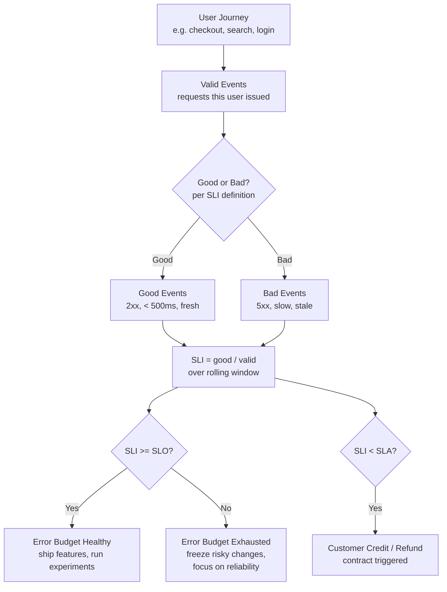
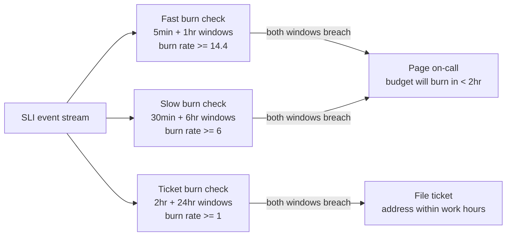
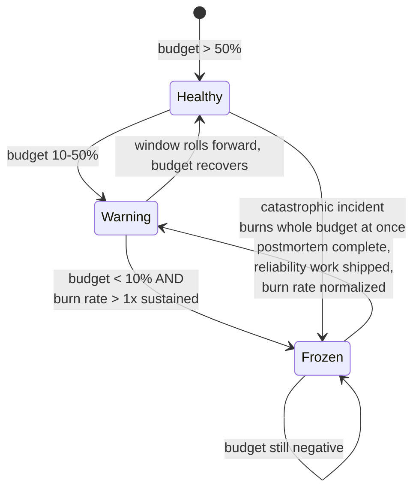

# SLO / SLI / SLA

## Why This Exists

**Problem.** Teams without explicit reliability targets either over-invest (gold-plating a service nobody notices is down) or under-invest (chasing every blip until on-call burns out). "100% uptime" is the wrong goal — it's unachievable, prohibitively expensive, and indistinguishable from a much cheaper target to your users. Without numbers, every reliability decision becomes a political argument.

**Key insight.** Reliability is a product feature with a price tag. Each additional "nine" of availability is roughly **10x more expensive** than the previous one (architecture, testing, redundancy, on-call discipline). Pick a target that matches what users actually need — usually less than you think — and treat the gap between target and 100% as an **error budget** you spend on velocity. When the budget is healthy, ship faster. When it's exhausted, freeze risky changes.

**Vocabulary, precisely:**
- **SLI** (Service Level Indicator) — a measurement. A ratio of `good events / valid events`, e.g. `successful_requests / total_requests`.
- **SLO** (Service Level Objective) — an internal target on the SLI, e.g. `99.9% of requests succeed over a rolling 28-day window`.
- **SLA** (Service Level Agreement) — a contract with a customer that includes financial or legal consequences (refunds, credits) when SLOs are missed. SLAs are usually **looser** than internal SLOs — you want to alert on SLO violation long before you owe a customer money.
- **Error budget** — `1 - SLO`. If the SLO is 99.9%, the budget is 0.1% of valid events. Spend it on deploys, experiments, and risky changes.

**Reach for this when:**
- Designing a new service and you need to set reliability targets before scoping infrastructure.
- On-call alerts are noisy and engineers can't tell which pages matter.
- Product and SRE/ops disagree on whether to freeze launches.
- A customer is asking for an SLA in a contract.
- You're being asked to "improve reliability" with no defined endpoint.

**Don't reach for this when:**
- The service has zero users or is in pre-alpha — set SLOs after you have real traffic and a baseline.
- You haven't instrumented the basics (RED/USE metrics, request logs). SLOs without measurement are theater.
- The system is internal-only with no consumers who care — you're inventing work.
- You're tempted to set per-team SLOs to grade engineers. SLOs measure systems, not people; using them for performance review **destroys** their honesty.

---

## Diagrams

### How SLI / SLO / SLA / Error Budget relate



### Multi-window burn-rate alerting



### Decision flow: when to freeze launches



---

## Choosing SLIs: the four golden families

The SRE Workbook (ch. 2) groups SLIs into a small set of patterns. Pick the ones that map to the **user journey**, not to your favorite system metric. CPU at 90% is not an SLI — your users don't care about CPU.

### 1. Availability (request-driven services)

```
SLI = count(successful_requests) / count(valid_requests)
```

"Successful" must be defined per endpoint. A 404 is sometimes a bug, sometimes correct. A 500 is almost always bad. A 429 (rate limit) might be expected for abusive clients but not for real users.

```python
# Prometheus-style recording rule for an HTTP availability SLI.
# Filter "valid" carefully: exclude health checks, internal probes,
# and known-bad clients. Otherwise your SLI lies.

# good = 2xx + 3xx + 4xx-that-are-user-error (NOT 429 from real users)
sum(rate(http_requests_total{
    job="api",
    status=~"2..|3..|4[0-3].|404",      # exclude 429, 451 etc per service
    route!~"/healthz|/metrics"
}[5m]))
/
# valid = all real user requests
sum(rate(http_requests_total{
    job="api",
    route!~"/healthz|/metrics",
    user_agent!~"kube-probe.*|Pingdom.*"  # synthetic checks belong in their own SLI
}[5m]))
```

### 2. Latency

Latency SLIs are **threshold ratios**, not averages. "Average latency" hides the tail. The SRE Book (ch. 4) is explicit: report percentiles.

```
SLI = count(requests with latency <= threshold) / count(valid_requests)
```

A common mistake is one threshold. You usually want **two**: a "fast" threshold for the median experience and a "slow" threshold to bound the tail.

```python
# Two-threshold latency SLO:
#   95% of requests under 200ms (the "feels fast" line)
#   99% of requests under 1000ms  (the "tail" line)

# Histogram bucket le=0.2 captures everything <= 200ms
fast_sli = (
    sum(rate(http_request_duration_seconds_bucket{le="0.2"}[5m]))
    /
    sum(rate(http_request_duration_seconds_count[5m]))
)
# fast_sli should be >= 0.95

slow_sli = (
    sum(rate(http_request_duration_seconds_bucket{le="1.0"}[5m]))
    /
    sum(rate(http_request_duration_seconds_count[5m]))
)
# slow_sli should be >= 0.99
```

> **Don't use `histogram_quantile()` as your SLI.** It's lossy across bucket boundaries and worse, it's not additive across replicas. SLI math wants **counters**, not estimated quantiles.

### 3. Freshness / staleness (data pipelines, caches, replicas)

```
SLI = count(reads where data_age <= max_age) / count(valid_reads)
```

For an analytics dashboard backed by an hourly ETL: "99% of pageviews show data ≤ 90 minutes old". For a read replica: "99.9% of reads serve data within 5s of primary".

### 4. Throughput / correctness / coverage

- **Throughput SLI** — `count(periods where qps >= floor) / count(periods)`. For batch and streaming jobs.
- **Correctness SLI** — `count(records that match a known-good shadow) / count(records sampled)`. Critical for ML pipelines, billing, and ledgers.
- **Coverage SLI** — `count(items processed within deadline) / count(valid items)`. For queues, indexers, search crawlers.

### Anti-SLIs (do not use these as your SLO)

| Looks like an SLI | Why it isn't | What to use instead |
|---|---|---|
| CPU utilization | A symptom, not a user-facing outcome | Latency SLI on user requests |
| Error count (raw) | Scales with traffic; meaningless ratio | Error rate (good/valid ratio) |
| "Uptime" from a single ping | Doesn't reflect what users experience | Per-request availability over real traffic |
| p99 latency as a number | Not aggregatable across replicas; can't define error budget | Bucket-based threshold ratio |
| Number of incidents | Counts pages, not user pain | Time-weighted burn against budget |

---

## SLO targets and the cost of nines

The SRE Book (ch. 4) and Workbook (ch. 2) both make the same point bluntly: **don't promise more reliability than your dependencies provide, and don't promise more than users can perceive.** If the user's network is 99.0%, your 99.999% backend is invisible to them.

### The economics

| Target | Downtime / 30 days | Downtime / year | Architectural minimum | Relative cost |
|---|---|---|---|---|
| 99% (two 9s) | 7h 12m | ~3.65 days | Single region, basic monitoring | 1x |
| 99.9% (three 9s) | 43m 12s | ~8.76 hours | Multi-AZ, hot failover, on-call | ~10x |
| 99.95% | 21m 36s | ~4.38 hours | Active-active multi-AZ, automated failover | ~20x |
| 99.99% (four 9s) | 4m 19s | ~52.6 minutes | Multi-region, no manual steps in failover, chaos testing | ~100x |
| 99.999% (five 9s) | 26 sec | ~5.26 minutes | Cell-based architecture, formally verified, no humans in the recovery path | ~1000x |

> **Three-9s vs four-9s economics.** Going from 99.9% to 99.99% means: every deploy needs progressive rollout with auto-rollback, every config change goes through the same pipeline as code, every dependency must itself be 99.99%+, every operator action must be reviewable, and you cannot tolerate a single human in the critical recovery path because humans take more than 4 minutes to react. This is a **structural** change, not a tuning exercise. Most teams asking for "four nines" actually need three, and the right answer is to push back.

### Setting the target — a working procedure

1. **Measure current performance.** Run for 28 days. What's your actual availability? If you're at 99.5% and customers aren't complaining, 99.5% might be the right target.
2. **Map to user journeys.** Don't set one SLO for "the API". Set them per critical journey: checkout, login, search results, payment confirmation. A 5xx on `/api/v1/preferences/update` is not a 5xx on `/api/v1/checkout/submit`.
3. **Compute the budget consequences.** If 99.9% means 43 minutes of downtime/month, ask: can we do four deploys with a 10-minute rollback each? If not, the target is too tight for our deploy cadence.
4. **Negotiate with stakeholders.** Show product the cost curve. Show ops the alert load at different targets. Pick the looser target that nobody complains about — looser is better, because it leaves budget for velocity.
5. **Iterate quarterly.** SLOs are not stone tablets. Review every quarter. If you've consistently exceeded the SLO with no complaints, **lower it**. If you're consistently breaching it and customers are leaving, raise it (and pay for it).

---

## Error budgets and burn rates

Error budget is `1 - SLO`. For a 99.9% SLO over a 28-day window with 1M valid requests, the budget is **1,000 bad requests**. If you burn 250 bad requests on Monday, you have 750 left for the rest of the window.

### Burn rate

`Burn rate = (bad events / valid events) / (1 - SLO)`

- Burn rate of **1** means you're burning the budget linearly — exactly on track to consume 100% over the window. Sustainable.
- Burn rate of **2** means you'll burn the entire budget in half the window.
- Burn rate of **14.4** means you'll burn the budget in `28 days / 14.4 ≈ 2 days`.

### Multi-window, multi-burn-rate alerts (SRE Workbook ch. 5)

The naive alert "page when SLI < SLO" is **terrible**: it fires constantly during normal noise, and it doesn't distinguish "5min outage" from "slow leak that will exhaust the budget in a week".

The Workbook recommendation: alert on **burn rate over two windows simultaneously**. The shorter window catches sharp incidents; the longer window prevents flapping.

```yaml
# Prometheus alerting rules for a 99.9% availability SLO
# (error budget = 0.001 of all requests)

groups:
- name: slo-burn-rate-alerts
  rules:

  # PAGE: 2% of monthly budget burned in 1 hour. Sharp incident.
  - alert: SLOFastBurn
    expr: |
      (
        slo:error_rate:ratio_5m > (14.4 * 0.001)
        AND
        slo:error_rate:ratio_1h > (14.4 * 0.001)
      )
    for: 2m
    labels:
      severity: page
    annotations:
      summary: "Fast burn: budget exhausts in <2hr at this rate"

  # PAGE: 5% of monthly budget burned in 6 hours. Sustained incident.
  - alert: SLOSlowBurn
    expr: |
      (
        slo:error_rate:ratio_30m > (6 * 0.001)
        AND
        slo:error_rate:ratio_6h > (6 * 0.001)
      )
    for: 15m
    labels:
      severity: page
    annotations:
      summary: "Slow burn: budget exhausts in <5 days at this rate"

  # TICKET: 10% of budget burned in 3 days. Address during work hours.
  - alert: SLOTicketBurn
    expr: |
      (
        slo:error_rate:ratio_2h > (1 * 0.001)
        AND
        slo:error_rate:ratio_24h > (1 * 0.001)
      )
    for: 1h
    labels:
      severity: ticket
    annotations:
      summary: "Slow leak: budget will exhaust this window if uncorrected"
```

### Recording rules to back the alerts

```yaml
# Pre-compute error rates at the windows used by alerts.
# Recording rules amortize the cost of the heavy aggregation.
groups:
- name: slo-recording-rules
  interval: 30s
  rules:

  - record: slo:error_rate:ratio_5m
    expr: |
      sum(rate(http_requests_total{job="api", status=~"5.."}[5m]))
      /
      sum(rate(http_requests_total{job="api"}[5m]))

  - record: slo:error_rate:ratio_1h
    expr: |
      sum(rate(http_requests_total{job="api", status=~"5.."}[1h]))
      /
      sum(rate(http_requests_total{job="api"}[1h]))

  - record: slo:error_rate:ratio_6h
    expr: |
      sum(rate(http_requests_total{job="api", status=~"5.."}[6h]))
      /
      sum(rate(http_requests_total{job="api"}[6h]))

  - record: slo:error_rate:ratio_24h
    expr: |
      sum(rate(http_requests_total{job="api", status=~"5.."}[24h]))
      /
      sum(rate(http_requests_total{job="api"}[24h]))
```

---

## User journeys vs system metrics

This is the most common SLO mistake. Teams measure **what's easy to measure** (server-side latency at the LB) instead of **what users feel** (full-page load including third-party scripts and the user's flaky 4G).

### The hierarchy

1. **User-perceived SLI** (best). Real User Monitoring (RUM), client-side metrics, end-to-end synthetic from the user's region. Captures what users actually experience.
2. **Edge SLI** (good). Measured at your CDN or load balancer. Includes your full service path but not the user's last mile.
3. **Service SLI** (acceptable). Measured at the service entry point. Misses LB issues, DNS, TLS handshake problems.
4. **Component SLI** (avoid as primary). Measured at an internal RPC. Almost always invisible to users; useful for diagnostics, **bad** as the SLO that triggers freezes.

### Mapping a journey to SLIs

**Example: e-commerce checkout journey**

```
[User clicks Buy] 
   -> POST /cart/checkout                       (availability + latency SLI)
      -> calls payment-service.charge           (component SLI: diagnostic only)
      -> calls inventory-service.reserve        (component SLI: diagnostic only)
   -> 302 redirect to /order/{id}               (availability SLI)
      -> GET /order/{id}                        (availability + latency + freshness SLI:
                                                  freshness because order must show
                                                  the items just bought, not stale data)
   -> email-confirmation pipeline               (freshness SLI: email within 5min)
```

The journey-level SLO is *"99.9% of started checkouts result in a confirmed order page within 3 seconds, and 99% of confirmation emails arrive within 5 minutes."*

That's two SLIs, one journey. Component SLIs (`payment-service.charge` availability) are useful **diagnostically** when the journey SLO breaches — but they're not what you negotiate with product.

---

## SLA design (the contract version)

An SLA is an SLO that triggers money or breach-of-contract penalties. Three rules:

1. **SLA SLO < internal SLO < target performance.** If your internal SLO is 99.9%, your SLA might be 99.5%. You want to know about a problem long before you owe credits.
2. **Be precise about exclusions.** Scheduled maintenance, force majeure, customer-caused issues (their bad credentials, their network), abuse traffic. AWS SLAs are good models — read several before drafting yours.
3. **Define the measurement.** "Calculated as a monthly percentage of valid requests over 30-day rolling windows, excluding requests with HTTP 4xx status codes attributable to customer error." Otherwise lawyers will fight about it.

### Typical SLA structure

```
Service Commitment: Monthly Uptime Percentage of at least 99.5%

Monthly Uptime Percentage =
    (total_minutes_in_month - unavailable_minutes) / total_minutes_in_month

Unavailable Minute = a minute during which the service returned
    error rate > 5% across all valid requests in the API region.

Service Credits:
    99.0% <= MUP < 99.5%   ->  10% credit on monthly bill
    95.0% <= MUP < 99.0%   ->  25% credit on monthly bill
    MUP < 95.0%            ->  100% credit on monthly bill

Exclusions: scheduled maintenance announced >= 7 days in advance;
    force majeure; customer-caused errors (4xx); requests from
    customer accounts not in good standing.
```

> The monetary cap on credits should be your monthly billing — the SLA is a refund mechanism, not insurance against indirect damages. Always have a lawyer review.

---

## Trade-offs

| Benefit | Cost |
|---|---|
| **Clear reliability target** ends ops-vs-product arguments | Requires real measurement infrastructure (instrumentation, log pipelines, dashboards) |
| **Error budgets quantify launch risk** — can ship faster when budget is healthy | Requires cultural buy-in: leadership must actually freeze launches when budget is exhausted |
| **Multi-window burn-rate alerts** dramatically reduce noise vs threshold alerts | More complex to implement and explain; needs recording rules for performance |
| **Per-journey SLOs** capture what users feel | More SLOs to maintain; each needs a dashboard and review |
| **Looser SLO** = more velocity, less reliability work | Customers may notice if you over-relax (silent erosion) |
| **Tighter SLO** = better user experience | Each additional 9 is ~10x cost; on-call load grows; deploy freezes more frequent |
| **SLA below internal SLO** = warning before financial impact | More SLOs to track, harder to explain "why is the contract weaker than what we aim for?" |
| **SLI on real-user metrics (RUM)** | Higher data volume, sampling complexity, harder to diagnose root cause |
| **SLI on server-side metrics** | Cheap, easy, but blind to last-mile and edge issues |
| **Quarterly SLO review** keeps targets honest | Calendar overhead; political cost when proposing to *lower* a target |

---

## Common Pitfalls

- **"100% is the goal."** It's not. 100% reliability is a fantasy that costs infinite money and prevents shipping. The Workbook is explicit: pick a target users can't distinguish from 100% and stop there.

- **Setting SLOs without measuring first.** A team picks 99.99% because it sounds professional, then discovers they're at 99.2% in practice. Now they have 8 months of reliability work before they can ship features. **Always baseline first.**

- **One global SLO for "the service".** Hides per-journey pain. Checkout breaks at 99.5% but profile-update is at 99.99% — your global average looks fine, your revenue is on fire.

- **Including health-check traffic in the SLI denominator.** Health checks are 100% reliable by construction (or you'd be alerted). They dilute the SLI ratio and hide real failures. Filter them out.

- **Using `histogram_quantile()` as the SLI.** It's lossy, non-additive, and breaks the "good/valid ratio" model. Use bucket counters: `bucket{le="0.2"} / count`.

- **Ignoring the budget when it's healthy.** The point of budgets is symmetry — you also use surplus to take risks. Teams that only invoke the budget to freeze launches lose the velocity benefit.

- **Refusing to lower an SLO.** A team has a 99.99% SLO they've never come close to breaching. Real performance is 99.999%. Engineers are over-investing in reliability that nobody perceives. Lowering to 99.95% would free a quarter of headcount for product work — but admitting "we set it too high" is politically hard. Do it anyway.

- **Tying SLO performance to performance reviews.** Engineers will define "valid events" creatively to keep the SLI green. The SLO becomes a number, not a measurement. **Never grade individuals on SLOs.**

- **Threshold alerts instead of burn-rate alerts.** Pages every time error rate ticks above 0.1% for 30 seconds. On-call burns out, real incidents get missed. Use multi-window burn rate.

- **SLA tighter than internal SLO.** You owe customers refunds before you've even noticed there's a problem. SLA should be **looser** than your alerting threshold so you respond before you owe money.

- **Treating dependencies as 100% reliable.** If your service depends on a 99.9% database, you cannot achieve 99.99% without redundancy. The reliability of a serial dependency chain is the **product** of its parts.

- **No timeline windows.** "We're at 99.9% this month" — over what window? A 28-day rolling window is standard. Calendar months are awful (length varies, end-of-month freezes get political).

- **Forgetting "valid event" definition.** If you don't define which requests count, you'll fight about it during every postmortem. Write it down. Make it a recording rule.

---

## Decision Table

| Situation | Use this | Not this | Why |
|---|---|---|---|
| New service, no production traffic yet | Baseline period (4-8 weeks), THEN set SLO | Picking a number from a slide deck | You need real data; "industry standard 99.99%" probably doesn't match your stack |
| External-facing API used by paying customers | Per-journey SLOs + customer-facing SLA | Single global "API uptime" SLA | Customers care about specific journeys; one number hides product-level pain |
| Internal service with 1-2 consuming teams | Lightweight SLI/SLO, no SLA | Formal contract | Negotiate verbally; spend the SLA-engineering cost on better instrumentation |
| Real-time service (chat, gaming, trading) | Latency SLI (multi-threshold) + availability | Availability only | A 5-second response IS unavailable for these users |
| Batch/ETL pipeline | Freshness + coverage SLIs | Availability SLI | The job either ran or didn't; "uptime" is meaningless |
| Read-heavy service (CDN, cache) | Latency + freshness | Availability only | Stale-but-fast may be acceptable; instrument both |
| User says "we need 99.99%" | Push back: show 99.9% downtime numbers, ask what users will perceive | Quietly accept | Most "four 9s" requirements vanish under the cost question |
| Cross-service journey (e.g. checkout) | Journey-level SLO measured at the entry point | Sum of component SLOs | Composition fallacy: 5 services at 99.9% = ~99.5% serial reliability |
| Alerting on SLO violation | Multi-window burn rate (5m+1h, 30m+6h) | Threshold alert on raw error rate | Burn rate handles both sharp incidents and slow leaks; threshold doesn't |
| Quarterly SLO review | Lower target if consistently green; raise (and fund) if consistently red | Leave it alone because changing is awkward | SLOs that don't move become decoration |
| Service depends on a 99.9% upstream | Set your SLO at 99.5% or invest in redundancy/caching | Promise 99.99% and hope | Serial reliability is multiplicative; you cannot exceed your weakest dependency |
| Distinguishing "incident" from "bad day" | Burn rate against rolling window | Page count, ticket count | Counts of pages don't measure user pain; budget burn does |
| Customer demands SLA in contract | Looser than internal SLO, with explicit exclusions, credits capped at monthly bill | Mirror your internal SLO | You want to know about problems before owing money; consequential damages are uncapped risk |

---

## References

- Google — Site Reliability Engineering (the SRE Book), Chapter 4: "Service Level Objectives" — https://sre.google/sre-book/service-level-objectives/
- Google — The Site Reliability Workbook, Chapter 2: "Implementing SLOs" — https://sre.google/workbook/implementing-slos/
- Google — The Site Reliability Workbook, Chapter 5: "Alerting on SLOs" — https://sre.google/workbook/alerting-on-slos/
- Google — Site Reliability Engineering, Chapter 3: "Embracing Risk" (error budgets) — https://sre.google/sre-book/embracing-risk/
- Google — Building Secure and Reliable Systems, Chapter 8: "Design for Resilience" — https://sre.google/books/building-secure-reliable-systems/
- AWS Builders' Library — "Implementing health checks" (Marc Brooker) — https://aws.amazon.com/builders-library/implementing-health-checks/
- AWS Builders' Library — "Workload isolation using shuffle-sharding" — https://aws.amazon.com/builders-library/workload-isolation-using-shuffle-sharding/
- AWS Builders' Library — "Avoiding fallback in distributed systems" (Jacob Gabrielson) — https://aws.amazon.com/builders-library/avoiding-fallback-in-distributed-systems/
- AWS Compute SLA (real example of SLA structure) — https://aws.amazon.com/compute/sla/
- Prometheus — Recording rules and best practices — https://prometheus.io/docs/practices/rules/
- Prometheus — Alerting best practices — https://prometheus.io/docs/practices/alerting/
- Liz Fong-Jones et al. — "SLOs are the API for your engineering team" (Honeycomb / talks) — https://sre.google/workbook/implementing-slos/
- Charity Majors — "The Service Level Indicator (SLI) Decision Tree" (observability-focused commentary) — https://www.honeycomb.io/blog/service-level-objectives-slos
- Niall Murphy, Liz Fong-Jones, et al. — "Implementing Service Level Objectives" (O'Reilly, Alex Hidalgo, 2020) — book reference, ISBN 978-1492076810
- Kleppmann — Designing Data-Intensive Applications, Chapter 1 ("Reliability, Scalability, Maintainability") and Chapter 8 ("The Trouble with Distributed Systems") — book reference

---

## See Also

- `../circuit-breaker/` — protecting downstreams when SLI degrades
- `../load-shedding/` — choosing which requests to drop to preserve SLO
- `../graceful-degradation/` — keeping critical journeys green while shedding non-critical
- `../bulkheads/` — preventing one journey's failures from burning another's budget
- `../chaos-engineering/` — validating that your SLO holds under realistic faults
- `../incident-response/` — what to do when the burn-rate page fires
- `../postmortems/` — closing the loop after budget is burned
- `../capacity-planning/` — provisioning to support the SLO target
