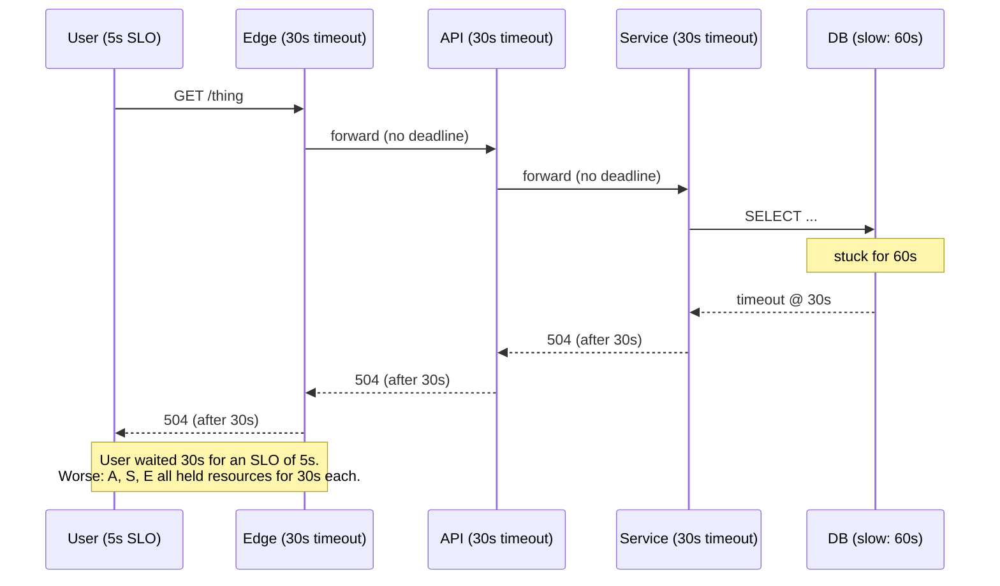
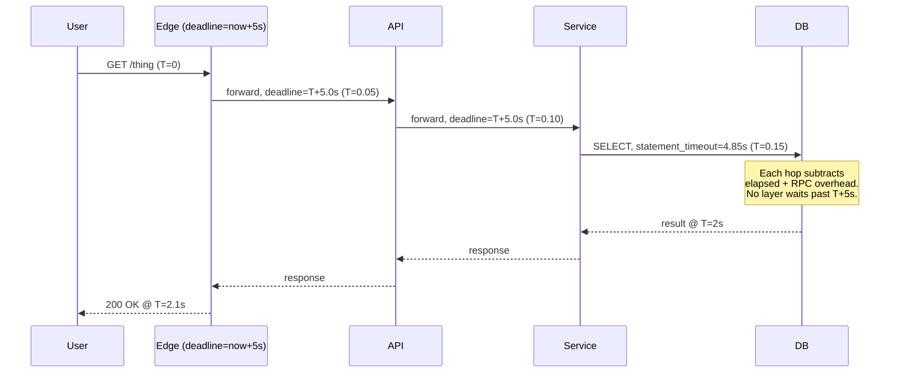

# Timeouts

## Why This Exists

**Problem.** Networks fail in three ways: fast-success, fast-failure, and *infinite-wait*. The third is the dangerous one. A TCP connection with no data flowing looks identical to a healthy idle connection. A blocked thread holding a database connection looks identical to a fast one. Without an explicit ceiling on every wait, slow becomes equivalent to broken — and broken propagates upward as the caller's threads, connections, and goroutines pile up behind the stuck call.

**Key insight.** *Every wait must have a ceiling, and every ceiling must be derived from a budget the caller actually has.* A 30-second timeout on the database is not a property of the database — it is a property of the SLO of the request that owns that database call. If your service promises p99 < 500ms and you wait 30s on a dependency, you are lying. Timeouts are not a defensive afterthought; they are the only mechanism by which "availability" is even definable in a distributed system.

**Reach for this when:**
- A request can hang for longer than your SLO allows.
- You are calling anything across a network: HTTP, gRPC, DB, cache, queue, DNS, file system on NFS, even `localhost` (the kernel can stall).
- Threads/goroutines/connections are piling up under load.
- p99 latency spikes are wildly disconnected from p50 (classic queueing under timeout-less waits).
- Retries are amplifying load on a struggling dependency (you need timeout *plus* budget propagation).
- You are designing an RPC API and need to expose a deadline mechanism to clients.

**Don't reach for this when:**
- The work is genuinely long-running and the answer is *not* a timeout but an async job + status polling (e.g. video transcoding, report generation). Use a job system, not a 30-minute HTTP timeout.
- Latency-sensitive in-process work where a watchdog or circuit breaker is the better tool. Timeouts are for *waits*, not for CPU-bound code (you cannot interrupt a Python C extension by setting a socket timeout).
- The semantics of "give up" are ambiguous and dangerous (e.g. you've already SENT a payment instruction; timing out the read does not undo the write — see idempotency).

---

## Diagrams

### The cascading-timeout problem

When timeouts are not propagated, a slow leaf forces every upstream layer to wait its full budget against the same slow call. The user-perceived timeout is the *sum* of layer budgets, not the *max*.



### Deadline propagation: the ceiling shrinks at every hop



### Connection vs read vs total


The four timeouts answer different questions:
- **connect_timeout** — "Is this host even reachable?"
- **write_timeout** — "Is the server accepting my upload?"
- **read_timeout** — "Is the server still alive *between bytes*?" (idle gap, NOT total)
- **total/deadline** — "Have I run out of budget for this whole operation?"

A naive `read_timeout=30s` on a streaming response can wait *forever* if the server emits one byte every 29 seconds. Only the total deadline catches that.

---

## The Anatomy of a Wait

Any cross-process call decomposes into stages, each with its own failure mode:

| Stage | What it measures | Typical default | What goes wrong without it |
|---|---|---|---|
| DNS resolution | Time to resolve hostname | 5s (often unbounded in stdlibs!) | Resolver fails open, request hangs forever. |
| TCP connect | SYN → SYN-ACK → ACK | 30s (Linux default, way too high) | Half-open NAT or dead host stalls thread. |
| TLS handshake | ClientHello → Finished | Often bundled into connect | Cert revocation lookup hangs. |
| Write request | Last byte sent | Depends on body size | Server applies backpressure forever. |
| Time-to-first-byte (TTFB) | Server starts responding | App-defined | Server accepted but is doing slow work. |
| Read between chunks | Idle gap during streaming | App-defined | Slowloris-style trickle. |
| Total wall-clock | Whole operation | App-defined (this is your *real* SLO) | Everything above can be "fine" yet sum to a minute. |

**Rule:** if your library exposes only one timeout knob, you do not have timeouts — you have a placebo. Verify there is a *deadline* (wall-clock total), not just an idle/per-chunk timeout.

---

## Per-Attempt vs Per-Call (Per-Request) Budgets

This is the most-confused distinction in the field. Get it wrong and your "1s timeout with 3 retries" silently becomes a 30s call.

- **Per-attempt timeout** — applies to a *single* network attempt. If you retry, the clock resets.
- **Per-call (per-request) deadline** — applies to the *entire* logical operation, including all retries, hedges, and queue waits. The clock does NOT reset.

If you only set per-attempt, the worst-case latency is `attempts × per_attempt_timeout` plus backoff. With 3 attempts × 5s + jittered backoff, that's >15s — even though you wrote `timeout=5s`.

```python
# WRONG: per-attempt only. Worst case ~ 3 * 5s + backoff = ~17s.
import requests, time
from requests.adapters import HTTPAdapter
from urllib3.util.retry import Retry

session = requests.Session()
retries = Retry(total=3, backoff_factor=0.5, status_forcelist=[502, 503, 504])
session.mount("https://", HTTPAdapter(max_retries=retries))
resp = session.get("https://api.example.com/thing", timeout=(2, 5))  # connect=2s, read=5s
# This is per-attempt. There is no overall ceiling.
```

```python
# RIGHT: per-call deadline that ALSO bounds retries.
import time, requests
from requests.exceptions import RequestException

def get_with_deadline(url: str, total_deadline_s: float):
    start = time.monotonic()
    attempt = 0
    while True:
        attempt += 1
        remaining = total_deadline_s - (time.monotonic() - start)
        if remaining <= 0:
            raise TimeoutError(f"deadline exceeded after {attempt-1} attempts")
        # Each attempt gets at most the remaining budget, capped at a per-attempt ceiling.
        per_attempt = min(remaining, 2.0)
        try:
            return requests.get(url, timeout=(0.5, per_attempt))
        except (RequestException, TimeoutError) as e:
            # Backoff, but never sleep past the deadline.
            backoff = min(0.1 * (2 ** (attempt - 1)), remaining - 0.05)
            if backoff <= 0:
                raise TimeoutError("deadline exceeded during backoff") from e
            time.sleep(backoff)
```

Frameworks that get this right out of the box:
- **gRPC** — `Deadline` is per-call by default and propagates through metadata. `grpc.Context` in Go carries it.
- **Envoy** — distinguishes `route.timeout` (per-call) from `retry_policy.per_try_timeout` (per-attempt).
- **AWS SDK v2** — `apiCallTimeout` (per-call) vs `apiCallAttemptTimeout` (per-attempt).
- **Istio VirtualService** — `timeout` (per-call) vs `retries.perTryTimeout`.

If your tool exposes only one, you must build the other yourself.

---

## Deadline Propagation

A deadline is a *wall-clock instant* ("by 14:32:01.250 UTC") — not a duration. When propagated, every hop subtracts its own latency from the remaining budget and passes the rest along. The leaf node should know it has, e.g., 142ms left, not "5 seconds."

### gRPC: deadlines are first-class

gRPC bakes deadline propagation into the protocol via the `grpc-timeout` HTTP/2 header. Servers expose the remaining deadline through the request `Context`, and any outbound RPC made with that context inherits the (decremented) deadline automatically.

```go
// Go gRPC server: deadline propagated automatically through ctx.
func (s *Server) GetThing(ctx context.Context, req *pb.GetThingReq) (*pb.GetThingResp, error) {
    // The deadline came in via grpc-timeout header. It's already in ctx.
    if deadline, ok := ctx.Deadline(); ok {
        remaining := time.Until(deadline)
        if remaining < 50*time.Millisecond {
            // Don't even start work we know we can't finish.
            return nil, status.Error(codes.DeadlineExceeded, "insufficient budget")
        }
    }

    // Outbound call: ctx carries the deadline. The DB client must honor it.
    row := s.db.QueryRowContext(ctx, "SELECT ...", req.Id)
    // pgx, database/sql, etc. all check ctx.Done() and cancel the underlying socket.
    ...
}

// Caller sets deadline once, at the edge.
ctx, cancel := context.WithTimeout(context.Background(), 500*time.Millisecond)
defer cancel()
resp, err := client.GetThing(ctx, req)  // deadline travels with the call
```

```python
# Python gRPC: pass timeout (relative seconds) per call.
# Server-side: context.time_remaining() gives the live budget.
def GetThing(self, request, context):
    remaining = context.time_remaining()
    if remaining is None or remaining < 0.05:
        context.abort(grpc.StatusCode.DEADLINE_EXCEEDED, "insufficient budget")
    # When calling out, pass min(remaining - overhead, per_call_cap).
    downstream_timeout = max(0.0, remaining - 0.02)
    return downstream_stub.Other(req, timeout=downstream_timeout)
```

### Plain HTTP: propagate via context, header, or both

HTTP doesn't have a standard deadline header (the W3C `traceparent` and `Server-Timing` cousins notwithstanding). Common approaches:

1. **Internal-only header** like `X-Request-Deadline-Ms-Remaining`, parsed by every internal service.
2. **Pass deadline via your in-process context** (Go `context.Context`, Python `contextvars`, structured concurrency scope) and have the HTTP client honor it.
3. **OpenTelemetry baggage** for cross-service propagation.

```go
// Go HTTP: every server handler creates a request-scoped deadline,
// which the http.Client respects via ctx.
func handle(w http.ResponseWriter, r *http.Request) {
    deadlineMs := parseHeaderInt(r.Header.Get("X-Deadline-Ms"), 500)
    ctx, cancel := context.WithTimeout(r.Context(), time.Duration(deadlineMs)*time.Millisecond)
    defer cancel()

    req, _ := http.NewRequestWithContext(ctx, "GET", "https://downstream/...", nil)
    // The client cancels the in-flight request when ctx fires. No extra timeout knob needed.
    resp, err := http.DefaultClient.Do(req)
    ...
}
```

---

## Cascading-Timeout Budgets

A request's total budget is shared across its dependencies. You cannot set every downstream call to the full SLO; if you make 3 sequential calls each timed at 500ms with a 500ms SLO, you've guaranteed SLO violation under partial slowness.

### Sequential budget split

```
SLO = 500ms
overhead (parsing, marshalling, GC pauses) ≈ 50ms
remaining = 450ms

If 3 sequential calls:
  each call gets ~150ms hard cap (worst case)
  in practice: budget shrinks per hop based on actual elapsed
```

### Parallel calls share the *max*, not the *sum*

```
3 parallel calls under a 450ms budget:
  each call sees 450ms ceiling
  the slowest one defines latency
  fan-out is cheaper than fan-down
```

### A budget-aware client wrapper

```go
type Budget struct {
    Deadline time.Time
}

func NewBudget(d time.Duration) *Budget {
    return &Budget{Deadline: time.Now().Add(d)}
}

// Allocate returns a child budget that uses fraction f of the remaining time,
// reserving overheadHeadroom for the caller's post-processing.
func (b *Budget) Allocate(f float64, overheadHeadroom time.Duration) (context.Context, context.CancelFunc, error) {
    remaining := time.Until(b.Deadline) - overheadHeadroom
    if remaining <= 0 {
        return nil, nil, errors.New("deadline exceeded before allocation")
    }
    childDur := time.Duration(float64(remaining) * f)
    if childDur < 10*time.Millisecond {
        return nil, nil, errors.New("budget too small to be useful")
    }
    return context.WithTimeout(context.Background(), childDur)
}

// Usage in a handler with a 500ms SLO:
func handle(parent context.Context) error {
    budget := NewBudget(500 * time.Millisecond)

    // First call: 40% of remaining, leave 20ms for our work after.
    ctx1, cancel1, err := budget.Allocate(0.4, 20*time.Millisecond)
    if err != nil { return err }
    defer cancel1()
    a, err := svcA.Get(ctx1)
    if err != nil { return err }

    // Second call: 60% of NEW remaining, leave 10ms.
    ctx2, cancel2, err := budget.Allocate(0.6, 10*time.Millisecond)
    if err != nil { return err }
    defer cancel2()
    b, err := svcB.Get(ctx2, a)
    return err
}
```

This "fraction of remaining" model is robust: if call A is fast, call B inherits more budget. If call A is slow, B fails fast instead of starting work it cannot finish.

---

## Database Timeouts: Multiple Layers, All Required

Databases are the worst offender for missing timeouts because there are at least four independent layers, each with its own knob:

| Layer | Postgres example | What it bounds |
|---|---|---|
| Driver socket | `pgx.ConnConfig.ConnectTimeout`, `RuntimeParams["statement_timeout"]` | TCP connect, idle reads. |
| Statement timeout | `SET statement_timeout = '500ms'` (server-side) | Server kills query past N ms. |
| Lock timeout | `SET lock_timeout = '100ms'` | Wait for row/table locks. |
| Idle-in-transaction | `SET idle_in_transaction_session_timeout = '5s'` | Kills BEGIN-but-not-COMMITTED clients. |
| Pool acquisition | `pool.AcquireTimeout` | Waiting for a free connection. |

Setting only the driver-level timeout leaves the *server* still chewing on the query for hours after the client gave up. Production-grade configs set all of them.

```sql
-- Postgres: set per-connection on session start.
SET statement_timeout = '2s';
SET lock_timeout = '200ms';
SET idle_in_transaction_session_timeout = '10s';
```

```go
// pgx: enforce server-side timeouts on every connection.
config, _ := pgxpool.ParseConfig(dsn)
config.ConnConfig.RuntimeParams["statement_timeout"] = "2000"   // ms
config.ConnConfig.RuntimeParams["lock_timeout"] = "200"
config.ConnConfig.RuntimeParams["idle_in_transaction_session_timeout"] = "10000"
config.MaxConnLifetime = 30 * time.Minute  // also recycle so stuck conns die

// Per-query, derive from request context.
func GetUser(ctx context.Context, db *pgxpool.Pool, id int64) (*User, error) {
    // Acquire respects ctx (pool wait timeout).
    // QueryRow respects ctx (cancels mid-query via PG protocol).
    var u User
    err := db.QueryRow(ctx, "SELECT id, name FROM users WHERE id=$1", id).
        Scan(&u.ID, &u.Name)
    return &u, err
}
```

---

## HTTP Client Defaults: Almost Always Wrong

Most stdlib HTTP clients ship with **no timeout at all**. This is a footgun.

```go
// DANGEROUSLY WRONG — Go's default client has NO timeout.
resp, err := http.Get(url)  // can hang forever

// CORRECT — explicit Transport-level + per-request deadline.
client := &http.Client{
    Transport: &http.Transport{
        DialContext: (&net.Dialer{
            Timeout:   500 * time.Millisecond, // TCP connect
            KeepAlive: 30 * time.Second,
        }).DialContext,
        TLSHandshakeTimeout:   500 * time.Millisecond,
        ResponseHeaderTimeout: 1 * time.Second,  // TTFB
        IdleConnTimeout:       90 * time.Second,
        MaxIdleConnsPerHost:   100,
        ExpectContinueTimeout: 1 * time.Second,
    },
    Timeout: 5 * time.Second, // total wall-clock; use ctx for finer control
}
```

```python
# requests: pass tuple for (connect, read). Read is per-chunk, not total!
# For total wall-clock, wrap in your own deadline.
resp = requests.get(url, timeout=(0.5, 2.0))

# httpx (preferred for new code): granular and supports total via Timeout.
import httpx
timeout = httpx.Timeout(connect=0.5, read=2.0, write=1.0, pool=0.2)
client = httpx.Client(timeout=timeout)
```

```java
// Java HttpClient: per-connect on builder, per-request via .timeout(...).
HttpClient client = HttpClient.newBuilder()
    .connectTimeout(Duration.ofMillis(500))
    .build();
HttpRequest req = HttpRequest.newBuilder(URI.create(url))
    .timeout(Duration.ofSeconds(2))   // total wall-clock
    .GET().build();
```

```typescript
// Node fetch + AbortSignal.timeout (Node 18+).
const ac = AbortSignal.timeout(2000);
const resp = await fetch(url, { signal: ac });
// Note: this aborts at 2s wall-clock, not idle. Pair with Keep-Alive agents
// for connect timeouts via undici.Agent({ connect: { timeout: 500 } }).
```

---

## Trade-offs

| Benefit | Cost |
|---|---|
| Bounded latency: no thread or goroutine waits forever. | Choosing the right value is hard; too tight causes spurious failures, too loose defeats the point. |
| Cascading failures contained: a slow leaf cannot drag down the whole call graph. | Aggressive timeouts during partial slowness cause retry storms — you must combine timeouts with retry budgets and circuit breakers. |
| Resources (connections, threads) released when work is abandoned. | Cancellation semantics are language- and library-specific; many libraries swallow `context.Done()` or block in C extensions. |
| Deadlines propagate naturally — clients dictate "how long to try" without coordination. | Requires platform-wide adoption (gRPC, Envoy, instrumented HTTP clients). One non-deadline-aware service breaks the chain. |
| Fast-fail signal lets clients hedge, fall back, or degrade gracefully. | Premature `DeadlineExceeded` errors masquerade as "service down" in dashboards; need clear separation in observability. |
| Server can shed work it cannot finish anyway, improving capacity under load. | Naive timeouts kill long-running side effects mid-flight (writes, payments). Idempotency keys and saga compensations become mandatory. |
| Statement-level DB timeouts protect the database from runaway queries. | Cross-cutting tuning; must be set at driver, server, pool, and lock layers — missing any layer leaves a gap. |

---

## Common Pitfalls

- **No timeout at all.** Stdlib HTTP clients in Go (`http.Get`) and Python (`requests` with no `timeout=`) hang forever. The most common production outage cause is "we never noticed because it took six hours to surface."
- **Idle timeout mistaken for total timeout.** A `read_timeout=5s` on a streaming response with a server emitting one byte every 4.9s waits forever. Always set a wall-clock total.
- **Per-attempt timeout × retries silently > SLO.** `timeout=5s, retries=3` is a 15-second worst case, not 5. Always cap with a per-call deadline.
- **Resetting the budget on retry.** Retry libraries that recompute timeout from the original duration, not the remaining deadline. Verify with a slow-server fault injection.
- **Server keeps working after client gives up.** A Postgres query running for 30s after the client closed the socket. Set server-side `statement_timeout`, not just driver timeout.
- **Connection pool waits unbounded.** All connections busy → new requests block on `pool.acquire()` for minutes. Always set `acquire_timeout`.
- **Backoff sleep eats the deadline.** Exponential backoff with jitter sleeps for 8 seconds inside a 5-second deadline. Cap each sleep to `min(backoff, remaining_budget - epsilon)`.
- **DNS hangs forever.** Many resolvers have no timeout on glibc. Set `RES_OPTIONS="timeout:1 attempts:2"` or use a deadline-aware resolver (Go's `net.DefaultResolver` honors ctx; Python's stdlib does not).
- **TLS handshake unbounded.** Go's `Transport` has a separate `TLSHandshakeTimeout` distinct from `Dial`. Easy to miss.
- **Synchronous external calls inside a DB transaction.** A 30-second HTTP timeout means a 30-second open transaction holding row locks. Always pull external calls outside the transaction.
- **Premature timeout on cold-start dependencies.** Lambdas/containers warming up legitimately take 3-5s on first call. Distinguish startup from steady-state and possibly use a longer first-attempt budget.
- **No timeout on goroutine/thread joins.** `wg.Wait()`, `thread.join()`, `Future.get()` without a timeout. Same problem in a different costume.
- **Over-tight global timeouts breaking long-tail traffic.** A 200ms global API timeout that legitimately needs 2s for one rare endpoint. Use route-specific timeouts.
- **`DeadlineExceeded` retried as if it were a transient failure.** It often isn't — the request may have *completed* successfully on the server but the response was lost. Treat as ambiguous; require idempotency.
- **Health-check timeout shorter than dependency timeout.** Healthcheck fails fast and the LB removes the host while the dependency is merely slow. Healthchecks should reflect *capacity*, not chase tail latency.

---

## Decision Table

| Situation | Use this | Don't use this | Why |
|---|---|---|---|
| Internal RPC inside a deadline-aware mesh | gRPC deadline propagated via `Context` | Static per-call timeout | Caller's SLO travels with the request; leaves can fast-fail. |
| Public HTTP API call to third party | Per-call deadline + per-attempt timeout + bounded retries | "Just set a 30-second timeout" | Per-attempt without per-call lets retries blow past the SLO. |
| DB query in a request handler | `statement_timeout` + ctx-aware driver + pool acquire timeout | Driver-only timeout | Server keeps grinding after client gives up. |
| Long-running job (> ~30s) | Async job + status polling + per-stage timeouts | One giant HTTP timeout | HTTP wasn't meant for it; LBs/proxies have their own caps (often 60s). |
| Streaming response | Total deadline + per-chunk read timeout | Single read_timeout | Slow trickle defeats per-chunk; total catches it. |
| In-process compute (CPU-bound) | Watchdog / cancellation token / structured concurrency cancel | Socket timeouts | Sockets aren't involved; you need cooperative cancellation. |
| Hedged request (issue 2 in flight, take first) | Per-attempt timeout + per-call deadline + early cancel of loser | Sequential retry | Hedging trades capacity for tail latency; both timeouts still required. |
| Healthcheck endpoint | Tight, fixed timeout independent of request context | Inherit from caller | Healthchecks measure liveness, not user latency. |
| Background reconciliation loop | Per-iteration timeout + total run timeout | Daemon with no bounds | "Stuck reconciler" is a real outage class. |
| Saga / multi-step payment | Per-step timeout + idempotency key + compensating action | Single retry loop | Timeout on a write does not undo it. |

---

## References

- gRPC — *Deadlines* (official docs) — https://grpc.io/docs/guides/deadlines/
- gRPC — *Wait for Ready / Deadlines* blog — https://grpc.io/blog/deadlines/
- Google SRE Book — *Handling Overload* (ch. 21) — https://sre.google/sre-book/handling-overload/
- Google SRE Book — *Addressing Cascading Failures* (ch. 22) — https://sre.google/sre-book/addressing-cascading-failures/
- Google SRE Workbook — *Managing Load* — https://sre.google/workbook/managing-load/
- AWS Builders' Library — *Timeouts, Retries, and Backoff with Jitter* (Marc Brooker) — https://aws.amazon.com/builders-library/timeouts-retries-and-backoff-with-jitter/
- AWS Builders' Library — *Avoiding Insurmountable Queue Backlogs* — https://aws.amazon.com/builders-library/avoiding-insurmountable-queue-backlogs/
- AWS Builders' Library — *Avoiding Fallback in Distributed Systems* — https://aws.amazon.com/builders-library/avoiding-fallback-in-distributed-systems/
- Marc Brooker — *Timeouts, retries, and backoff with jitter* (blog) — https://brooker.co.za/blog/2015/03/21/backoff.html
- Envoy — *Timeouts* documentation — https://www.envoyproxy.io/docs/envoy/latest/faq/configuration/timeouts
- Istio — *Setting request timeouts* — https://istio.io/latest/docs/tasks/traffic-management/request-timeouts/
- PostgreSQL — *Statement Timeout* (runtime config) — https://www.postgresql.org/docs/current/runtime-config-client.html
- DDIA (Kleppmann, 2017) — ch. 8 *The Trouble with Distributed Systems* (unbounded network delays) and ch. 9 *Consistency and Consensus* (timeouts and failure detection).
- Pat Helland — *Idempotence Is Not a Medical Condition* (ACM Queue) — https://queue.acm.org/detail.cfm?id=2187821 (why timeout + retry requires idempotency)
- Adrian Cockcroft — *Failure Modes and Continuous Resilience* — https://adrianco.medium.com/failure-modes-and-continuous-resilience-6553078cb866
- Peter Bailis — *The network is reliable* — https://queue.acm.org/detail.cfm?id=2655736
- Building Secure and Reliable Systems (Beyer et al.) — ch. 8 *Design for Resilience* — https://sre.google/books/building-secure-reliable-systems/

---

## See Also

- ../retries/ — timeouts without bounded retries amplify failure; retries without deadlines blow past SLOs.
- ../circuit-breakers/ — when timeouts repeatedly fire, stop calling and shed load.
- ../backpressure/ — the upstream-side answer to "I'm running out of budget."
- ../bulkheads/ — isolate pools so one timeout-prone dependency cannot exhaust shared threads.
- ../idempotency/ — required whenever a `DeadlineExceeded` may have actually completed on the server.
- ../load-shedding/ — server-side counterpart: drop work whose deadline is already gone.
- ../hedged-requests/ — using deadlines to issue parallel attempts and take the fastest.
- ../health-checks/ — distinct timeout discipline from request-path timeouts.
- ../slo-error-budgets/ — the upstream contract that determines what your timeout *should* be.
- ../../observability/latency-percentiles/ — measuring whether your timeouts match real latency distributions.
- ../../observability/distributed-tracing/ — how to see deadline propagation in a trace waterfall.
- ../../patterns/saga/ — long-running flows where one timeout cannot bound the whole operation.
