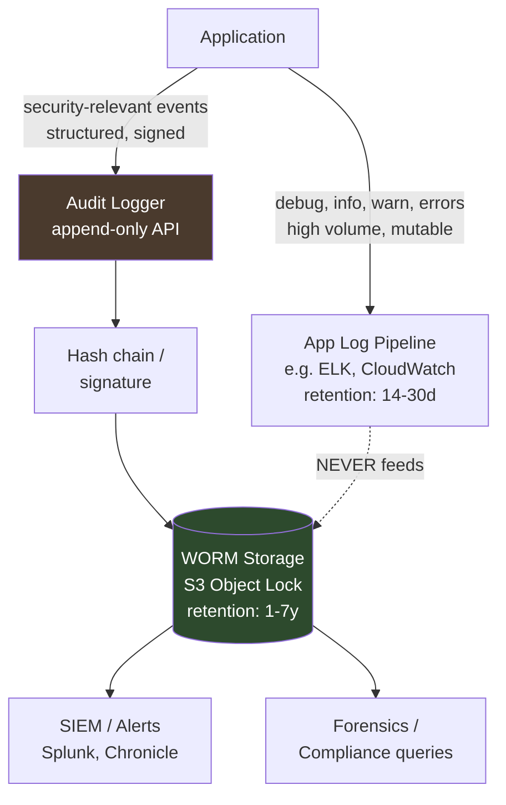
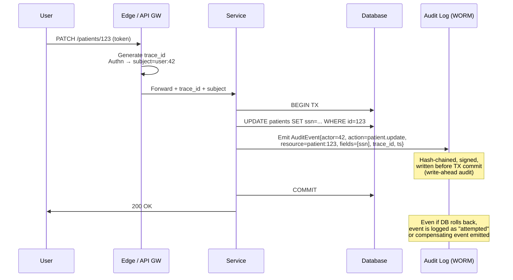

# Audit Logging

## Why This Exists

**Problem.** Application logs and audit logs solve different problems and they keep getting confused. App logs are for engineers debugging at 3am — verbose, noisy, rotated aggressively, mutable, full of stack traces. Audit logs are for *the future you don't want* — a regulator asking "prove no one read this patient's record between Jan and March," an attacker who got `root` and tried to cover their tracks, a disgruntled employee exfiltrating customer data, a lawsuit demanding seven years of evidence. If you can't tell *who did what to which resource, when, from where, and whether the record was modified after the fact*, you do not have an audit log. You have a log file with the word "audit" in the name.

**Key insight.** Audit logging is fundamentally an **append-only, integrity-protected, retention-bound** stream of *security-relevant events* — not all events. The hardest parts are: (1) deciding what's in scope, (2) keeping secrets and PII *out* of the log, (3) making the log tamper-evident so an attacker who pwns your app can't rewrite history, and (4) correlating one user action across a distributed system. Everything else is plumbing.

**Reach for this when:**
- Building any system handling auth, money, health data, or PII (SOC 2 CC7.2, HIPAA §164.312(b), PCI-DSS Req 10, GDPR Art. 30, SOX §404).
- Designing the "Activity" / "Audit Trail" UI customers expect to see in B2B SaaS.
- Investigating an incident and realizing your existing logs aren't trustworthy as evidence.
- Adding an admin action (impersonation, data export, permission change) that would be embarrassing to lose.

**Don't reach for this when:**
- You need *debugging* logs — use structured app logs (../../observability/structured-logging/) and stop conflating them.
- You need *metrics* on event rates — use a metrics pipeline, audit logs are too expensive per event.
- The data is purely operational (cache misses, GC pauses) — these don't belong in an audit stream.

## Diagrams

### Two log pipelines, one application



### Lifecycle of one auditable action



## What to log — and what NOT to log

OWASP's Logging Cheat Sheet and NIST SP 800-92 converge on the same minimum schema. Get this right *before* you worry about storage.

### The "5 W's" every audit event must answer

| Field | Example | Notes |
|---|---|---|
| **Who (actor)** | `user:42` + `service-account:billing-cron` + `session_id` | Both human and machine principals. Distinguish the two. |
| **What (action + outcome)** | `patient.update` / `success` or `auth.login` / `failure:bad_password` | Verb in past tense, **always log failures** — they're often more interesting than successes. |
| **When** | `2026-06-05T14:23:01.412Z` | UTC, ISO-8601, millisecond precision, monotonic if possible. |
| **Where (source)** | `ip=10.2.3.4`, `user_agent=...`, `region=us-east-1`, `service=patient-svc@v1.42` | Caller IP *and* the service that produced the event. |
| **On what (target)** | `resource=patient:123`, `fields_changed=[ssn, dob]` | Stable IDs, not human-readable names that change. |
| **Correlation** | `trace_id`, `request_id`, `tenant_id` | Stitches one user action across N services. Non-negotiable. |

Add: `event_id` (UUIDv7, unique), `prev_hash` (for chain), `schema_version`.

### Events that MUST be audited

Per OWASP Logging Cheat Sheet + NIST 800-92 §2.3:

- **Authentication**: login success, login failure, logout, MFA challenges, password change, session creation, token issuance/revocation.
- **Authorization**: permission grants/revocations, role changes, access denied (HTTP 403), privilege escalation attempts.
- **Account lifecycle**: create, disable, enable, delete, lockout, unlock.
- **Data access on sensitive resources**: PHI/PII reads (HIPAA "minimum necessary"), card data access (PCI), exports, bulk reads.
- **Data mutations on sensitive resources**: create/update/delete with before+after values (or hash thereof if too large).
- **Admin / privileged actions**: config changes, feature flags, impersonation ("act-as"), customer-data exports, key rotation.
- **Security-relevant errors**: signature failures, integrity check failures, rate-limit triggers, WAF blocks.
- **Audit pipeline itself**: log-config changes, retention changes, integrity-check results.

### Events that MUST NOT appear in audit logs

This is where most teams blow it. **Once a secret hits a log line, assume it leaked** — logs go to SIEMs, S3 buckets, support tooling, third-party vendors, and developer laptops. Treat logs as a low-trust surface.

| Never log | Why | What to log instead |
|---|---|---|
| Passwords (plaintext OR hashed) | Hashes are still credentials at scale + crackable offline. | "auth.login outcome=failure" — never the attempted password. |
| Bearer tokens, API keys, session cookies, JWTs | Replayable. A single grep through SIEM = account takeover. | `token_id` (last 4 chars + key fingerprint) or jti claim. |
| OAuth refresh tokens, client secrets | Same. | Client ID only. |
| Full credit card PAN, CVV, track data | PCI-DSS Req 3.2 forbids storing CVV *anywhere*. | First 6 + last 4 (BIN + last4) ONLY. |
| Full SSN, full passport, full driver's license | PII; HIPAA / GLBA / state breach laws. | Last 4 + a tokenized reference. |
| Encryption keys, KMS material, private keys | Obvious. | Key ARN / kid only. |
| Personal health details, free-text notes | HIPAA — minimum necessary. | Resource ID + field-name list, not values. |
| Verbatim user input (free-text, file contents) | Could contain any of the above. | Length, type, hash. |

**The redaction problem.** Every team thinks "we'll redact at the edge." Every team gets it wrong eventually because someone passes a secret in a *new* field name. **Defense in depth:**

1. **Type-system-level**: wrap secrets in a `Secret<T>` type that *cannot* be `String()`-ed (panics or returns `***`). See Go example below.
2. **Producer-side allowlist** for audit events (not denylist) — only fields explicitly marked safe go through.
3. **Pipeline-side regex scrubber** (Datadog/Splunk PII rules) as a backstop, not a primary control.
4. **Periodic scan** of stored logs for high-entropy strings (e.g., `detect-secrets`, `trufflehog`) and alert.

## A canonical audit event schema (JSON)

```json
{
  "event_id": "01JBZ8K6XYP4Q9N7T2V5R3W8AC",
  "schema_version": "1.2",
  "occurred_at": "2026-06-05T14:23:01.412Z",
  "received_at": "2026-06-05T14:23:01.487Z",
  "actor": {
    "type": "user",
    "id": "42",
    "tenant_id": "acme-corp",
    "session_id": "sess_8f2a...",
    "auth_method": "saml",
    "impersonated_by": null
  },
  "action": "patient.record.update",
  "outcome": "success",
  "resource": {
    "type": "patient",
    "id": "patient:123",
    "tenant_id": "acme-corp"
  },
  "changes": {
    "fields": ["ssn_last4", "dob"],
    "before_hash": "sha256:9af...",
    "after_hash": "sha256:c12..."
  },
  "context": {
    "trace_id": "4bf92f3577b34da6a3ce929d0e0e4736",
    "request_id": "req_01JBZ8K6...",
    "client_ip": "203.0.113.42",
    "user_agent": "Mozilla/5.0 ...",
    "service": "patient-svc",
    "service_version": "1.42.0",
    "region": "us-east-1"
  },
  "integrity": {
    "prev_hash": "sha256:8a3...",
    "this_hash": "sha256:b91...",
    "signing_key_id": "kms:arn:aws:kms:us-east-1:..."
  }
}
```

## Implementations

### Go — typed secrets that cannot leak into logs

```go
// secret.go — a Secret[T] that refuses to be stringified.
package secrets

import "fmt"

type Secret[T any] struct{ v T }

func New[T any](v T) Secret[T] { return Secret[T]{v: v} }

// Reveal is the ONLY way to extract; intentionally verbose name so it greps.
func (s Secret[T]) Reveal() T { return s.v }

// String is what fmt.Printf("%v"), log.Print, json.Marshal-via-Stringer hit.
func (s Secret[T]) String() string { return "***REDACTED***" }
func (s Secret[T]) GoString() string { return "***REDACTED***" }

// MarshalJSON ensures encoding/json never serializes the underlying value.
func (s Secret[T]) MarshalJSON() ([]byte, error) {
	return []byte(`"***REDACTED***"`), nil
}

// Usage:
//   pw := secrets.New("hunter2")
//   log.Printf("user logged in pw=%v", pw)        // -> "pw=***REDACTED***"
//   json.Marshal(struct{ PW secrets.Secret[string] }{pw})  // -> {"PW":"***REDACTED***"}
//   fmt.Println(pw.Reveal())                       // -> "hunter2", grepable
var _ = fmt.Stringer(Secret[string]{})
```

### Go — append-only audit logger with hash chain

```go
// audit.go — minimal hash-chained audit logger. Production version adds:
// - signing via KMS, batching, async durability, schema validation.
package audit

import (
	"crypto/sha256"
	"encoding/hex"
	"encoding/json"
	"fmt"
	"sync"
	"time"
)

type Event struct {
	EventID     string            `json:"event_id"`
	OccurredAt  time.Time         `json:"occurred_at"`
	Actor       Actor             `json:"actor"`
	Action      string            `json:"action"`
	Outcome     string            `json:"outcome"` // "success" | "failure:<reason>"
	Resource    Resource          `json:"resource"`
	Context     map[string]string `json:"context"`
	PrevHash    string            `json:"prev_hash"`
	ThisHash    string            `json:"this_hash,omitempty"`
}
type Actor struct{ Type, ID, TenantID, SessionID string }
type Resource struct{ Type, ID, TenantID string }

type Logger struct {
	mu       sync.Mutex
	prevHash string
	sink     Sink // append-only writer (S3 Object Lock, Kafka w/ immutable topic, etc.)
}
type Sink interface{ Append(line []byte) error }

func (l *Logger) Emit(e Event) error {
	l.mu.Lock()
	defer l.mu.Unlock()

	e.PrevHash = l.prevHash
	// canonical hash input: serialize everything EXCEPT ThisHash.
	e.ThisHash = ""
	body, err := json.Marshal(e)
	if err != nil {
		return fmt.Errorf("marshal: %w", err)
	}
	sum := sha256.Sum256(body)
	e.ThisHash = "sha256:" + hex.EncodeToString(sum[:])

	final, _ := json.Marshal(e)
	if err := l.sink.Append(final); err != nil {
		// CRITICAL: do NOT advance prevHash if persist failed —
		// otherwise a gap in the chain becomes invisible.
		return fmt.Errorf("append: %w", err)
	}
	l.prevHash = e.ThisHash
	return nil
}

// Verify walks the chain and returns the index of the first broken link, or -1.
func Verify(events []Event) int {
	prev := ""
	for i, e := range events {
		if e.PrevHash != prev {
			return i
		}
		expected := e.ThisHash
		e.ThisHash = ""
		body, _ := json.Marshal(e)
		sum := sha256.Sum256(body)
		got := "sha256:" + hex.EncodeToString(sum[:])
		if got != expected {
			return i
		}
		prev = expected
	}
	return -1
}
```

### Python/Django — emitting an audit event from a view, with correlation

```python
# audit.py
import logging, uuid, time
from contextvars import ContextVar
from typing import Any
import json

trace_id_var: ContextVar[str] = ContextVar("trace_id", default="")

audit_log = logging.getLogger("audit")  # configured to ship to a SEPARATE sink

# Allowlist of fields that may appear in 'changes'. Anything else is dropped.
SAFE_FIELDS = {"email", "role", "status", "ssn_last4", "dob_year"}

def emit(actor_id: str, action: str, outcome: str, resource_type: str,
         resource_id: str, changes: dict[str, Any] | None = None,
         tenant_id: str = "", request=None) -> None:
    safe_changes = None
    if changes:
        safe_changes = {k: v for k, v in changes.items() if k in SAFE_FIELDS}
        dropped = set(changes) - SAFE_FIELDS
        if dropped:
            # Log the metadata, not the values, of dropped fields.
            safe_changes["_dropped_unsafe_fields"] = sorted(dropped)

    event = {
        "event_id": str(uuid.uuid7()) if hasattr(uuid, "uuid7") else str(uuid.uuid4()),
        "occurred_at": time.strftime("%Y-%m-%dT%H:%M:%S.000Z", time.gmtime()),
        "actor": {"id": actor_id, "tenant_id": tenant_id},
        "action": action,
        "outcome": outcome,
        "resource": {"type": resource_type, "id": resource_id},
        "changes": safe_changes,
        "context": {
            "trace_id": trace_id_var.get() or (request.META.get("HTTP_X_TRACE_ID", "") if request else ""),
            "client_ip": request.META.get("REMOTE_ADDR") if request else "",
        },
    }
    audit_log.info(json.dumps(event, separators=(",", ":")))


# views.py
from django.db import transaction
from .audit import emit

def update_patient(request, patient_id):
    try:
        with transaction.atomic():
            patient = Patient.objects.select_for_update().get(pk=patient_id)
            old_email = patient.email
            patient.email = request.data["email"]
            patient.save()
            # Emit AFTER the write succeeds inside the transaction; if the
            # transaction rolls back AFTER emit, you have a "phantom audit"
            # — see "outbox pattern" pitfall below.
            emit(
                actor_id=str(request.user.id),
                action="patient.update",
                outcome="success",
                resource_type="patient",
                resource_id=str(patient.id),
                changes={"email": "<changed>"},  # never log values for PHI
                request=request,
            )
    except PermissionDenied:
        emit(
            actor_id=str(request.user.id),
            action="patient.update",
            outcome="failure:permission_denied",
            resource_type="patient",
            resource_id=str(patient_id),
            request=request,
        )
        raise
```

### SQL — database-side audit trigger (Postgres) for "the DBA can't lie" defense

```sql
-- Triggers run inside the same transaction as the write, which means a
-- successful audit row implies a successful business write. They also catch
-- writes from psql, ORMs, batch jobs, and DBAs — anything app-level logging misses.

CREATE SCHEMA audit;

CREATE TABLE audit.row_history (
    event_id    BIGSERIAL PRIMARY KEY,
    occurred_at TIMESTAMPTZ NOT NULL DEFAULT clock_timestamp(),
    db_user     TEXT NOT NULL DEFAULT session_user,
    app_user    TEXT,                         -- set via SET LOCAL audit.app_user
    trace_id    TEXT,                         -- set via SET LOCAL audit.trace_id
    action      TEXT NOT NULL CHECK (action IN ('I','U','D')),
    table_name  TEXT NOT NULL,
    row_pk      TEXT NOT NULL,
    old_row     JSONB,
    new_row     JSONB
);

-- Append-only enforcement: revoke UPDATE/DELETE even from owners.
REVOKE UPDATE, DELETE, TRUNCATE ON audit.row_history FROM PUBLIC;
ALTER TABLE audit.row_history ENABLE ROW LEVEL SECURITY;

CREATE OR REPLACE FUNCTION audit.log_change() RETURNS trigger AS $$
DECLARE
    v_app_user TEXT := current_setting('audit.app_user', true);
    v_trace_id TEXT := current_setting('audit.trace_id', true);
BEGIN
    INSERT INTO audit.row_history(action, table_name, row_pk, old_row, new_row, app_user, trace_id)
    VALUES (
        CASE TG_OP WHEN 'INSERT' THEN 'I' WHEN 'UPDATE' THEN 'U' ELSE 'D' END,
        TG_TABLE_NAME,
        COALESCE(NEW.id::TEXT, OLD.id::TEXT),
        CASE WHEN TG_OP IN ('UPDATE','DELETE') THEN to_jsonb(OLD) - 'password_hash' END,
        CASE WHEN TG_OP IN ('INSERT','UPDATE') THEN to_jsonb(NEW) - 'password_hash' END,
        v_app_user, v_trace_id
    );
    RETURN COALESCE(NEW, OLD);
END $$ LANGUAGE plpgsql SECURITY DEFINER;

CREATE TRIGGER trg_audit_users
AFTER INSERT OR UPDATE OR DELETE ON users
FOR EACH ROW EXECUTE FUNCTION audit.log_change();

-- App side, per request:
--   SET LOCAL audit.app_user = '42';
--   SET LOCAL audit.trace_id = '4bf92f3577b34da6a3ce929d0e0e4736';
```

## Immutability: append-only and WORM

"Immutable" means **the attacker who owns the writer cannot retroactively edit or delete events**. Levels of paranoia, weakest to strongest:

1. **App-level append-only** — logger has no `Update`/`Delete` API. Trivially defeated by anyone who can write to the storage backend directly.
2. **DB-level append-only** — `REVOKE UPDATE, DELETE` from all roles, including the app role. Defeated by superuser/DBA.
3. **WORM object storage** — S3 Object Lock in **Compliance mode** (`s3:PutObjectRetention` cannot remove the lock, even by the root account, until retention expires). GCS Bucket Lock, Azure Immutable Blob, IBM COS WORM. This is the bar SEC 17a-4 requires for broker-dealers.
4. **Hash-chained / signed events** — even if storage is compromised, gaps and edits are detectable on replay because each event's hash includes the previous. Make the chain **anchored** by periodically publishing the head hash to an external system (a transparency log, a blockchain, an AWS QLDB digest, or just a cron-job that mails the daily hash to compliance).
5. **Cryptographic transparency log (Merkle tree)** — every event is a leaf; periodically publish signed tree heads (STH). This is what Certificate Transparency (RFC 9162) and Sigstore Rekor do. Verifiers can prove inclusion *and* consistency without reading the whole log.

Stack at least 3 + 4 in production. Add 5 if you're storing high-stakes evidence (financial, medical, legal hold).

### S3 Object Lock — Terraform sketch

```hcl
resource "aws_s3_bucket" "audit" {
  bucket = "acme-audit-prod"
  object_lock_enabled = true
}

resource "aws_s3_bucket_object_lock_configuration" "audit" {
  bucket = aws_s3_bucket.audit.id
  rule {
    default_retention {
      mode  = "COMPLIANCE"   # NOT "GOVERNANCE" — Governance can be overridden
      years = 7              # match your retention policy
    }
  }
}

resource "aws_s3_bucket_versioning" "audit" {
  bucket = aws_s3_bucket.audit.id
  versioning_configuration { status = "Enabled" }  # required for Object Lock
}

resource "aws_s3_bucket_lifecycle_configuration" "audit" {
  bucket = aws_s3_bucket.audit.id
  rule {
    id     = "transition-to-glacier"
    status = "Enabled"
    transition { days = 90  storage_class = "GLACIER" }
    transition { days = 365 storage_class = "DEEP_ARCHIVE" }
    # No expiration before Object Lock retention expires.
  }
}
```

## Retention

Pick retention by *the longest applicable rule*, not the shortest. Common floors:

| Regime | Audit retention floor |
|---|---|
| PCI-DSS v4.0 Req 10.5.1 | 1 year (90 days online) |
| HIPAA §164.316(b)(2) | 6 years |
| SOX §802 / §404 | 7 years |
| GDPR Art. 5(1)(e) | "no longer than necessary" — usually drives a *cap*, not a floor; balance with Art. 30 records |
| SEC 17a-4 (broker-dealer) | 6 years, first 2 immediately accessible, WORM |
| FINRA 4511 | 6 years |
| GLBA / state breach laws | typically 3-7 years |

**Tiering.** Keep ~30-90 days hot (queryable from SIEM in seconds), then transition to S3 Glacier / Deep Archive. Hot tier is for incident response; cold tier is for regulators.

**Deletion is part of compliance, not negligence.** Past the retention horizon, *delete*. GDPR + state privacy laws make indefinite retention a liability, not an asset. Codify deletion in lifecycle policies; document why.

## Correlation IDs

A request to `POST /checkout` may fan out to 14 services, 3 message queues, 2 batch jobs, and a partner webhook. Without correlation, "what happened during this checkout" is unanswerable.

**Three IDs you actually want:**

- **`trace_id`** — survives across services. Generate at the edge if absent. Use **W3C Trace Context** (`traceparent` header, RFC 9110-adjacent) — 16-byte random, hex-encoded. OpenTelemetry uses this natively.
- **`request_id`** — per HTTP request. Often equals the root span ID.
- **`tenant_id`** / **`account_id`** — for B2B SaaS, indispensable for "show me everything tenant Acme did this week."

**Implementation rules:**

1. **Generate at the edge** if missing; never trust client-provided trace IDs blindly (they can correlate attacker activity with legitimate traffic to evade SIEM).
2. **Propagate everywhere** — HTTP headers, gRPC metadata, Kafka headers, SQS message attributes, even cron job arguments. A break in the chain is a break in the audit.
3. **Stamp every audit event** with the trace_id of the originating request, even when the event happens 4 hops downstream.
4. **Async work**: when handing off to a queue, copy the trace_id into the message and resume the same trace on the consumer side. Don't generate a fresh one.

```python
# Edge middleware (FastAPI / Django / Flask sketch).
import uuid
from .audit import trace_id_var

W3C_HEADER = "traceparent"  # version-traceid-spanid-flags

def trace_middleware(get_response):
    def middleware(request):
        incoming = request.headers.get(W3C_HEADER, "")
        # Validate format; reject malformed to avoid attacker-controlled IDs.
        trace_id = parse_traceparent(incoming) or uuid.uuid4().hex
        token = trace_id_var.set(trace_id)
        try:
            response = get_response(request)
            response["X-Trace-Id"] = trace_id  # surface to client for support tickets
            return response
        finally:
            trace_id_var.reset(token)
    return middleware
```

## The "audit + DB transaction" problem (write-ahead audit / outbox)

If you `db.commit()` then `audit.emit()` and your process crashes between them, **you lose audit evidence of a real change**. If you `audit.emit()` then `db.commit()` and the commit fails, **you have a phantom audit for an action that never happened**.

Two correct patterns:

### Pattern 1 — Transactional Outbox

Write the audit event into the same database, in the same transaction, into an `audit_outbox` table. A separate worker (CDC like Debezium, or a poller) ships rows from the outbox to the durable audit sink. Same-transaction guarantees at-least-once delivery; idempotency on the consumer (event_id is the key) handles duplicates.

```sql
BEGIN;
UPDATE patients SET email = $1 WHERE id = $2;
INSERT INTO audit_outbox(event_id, payload) VALUES ($3, $4);
COMMIT;
-- Outbox worker: SELECT ... FOR UPDATE SKIP LOCKED, ship to S3, DELETE.
```

### Pattern 2 — Write-Ahead Audit + Compensating Events

Emit the event before the write with `outcome=attempted`, do the write, emit a follow-up `outcome=success|failure` keyed by the same `event_id`. Auditors reconstruct truth by joining on `event_id`. More events, simpler infra.

## Trade-offs

| Benefit | Cost |
|---|---|
| Tamper-evident hash chain catches edits / deletes | All readers must verify chain; gap recovery is painful (single missing event halts verification of the suffix) |
| WORM Compliance mode survives root-account compromise | You cannot delete *anything* before retention expires — including events written by mistake or containing leaked PII |
| Database triggers catch every write incl. DBA actions | Triggers run inside business transactions — slow writes, can deadlock; harder to evolve schema |
| Correlation IDs make incident response 10x faster | Every service must propagate them; one missing hop creates blind spots |
| Separate audit pipeline from app logs | 2x infra cost, 2x dashboards, devs forget to use the right one |
| Field allowlist prevents secret leakage | New legitimate fields require a code change; backward-compat schema migrations |
| Async outbox decouples audit durability from request latency | Eventual consistency: SIEM lag of seconds-to-minutes; "where is my event" debugging |
| Long retention satisfies regulators | Storage cost, GDPR right-to-erasure conflicts, e-discovery cost in litigation |
| Signed events prove provenance to a third party | Key management — KMS keys must outlive the events; rotation requires re-signing or chained keys |

## Common Pitfalls

- **Conflating app logs and audit logs.** "We use ELK for both" → engineers grep production for debugging, accidentally filter out audit events, then the events get lost in a log-rotation policy designed for noisy app logs. **Two pipelines, two retentions, two access policies.** Audit logs should be readable by Security and Compliance, not by every on-call engineer.
- **Logging the password on a failed login.** Every. Major. Breach. Postmortem. has this. The "helpful" debug log left in by an engineer in 2019 leaks 80M credentials in 2024. Type-system-level redaction is the only durable fix.
- **Logging full JWT / bearer token in `Authorization` header dumps.** A grep through Splunk = account takeover at scale. Strip headers at the edge; hash if you must correlate.
- **PII in free-text fields.** "User submitted feedback" → user pasted their SSN. Never log raw user input; log length + hash.
- **No correlation ID on async/batch jobs.** Cron job at 3am modifies 10k records. Auditor: "who triggered this?" Answer: ¯\\_(ツ)_/¯. Solution: cron jobs run with a synthetic actor (`service-account:nightly-cleanup`) and a fresh trace_id stamped at job start.
- **Audit events emitted *after* commit but lost on crash.** Use outbox or write-ahead audit.
- **WORM in Governance mode, not Compliance mode.** Governance can be overridden by a privileged user. An attacker with root credentials defeats Governance. Compliance mode is the real WORM.
- **Hash chain with no anchoring.** An attacker who pwns the writer can rewrite the *entire* chain end-to-end. Periodically publish the head hash to a third party (transparency log, customer-visible dashboard, mailed digest) so retroactive rewrites are detectable.
- **Retention shorter than incident discovery time.** Mean dwell time of an attacker (per Mandiant M-Trends) is months. 30-day audit retention means you discover the breach *after* the evidence is gone. **Minimum 1 year** for security-relevant events for almost any production system.
- **Audit log searchable by tenant only via full table scan.** Index `(tenant_id, occurred_at)` and `(actor_id, occurred_at)` from day one. The search query is "what did user X do between T1 and T2 in tenant Y."
- **No alarms on the audit pipeline itself.** If audit events stop flowing, you don't know — until an auditor asks. Alarm on event-rate drop > N% vs. baseline.
- **Letting auditors / support staff *modify* the timestamp displayed in the UI.** The UI must show the immutable `occurred_at`. Allow note-attachment, never edit.
- **GDPR "right to erasure" vs. immutable audit.** Audit logs are usually exempt under "legal obligation" (Art. 6(1)(c)) and "establishment / defense of legal claims" (Art. 17(3)(e)) — but you must document the exemption. Don't reflexively delete on a DSAR; consult legal.
- **Same encryption key for app data and audit logs.** Compromise of one compromises the other. Separate KMS keys, separate IAM principals.

## Decision Table

| Situation | Use | Don't use |
|---|---|---|
| Need full-fidelity who/what/when forever | Append-only stream + WORM (S3 Object Lock Compliance) + hash chain | Mutable DB table; app log files |
| Internal tool, low compliance bar, < 50 users | Simple audit table with `INSERT`-only role + 1-year retention | Full transparency log w/ Merkle tree (over-engineering) |
| Regulated industry (HIPAA / PCI / SOX / SEC 17a-4) | WORM Compliance mode, signed events, ≥6-year retention, separate access | App-log-and-grep |
| Need to prove non-modification to a 3rd-party auditor | Hash chain + signed periodic STH published externally; or AWS QLDB | Just S3 versioning |
| Need to query "everything user X did in tenant Y last quarter" | Indexed audit store (Postgres / OpenSearch / Splunk) on top of WORM archive | Cold-only S3 (Athena scans get expensive fast) |
| Need to capture writes by every actor incl. DBAs / batch jobs | DB-level triggers OR CDC (Debezium → Kafka → audit sink) | App-side logging only |
| Async / event-driven system | Trace context propagated through messages + outbox pattern | Fresh trace_id per consumer |
| GDPR-heavy environment | Audit logs scoped to security/compliance lawful basis; document Art. 17 exemption; minimize PII | Logging full user profile on every action |
| Detecting log tampering by an insider with prod access | Off-account WORM bucket + IAM separation + hash anchoring | Same-account "immutable" bucket the same admin can configure |
| Distinguishing "user did X" vs "service did X on user's behalf" | Explicit `impersonated_by` field; separate `actor.type` for service accounts | Single `user_id` column |

## References

- OWASP — *Logging Cheat Sheet* — https://cheatsheetseries.owasp.org/cheatsheets/Logging_Cheat_Sheet.html
- OWASP — *Logging Vocabulary Cheat Sheet* (event taxonomy) — https://cheatsheetseries.owasp.org/cheatsheets/Logging_Vocabulary_Cheat_Sheet.html
- NIST — *SP 800-92: Guide to Computer Security Log Management* — https://csrc.nist.gov/publications/detail/sp/800-92/final
- NIST — *SP 800-53 Rev. 5: AU (Audit and Accountability) Control Family* — https://csrc.nist.gov/projects/risk-management/sp800-53-controls/release-search#!/family?version=5.1&family=AU
- PCI Security Standards Council — *PCI DSS v4.0, Requirement 10* — https://www.pcisecuritystandards.org/document_library
- HHS — *HIPAA Security Rule §164.312(b) — Audit Controls* — https://www.hhs.gov/hipaa/for-professionals/security/laws-regulations/index.html
- SEC — *17 CFR § 240.17a-4 — Records to be preserved by certain exchange members* — https://www.ecfr.gov/current/title-17/chapter-II/part-240/subject-group-ECFR3aaba9b8e1aa1cd
- W3C — *Trace Context Recommendation* — https://www.w3.org/TR/trace-context/
- IETF — *RFC 9162: Certificate Transparency v2* (Merkle log design) — https://www.rfc-editor.org/rfc/rfc9162.html
- AWS — *S3 Object Lock — Compliance vs. Governance* — https://docs.aws.amazon.com/AmazonS3/latest/userguide/object-lock.html
- AWS Builders' Library — *Instrumenting distributed systems for operational visibility* — https://aws.amazon.com/builders-library/instrumenting-distributed-systems-for-operational-visibility/
- Google SRE — *Site Reliability Engineering*, ch. 5 "Eliminating Toil" & ch. 14 "Managing Incidents" — https://sre.google/sre-book/table-of-contents/
- Google — *Building Secure and Reliable Systems*, ch. 15 "Detection and Response" — https://sre.google/books/building-secure-reliable-systems/
- Kleppmann, M. — *Designing Data-Intensive Applications* (DDIA) — ch. 11 "Stream Processing" (event log as system of record), ch. 7 "Transactions" (outbox)
- Sigstore — *Rekor: Software Supply Chain Transparency Log* — https://docs.sigstore.dev/logging/overview/
- Debezium — *Outbox Event Router* — https://debezium.io/documentation/reference/stable/transformations/outbox-event-router.html
- Pat Helland — *Immutability Changes Everything* (CIDR 2015) — https://www.cidrdb.org/cidr2015/Papers/CIDR15_Paper16.pdf
- Martin Fowler — *Audit Log* (pattern) — https://martinfowler.com/eaaDev/AuditLog.html
- ENISA — *Privacy and Data Protection in Mobile Applications* (PII handling guidance) — https://www.enisa.europa.eu/publications/privacy-and-data-protection-in-mobile-applications

## See Also

- ../authentication/ — what login/MFA/session events to emit
- ../authorization/ — RBAC/ABAC change events; access-denied auditing
- ../secrets-management/ — keeping secrets out of logs at the source
- ../pii-handling/ — field-level classification, redaction, tokenization
- ../encryption-at-rest/ — protecting the audit store itself
- ../incident-response/ — how audit logs feed forensics and timelines
- ../../observability/structured-logging/ — the *other* log pipeline (don't mix)
- ../../observability/distributed-tracing/ — trace_id propagation deep-dive
- ../../observability/correlation-ids/ — cross-service request stitching
- ../../data/event-sourcing/ — when the audit log *is* the system of record
- ../../data/transactional-outbox/ — same-tx publish to async sinks
- ../../compliance/soc2/ — CC7.2 logging and monitoring controls
- ../../compliance/hipaa/ — §164.312(b) audit controls in practice
- ../../compliance/pci-dss/ — Req 10 specifics and pitfalls
- ../../storage/worm-and-object-lock/ — durable immutable storage primitives
