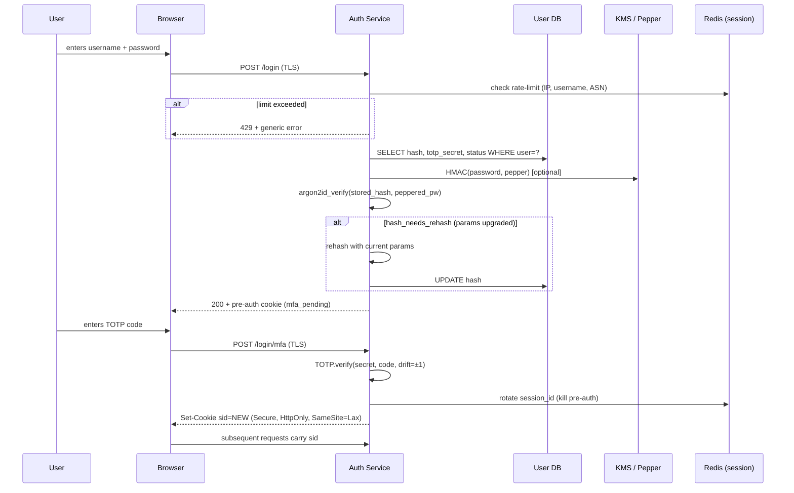
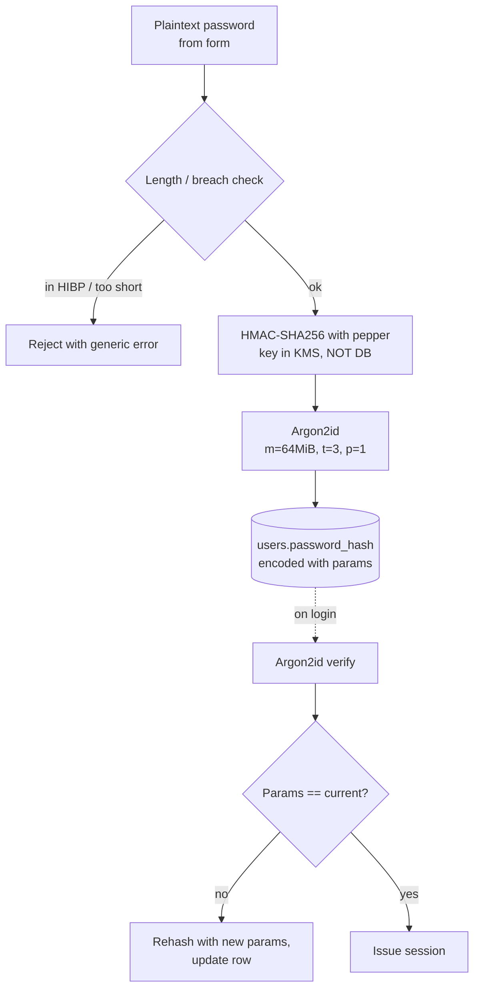
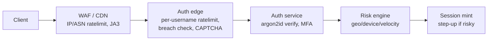

# Authentication (Authn)

## Why This Exists

**Problem.** Authentication answers "who are you?" — distinct from authorization ("what can you do?"). Done wrong, the failure modes are catastrophic and silent: leaked password databases that crack in hours, session cookies that survive logout, MFA bypasses via SMS SIM-swap, JWTs that can't be revoked, credential-stuffing bots that grind through 100M username/password pairs and quietly take over 1-3% of your accounts. Authn bugs rarely page you — they show up as fraud reports, regulator letters, and Have-I-Been-Pwned notifications.

**Key insight.** *Passwords are a database leak waiting to happen, and sessions are a stolen-cookie waiting to happen.* Modern authn is layered defense: hash passwords with a memory-hard KDF so leaks degrade gracefully; add a second factor (ideally phishing-resistant) so password compromise alone isn't game-over; rotate session identifiers around privilege boundaries; and rate-limit/anomaly-detect login attempts so a botnet can't brute-force its way in.

**Reach for this when:**
- Designing a login system from scratch (web, mobile, API, B2B SSO).
- Migrating from bcrypt cost 10 → Argon2id, or rotating a leaked password column.
- Choosing between server-side sessions, opaque tokens, and JWTs.
- Adding MFA and deciding TOTP vs. push vs. WebAuthn/passkeys.
- Investigating a credential-stuffing or password-spray incident.
- Mapping requirements to OWASP ASVS V2/V3 or NIST 800-63B AAL2/AAL3.

**Don't reach for this when:**
- The question is *authorization* (RBAC, ABAC, policy) — see `../authz/`.

## Diagrams

### Login flow with password + TOTP and session rotation



### Credential lifecycle (storage)



## Password Storage

The single most important rule: **never store passwords reversibly, and never use a fast hash (MD5, SHA-1, SHA-256, SHA-512) for passwords.** Fast hashes are designed for throughput; password hashing wants the *opposite* — slow, memory-hard, and tunable.

### Algorithm choice (2024+)

| Algorithm | Status | Use when |
|---|---|---|
| **Argon2id** | Preferred (PHC winner 2015, RFC 9106) | New systems. Memory-hard, GPU/ASIC-resistant. |
| **scrypt** | Acceptable | Existing scrypt deployments; memory-hard. |
| **bcrypt** | Acceptable, legacy-friendly | Legacy systems, FIPS-constrained shops. Cap input at 72 bytes — pre-hash with HMAC-SHA-256 if longer. |
| **PBKDF2-HMAC-SHA-256** | Acceptable only when FIPS-required | Not memory-hard; needs ≥600k iterations (OWASP 2023). |
| MD5, SHA-1, SHA-256, SHA-512 | **Forbidden** | Cracked at GPU speed. Multi-GH/s on a 4090. |
| Plain SHA + salt | **Forbidden** | Same problem; salt only stops rainbow tables. |
| Encrypted (reversible) | **Forbidden** | Key compromise = total compromise. |

### Argon2id parameters (OWASP cheat sheet, current as of writing)

```
m = 19 MiB (≥ 19456 KiB), t = 2, p = 1     # minimum
m = 64 MiB, t = 3, p = 1                    # recommended baseline
m = 128 MiB, t = 1, p = 1                   # high-security, calibrate to ~500ms
```

Calibrate on **your** production hardware to the slowest cost you can tolerate at peak login QPS. Target 250–500ms per verify on the auth host. Re-tune yearly.

### Reference implementation (Python, argon2-cffi)

```python
# pip install argon2-cffi
import os, hmac, hashlib, secrets
from argon2 import PasswordHasher, exceptions
from argon2.profiles import RFC_9106_LOW_MEMORY, RFC_9106_HIGH_MEMORY

# Pepper lives in KMS / env, NEVER in the DB.
# It's a server-side secret applied via HMAC BEFORE Argon2.
# If the DB leaks alone, attacker still needs the pepper.
PEPPER = os.environ["AUTH_PEPPER"].encode()  # 32+ random bytes, base64-decoded

# Tune these once on prod hardware. argon2-cffi defaults are too low.
ph = PasswordHasher(
    time_cost=3,        # iterations
    memory_cost=64*1024,  # KiB → 64 MiB
    parallelism=1,
    hash_len=32,
    salt_len=16,
)

def _pepper(password: str) -> bytes:
    # HMAC, not concat — concat is vulnerable to length-extension on some primitives
    # and gives no domain separation.
    return hmac.new(PEPPER, password.encode("utf-8"), hashlib.sha256).digest()

def hash_password(password: str) -> str:
    if len(password) < 8 or len(password) > 1024:
        # NIST SP 800-63B §5.1.1: allow ≥64 chars; reject absurdly long inputs to
        # prevent DoS via huge Argon2 inputs (Django CVE-2013-1443 style).
        raise ValueError("invalid length")
    return ph.hash(_pepper(password))

def verify_password(stored_hash: str, password: str) -> tuple[bool, str | None]:
    """Returns (ok, new_hash_or_None). If params drifted, returns rehashed value."""
    try:
        ph.verify(stored_hash, _pepper(password))
    except exceptions.VerifyMismatchError:
        return False, None
    except exceptions.InvalidHash:
        # Legacy bcrypt row? Try bcrypt path, then upgrade on success.
        return _verify_legacy_bcrypt(stored_hash, password)
    # Successful verify — check if cost parameters need upgrading.
    if ph.check_needs_rehash(stored_hash):
        return True, ph.hash(_pepper(password))
    return True, None
```

Persist `password_hash` as the encoded string `$argon2id$v=19$m=65536,t=3,p=1$<salt>$<hash>` — the params are part of the value, so per-row upgrade is automatic.

### Pepper: the under-used defense

A **pepper** is a server-side secret applied via HMAC *before* the password hash. It lives in a KMS/HSM or env var, never in the DB.

- DB-only leak (SQLi, backup exfil) → attacker needs pepper to crack anything → buys you time.
- Full server compromise → pepper leaks too; same as no pepper. So pepper is **layered defense**, not a substitute for a strong KDF.
- Rotation: store a key id (`PEPPER_V2`) per row. Rotate by re-hashing on next login.

### Migrating from a weak hash

You usually inherit MD5/SHA-1/bcrypt-cost-4. Don't force a password reset for everyone — that's bad UX and pushes users to weaker passwords. Instead:

```
stored = argon2id( old_hash(password) )
```

Wrap the legacy hash inside Argon2id. On next successful login, recompute as `argon2id(password)` and overwrite. Within a few months, most active users are migrated; force-reset the long-tail.

```python
# Layered migration: argon2id wrapping legacy md5 (don't ever start here, but inherit gracefully)
def verify_legacy_then_upgrade(row, password: str):
    if row.scheme == "argon2id":
        return verify_password(row.hash, password)
    if row.scheme == "argon2id_over_md5":
        legacy = hashlib.md5(password.encode()).hexdigest().encode()
        ok = ph.verify(row.hash, legacy)  # raises on mismatch
        # On success, re-hash directly with argon2id(password) and store as scheme=argon2id
        return True, ph.hash(_pepper(password))
```

## Sessions vs Tokens

After a successful login, you need to remember the user across requests. Two camps:

### Server-side sessions (opaque IDs)

```
sid = random(128 bits)            # in cookie
redis.SET sid:<id> { uid, mfa_aal, csrf_token, ... } EX 1800
```

- Authoritative server state — **revocation is instant** (delete the Redis key).
- Cookie is a meaningless random handle; nothing to leak from the token itself.
- Cost: a Redis/DB lookup per request. With pipelining and a colocated cache, p99 is sub-ms.

### Stateless tokens (JWT, PASETO)

```
jwt = base64(header).base64(claims).base64(sig)   # signed, not encrypted
```

- No lookup — verify signature, trust claims, done.
- **Revocation is hard.** A signed JWT is valid until it expires. Logout is theatre unless you keep a deny-list (which is server state — defeating the point).
- Long-lived JWTs are a liability. Common fix: short access token (5–15 min) + opaque refresh token stored server-side with revocation.

### When each wins

| Situation | Choose |
|---|---|
| Browser app, single domain, single backend | **Server sessions** in HttpOnly cookie. |
| Browser app, microservices, shared identity | Server sessions at edge, propagate signed claim to internal services. |
| Mobile/native + REST API | Short access JWT (10 min) + opaque refresh token (rotated on use). |
| Service-to-service (B2B) | mTLS or signed JWT with `aud` and short TTL. |
| Cross-domain SSO | OIDC ID token (JWT) for *identity*; local session for *application*. |

### Cookie attributes that matter

```
Set-Cookie: sid=<opaque>; Path=/; Secure; HttpOnly; SameSite=Lax;
            Max-Age=1800; Domain=app.example.com
```

- `Secure` — TLS only. Non-negotiable.
- `HttpOnly` — JS can't read it; mitigates XSS exfiltration.
- `SameSite=Lax` — blocks most CSRF; use `Strict` for high-value (banking) flows.
- **No `Domain=.example.com`** unless you actually need cross-subdomain — it widens blast radius for any subdomain XSS.
- `__Host-` prefix locks the cookie to exact host + path `/` + Secure. Use it.

### Session rotation (anti-fixation)

A **session fixation** attack: attacker plants a known `sid` on the victim (via a link, subdomain XSS, or a network MITM on a non-Secure cookie), the victim logs in, and the attacker's pre-known `sid` is now authenticated.

Rule: **rotate the session identifier on every privilege change.**

```python
def login(username, password, mfa_code):
    user = authenticate(username, password, mfa_code)  # raises on failure
    # CRITICAL: kill any existing session and mint a new sid.
    if request.session_id:
        redis.delete(f"sid:{request.session_id}")
    new_sid = secrets.token_urlsafe(32)  # 256 bits
    redis.setex(f"sid:{new_sid}", 1800, json.dumps({
        "uid": user.id,
        "aal": "AAL2",                # NIST 800-63B level
        "auth_time": int(time.time()),
        "ip": request.ip,             # bind loosely; full IP-pinning breaks mobile
        "ua_hash": hash(request.ua),  # detect cookie theft on UA change
    }))
    response.set_cookie("__Host-sid", new_sid,
        secure=True, httponly=True, samesite="Lax", max_age=1800, path="/")
```

Rotate also on:
- Password change.
- MFA enrollment / removal.
- Step-up auth (e.g., entering admin area).
- Privilege escalation (role change).

### Idle vs absolute timeout

- **Idle timeout** (sliding): 15–30 min for normal apps, 5–10 for banking. Reset on activity.
- **Absolute timeout** (hard cap): 8–24 hours. After this, full re-auth, no exceptions.

Both. Idle alone lets a stolen cookie live forever as long as the bot keeps "using" it.

## Multi-Factor Authentication

NIST 800-63B defines **Authenticator Assurance Levels**:

| AAL | Requirement | Examples |
|---|---|---|
| AAL1 | Single factor | Password only. |
| AAL2 | Two factors, replay-resistant | Password + TOTP; password + push approval. |
| AAL3 | Two factors, **phishing-resistant**, hardware-bound | Password + FIDO2 / WebAuthn / smart card. |

### TOTP (RFC 6238)

Time-based one-time password. Shared secret → HMAC-SHA1(secret, counter=floor(unix/30)) → 6 digits.

```python
# pip install pyotp
import pyotp, secrets, qrcode

def enroll_totp(user):
    # 160-bit secret = 32 base32 chars. Don't use less.
    secret = pyotp.random_base32()
    user.totp_secret_encrypted = kms_encrypt(secret)
    user.save()
    uri = pyotp.TOTP(secret).provisioning_uri(
        name=user.email, issuer_name="ExampleCorp")
    return uri  # render as QR

def verify_totp(user, code: str) -> bool:
    secret = kms_decrypt(user.totp_secret_encrypted)
    totp = pyotp.TOTP(secret)
    # valid_window=1 → tolerate ±30s clock drift. Don't go higher.
    return totp.verify(code, valid_window=1)
```

**Pitfalls:**
- Storing TOTP secrets in plaintext in DB. Encrypt with KMS. (Or use HSM.)
- No replay protection. A 6-digit code is valid for 30s — if attacker phishes it within window, they win. Track last-used counter per user, reject re-use.
- SMS as a "second factor" — **don't**. NIST 800-63B-rev3 deprecated SMS for AAL2 (SIM swap, SS7).

### Push notification (Duo, Authy, custom)

User taps "Approve" on phone. Better UX than TOTP, but vulnerable to **MFA fatigue / push bombing** — attacker hammers approvals until victim taps Approve to make it stop. Mitigations:

- Number matching: app shows a 2-digit code that user must type from the login screen.
- Geo + risk display: "Login from Lagos, Nigeria — Approve?".
- Hard rate limit: 3 push prompts per 10 min, then lockout.

### WebAuthn / Passkeys (FIDO2) — the right answer

Public-key cryptography. The authenticator (YubiKey, Touch ID, platform passkey) generates a keypair *bound to the relying party's origin*. Phishing-resistant by design — a fake site has the wrong origin and the authenticator refuses to sign.

```javascript
// Registration (client-side, browser)
const credential = await navigator.credentials.create({
  publicKey: {
    challenge: serverChallenge,           // 32+ random bytes from server
    rp: { id: "example.com", name: "Example" },
    user: { id: userIdBytes, name: "alice@example.com", displayName: "Alice" },
    pubKeyCredParams: [
      { type: "public-key", alg: -7 },    // ES256
      { type: "public-key", alg: -257 },  // RS256
    ],
    authenticatorSelection: {
      residentKey: "preferred",            // passkey-style
      userVerification: "required",        // enforce PIN/biometric → AAL3
    },
    attestation: "none",                   // privacy; "direct" only if you must verify make/model
    timeout: 60000,
  }
});
// POST credential to server, store credential.id + publicKey + signCount
```

Server side (Python, py_webauthn):

```python
from webauthn import generate_registration_options, verify_registration_response
from webauthn.helpers.structs import (
    AuthenticatorSelectionCriteria, ResidentKeyRequirement, UserVerificationRequirement,
)

def begin_register(user):
    opts = generate_registration_options(
        rp_id="example.com",
        rp_name="Example",
        user_id=user.id_bytes,
        user_name=user.email,
        authenticator_selection=AuthenticatorSelectionCriteria(
            resident_key=ResidentKeyRequirement.PREFERRED,
            user_verification=UserVerificationRequirement.REQUIRED,
        ),
    )
    cache_challenge(user.id, opts.challenge)  # one-time, short TTL
    return opts

def finish_register(user, client_response):
    verification = verify_registration_response(
        credential=client_response,
        expected_challenge=pop_challenge(user.id),
        expected_origin="https://example.com",
        expected_rp_id="example.com",
    )
    Credential.create(
        user_id=user.id,
        credential_id=verification.credential_id,
        public_key=verification.credential_public_key,
        sign_count=verification.sign_count,
    )
```

**Why passkeys are different:**
- Phishing-resistant — origin binding by the platform.
- No shared secret — only public key on server. DB leak is harmless.
- Sync passkeys (iCloud Keychain, Google Password Manager) — UX wins over security purity. Some regulators require non-syncable (device-bound) keys for AAL3.

### MFA backup / recovery

Every MFA system needs a recovery path, and the recovery path is the weakest factor. Common patterns:

- **One-time recovery codes** (10 codes, single-use, hashed at rest like passwords).
- **Multiple WebAuthn credentials** (encourage two keys: primary + backup).
- Email recovery — only acceptable if email itself is MFA-protected; otherwise email-takeover bypasses MFA.

Audit recovery flows as carefully as login. The Twitter 2020 incident, the LastPass 2022 breach, and countless ATO cases trace back to weak recovery.

## Credential Stuffing & Password Spray

Stuffing: attacker has 10M leaked username:password pairs, tries them against your site. Typical hit rate: 0.1–2%, which on a 10M-user site is 10k–200k account takeovers.

Spray: attacker tries one common password (`Spring2024!`) against millions of accounts.

### Layered defenses (deploy all of them)

1. **Breached password check.** On signup and on password change, check the password against a breach corpus. Have I Been Pwned's k-anonymity API exposes a SHA-1 prefix; you send 5 hex chars and never reveal the password.

   ```python
   import hashlib, requests
   def is_pwned(password: str) -> bool:
       sha1 = hashlib.sha1(password.encode()).hexdigest().upper()
       prefix, suffix = sha1[:5], sha1[5:]
       r = requests.get(f"https://api.pwnedpasswords.com/range/{prefix}", timeout=2)
       return any(line.split(":")[0] == suffix for line in r.text.splitlines())
   ```

2. **Rate limiting — multi-dimensional.**
   - Per-IP: 10 attempts/minute, 100/hour.
   - Per-username: 5 failed attempts → exponential backoff or CAPTCHA. Important for spray.
   - Per-ASN: many stuffing attacks come from cloud ranges (DigitalOcean, Choopa).
   - Distinguish failed-because-no-such-user vs failed-because-bad-password — same response time, same error message ("Invalid credentials"), to prevent username enumeration.

3. **CAPTCHA / proof-of-work on suspicious requests.** Don't show CAPTCHA on every login (UX killer). Trigger on risk signals: new IP, new ASN, headless browser, failed-attempt streak.

4. **Bot detection / device fingerprinting.** Commercial (Cloudflare Bot Management, Castle, Arkose) or build a basic signal stack: TLS JA3, header order, behavioral entropy (typing cadence).

5. **Account lockout — carefully.** Hard lockouts (N failures → lock for 15 min) enable DoS — attacker can lock everyone out. Prefer **progressive delay + CAPTCHA**, then alert+notify rather than full lockout. NIST 800-63B explicitly recommends rate-limiting over hard lockout.

6. **Anomaly-based step-up.** New-device login → email a one-time code. New geo → require MFA even if remember-device cookie is present. Impossible travel (NYC at 09:00, Lagos at 09:15) → block + alert.

7. **Notify users on auth events.** Email on new device, password change, MFA change. Make it noisy enough that an attacker can't quietly take over.

8. **Generic error messages, constant time.**
   ```python
   # BAD: reveals which step failed
   if not user_exists(username):
       return "no such user"
   if not verify_password(...):
       return "wrong password"

   # GOOD
   user = lookup(username) or DUMMY_USER  # always run verify, even on missing user
   ok = verify_password(user.hash, password)
   if not (user.real and ok):
       return "Invalid email or password"
   ```

### Architecture: where to enforce



Don't put rate-limiting only at the WAF — attacker rotates IPs trivially. Per-username limits live at the auth service, which alone has the identity context.

## Trade-offs

| Benefit | Cost |
|---|---|
| Argon2id strong against GPU/ASIC | High memory per verify (64 MiB × concurrent logins). Need to capacity-plan. |
| Server sessions: instant revoke | Adds dependency on Redis/DB; cache miss spikes p99. |
| JWT: stateless, easy horizontal scale | Logout is a lie; revocation needs deny-list (defeats statelessness). |
| WebAuthn: phishing-resistant | Recovery UX hard; not all platforms equal; user education needed. |
| TOTP: works offline, free | Phishable, replay window 30s, secret-storage burden. |
| SMS OTP: no app install | SIM-swap, SS7 attacks. NIST deprecated for AAL2. |
| Pepper in KMS: defense vs DB-only leak | Adds KMS dependency in login path; rotation is non-trivial. |
| Hard account lockout: stops brute force | DoS vector — attacker can lock out every user. |
| Long session TTL: better UX | Bigger blast radius for stolen cookies. |
| Push approval: low friction | MFA fatigue / prompt bombing (Uber 2022). |
| Sync passkeys: easy recovery | Cloud account compromise = all passkeys compromised; not AAL3 by some standards. |

## Common Pitfalls

- **Bcrypt with cost 4–8 in 2024.** Crackable on a single GPU. Min cost 12 for bcrypt; 14+ for sensitive systems. Test on prod hardware.
- **Bcrypt and inputs >72 bytes.** Bcrypt silently truncates. Pre-hash with HMAC-SHA-256: `bcrypt(base64(hmac_sha256(pepper, password)))`.
- **Storing TOTP secrets in cleartext.** First DB leak = bypass MFA. Encrypt with KMS-managed key.
- **Resending the same session ID after login.** Classic session fixation. Always rotate.
- **`SameSite=None` without thinking.** You just opened CSRF on this cookie. Required only for true cross-site, and then must be paired with anti-CSRF tokens.
- **`localStorage` for auth tokens.** Any XSS reads it. Use HttpOnly cookies. JWT-in-localStorage is a common antipattern in SPA tutorials.
- **JWTs without `aud` and `iss` validation.** A token from another service of yours is accepted by this one. Multi-tenant breach.
- **`alg: none` JWTs.** Some libraries accept unsigned tokens. Pin allowed algs; never trust the `alg` header.
- **Rate-limit only by IP.** Stuffing botnets have 50k IPs. Per-username and per-ASN matter more.
- **MFA enrollment without re-auth.** Attacker with stolen cookie enrolls their own TOTP, locks user out. Require recent password (or step-up) before MFA changes.
- **Email recovery while email is single-factor.** Defeats your MFA.
- **Logging passwords.** Even on the failed-login path. Even in stack traces. Especially in stack traces. Scrub at logger level.
- **Username enumeration via timing or messages.** "User not found" vs "wrong password" — pick one, run constant-time, return same message.
- **Forgot-password tokens that don't expire / aren't single-use.** 24h TTL max, single use, invalidated on password change.
- **Re-using session for impersonation.** Admin "log in as user" should mint a separate session marked `impersonator=admin_id` and audit.
- **Trusting the `Host` or `X-Forwarded-For` header without validation.** Both are user-controlled until you pin them at the edge.
- **CSRF tokens scoped only to session, not to action.** A read-only endpoint's token grants a state-change endpoint. Bind tokens to action where it matters.
- **Push MFA without number matching.** Microsoft and Cisco both shipped number-match defaults after MFA-fatigue incidents.
- **Forcing periodic password rotation.** NIST 800-63B-rev3 explicitly says don't — users pick weaker, predictable variants. Rotate only on suspected compromise.

## Decision Table

| Question | Use this | Not this | Why |
|---|---|---|---|
| New password store | **Argon2id** (m=64MiB, t=3) | bcrypt cost 10 | Memory-hard; OWASP/NIST-aligned. |
| FIPS-mandated environment | PBKDF2-HMAC-SHA-256 ≥600k | Argon2id | FIPS 140 compliance; weaker but allowed. |
| Replacing a hash column with leaked DB | Layered Argon2id over old hash, rehash on next login | Force-reset everyone | Migration without UX collapse. |
| Browser app, single backend | **Server session cookie** | JWT in localStorage | Revocable; XSS-resistant. |
| Mobile app + REST API | Short access JWT + opaque refresh token | Long-lived JWT | Revocation via refresh-token store. |
| Cross-domain SSO | OIDC + per-app session | Shared domain cookie | Smaller blast radius, standard flow. |
| 2FA for consumer app | TOTP (free) + opt-in WebAuthn | SMS OTP | Avoid SIM-swap; offer phishing-resistant upgrade. |
| 2FA for employees / privileged users | **WebAuthn (hardware key)** | Push or TOTP | AAL3, phishing-resistant. |
| 2FA for high-risk transactions | Step-up to WebAuthn | Trust ambient session | Bind action to fresh user-verified ceremony. |
| Brute-force defense | Per-IP + per-username + CAPTCHA | Hard lockout | Lockout = DoS vector. |
| Logout in JWT system | Server-side deny-list keyed by `jti` until exp | Pretend logout works | Otherwise cookie/Bearer keeps working. |
| Forgot password | Single-use token, 1h TTL, email | Security questions | Questions are public-record-derivable. |
| Storing TOTP secret | Encrypt with KMS, rotate on key rotation | Plaintext + DB encryption-at-rest | At-rest enc doesn't help on `SELECT *`. |
| Long-running CLI auth | Device code flow (OAuth 2.0 §4) | Embed password in config | Standard, revocable, no creds at rest. |

## References

- NIST — *Special Publication 800-63B: Digital Identity Guidelines, Authentication and Lifecycle Management* — https://pages.nist.gov/800-63-3/sp800-63b.html
- OWASP — *Application Security Verification Standard (ASVS) v4.0.3, V2 Authentication & V3 Session Management* — https://owasp.org/www-project-application-security-verification-standard/
- OWASP — *Password Storage Cheat Sheet* — https://cheatsheetseries.owasp.org/cheatsheets/Password_Storage_Cheat_Sheet.html
- OWASP — *Authentication Cheat Sheet* — https://cheatsheetseries.owasp.org/cheatsheets/Authentication_Cheat_Sheet.html
- OWASP — *Session Management Cheat Sheet* — https://cheatsheetseries.owasp.org/cheatsheets/Session_Management_Cheat_Sheet.html
- OWASP — *Credential Stuffing Cheat Sheet* — https://cheatsheetseries.owasp.org/cheatsheets/Credential_Stuffing_Prevention_Cheat_Sheet.html
- IETF — *RFC 9106: Argon2 Memory-Hard Function for Password Hashing and Proof-of-Work Applications* — https://datatracker.ietf.org/doc/html/rfc9106
- IETF — *RFC 6238: TOTP: Time-Based One-Time Password Algorithm* — https://datatracker.ietf.org/doc/html/rfc6238
- IETF — *RFC 8628: OAuth 2.0 Device Authorization Grant* — https://datatracker.ietf.org/doc/html/rfc8628
- IETF — *RFC 6749: The OAuth 2.0 Authorization Framework* — https://datatracker.ietf.org/doc/html/rfc6749
- IETF — *RFC 7519: JSON Web Token (JWT)* — https://datatracker.ietf.org/doc/html/rfc7519
- IETF — *RFC 8725: JSON Web Token Best Current Practices* — https://datatracker.ietf.org/doc/html/rfc8725
- W3C — *Web Authentication: An API for accessing Public Key Credentials, Level 3* — https://www.w3.org/TR/webauthn-3/
- FIDO Alliance — *Passkeys overview & technical specifications* — https://fidoalliance.org/passkeys/
- Google — *Building Secure and Reliable Systems*, ch. 14 (Authentication) — https://sre.google/books/building-secure-reliable-systems/
- Google SRE Workbook — *Implementing SLOs and Auth at scale* — https://sre.google/workbook/table-of-contents/
- Have I Been Pwned — *k-Anonymity Range API* — https://haveibeenpwned.com/API/v3#PwnedPasswords
- Colin Percival — *Stronger Key Derivation via Sequential Memory-Hard Functions* (scrypt) — https://www.tarsnap.com/scrypt/scrypt.pdf
- Password Hashing Competition — *Argon2 specification & results* — https://www.password-hashing.net/
- Troy Hunt — *Pwned Passwords, Version 8* — https://www.troyhunt.com/pwned-passwords-version-8/
- AWS — *Builders' Library: Avoiding insurmountable queue backlogs* (rate-limit patterns) — https://aws.amazon.com/builders-library/avoiding-insurmountable-queue-backlogs/
- Cloudflare — *Credential Stuffing: a security epidemic* — https://blog.cloudflare.com/tag/credential-stuffing/
- Microsoft — *Defending against MFA fatigue / number matching rollout* — https://learn.microsoft.com/en-us/entra/identity/authentication/how-to-mfa-number-match
- Kleppmann — *Designing Data-Intensive Applications*, ch. 9 (Consistency & Consensus) for token revocation tradeoffs.

## See Also

- `../authz/` — authorization (RBAC/ABAC/policy) once you know who the user is.
- `../secrets-management/` — KMS, pepper rotation, TOTP secret encryption.
- `./` — deeper dive on cookies, CSRF, SameSite (if split out).
- `../../reliability/rate-limiting/` — token-bucket and adaptive throttling for auth endpoints.
- `../audit-logging/` — auth event logging, tamper-evidence, alerting.
- `../../reliability/incident-response/` — credential-stuffing playbooks, mass-revocation drills.
- `../../reliability/rate-limiting/` — generic rate-limit primitives reused at the auth edge.
