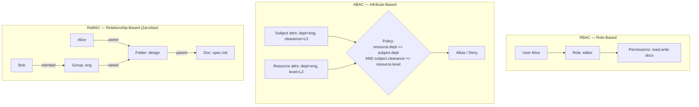
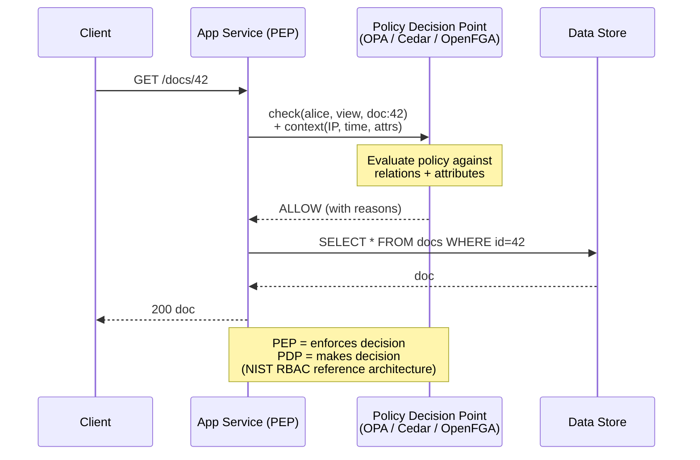
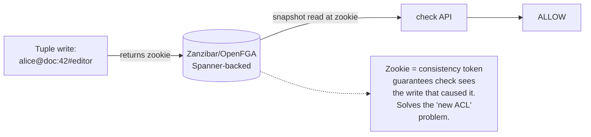
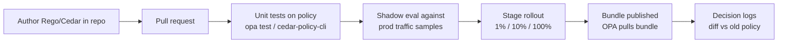

# Authorization (Authz)

Authentication answers **who are you**. Authorization answers **what are you allowed to do**. This skill is about the second one — and almost every real-world breach in the OWASP Top 10 (Broken Access Control is #1 in 2021) lives here.

## Why This Exists

**Problem:** Authorization logic starts as `if user.is_admin:` scattered across a codebase. Five years later it's 50,000 lines of permission checks duplicated across 30 services, nobody can answer "why can Bob see this resource?", revoking access takes minutes to propagate (or never does), and a developer adds a new endpoint forgetting the check entirely. Meanwhile product wants Google-Docs-style sharing ("anyone with the link", "shared via group", "inherited from folder") and you realize role-based permissions can't model it.

**Key insight:** Authorization is a **distributed-systems problem disguised as a security problem**. The hard parts aren't the policy language — they're (1) consistency between the policy decision and the underlying data, (2) low-latency at scale (every request needs an authz check), (3) auditability ("show me everything Alice can access"), and (4) decoupling policy from application code so policy can evolve without redeploying every service.

**Reach for this when:**
- Designing a new service and the team is about to write `if user.role == "admin"` for the third time.
- Migrating from RBAC to fine-grained sharing (per-document permissions, group inheritance, "shared with").
- Security audit flagged inconsistent permission checks across services.
- Performance regression caused by N+1 permission queries on list endpoints.
- Multi-tenant SaaS where tenants need their own roles, hierarchies, or custom policies.
- Building infrastructure-as-code policy gates (Kubernetes admission, Terraform pre-apply).

**Don't reach for this when:**
- Single-user CLI tool — there's no "other user" to authorize against.
- Pure authentication problem (sessions, OAuth, MFA) — see `../authn/`.
- Network-level isolation is enough (e.g., dedicated single-tenant VPCs); coarse boundaries beat fine-grained policy here.
- You actually need **encryption-based access control** (KMS grants, envelope encryption) where the system itself can't see the data.

## Diagrams

### The three big models



### Policy decision flow (centralized PDP/PEP)



### Zanzibar consistency model



## Core Models

### 1. RBAC — Role-Based Access Control

The default for most enterprise systems since the 1990s. Standardized in NIST RBAC (Ferraiolo et al.), formalized in ANSI INCITS 359-2004.

```python
# Classic RBAC schema — three tables, two many-to-many joins
# User —< UserRole >— Role —< RolePermission >— Permission

class Permission:
    resource: str     # "documents"
    action: str       # "read", "write", "delete"

class Role:
    name: str         # "editor", "viewer", "admin"
    permissions: set[Permission]

def can(user: User, action: str, resource: str) -> bool:
    for role in user.roles:
        for perm in role.permissions:
            if perm.resource == resource and perm.action == action:
                return True
    return False
```

**Where RBAC breaks:**
- **Role explosion**: "editor in project A but viewer in project B" → you create `editor_project_A`, `editor_project_B`, ... → 10,000 roles.
- **Object-level permissions**: "Alice can edit doc 42 but not doc 43" — RBAC has no native concept of *which instance*.
- **Hierarchies**: "editors inherit from viewers" requires role-hierarchy extensions (RBAC1).
- **Constraints**: "user can't be both approver and submitter on the same PO" needs separation-of-duty (RBAC2).

RBAC0 (flat), RBAC1 (hierarchical), RBAC2 (constrained), RBAC3 (both) — see the NIST paper.

### 2. ABAC — Attribute-Based Access Control

Decisions are functions of attributes on the subject, action, resource, and environment. Standardized in XACML 3.0 (OASIS, 2013).

```rego
# OPA Rego — classic ABAC pattern
package authz

default allow := false

# Subject must be in same department as resource
# AND have clearance >= resource sensitivity
# AND request must come during business hours from corp network
allow if {
    input.subject.department == input.resource.department
    input.subject.clearance >= input.resource.sensitivity
    business_hours
    corp_network
}

business_hours if {
    h := time.clock([time.now_ns(), "America/Los_Angeles"])[0]
    h >= 8
    h < 18
}

corp_network if {
    net.cidr_contains("10.0.0.0/8", input.context.source_ip)
}
```

**ABAC strengths:**
- Expressive: any decision computable from attributes.
- Decouples policy from application — change rules without redeploying services.
- Natural fit for compliance ("PII can only be read by users with `pii_trained=true`").

**ABAC weaknesses:**
- **The reverse-lookup problem**: ABAC tells you "can Alice read X?" but cannot easily answer "what can Alice read?" — because that requires evaluating the policy against every resource. This kills list endpoints unless you push attributes into your query layer.
- Attribute freshness — if `clearance` is in a different system, you need invalidation discipline.
- Policy debugging is hard once policies compose; trace tooling matters.

### 3. ReBAC — Relationship-Based Access Control (Zanzibar)

Google's 2019 paper "Zanzibar: Google's Consistent, Global Authorization System" (Pang et al., USENIX ATC '19) defined the modern ReBAC model. Backs Drive, YouTube, Cloud, Calendar — *trillions* of ACLs, **10M+ QPS at p95 < 10ms**.

**Core idea: everything is a tuple.**

```
<object>#<relation>@<user>
```

Examples:
```
doc:42#owner@alice            # Alice owns doc 42
doc:42#viewer@group:eng#member  # Members of group:eng can view doc 42 (userset rewrite)
folder:design#parent@doc:42   # Doc 42 is in folder:design
group:eng#member@bob          # Bob is in group:eng
```

A **namespace config** declares relations and how they compose:

```yaml
# OpenFGA / Zanzibar-style schema
type document
  relations
    define owner: [user]
    define editor: [user, group#member] or owner
    define viewer: [user, group#member] or editor or viewer from parent
    define parent: [folder]

type folder
  relations
    define owner: [user]
    define viewer: [user, group#member] or owner

type group
  relations
    define member: [user]
```

The `viewer from parent` is **userset rewrite** — viewers of a doc include viewers of its parent folder. This is how Drive implements folder inheritance.

**Why this matters:**
- Models real product semantics directly (sharing, groups, folders, links).
- Centralized: every service hits the same authz store. One source of truth.
- Reverse-lookup capable: `ListObjects(alice, viewer, document)` returns all docs Alice can view — built-in.
- Consistency via **zookies** — opaque tokens you pass with `Check` to ensure the check sees a write at least as recent as the zookie. Solves the "Alice just shared with Bob, now Bob loads the doc" race.

**OpenFGA** (CNCF, originally from Auth0) and **AuthZed SpiceDB** are the two production-grade open-source Zanzibar implementations. AWS announced **Amazon Verified Permissions** (Cedar-based but with ReBAC patterns) in 2023.

### 4. Hybrid: ReBAC + ABAC

Pure ReBAC can't express "viewer if relation AND it's business hours AND request not from blocked region". Modern systems combine: **relations for the graph**, **attributes for conditions**.

OpenFGA 1.4+ added **conditional relationships** (CEL expressions on tuples). Cedar bakes conditions into its core syntax:

```cedar
// Cedar policy — combines ABAC conditions with ReBAC-style principal/resource matching
permit (
    principal in Group::"engineering",
    action in [Action::"view", Action::"edit"],
    resource in Folder::"design"
)
when {
    context.mfa == true &&
    context.source_ip.isInRange(ip("10.0.0.0/8")) &&
    resource.classification != "confidential"
};

// Cedar's `forbid` always wins over `permit` — explicit deny semantics
forbid (
    principal,
    action == Action::"delete",
    resource is Document
)
when { resource.legal_hold == true };
```

Cedar (open-sourced 2023) is interesting because it's **provably analyzable** — you can ask "are these two policy sets equivalent?" or "is there any input where this policy allows access?" via SMT. See the Cedar paper (Cutler et al., OOPSLA '24).

## Architecture: PEP / PDP / PIP / PAP

NIST/XACML terminology that you'll see everywhere:

| Component | Role | Example |
|-----------|------|---------|
| **PEP** — Policy Enforcement Point | Where the decision is enforced | The middleware in your service that calls `check()` and 403s on deny |
| **PDP** — Policy Decision Point | Where the decision is made | OPA, Cedar engine, OpenFGA server |
| **PIP** — Policy Information Point | Where attributes/relations come from | User DB, OpenFGA tuple store, group provider |
| **PAP** — Policy Administration Point | Where policies are authored/managed | Git repo of Rego, OpenFGA console |

**The fundamental tension:** Where does the PDP live?

```
┌────────────────────────────────┬───────────────────────────────┐
│ Sidecar / library (in-process) │ Centralized service           │
├────────────────────────────────┼───────────────────────────────┤
│ + sub-millisecond latency      │ + single source of truth      │
│ + survives PDP outage          │ + consistent reverse lookups  │
│ + decisions scale with app     │ + cross-service relations     │
│ - policy distribution problem  │ - latency (network hop)       │
│ - data freshness lag           │ - availability dependency     │
│ - per-service data replication │ - throughput bottleneck       │
└────────────────────────────────┴───────────────────────────────┘
```

OPA is typically deployed as a sidecar — policy is small, decisions are local, attribute data bundled or fetched on demand. OpenFGA/SpiceDB are typically centralized — relations are global and cross-resource.

## Production Patterns

### Pattern 1: List-then-filter vs filter-in-query (the N+1 trap)

```python
# BAD: N+1 authz checks
docs = db.query("SELECT * FROM documents WHERE owner_id = ?", user.id)
visible = [d for d in docs if authz.check(user, "view", d.id)]
# 1000 docs = 1000 PDP round trips
```

```python
# GOOD: ListObjects upfront, then SQL IN clause
visible_ids = openfga.list_objects(
    user=f"user:{user.id}",
    relation="viewer",
    type="document",
)
docs = db.query("SELECT * FROM documents WHERE id IN ?", visible_ids)
# 1 PDP call, 1 DB call. Watch out for very large id sets — paginate or filter at PDP.
```

```sql
-- BETTER for huge tenants: push the filter to the DB via a materialized view
-- maintained from authz events (CDC from OpenFGA tuple changes -> Postgres)
CREATE MATERIALIZED VIEW user_visible_docs AS
SELECT user_id, doc_id FROM authz_relations WHERE relation = 'viewer' AND type='doc';

SELECT d.* FROM documents d
JOIN user_visible_docs v ON v.doc_id = d.id
WHERE v.user_id = $1
ORDER BY d.created_at DESC LIMIT 50;
```

### Pattern 2: Object-level permission middleware

```typescript
// Express middleware — every route declares the resource it touches
function requirePermission(action: string, resourceFn: (req: Request) => string) {
  return async (req: Request, res: Response, next: NextFunction) => {
    const resource = resourceFn(req);
    const result = await fga.check({
      tuple_key: { user: `user:${req.user.id}`, relation: action, object: resource },
      // Pass zookie from prior write to avoid stale-read race after share
      consistency: req.headers['x-fga-consistency-token'] as string ?? 'MINIMIZE_LATENCY',
    });
    if (!result.allowed) {
      logger.warn({ user: req.user.id, action, resource, denied: true }, 'authz_deny');
      return res.status(403).json({ error: 'forbidden', reason_id: result.resolution });
    }
    next();
  };
}

// Usage — explicit & auditable
app.get('/docs/:id',
  requirePermission('view', (req) => `document:${req.params.id}`),
  getDoc);

app.delete('/docs/:id',
  requirePermission('delete', (req) => `document:${req.params.id}`),
  deleteDoc);
```

The win here: every endpoint **declares** its authz contract in one line. Code review catches missing checks. Static analysis can enforce "every handler must have a `requirePermission`".

### Pattern 3: Defense in depth — DB-level RLS + app-level check

PostgreSQL Row-Level Security as a backstop:

```sql
ALTER TABLE documents ENABLE ROW LEVEL SECURITY;

CREATE POLICY tenant_isolation ON documents
  USING (tenant_id = current_setting('app.current_tenant_id')::uuid);

-- App sets per-request:
-- SET LOCAL app.current_tenant_id = '...';
```

If your app forgets the WHERE clause, RLS still saves you from cross-tenant leaks. **This is the pattern that prevents the most embarrassing data breaches.**

### Pattern 4: Audit & explainability

Every deny (and ideally every allow) should be loggable with **why**:

```python
# OPA decision log — sent to ELK/CloudWatch
{
  "decision_id": "9f...",
  "input": {"subject": {...}, "action": "delete", "resource": {...}},
  "result": {"allow": false},
  "metrics": {"timer_rego_query_eval_ns": 432156},
  "labels": {"version": "v23.4.1", "policy_bundle": "main@a1b2c3"}
}
```

OpenFGA `Check` returns a `resolution` showing which tuple path produced the decision — that's how you answer "why does Alice have access to this doc?" in an audit.

### Pattern 5: Policy-as-code lifecycle

Treat policies like code:



OPA bundles, OpenFGA store imports, Cedar bundles — all support versioned, signed policy distribution. **Never edit policies directly in prod consoles.**

## Trade-offs

| Benefit | Cost |
|---------|------|
| RBAC simplicity (3 tables, anyone can implement it) | Doesn't model object-level permissions, leads to role explosion |
| ABAC expressiveness (any computable predicate) | Reverse-lookup is hard / impossible without indexing; debugging composed policies is painful |
| ReBAC natural product fit (sharing, folders, groups) | Centralized service = new SPOF and latency tax; need consistency tokens to avoid stale-share races |
| Centralized PDP (single source of truth, audit) | Network hop on every request; PDP outage = global outage unless cached |
| Sidecar PDP (low latency, available) | Policy/data sync complexity; per-instance cache freshness; can't do global reverse lookups easily |
| Policy-as-code (versioned, reviewable, testable) | Requires CI/CD investment; team must learn Rego/Cedar/etc.; risk of policy/code drift |
| Conditional ReBAC (relations + attributes) | Hardest to reason about; partial-evaluation/SMT analysis tooling is immature |
| Provable analyzability (Cedar) | Restricted policy language — some patterns can't be expressed |
| DB-level enforcement (RLS, KMS grants) | Tied to specific data store; harder to evolve schema; debugging "why no rows?" is painful |
| In-app `if user.role == X` (the temptation) | Scatters policy across codebase; impossible to audit; revocation lag; the #1 source of broken access control bugs |

## Common Pitfalls

- **Confused-deputy attacks.** Service A authorizes the call from User U, then makes a downstream call to Service B with its own service credentials — Service B sees "trusted Service A" and skips the per-user check. Always propagate the original principal (signed JWT, request-scoped token) and re-check at each layer that touches user data. See AWS's `aws:SourceAccount` confused-deputy guidance.

- **IDOR (Insecure Direct Object Reference) — OWASP A01.** `GET /api/invoices/12345` returns the invoice without checking it belongs to the requesting user's org. The most common access-control bug, every year. Make object-level checks mandatory in middleware, not optional.

- **Permission cache poisoning.** Caching `can(user, action, resource) → true` for 5 minutes seems fine until access is revoked and the user keeps having access for 5 minutes. Either cache with short TTL + push-invalidation on writes, or use Zanzibar zookies to pin reads to a known-recent snapshot.

- **Role explosion in multi-tenant SaaS.** Each tenant defines their own roles → you have `tenant_42_admin`, `tenant_42_editor`, ... → millions of roles. Either (a) namespace roles by tenant in ReBAC tuples, (b) use ABAC with `tenant_id` as an attribute, or (c) per-tenant policy bundles in OPA.

- **Forgetting to check on writes.** Teams remember `GET` checks but skip `PATCH` / `DELETE` / message-bus consumers. Audit by enumerating every state-change path; consider a "default deny + explicit allow" middleware that fails closed.

- **Stale group membership after revoke.** User removed from `group:eng` but their JWT still claims `groups: [eng]` for 1 hour. Either short JWT TTLs + refresh, push-revoke (PASETO + revocation list), or move group resolution out of JWT into the PDP at request time.

- **`allow_list` trumping `deny_list`.** Cedar gets this right (deny always wins). Hand-rolled systems often evaluate allows first and bail out — meaning a forgotten deny rule never fires. Always evaluate denies first or use a deny-takes-precedence engine.

- **Authz logic in the database query.** `WHERE owner_id = $user OR shared_with @> ARRAY[$user]` — looks fine until someone adds another sharing dimension and the query gets edited in 12 places. Centralize.

- **The "admin" backdoor.** Every system grows a global admin role for "support". That role becomes the breach vector. Use just-in-time access (break-glass with approval), short-lived tokens, and audit every admin action.

- **Wildcard explosion in cloud IAM.** `Resource: "*"` on `s3:GetObject` "for now" → never tightened → ransomware. AWS Access Analyzer / IAM Access Analyzer exist for this; use them.

- **Mixing identity and authorization in one JWT.** Putting all permissions in the JWT means revocation requires JWT rotation. Keep JWTs slim (identity + minimal claims) and resolve fine-grained permissions at request time against the PDP.

## Decision Table

| Situation | Use | Why |
|-----------|-----|-----|
| Internal tool, 5 fixed roles, no per-object sharing | Plain RBAC in app DB | Simpler is better; don't pay ReBAC tax |
| Enterprise SaaS with per-tenant roles, hierarchies, custom permissions | RBAC + per-tenant policy bundles (OPA) | Tenants get isolation; policy versioning |
| Google-Docs-style sharing (per-doc, groups, folder inheritance) | ReBAC (OpenFGA / SpiceDB) | The use case Zanzibar was built for |
| Compliance-heavy: clearance levels, time/location restrictions | ABAC (OPA Rego or Cedar) | Attribute predicates express it directly |
| AWS-native, want provable policies | Cedar / Amazon Verified Permissions | Native SMT analysis, deny-takes-precedence |
| Kubernetes admission control / Terraform pre-apply | OPA + Gatekeeper / Conftest | OPA is the de-facto standard here |
| Need answer to "what can Alice see?" for a list view | ReBAC `ListObjects` or attribute-indexed materialized view | Pure ABAC can't do this without enumeration |
| Latency-critical hot path (>100k QPS, p99 < 5ms) | Sidecar PDP (OPA) or in-process library + cache | Avoid network hop; accept staleness window |
| Cross-service consistent decisions (Drive, Photos, Calendar all need to agree) | Centralized PDP with consistency tokens | Source-of-truth + race-freedom |
| Defense-in-depth backstop on Postgres tenant isolation | Add RLS even if app already checks | RLS catches the inevitable forgotten WHERE |
| Pure data-plane access control where you can't trust the runtime | KMS / envelope encryption / per-tenant keys | Authz checks are useless if attacker has DB access; encryption is the real boundary |

## References

**Foundational papers:**

- Pang, Lebeda, et al. — *Zanzibar: Google's Consistent, Global Authorization System* (USENIX ATC '19) — https://research.google/pubs/zanzibar-googles-consistent-global-authorization-system/
- Ferraiolo & Kuhn — *Role-Based Access Control* (NIST 1992; ANSI INCITS 359-2004) — https://csrc.nist.gov/projects/role-based-access-control
- Hu et al. — *NIST SP 800-162: Guide to Attribute Based Access Control* — https://nvlpubs.nist.gov/nistpubs/specialpublications/nist.sp.800-162.pdf
- OASIS — *eXtensible Access Control Markup Language (XACML) Version 3.0* — http://docs.oasis-open.org/xacml/3.0/xacml-3.0-core-spec-os-en.html
- Cutler et al. — *Cedar: A New Language for Authorization* (OOPSLA 2024) — https://www.amazon.science/publications/cedar-a-new-language-for-expressive-fast-safe-and-analyzable-authorization
- Adrian Colyer / Morning Paper coverage of Zanzibar — https://blog.acolyer.org/2019/03/15/zanzibar-googles-consistent-global-authorization-system/

**Engines and standards:**

- Open Policy Agent (OPA) — Rego language, bundles, decision logs — https://www.openpolicyagent.org/docs/latest/
- AWS Cedar — open-source policy language — https://www.cedarpolicy.com/
- OpenFGA (CNCF) — Zanzibar implementation — https://openfga.dev/docs
- AuthZed SpiceDB — production Zanzibar — https://authzed.com/docs
- Amazon Verified Permissions — managed Cedar — https://docs.aws.amazon.com/verifiedpermissions/

**OWASP / security guidance:**

- OWASP Top 10 (2021) — A01: Broken Access Control — https://owasp.org/Top10/A01_2021-Broken_Access_Control/
- OWASP — *Authorization Cheat Sheet* — https://cheatsheetseries.owasp.org/cheatsheets/Authorization_Cheat_Sheet.html
- OWASP — *Access Control Testing Guide* — https://owasp.org/www-project-web-security-testing-guide/

**Books / chapters:**

- Beyer et al. — *Building Secure and Reliable Systems* (Google, free) — ch. 5 "Design for Least Privilege", ch. 8 "Designing for Resilience" — https://sre.google/books/building-secure-reliable-systems/
- Kleppmann — *Designing Data-Intensive Applications* — discussion of multi-tenancy & access patterns (ch. 1, ch. 7 on transactions and isolation that also bound permission visibility)
- AWS Builders' Library — *How AWS Identity and Access Management evolved* — https://aws.amazon.com/builders-library/
- Google SRE Workbook — *Managing Risk* (consent and least privilege framing) — https://sre.google/workbook/managing-risk/

**Real-world write-ups:**

- Airbnb engineering — *Himeji: A scalable centralized system for authorization at Airbnb* — https://medium.com/airbnb-engineering/himeji-a-scalable-centralized-system-for-authorization-at-airbnb-341664924574
- Carta — *Why authorization is hard* (Oso) — https://www.osohq.com/post/why-authorization-is-hard
- Auth0 / Okta FGA — Zanzibar-derived design notes — https://openfga.dev/blog

## See Also

- `../authn/` — authentication: who you are, OIDC/OAuth/SAML, the prerequisite to authz
- `../secrets-management/` — KMS, envelope encryption, secret rotation; the layer below "policy says yes/no"
- `../zero-trust/` — network-level + identity-aware proxies; authz at the edge (BeyondCorp)
- `../audit-logging/` — decision logs, tamper-evident audit trails, "why does Alice have access?"
- `../../data-systems/consistency-models/` — relevant for understanding Zanzibar zookies and snapshot reads
- `../threat-modeling/` — confused-deputy, IDOR, privilege-escalation paths to enumerate before designing authz
