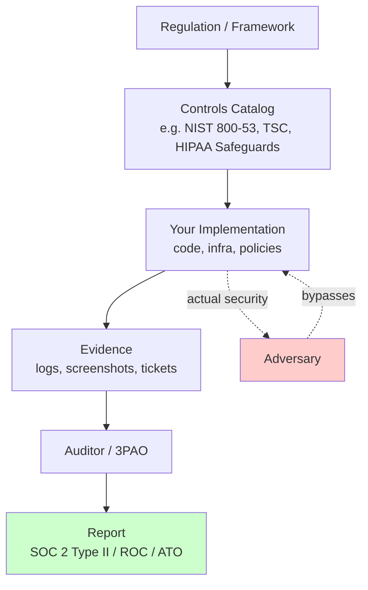
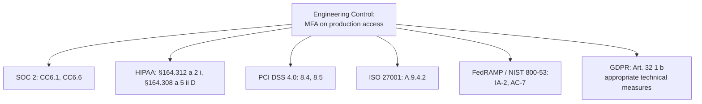

# Compliance: SOC 2 / HIPAA / GDPR / PCI DSS / FedRAMP

## Why This Exists

**Problem.** Compliance frameworks are written by lawyers and auditors, not engineers. They describe *outcomes* ("access to PHI must be restricted to the minimum necessary") and leave the *implementation* to you. Engineers regularly ship systems that pass audit but leak data, or systems that are genuinely secure but fail audit because the evidence trail is missing. Worse, each framework has its own vocabulary for nearly-identical controls — auditors then ask the same question five times in five different forms.

**Key insight.** Compliance is **evidence production at scale**, not security. The technical controls overlap heavily across SOC 2, HIPAA, ISO 27001, PCI DSS, and FedRAMP — encryption, access control, audit logging, vendor management, change management, incident response. What differs is **scope** (whose data, where it lives), **prescriptiveness** (HIPAA "addressable" vs PCI "shall"), and **proof** (auditor's report, BAA, ROC, ATO). Build the controls **once**, map them to **many** frameworks, and automate evidence collection from day one. Trying to add evidence collection retroactively three weeks before audit is the #1 cause of failed audits and burned-out engineers.

**Reach for this when:**
- You're targeting your first SOC 2 Type II and don't know what to instrument.
- You're handling PHI, PCI, or EU personal data and need to know which framework applies.
- An auditor or 3PAO is asking for evidence and you need to know what they actually mean.
- You're choosing AWS / GCP / Azure services and need to know what's "in scope" for a given framework.
- You're being asked "are we compliant?" and need a concrete answer (the answer is almost never a clean yes/no).

**Don't reach for this when:**
- You need *legal* advice on a specific contract, breach disclosure, or jurisdictional question — get a lawyer.
- You're doing **threat modeling** or red-team work — compliance is necessary but insufficient; see `../threat-modeling/`.

---

## Diagrams

### The compliance-vs-security gap



The audit path (A→F) and the security path (C→G) are **different graphs** that share node C. Compliance proves the path A→F. It does **not** prove G can't bypass C.

### Shared responsibility (AWS as example)

```mermaid
flowchart LR
    subgraph CSP["Cloud Provider — OF the cloud"]
        H1[Physical security]
        H2[Hypervisor]
        H3[Managed service runtime]
        H4[Region / AZ availability]
    end
    subgraph Cust["Customer — IN the cloud"]
        C1[IAM policies]
        C2[Data classification]
        C3[Encryption keys & KMS policies]
        C4[Network ACLs / SGs]
        C5[Application code & secrets]
        C6[Logging & monitoring config]
        C7[Patching guest OS / containers]
    end
    CSP -.SOC 2 / FedRAMP / HIPAA BAA covers this.-> Cust
    Cust -.YOU are audited on this.-> Aud[Auditor]
```



Cloud provider's SOC 2 / FedRAMP package is **inherited** evidence — it covers their layer. Your audit covers everything above. Auditors will ask for both.

### Control mapping across frameworks



One technical control → five framework citations. This is why a **control matrix** is your most valuable compliance artifact.

---

## What Each Framework Actually Demands

### SOC 2 (American Institute of CPAs / AICPA)

- **Audience:** B2B SaaS customers asking "can we trust your platform?"
- **Scope:** *Trust Services Criteria* (TSC): Security (mandatory), Availability, Confidentiality, Processing Integrity, Privacy (each optional).
- **Type I vs Type II:** Type I = controls *designed* properly at a point in time. Type II = controls *operating effectively* over a period (typically 6–12 months). **Customers always want Type II.**
- **Output:** A SOC 2 report (the document) by a CPA firm, NOT a certification. Reports under NDA.
- **Engineering reality:** Heavy on access reviews, change management, vendor management, vulnerability management, incident response, formal risk assessments. Surprisingly light on prescriptive technical detail — auditors evaluate whether your controls match your **own stated policies**. This is why "we don't do quarterly access reviews" is fine if your policy doesn't claim you do; once your policy says "quarterly," failing to do it is a finding.

### HIPAA (US health data)

- **Audience:** US HHS / OCR; covered entities and their business associates.
- **Scope:** Protected Health Information (PHI) — anything that ties health info to an identifiable person. 18 HIPAA identifiers.
- **Three rules:** Privacy Rule (use/disclosure), Security Rule (technical/administrative/physical safeguards for ePHI), Breach Notification Rule.
- **"Required" vs "Addressable":** Both are mandatory. "Addressable" means *you may implement an alternative if you document why* — it does NOT mean optional. Auditors will ask for the documented analysis.
- **BAA (Business Associate Agreement):** A required contract between you and any third party that touches PHI. **No BAA → cannot send PHI.** AWS, GCP, Azure, Datadog, Stripe, Twilio offer BAAs but only for **specific services** — using a non-BAA service for PHI is the most common HIPAA violation in startups.
- **Engineering reality:** ePHI must be encrypted at rest and in transit. Audit logs of ePHI access. Minimum-necessary access (RBAC). Workforce training. Break-glass procedures. Sanitization of media.

### GDPR (EU General Data Protection Regulation)

- **Audience:** EU/EEA Data Protection Authorities; applies if you process personal data of people **in the EU/EEA**, regardless of where you are.
- **Scope:** "Personal data" — broader than HIPAA. Includes IP addresses, cookies, device IDs, even pseudonymized data in many cases.
- **Lawful basis:** Every processing activity needs one of six (consent, contract, legal obligation, vital interests, public task, legitimate interests). **Default-on tracking is not consent.**
- **Data subject rights:** Access (Art. 15), rectification (16), erasure / "right to be forgotten" (17), portability (20), object (21). You must respond within **one month**.
- **Cross-border transfers:** Transferring personal data outside the EEA requires a legal mechanism: adequacy decision, Standard Contractual Clauses (SCCs), or Binding Corporate Rules. After Schrems II, **transfers to the US require Transfer Impact Assessments (TIAs)** even with SCCs. The EU-US Data Privacy Framework restored some flow as of July 2023 but is being challenged.
- **Breach notification:** 72 hours to the supervisory authority.
- **Penalties:** Up to **€20M or 4% of global annual revenue, whichever is higher**.
- **Engineering reality:** Data inventory ("ROPA" — Record of Processing Activities), erasure plumbing across all data stores including backups, retention policies enforced in code, region-pinning of EU data, DPIAs for high-risk processing.

### PCI DSS (Payment Card Industry Data Security Standard)

- **Audience:** Card networks (Visa, Mastercard, etc.) via your acquirer.
- **Scope:** **Cardholder data (CHD)** — primary account number (PAN) + any of: cardholder name, expiration, service code. **Sensitive authentication data (SAD)** — CVV, magnetic stripe, PIN — must NEVER be stored after authorization.
- **Levels:** Level 1 (>6M Visa transactions/yr) = Report on Compliance (ROC) by a QSA. Level 2–4 = self-assessment questionnaire (SAQ). The SAQ form (A, A-EP, D, etc.) depends on **how** you handle cards, not how many.
- **Scope reduction is the game:** If you can use Stripe Elements / Braintree iframe / a hosted payment page so the PAN **never touches your servers**, your scope collapses to SAQ A — dramatically cheaper. If you process PANs server-side, you're SAQ D / ROC and you've signed up for network segmentation, quarterly ASV scans, annual pen tests, FIM, IDS, and a lot more.
- **PCI DSS 4.0** (mandatory March 2025) raised the bar: customized approach option, MFA for all access into CDE (not just admin), targeted risk analyses, anti-phishing controls, client-side script integrity for payment pages.
- **Engineering reality:** Tokenize early. Put the CDE on a segmented VPC. Strip PANs from logs *before* they hit log aggregation. Quarterly external ASV scans, annual internal pen tests for ROC.

### FedRAMP (US Federal cloud)

- **Audience:** US Federal agencies; required to sell cloud services to them.
- **Scope:** Cloud Service Offerings (CSOs). Three impact levels: Low, Moderate (most common), High. Built on **NIST SP 800-53** controls (~325 for Moderate).
- **Path:** Either (a) **JAB P-ATO** — sponsored by Joint Authorization Board (DoD, DHS, GSA), most rigorous; or (b) **Agency ATO** — a single agency authorizes you, then others can reuse. (c) **FedRAMP Tailored** for low-impact SaaS.
- **3PAO:** Third-Party Assessment Organization performs the audit. Output = a System Security Plan (SSP), Security Assessment Report (SAR), Plan of Action & Milestones (POA&M).
- **Continuous monitoring:** Monthly vulnerability scans, annual assessments, change requests. This is **continuous**, not one-and-done. Significant changes require approval before deployment.
- **FedRAMP High & ITAR/CMMC:** These often require US persons only, US-region infrastructure (AWS GovCloud, Azure Government), and FIPS 140-2/3 validated cryptography.
- **Engineering reality:** This is the heaviest framework by a wide margin. Plan 18–24 months and a 7-figure budget. Most startups go via an agency ATO sponsor. Many SaaS vendors deploy a **separate FedRAMP environment** rather than try to bring commercial infrastructure into scope.

---

## The Common Core: Controls That Show Up Everywhere

Build these once and you've covered ~70% of every framework. The terminology differs; the implementation does not.

### 1. Audit logging

Every framework requires tamper-resistant audit logs of access to sensitive data and administrative actions. The bar is roughly:

```python
# Idiomatic audit log emission — Python / FastAPI middleware
import json
import time
import uuid
from contextvars import ContextVar
from fastapi import Request, Response

# Tie every log line back to a request and an authenticated principal.
request_id_var: ContextVar[str] = ContextVar("request_id", default="")
principal_var: ContextVar[str] = ContextVar("principal", default="anonymous")

AUDIT_REQUIRED_EVENTS = {
    "auth.login.success",
    "auth.login.failure",
    "auth.mfa.challenge",
    "phi.read",          # HIPAA §164.312(b)
    "phi.write",
    "phi.export",        # downloads need EXTRA scrutiny
    "admin.iam.grant",
    "admin.iam.revoke",
    "config.change",
    "secret.read",       # SOC 2 CC6, PCI 10
}

def emit_audit(event: str, *, subject_id: str | None = None,
               resource: str | None = None, outcome: str = "success",
               extra: dict | None = None) -> None:
    if event not in AUDIT_REQUIRED_EVENTS:
        # Force callers to register events centrally — prevents silent gaps.
        raise ValueError(f"Unregistered audit event: {event}")

    record = {
        "ts": time.time_ns(),                 # nanosecond, not seconds
        "event": event,
        "request_id": request_id_var.get(),
        "principal": principal_var.get(),
        "subject_id": subject_id,             # the data subject (e.g., patient)
        "resource": resource,                 # e.g., "Patient/123/observation/456"
        "outcome": outcome,
        "src_ip": _ip_from_context(),
        "user_agent": _ua_from_context(),
        "extra": extra or {},
    }
    # Write to an append-only sink. CloudWatch Logs with object lock,
    # or a dedicated immutable store. NEVER share the audit log with app logs
    # that engineers can edit/delete.
    _audit_sink.write(json.dumps(record) + "\n")
```

**Non-obvious requirements all five frameworks share:**

- **Append-only / WORM storage.** S3 Object Lock in compliance mode, or Azure immutable blob storage. If an attacker (or a sloppy engineer) can delete logs, you fail SOC 2 CC7.2, HIPAA §164.312(b), PCI 10.5, and NIST AU-9.
- **Time synchronization** (PCI 10.4, NIST AU-8). All hosts must NTP to authoritative sources. "The server clock was wrong" has destroyed audit trails — auditors and incident responders both need correlatable timestamps.
- **Retention.** PCI: 1 year, 90 days online. HIPAA: 6 years. SOC 2: depends on your policy, typically 1 year. FedRAMP: 1–3 years depending on system. **Pick the longest applicable and document it.**
- **What NOT to log:** PANs (PCI 3.4 — never log full PAN). Full SSNs. Passwords or session tokens. Encryption keys. Full request bodies for endpoints that accept PHI. A PII scrubber middleware in front of your log shipper is mandatory.

### 2. Access control

```python
# Minimum-necessary access — HIPAA §164.502(b), SOC 2 CC6.3, PCI 7.1
# Every read of sensitive data must:
#   1. Authenticate the principal
#   2. Authorize against the specific resource (not just "is logged in")
#   3. Emit an audit event
# Wrong: @require_login
# Right: @require_permission("phi.read", resource_owner=...)

from functools import wraps

def require_permission(action: str):
    def decorator(fn):
        @wraps(fn)
        async def wrapper(request: Request, *args, **kwargs):
            principal = request.state.principal
            resource = kwargs.get("resource_id")

            if not _policy.allows(principal, action, resource):
                emit_audit("auth.authz.deny", resource=resource, outcome="denied",
                           extra={"action": action})
                raise HTTPException(403)

            emit_audit(_audit_event_for(action), resource=resource,
                       subject_id=_subject_of(resource))
            return await fn(request, *args, **kwargs)
        return wrapper
    return decorator
```

**Common requirements:**
- **MFA** on all production access and admin consoles (PCI 8.4 / 4.0 made this universal, FedRAMP IA-2(1), HIPAA addressable but practically required, SOC 2 CC6.6).
- **Periodic access reviews.** Quarterly is standard. Documentation of review + remediation is the audit artifact.
- **Joiner/mover/leaver process.** Same-day deprovisioning for terminations is the auditor's favorite question.
- **Least privilege / RBAC.** No "developers can read the production DB" in any framework that matters.
- **Break-glass.** Emergency access must be logged, alerted, and reviewed — not prevented.

### 3. Encryption

| Layer | Requirement | Where it bites |
|---|---|---|
| In transit | TLS 1.2+ (TLS 1.3 preferred); FIPS 140-2/3 validated for FedRAMP | Internal service-to-service often missed |
| At rest | AES-256 typically; key managed in KMS/HSM | Backups, snapshots, queues, search indexes |
| Application-level | "Envelope encryption" of high-sensitivity fields | PHI in databases — encrypt the column, not just the disk |
| Key management | Key rotation, separation of duties, FIPS for FedRAMP | Engineers having direct KMS admin = SoD violation |

PCI 4.0 requires **inventoried** cryptography (which algos, keys, where) — see PCI 12.3.3. This is a real engineering deliverable, not just a policy.

### 4. Vendor management

Every framework asks: "what third parties touch your in-scope data, and how do you assure their controls?"

- Maintain a **vendor register**: name, data shared, processing purpose, jurisdiction, contract date, security review date, SOC 2/ISO/HIPAA evidence.
- **DPAs** for GDPR, **BAAs** for HIPAA, **service provider agreements** for PCI 12.8.
- Annual review at minimum. Auditors *will* ask for the matrix.

### 5. Change management

- All production changes via PR with code review and CI checks.
- Production deploys require a recorded approval (CD pipeline log is fine; a Jira/Taskei ticket linked to the commit is better).
- Emergency change procedure (documented, reviewed retroactively).

This is the easiest control to *implement* and the most commonly *failed* — because it's the one engineers route around in incidents. SOC 2 CC8.1, FedRAMP CM-3, PCI 6.5.

---

## Control Mapping in Practice

Maintain **one canonical control matrix** with rows = your controls, columns = frameworks. Tools that do this: Vanta, Drata, Secureframe (commercial); Cloud Security Alliance CCM (the matrix itself); NIST OSCAL (the data format).

```yaml
# Example fragment of an OSCAL-flavored control matrix (YAML for readability)
controls:
  - id: CTRL-AUDIT-01
    name: "Tamper-resistant audit logging of sensitive data access"
    implementation: |
      All API access to /v1/patients/* emits structured audit events to
      Kinesis stream `audit-prod`, archived to S3 bucket `acme-audit-archive`
      with Object Lock in compliance mode (5-year retention).
    owner: platform-team
    evidence:
      - type: terraform
        path: infra/audit/s3_object_lock.tf
      - type: runbook
        path: runbooks/audit_log_review.md
      - type: automated
        check: cloudwatch_alarm_exists("audit-stream-stalled")
    mappings:
      soc2: [CC6.1, CC7.2]
      hipaa: ["164.312(b)", "164.308(a)(1)(ii)(D)"]
      pci_dss_4: ["10.2", "10.3", "10.5"]
      fedramp_moderate: [AU-2, AU-3, AU-9, AU-11]
      iso_27001: [A.12.4.1, A.12.4.2]
      gdpr: ["Art. 32(1)(b)"]
```

**Why this layout wins:**
1. New framework target = add a column, not redo the work.
2. When a control is *broken*, you immediately see what compliance impact spans.
3. Auditors love this format. Some accept OSCAL natively (FedRAMP is moving this way).

---

## Evidence Automation

The single highest-leverage investment. Manual screenshots → automated, continuous evidence.

```python
# Continuous control monitoring — daily evidence collection job
# Runs as an EventBridge-scheduled Lambda; failures page on-call.
import boto3
from datetime import datetime, timedelta

def check_mfa_universal() -> dict:
    """SOC 2 CC6.6 / PCI 8.4 / NIST IA-2: MFA enforced for all human users."""
    iam = boto3.client("iam")
    users = iam.list_users()["Users"]
    findings = []
    for u in users:
        mfa = iam.list_mfa_devices(UserName=u["UserName"])["MFADevices"]
        if not mfa and not _is_service_account(u):
            findings.append(u["UserName"])
    return {
        "control_id": "CTRL-IAM-MFA-01",
        "checked_at": datetime.utcnow().isoformat(),
        "passed": len(findings) == 0,
        "findings": findings,
        "evidence_artifact": _persist_to_evidence_bucket(...),
    }

def check_s3_public_access() -> dict:
    """Block public access on all buckets (SOC 2 CC6.1, HIPAA, every framework)."""
    s3 = boto3.client("s3")
    findings = []
    for b in s3.list_buckets()["Buckets"]:
        try:
            cfg = s3.get_public_access_block(Bucket=b["Name"])["PublicAccessBlockConfiguration"]
            if not all(cfg.values()):
                findings.append(b["Name"])
        except s3.exceptions.NoSuchPublicAccessBlockConfiguration:
            findings.append(b["Name"])
    return _result("CTRL-S3-PUBLIC-01", findings)

# Persist results to an immutable bucket. Auditors get read-only access.
# This becomes the "control operated effectively over the period" evidence
# without any humans taking screenshots.
```

Map this to AWS-native services:
- **Config Rules** for resource posture.
- **Security Hub** for aggregated findings + framework mappings (it ships with PCI, NIST 800-53, CIS, AWS FSBP packs).
- **Audit Manager** to package evidence into framework-specific reports.
- **Access Analyzer** for IAM unused access + external access findings.

---

## "Compliant" vs "Secure"

This is the most important distinction in this skill.

| Compliant | Secure |
|---|---|
| Your *documented* controls match the framework | Your *actual* controls stop adversaries |
| Auditor can verify evidence | Threat model has been considered and mitigated |
| Backward-looking (period of performance) | Forward-looking (next attack) |
| Driven by certification deadlines | Driven by risk |
| You can buy your way to it (auditors, tools, consultants) | You earn it via engineering and red-teaming |

**Real cases of "compliant but not secure":**
- **Capital One (2019, ~106M records).** PCI-compliant, SOC compliant. SSRF on a misconfigured WAF read instance metadata, exfil'd S3 data. Compliance does not catch architecture-level flaws.
- **Equifax (2017, ~147M records).** Apache Struts CVE went unpatched for months despite a documented patch management policy. Policy existed; execution didn't. Audits look at policies and samples; an unsampled host bit them.
- **Anthem (2015, ~78M PHI records).** HIPAA-compliant. Phishing → Active Directory → 90 days of data exfil. HIPAA does not require modern endpoint detection or 24/7 SOC.
- **SolarWinds (2020).** SOC 2 Type II compliant. Build pipeline compromised. SOC 2 doesn't deeply assess software supply chain integrity (this is improving in 4.0/CC9 era).

**Real cases of "secure but not compliant":**
- A startup with mTLS everywhere, hardware-backed keys, formal threat models, but no quarterly access review evidence and no formal vendor matrix → fails SOC 2 Type II.
- An OSS project with stellar code review, no central log archive → fails most audits.

**The takeaway.** Treat compliance as a *floor*, not a ceiling. Run a real security program (threat modeling, pentests, red team, bug bounty, secure SDLC, detection engineering) and let compliance fall out as evidence. The reverse — security as evidence-collection — produces the breaches above.

---

## Trade-offs

| Benefit | Cost |
|---|---|
| Unblocks enterprise / regulated sales | 6–18 months of engineering time per framework, ongoing % of every team |
| Forces a baseline of security hygiene | Can crowd out higher-leverage security work (real threat mitigation) |
| Reduces blast radius via segmentation, encryption, RBAC | Operational friction (change management slows incident response if not designed well) |
| One control matrix amortizes across many frameworks | Tooling lock-in (Vanta/Drata/Secureframe become hard to leave) |
| Continuous evidence reduces audit-time pain to days | Requires up-front investment in observability, IaC, and config-as-code |
| Customer trust signal | "Compliance theater" risk — passing audit while remaining insecure |
| Limits regulatory liability | Doesn't prevent breach; doesn't always reduce penalty post-breach |

---

## Common Pitfalls

- **Treating compliance as a project, not a program.** Audits recur annually. Controls must operate continuously, not just before the auditor arrives.
- **Scope sprawl.** Letting PHI / PAN / federal data leak into systems that weren't designed for it. Once it's there, the scope has expanded and you may be out of compliance retroactively. **Tokenize and isolate at the edge.**
- **Logging the regulated data itself.** PANs in stack traces. PHI in error messages. Customer emails in URL paths captured by access logs. Build a PII scrubber and enforce it in CI.
- **No BAA / no DPA.** Sending PHI to a vendor without a BAA, or EU personal data without a DPA + SCCs, is an immediate framework violation regardless of how secure the vendor is.
- **"Addressable" ≠ optional.** HIPAA addressable specifications still require either implementation or documented risk-based justification. Auditors specifically probe this gap.
- **Ignoring backups in erasure plumbing.** GDPR Art. 17 erasure has to flow through to backups eventually. Most teams' backups are immutable and untouchable. Document the retention overlap and the policy.
- **Stale SSP.** FedRAMP SSPs drift from reality. The 3PAO will find every place your architecture diagram lies. Treat the SSP like code with a change-control process.
- **Confusing AWS/GCP/Azure compliance with yours.** The CSP's HIPAA-eligible service list is *not* a license — you still need a BAA with the CSP, you still need to use the service correctly, and many services on the list are *not* HIPAA-eligible (e.g., not all AWS regions, not all features).
- **Auditor-driven engineering.** Doing things solely because "the auditor wants it" leads to ceremony without security. Push back when an audit suggestion makes the system worse; offer a compensating control with evidence.
- **One person bus factor.** The "compliance person" leaves and nobody else knows what's in the SOC 2 report. The control matrix and evidence pipeline must be owned by engineering, not by one human.
- **Cross-border data without thinking.** A `us-east-1` Postgres with EU users' data is a Schrems II problem. Region-pin EU data; document the legal mechanism for any transfer.
- **Pen test theater.** Annual external pen tests with 5-day scope and no white-box access miss real risks. Pair compliance pen tests with continuous internal red team / purple team work.
- **Skipping the data inventory.** You cannot protect, encrypt, retain, or erase data you cannot find. Data discovery (Macie, BigID, Symmetry) is foundational; most teams skip it and pay later in DSARs.

---

## Decision Table

| Situation | Framework(s) you need | Notes |
|---|---|---|
| Selling B2B SaaS to mid-market US enterprises | SOC 2 Type II (Security TSC at minimum) | Often a hard gate. Add Confidentiality if customer asks. |
| Storing or processing PHI | HIPAA + (usually) SOC 2 | HIPAA alone rarely satisfies enterprise procurement; pair with SOC 2 or HITRUST. |
| Processing EU/EEA personal data | GDPR | Applies regardless of where you are. Add UK GDPR if UK users. |
| Processing payment cards | PCI DSS (level depends on volume; SAQ depends on architecture) | **Tokenize via Stripe/Braintree** if at all possible — collapses scope. |
| Selling to US Federal agencies | FedRAMP (Moderate typical) | 18+ months. Often run a separate environment in GovCloud / Azure Gov. |
| Selling to DoD / handling CUI | FedRAMP + CMMC 2.0 | More restrictive than commercial FedRAMP. |
| EU public sector / EU sovereignty concerns | GDPR + considering EUCS, regional cloud (Sovereign Cloud) | Watch the EUCS final form; sovereignty pressure rising. |
| Healthcare in EU | GDPR + national rules (e.g., Germany BDSG, France HDS hosting certification) | Don't assume GDPR is enough; member states layer on. |
| California consumer-facing app | CCPA / CPRA (often satisfied by GDPR-grade implementation) | Plus state-level laws across US (VA, CO, CT, etc.). |
| ISO 27001 vs SOC 2 (non-US enterprise customers) | ISO 27001 preferred in EU/APAC; SOC 2 in US | Heavy control overlap; do once, map both. |
| Children's data | COPPA (US, <13) / GDPR Art. 8 (EU, <16 default) | Special consent flows. |
| Critical infrastructure / financial services | Sector-specific (NYDFS 23 NYCRR 500, FFIEC, NERC CIP, NIS2 in EU) | Layered on top of SOC 2 / ISO. |

---

## Implementation Sequence (the order that doesn't burn you out)

1. **Asset & data inventory.** What sensitive data exists, where, classification, owner. Without this, every later step is wrong.
2. **Identity baseline.** SSO + MFA on everything human; service account hygiene; least-privilege IAM.
3. **Network segmentation.** Production isolated from corp. CDE / regulated zones isolated from general production.
4. **Encryption baseline.** TLS everywhere internally (mTLS or service mesh); KMS-managed keys at rest; BYOK only when required (it's expensive).
5. **Audit logging plumbing.** Append-only, time-synced, scrubbed, retained per longest applicable rule. Centralized.
6. **Change management baseline.** PR + review + automated checks + recorded deploy approval.
7. **Vendor register + DPAs/BAAs/SPAs.** Before SOC 2 fieldwork starts.
8. **Vulnerability management.** SCA, SAST, DAST, container/host scanning; SLAs by severity; ASV scans for PCI.
9. **Incident response.** Documented runbook, tabletop exercise, breach-notification flow with legal.
10. **Continuous evidence collection.** Audit Manager / Vanta / Drata / custom — automate from day one.
11. **Pen test + risk assessment.** Annual minimum; more for PCI / FedRAMP.
12. **Engage auditor.** Type I first if greenfield, then 6–12 months of evidence, then Type II.

Trying to do these in parallel with a dozen engineers in month one ends in burnout. Sequence matters.

---

## References

Primary sources first; vendor mappings second. Where I'm not 100% sure of a stable URL, I cite by title.

**Frameworks (canonical):**
- AICPA — *Trust Services Criteria (TSC)* — https://www.aicpa-cima.com/resources/landing/system-and-organization-controls-soc-suite-of-services
- AICPA — *SOC 2® Reporting on an Examination of Controls at a Service Organization* (Description Criteria DC-200) — https://www.aicpa-cima.com/topic/audit-assurance/audit-and-assurance-greater-than-soc-2
- HHS — *HIPAA Security Rule (45 CFR §164.302–§164.318)* — https://www.hhs.gov/hipaa/for-professionals/security/laws-regulations/index.html
- HHS — *HIPAA Privacy Rule* — https://www.hhs.gov/hipaa/for-professionals/privacy/laws-regulations/index.html
- EU — *Regulation (EU) 2016/679 (GDPR)* — https://eur-lex.europa.eu/eli/reg/2016/679/oj
- European Data Protection Board — *Guidelines, Recommendations, Best Practices* — https://edpb.europa.eu/our-work-tools/general-guidance/guidelines-recommendations-best-practices_en
- PCI Security Standards Council — *PCI DSS v4.0.1* — https://www.pcisecuritystandards.org/document_library/
- PCI SSC — *Self-Assessment Questionnaire Instructions and Guidelines* — https://www.pcisecuritystandards.org/document_library/?category=saqs
- FedRAMP — *Program Documentation, Templates, SSP* — https://www.fedramp.gov/documents-templates/
- NIST — *SP 800-53 Rev. 5 — Security and Privacy Controls* — https://csrc.nist.gov/publications/detail/sp/800-53/rev-5/final
- NIST — *SP 800-66 Rev. 2 — Implementing the HIPAA Security Rule* — https://csrc.nist.gov/publications/detail/sp/800-66/rev-2/final
- NIST — *SP 800-171 Rev. 3 — Protecting CUI* — https://csrc.nist.gov/publications/detail/sp/800-171/rev-3/final
- ISO/IEC — *27001:2022 — Information security management systems* — https://www.iso.org/standard/27001
- US DoD — *CMMC 2.0 Program* — https://dodcio.defense.gov/CMMC/

**Cross-walks and tooling standards:**
- Cloud Security Alliance — *Cloud Controls Matrix (CCM)* — https://cloudsecurityalliance.org/research/cloud-controls-matrix/
- NIST — *OSCAL — Open Security Controls Assessment Language* — https://pages.nist.gov/OSCAL/
- Secure Controls Framework — *SCF* — https://www.securecontrolsframework.com/
- HITRUST — *Common Security Framework* — https://hitrustalliance.net/

**Cloud provider compliance pages (the inherited evidence side):**
- AWS — *Compliance Programs* — https://aws.amazon.com/compliance/programs/
- AWS — *Services in Scope by Compliance Program* — https://aws.amazon.com/compliance/services-in-scope/
- AWS — *HIPAA Eligible Services Reference* — https://aws.amazon.com/compliance/hipaa-eligible-services-reference/
- AWS — *Shared Responsibility Model* — https://aws.amazon.com/compliance/shared-responsibility-model/
- Google Cloud — *Compliance Resource Center* — https://cloud.google.com/security/compliance
- Microsoft — *Service Trust Portal* — https://servicetrust.microsoft.com/

**Engineering depth (the "how" rather than the "what"):**
- Heather Adkins, Betsy Beyer, et al. — *Building Secure and Reliable Systems* (Google, free) — https://sre.google/books/building-secure-reliable-systems/
- Beyer, Jones, Petoff, Murphy (eds.) — *Site Reliability Engineering* — https://sre.google/sre-book/table-of-contents/ (chapters on access control, change management, post-mortem culture)
- Martin Kleppmann — *Designing Data-Intensive Applications*, ch. 5 (replication, retention) and ch. 11 (stream processing, often relevant for audit pipelines)
- AWS Builders' Library — https://aws.amazon.com/builders-library/ (operational rigor patterns referenced by SOC 2 auditors)
- OWASP — *Application Security Verification Standard (ASVS)* — https://owasp.org/www-project-application-security-verification-standard/ (maps cleanly to many SOC 2 / PCI app-layer controls)
- CIS — *Critical Security Controls v8* — https://www.cisecurity.org/controls
- ENISA — *Guidelines for SMEs on Security of Personal Data Processing* — https://www.enisa.europa.eu/

**Court of Justice of the EU rulings that shape engineering decisions:**
- *Schrems II* (Case C-311/18, 2020) — https://curia.europa.eu/juris/document/document.jsf?docid=228677 (TIA / SCC implications)

---

## See Also

- `../threat-modeling/` — STRIDE, attack trees; what compliance audits do **not** catch.
- `../audit-logging/` — append-only sinks, WORM storage, log integrity.
- `../../reliability/incident-response/` — runbooks, tabletop, breach notification flows.
- `../secrets-management/` — Vault, KMS, secret rotation; SoD.
- `../vulnerability-management/` — SCA / SAST / DAST / container scanning + SLAs.
