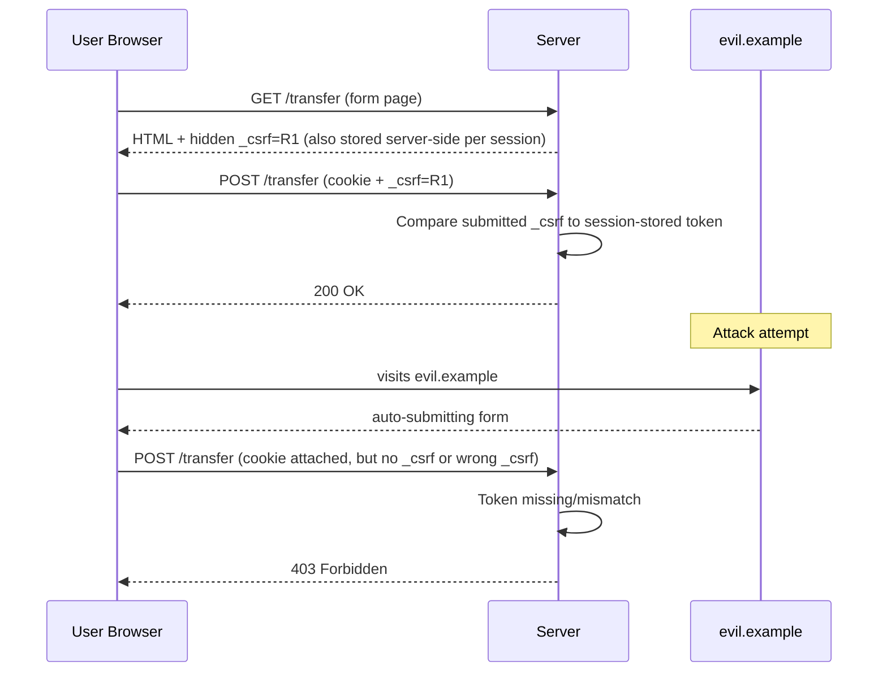
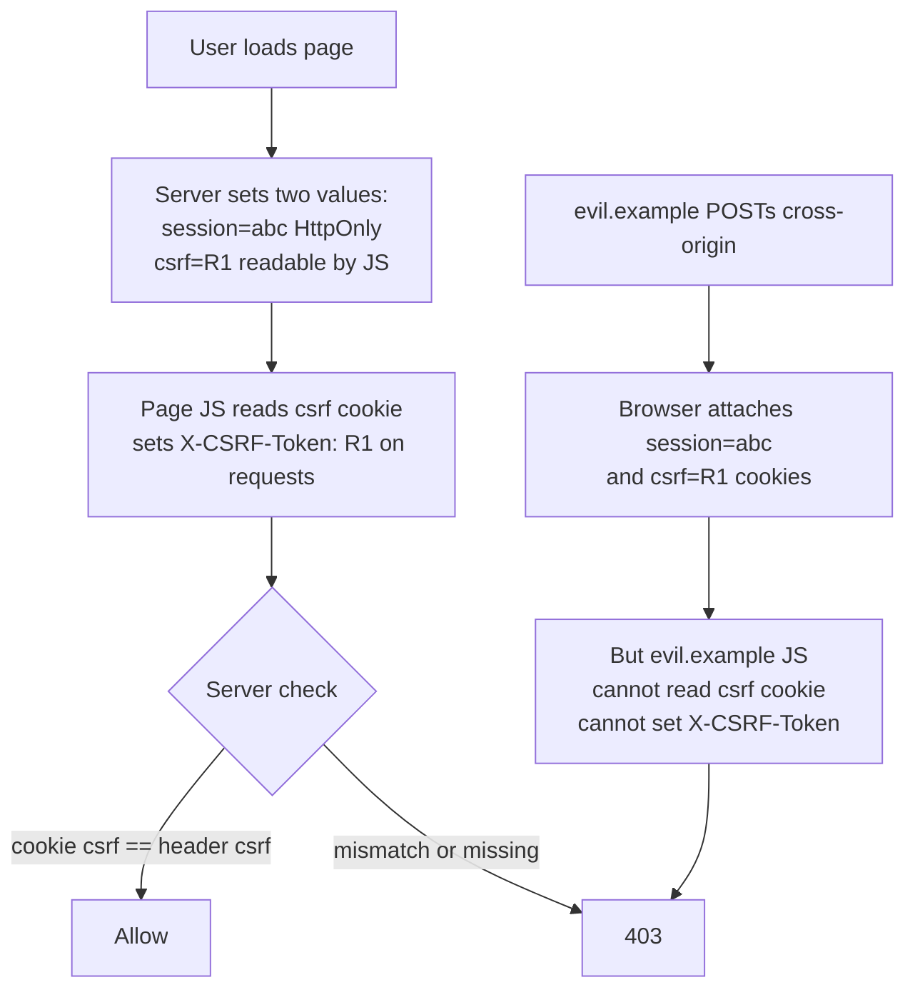

# CSRF — Cross-Site Request Forgery

## Why This Exists

**Problem.** A user is logged into `bank.example` (cookie-based session). They visit `evil.example` in another tab. The evil page contains:

```html
<form action="https://bank.example/transfer" method="POST">
  <input name="to" value="attacker">
  <input name="amount" value="10000">
</form>
<script>document.forms[0].submit()</script>
```

The browser **automatically attaches `bank.example`'s session cookie** to the cross-origin POST. The bank's server sees an authenticated request and processes it. The user never clicked anything meaningful. This is CSRF.

**Key insight.** The browser's ambient authority — cookies, HTTP Basic auth, NTLM, client certs, and Windows-integrated auth — is attached to **every** request to a target origin, regardless of which origin initiated it. **Same-Origin Policy (SOP) blocks the attacker from *reading* the response, but it does not block the request from being *sent*.** CSRF exploits the gap: the attacker doesn't need to read the response, only cause the side effect.

The defense, therefore, is not "stop the request from being sent" (you can't, fully) but **"refuse to act on requests that the user did not knowingly initiate from your origin."** Two complementary mechanisms achieve this:

1. **The browser refusing to attach cookies on cross-site contexts** — SameSite cookies. (Defense in depth, default-on in modern browsers.)
2. **The server requiring a token / header that an attacker's cross-origin page cannot forge** — synchronizer token, double-submit, or custom-header-with-CORS-preflight.

You need both. SameSite alone has gaps (subdomain takeovers, sibling-site attacks, browsers that don't enforce, the Lax/two-minute POST grace window in Chromium for top-level navigation). Tokens alone fail if you ship them to an XSS-prone page.

### Reach for this when

- You serve **state-changing endpoints** (POST/PUT/PATCH/DELETE, or GET that mutates — but don't do that) authenticated by **cookies, HTTP Basic, NTLM, or client certs**.
- You have **server-rendered forms** with cookie sessions (Rails, Django, Spring MVC, Laravel, ASP.NET, classic PHP).
- You have an **SPA that uses cookies for auth** (e.g. `HttpOnly` session cookie, even if combined with a JWT-in-cookie pattern).
- You're auditing a **legacy app** and want a checklist.
- You're deciding **SameSite=Lax vs Strict** for your session cookie.

### Don't reach for this when

- **Pure bearer-token APIs**: tokens delivered via `Authorization: Bearer …` header from an SPA, never stored in a cookie. The browser does not auto-attach `Authorization` headers cross-site, so CSRF is not the threat — **XSS** is. Don't bolt CSRF tokens on top; you'll get cargo cult middleware and a false sense of safety.
- **Server-to-server APIs** (no browser involved). Sign requests; CSRF is a browser-only attack.
- You think CORS solves this. **It does not.** See "Common Pitfalls."

## Diagrams

### The attack

```mermaid
sequenceDiagram
    participant U as User Browser
    participant B as bank.example
    participant E as evil.example

    U->>B: POST /login (creds)
    B-->>U: Set-Cookie session=abc (HttpOnly)
    Note over U,B: User authenticated

    U->>E: GET / (different tab)
    E-->>U: HTML with auto-submitting form
    Note over U: <form action="bank.example/transfer">

    U->>B: POST /transfer (cookie auto-attached)
    Note over U,B: Browser sends session=abc
    B-->>U: 200 OK — money transferred
    Note over B: Server cannot tell this<br/>was not user-initiated
```



### Synchronizer token defense



### Double-submit cookie



## The Defense Stack

You want **layered defenses**, not a single silver bullet. The recommended stack for a cookie-authenticated app:

1. **SameSite=Lax (or Strict)** on session cookies — kills the easy form-POST and `` attacks at the browser layer.
2. **A token defense** (synchronizer token for SSR, double-submit or custom-header-with-preflight for SPAs) — backstops gaps in SameSite.
3. **Origin / Referer header validation** as cheap defense in depth on state-changing endpoints.
4. **Don't allow GET to mutate state.** Ever. GET should be safe and idempotent (RFC 9110 §9.2.1).
5. **Re-authentication** for high-value actions (password change, transfer over $threshold) — independent of CSRF defenses.

### 1. SameSite cookies

`Set-Cookie: session=abc; HttpOnly; Secure; SameSite=Lax; Path=/`

Three values:

| Value | Cookie sent on… | Default since |
|---|---|---|
| `Strict` | Same-site requests **only**. Top-level navigation from another site does not get the cookie. | — |
| `Lax` | Same-site requests, **plus top-level GET navigations** (clicking a link). Not on cross-site POST, iframe loads, ``, `<script>`, `fetch`. | Chrome 80 (Feb 2020); Firefox; Edge. |
| `None` | All requests, including cross-site. **Requires `Secure`.** | (opt-in for cross-site cookies) |

**Pick `Lax` for session cookies unless you have a specific reason for Strict.** `Strict` breaks the common UX of a user clicking a link from email or another site and arriving logged in — they'll appear logged out until they navigate within your site once.

**Gotchas with SameSite:**

- **Chromium's two-minute Lax-by-default grace window**: until ~Chrome 91, top-level POST navigations from `<form>` were *temporarily* allowed within 2 minutes of cookie set if `SameSite` was unset (not explicitly `Lax`). **Always set `SameSite` explicitly.**
- **Subdomain attacks**: `evil.bank.example` is *same-site* with `bank.example`. If an attacker controls any subdomain (XSS, subdomain takeover, vendor-hosted page), `SameSite=Lax` does not protect you. Use `__Host-` cookie prefix to scope strictly.
- **`SameSite=None` without `Secure`** is rejected by modern browsers.
- **Older browsers don't enforce.** As of 2024, IE11 and some embedded webviews ignore `SameSite`. Treat SameSite as defense in depth, not as your *only* defense.
- **iOS Safari ITP** has historically had quirky cookie behavior; test on real devices.

### 2. Synchronizer token pattern (server-rendered)

The canonical pattern. Server generates a per-session (or per-request) random token, embeds it in every form, and validates on submit.

```python
# Flask example — see also Django's middleware which does this automatically
import secrets
from flask import Flask, session, request, abort, render_template_string

app = Flask(__name__)
app.secret_key = "..."  # signs the session cookie

def csrf_token():
    if "_csrf" not in session:
        # 32 bytes = 256 bits. Use a CSPRNG. NEVER use random.random() or time-based.
        session["_csrf"] = secrets.token_urlsafe(32)
    return session["_csrf"]

@app.before_request
def check_csrf():
    if request.method in ("POST", "PUT", "PATCH", "DELETE"):
        submitted = request.form.get("_csrf") or request.headers.get("X-CSRF-Token")
        expected = session.get("_csrf")
        # secrets.compare_digest is constant-time — prevents timing attacks
        if not expected or not submitted or not secrets.compare_digest(expected, submitted):
            abort(403, "CSRF token missing or invalid")

@app.route("/transfer", methods=["GET"])
def transfer_form():
    return render_template_string("""
        <form method="POST" action="/transfer">
          <input type="hidden" name="_csrf" value="{{ token }}">
          <input name="to"> <input name="amount">
          <button>Send</button>
        </form>
    """, token=csrf_token())

@app.route("/transfer", methods=["POST"])
def do_transfer():
    # CSRF already validated in before_request
    return "transferred"
```

**Properties of a good token:**

- **Cryptographically random**, ≥128 bits (256 recommended). `secrets.token_urlsafe`, `crypto.randomBytes`, `SecureRandom`.
- **Tied to the user's session**. A token issued to user A must not be valid for user B's session.
- **Compared in constant time** to prevent timing oracles (`secrets.compare_digest`, `crypto.timingSafeEqual`).
- **Rotated on login / privilege change** to prevent session fixation interactions.
- **Not put in URLs**. URLs leak via Referer headers, browser history, server logs.

Per-request tokens are stronger than per-session but cause UX problems with multi-tab and back-button. Per-session is the OWASP-recommended default.

### 3. Double-submit cookie pattern (SPA-friendly, stateless)

Useful when you don't have server-side session storage and don't want to add it just for CSRF. Server sends two values: an `HttpOnly` session cookie (auth) and a **non-`HttpOnly`** CSRF cookie that JS can read. The SPA reads the CSRF cookie and echoes it in a custom header on every state-changing request.

```typescript
// Server (Express) — naive double-submit (vulnerable variant — see signed version below)
import express from "express";
import cookieParser from "cookie-parser";
import crypto from "node:crypto";

const app = express();
app.use(cookieParser());
app.use(express.json());

app.use((req, res, next) => {
  if (!req.cookies.csrf) {
    const token = crypto.randomBytes(32).toString("base64url");
    // NOT HttpOnly — JS must read it
    // SameSite=Lax still applies; Secure in prod
    res.cookie("csrf", token, { sameSite: "lax", secure: true, path: "/" });
  }
  next();
});

app.use((req, res, next) => {
  if (!["POST", "PUT", "PATCH", "DELETE"].includes(req.method)) return next();
  const cookie = req.cookies.csrf;
  const header = req.get("X-CSRF-Token");
  if (!cookie || !header) return res.status(403).send("CSRF missing");
  // constant-time compare
  const a = Buffer.from(cookie);
  const b = Buffer.from(header);
  if (a.length !== b.length || !crypto.timingSafeEqual(a, b)) {
    return res.status(403).send("CSRF mismatch");
  }
  next();
});
```

```typescript
// Client SPA — read the cookie and echo it
function getCookie(name: string): string | undefined {
  return document.cookie.split("; ").find(c => c.startsWith(name + "="))?.split("=")[1];
}

await fetch("/api/transfer", {
  method: "POST",
  credentials: "include",
  headers: {
    "Content-Type": "application/json",
    "X-CSRF-Token": getCookie("csrf") ?? "",
  },
  body: JSON.stringify({ to, amount }),
});
```

**Why this works:** the attacker's cross-origin page can cause the browser to attach the `csrf` cookie to a request, but it **cannot read the cookie** (Same-Origin Policy on `document.cookie`) and therefore cannot set `X-CSRF-Token` to match. The server requires both to be equal.

**Why naive double-submit is insufficient on its own.** If the attacker can set a cookie on the victim's browser for your domain (via subdomain takeover, an XSS on `*.example.com`, a misconfigured `Set-Cookie` from a sibling app, or an MITM on HTTP), they can plant a known `csrf` value and then send a request with `X-CSRF-Token: <known>`. **Use signed (HMAC) double-submit** to prevent this:

```typescript
// Signed double-submit: server-issued tokens contain HMAC of session id
// Pseudocode — adapt to your framework
function issueToken(sessionId: string, secret: string): string {
  const random = crypto.randomBytes(16).toString("base64url");
  const mac = crypto.createHmac("sha256", secret).update(`${sessionId}:${random}`).digest("base64url");
  return `${random}.${mac}`;
}

function verifyToken(token: string, sessionId: string, secret: string): boolean {
  const [random, mac] = token.split(".");
  if (!random || !mac) return false;
  const expected = crypto.createHmac("sha256", secret).update(`${sessionId}:${random}`).digest("base64url");
  const a = Buffer.from(mac);
  const b = Buffer.from(expected);
  return a.length === b.length && crypto.timingSafeEqual(a, b);
}
```

The token is cryptographically bound to the session id. An attacker who plants a cookie can't forge a valid HMAC without the server-side secret, and a token issued for session A is invalid against session B.

### 4. Origin / Referer header validation

Every same-origin browser request to your state-changing endpoint includes either `Origin` or `Referer` (`fetch`/`XHR` always send `Origin`; form POSTs send `Referer` and recently `Origin`). Validate it.

```python
ALLOWED_ORIGINS = {"https://app.example.com", "https://example.com"}

def origin_ok(req):
    origin = req.headers.get("Origin") or req.headers.get("Referer", "").split("/", 3)[:3]
    if not origin:
        # Strict mode: reject when neither header present
        # Some legacy clients / proxies strip Referer; tune for your audience
        return False
    if isinstance(origin, list):
        origin = "/".join(origin)
    return origin in ALLOWED_ORIGINS
```

**Use as defense in depth, not your only defense:**
- Some corporate proxies / privacy tools strip `Referer`.
- `Origin` is reliable on modern browsers (Chrome 76+, Firefox 70+ send it on same-origin POSTs too) but old browsers may not.
- Trivially defeated if attacker controls a subdomain you trust.

### 5. SPA-with-bearer-tokens path (skip CSRF entirely, focus on XSS)

If your API is purely `Authorization: Bearer …` and the token lives in `localStorage`/`sessionStorage` or memory:

- **No CSRF risk** — the browser does not auto-attach `Authorization` headers across origins, and `localStorage` is per-origin.
- **Massive XSS risk** — any script execution on your origin steals the token.
- **CORS becomes the boundary** for who can call your API from a browser. Not CSRF middleware.

The "cookie auth" vs "bearer token" debate is really a CSRF-vs-XSS tradeoff. Cookies + `HttpOnly` + CSRF defense survives XSS-token-theft but needs CSRF defense. Bearer tokens skip CSRF but die hard to XSS. There is no free lunch.

A common middle ground: **JWT in `HttpOnly` cookie + double-submit token + strict CSP**. Survives XSS-token-theft *and* defeats CSRF. Costs: complexity, can't easily access token from JS for non-cookie scenarios (logging, error reports).

### 6. CORS is not a CSRF defense

This is the most common misunderstanding. State the facts:

- **CORS controls whether the browser exposes the *response* to JS on another origin.** It does not prevent the request from being sent (with the exception of preflighted requests, see below).
- **"Simple requests"** (GET, HEAD, POST with `Content-Type: application/x-www-form-urlencoded`, `multipart/form-data`, or `text/plain`) are sent **without preflight**. The server processes the request before the browser even decides whether to expose the response. The side effect already happened.
- The attacker doesn't need to read the response. They need the side effect (transfer, password change, role grant). They get it.

**One narrow case where CORS *does* help:** if your endpoint requires a non-simple `Content-Type` (e.g. `application/json`) **or** a custom header (e.g. `X-Requested-With`), the browser will send a **preflight `OPTIONS`** request. A preflight that the server rejects (no `Access-Control-Allow-Origin: evil.example`) blocks the actual request from being sent. This is the basis of the "**custom-header CSRF defense**":

```typescript
// Server: only accept JSON on state-changing endpoints; require X-Requested-With
app.post("/api/*", (req, res, next) => {
  if (!req.is("application/json")) return res.status(415).end();
  if (req.get("X-Requested-With") !== "XMLHttpRequest") return res.status(403).end();
  next();
});
```

This works because:
- An attacker's `<form>` cannot send `Content-Type: application/json` (only the three "simple" content types).
- A `fetch` from `evil.example` with `Content-Type: application/json` triggers a preflight, which fails CORS.
- Therefore no cross-origin `POST` with a JSON body reaches your handler.

**This is a legitimate technique** (OWASP lists it under "Custom Request Headers"), but it's brittle: misconfigure CORS to be permissive (`Access-Control-Allow-Origin: *` with credentials, or echoing arbitrary `Origin`) and you've created a hole. Combine with a token defense.

## Server-rendered vs SPA: which defense?

| Scenario | Recommended primary | Plus | Notes |
|---|---|---|---|
| Server-rendered forms (Rails, Django, Spring MVC) | Synchronizer token in form | SameSite=Lax cookies, Origin check | Framework usually does this for you. **Don't disable it** without replacing it. |
| SPA + cookie session | Signed double-submit OR custom-header-with-preflight | SameSite=Lax, strict CSP | If you're already preflighting via JSON content-type + custom header, you can lean on that as primary. |
| SPA + bearer token in `Authorization` | **Skip CSRF defense.** Don't add cookies. | Strict CSP, short token TTL, refresh token rotation | The threat is XSS, not CSRF. |
| SPA + JWT in `HttpOnly` cookie | Signed double-submit | SameSite=Lax, strict CSP | Best of both worlds, more moving parts. |
| Mobile app calling API | None needed | Mutual TLS or token signing | Browsers aren't involved. |
| Webhook receiver (no user session) | None needed | HMAC signature on payload | Not a CSRF scenario. |

## Trade-offs

| Benefit | Cost |
|---|---|
| **SameSite=Lax** kills 95% of CSRF with one cookie attribute. | Doesn't protect against subdomain attackers; not enforced on legacy browsers; some link-arrival UX flows break for `Strict`. |
| **Synchronizer token** is the strongest, most widely supported defense. | Requires server-side state; awkward for stateless APIs and pure SPAs; per-request rotation breaks multi-tab/back-button. |
| **Double-submit (naive)** is stateless, easy to retrofit. | Vulnerable if attacker can set cookies on your domain (subdomain XSS, MITM on HTTP, sibling app misconfig). Use **signed** double-submit. |
| **Custom-header + JSON-only** leverages existing CORS preflight. | Fragile if CORS gets misconfigured; doesn't help endpoints that accept `application/x-www-form-urlencoded`. |
| **Origin/Referer check** is cheap and works without per-request state. | Some clients/proxies strip headers; bypassed by trusted-subdomain attacker. |
| **Re-authentication for high-value actions** is bulletproof for those endpoints. | UX friction; doesn't scale to every action. |
| **`__Host-` cookie prefix + path=/** scopes cookies tightly. | Path-scoped cookies don't work for some setups; `__Host-` requires `Secure` and no `Domain`. |

## Common Pitfalls

- **"We have CORS, so we're safe from CSRF."** No. CORS gates response exposure, not request emission. A "simple" cross-origin POST happens before CORS decides anything. Re-read the spec.
- **`Access-Control-Allow-Origin: *` with `Allow-Credentials: true`.** Forbidden by spec, but if you reflect `Origin` arbitrarily and set credentials true, you've built the equivalent: any site can make authenticated calls. This *creates* CSRF.
- **CSRF tokens in URLs.** Leak via Referer, server logs, browser history, screen-sharing screenshots, browser sync. Use form fields or headers.
- **CSRF token comparison via `==`** in non-constant-time languages — timing oracle. Use `secrets.compare_digest` / `crypto.timingSafeEqual` / `MessageDigest.isEqual`.
- **GET endpoints that mutate state** (`/logout`, `/delete?id=42`). `` is a one-liner CSRF. RFC 9110 §9.2.1 — GET is safe. Period.
- **Disabling CSRF middleware "just for this endpoint"** because it's "internal" or "for the mobile app." The mobile app sends a custom `User-Agent`? An attacker controls the User-Agent header in the *browser* via `fetch`'s headers… no, actually browsers forbid setting User-Agent — but they *don't* forbid most headers, and exemptions become CSRF holes. Don't carve exceptions; route mobile to a separate endpoint with bearer auth.
- **Login CSRF.** An attacker logs the *victim* into the *attacker's* account, then watches what the victim does (saves a credit card to the attacker's account, links Google Drive, etc.). Defense: CSRF-protect the login form too. Many apps skip it because "the user has no session yet" — wrong threat model.
- **Subdomain trust.** `marketing.example.com` (vendor-hosted Webflow site, no security review) on the same registrable domain as `app.example.com`. XSS or full takeover of marketing → set cookies for `.example.com` → bypass `SameSite=Lax`. Use `__Host-` prefix on session cookies.
- **`SameSite=None` without `Secure`.** Browsers reject. Cookie effectively missing. Now your auth is broken in production but works on `localhost`. Test cross-browser, with HTTPS.
- **Disabling CSRF for AJAX because "the framework doesn't add the token to fetch."** Fix the JS fetch wrapper to inject `X-CSRF-Token`, don't disable the defense.
- **Multi-tab token rotation.** If you use per-request tokens, opening the same form in two tabs invalidates one. Either use per-session tokens, or accept a small token window, or rotate token in client after each successful submit.
- **GraphQL endpoints.** A single endpoint accepting `application/json` POSTs — easy to forget CSRF. If it requires JSON Content-Type and is preflighted, the custom-header defense applies. Verify the actual request shape; some clients use `application/graphql` or batched POSTs.
- **File-upload endpoints with `multipart/form-data`** are "simple" requests in CORS terms. They DO trigger CSRF. Don't assume "uploads are special."

## Decision Table

| Question | If YES → | If NO → |
|---|---|---|
| Does the endpoint authenticate via cookies, HTTP Basic, or NTLM? | CSRF defense required. | CSRF likely irrelevant; focus on bearer-token threats. |
| Is your app server-rendered with forms? | **Synchronizer token** (framework default). | See SPA row. |
| Is your app an SPA with cookie auth? | **Signed double-submit** OR **custom-header + JSON-only with preflight**. | See bearer-token row. |
| Does the endpoint require `Content-Type: application/json` AND a custom header? | Custom-header preflight defense applies; can be primary. | Need an explicit token defense. |
| Do you control all subdomains tightly? | `SameSite=Lax` is strong. | Use `__Host-` prefix; don't rely on SameSite alone. |
| Is the action high-value (money, password, account deletion)? | Add **re-authentication** regardless of CSRF token. | Token defense is sufficient. |
| Is GET ever used for state changes? | **Fix that first.** Migrate to POST/PUT/DELETE. | Continue. |
| Do you support browsers without SameSite enforcement? | Token defense is mandatory, SameSite is bonus. | SameSite is meaningful defense in depth. |
| Is the endpoint cookie-authenticated AND public-CORS (`Allow-Credentials: true` from third-party origins)? | **Stop.** This is dangerous. Audit origin allowlist and tighten. | Standard defenses apply. |
| Login flow accepts session for unauthenticated user? | Still CSRF-protect (login CSRF). | Continue. |

## References

- OWASP — Cross-Site Request Forgery Prevention Cheat Sheet — https://cheatsheetseries.owasp.org/cheatsheets/Cross-Site_Request_Forgery_Prevention_Cheat_Sheet.html
- OWASP — Session Management Cheat Sheet — https://cheatsheetseries.owasp.org/cheatsheets/Session_Management_Cheat_Sheet.html
- MDN — SameSite cookies — https://developer.mozilla.org/en-US/docs/Web/HTTP/Headers/Set-Cookie/SameSite
- MDN — Cross-Origin Resource Sharing (CORS) — https://developer.mozilla.org/en-US/docs/Web/HTTP/CORS
- RFC 6265bis — Cookies: HTTP State Management Mechanism — https://datatracker.ietf.org/doc/html/draft-ietf-httpbis-rfc6265bis (defines `SameSite`, `__Host-`)
- RFC 9110 §9.2.1 — Safe Methods (HTTP Semantics) — https://www.rfc-editor.org/rfc/rfc9110#section-9.2.1
- RFC 6749 §10.12 — OAuth 2.0 Cross-Site Request Forgery — https://datatracker.ietf.org/doc/html/rfc6749#section-10.12
- Chromium Project — SameSite Updates — https://www.chromium.org/updates/same-site/
- Google — Building Secure and Reliable Systems, ch. 6–8 (Design for Understandability / Defense in Depth) — https://sre.google/books/building-secure-reliable-systems/
- Django docs — Cross Site Request Forgery protection — https://docs.djangoproject.com/en/stable/ref/csrf/
- Spring Security — CSRF Protection — https://docs.spring.io/spring-security/reference/features/exploits/csrf.html
- Rails Guides — Securing Rails Applications: CSRF Countermeasures — https://guides.rubyonrails.org/security.html#cross-site-request-forgery-csrf
- Barth, Jackson, Mitchell — Robust Defenses for Cross-Site Request Forgery (CCS '08) — https://seclab.stanford.edu/websec/csrf/csrf.pdf  (the canonical academic treatment; introduced Origin header and analyzed double-submit)
- WHATWG Fetch Standard — CORS protocol — https://fetch.spec.whatwg.org/#http-cors-protocol

## See Also

- `../xss/` — XSS, the threat that defeats every CSRF token (an attacker with script execution on your origin can read tokens, set headers, and impersonate the user).
- `../authn/` — cookie attributes (`HttpOnly`, `Secure`, `__Host-`), session fixation, idle/absolute timeouts.
- `../authn/` — bearer tokens vs cookies, JWT-in-cookie patterns, refresh token rotation.
- `../oauth-oidc/` — OAuth state parameter is CSRF defense for the redirect flow (RFC 6749 §10.12).
- `../../communication/SKILL.md` — designing safe HTTP semantics: GET-is-safe, idempotency keys, command/query separation.
